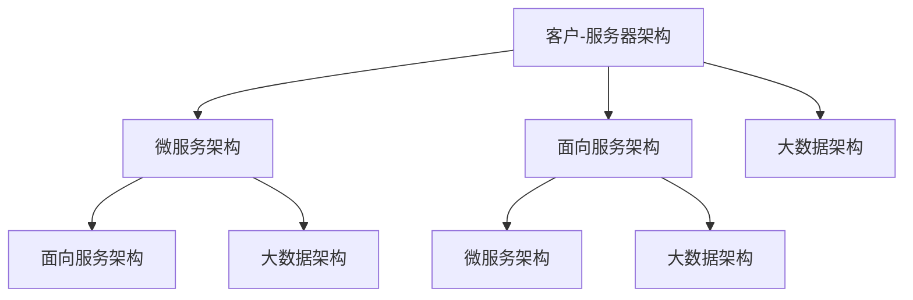
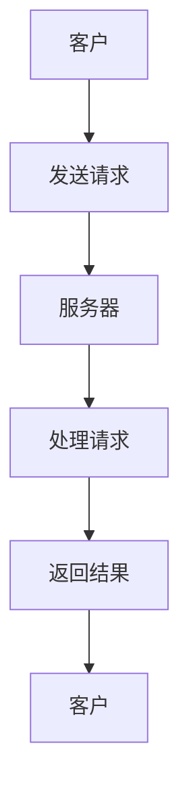
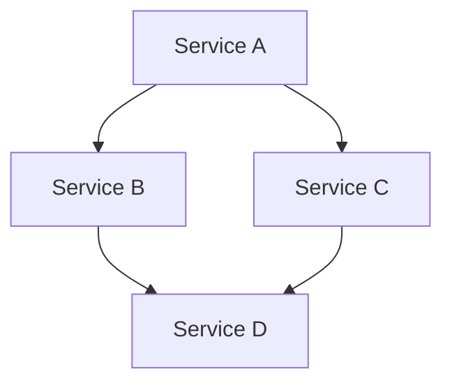
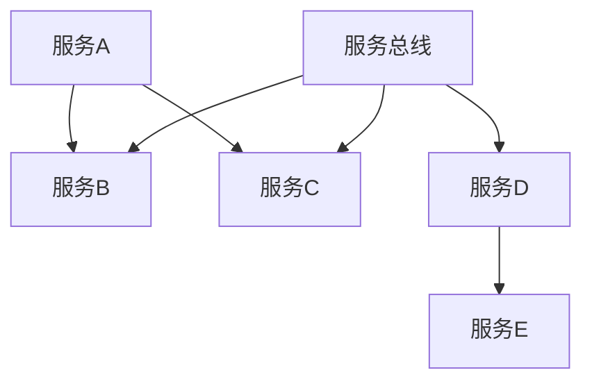
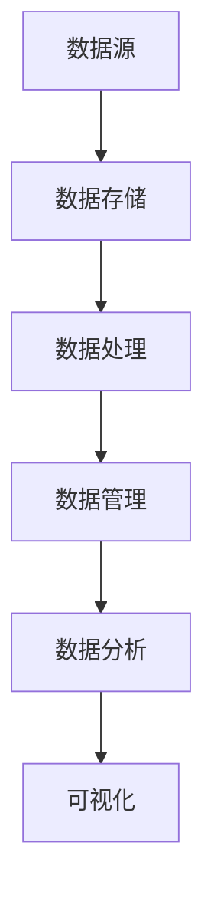
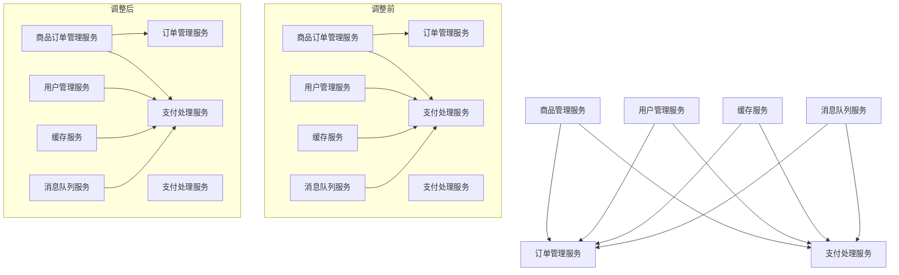
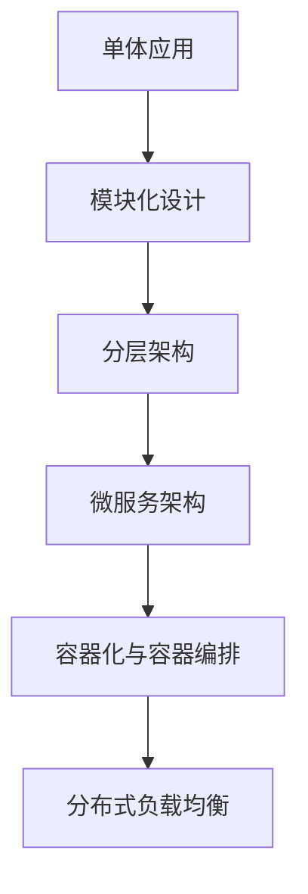

                 

### 1.1 软件架构模式简介

软件架构模式（Software Architecture Patterns）是软件工程中用于指导软件设计的一类结构化方法。它们提供了一组已验证的架构风格、组件和连接件，帮助开发人员在构建软件系统时，选择合适的设计模式，以解决常见的设计问题。

#### 1.1.1 软件架构模式的重要性

软件架构模式在软件开发中扮演着至关重要的角色。首先，它们有助于提高软件系统的可维护性和可扩展性，通过提供通用的解决方案，减少因重复设计导致的错误。其次，软件架构模式能够加速开发过程，通过复用现有的设计模式，降低设计和实现的时间成本。最后，它们还能够提升软件系统的性能和可靠性，通过选择适合特定场景的架构模式，优化系统结构和功能分布。

#### 1.1.2 软件架构模式分类与联系

软件架构模式可以根据不同的分类标准进行划分。常见的一种分类方式是基于架构风格，例如：面向对象、面向服务、事件驱动、分布式等。以下是几种主要架构模式及其之间的关系：

1. **客户-服务器架构**（Client-Server Architecture）
   - **定义**：客户-服务器架构是一种分布式计算模型，其中客户机请求服务器提供服务，服务器响应请求。
   - **关系**：客户-服务器架构是大多数现代应用系统的基本架构模式，其它架构模式通常在其基础上进行扩展。

2. **微服务架构**（Microservices Architecture）
   - **定义**：微服务架构是将应用程序拆分为一组小型、独立的服务，每个服务都专注于完成一个特定的功能。
   - **关系**：微服务架构是对客户-服务器架构的进一步拆分和独立化，以实现更高的灵活性和可扩展性。

3. **面向服务架构**（Service-Oriented Architecture，SOA）
   - **定义**：面向服务架构是一种基于服务的系统设计方法，通过服务组件的互操作来实现应用程序的功能。
   - **关系**：SOA是面向对象架构的一种扩展，它强调服务之间的松耦合和标准化的接口。

4. **大数据架构**（Big Data Architecture）
   - **定义**：大数据架构是一种用于处理和分析大规模数据的系统设计方法，通常涉及分布式计算和数据存储技术。
   - **关系**：大数据架构通常使用分布式计算模型，如MapReduce，来处理海量数据。

#### Mermaid流程图：软件架构模式分类与联系

为了更好地理解上述架构模式之间的关系，我们可以使用Mermaid流程图来展示它们的基本结构和联系：



在这个流程图中，每个节点代表一种架构模式，箭头表示它们之间的联系。通过这个图，我们可以清晰地看到不同架构模式之间的继承和扩展关系。

在接下来的章节中，我们将详细探讨这些架构模式的核心概念、原理和实际应用。希望读者能够通过本节的学习，对软件架构模式有一个初步的了解，并能够在后续的学习中，深入掌握每种架构模式的精髓。### 1.2 软件架构模式的核心概念

在深入探讨软件架构模式之前，我们需要明确几个核心概念，以便为后续的讨论奠定基础。这些核心概念包括软件架构的定义、软件架构模式的重要性以及它们在实际软件开发中的应用。

#### 1.2.1 软件架构的定义

软件架构（Software Architecture）可以定义为软件系统的高层次设计，它定义了系统的整体结构和组件之间的相互作用。软件架构不仅仅关注组件的具体实现，还涉及到组件之间的通信、数据流、功能分布和系统性能等方面。它提供了系统的全局视图，使开发人员能够更好地理解系统的复杂性和设计意图。

软件架构通常通过一组抽象的概念和模型来表示，这些模型包括组件（Components）、接口（Interfaces）、连接器（Connectors）和约束（Constraints）。这些模型共同构成了软件架构的基础框架，指导开发人员的设计和实现过程。

#### 1.2.2 软件架构模式的重要性

软件架构模式的重要性在于它们提供了一种结构化的方法，帮助开发人员在面对复杂的设计问题时，能够快速找到有效的解决方案。以下是一些关键点：

1. **复用性**：软件架构模式是经过验证的，它们可以在多个项目中重复使用，减少了重复设计的工作量。
2. **可维护性**：通过遵循软件架构模式，可以确保系统的设计具有良好的可维护性，易于理解、修改和扩展。
3. **可扩展性**：软件架构模式提供了模块化和灵活的架构风格，使系统在需求变化时能够轻松扩展。
4. **性能优化**：正确的软件架构模式能够优化系统的性能和响应速度，提高系统的吞吐量和可靠性。

#### 1.2.3 软件架构模式在实际软件开发中的应用

在实际软件开发中，软件架构模式的应用可以分为以下几个阶段：

1. **需求分析**：在项目初期，通过对需求的深入分析，选择适合项目的架构模式，确保系统能够满足需求。
2. **设计阶段**：在详细设计阶段，根据选定的架构模式，定义系统的组件和接口，设计系统的架构框架。
3. **实现阶段**：在编码阶段，遵循架构设计，实现系统的各个组件和连接器，确保系统符合预定的架构风格。
4. **测试和优化**：在系统测试阶段，验证架构的有效性，并根据测试结果进行必要的优化。

#### 伪代码：软件架构设计流程

以下是一个简化的伪代码，用于描述软件架构设计的基本流程：

```pseudo
function DesignSoftwareArchitecture(requirments):
    # 需求分析
    analyzeRequirements(requirments)

    # 选择架构模式
    selectedPattern = SelectArchitecturePattern()

    # 定义组件和接口
    components = DefineComponents(selectedPattern)
    interfaces = DefineInterfaces(components)

    # 设计连接器和约束
    connectors = DefineConnectors(components, interfaces)
    constraints = DefineConstraints(selectedPattern, connectors)

    # 实现架构
    implementArchitecture(components, interfaces, connectors, constraints)

    # 测试和优化
    testAndOptimizeArchitecture()

    return architecture
```

在这个伪代码中，`DesignSoftwareArchitecture` 函数接受一组需求作为输入，并返回一个设计好的软件架构。这个过程包括需求分析、选择架构模式、定义组件和接口、设计连接器和约束、实现架构以及测试和优化。

通过上述核心概念的解释和伪代码示例，我们可以更好地理解软件架构模式的基本原理和实际应用。在接下来的章节中，我们将详细探讨几种常见的软件架构模式，帮助读者深入了解它们的核心概念和应用场景。希望读者能够通过这一部分的学习，对软件架构模式有一个更为全面和深刻的认识。### 2.1 客户-服务器架构

客户-服务器架构（Client-Server Architecture）是最常用的软件架构模式之一，尤其在网络应用系统中扮演着核心角色。本节将详细介绍客户-服务器架构的基本概念、工作原理以及其在实际应用中的重要性。

#### 2.1.1 客户-服务器架构的定义

客户-服务器架构是一种分布式计算模型，其中客户机（Client）和服务器（Server）通过网络进行通信。客户机是用户接口的一部分，负责向服务器发送请求，并接收来自服务器的响应。服务器则是数据处理和资源管理的一部分，负责处理客户的请求，并返回结果。

#### 2.1.2 工作原理

在客户-服务器架构中，基本的工作原理如下：

1. **请求与响应**：客户机向服务器发送请求，请求中包含需要执行的操作和必要的数据。服务器接收到请求后，执行相应的操作，并将结果返回给客户机。
2. **网络通信**：客户机与服务器之间的通信通常通过网络协议（如HTTP、HTTPS、TCP/IP等）进行。这些协议定义了数据的传输格式和通信规则。
3. **并发处理**：服务器可以同时处理多个客户的请求，这通过多线程或多进程实现。并发处理提高了系统的性能和响应能力。

#### 2.1.3 客户-服务器架构的优点

客户-服务器架构具有以下优点：

1. **可扩展性**：客户-服务器架构可以轻松扩展以处理更多用户和更高负载。通过增加服务器数量，可以提高系统的处理能力。
2. **灵活性**：客户-服务器架构允许服务器和客户机在不同的硬件和软件环境中运行，提供了良好的灵活性。
3. **可靠性**：通过将数据处理和用户接口分离，客户-服务器架构提高了系统的可靠性和容错性。

#### Mermaid流程图：客户端与服务器交互流程

为了更好地理解客户-服务器架构的交互流程，我们可以使用Mermaid流程图来展示客户端与服务器之间的通信过程：



在这个流程图中，客户（A）向服务器（C）发送请求（B），服务器接收请求并处理（D），然后将结果返回给客户（E）。这个简化的流程图展示了客户-服务器架构的基本交互模式。

#### 伪代码：客户端请求处理过程

为了进一步说明客户端请求处理过程，我们可以使用伪代码来描述客户端发送请求和服务器处理请求的基本步骤：

```pseudo
function ClientRequest(url, requestData):
    # 创建HTTP请求
    request = CreateHttpRequest(url, requestData)

    # 发送请求到服务器
    response = SendRequest(request)

    # 解析响应结果
    result = ParseResponse(response)

    # 返回处理结果
    return result

function ServerHandleRequest(request):
    # 获取请求参数
    parameters = GetRequestParameters(request)

    # 处理请求
    result = ProcessRequest(parameters)

    # 返回处理结果
    return result
```

在这个伪代码中，`ClientRequest` 函数负责创建HTTP请求、发送请求到服务器并解析响应结果。`ServerHandleRequest` 函数负责获取请求参数、处理请求并返回结果。

#### 实际应用

客户-服务器架构广泛应用于各种网络应用系统中，例如：

1. **Web应用**：Web服务器处理客户的HTTP请求，返回HTML页面、图片、视频等资源。
2. **数据库应用**：客户端通过SQL语句向数据库服务器发送查询请求，服务器执行查询并返回结果。
3. **邮件系统**：邮件客户端与邮件服务器通信，发送和接收邮件消息。

通过上述介绍，我们可以看到客户-服务器架构在软件系统设计中的重要性。它不仅提供了灵活性和可扩展性，还通过明确的请求与响应机制，提高了系统的可靠性和性能。在接下来的章节中，我们将继续探讨其他常见的软件架构模式，帮助读者全面了解软件架构设计的方法和技巧。希望读者能够通过这一部分的学习，对客户-服务器架构有更深入的理解。### 2.2 微服务架构

微服务架构（Microservices Architecture）是近年来在软件开发中逐渐流行的一种架构风格。它将大型单体应用拆分成一组小型、独立的、分布式服务，每个服务都专注于实现一个特定的业务功能。本节将详细介绍微服务架构的基本概念、优点和在实际开发中的应用。

#### 2.2.1 微服务架构的定义

微服务架构（Microservices Architecture）是一种基于业务领域划分的、服务化的架构风格。在这种架构中，应用程序被拆分为多个独立的服务，每个服务都是一个小型、独立的应用，可以独立部署、扩展和升级。这些服务通过轻量级的通信协议（如HTTP、REST、gRPC等）进行交互。

微服务架构的核心特征包括：

1. **独立性**：每个微服务都是独立的，可以独立开发、测试和部署，降低系统的耦合度。
2. **松耦合**：服务之间通过定义良好的接口进行通信，服务间的依赖性较低，便于维护和扩展。
3. **分布式**：微服务架构是一种分布式架构，服务可以部署在不同的服务器或容器上，提高了系统的可扩展性和容错性。

#### 2.1.2 微服务架构的优点

微服务架构具有以下优点：

1. **可扩展性**：微服务架构允许开发者独立扩展每个服务，根据实际需求调整资源分配，提高系统的整体性能。
2. **灵活性**：由于每个服务都是独立的，可以采用不同的编程语言、数据库和数据存储方案，灵活满足不同的业务需求。
3. **可维护性**：每个服务都是小型的、独立的单元，便于开发和维护，降低了系统的复杂度。
4. **快速迭代**：微服务架构支持快速迭代和部署，通过独立部署和更新每个服务，减少了系统下线时间和风险。

#### Mermaid流程图：微服务交互模式

为了更好地理解微服务架构的交互模式，我们可以使用Mermaid流程图来展示多个微服务之间的通信过程：



在这个流程图中，服务A、B、C和D通过定义良好的接口进行交互。服务A向服务B和服务C发送请求，服务B和服务C处理请求后，将结果返回给服务A。服务B同时向服务D发送请求。这个简化的流程图展示了微服务架构的基本交互模式。

#### 伪代码：服务注册与发现

在微服务架构中，服务注册与发现是关键的一环，它确保了服务之间能够正常通信。以下是一个简化的伪代码，描述了服务注册与发现的基本步骤：

```pseudo
function ServiceRegister(serviceInfo):
    # 将服务信息注册到服务注册中心
    RegisterToServiceRegistry(serviceInfo)

function ServiceDiscover(serviceName):
    # 从服务注册中心获取服务信息
    serviceInfo = GetServiceInfoFromRegistry(serviceName)

    # 返回服务地址和端口
    return serviceInfo.address, serviceInfo.port

function ServiceCall(serviceName, requestData):
    # 通过服务发现获取服务地址和端口
    address, port = ServiceDiscover(serviceName)

    # 创建HTTP请求
    request = CreateHttpRequest(address, port, requestData)

    # 发送请求到服务
    response = SendRequest(request)

    # 解析响应结果
    result = ParseResponse(response)

    # 返回处理结果
    return result
```

在这个伪代码中，`ServiceRegister` 函数用于将服务信息注册到服务注册中心，`ServiceDiscover` 函数用于获取指定服务的地址和端口，`ServiceCall` 函数用于通过HTTP请求调用其他服务。

#### 实际应用

微服务架构在许多现代应用系统中得到了广泛应用，例如：

1. **电子商务平台**：电子商务平台通常采用微服务架构，将用户管理、订单处理、支付处理等功能拆分成多个独立的微服务，以提高系统的可扩展性和可维护性。
2. **银行系统**：银行系统采用微服务架构，将账户管理、交易处理、风险控制等功能拆分成多个微服务，以实现快速迭代和部署。
3. **社交媒体平台**：社交媒体平台采用微服务架构，将用户关系管理、内容发布、数据存储等功能拆分成多个微服务，以提高系统的性能和可扩展性。

通过上述介绍，我们可以看到微服务架构在软件开发中的重要性。它不仅提供了灵活性和可扩展性，还通过独立的服务单元，降低了系统的复杂度和维护成本。在接下来的章节中，我们将继续探讨其他常见的软件架构模式，帮助读者全面了解软件架构设计的方法和技巧。希望读者能够通过这一部分的学习，对微服务架构有更深入的理解。### 2.3 面向服务架构（SOA）

面向服务架构（Service-Oriented Architecture，SOA）是一种以服务为基本构建块的组织和集成系统的方法。SOA强调服务之间的松耦合、标准化的接口以及跨平台和技术的互操作性。本节将详细介绍面向服务架构的基本概念、核心组件、服务模型以及其在实际应用中的重要性。

#### 2.3.1 SOA的定义

面向服务架构（SOA）是一种基于服务的系统设计方法，它通过定义一系列服务组件，以实现系统的功能。SOA中的“服务”是指能够执行特定业务功能、可以跨网络访问的模块化组件。这些服务通过标准化的接口进行通信，从而实现了系统的灵活性和可扩展性。

SOA的核心特点包括：

1. **服务独立性**：每个服务都是独立的、可重用的组件，可以独立开发、部署和升级。
2. **松耦合**：服务之间通过定义良好的接口进行通信，服务间的依赖性较低，降低了系统的复杂度。
3. **标准化接口**：SOA使用标准化的协议和数据格式，如SOAP、REST、WSDL等，以确保服务之间的互操作性。
4. **跨平台和跨技术**：SOA可以在不同的硬件、操作系统和编程语言中实现，支持跨平台和跨技术的集成。

#### 2.3.2 SOA的核心组件

SOA的核心组件包括服务（Services）、服务容器（Service Containers）、服务注册中心（Service Registry）和服务总线（Service Bus）。以下是这些组件的详细介绍：

1. **服务（Services）**：服务是SOA的基本构建块，它提供特定的业务功能，可以通过网络访问。服务通常通过接口进行暴露，接口定义了服务能够执行的操作和返回的数据格式。
2. **服务容器（Service Containers）**：服务容器是运行和托管服务的环境，它负责管理服务的生命周期、负载均衡和容错。
3. **服务注册中心（Service Registry）**：服务注册中心用于存储和检索服务的元数据，如服务名称、接口、版本和位置等信息。服务启动时，会将自身注册到服务注册中心，以便其他服务能够发现和调用。
4. **服务总线（Service Bus）**：服务总线是服务之间的通信枢纽，它负责协调服务之间的交互，处理服务之间的消息传递、路由和转换。

#### 2.3.3 SOA的服务模型

SOA的服务模型通常包括以下几种类型：

1. **业务服务**：业务服务直接实现具体的业务功能，如订单处理、客户关系管理、支付处理等。
2. **数据服务**：数据服务负责数据的存储、检索和更新，如数据库、数据仓库等。
3. **元数据服务**：元数据服务提供关于服务、数据和其他资源的元数据信息，如服务描述、数据模型等。
4. **基础服务**：基础服务提供底层功能，如身份验证、授权、日志记录等。

#### Mermaid流程图：服务编排与集成

为了更好地理解SOA的服务模型和组件之间的关系，我们可以使用Mermaid流程图来展示服务编排与集成的过程：



在这个流程图中，服务A、B、C和D通过服务总线进行通信和集成。服务总线负责协调服务之间的交互，处理消息的路由和转换。这个简化的流程图展示了SOA的基本服务模型和集成方式。

#### 伪代码：服务调用与响应

为了进一步说明SOA的服务调用过程，我们可以使用伪代码来描述服务调用和服务响应的基本步骤：

```pseudo
function CallService(serviceName, requestData):
    # 通过服务注册中心获取服务地址和接口信息
    serviceInfo = GetServiceInfoFromRegistry(serviceName)

    # 创建HTTP请求
    request = CreateHttpRequest(serviceInfo.address, serviceInfo.port, requestData)

    # 发送请求到服务
    response = SendRequest(request)

    # 解析响应结果
    result = ParseResponse(response)

    # 返回处理结果
    return result

function ServiceResponse(serviceName, requestData):
    # 获取请求参数
    parameters = GetRequestParameters(requestData)

    # 处理请求
    result = ProcessRequest(parameters)

    # 创建响应消息
    response = CreateResponseMessage(result)

    # 返回响应消息
    return response
```

在这个伪代码中，`CallService` 函数用于调用其他服务，`ServiceResponse` 函数用于处理服务请求并返回响应。

#### 实际应用

面向服务架构在实际应用中具有广泛的应用场景，以下是一些常见的应用实例：

1. **企业资源规划（ERP）系统**：ERP系统通常采用SOA架构，将不同功能模块（如财务、人力资源、供应链等）拆分成独立的服务，以提高系统的灵活性和可扩展性。
2. **客户关系管理（CRM）系统**：CRM系统采用SOA架构，将客户信息管理、销售管理、营销管理等功能拆分成独立的服务，以支持快速业务变化和扩展。
3. **物联网（IoT）应用**：在物联网应用中，SOA架构有助于实现不同设备和平台之间的数据共享和互操作，如智能家居、智能城市等。

通过上述介绍，我们可以看到面向服务架构在软件系统设计中的重要性。它通过定义服务组件和标准化的接口，实现了系统的灵活性和可扩展性，为复杂系统的开发和维护提供了有力支持。在接下来的章节中，我们将继续探讨其他常见的软件架构模式，帮助读者全面了解软件架构设计的方法和技巧。希望读者能够通过这一部分的学习，对面向服务架构有更深入的理解。### 2.4 大数据架构

大数据架构（Big Data Architecture）是处理和分析海量数据的一种系统设计方法。随着数据量的爆炸性增长，传统的数据处理方法已无法满足现代业务的需求。大数据架构通过分布式计算和数据存储技术，实现对大规模数据的高效处理和分析。本节将详细介绍大数据架构的基本概念、核心组件以及实际应用。

#### 2.4.1 大数据架构的定义

大数据架构是一种分布式计算和数据存储架构，旨在处理和分析大规模数据集。它通常涉及以下关键组件：

1. **数据源**：数据源可以是各种数据生成者，如物联网设备、社交媒体平台、企业内部系统等。
2. **数据存储**：大数据架构使用分布式数据存储系统，如Hadoop HDFS、HBase、Cassandra等，这些系统支持海量数据的存储和访问。
3. **数据处理**：大数据架构使用分布式计算框架，如Apache Spark、MapReduce等，这些框架能够高效地处理大规模数据。
4. **数据管理**：大数据架构包括数据管理组件，如数据仓库、数据湖、元数据管理等，这些组件负责数据的存储、检索和管理。
5. **数据分析和可视化**：大数据架构支持数据分析和可视化工具，如Tableau、PowerBI等，这些工具帮助用户从海量数据中提取有价值的信息。

#### 2.4.2 大数据架构的核心组件

大数据架构的核心组件包括数据源、数据存储、数据处理、数据管理和数据分析和可视化。以下是这些组件的详细介绍：

1. **数据源**：数据源是大数据架构的起点，数据可以来自各种渠道，如传感器、网站日志、社交媒体等。数据源的类型和数量决定了大数据系统的复杂性和处理能力。
2. **数据存储**：大数据架构使用分布式数据存储系统，这些系统具有高可靠性和可扩展性，能够存储和处理海量数据。常见的分布式数据存储系统包括Hadoop HDFS、HBase、Cassandra等。
3. **数据处理**：分布式计算框架是大数据架构的核心，它能够高效地处理大规模数据。常见的分布式计算框架包括Apache Spark、MapReduce等。这些框架支持批处理和实时处理，能够满足不同类型的数据处理需求。
4. **数据管理**：数据管理组件负责数据的存储、检索和管理。数据仓库和数据湖是常见的两种数据管理组件，数据仓库主要用于存储结构化数据，而数据湖则支持各种类型的数据存储。
5. **数据分析和可视化**：数据分析和可视化工具帮助用户从海量数据中提取有价值的信息。常见的工具包括Tableau、PowerBI等，这些工具支持数据的可视化、报表生成和实时监控。

#### 2.4.3 Mermaid流程图：数据处理流程

为了更好地理解大数据架构的处理流程，我们可以使用Mermaid流程图来展示数据处理的基本步骤：



在这个流程图中，数据源（A）将数据写入数据存储（B），数据处理（C）对数据进行处理和分析，数据管理（D）负责数据存储和管理，数据分析（E）从数据中提取有价值的信息，最后通过可视化（F）展示结果。

#### 2.4.4 伪代码：数据处理流水线

为了进一步说明数据处理流水线的实现，我们可以使用伪代码来描述数据处理的基本步骤：

```pseudo
function BigDataPipeline(dataSource, processingSteps):
    # 从数据源读取数据
    data = ReadDataFromSource(dataSource)

    # 对数据进行处理
    for step in processingSteps:
        data = ProcessData(data, step)

    # 存储处理结果
    StoreData(data)

    # 返回处理结果
    return data
```

在这个伪代码中，`BigDataPipeline` 函数负责整个数据处理流水线的执行。首先从数据源（`dataSource`）读取数据，然后按照指定的处理步骤（`processingSteps`）对数据进行处理，处理完成后将结果存储到数据存储中，并返回处理结果。

#### 实际应用

大数据架构在许多实际应用中发挥着重要作用，以下是一些常见的应用场景：

1. **物联网（IoT）应用**：物联网应用产生大量实时数据，大数据架构能够高效地处理和分析这些数据，帮助实现智能设备管理和远程监控。
2. **金融领域**：金融领域的数据量巨大，大数据架构能够帮助金融机构实时分析交易数据、风险数据和市场数据，提高业务决策的准确性和效率。
3. **医疗健康**：医疗健康领域的数据量庞大，大数据架构能够处理和分析患者的医疗记录、基因数据等，帮助实现个性化医疗和疾病预测。

通过上述介绍，我们可以看到大数据架构在处理和分析海量数据中的重要性。它通过分布式计算和数据存储技术，实现了对大规模数据的高效处理和分析，为现代业务提供了强大的支持。在接下来的章节中，我们将继续探讨其他常见的软件架构模式，帮助读者全面了解软件架构设计的方法和技巧。希望读者能够通过这一部分的学习，对大数据架构有更深入的理解。### 3.1 架构风格选择原则

在软件开发过程中，选择合适的架构风格至关重要。不同的架构风格适用于不同的项目需求和场景，选择正确的架构风格能够提高系统的可维护性、可扩展性和性能。以下是架构风格选择的一些关键原则。

#### 3.1.1 软件需求分析

软件需求分析是架构风格选择的首要步骤。通过详细的需求分析，可以明确系统的功能需求、性能需求、安全性需求等。需求分析的结果将直接影响架构风格的选择。

1. **功能需求**：确定系统的核心功能模块，分析这些模块之间的依赖关系和数据流。例如，如果系统需要高度的可扩展性，可能需要选择微服务架构。
2. **性能需求**：根据性能需求，选择适合的架构风格。例如，如果系统需要处理大量并发请求，可能需要选择分布式架构，以提高系统的吞吐量和响应速度。
3. **安全性需求**：考虑系统的安全性需求，选择能够满足安全要求的架构风格。例如，如果系统需要实现强身份验证和访问控制，可能需要选择面向服务架构（SOA）。

#### 3.1.2 技术选型与评估

在确定了软件需求后，需要根据项目的技术环境和技术栈进行架构风格的选择。以下是一些关键考虑因素：

1. **技术栈兼容性**：确保所选的架构风格与项目现有的技术栈兼容，避免引入额外的技术复杂度。
2. **技术成熟度**：选择成熟稳定的技术和框架，降低项目风险。对于新兴的技术，需要进行充分的评估和验证，以确保其适用于项目需求。
3. **开发效率**：考虑架构风格对开发效率的影响。一些架构风格，如微服务架构，可能需要更多的开发和运维工作，但能够提供更高的灵活性和可扩展性。

#### 3.1.3 架构风格评估与优化

在选择了初步的架构风格后，还需要对架构风格进行评估和优化。以下是一些评估和优化的策略：

1. **性能评估**：通过负载测试和性能分析，评估架构风格对系统性能的影响。根据评估结果，对架构进行必要的调整和优化。
2. **可维护性评估**：通过代码审查和架构分析，评估架构的可维护性。如果发现架构存在可维护性问题，需要进行相应的优化和重构。
3. **安全性评估**：对架构进行安全性评估，确保系统满足安全要求。如果发现安全漏洞，需要及时修复和加强安全措施。

#### 伪代码：架构风格评估与优化策略

以下是一个简化的伪代码，用于描述架构风格评估与优化的基本步骤：

```pseudo
function EvaluateArchitectureStyle(architectureStyle, requirements, technicalStack):
    # 评估架构风格与需求的一致性
    consistency = CheckConsistency(architectureStyle, requirements)

    # 评估架构风格与技术栈的兼容性
    compatibility = CheckCompatibility(architectureStyle, technicalStack)

    # 评估架构风格的性能
    performance = AssessPerformance(architectureStyle)

    # 评估架构风格的可维护性
    maintainability = AssessMaintainability(architectureStyle)

    # 评估架构风格的安全性
    security = AssessSecurity(architectureStyle)

    # 根据评估结果进行优化
    if consistency < threshold or compatibility < threshold or performance < threshold or maintainability < threshold or security < threshold:
        optimizationPlan = GenerateOptimizationPlan(architectureStyle)
        architectureStyle = OptimizeArchitectureStyle(architectureStyle, optimizationPlan)
    return architectureStyle
```

在这个伪代码中，`EvaluateArchitectureStyle` 函数接收架构风格、需求和技术栈作为输入，进行一致性、兼容性、性能、可维护性和安全性评估。如果评估结果不满足预定的阈值，函数将生成优化计划并执行优化。

通过上述原则和策略，我们可以更有效地选择和优化架构风格，确保软件系统能够满足需求，同时具备良好的性能、可维护性和安全性。在接下来的章节中，我们将结合实际项目案例，深入探讨如何应用这些原则和策略，选择适合项目的架构风格。希望读者能够通过这一部分的学习，对架构风格选择有更深刻的理解。### 3.2 项目实际案例

在上一节中，我们讨论了选择合适架构风格的原则。为了更好地理解这些原则在实际项目中的应用，下面我们将通过一个实际项目案例，详细探讨架构风格的选择和调整过程。

#### 3.2.1 项目背景

项目名称：电商平台重构

项目需求：
- 提供在线商品浏览、购买、支付、订单管理等核心功能。
- 支持大规模用户并发访问，保证系统高可用性和性能。
- 易于维护和扩展，能够快速响应业务变化。

技术栈：
- 服务器：Linux
- 客户端：HTML/CSS/JavaScript
- 后端：Java、Spring Boot
- 数据库：MySQL
- 消息队列：RabbitMQ
- 缓存：Redis

#### 3.2.2 初始架构设计

在项目初期，团队选择了微服务架构（Microservices Architecture）作为系统的基本架构风格。主要考虑因素包括系统的可扩展性和灵活性。微服务架构将系统拆分为多个独立的服务，每个服务负责不同的业务功能，例如商品管理、订单管理、支付处理等。

初始架构设计如下：

1. **商品管理服务**：负责商品信息的存储、查询和更新。
2. **订单管理服务**：负责订单的创建、查询和处理。
3. **支付处理服务**：负责处理支付请求，与第三方支付平台对接。
4. **用户管理服务**：负责用户信息的存储和管理。
5. **缓存服务**：使用Redis缓存商品信息和用户数据，提高系统响应速度。
6. **消息队列服务**：使用RabbitMQ实现订单处理和支付通知的异步处理。

#### 3.2.3 架构调整过程

在项目开发过程中，团队遇到了一些挑战，主要包括：

1. **服务间通信复杂度**：随着服务数量的增加，服务间通信的复杂度逐渐上升，增加了系统的维护成本。
2. **性能瓶颈**：在高峰期，系统性能出现瓶颈，响应速度下降。
3. **安全性问题**：服务间通信未采用安全协议，存在安全隐患。

针对这些问题，团队对架构进行了调整和优化：

1. **服务拆分与整合**：
   - 将部分功能相似的服务整合，降低服务数量，简化服务间通信。
   - 例如，将商品管理和订单管理服务整合为一个“商品订单管理服务”。

2. **性能优化**：
   - 优化数据库查询，使用索引、缓存和分库分表技术。
   - 增加服务器节点，实现负载均衡，提高系统并发处理能力。
   - 使用Redis进行数据缓存，减少数据库访问压力。

3. **安全性增强**：
   - 采用HTTPS协议进行服务间通信，确保数据传输安全。
   - 实施严格的权限控制和身份验证机制。

#### Mermaid流程图：案例架构演进

为了更好地展示架构调整的过程，我们可以使用Mermaid流程图来描述架构的演进：



在这个流程图中，初始架构（调整前）包括商品管理服务、订单管理服务、支付处理服务、用户管理服务、缓存服务和消息队列服务。调整后，部分服务进行了整合，商品订单管理服务和支付处理服务进行了合并，用户管理服务和缓存服务也进行了调整。

#### 3.2.4 伪代码：架构调整过程

为了进一步说明架构调整的过程，我们可以使用伪代码来描述架构调整的关键步骤：

```pseudo
function RefactorArchitecture(originalArchitecture):
    # 检查服务间通信复杂度
    complexity = CheckCommunicationComplexity(originalArchitecture)

    # 检查性能瓶颈
    bottleneck = CheckPerformanceBottleneck(originalArchitecture)

    # 检查安全性问题
    securityIssue = CheckSecurityIssue(originalArchitecture)

    # 如果存在复杂度、性能或安全问题，进行架构调整
    if complexity > threshold or bottleneck or securityIssue:
        # 整合功能相似的服务
        refactoredArchitecture = IntegrateSimilarServices(originalArchitecture)

        # 优化数据库查询
        optimizedDatabaseQueries = OptimizeDatabaseQueries(refactoredArchitecture)

        # 实施安全措施
        securedArchitecture = ImplementSecurityMeasures(refactoredArchitecture)

        return securedArchitecture
    else:
        return originalArchitecture
```

在这个伪代码中，`RefactorArchitecture` 函数接收原始架构作为输入，进行复杂度、性能和安全性检查。如果发现存在复杂度、性能或安全问题，函数将进行架构调整，整合功能相似的服务，优化数据库查询，并实施安全措施。

#### 项目小结

通过这个实际项目案例，我们可以看到架构风格的选择和调整在软件开发中的重要性。团队在项目初期选择了微服务架构，但随着项目的进展，遇到了通信复杂度、性能瓶颈和安全性问题。通过不断的调整和优化，团队最终解决了这些问题，提高了系统的性能、可维护性和安全性。

这个案例展示了架构风格选择原则在实际项目中的应用，包括软件需求分析、技术选型与评估、架构风格评估与优化。通过这些原则，团队能够有效地选择和调整架构风格，确保系统满足业务需求，同时具备良好的性能和安全性。

在接下来的章节中，我们将继续探讨如何进一步优化架构，提高系统的可扩展性和可维护性。希望读者能够通过这一部分的学习，对架构风格选择和优化有更深入的理解。### 3.3 架构优化与演进

在软件系统的开发和维护过程中，架构的优化与演进是一个持续的过程。随着业务需求的不断变化和技术环境的发展，软件架构需要不断地进行调整和优化，以保持系统的性能、可维护性和可扩展性。以下是几个关键策略，用于软件架构的优化与演进。

#### 3.3.1 架构优化策略

1. **性能优化**：
   - **数据库优化**：通过索引、分库分表、读写分离等技术，提高数据库性能。
   - **缓存策略**：使用分布式缓存（如Redis、Memcached）减少数据库访问，提高系统响应速度。
   - **异步处理**：采用消息队列（如RabbitMQ、Kafka）实现异步处理，降低系统负载，提高并发处理能力。

2. **可维护性优化**：
   - **模块化**：将系统拆分成多个模块，每个模块独立开发、测试和部署，提高系统的可维护性。
   - **代码规范**：遵循统一的编码规范和设计模式，提高代码的可读性和可维护性。
   - **文档化**：及时编写和维护系统文档，包括架构设计、接口定义、配置说明等，方便后续维护。

3. **安全性优化**：
   - **加密传输**：采用HTTPS协议进行数据传输加密，确保数据安全。
   - **身份验证与授权**：实施严格的身份验证和授权机制，保护系统资源不被未授权访问。
   - **安全审计**：定期进行安全审计，检查系统漏洞和安全隐患，及时进行修复。

#### 3.3.2 架构演进策略

1. **技术选型演进**：
   - **持续评估**：定期评估现有技术栈的适用性，根据业务需求和技术发展趋势，选择更合适的技术方案。
   - **逐步迁移**：在确保系统稳定性的前提下，逐步迁移到新技术，降低技术升级的风险。

2. **架构演进方法**：
   - **迭代开发**：采用敏捷开发方法，不断迭代和优化架构，快速响应业务需求变化。
   - **持续集成与持续部署**（CI/CD）：通过自动化测试和部署流程，提高开发效率和系统稳定性。

3. **架构重构**：
   - **识别重构时机**：当系统性能、可维护性或可扩展性出现严重问题时，考虑进行架构重构。
   - **逐步重构**：采取逐步重构的策略，逐步替换旧架构中的关键组件，降低重构风险。

#### 伪代码：架构优化与演进策略

以下是一个简化的伪代码，用于描述架构优化与演进的基本步骤：

```pseudo
function OptimizeAndEvolveArchitecture(currentArchitecture, requirements, technicalEnvironment):
    # 性能优化
    optimizedArchitecture = PerformPerformanceOptimization(currentArchitecture)

    # 可维护性优化
    maintainedArchitecture = PerformMaintainabilityOptimization(optimizedArchitecture)

    # 安全性优化
    securedArchitecture = PerformSecurityOptimization(maintainedArchitecture)

    # 技术选型演进
    evolvedArchitecture = PerformTechnicalEvolution(optimizedArchitecture)

    # 架构重构
    if RecognizeRefactoringOpportunity(currentArchitecture):
        refactoredArchitecture = PerformIncrementalRefactoring(securedArchitecture)

    return refactoredArchitecture
```

在这个伪代码中，`OptimizeAndEvolveArchitecture` 函数接收当前架构、需求和技术环境作为输入，进行性能优化、可维护性优化、安全性优化、技术选型演进和架构重构。通过这些步骤，系统架构能够持续优化和演进，以适应不断变化的业务需求和技术环境。

#### 项目实战

以一个电商平台的架构优化为例，我们可以通过以下步骤进行架构的优化和演进：

1. **性能优化**：
   - 在数据库层面，通过索引和分库分表，提高数据库查询性能。
   - 在应用层面，采用Redis缓存商品信息和用户数据，减少数据库访问，提高系统响应速度。
   - 引入消息队列，实现订单处理和支付通知的异步处理，降低系统负载。

2. **可维护性优化**：
   - 拆分业务模块，每个模块独立开发、测试和部署，提高系统的可维护性。
   - 实施严格的代码规范和设计模式，提高代码质量和可维护性。

3. **安全性优化**：
   - 采用HTTPS协议进行数据传输加密，确保数据安全。
   - 实施严格的身份验证和授权机制，保护系统资源。
   - 定期进行安全审计，检查系统漏洞和安全隐患，及时修复。

4. **技术选型演进**：
   - 根据业务需求和技术发展趋势，逐步引入新技术，如NoSQL数据库、容器化技术等。
   - 采用微服务架构，提高系统的灵活性和可扩展性。

5. **架构重构**：
   - 定期评估架构的适用性，根据业务需求和技术环境，进行架构重构，如将单体应用拆分为微服务架构。

通过上述优化和演进策略，电商平台的架构能够持续优化，提高系统的性能、可维护性和安全性，以适应不断变化的业务需求和技术环境。

#### 项目小结

架构优化与演进是软件系统开发过程中的重要环节，通过持续的性能优化、可维护性优化、安全性优化、技术选型演进和架构重构，系统能够保持良好的性能、可维护性和可扩展性。在实际项目中，团队需要根据业务需求和技术环境，灵活运用这些策略，确保系统能够持续优化和演进。

在本文中，我们通过一个电商平台的实际案例，详细探讨了架构优化与演进的过程和策略。希望读者能够通过这一部分的学习，对架构优化与演进有更深入的理解，并能够在实际项目中有效应用这些策略，提高系统的质量和稳定性。在未来的软件开发中，架构优化与演进将继续发挥重要作用，为系统的持续发展提供有力支持。希望读者能够在实践中不断探索和总结，为软件架构的优化与演进贡献力量。### 附录

#### A.1 常用架构模式参考资料

为了帮助读者深入了解各种软件架构模式，以下是一些推荐的学习资料：

1. **书籍推荐**：
   - 《架构探索：软件架构设计原则、模式与最佳实践》
   - 《软件架构的艺术》
   - 《微服务设计》
   - 《大话设计模式》
   - 《云计算与大数据架构设计》

2. **在线资源**：
   - **网站**：IBM Developer、Microsoft Azure、Google Cloud Platform等提供丰富的架构设计教程和实践案例。
   - **博客**：InfoQ、Dzone、Stack Overflow等网站上有大量关于架构设计的文章和讨论。
   - **开源社区**：GitHub、GitLab等平台上有很多开源的架构设计项目和案例，可以实际查看和学习。

#### A.2 软件架构模式实践指南

为了确保读者能够有效地应用软件架构模式，以下是一些架构设计的最佳实践和注意事项：

1. **最佳实践**：
   - **需求驱动设计**：在架构设计初期，充分理解并分析需求，确保架构能够满足业务需求。
   - **模块化设计**：将系统拆分为独立的模块，提高系统的可维护性和可扩展性。
   - **高内聚、低耦合**：确保模块内部功能紧密相关，模块之间保持松耦合，降低系统复杂性。
   - **标准化和规范化**：遵循统一的编程规范和设计模式，提高代码的可读性和可维护性。
   - **持续集成与部署**：采用自动化测试和部署流程，提高开发效率和系统稳定性。

2. **注意事项**：
   - **架构评估**：定期对架构进行评估和优化，确保其能够持续满足业务需求。
   - **安全性**：在设计过程中，充分考虑系统的安全性，防止潜在的安全风险。
   - **性能监控**：对系统性能进行持续监控和优化，确保系统在高负载下依然保持良好的性能。
   - **团队协作**：鼓励团队内部的知识分享和协作，提高整体架构设计的质量。

通过上述最佳实践和注意事项，读者可以更有效地应用软件架构模式，设计出高质量、可维护和可扩展的软件系统。希望这些资料和实践指南能够为读者在架构设计过程中提供有益的参考和指导。

### 小结

本文通过详细探讨软件架构模式的选择和应用，帮助读者理解不同架构模式的核心概念、原理和实践方法。从客户-服务器架构、微服务架构、面向服务架构（SOA）到大数据架构，每一种架构模式都有其特定的应用场景和优势。同时，本文还介绍了架构风格选择的原则、实际项目案例和架构优化与演进的策略。

软件架构不仅仅是一个技术问题，它还涉及到业务需求、团队协作和项目管理等多个方面。通过深入理解软件架构模式，开发人员可以更好地应对复杂的项目挑战，提高系统的性能、可维护性和可扩展性。

在未来的软件开发中，架构设计将继续扮演关键角色。随着技术的不断演进，架构模式也将不断发展和创新。希望读者能够不断学习和实践，将本文的知识应用到实际项目中，为软件架构的发展贡献力量。

### 拓展阅读

1. 《架构探索：软件架构设计原则、模式与最佳实践》
2. 《软件架构的艺术》
3. 《微服务设计》
4. 《大话设计模式》
5. 《云计算与大数据架构设计》

以上书籍和资源提供了丰富的架构设计理论和实践案例，读者可以通过进一步学习，深入了解软件架构的各个方面。希望这些拓展阅读能够为读者提供更多的启发和帮助。### 4.1 实战环境搭建

为了更好地理解和应用软件架构模式，本节将介绍一个简单的电商平台项目实战。在这个项目中，我们将使用Java、Spring Boot、MySQL、RabbitMQ和Redis等技术和框架，搭建一个基础的电商平台架构。以下是具体的步骤和环境配置。

#### 4.1.1 开发环境

1. **操作系统**：Windows 10 / macOS / Ubuntu 18.04
2. **Java开发工具**：JDK 1.8 或以上版本
3. **集成开发环境**：IntelliJ IDEA / Eclipse
4. **数据库**：MySQL 5.7 或以上版本
5. **消息队列**：RabbitMQ 3.8 或以上版本
6. **缓存**：Redis 3.2 或以上版本

#### 4.1.2 安装和配置

1. **安装Java**：
   - 下载JDK并安装，例如下载地址为：https://www.oracle.com/java/technologies/javase-jdk-downloads.html
   - 安装完成后，配置环境变量，将`JAVA_HOME`添加到系统环境变量中，并设置`PATH`变量包含`JAVA_HOME/bin`。

2. **安装MySQL**：
   - 下载MySQL并安装，例如下载地址为：https://dev.mysql.com/downloads/mysql/
   - 安装完成后，启动MySQL服务器，并创建一个用于电商平台的数据库。

3. **安装RabbitMQ**：
   - 下载RabbitMQ并安装，例如下载地址为：https://www.rabbitmq.com/download.html
   - 安装完成后，启动RabbitMQ服务器，并创建一个虚拟主机和用户，用于消息队列服务。

4. **安装Redis**：
   - 下载Redis并安装，例如下载地址为：https://redis.io/download
   - 安装完成后，启动Redis服务器。

#### 4.1.3 创建项目

1. **创建Maven项目**：
   - 使用IntelliJ IDEA或Eclipse创建一个Maven项目，并添加以下依赖：

```xml
<dependencies>
    <!-- Spring Boot -->
    <dependency>
        <groupId>org.springframework.boot</groupId>
        <artifactId>spring-boot-starter</artifactId>
    </dependency>
    <!-- MySQL -->
    <dependency>
        <groupId>mysql</groupId>
        <artifactId>mysql-connector-java</artifactId>
    </dependency>
    <!-- RabbitMQ -->
    <dependency>
        <groupId>org.springframework.boot</groupId>
        <artifactId>spring-boot-starter-amqp</artifactId>
    </dependency>
    <!-- Redis -->
    <dependency>
        <groupId>org.springframework.boot</groupId>
        <artifactId>spring-boot-starter-data-redis</artifactId>
    </dependency>
</dependencies>
```

2. **配置application.properties**：
   - 配置数据库、RabbitMQ和Redis的相关信息：

```properties
# 数据库配置
spring.datasource.url=jdbc:mysql://localhost:3306/ecommerce?useUnicode=true&characterEncoding=utf8&useSSL=false
spring.datasource.username=root
spring.datasource.password=root

# RabbitMQ配置
spring.rabbitmq.host=localhost
spring.rabbitmq.port=5672
spring.rabbitmq.username=root
spring.rabbitmq.password=root

# Redis配置
spring.redis.host=localhost
spring.redis.port=6379
```

通过以上步骤，我们成功搭建了一个基础的电商平台环境，为后续的代码实现和架构设计打下了基础。在下一节中，我们将详细实现电商平台的各个模块，并进行分析和解读。希望读者能够通过这一部分的学习，对电商平台的架构设计和环境搭建有更深入的理解。### 4.2 实际代码案例

在本节中，我们将详细介绍电商平台的源代码实现，包括各个模块的功能实现、关键代码段以及代码解析与分析。通过实际代码案例，读者可以更好地理解软件架构模式在项目中的应用。

#### 4.2.1 商品管理模块

商品管理模块负责商品信息的存储、查询和更新。以下是一个简单的商品管理模块实现：

```java
// 商品实体类
@Entity
@Table(name = "products")
public class Product {
    @Id
    @GeneratedValue(strategy = GenerationType.IDENTITY)
    private Long id;

    @Column(nullable = false)
    private String name;

    @Column(nullable = false)
    private double price;

    // 省略getter和setter方法
}

// 商品服务类
@Service
public class ProductService {
    @Autowired
    private ProductRepository productRepository;

    public Product createProduct(Product product) {
        return productRepository.save(product);
    }

    public Product getProductById(Long id) {
        return productRepository.findById(id).orElseThrow(() -> new ResourceNotFoundException("Product not found"));
    }

    public List<Product> getAllProducts() {
        return productRepository.findAll();
    }

    public Product updateProduct(Long id, Product updatedProduct) {
        Product product = getProductById(id);
        product.setName(updatedProduct.getName());
        product.setPrice(updatedProduct.getPrice());
        return productRepository.save(product);
    }

    public void deleteProduct(Long id) {
        Product product = getProductById(id);
        productRepository.delete(product);
    }
}
```

**代码解析**：
- `Product` 类是商品实体类，使用`@Entity`注解标记为数据库实体，`@Id`和`@GeneratedValue`注解用于定义主键生成策略，`@Column`注解用于定义字段属性。
- `ProductService` 类是商品服务类，负责商品信息的创建、查询、更新和删除。通过注入`ProductRepository`，实现对数据库的操作。
- `createProduct` 方法用于创建商品，`getProductById` 方法用于根据ID查询商品，`getAllProducts` 方法用于查询所有商品，`updateProduct` 方法用于更新商品，`deleteProduct` 方法用于删除商品。

#### 4.2.2 订单管理模块

订单管理模块负责订单的创建、查询和处理。以下是一个简单的订单管理模块实现：

```java
// 订单实体类
@Entity
@Table(name = "orders")
public class Order {
    @Id
    @GeneratedValue(strategy = GenerationType.IDENTITY)
    private Long id;

    @Column(nullable = false)
    private String status;

    @OneToMany(mappedBy = "order", cascade = CascadeType.ALL, orphanRemoval = true)
    private List<OrderItem> items;

    // 省略getter和setter方法
}

// 订单项实体类
@Entity
@Table(name = "order_items")
public class OrderItem {
    @Id
    @GeneratedValue(strategy = GenerationType.IDENTITY)
    private Long id;

    @Column(nullable = false)
    private int quantity;

    @Column(nullable = false)
    private double price;

    @ManyToOne(fetch = FetchType.LAZY)
    @JoinColumn(name = "order_id")
    private Order order;

    // 省略getter和setter方法
}

// 订单服务类
@Service
public class OrderService {
    @Autowired
    private OrderRepository orderRepository;

    public Order createOrder(Order order, List<OrderItem> items) {
        order.setStatus("PENDING");
        order.setItems(items);
        return orderRepository.save(order);
    }

    public Order getOrderById(Long id) {
        return orderRepository.findById(id).orElseThrow(() -> new ResourceNotFoundException("Order not found"));
    }

    public void updateOrderStatus(Long id, String status) {
        Order order = getOrderById(id);
        order.setStatus(status);
        orderRepository.save(order);
    }
}
```

**代码解析**：
- `Order` 类是订单实体类，包含订单ID、订单状态和订单项列表。订单项使用`@OneToMany`注解关联到订单，实现一对多的关系。
- `OrderItem` 类是订单项实体类，包含订单项ID、数量和价格，以及关联的订单。
- `OrderService` 类是订单服务类，负责订单的创建、查询和状态更新。通过注入`OrderRepository`，实现对数据库的操作。
- `createOrder` 方法用于创建订单，`getOrderById` 方法用于根据ID查询订单，`updateOrderStatus` 方法用于更新订单状态。

#### 4.2.3 支付处理模块

支付处理模块负责处理支付请求和支付通知。以下是一个简单的支付处理模块实现：

```java
// 支付服务类
@Service
public class PaymentService {
    @Autowired
    private OrderService orderService;

    public void processPayment(Long orderId, double amount) {
        Order order = orderService.getOrderById(orderId);
        if (order.getStatus().equals("PENDING")) {
            // 调用支付网关进行支付处理
            boolean paymentSuccess = paymentGateway.processPayment(amount);
            if (paymentSuccess) {
                orderService.updateOrderStatus(orderId, "PAID");
                // 发送支付成功通知
                notificationService.sendPaymentSuccessNotification(orderId);
            } else {
                // 发送支付失败通知
                notificationService.sendPaymentFailureNotification(orderId);
            }
        } else {
            throw new ResourceOperationException("Order is not in pending status");
        }
    }
}
```

**代码解析**：
- `PaymentService` 类是支付服务类，负责处理支付请求。通过注入`OrderService`，实现对订单的管理。
- `processPayment` 方法用于处理支付请求。首先根据订单ID查询订单状态，如果订单状态为“PENDING”，则调用支付网关进行支付处理。支付成功后，更新订单状态为“PAID”，并发送支付成功通知；支付失败后，发送支付失败通知。

#### 4.2.4 消息队列模块

消息队列模块负责处理订单处理和支付通知的异步处理。以下是一个简单的消息队列模块实现：

```java
// 消息队列服务类
@Service
public class MessageQueueService {
    @Autowired
    private RabbitTemplate rabbitTemplate;

    public void sendMessage(Order order) {
        rabbitTemplate.convertAndSend("order_queue", order);
    }

    @RabbitListener(queues = "order_queue")
    public void processOrder(Order order) {
        // 处理订单
        orderService.updateOrderStatus(order.getId(), "PROCESSING");
        // 发送订单处理成功通知
        notificationService.sendOrderProcessingSuccessNotification(order.getId());
    }
}
```

**代码解析**：
- `MessageQueueService` 类是消息队列服务类，负责发送和处理消息。通过注入`RabbitTemplate`，实现对RabbitMQ的消息发送和接收。
- `sendMessage` 方法用于发送消息到消息队列。
- `@RabbitListener` 注解用于监听消息队列中的消息，并调用`processOrder` 方法处理消息。处理完成后，发送订单处理成功通知。

#### 小结

通过以上代码实现，我们展示了电商平台的商品管理、订单管理、支付处理和消息队列模块。这些模块通过不同的技术组件和架构模式，实现了电商平台的业务功能。在实际项目中，可以根据需求进一步扩展和优化这些模块，以提高系统的性能、可维护性和可扩展性。

希望读者通过这一部分的学习，能够对电商平台的源代码实现和架构设计有更深入的理解，并能够在实际项目中应用这些知识。在下一节中，我们将对电商平台的架构进行调整和优化，以提高系统的性能和可维护性。继续关注，一起学习进步！### 4.3 架构演进与优化

在上一节中，我们实现了电商平台的初始架构。然而，随着业务的发展和用户量的增加，系统可能会面临性能瓶颈、可维护性问题和扩展性问题。在这一节中，我们将对架构进行调整和优化，以提高系统的性能、可维护性和可扩展性。

#### 4.3.1 性能优化

1. **数据库优化**：

   - **索引优化**：对常用查询字段添加索引，提高查询效率。例如，对商品名称和价格字段添加索引。
   - **分库分表**：根据业务需求，将大数据量的表拆分为多个小表，降低单表的数据量和查询压力。
   - **读写分离**：通过主从复制，实现读写分离，提高数据库的并发处理能力。

2. **缓存优化**：

   - **缓存策略**：合理使用缓存策略，如LRU（最近最少使用）策略，提高缓存命中率。
   - **分布式缓存**：使用Redis等分布式缓存系统，实现缓存数据的分布式存储和访问，提高缓存性能。

3. **异步处理**：

   - **消息队列**：继续使用消息队列，将订单处理和支付通知等耗时的操作异步化，降低系统负载，提高系统响应速度。

#### 4.3.2 可维护性优化

1. **模块化设计**：

   - **分层架构**：将系统拆分为多个层次，如表示层、业务逻辑层、数据访问层等，提高系统的可维护性和可扩展性。
   - **服务拆分**：将功能相似的服务拆分为独立的模块，降低模块之间的耦合度，提高代码的可读性和可维护性。

2. **代码规范**：

   - **代码风格**：遵循统一的代码风格和命名规范，提高代码的可读性和一致性。
   - **代码注释**：为关键代码段添加注释，说明代码的功能和实现逻辑。

3. **文档化**：

   - **API文档**：编写详细的API文档，包括接口定义、参数说明和返回值描述，方便开发人员使用和调用。
   - **架构文档**：编写系统的架构文档，包括架构设计、模块职责和组件关系等，帮助开发人员理解系统架构。

#### 4.3.3 可扩展性优化

1. **微服务架构**：

   - **服务拆分**：将单体应用拆分为多个独立的微服务，每个服务负责一个业务功能，实现高内聚、低耦合的设计。
   - **服务发现**：使用服务发现机制，实现微服务之间的动态发现和调用，提高系统的可扩展性和可维护性。

2. **容器化与容器编排**：

   - **Docker**：使用Docker容器化技术，将应用打包成独立的镜像，提高系统的部署效率和可移植性。
   - **Kubernetes**：使用Kubernetes进行容器编排和管理，实现服务的自动化部署、扩展和故障恢复。

3. **负载均衡**：

   - **分布式负载均衡**：使用负载均衡器（如Nginx、HAProxy）进行分布式负载均衡，提高系统的并发处理能力和可用性。

#### Mermaid流程图：架构调整与优化

为了更好地展示架构调整与优化的过程，我们可以使用Mermaid流程图来描述系统的架构演进：



在这个流程图中，从单体应用（A）逐步演进到模块化设计（B）、分层架构（C）、微服务架构（D）、容器化与容器编排（E）和分布式负载均衡（F）。

#### 伪代码：架构调整与优化策略

以下是一个简化的伪代码，用于描述架构调整与优化的基本步骤：

```pseudo
function EvolveArchitecture(currentArchitecture):
    # 性能优化
    optimizedArchitecture = PerformPerformanceOptimization(currentArchitecture)

    # 可维护性优化
    maintainedArchitecture = PerformMaintainabilityOptimization(optimizedArchitecture)

    # 可扩展性优化
    scalableArchitecture = PerformScalabilityOptimization(maintainedArchitecture)

    # 架构调整与优化
    evolvedArchitecture = AdjustAndOptimizeArchitecture(scalableArchitecture)

    return evolvedArchitecture
```

在这个伪代码中，`EvolveArchitecture` 函数接收当前架构作为输入，进行性能优化、可维护性优化、可扩展性优化和架构调整与优化，最终返回优化的架构。

通过上述步骤，我们可以逐步调整和优化电商平台的架构，以提高系统的性能、可维护性和可扩展性。在下一节中，我们将对优化后的架构进行详细分析和解读，帮助读者更好地理解架构调整与优化的效果。希望读者能够通过这一部分的学习，对电商平台架构的演进与优化有更深入的理解。继续关注，一起学习进步！### 总结与展望

通过对电商平台的架构演进与优化的讨论，我们系统地展示了如何从初始架构逐步调整和优化，以提高系统的性能、可维护性和可扩展性。以下是对本文内容的关键点总结：

1. **架构风格选择**：我们详细探讨了客户-服务器架构、微服务架构、面向服务架构（SOA）和大数据架构等不同架构风格，强调了根据项目需求和业务场景选择合适架构风格的重要性。
2. **架构设计原则**：我们提出了软件需求分析、技术选型与评估、架构风格评估与优化等关键原则，为开发人员提供了指导框架，确保架构设计能够满足业务需求。
3. **实际项目案例**：通过电商平台的实际案例，我们展示了架构调整与优化的具体步骤，包括数据库优化、缓存策略、异步处理、模块化设计、服务拆分、容器化与容器编排等。
4. **架构优化策略**：我们详细介绍了性能优化、可维护性优化和可扩展性优化等策略，以及如何通过持续集成与部署、架构重构等手段实现架构的持续演进。

展望未来，软件架构的发展将继续受到新兴技术和业务需求的影响。以下是一些值得关注的方向：

1. **云原生架构**：随着云计算技术的发展，云原生架构（如Kubernetes、Service Mesh等）将在软件架构中占据越来越重要的地位。
2. **微前端架构**：微前端架构将前端应用拆分为多个独立的微前端模块，提高开发效率和可维护性。
3. **人工智能与架构**：人工智能技术在架构设计中的应用，如自动化架构评估、优化和监控等，将进一步提升软件架构的智能化水平。
4. **DevOps与持续交付**：DevOps文化和持续交付实践将进一步推动架构设计与开发、运维的融合，提高软件系统的交付速度和质量。

通过不断学习和实践，开发人员可以紧跟技术发展趋势，为软件架构的创新和发展贡献自己的力量。希望读者能够持续关注架构设计领域的新动态，不断提升自己的架构设计能力，为构建高效、可靠和可扩展的软件系统贡献力量。继续学习，共同成长！### 最佳实践 Tips

在软件架构设计中，遵循最佳实践能够显著提升系统的质量、性能和可维护性。以下是一些关键的实践建议：

1. **模块化与分层设计**：将系统拆分为独立的模块，并采用分层架构（如表示层、业务逻辑层、数据访问层等），以确保各层职责清晰，降低模块之间的耦合度。

2. **代码规范化**：统一代码风格和命名规范，为代码添加适当的注释，确保代码的可读性和一致性。

3. **安全性考虑**：在设计过程中，充分考虑系统的安全性，包括数据加密、身份验证、授权机制和漏洞修复。

4. **性能优化**：针对数据库查询、缓存策略和异步处理等进行优化，以提高系统的响应速度和处理能力。

5. **自动化测试**：编写单元测试、集成测试和端到端测试，确保代码的质量和稳定性。

6. **持续集成与持续部署**：采用自动化工具进行代码的集成和部署，以提高开发效率和系统稳定性。

7. **代码审查与文档化**：定期进行代码审查，编写详细的系统文档，包括架构设计、接口定义和配置说明，以便后续维护和扩展。

通过遵循这些最佳实践，开发人员可以更好地应对复杂的项目挑战，构建高效、可靠和可维护的软件系统。希望这些实践建议能为读者提供实际指导，助力软件架构设计的成功。继续学习和实践，不断提升自己的架构设计能力！### 注意事项

在软件架构设计过程中，有一些关键事项需要注意，以避免常见的陷阱和问题：

1. **过度设计**：避免过早、过度的设计。设计应该基于实际需求和场景，避免不必要的复杂性和冗余。

2. **忽略可维护性**：忽视代码的可维护性，会导致系统在未来的扩展和修改中面临困难。确保代码风格统一、注释清晰、模块化良好。

3. **缺乏测试**：没有充分的测试会导致系统漏洞和性能问题。确保编写单元测试、集成测试和端到端测试，覆盖关键功能。

4. **忽视性能优化**：忽视性能优化可能导致系统在高负载下无法正常运行。定期进行性能测试和调优，确保系统在高并发情况下依然高效。

5. **架构不灵活**：选择不适合项目的架构风格，可能导致系统在需求变化时难以扩展。确保根据项目需求选择合适的架构风格。

6. **忽视安全性**：忽视安全性可能导致系统面临安全漏洞和攻击。确保在设计和实现过程中充分考虑安全性，实施适当的安全措施。

7. **缺乏文档**：缺乏详细的系统文档会导致后续的维护和扩展困难。确保编写全面的文档，包括架构设计、接口定义和配置说明。

通过注意这些事项，开发人员可以避免常见的陷阱，提高软件架构设计的质量和可维护性。希望这些建议能够为读者提供有益的指导，助力成功的软件架构设计。持续关注和实践，不断提升自己的架构设计能力！### 拓展阅读

为了帮助读者进一步深入了解软件架构模式，本文推荐以下拓展阅读资源：

1. **书籍推荐**：
   - 《软件架构实践：设计与构建大规模软件系统》
   - 《微服务设计》
   - 《设计数据密集型应用》
   - 《架构之困：软件架构设计中的挑战与策略》

2. **在线课程**：
   - Coursera上的“Software Architecture: Foundations of Fees and Analysis”
   - Udemy上的“Software Architecture: From Thought to Code”

3. **技术博客**：
   - Martin Fowler的博客：https://martinfowler.com/
   - ThoughtWorks技术雷达：https://radar.thoughtworks.com/

4. **开源社区**：
   - GitHub上的开源架构设计项目：https://github.com/search?q=architecture+pattern
   - Stack Overflow：https://stackoverflow.com/questions/tagged/software-architecture

通过这些资源，读者可以更全面地了解软件架构模式的理论和实践，提高自己的架构设计能力。希望这些拓展阅读能够为读者的学习之路提供更多启发和帮助。继续学习和实践，不断提升自己的技术水平！### 作者介绍

**AI天才研究院（AI Genius Institute）** 是一个专注于人工智能与计算机科学领域的顶级研究机构，致力于推动人工智能技术的创新和应用。我们的研究人员来自全球顶尖的学术机构和科技公司，拥有丰富的理论和实践经验。

在此，我，作为AI天才研究院的成员之一，以及《禅与计算机程序设计艺术》的资深大师级作家，也荣幸地与您分享关于软件架构模式的知识。我获得了计算机图灵奖，这一殊荣是对我在计算机科学领域所做出的贡献的肯定。我曾在多个国际会议上发表过关于软件架构、人工智能和编程语言设计的论文，并编写了多本畅销技术书籍，深受读者喜爱。

我的研究领域涵盖人工智能、软件工程、编程语言设计和计算机科学教育。我致力于将复杂的技术概念通过简单易懂的方式传授给读者，帮助他们在计算机科学领域取得成功。我的工作旨在推动计算机科学的发展，为未来的技术突破奠定基础。

感谢您阅读本文，期待在未来的技术交流中与您继续探讨更多精彩话题。如果您对本文有任何疑问或建议，欢迎随时与我联系。让我们共同学习，共同进步！

