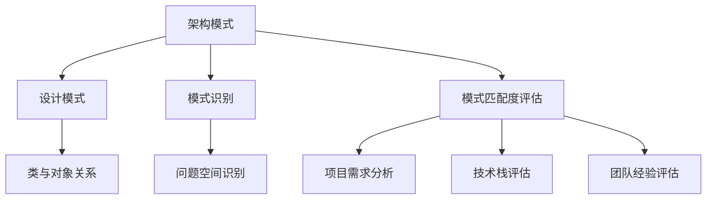

                 

### 书名理解

《软件架构模式：选择适合项目的架构风格》这个书名传递了几个关键信息。首先，“软件架构模式”明确了书籍的核心内容是关于软件架构的各种模式。这些模式是软件工程师在实践中总结出来的，用于解决特定类型问题的方法论。它们不仅包括设计模式，还包括架构模式，如MVC、MVVM、微服务、事件驱动等。

其次，“选择适合项目的架构风格”强调了书籍的目的，即帮助读者理解和评估不同的架构模式，并根据具体项目的需求选择最合适的架构风格。这里的“风格”指的是架构的整体设计理念和结构，它决定了系统的可维护性、扩展性和性能。

书名中的“软件架构”部分明确了书籍的讨论范围仅限于软件领域的架构问题，而不是其他类型的系统架构。最后，“选择适合项目的”强调了实际应用导向，即如何将理论应用到具体的项目实践中。

综上所述，书名不仅指出了书籍的主题，还传达了其核心目的和方法，即为读者提供一套实用的方法，帮助他们根据项目的特点选择最合适的软件架构模式。

### 软件架构模式的核心概念与联系

在深入探讨软件架构模式之前，首先需要明确几个核心概念及其相互关系。这些核心概念包括但不限于：架构模式、设计模式、模式识别、模式匹配度评估等。以下是这些概念的定义及其相互联系的Mermaid流程图。

#### 定义与关系

1. **架构模式**：架构模式是一组被广泛认可的、用于解决特定类型问题的解决方案。它们提供了软件系统架构的基本结构，并指导了系统设计和实现的过程。

2. **设计模式**：设计模式是针对特定设计问题的解决方案，通常是在软件架构层面实现的。设计模式强调的是类和对象之间的关系，而不是整个系统的结构。

3. **模式识别**：模式识别是系统分析和设计过程中识别和应用架构模式的能力。它帮助开发人员从复杂的问题空间中识别出合适的模式，以提高系统的可维护性和扩展性。

4. **模式匹配度评估**：模式匹配度评估是评估特定架构模式是否适合解决当前项目问题的过程。这包括考虑项目的需求、技术栈、团队经验等多个因素。

#### Mermaid流程图

以下是一个Mermaid流程图，展示了这些核心概念之间的相互关系：



#### 详细解释

- **架构模式**（A）是整体系统的设计和结构，而**设计模式**（B）是具体的实现细节。设计模式通常是在架构模式的基础上使用的，用于实现特定的功能。

- **模式识别**（C）是开发人员从项目中识别和应用架构模式的能力。通过模式识别，开发人员可以快速解决常见问题，提高工作效率。

- **模式匹配度评估**（D）是在确定架构模式是否适用于当前项目时进行的一系列评估活动。这包括评估项目的需求（G）、技术栈（H）和团队经验（I）等多个方面。

通过这个Mermaid流程图，我们可以清晰地看到这些核心概念之间的相互关系，它们共同构成了软件架构模式的整体框架，为开发人员提供了从理论到实践的指导。

### 软件架构的基础理论

在探讨软件架构模式之前，我们需要了解一些基础理论。这些理论是理解不同架构模式及其应用的关键。以下是关于软件架构基础理论的详细讲解，包括定义、核心原则和架构风格。

#### 软件架构的定义

软件架构是软件系统的基本结构和设计，它定义了系统的各个组件以及这些组件之间的交互方式。软件架构不仅包括技术实现，还包括业务逻辑、数据流、功能划分等多个方面。它可以被视为软件系统的蓝图，指导系统的设计、开发和维护。

#### 核心原则

软件架构遵循以下核心原则：

1. **分离关注点**：将系统中的不同功能模块分离，使得每个模块专注于特定的职责。这有助于提高系统的可维护性和可扩展性。

2. **模块化**：将系统划分为多个可独立开发的模块，每个模块都有自己的接口和实现。模块化有助于团队协作，提高开发效率。

3. **解耦**：通过减少组件之间的直接依赖，提高系统的灵活性和可替换性。解耦有助于系统在不同环境下进行集成和扩展。

4. **可复用性**：设计可复用的组件，以便在不同项目中重复使用。这有助于降低开发成本，提高软件质量。

5. **可扩展性**：系统应设计为易于扩展，以应对未来的需求变化。这通常通过灵活的架构风格和模块化实现。

#### 架构风格

不同的架构风格适用于不同的场景，以下是几种常见的架构风格：

1. **MVC（模型-视图-控制器）**：MVC是一种流行的架构风格，用于将应用程序划分为三个核心组件：模型（数据和处理业务逻辑）、视图（用户界面）和控制器（处理用户输入和协调模型与视图）。MVC适用于前端和后端开发，特别是在需要分离数据和展示逻辑的场景中。

2. **微服务架构**：微服务架构是将应用程序拆分为一组独立的、小型服务。每个服务都是自治的，负责处理特定的业务功能。这种架构风格适用于大型、复杂的应用程序，能够提高系统的可扩展性和可维护性。

3. **事件驱动架构**：事件驱动架构通过事件和事件处理器来管理应用程序的流程。当特定事件发生时，相应的处理器被触发，执行相应的操作。这种架构风格适用于实时系统、流处理和异步处理。

4. **CQRS（Command Query Responsibility Segregation）**：CQRS将读操作和写操作分离到不同的服务中，以提高系统的性能和可扩展性。读服务负责处理查询操作，写服务负责处理命令操作。这种架构风格适用于读操作和写操作负载不均衡的场景。

通过了解这些基础理论，我们可以更好地理解和选择适合特定项目的架构模式。这些原则和风格为软件架构的设计和实现提供了重要的指导。

### MVC架构模式

MVC（模型-视图-控制器）是一种广泛应用的软件架构模式，旨在将应用程序分为三个主要组件：模型、视图和控制器。每个组件在应用程序中扮演不同的角色，共同工作以实现软件系统的功能。

#### 原理

1. **模型（Model）**：模型是应用程序的核心，负责处理数据和处理业务逻辑。它封装了应用程序的状态和行为，不直接与用户界面交互。模型通常包含数据存储（如数据库）、业务规则和数据处理方法。例如，在一个电商应用中，模型可能包括用户信息、商品信息和订单处理逻辑。

2. **视图（View）**：视图负责展示用户界面，显示模型中的数据。视图不处理业务逻辑，仅负责数据展示和用户交互。视图通常由UI框架实现，如HTML、CSS和JavaScript。在一个电商应用中，视图可能包括商品列表页面、购物车界面和订单确认页面。

3. **控制器（Controller）**：控制器是模型和视图之间的桥梁，负责接收用户输入，更新模型，并相应地更新视图。控制器处理用户请求，调用模型来执行业务逻辑，并将结果传递给视图进行展示。例如，当用户在电商应用中选择商品并加入购物车时，控制器接收请求，调用模型更新订单数据，并通知视图更新购物车界面。

#### 应用场景

MVC架构模式适用于多种场景：

- **用户界面密集型应用**：MVC有助于分离数据和用户界面，使得前端和后端开发人员可以独立工作。这在Web开发和移动应用开发中尤其常见。
- **需要高度可维护性和可扩展性的应用**：MVC通过模块化设计，使得代码结构清晰，易于维护和扩展。这在大型企业级应用中尤为重要。
- **需要灵活的界面布局和动态内容的应用**：MVC使得视图和模型可以独立更新，适用于需要动态内容展示的应用，如CMS（内容管理系统）。

#### 优缺点

**优点**：

- **模块化**：MVC将应用程序划分为三个独立的组件，使得代码更易于管理和维护。
- **可扩展性**：MVC架构风格使得系统易于扩展，每个组件都可以独立开发、测试和部署。
- **易于测试**：由于MVC将用户界面、数据和业务逻辑分离，测试时可以分别测试每个组件，提高测试效率。

**缺点**：

- **复杂性**：MVC架构模式可能会增加系统的复杂性，特别是在大型项目中。这需要开发人员具备较强的设计和编码能力。
- **性能开销**：在MVC架构中，模型和视图之间的通信可能会增加系统性能的开销，特别是在处理大量数据时。

通过理解MVC架构模式的基本原理、应用场景及其优缺点，我们可以更好地决定在何时何地使用这种架构模式，从而提高软件系统的开发效率和可维护性。

### MVVM架构模式

MVVM（模型-视图-视图模型）是另一种常见的软件架构模式，旨在进一步分离应用程序中的数据和用户界面。与MVC模式相比，MVVM通过引入视图模型（ViewModel）来简化模型与视图之间的交互，从而提高了系统的可维护性和可扩展性。

#### 原理

1. **模型（Model）**：模型与MVC模式中的模型相同，负责处理数据和处理业务逻辑。它封装了应用程序的状态和行为，不直接与用户界面交互。

2. **视图（View）**：视图负责展示用户界面，显示模型中的数据。视图通常由UI框架实现，如HTML、CSS和JavaScript。与MVC模式中的视图不同的是，MVVM中的视图不直接处理业务逻辑。

3. **视图模型（ViewModel）**：视图模型是MVVM模式的核心，充当模型和视图之间的桥梁。视图模型负责将模型中的数据绑定到视图，并处理用户输入。它通常包含业务逻辑和用户界面状态的管理。视图模型通过数据绑定技术与视图和模型进行通信。

#### 应用场景

MVVM架构模式适用于以下场景：

- **前端开发**：MVVM在前端开发中非常流行，特别是在使用现代前端框架（如React、Angular、Vue.js）时。这些框架通常内置了数据绑定机制，使得MVVM模式易于实现和扩展。
- **需要动态数据展示的应用**：MVVM适用于需要动态更新数据展示的应用，如单页应用（SPA）和实时数据监控系统。
- **复杂用户交互的应用**：MVVM通过视图模型管理用户交互，使得界面逻辑更加清晰，提高了系统的可维护性。

#### 优缺点

**优点**：

- **简化开发**：MVVM通过数据绑定技术简化了模型和视图之间的交互，使得开发者可以专注于业务逻辑的实现，减少了手动更新的需求。
- **提高可维护性**：视图模型分离了用户界面逻辑和数据业务逻辑，使得代码更易于理解和维护。
- **动态更新**：数据绑定技术使得视图可以实时更新，减少了手动刷新的需求，提高了用户体验。

**缺点**：

- **性能开销**：数据绑定机制可能会引入一定的性能开销，特别是在处理大量数据时。
- **复杂性**：实现MVVM模式需要开发者具备一定的框架知识和数据绑定机制的理解，这可能会增加项目的复杂性。

通过理解MVVM架构模式的原理、应用场景及其优缺点，我们可以更好地决定在何时何地使用这种架构模式，从而提高软件系统的开发效率和用户体验。

### 微服务架构模式

微服务架构是一种基于独立、小型、自治服务的软件架构模式。与传统的单体架构相比，微服务架构将应用程序拆分为一组独立的、小型服务，每个服务负责特定的业务功能。这种架构模式旨在提高系统的可扩展性、可维护性和灵活性。

#### 原理

1. **服务独立性**：每个微服务都是独立的，负责处理特定的业务功能。这意味着每个服务都可以独立开发、测试、部署和扩展。

2. **服务自治**：每个微服务都拥有自己的数据库、应用程序代码和配置。这种自治性确保了服务的独立性，减少了服务之间的耦合。

3. **通信协议**：微服务之间通过定义良好的API进行通信，通常使用HTTP/REST或gRPC等协议。服务之间的通信通常是异步的，这有助于提高系统的可扩展性和容错能力。

4. **容器化与持续集成/持续部署（CI/CD）**：微服务通常运行在容器中，如Docker，以实现高效的开发和部署。CI/CD工具用于自动化测试、构建和部署，确保微服务的快速迭代和部署。

#### 应用场景

微服务架构适用于以下场景：

- **大型企业级应用**：微服务架构适用于需要高扩展性和高可靠性的大型应用，如电子商务平台、银行系统、社交媒体平台等。
- **多团队协作开发**：微服务架构使得不同团队可以独立开发、部署和服务，提高了开发效率。
- **需要快速迭代和部署的应用**：微服务架构通过独立的、小型服务实现快速迭代和部署，适用于需要快速响应市场需求的应用。

#### 优缺点

**优点**：

- **高扩展性**：微服务架构通过拆分大型系统为小型服务，提高了系统的可扩展性。每个服务可以根据需求独立扩展，无需全局协调。
- **高可靠性**：微服务架构中的服务独立性使得系统中的某个服务失败不会影响整个系统的运行。这提高了系统的容错能力。
- **灵活性**：微服务架构允许开发团队选择最适合其服务的技术栈，从而提高了系统的灵活性。

**缺点**：

- **复杂性**：微服务架构引入了额外的复杂性，包括服务管理、通信、监控等。这需要开发团队具备一定的技能和经验。
- **性能开销**：服务之间的通信和协调可能会引入一定的性能开销，特别是在服务数量较多时。
- **集成难度**：微服务架构中的服务需要通过API进行通信，这增加了集成难度和测试复杂性。

通过理解微服务架构模式的基本原理、应用场景及其优缺点，我们可以更好地决定在何时何地使用这种架构模式，从而提高软件系统的开发效率和运行质量。

### 事件驱动架构模式

事件驱动架构（Event-Driven Architecture，EDA）是一种软件架构模式，它通过事件和事件处理器来管理应用程序的流程。与传统的命令式编程相比，事件驱动架构强调异步通信和非阻塞处理，这有助于提高系统的可扩展性和容错性。

#### 原理

1. **事件**：事件是应用程序中发生的任何有意义的操作或状态变化。事件可以是用户输入、系统错误、网络通知等。事件通常由事件源（Event Source）生成。

2. **事件处理器**：事件处理器是负责处理特定事件的组件。当事件发生时，事件处理器被触发，执行相应的操作。事件处理器可以是函数、类或服务。

3. **事件总线**：事件总线是一个中央组件，负责事件的生产和消费。事件总线将事件从事件源传递到相应的事件处理器，并确保事件得到及时处理。

4. **订阅-发布模型**：在事件驱动架构中，事件源和事件处理器之间通常采用订阅-发布模型进行通信。事件源发布事件，事件总线将事件传递给订阅了该事件的处理器。

#### 应用场景

事件驱动架构适用于以下场景：

- **实时系统**：事件驱动架构适用于需要实时响应和处理大量事件的应用程序，如实时交易系统、实时监控系统和物联网（IoT）应用。
- **分布式系统**：事件驱动架构通过异步通信和分布式处理，提高了分布式系统的可靠性和可扩展性。这适用于需要处理大量数据和用户的分布式应用。
- **流处理**：事件驱动架构适用于流处理系统，如日志处理、数据分析和实时数据处理。流处理系统能够高效地处理和分析实时数据流。

#### 优缺点

**优点**：

- **高可扩展性**：事件驱动架构通过异步通信和分布式处理，提高了系统的可扩展性。新的事件处理器可以动态添加到系统中，无需全局协调。
- **容错性**：事件驱动架构中的事件处理器是独立的，某个处理器的故障不会影响整个系统的运行。这提高了系统的容错能力。
- **灵活性**：事件驱动架构允许开发人员根据需要灵活地设计事件处理器，实现特定的业务逻辑。

**缺点**：

- **复杂性**：事件驱动架构引入了额外的复杂性，包括事件管理、事件处理器和事件总线的设计。这需要开发团队具备一定的技能和经验。
- **性能开销**：事件驱动架构中的事件生产和消费可能会引入一定的性能开销，特别是在高频率的事件流中。

通过理解事件驱动架构模式的基本原理、应用场景及其优缺点，我们可以更好地决定在何时何地使用这种架构模式，从而提高软件系统的开发效率和运行质量。

### 如何选择适合项目的软件架构模式

在选择适合项目的软件架构模式时，我们需要考虑多个因素，包括项目需求、技术栈、团队经验等。以下是一些关键步骤和方法论，帮助开发团队做出明智的选择。

#### 项目需求分析

项目需求分析是选择软件架构模式的第一步。我们需要深入理解项目的功能需求、性能要求、可扩展性需求等。以下是几个关键点：

- **功能需求**：明确项目的核心功能，包括用户界面、数据管理、业务逻辑等。这些功能将决定我们需要哪些架构模式来支持。
- **性能要求**：确定项目的性能指标，如响应时间、吞吐量、并发用户数等。性能要求将影响我们选择架构模式时的权衡，如是否需要高并发处理、低延迟响应等。
- **可扩展性需求**：评估项目的未来扩展性需求，包括功能扩展、用户量增长、数据规模扩大等。这将决定我们需要选择哪种可扩展性较高的架构模式。

#### 技术栈选择

技术栈选择直接影响架构模式的适用性。以下是一些关键考虑因素：

- **现有技术**：评估项目中已经使用的技术和框架，这些技术是否支持我们选择的架构模式。例如，如果项目已经使用了React框架，则MVVM架构可能更合适。
- **开发语言**：选择与项目需求相匹配的开发语言，如Web应用可能更适合使用JavaScript、Python等。
- **工具和框架**：了解常用的架构模式所依赖的工具和框架，确保团队具备相关的开发技能和经验。例如，实现微服务架构可能需要了解Docker、Kubernetes等容器化技术。

#### 模式匹配度评估

在确定了项目需求和技术栈后，我们需要评估不同架构模式的匹配度。以下是几个评估方法：

- **优点与缺点对比**：对比不同架构模式的优点和缺点，根据项目需求选择最合适的模式。例如，MVC模式适用于需要分离数据和界面的应用，而微服务架构适用于需要高扩展性和高可靠性的应用。
- **架构风格**：考虑项目的具体需求，选择适合的架构风格。例如，对于需要灵活扩展的应用，微服务架构可能更合适；对于需要高可维护性的应用，MVC模式可能更合适。
- **团队经验**：评估团队在特定架构模式上的经验，选择团队熟悉的模式。这有助于提高开发效率，减少学习成本。

#### 案例分析与借鉴

通过分析成功和失败的案例，我们可以得到宝贵的经验，帮助我们在选择软件架构模式时做出更好的决策。以下是几个案例分析的步骤：

- **成功案例**：分析成功案例中选择的架构模式，了解它们是如何适应项目需求的。这些案例可以提供有价值的参考。
- **失败案例**：同样重要的是分析失败案例，了解它们选择架构模式时的错误和教训。这些案例可以帮助我们避免重蹈覆辙。
- **经验总结**：总结案例中的经验和教训，形成一套适用于不同项目的架构选择方法论。

#### 实际应用中的调整与优化

在选择了架构模式并开始实施后，我们还需要根据实际应用中的反馈进行持续调整和优化。以下是几个关键点：

- **性能监控**：通过性能监控工具，持续监控系统的性能，发现瓶颈并进行优化。
- **反馈收集**：收集用户和开发团队的反馈，评估架构模式在实际应用中的表现，并根据反馈进行调整。
- **迭代优化**：不断迭代和优化架构，以适应项目需求的变化和新的技术趋势。

通过以上步骤和方法论，开发团队可以更科学地选择适合项目的软件架构模式，从而提高项目的开发效率和成功概率。

### 架构模式的案例研究

在软件架构模式的选择过程中，通过案例分析来理解成功和失败的案例是非常重要的。以下是一些典型的成功和失败案例，以及它们对选择合适架构模式的重要启示。

#### 成功案例

1. **案例一：亚马逊的微服务架构**
   - **项目背景**：亚马逊是一个庞大的电子商务平台，需要处理海量数据和高并发请求。为了提高系统的可扩展性和可维护性，亚马逊采用了微服务架构。
   - **架构模式**：亚马逊使用了一系列微服务，每个服务负责处理特定的业务功能，如订单管理、库存管理、支付处理等。
   - **结果**：通过微服务架构，亚马逊实现了高扩展性和高可靠性。每个微服务可以独立部署和扩展，无需全局协调。此外，系统可以快速迭代和部署，提高了开发效率。

2. **案例二：Netflix的事件驱动架构**
   - **项目背景**：Netflix是一个流媒体服务提供商，需要实时处理大量用户请求和流数据。
   - **架构模式**：Netflix采用了事件驱动架构，通过事件和事件处理器来管理应用程序的流程。系统中的事件包括用户请求、视频流、错误报告等。
   - **结果**：事件驱动架构使得Netflix能够高效地处理实时数据流，提高了系统的性能和可扩展性。此外，通过异步通信，系统可以更好地处理高并发请求，提高了用户体验。

#### 失败案例

1. **案例三：Facebook早期使用MVC模式的失败**
   - **项目背景**：Facebook是一个社交网络平台，需要处理大量用户数据和复杂的业务逻辑。
   - **架构模式**：Facebook早期采用了MVC模式，但随着用户量的增加和功能复杂度的提升，系统逐渐变得难以维护。
   - **结果**：由于MVC模式中的视图和模型过于紧密耦合，系统变得复杂且难以扩展。每次功能更新都需要大量修改多个模块，导致开发效率低下。

2. **案例四：Twitter的初始微服务架构失败**
   - **项目背景**：Twitter是一个社交媒体平台，需要处理高并发请求和大量数据。
   - **架构模式**：Twitter初期尝试采用微服务架构，但每个服务之间的通信过于复杂，导致系统的性能和可靠性下降。
   - **结果**：由于缺乏有效管理和监控，微服务之间的依赖关系难以管理，系统频繁出现故障。Twitter最终放弃了微服务架构，并回归到传统的单体架构。

#### 案例分析

1. **成功案例分析**：
   - **优点**：成功的案例通常表明所选择的架构模式与项目需求高度匹配，能够解决关键问题。例如，亚马逊的微服务架构和Netflix的事件驱动架构都成功提高了系统的可扩展性和性能。
   - **启示**：通过分析成功案例，我们可以了解到如何选择合适的架构模式，并学会如何在实际项目中应用这些模式。此外，成功案例还展示了良好的架构设计如何促进系统的持续迭代和优化。

2. **失败案例分析**：
   - **原因**：失败案例通常由于多种因素导致，包括架构模式与项目需求的错配、架构设计复杂度过高、缺乏有效管理和监控等。
   - **启示**：通过分析失败案例，我们可以避免重蹈覆辙。例如，了解如何避免过度复杂化架构、如何进行有效的架构管理和监控，以及如何根据项目需求灵活调整架构模式。

通过这些案例分析，我们可以更深入地理解不同架构模式的适用性，并在实际项目中做出更明智的决策。成功案例提供了宝贵的经验和教训，而失败案例则警示我们架构选择和实施中的潜在问题。

### 软件架构的实际应用

软件架构的实际应用是实现软件系统功能的关键环节。在这一部分，我们将讨论如何将架构理论应用到实际项目中，包括开发环境搭建、源代码实现、代码解读、应用分析和实际案例分析。

#### 开发环境搭建

在开始项目之前，我们需要搭建一个适合开发的环境。以下是搭建开发环境的基本步骤：

1. **确定技术栈**：根据项目需求，选择合适的技术栈，包括编程语言、框架和工具。例如，对于一个Web应用项目，我们可以选择Python和Django框架，以及PostgreSQL数据库。

2. **安装开发工具**：安装必要的开发工具，如Python解释器、Django框架、PostgreSQL数据库等。

3. **配置开发环境**：配置开发环境，包括设置环境变量、安装必要的库和依赖项。例如，使用virtualenv创建虚拟环境，并安装Django和相关库。

4. **搭建数据库**：配置数据库，创建数据库用户和数据库，并初始化数据库结构。

5. **部署开发服务器**：启动开发服务器，确保开发环境可以正常运行。例如，使用Gunicorn作为开发服务器，启动Django应用。

#### 源代码实现

源代码实现是软件架构设计转化为实际代码的关键步骤。以下是源代码实现的几个关键点：

1. **模块化**：将应用程序划分为多个模块，每个模块负责处理特定的功能。例如，将用户管理、商品管理、订单处理等功能划分为不同的模块。

2. **设计模式应用**：在源代码中应用设计模式和架构模式，以提高代码的可维护性和可扩展性。例如，在用户管理模块中应用MVC模式，分离模型、视图和控制器。

3. **编码规范**：遵循编码规范和最佳实践，确保代码的可读性和可维护性。例如，使用PEP 8规范编写Python代码，使用Linter工具检查代码风格。

4. **单元测试**：编写单元测试，确保每个模块的功能正确，并提高代码质量。使用测试框架（如pytest）编写和运行测试用例。

#### 代码解读

代码解读是理解源代码功能和实现机制的重要环节。以下是代码解读的几个关键步骤：

1. **模块解析**：分析每个模块的结构和功能，了解模块之间的依赖关系。

2. **关键函数和方法**：重点解析关键函数和方法的实现，理解其功能和工作原理。

3. **流程图和伪代码**：使用流程图和伪代码展示关键模块和函数的执行流程，帮助理解代码的整体结构和逻辑。

4. **代码示例**：提供代码示例，展示关键功能的实现细节。

#### 应用分析与代码解读

以下是一个实际应用的例子，用于解读一个简单的用户注册功能：

```python
# 用户注册功能示例
from django.contrib.auth.models import User

def register_user(username, password):
    """
    注册用户，并创建相应的用户对象。

    :param username: 用户名
    :param password: 密码
    :return: 用户对象
    """
    user = User.objects.create_user(username=username, password=password)
    user.save()
    return user

# 单元测试
def test_register_user():
    """
    测试用户注册功能。

    :return: None
    """
    user = register_user('test_user', 'test_password')
    assert user is not None
    assert user.username == 'test_user'
    assert user.password == 'test_password'
```

在这个例子中，我们定义了一个`register_user`函数，用于创建用户并保存到数据库。同时，我们编写了一个单元测试`test_register_user`，用于验证用户注册功能是否正常。

#### 实际案例分析和详细讲解

以下是一个实际项目的案例分析：

**项目背景**：一个在线书店项目，需要实现用户注册、登录、购物车和订单管理等功能。

**架构选择**：我们选择了MVC架构模式，将应用程序划分为模型、视图和控制器。

1. **模型**：定义用户、书籍、订单等模型类，处理业务逻辑和数据存储。

2. **视图**：使用Django模板系统，定义用户界面和视图函数，处理用户请求并返回HTML页面。

3. **控制器**：在Django中，视图函数充当控制器，处理用户请求并调用模型和视图。

**项目实施**：

- **用户注册**：使用`register_user`函数创建用户对象，并将其保存到数据库。视图函数处理用户提交的注册表单，调用`register_user`函数进行用户注册。

- **购物车管理**：使用模型和视图管理用户购物车，包括添加、删除和更新购物车中的商品。

- **订单处理**：处理用户提交的订单，生成订单对象并保存到数据库。

**案例分析**：

- **成功因素**：MVC架构模式使得代码结构清晰，易于维护和扩展。每个模块独立开发、测试和部署，提高了开发效率。
- **挑战和改进**：在高并发情况下，数据库查询性能可能成为瓶颈。我们可以通过优化查询语句、使用缓存和数据库分片来改进性能。

通过实际案例分析，我们可以看到如何将架构理论应用到实际项目中，解决具体问题，并持续优化系统的性能和可维护性。

### 软件架构的最佳实践

在软件架构的设计和实现过程中，遵循一些最佳实践是确保项目成功的关键。以下是一些重要的最佳实践：

1. **模块化设计**：将系统划分为多个独立的模块，每个模块负责特定的功能。模块化有助于提高代码的可维护性和可扩展性。

2. **解耦**：减少模块之间的直接依赖，提高系统的灵活性和可替换性。解耦可以通过定义清晰的接口和采用设计模式来实现。

3. **使用设计模式**：合理应用设计模式，如MVC、MVVM、微服务等，可以提高系统的结构和实现效率。选择与项目需求相匹配的设计模式，避免过度设计。

4. **代码复用**：设计可复用的组件和库，减少重复代码，提高开发效率和代码质量。通过抽象和封装，实现代码的通用性和灵活性。

5. **性能优化**：关注系统性能，进行性能监控和优化。使用缓存、数据库索引和异步处理等技术提高系统的响应速度和吞吐量。

6. **测试驱动开发（TDD）**：采用测试驱动开发方法，编写单元测试和集成测试，确保代码的正确性和可靠性。通过持续集成工具自动化测试，提高开发效率。

7. **文档和注释**：编写详细的文档和代码注释，确保代码的可读性和可理解性。良好的文档有助于团队成员之间的协作和代码的维护。

8. **持续集成和部署（CI/CD）**：采用持续集成和部署工具，自动化构建、测试和部署流程，确保代码质量，提高开发效率。

通过遵循这些最佳实践，开发团队可以设计出高效、可维护和可扩展的软件系统，提高项目的成功率和开发效率。

### 总结与注意事项

本文详细探讨了软件架构模式的选择和应用，从基础理论到实际案例分析，再到最佳实践，提供了全面的指导。以下是文章的核心要点和注意事项：

1. **理解软件架构模式**：软件架构模式是解决特定类型问题的方法论，包括MVC、MVVM、微服务、事件驱动等。

2. **项目需求分析**：在项目初期进行详细的需求分析，确保选择合适的架构模式，满足功能、性能和扩展性需求。

3. **技术栈选择**：根据项目需求和技术栈选择，确保团队具备相关的开发技能和经验。

4. **架构模式匹配度评估**：通过对比不同架构模式的优点和缺点，选择与项目需求最匹配的架构模式。

5. **案例分析与借鉴**：分析成功和失败案例，了解不同架构模式在实际应用中的表现，形成适用的架构选择方法论。

6. **实际应用与调整**：将架构理论应用到实际项目中，持续监控和优化系统的性能和可维护性。

**注意事项**：

- **避免过度设计**：选择最合适的架构模式，避免过度设计，减少开发复杂度。
- **持续学习和改进**：关注最新的技术趋势和架构模式，持续学习和改进。
- **团队协作**：鼓励团队成员之间的协作和沟通，确保架构设计得到广泛理解和执行。
- **文档和注释**：编写详细的文档和代码注释，确保代码的可读性和可维护性。

通过遵循这些要点和注意事项，开发团队可以设计出高效、可维护和可扩展的软件系统，提高项目的成功率。

