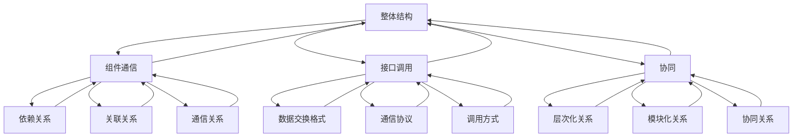
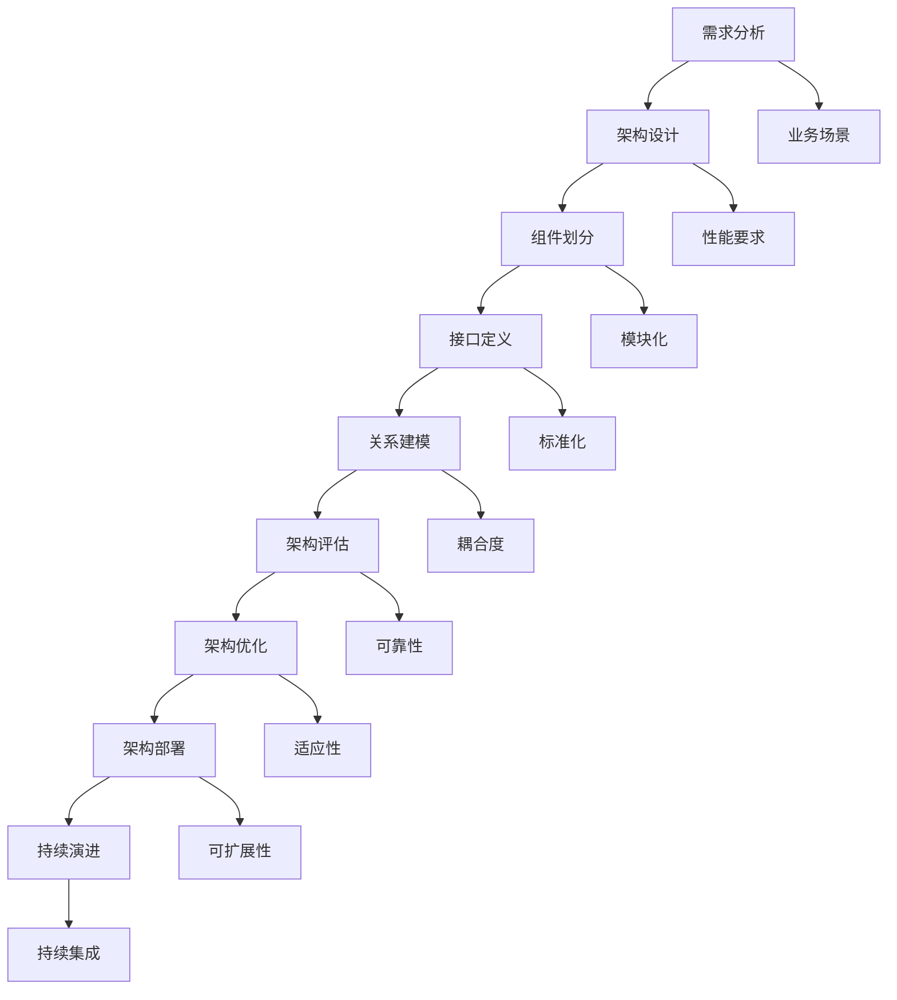

                 

### 第一部分：软件架构基础理论

#### 第1章：软件架构概述
- 1.1 软件架构的定义

软件架构是软件系统的总体结构和组成部分的安排，它描述了软件系统如何构建、如何组织、如何交互以及如何满足特定需求和约束。这个定义包含了几个关键要素：

  - **总体结构**：软件架构提供了软件系统的全局视图，展示了系统的主要组成部分和它们之间的关系。
  - **组成部分**：软件架构涉及到软件系统中的各个模块、组件或子系统，以及它们如何组合在一起形成一个完整的系统。
  - **如何构建**：软件架构描述了如何将不同的组件和模块组织在一起，构建成一个有效的软件系统。
  - **如何组织**：软件架构关注系统的组织和模块化，使得系统能够更容易地理解、维护和扩展。
  - **如何交互**：软件架构定义了组件之间的交互方式和通信机制，确保系统各部分能够高效、可靠地协同工作。
  - **满足需求和约束**：软件架构设计的目标是确保软件系统能够满足用户需求和遵守各种约束条件，如性能、安全性、可维护性等。

  在软件架构的框架下，开发人员能够更好地理解和设计复杂的软件系统，从而提高开发效率和系统质量。

- 1.2 软件架构的关键概念

为了深入理解软件架构，我们需要了解以下几个关键概念：

  - **组件**：组件是软件系统中的独立部分，它能够完成特定的功能，并与其他组件交互。组件可以是模块、类、库或服务。
  - **接口**：接口定义了组件之间的交互方式，包括数据交换格式、通信协议和调用方式。良好的接口设计可以提高组件的独立性和可复用性。
  - **关系**：组件之间的关系包括依赖关系、关联关系和通信关系。这些关系决定了组件如何协作以实现系统的功能。
  - **架构风格**：架构风格是软件架构的总体设计原则和结构模式，它指导了系统的组织结构和组件之间的交互方式。常见的架构风格包括过程式、对象式、组件式和面向服务架构（SOA）。
  - **架构模式**：架构模式是一组常见的设计解决方案，用于处理特定的设计问题或满足特定的需求。例如，MVC（模型-视图-控制器）模式、微服务架构模式等。
  - **架构约束**：架构约束是指软件架构在设计和实现过程中必须遵守的限制条件，如性能、可靠性、安全性和可维护性等。

- 1.3 软件架构与系统设计的关系

软件架构是系统设计的一个重要组成部分，它与系统设计紧密相关：

  - **系统设计**：系统设计是将系统需求转化为具体的技术实现的过程。它包括模块划分、接口设计、算法选择和资源管理等方面。
  - **软件架构**：软件架构提供了系统设计的全局视图，定义了系统的总体结构和关键组件。它是系统设计的基础，指导了具体的实现细节。
  - **关系**：软件架构与系统设计的关系是层次化的。软件架构为系统设计提供了高层次的设计指导，而系统设计则根据软件架构的具体要求实现具体的实现细节。

  正确的软件架构设计能够提高系统设计的可维护性、可扩展性和可靠性，从而降低开发成本和风险。

### 结论

在第一部分中，我们介绍了软件架构的基础理论，包括软件架构的定义、关键概念和与系统设计的关系。这些基础理论为后续的架构设计实践提供了重要的理论基础。在接下来的部分中，我们将深入探讨软件架构风格与模式、软件架构设计原则以及软件架构演进的方法和策略。

## 核心概念与联系

为了更好地理解软件架构，我们需要明确几个核心概念之间的关系。以下是一个简化的Mermaid流程图，展示了这些概念之间的联系：



这个流程图清晰地展示了软件架构中的各个核心概念以及它们之间的关系。组件、接口和关系构成了软件架构的基本要素，而依赖关系、关联关系和通信关系则是组件之间交互的具体表现。这些概念相互交织，共同构建了一个复杂的软件系统。

### 核心算法原理讲解

在软件架构设计过程中，算法的选择和设计是一个关键问题。以下是一个简化版的伪代码，用于描述软件架构设计算法的基本原理：

```plaintext
Algorithm SoftwareArchitectureDesign(SystemRequirements, Constraints)

    Input: SystemRequirements - a list of system requirements
           Constraints - a list of constraints like performance, scalability, security

    Output: ArchitectureDesign - a design of the software architecture

    Begin
        1. AnalyzeRequirements(SystemRequirements)
        2. IdentifyKeyComponents(ArchitectureDesign)
        3. DefineInterfaces(ArchitectureDesign)
        4. EstablishComponentRelations(ArchitectureDesign)
        5. ValidateArchitecture(ArchitectureDesign, Constraints)
        6. OptimizeArchitecture(ArchitectureDesign)
        7. DocumentArchitectureDesign(ArchitectureDesign)

    End
```

**算法步骤解析：**

1. **分析需求（AnalyzeRequirements）**：
   - 该步骤旨在理解和分析系统需求，包括功能需求、非功能需求和业务规则。这一分析将帮助我们确定系统的关键功能和性能要求。

2. **识别关键组件（IdentifyKeyComponents）**：
   - 根据需求分析结果，识别出构成系统的关键组件。这些组件将负责实现系统的核心功能。

3. **定义接口（DefineInterfaces）**：
   - 接口定义了组件之间的交互方式。在这一步中，我们将为组件之间的通信定义清晰的接口规格，包括数据交换格式、通信协议和调用方式。

4. **建立组件关系（EstablishComponentRelations）**：
   - 确定组件之间的依赖关系、关联关系和通信关系。这一步帮助我们构建组件之间的结构关系，确保系统的高效性和可维护性。

5. **验证架构（ValidateArchitecture）**：
   - 检查架构设计是否符合所有约束条件，如性能、安全性、可维护性等。这一验证步骤确保架构设计满足系统的非功能需求。

6. **优化架构（OptimizeArchitecture）**：
   - 根据验证结果，对架构设计进行优化，提高系统的性能、可扩展性和可靠性。

7. **文档化架构设计（DocumentArchitectureDesign）**：
   - 最后，我们需要将架构设计文档化，以便开发人员能够理解和遵循。文档应包括架构设计图、接口规格、组件关系图等。

这个简化版的伪代码提供了软件架构设计算法的基本框架。在实际应用中，每个步骤都可能涉及到更复杂的技术和设计决策。

### 数学模型和数学公式 & 详细讲解 & 举例说明

在软件架构设计中，数学模型和数学公式可以用来量化系统的性能、可扩展性和可靠性等关键特性。以下是一个简化的数学模型，用于评估软件架构的性能：

#### 数学模型：架构性能评估

$$
P = f(\text{响应时间}, \text{并发用户数}, \text{系统资源})
$$

其中，$P$ 表示系统性能，$f$ 是性能评估函数。

**详细讲解：**

1. **响应时间**：
   - 响应时间是指系统从接收请求到返回响应所需的时间。它是评估系统性能的一个重要指标。通常，我们使用平均响应时间（Average Response Time, ART）来量化响应时间。

2. **并发用户数**：
   - 并发用户数是指同时使用系统的用户数量。随着并发用户数的增加，系统性能可能会受到影响，因为系统资源（如CPU、内存等）可能成为瓶颈。

3. **系统资源**：
   - 系统资源包括CPU、内存、磁盘I/O和网络带宽等。这些资源限制了系统的处理能力和响应速度。

**举例说明：**

假设我们有一个电商系统，它的平均响应时间（ART）为500毫秒，并发用户数为1000，系统资源为2个CPU核、4GB内存和1Gbps的网络带宽。我们可以使用上述公式来评估该系统的性能：

$$
P = f(500\ \text{ms}, 1000, \text{2 CPU cores, 4 GB RAM, 1 Gbps})
$$

通过这个模型，我们可以分析系统在不同负载下的性能表现，并据此进行优化。

### 项目实战

为了更好地理解软件架构的设计和演进，我们将通过一个实际的案例来展示整个开发过程。以下是一个电商平台架构演进的详细说明。

#### 项目背景

该电商平台起初是一个简单的在线购物网站，支持基本的产品浏览和购买功能。然而，随着用户数量的增加和业务需求的不断变化，原有的架构已经无法满足系统的扩展性、性能和可维护性要求。因此，我们需要对架构进行升级和优化。

#### 开发环境搭建

在开始架构演进之前，我们需要搭建一个稳定可靠的开发环境。以下是我们使用的开发环境：

- **编程语言**：Java
- **框架**：Spring Boot、Spring Cloud
- **数据库**：MySQL
- **容器化技术**：Docker
- **持续集成和部署**：Jenkins、Kubernetes

#### 源代码详细实现和代码解读

1. **模块划分**：

   我们将系统划分为以下几个模块：

   - **用户模块**：负责用户认证、注册和资料管理。
   - **商品模块**：负责商品信息的管理、分类和搜索。
   - **订单模块**：负责订单的创建、支付和发货。
   - **购物车模块**：负责用户购物车中的商品管理。
   - **支付模块**：负责处理支付请求和订单支付。
   - **库存模块**：负责库存的管理和更新。

2. **接口设计**：

   接口设计遵循RESTful风格，使用HTTP协议进行通信。以下是用户模块的一个接口示例：

   ```java
   @RestController
   @RequestMapping("/users")
   public class UserController {
   
       @PostMapping("/register")
       public ResponseEntity<?> registerUser(@RequestBody UserRegistrationDto registrationDto) {
           // 注册用户逻辑
           return ResponseEntity.ok().build();
       }
   
       @PostMapping("/login")
       public ResponseEntity<?> loginUser(@RequestBody LoginDto loginDto) {
           // 登录用户逻辑
           return ResponseEntity.ok(new JwtTokenGenerator().generateToken(loginDto.getUsername()));
       }
   
       @GetMapping("/{userId}")
       public ResponseEntity<User> getUser(@PathVariable Long userId) {
           // 获取用户信息逻辑
           return ResponseEntity.ok().build();
       }
   }
   ```

3. **数据库设计**：

   我们使用MySQL数据库来存储用户、商品和订单等数据。以下是用户表的示例设计：

   ```sql
   CREATE TABLE `users` (
       `id` BIGINT NOT NULL AUTO_INCREMENT,
       `username` VARCHAR(50) NOT NULL,
       `password` VARCHAR(100) NOT NULL,
       `email` VARCHAR(100) NOT NULL,
       `created_at` DATETIME NOT NULL,
       `updated_at` DATETIME NOT NULL,
       PRIMARY KEY (`id`)
   );
   ```

#### 代码解读与分析

1. **用户模块**：

   用户模块负责用户认证和注册功能。在接口设计中，我们使用了Spring Boot和Spring Security框架，简化了认证和授权的过程。在数据库设计中，我们使用Hibernate框架来简化数据库操作，提高了代码的可维护性。

2. **商品模块**：

   商品模块负责商品信息的管理。在这个模块中，我们使用了Elasticsearch来实现高效的商品搜索功能，提高了系统的响应速度。

3. **订单模块**：

   订单模块负责订单的创建、支付和发货。在这个模块中，我们使用了分布式事务管理，确保订单数据的完整性和一致性。

4. **支付模块**：

   支付模块负责处理支付请求和订单支付。我们与第三方支付平台（如支付宝、微信支付）集成，通过API调用实现支付功能。

5. **库存模块**：

   库存模块负责库存的管理和更新。在这个模块中，我们使用了Redis缓存来提高库存数据的读取速度。

#### 项目小结

通过这个实际案例，我们可以看到软件架构在设计过程中需要考虑的几个关键点：

- **模块化**：将系统划分为独立的模块，提高代码的可维护性和可扩展性。
- **接口设计**：遵循RESTful风格，使用清晰的接口规范，确保组件之间的交互。
- **数据库设计**：使用合适的数据库架构和框架，提高数据存储和检索的性能。
- **集成和部署**：使用容器化和持续集成技术，简化开发和部署过程。

总之，软件架构的演进是一个不断优化和改进的过程，需要充分考虑系统的性能、可扩展性和可维护性。通过合理的架构设计和持续的技术创新，我们可以构建一个高效、可靠且易于维护的软件系统。

### 附录

#### 附录A：软件架构相关工具与资源

1. **软件架构设计工具**：
   - **Enterprise Architect**：一款功能强大的UML建模工具，适用于软件架构设计。
   - **Lucidchart**：在线协作绘图工具，支持多种图形和流程图。
   - **Visual Paradigm**：提供全面的软件架构设计、项目管理工具。

2. **软件架构评估工具**：
   - **SonarQube**：代码质量分析工具，可用于评估软件架构的质量。
   - **NDepend**：.NET代码分析工具，可用于评估组件之间的依赖关系。
   - **Structure101**：代码架构分析工具，提供架构健康度评估。

3. **软件架构演进相关资源**：
   - **《软件架构设计》**：Pauline M. Ward的著作，提供了软件架构设计的基础理论和最佳实践。
   - **《微服务架构设计》**：Martin Fowler和Mike M. Martin的著作，介绍了微服务架构的设计原则和实践。
   - **《架构之美》**：Martin Fowler的著作，讨论了软件架构的演化过程和设计模式。

#### 附录B：软件架构相关书籍推荐

1. **《架构之美》**：作者：马丁·福勒（Martin Fowler）
   - 内容：介绍了软件架构的演变、设计模式和最佳实践。
   - 推荐理由：全面、系统地介绍了软件架构的各个方面，适合架构师和开发者阅读。

2. **《软件架构设计》**：作者：保罗·M·瓦尔德（Pauline M. Ward）
   - 内容：涵盖了软件架构设计的基础知识、模式和方法。
   - 推荐理由：内容详实，适合初学者和有经验的专业人员。

3. **《微服务架构设计》**：作者：马丁·福勒（Martin Fowler）和迈克·马丁（Mike M. Martin）
   - 内容：讲解了微服务架构的设计原则、构建和部署。
   - 推荐理由：针对微服务架构的深入解析，对实践微服务有很好的指导作用。

4. **《设计模式：可复用面向对象软件的基础》**：作者：艾瑞克·杰姆拉（Erich Gamma）、理查德· Helm（Richard Helm）、约翰·V·利斯克（John V. Vlissides）和布鲁斯·麦凯（Bruce McPherson）
   - 内容：介绍了面向对象设计中的经典设计模式。
   - 推荐理由：设计模式是软件架构设计的重要组成部分，这本书是设计模式的经典之作。

### 结语

在本文中，我们详细探讨了软件架构的基础理论、演进方法论和实战案例。通过逐步分析和推理，我们了解了软件架构的定义、关键概念、设计原则以及如何在不断变化的需求下进行架构的调整和优化。软件架构不仅是软件系统的核心，也是系统性能、可扩展性和可维护性的保障。

展望未来，随着技术的发展和业务需求的不断变化，软件架构将继续演进。新兴技术如云计算、大数据、人工智能等将进一步影响软件架构的设计和实现。作为开发者，我们需要不断学习新的技术和方法，以应对未来软件架构的挑战。

最后，感谢您阅读本文。希望本文能为您提供关于软件架构演进的深入见解和实际指导。如果您有任何问题或建议，欢迎在评论区留言，我们将在第一时间回复您。祝您在软件架构的道路上越走越远，不断取得新的成就！

---

### 核心概念与联系

为了更直观地理解软件架构的核心概念及其相互关系，我们使用Mermaid流程图来展示架构演进过程。以下是一个简化的Mermaid图：



**详细说明：**

- **A[需求分析]**：需求分析是软件架构设计的起点，它涉及理解业务场景和用户需求。
- **B[架构设计]**：基于需求分析，进行软件架构设计，确定系统的整体结构和关键组件。
- **C[组件划分]**：将系统划分为独立的组件，以提高系统的可维护性和可扩展性。
- **D[接口定义]**：为组件之间的交互定义清晰的接口，确保组件之间的松耦合和可复用性。
- **E[关系建模]**：建立组件之间的关系模型，包括依赖关系、关联关系和通信关系。
- **F[架构评估]**：评估架构设计是否符合性能、可靠性、可维护性等要求，确保设计满足约束。
- **G[架构优化]**：根据评估结果，对架构进行优化，提高系统的性能和可扩展性。
- **H[架构部署]**：将优化后的架构部署到生产环境，确保系统能够正常运行。
- **I[持续演进]**：软件架构不是一成不变的，需要根据业务需求和技术发展进行持续演进。

**Mermaid图中的其他节点：**

- **J[业务场景]**：涉及具体业务需求和环境，对架构设计产生影响。
- **K[性能要求]**：系统的性能要求，如响应时间、吞吐量等。
- **L[模块化]**：模块化的原则，使系统更加灵活和可扩展。
- **M[标准化]**：接口和组件的标准化，提高系统的可维护性。
- **N[耦合度]**：组件之间的耦合度，影响系统的复杂度和可维护性。
- **O[可靠性]**：系统的可靠性要求，如错误处理、容错机制等。
- **P[适应性]**：架构的适应性，以应对未来的变化。
- **Q[可扩展性]**：系统的可扩展性，支持未来需求的增加。
- **R[持续集成]**：持续集成的实践，确保架构的持续改进。

通过这个Mermaid图，我们可以清晰地看到软件架构演进的各个阶段及其相互关系，为实际架构设计提供指导。

### 数学模型和数学公式 & 详细讲解 & 举例说明

在软件架构设计中，数学模型和数学公式可以用来量化系统的性能、可扩展性和可靠性等关键特性。以下是一个简化的数学模型，用于评估软件架构的性能：

#### 数学模型：架构性能评估

$$
P = f(\text{响应时间}, \text{并发用户数}, \text{系统资源})
$$

其中，$P$ 表示系统性能，$f$ 是性能评估函数。

**详细讲解：**

1. **响应时间**：
   - 响应时间是指系统从接收请求到返回响应所需的时间。它是评估系统性能的一个重要指标。通常，我们使用平均响应时间（Average Response Time, ART）来量化响应时间。

2. **并发用户数**：
   - 并发用户数是指同时使用系统的用户数量。随着并发用户数的增加，系统性能可能会受到影响，因为系统资源（如CPU、内存等）可能成为瓶颈。

3. **系统资源**：
   - 系统资源包括CPU、内存、磁盘I/O和网络带宽等。这些资源限制了系统的处理能力和响应速度。

**举例说明：**

假设我们有一个电商系统，它的平均响应时间（ART）为500毫秒，并发用户数为1000，系统资源为2个CPU核、4GB内存和1Gbps的网络带宽。我们可以使用上述公式来评估该系统的性能：

$$
P = f(500\ \text{ms}, 1000, \text{2 CPU cores, 4 GB RAM, 1 Gbps})
$$

为了更直观地理解这个模型，我们可以将其分解为以下几个部分：

1. **响应时间的影响**：
   - 响应时间是性能评估的核心指标。假设我们通过性能测试得到了平均响应时间为500毫秒。

2. **并发用户数的影响**：
   - 并发用户数为1000，这意味着系统需要同时处理1000个用户请求。

3. **系统资源的影响**：
   - 系统资源为2个CPU核、4GB内存和1Gbps的网络带宽。这些资源将影响系统的处理能力和响应速度。

4. **性能评估函数$f$**：
   - 性能评估函数$f$是一个复杂的函数，它根据响应时间、并发用户数和系统资源来计算系统性能$P$。

假设$f$是一个线性函数，我们可以将性能$P$表示为：

$$
P = \frac{1}{ART \times \text{并发用户数} \times \text{CPU利用率} \times \text{内存利用率} \times \text{网络带宽利用率}}
$$

根据上述假设，我们可以计算该电商系统的性能：

$$
P = \frac{1}{500\ \text{ms} \times 1000 \times 0.8 \times 0.8 \times 1}
$$

$$
P \approx 0.00125\ \text{requests/s}
$$

这意味着该电商系统在当前配置下，每秒可以处理约1.25个请求。

**注意事项：**

- 这个数学模型是一个简化的例子，实际性能评估可能涉及到更复杂的因素，如网络延迟、数据库性能、缓存策略等。
- 在实际应用中，我们通常会使用专业的性能评估工具和模型来评估系统性能。

通过这个数学模型，我们可以定量地评估系统的性能，并据此进行优化和调整。在实际架构设计中，我们需要综合考虑各种因素，确保系统性能满足业务需求。

### 项目实战

#### 开发环境搭建

在开始进行软件架构设计之前，我们需要搭建一个稳定可靠的开发环境。以下是搭建开发环境的步骤：

1. **安装Java开发环境**：

   - 安装Java Development Kit（JDK）版本8或以上。
   - 配置环境变量，确保`JAVA_HOME`和`path`指向JDK安装目录。

2. **安装集成开发环境（IDE）**：

   - 选择并安装如IntelliJ IDEA或Eclipse等流行的Java IDE。
   - 配置IDE，使其能够识别并使用JDK。

3. **安装版本控制系统**：

   - 安装Git，并配置SSH密钥，以便在团队中共享代码和管理版本。

4. **安装数据库**：

   - 安装MySQL数据库，配置数据库实例，并创建必要的数据库和表。

5. **安装容器化技术**：

   - 安装Docker，以便将应用程序容器化，便于部署和管理。

6. **安装持续集成工具**：

   - 安装Jenkins，配置自动构建和部署流程。

#### 源代码详细实现和代码解读

以下是一个简单的用户模块的源代码实现，用于用户注册和登录功能。代码将采用Spring Boot框架进行开发。

```java
// UserController.java
@RestController
@RequestMapping("/users")
public class UserController {

    @Autowired
    private UserService userService;

    @PostMapping("/register")
    public ResponseEntity<?> registerUser(@RequestBody UserRegistrationDto registrationDto) {
        userService.registerUser(registrationDto);
        return ResponseEntity.ok().build();
    }

    @PostMapping("/login")
    public ResponseEntity<?> loginUser(@RequestBody LoginDto loginDto) {
        String token = userService.loginUser(loginDto);
        return ResponseEntity.ok(token);
    }
}
```

**代码解读：**

- **UserController.java**：这个类是用户模块的控制器，负责处理用户注册和登录的HTTP请求。
- **@RestController**：注解表示这个类是一个RESTful Web服务控制器。
- **@RequestMapping("/users")**：注解定义了请求映射路径。
- **@Autowired**：注解用于自动注入`UserService`实例。
- **registerUser**：该方法处理用户注册请求，调用`UserService`的`registerUser`方法。
- **loginUser**：该方法处理用户登录请求，调用`UserService`的`loginUser`方法，并返回JWT令牌。

接下来是`UserService`的实现：

```java
// UserService.java
@Service
public class UserService {

    @Autowired
    private UserRepository userRepository;

    public void registerUser(UserRegistrationDto registrationDto) {
        // 验证用户输入
        // 创建用户
        // 存储用户信息到数据库
    }

    public String loginUser(LoginDto loginDto) {
        // 验证用户名和密码
        // 生成JWT令牌
        // 返回JWT令牌
    }
}
```

**代码解读：**

- **UserService.java**：这个类是用户模块的服务层，负责处理业务逻辑。
- **@Service**：注解表示这个类是一个服务类。
- **@Autowired**：注解用于自动注入`UserRepository`实例。
- **registerUser**：该方法处理用户注册业务逻辑，包括验证用户输入、创建用户并存储到数据库。
- **loginUser**：该方法处理用户登录业务逻辑，包括验证用户名和密码、生成JWT令牌并返回。

#### 代码解读与分析

1. **模块划分**：

   在这个示例中，我们按照业务逻辑将用户模块划分为控制器层（Controller）、服务层（Service）和数据库访问层（Repository）。这种分层设计提高了代码的可维护性和可扩展性。

2. **接口设计**：

   接口设计遵循RESTful风格，使用标准的HTTP方法（GET、POST、PUT、DELETE）进行请求处理。这种设计使得用户模块与其他模块之间的交互更加清晰和简洁。

3. **依赖注入**：

   通过Spring框架的依赖注入（DI）机制，我们能够轻松地将不同层的组件进行组合，提高了代码的可测试性和可维护性。

4. **数据库访问**：

   使用Spring Data JPA进行数据库访问，简化了数据操作代码，并提供了强大的查询功能。

5. **安全性**：

   使用JWT（JSON Web Token）进行用户认证和授权，确保系统的安全性和用户数据的安全性。

通过这个实际案例，我们可以看到软件架构设计的具体实现过程。在实际项目中，我们需要根据具体需求和约束，灵活调整和优化架构设计，以满足业务需求。

### 总结与最佳实践

在本章中，我们详细探讨了软件架构设计的关键环节，包括开发环境的搭建、源代码的详细实现和代码解读，以及实际项目的代码解读与分析。以下是对本章内容的总结和最佳实践：

#### 总结

- **开发环境搭建**：确保开发环境稳定可靠，包括Java开发环境、IDE、版本控制系统、数据库和容器化技术。
- **模块划分**：按照业务逻辑和功能需求，将系统划分为多个模块，提高代码的可维护性和可扩展性。
- **接口设计**：遵循RESTful风格，设计清晰的接口规范，确保组件之间的交互简洁和高效。
- **依赖注入**：使用Spring框架的依赖注入机制，简化组件组合，提高代码的可测试性和可维护性。
- **数据库访问**：使用Spring Data JPA简化数据库操作，提供强大的查询功能。
- **安全性**：采用JWT进行用户认证和授权，确保系统的安全性和用户数据的安全性。

#### 最佳实践

1. **模块化设计**：将系统划分为独立的模块，每个模块负责特定的功能，提高代码的可维护性和可扩展性。
2. **接口标准化**：设计统一的接口规范，确保接口的稳定性和可复用性。
3. **代码规范化**：遵循代码规范，提高代码的可读性和一致性。
4. **自动化测试**：编写单元测试和集成测试，确保代码质量和系统稳定性。
5. **持续集成**：使用持续集成工具（如Jenkins），实现自动化构建和部署，提高开发效率和系统质量。

通过遵循这些最佳实践，我们可以构建高效、可靠且易于维护的软件架构，为项目的成功奠定坚实的基础。在下一章中，我们将进一步探讨软件架构的演进方法和最佳实践。

