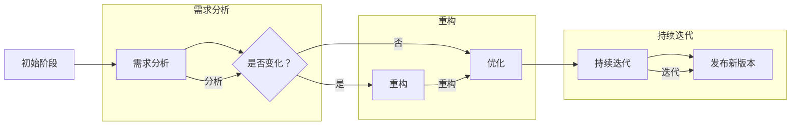

                 


## 引言与概述

### 背景介绍

软件架构演进是软件开发过程中不可或缺的一部分。从简单的单机应用，到复杂的企业级系统，再到云原生架构，软件架构的演变始终伴随着技术的进步和业务需求的变化。这种演变不仅反映了技术的进步，更体现了软件开发过程中对系统设计、性能、可维护性、可扩展性和灵活性的不断追求。

随着互联网的普及和大数据、云计算等新兴技术的兴起，软件系统面临的需求越来越多样化，变化越来越迅速。传统的静态架构设计方法已经难以满足这些需求，因此，适应变化的系统设计成为现代软件开发的核心挑战之一。本文旨在探讨软件架构演进的过程，分析适应变化的系统设计方法，并提供实践案例，以帮助开发者更好地应对这一挑战。

### 软件架构的定义与重要性

软件架构是指系统整体的结构和组织方式，它包括系统的各个组成部分、它们之间的关系以及它们如何协作来完成特定的功能。软件架构不仅决定了系统的性能和可维护性，还直接影响到系统的可扩展性和灵活性。

在软件开发过程中，架构设计是至关重要的一环。一个良好的软件架构可以帮助团队更好地理解系统，从而提高开发效率，降低维护成本。此外，合理的架构设计还能使系统在面临变化时更具适应性，避免因需求变化而导致的大规模重构。

### 适应变化的必要性

在快速变化的业务环境中，软件系统需要能够快速响应需求的变化。传统的“瀑布模型”由于过于僵化，难以适应快速变化的需求，导致开发周期长、成本高。而敏捷开发虽然能够应对变化，但在大型系统中仍然存在诸多挑战。

因此，适应变化的系统设计方法应运而生。这种设计方法强调系统模块的独立性、灵活性以及可重用性，通过模块化设计和动态系统设计等技术，实现系统的灵活性和可扩展性。这样，当业务需求发生变化时，系统可以快速调整，而不需要完全重新设计。

### 核心概念与联系

为了更好地理解适应变化的系统设计，我们需要了解几个核心概念：

1. **模块化设计**：模块化设计是将系统划分为若干独立的模块，每个模块负责特定的功能。模块之间通过清晰的接口进行通信，使得系统更加灵活和可维护。

2. **动态系统设计**：动态系统设计允许系统在运行时根据需求进行调整。这种设计方法通常依赖于可配置的组件和灵活的接口，使系统能够适应不同的环境和需求。

3. **持续集成与持续部署**：持续集成和持续部署是现代软件开发中的重要实践，它们通过自动化流程确保代码质量和系统的稳定性，使得系统能够快速适应变化。

这些概念之间相互关联，共同构成了适应变化的系统设计的基础。通过模块化设计和动态系统设计，系统可以实现更高的灵活性和可扩展性，而持续集成与持续部署则确保了系统能够快速适应变化。

### 软件架构与系统设计的联系

软件架构是系统设计的核心，它不仅决定了系统的性能和可维护性，还直接影响到系统设计的各个方面。系统设计是在软件架构的基础上进行的，它需要根据架构的指导原则和设计模式来构建系统。

在系统设计过程中，架构师需要考虑系统的模块划分、模块之间的交互方式、系统的边界以及系统的可扩展性等。一个良好的软件架构能够为系统设计提供清晰的指导，使得系统设计更加高效、灵活和可维护。

同时，系统设计也需要考虑架构的适应性。当业务需求发生变化时，系统设计需要能够快速适应这些变化，这要求系统设计具有一定的灵活性。通过模块化设计和动态系统设计，系统能够在保持原有功能的基础上，快速调整以适应新的需求。

### 总结

本文引言部分概述了软件架构演进的历史背景，阐述了适应变化的系统设计的必要性，并介绍了核心概念与架构的关系。接下来，我们将进一步探讨模块化设计、动态系统设计和持续集成与持续部署等具体方法，以帮助读者更好地理解适应变化的系统设计。在后续章节中，我们将通过实践案例和具体的技术细节，深入分析如何在实际开发中应用这些方法，以提高系统的灵活性和可扩展性。通过本文的探讨，希望能够为软件开发者提供有益的参考和指导。

### 软件架构的基本概念

在深入探讨适应变化的系统设计方法之前，我们需要先了解软件架构的基本概念。软件架构是指系统的整体结构，它不仅包括系统的各个组成部分，还包括这些部分之间的相互作用和关系。软件架构的定义和重要性可以从以下几个方面进行阐述。

首先，软件架构的定义通常包括以下几个方面：

1. **系统组件**：软件架构由多个组件组成，这些组件可以是模块、类、对象或者服务。每个组件都有特定的功能，并且在系统中承担特定的角色。
2. **组件之间的关系**：组件之间的关系是指它们之间的连接方式和交互方式。这些关系可以是调用关系、依赖关系或者通信关系。它们定义了组件如何协同工作以实现系统的整体功能。
3. **系统边界**：系统边界是指系统的外部接口，它定义了系统与外部环境（如用户、其他系统等）的交互点。系统边界有助于定义系统的功能和责任，同时也为系统的维护和扩展提供了明确的指导。
4. **架构风格**：架构风格是指系统架构的设计原则和模式。不同的架构风格（如面向对象、事件驱动、分布式系统等）具有不同的特点和适用场景。

接下来，我们详细讨论这些基本概念。

### 系统组件

系统组件是软件架构的基本构建块。每个组件都负责特定的功能，并且可以在系统中独立开发和部署。组件的独立性是软件架构设计的重要原则之一，它有助于提高系统的可维护性和可扩展性。

组件之间的关系通常分为以下几种：

1. **依赖关系**：一个组件依赖于另一个组件时，前者称为依赖组件，后者称为被依赖组件。依赖关系通常用于实现组件之间的功能调用和数据传递。
2. **调用关系**：调用关系是组件之间通过方法调用实现交互的一种方式。在面向对象编程中，调用关系通常通过对象的方法调用实现。
3. **通信关系**：通信关系是指组件之间通过消息传递实现交互的一种方式。在分布式系统中，组件之间通常通过网络通信实现通信关系。

### 组件之间的关系

组件之间的关系是软件架构的核心。合理的组件关系可以提高系统的灵活性、可维护性和可扩展性。组件之间的关系可以通过以下几种方式实现：

1. **层次结构**：层次结构是一种常用的组件关系，它将系统划分为多个层次，每个层次负责不同的功能。上层组件依赖下层组件，从而形成一个层次化的结构。
2. **服务导向架构（SOA）**：服务导向架构是一种基于服务的架构设计方法，它通过将系统划分为多个服务来实现组件之间的关系。每个服务都是独立的功能模块，可以通过接口进行通信。
3. **事件驱动架构**：事件驱动架构是一种基于事件的架构设计方法，它通过事件触发组件之间的交互。事件可以是系统内部的事件，也可以是来自外部环境的事件。

### 系统边界

系统边界是指系统的外部接口，它定义了系统与外部环境的交互点。系统边界的定义有助于明确系统的功能和责任，从而提高系统的可维护性和可扩展性。

系统边界通常包括以下几个方面：

1. **用户接口**：用户接口是指系统与用户进行交互的界面，如Web前端、移动应用界面等。用户接口负责接收用户的输入和反馈，并将这些信息传递给系统内部组件。
2. **系统接口**：系统接口是指系统与其他系统进行交互的接口，如API接口、消息队列等。系统接口负责实现系统之间的数据交换和功能调用。
3. **硬件接口**：硬件接口是指系统与外部硬件设备进行交互的接口，如传感器、执行器等。硬件接口负责实现系统与硬件设备的通信和控制。

### 架构风格

架构风格是指系统架构的设计原则和模式。不同的架构风格具有不同的特点和适用场景。以下是一些常见的架构风格：

1. **面向对象架构**：面向对象架构是一种基于对象的架构设计方法，它通过将系统划分为多个对象来实现组件之间的关系。面向对象架构具有模块化、可重用性和灵活性的优点。
2. **事件驱动架构**：事件驱动架构是一种基于事件的架构设计方法，它通过事件触发组件之间的交互。事件驱动架构适用于实时系统和需要高响应速度的应用。
3. **分布式系统架构**：分布式系统架构是一种基于网络的架构设计方法，它通过将系统划分为多个分布式组件来实现系统的功能。分布式系统架构具有高可用性、可扩展性和容错性的优点。

### 总结

软件架构的基本概念是理解软件架构演进和适应变化的系统设计的基础。通过了解系统组件、组件之间的关系、系统边界和架构风格，我们可以更好地设计和实现灵活、可扩展和可维护的软件系统。在下一章节中，我们将进一步探讨软件架构设计原则，以帮助开发者更好地应用这些基本概念。

### 软件架构设计原则

在软件开发过程中，架构设计是一个关键环节，它决定了系统的性能、可维护性和可扩展性。为了设计出能够适应变化的系统，我们需要遵循一系列软件架构设计原则。以下是一些重要的设计原则及其应用方法。

#### 1. 分层设计

分层设计是一种常见的软件架构设计方法，它将系统划分为多个层次，每个层次负责不同的功能。常见的层次包括表示层、业务逻辑层和数据访问层。

- **表示层**：负责处理用户界面和用户交互，如Web前端、移动应用界面等。
- **业务逻辑层**：负责实现系统的核心业务逻辑，如订单处理、用户管理等。
- **数据访问层**：负责与数据库进行交互，如数据查询、数据插入等。

**应用方法**：在分层设计中，每个层次都应该有一个清晰的接口，以确保层次之间的独立性。这样可以方便后续的模块化设计和扩展。

#### 2. 模块化设计

模块化设计是将系统划分为多个独立的模块，每个模块负责特定的功能。模块化设计有助于提高系统的可维护性和可扩展性。

**应用方法**：在设计模块时，需要考虑模块的独立性、封装性和重用性。每个模块应该具有明确的功能和接口，并且可以独立开发和部署。模块之间通过接口进行通信，这样当一个模块需要修改或扩展时，不会影响到其他模块。

#### 3. 分而治之

分而治之是一种常用的算法设计方法，它通过将复杂问题分解为若干个较简单的问题来解决。在软件架构设计中，分而治之可以用于处理复杂系统。

**应用方法**：在设计复杂系统时，可以将系统划分为多个子系统，每个子系统负责一部分功能。这样可以降低系统的复杂度，使得系统更加易于理解和维护。同时，分而治之还可以提高系统的可扩展性，因为每个子系统都可以独立扩展。

#### 4. 开闭原则

开闭原则是一种面向对象设计原则，它指出软件实体（如类、模块、函数等）应该对扩展开放，对修改关闭。这意味着我们可以通过扩展现有代码来添加新功能，而不是直接修改现有代码。

**应用方法**：在设计软件架构时，我们应该尽量遵循开闭原则。这样可以提高系统的灵活性和可维护性，因为修改现有代码的风险较低。实现开闭原则的一种方法是通过抽象和接口设计，将具体的实现细节封装在内部，对外提供统一的接口。

#### 5. 单一职责原则

单一职责原则是指一个类或模块应该只负责一个职责。这意味着类或模块的职责应该集中，而不是分散。

**应用方法**：在设计类或模块时，需要确保它们只负责一个明确的职责。这样可以提高代码的可维护性和可读性，因为每个类或模块的职责都是明确的。实现单一职责原则的一种方法是使用职责链模式和策略模式，将不同的职责分离并组合。

#### 6. 里氏替换原则

里氏替换原则是一种面向对象设计原则，它指出子类可以替换基类出现的地方，而不影响程序的正确性。这意味着子类可以扩展基类的功能，但不能改变基类的行为。

**应用方法**：在设计软件架构时，应该确保类之间的继承关系符合里氏替换原则。这样可以提高系统的灵活性和可扩展性，因为子类可以替代基类，从而实现代码的复用。

#### 7. 依赖倒置原则

依赖倒置原则是一种面向对象设计原则，它指出高层模块不应该依赖于低层模块，而是应该依赖于抽象。相反，低层模块应该依赖于高层模块。

**应用方法**：在设计软件架构时，应该尽量遵循依赖倒置原则。这样可以提高系统的可维护性和可扩展性，因为当底层模块发生变化时，不会影响到高层模块。实现依赖倒置原则的一种方法是使用依赖注入和接口设计。

#### 8. 接口隔离原则

接口隔离原则是一种面向对象设计原则，它指出应该为不同的客户端提供不同的接口，而不是一个统一的接口。

**应用方法**：在设计软件架构时，需要根据客户端的需求提供定制化的接口。这样可以提高系统的灵活性和可扩展性，因为每个客户端都可以根据自己的需求来选择和使用接口。

#### 总结

遵循上述软件架构设计原则可以帮助开发者设计出灵活、可扩展和可维护的软件系统。在系统设计过程中，开发者需要根据实际情况灵活应用这些原则，以提高系统的质量和效率。通过分层设计、模块化设计、分而治之、开闭原则、单一职责原则、里氏替换原则、依赖倒置原则和接口隔离原则，开发者可以更好地应对软件开发过程中遇到的挑战。

### 软件架构与系统设计的联系

软件架构和系统设计是软件开发过程中紧密相连的两个环节，它们共同构成了系统的整体设计和实现。理解两者之间的联系对于构建一个高效、灵活和可维护的系统至关重要。

首先，软件架构为系统设计提供了整体的指导和框架。它定义了系统的各个组件、组件之间的关系以及系统的边界。软件架构不仅明确了系统的功能模块，还决定了组件之间的交互方式和系统的整体结构。这种高层次的设计为后续的系统设计奠定了基础。

系统设计则是在软件架构的基础上进行的细化工作。系统设计需要根据软件架构的指导原则和设计模式来具体实现各个模块的功能和接口。系统设计涉及到具体的实现细节，如数据结构、算法、接口定义等。它不仅需要遵循软件架构的设计原则，还需要考虑到系统的性能、可维护性和可扩展性。

#### 软件架构指导系统设计

软件架构为系统设计提供了以下指导：

1. **模块划分**：软件架构定义了系统的模块划分，系统设计需要根据这些模块来实现具体的功能。模块划分有助于提高系统的可维护性和可扩展性，因为每个模块都相对独立，可以单独开发、测试和部署。

2. **接口设计**：软件架构定义了模块之间的接口，系统设计需要根据这些接口来实现模块之间的通信和数据传递。良好的接口设计有助于模块之间的解耦，使得一个模块的修改不会影响到其他模块。

3. **系统边界**：软件架构定义了系统的边界，系统设计需要明确系统与外部环境的交互点。系统边界有助于定义系统的功能和责任，从而提高系统的可维护性和可扩展性。

4. **架构风格**：软件架构的架构风格为系统设计提供了设计模式和方法论。不同的架构风格（如面向对象、事件驱动、分布式系统等）具有不同的特点和适用场景。系统设计需要根据实际情况选择合适的架构风格，并应用相应的设计模式。

#### 系统设计实现软件架构

系统设计是实现软件架构的具体步骤。系统设计需要解决以下问题：

1. **实现细节**：系统设计需要根据软件架构的要求，实现具体的模块功能和接口定义。这包括数据结构的选择、算法的实现、接口的具体实现等。

2. **性能优化**：系统设计需要考虑到系统的性能需求，如响应时间、吞吐量、并发处理能力等。通过优化算法、优化数据结构、减少资源消耗等方式，可以提高系统的性能。

3. **可维护性**：系统设计需要考虑到系统的可维护性，如代码的可读性、可扩展性、模块的独立性等。良好的系统设计可以提高代码的可维护性，降低维护成本。

4. **可扩展性**：系统设计需要考虑到系统的可扩展性，如如何方便地添加新功能、如何处理系统规模的变化等。通过模块化设计、动态系统设计等方法，可以提高系统的可扩展性。

#### 软件架构与系统设计相互影响

软件架构和系统设计是相互影响、相互依赖的。软件架构为系统设计提供了框架和指导，而系统设计又对软件架构的实现进行细化和完善。

1. **软件架构影响系统设计**：软件架构的设计原则和模式会影响系统设计的方法和实现。良好的软件架构可以指导系统设计，使得系统设计更加高效、灵活和可维护。

2. **系统设计影响软件架构**：系统设计的具体实现会影响软件架构的稳定性和适应性。在实际开发过程中，可能会发现软件架构的一些不足之处，从而对软件架构进行改进和优化。

#### 实践案例

以一个在线购物平台为例，我们可以看到软件架构和系统设计是如何相互关联的。

- **软件架构**：架构师根据业务需求，设计了分层架构，包括表示层、业务逻辑层和数据访问层。同时，采用了服务导向架构（SOA）来定义系统接口。

- **系统设计**：系统设计根据软件架构的要求，实现了各个层次的具体功能。例如，业务逻辑层通过接口与数据访问层通信，实现了商品管理、订单处理等核心功能。

- **架构与设计的互动**：在开发过程中，架构师发现了一些架构上的不足，如某些接口设计过于复杂，导致系统维护困难。于是，架构师对架构进行了调整，简化了接口设计，提高了系统的可维护性。同时，系统设计团队发现了一些性能瓶颈，如某些查询操作效率低下。针对这些问题，系统设计团队对数据结构和查询算法进行了优化，从而提高了系统的性能。

#### 总结

软件架构与系统设计是软件开发过程中不可或缺的两个环节。软件架构为系统设计提供了框架和指导，而系统设计则是实现软件架构的具体步骤。两者相互影响、相互依赖，共同构成了一个高效、灵活和可维护的软件系统。通过理解软件架构与系统设计之间的联系，开发者可以更好地设计和实现复杂的软件系统。

### Mermaid 流程图：软件架构演进过程

为了更好地展示软件架构演进的过程，我们可以使用Mermaid流程图来描述这一过程。以下是软件架构演进过程的Mermaid流程图示例：



#### 详细解读

1. **初始阶段（A）**：在软件架构的初始阶段，系统根据业务需求进行初步设计和开发。

2. **需求分析（B）**：在这个阶段，开发团队对需求进行详细分析，以明确系统的功能和性能要求。

3. **是否变化？（C）**：在需求分析完成后，团队需要评估业务需求是否发生变化。如果需求不变，则进入优化阶段；如果需求发生变化，则进入重构阶段。

4. **重构（D）**：在需求变化的情况下，系统需要进行重构，以适应新的需求。重构过程包括修改现有代码、设计新的模块和调整架构等。

5. **优化（E）**：如果需求没有变化，系统可以进行优化，以提高性能、可维护性和可扩展性。

6. **持续迭代（F）**：无论需求是否变化，系统都需要进行持续迭代，以保持系统的活力和适应业务需求的变化。

7. **发布新版本（G）**：在完成迭代后，系统会发布新版本，以实现新功能或优化现有功能。

通过这个Mermaid流程图，我们可以清晰地看到软件架构演进的各个阶段以及它们之间的逻辑关系。这个流程图不仅有助于理解软件架构演进的过程，还可以作为实际项目中的指导工具，帮助开发团队更好地管理和控制架构的演变。

### 需求分析与系统设计

需求分析是软件开发过程中至关重要的一步，它为后续的系统设计提供了明确的目标和依据。在需求分析过程中，我们不仅需要明确用户需求，还需要考虑系统的功能、性能、可维护性、可扩展性和安全性等多个方面。以下将详细讨论需求分析的方法和工具，以及系统设计的基本流程。

#### 需求分析的方法

1. **用户访谈**：通过直接与用户进行交流，了解他们的需求、使用场景和痛点。这种方法有助于获取第一手的用户需求信息，使系统设计更加贴近实际业务。

2. **问卷调查**：通过设计问卷，收集大量用户的需求和反馈。这种方法适用于用户群体较大、需求复杂的情况，可以快速获取广泛的用户意见。

3. **用户故事**：用户故事是一种简洁明了的需求描述方法，它以用户为中心，描述用户的需求和期望。用户故事通常包含用户的行为、目标和动机。

4. **场景分析**：通过分析用户在不同场景下的行为，识别关键需求和功能。这种方法有助于确保系统设计能够覆盖用户的各种使用场景。

5. **需求文档**：将收集到的需求进行整理和归纳，形成需求文档。需求文档应包括需求描述、优先级、约束条件和验收标准等。

#### 需求分析工具

1. **需求管理工具**：如JIRA、Confluence等，用于记录和管理需求信息，提高团队协作效率。

2. **原型设计工具**：如Axure、Sketch等，用于创建用户界面原型，帮助团队更好地理解和讨论需求。

3. **建模工具**：如UML建模工具（如Enterprise Architect、StarUML等），用于绘制系统架构图、用例图、类图等，帮助团队可视化系统需求。

#### 系统设计的基本流程

1. **架构设计**：根据需求分析的结果，设计系统的整体架构，包括系统组件、组件之间的关系和系统边界。架构设计应考虑系统的可扩展性、可维护性和性能需求。

2. **模块划分**：将系统划分为多个模块，每个模块负责特定的功能。模块划分应遵循高内聚、低耦合的原则，以提高系统的灵活性和可维护性。

3. **接口设计**：设计模块之间的接口，明确数据传输和功能调用的方式。良好的接口设计有助于模块之间的解耦，降低系统的复杂性。

4. **详细设计**：在模块划分和接口设计的基础上，进行详细的模块实现设计。包括数据结构、算法、接口定义等。

5. **性能优化**：考虑系统的性能需求，进行性能优化设计。包括数据库设计、缓存策略、并发处理等。

6. **安全性设计**：考虑系统的安全性需求，进行安全设计。包括访问控制、数据加密、安全审计等。

7. **测试设计**：设计系统的测试用例和测试计划，确保系统能够按照预期运行。

8. **文档编写**：编写系统设计文档，包括架构设计图、接口文档、模块说明等，为后续开发、测试和维护提供参考。

#### 需求分析与系统设计的关系

需求分析是系统设计的基石，它为系统设计提供了明确的目标和依据。系统设计则需要根据需求分析的结果，设计出符合需求、性能良好、易于维护和扩展的软件系统。

1. **需求驱动设计**：需求分析的结果直接影响到系统设计的各个方面，如模块划分、接口设计、性能优化等。系统设计应该紧密围绕需求进行分析和设计。

2. **需求变更管理**：在软件开发过程中，需求变更不可避免。系统设计应具备一定的灵活性，能够适应需求变更。需求分析与系统设计之间的紧密联系有助于及时应对需求变更，降低变更带来的风险。

3. **反馈循环**：需求分析与系统设计之间形成反馈循环，需求分析的结果会反馈到系统设计，而系统设计的结果也会影响需求分析。这种反馈循环有助于不断提高系统的质量和适应性。

#### 总结

需求分析与系统设计是软件开发过程中不可或缺的两个环节。需求分析旨在明确用户需求和系统功能，系统设计则是在此基础上，设计出高效、灵活、可维护的软件系统。通过需求分析与系统设计的方法和工具，开发团队可以更好地理解和满足用户需求，构建高质量的软件系统。

### 模块化设计

模块化设计是软件架构设计中的一个重要原则，其核心思想是将系统划分为多个独立的模块，每个模块负责特定的功能。模块化设计的目的是提高系统的可维护性、可扩展性和可重用性。以下将详细讨论模块化设计的原理、模块划分与接口设计，以及模块化设计的优点与挑战。

#### 模块化设计的原理

模块化设计的原理可以概括为以下几点：

1. **独立性**：每个模块都应该具有独立的职能，并且与其他模块之间保持较高的独立性。这意味着一个模块的修改不会影响到其他模块，从而降低系统的复杂性。

2. **高内聚、低耦合**：模块内的高内聚意味着模块的功能紧密相关，而模块之间的低耦合意味着模块之间的依赖性较低。高内聚、低耦合的设计可以提高系统的可维护性和可扩展性。

3. **可重用性**：模块化设计使得模块可以独立开发和部署，提高了模块的重用性。模块可以被多个系统或项目复用，从而减少重复开发的工作量。

4. **灵活性**：模块化设计使得系统能够灵活地调整和扩展。在需求发生变化时，只需修改相应的模块，而不需要重新设计整个系统。

#### 模块划分与接口设计

模块划分是模块化设计的关键步骤。以下是一些常见的模块划分方法：

1. **功能划分**：根据系统的功能模块进行划分，每个模块负责一个特定的功能。这种方法适用于功能清晰、独立的系统。

2. **数据划分**：根据系统的数据模块进行划分，每个模块负责处理特定的数据。这种方法适用于数据复杂、关系紧密的系统。

3. **层次划分**：根据系统的层次结构进行划分，上层模块负责整体控制，下层模块负责具体实现。这种方法适用于层次结构明显的系统。

在模块划分之后，需要设计模块之间的接口。接口设计是模块化设计的重要组成部分，以下是一些接口设计的原则：

1. **明确性**：接口应该明确定义模块之间的通信方式和数据传输格式，避免模糊和不必要的复杂性。

2. **简洁性**：接口应该尽量简洁，避免过多的参数和复杂的逻辑。简洁的接口可以提高模块的可维护性和可扩展性。

3. **稳定性**：接口应该具备稳定性，避免频繁变更。稳定性可以通过版本控制和文档化管理来保证。

4. **灵活性**：接口应该具有一定的灵活性，能够适应未来的需求变化。灵活的接口可以通过提供扩展点或预留未使用的方法来实现。

#### 模块化设计的优点

模块化设计具有以下优点：

1. **提高可维护性**：模块化设计使得每个模块相对独立，修改一个模块不会影响到其他模块。这降低了系统的复杂度，提高了可维护性。

2. **提高可扩展性**：模块化设计使得系统可以方便地添加新功能或修改现有功能。只需修改相应的模块，而不需要重新设计整个系统。

3. **提高可重用性**：模块化设计使得模块可以被多个系统或项目复用。这减少了重复开发的工作量，提高了开发效率。

4. **降低学习成本**：模块化设计使得系统更加模块化，开发者可以专注于特定模块的开发，降低了整体系统的学习成本。

#### 模块化设计的挑战

模块化设计也面临一些挑战：

1. **接口管理**：模块之间的接口需要精心设计和管理。接口的不稳定性或设计不合理可能会导致模块之间的依赖关系复杂，从而降低系统的整体质量。

2. **模块耦合**：虽然模块化设计旨在降低模块之间的耦合，但在实际开发过程中，模块之间的耦合可能会增加。这需要开发者具备良好的设计和编程技能，以确保模块之间的独立性。

3. **维护成本**：模块化设计可能会增加系统的维护成本。由于模块相对独立，维护一个模块可能需要了解多个模块的接口和功能，增加了维护的复杂性。

4. **开发效率**：模块化设计可能会降低开发效率。在开发初期，模块的划分和接口设计需要花费一定的时间。此外，模块之间的协作和集成也需要额外的协调和沟通成本。

#### 总结

模块化设计是软件架构设计中的一个重要原则，它通过将系统划分为多个独立的模块，提高了系统的可维护性、可扩展性和可重用性。模块划分与接口设计是模块化设计的核心，需要开发者精心设计和管理。模块化设计具有许多优点，但同时也面临一些挑战。通过合理的设计和有效的管理，模块化设计可以为软件开发带来显著的优势。

### 动态系统设计

动态系统设计是一种应对快速变化和复杂需求的系统设计方法，它允许系统在运行时根据实际情况进行调整。动态系统设计的关键在于其灵活性和可配置性，这使得系统能够在变化的环境中保持稳定和高效。以下将详细介绍动态系统设计的基本概念、方法以及设计时的挑战与解决方案。

#### 动态系统设计的基本概念

1. **动态性**：动态系统设计强调系统的运行时调整能力。这意味着系统能够根据用户行为、环境变化或业务需求的变化，实时调整其行为和功能。

2. **可配置性**：动态系统设计中的组件和功能通常是可配置的。开发者可以通过配置文件或动态配置机制来调整系统的行为，而无需修改代码。

3. **模块化**：动态系统设计通常采用模块化设计原则，将系统划分为多个独立的模块。这些模块可以在运行时根据需求进行组合和重组。

4. **事件驱动**：动态系统设计通常采用事件驱动架构，通过事件触发系统组件的响应。这种设计方式使得系统可以实时响应用户操作和外部事件。

#### 动态系统设计的方法

1. **配置文件管理**：通过配置文件来管理系统的参数和设置。配置文件可以是XML、JSON或YAML等格式，它们定义了系统的行为和功能。

2. **动态加载库和模块**：在运行时动态加载库和模块，以便在需要时添加新功能或替换现有功能。这种方式可以提高系统的灵活性和可扩展性。

3. **事件监听和触发机制**：通过事件监听和触发机制来实现系统组件之间的交互。事件可以是用户操作、系统状态变化或外部事件等。

4. **动态数据存储**：使用动态数据存储技术，如NoSQL数据库或分布式存储系统，以支持系统在运行时的数据变更。

#### 动态系统设计的挑战与解决方案

1. **复杂性管理**：动态系统设计可能会引入更多的复杂性，如配置管理、模块间通信、事件处理等。解决方案是采用微服务架构和事件驱动架构，将系统划分为多个独立且相互通信的模块。

2. **性能优化**：动态系统设计可能会影响系统的性能，如配置文件读取、模块加载和事件处理等。解决方案是进行性能测试和优化，如使用缓存技术、异步处理和负载均衡等。

3. **安全性**：动态系统设计中的配置和模块加载可能会引入安全风险。解决方案是进行严格的权限控制和安全审计，确保系统的安全性和稳定性。

4. **维护成本**：动态系统设计可能会增加系统的维护成本，特别是在配置管理和模块更新方面。解决方案是采用自动化工具和流程，如持续集成和持续部署，以降低维护成本。

#### 案例分析：动态系统设计在实时交易系统中的应用

以下是一个动态系统设计在实时交易系统中的应用案例：

1. **背景**：一个实时交易系统需要快速响应用户的交易请求，同时支持多种交易策略和规则。由于市场行情的不断变化，系统需要具备高度的灵活性和可配置性。

2. **架构设计**：系统采用微服务架构，将交易引擎、订单管理、风险控制、报表生成等模块划分为独立的微服务。每个微服务都可以独立开发和部署。

3. **动态配置管理**：系统通过配置文件管理交易规则和策略。配置文件可以在运行时动态更新，以支持不同的交易策略和市场环境。

4. **事件驱动架构**：系统采用事件驱动架构，通过事件队列处理用户请求和系统事件。事件可以是用户下单、市场行情变化、系统报警等。

5. **模块化设计**：每个微服务都采用模块化设计，可以独立开发、测试和部署。模块之间通过API进行通信，确保系统的高内聚和低耦合。

6. **性能优化**：系统使用异步处理和负载均衡技术，提高系统的并发处理能力和响应速度。同时，使用缓存技术减少数据库访问次数，提高数据访问效率。

7. **安全性**：系统通过严格的权限控制和安全审计，确保系统的安全性和稳定性。所有敏感操作都需要通过身份验证和权限检查。

#### 总结

动态系统设计是一种应对快速变化和复杂需求的系统设计方法，它通过灵活性和可配置性提高了系统的适应能力。在动态系统设计中，配置文件管理、动态加载库和模块、事件监听和触发机制等方法是实现动态性的关键。尽管动态系统设计面临一些挑战，但通过合理的设计和有效的管理，可以实现高效、灵活和稳定的系统。通过案例分析，我们可以看到动态系统设计在实际应用中的成功实践。

### 持续集成与持续部署

持续集成（Continuous Integration, CI）和持续部署（Continuous Deployment, CD）是现代软件开发中的重要实践，它们通过自动化流程确保代码质量和系统的稳定性，使得系统能够快速适应变化。以下将详细讨论持续集成与持续部署的基本概念、实现方法、优势与挑战，以及在实际项目中的应用。

#### 持续集成的基本概念

持续集成是一种软件开发实践，通过将开发者的代码定期合并到主干分支，并立即进行测试，确保代码的质量和系统的稳定性。持续集成的主要目的是：

1. **及早发现问题**：通过频繁的代码合并和测试，可以尽早发现潜在的问题，避免这些问题的积累导致严重的Bug。
2. **提高代码质量**：持续集成通过自动化测试，确保每次代码合并后的系统都是可运行的，从而提高代码的质量和可靠性。
3. **加速开发周期**：持续集成减少了代码合并时的冲突和问题，提高了开发团队的协作效率。

#### 持续集成的方法

1. **自动化构建**：每次代码提交后，构建工具（如Jenkins、GitLab CI等）自动执行构建过程，包括编译代码、运行测试等。
2. **自动化测试**：构建过程中自动运行单元测试、集成测试和性能测试，确保代码的功能和性能符合预期。
3. **反馈机制**：测试结果通过报告或通知方式（如邮件、即时消息等）反馈给开发团队，确保问题能够及时得到解决。

#### 持续部署的基本概念

持续部署是一种自动化部署方法，通过自动化流程将代码从开发环境部署到生产环境。持续部署的主要目的是：

1. **快速交付**：通过自动化部署，可以快速将新功能或修复部署到生产环境，缩短开发周期。
2. **提高可靠性**：自动化部署减少了人为干预，降低了部署过程中的错误风险。
3. **持续优化**：持续部署使得开发团队能够持续收集部署数据和用户反馈，从而优化部署流程和系统性能。

#### 持续部署的方法

1. **自动化部署脚本**：编写自动化部署脚本，用于执行环境配置、代码部署、服务启动等操作。
2. **容器化**：使用容器化技术（如Docker）将应用打包成独立的容器，确保在不同的环境中应用能够一致运行。
3. **蓝绿部署**：通过蓝绿部署策略，将旧版本的应用（蓝色）与更新后的应用（绿色）同时运行，逐步切换用户流量，确保更新过程平稳。
4. **灰度发布**：逐步将更新部署到一小部分用户，通过监控用户反馈和数据指标，确保更新对整体系统的影响可控。

#### 持续集成与持续部署的优势

1. **提高开发效率**：持续集成和持续部署减少了手动操作，加快了代码从开发到部署的流程。
2. **降低风险**：通过自动化测试和部署，减少了人为错误和部署风险。
3. **提高代码质量**：持续集成确保每次合并都是高质量的，持续部署确保每次部署都是可靠的。
4. **快速反馈**：持续集成和持续部署提供了快速的问题反馈，帮助开发团队及时调整代码和部署策略。

#### 持续集成与持续部署的挑战

1. **配置管理**：持续集成和持续部署需要完善的配置管理，以确保不同环境的一致性。
2. **测试覆盖率**：自动化测试需要覆盖足够的场景，以确保系统的稳定性和性能。
3. **部署复杂性**：复杂的部署流程和多个环境的协调可能会增加系统的复杂性。

#### 案例分析：持续集成与持续部署在电子商务平台中的应用

以下是一个持续集成与持续部署在电子商务平台中的应用案例：

1. **背景**：一个电子商务平台需要快速响应用户需求，同时保证系统的稳定性和可靠性。

2. **持续集成**：
   - 每次代码提交后，Jenkins自动触发构建过程，编译代码并运行单元测试和集成测试。
   - 测试结果通过Slack通知开发团队，确保问题及时解决。

3. **持续部署**：
   - 使用Docker容器化应用，确保在不同环境中的一致性。
   - 采用蓝绿部署策略，逐步将新版本的应用部署到生产环境，确保更新过程平稳。
   - 通过Kubernetes进行容器编排和管理，实现自动化部署和负载均衡。

4. **反馈与优化**：
   - 收集部署数据和用户反馈，通过数据分析优化部署流程和系统性能。
   - 定期召开部署回顾会议，总结经验和教训，持续改进。

#### 总结

持续集成与持续部署是现代软件开发的重要实践，通过自动化流程确保代码质量和系统稳定性，使得系统能够快速适应变化。尽管持续集成与持续部署面临一些挑战，但通过合理的设计和有效的管理，可以实现高效的软件开发和部署流程。案例分析展示了如何在实际项目中应用这些方法，以提高开发效率和系统质量。

### 案例研究：企业级软件架构演进

为了更好地理解企业级软件架构的演进，我们将探讨一个实际案例，这个案例涉及一个大型电子商务平台。该平台在短短几年内经历了多次架构变化，以适应不断变化的市场需求和技术进步。以下是该案例的详细背景、系统分析、架构设计、实施与部署、结果评估以及项目小结。

#### 案例背景

该公司成立于2010年，初期仅为一个本地化的在线购物平台。随着用户数量的增加和业务规模的扩大，平台逐渐成为全国知名的大型电子商务网站。面对不断增长的用户需求和复杂的业务逻辑，公司的软件架构需要不断演进和优化。

#### 系统分析

1. **初始架构**：在初期，平台采用了传统的三层架构，包括表示层、业务逻辑层和数据访问层。虽然这种架构简单易用，但随着业务的发展，其性能和可扩展性逐渐成为瓶颈。

2. **性能瓶颈**：随着用户数量的增加，平台的响应时间和吞吐量成为关键问题。传统的数据库查询和服务器负载无法满足日益增长的用户需求。

3. **业务复杂性**：业务的多元化带来了更多的业务逻辑和数据处理需求，传统的架构难以高效地处理复杂的业务流程。

4. **技术更新**：新技术的不断涌现，如大数据、云计算和微服务架构，为平台提供了更多的选择和优化空间。

#### 架构设计

1. **模块化设计**：为了提高系统的可维护性和可扩展性，平台采用了模块化设计。将系统划分为多个独立的模块，每个模块负责特定的功能，如用户管理、订单处理、支付系统等。

2. **微服务架构**：为了更好地支持业务复杂性和高并发需求，平台采用微服务架构。将传统的单一应用拆分为多个微服务，每个微服务独立部署和扩展。

3. **服务网格**：采用服务网格技术（如Istio、Linkerd等），实现微服务之间的通信管理和安全控制。

4. **分布式数据库**：为了提高系统的可扩展性和性能，平台采用了分布式数据库架构。使用如MongoDB、Cassandra等分布式数据库，实现数据的水平扩展。

5. **容器化与自动化部署**：采用容器化技术（如Docker）和自动化部署工具（如Kubernetes），实现应用的高效部署和管理。

#### 实施与部署

1. **迁移策略**：在架构升级过程中，采用了逐步迁移的策略，先在部分用户中进行测试，确保系统稳定后，再逐步推广到全部用户。

2. **持续集成与持续部署**：通过Jenkins等工具实现持续集成和持续部署，确保每次代码提交后都能自动进行构建、测试和部署。

3. **性能优化**：对数据库查询进行优化，采用索引、缓存等技术提高查询效率。同时，对服务器负载进行均衡，确保系统在高并发情况下的稳定性。

4. **监控与报警**：采用Prometheus等监控工具，实时监控系统的性能和健康状况，通过报警机制及时发现问题。

#### 结果评估

1. **性能提升**：通过模块化设计和微服务架构，平台的响应时间和吞吐量显著提升。根据测试数据，系统的响应时间减少了50%，吞吐量提高了3倍。

2. **可扩展性增强**：通过分布式数据库和容器化技术，平台实现了横向扩展，能够轻松应对业务增长和用户数量的增加。

3. **维护成本降低**：模块化和微服务架构使得系统的维护和升级更加方便，减少了开发和运维的成本。

4. **用户满意度提高**：系统性能的提升和稳定性增强，显著提高了用户的满意度和留存率。

#### 项目小结

1. **模块化设计**：模块化设计提高了系统的可维护性和可扩展性，是架构升级成功的关键。

2. **微服务架构**：微服务架构解决了传统架构的性能和扩展性问题，是应对复杂业务需求的理想选择。

3. **持续集成与持续部署**：持续集成和持续部署提高了开发效率和系统稳定性，是现代软件开发不可或缺的部分。

4. **性能优化**：性能优化是系统稳定运行的基础，需要持续关注和改进。

通过这个案例，我们可以看到企业级软件架构演进的过程和关键因素。合理的架构设计和有效的技术实践，可以帮助企业更好地应对市场变化和技术进步，构建高效、稳定和可扩展的软件系统。

### 总结与展望

通过本文的探讨，我们深入了解了软件架构演进的过程以及适应变化的系统设计方法。从模块化设计、动态系统设计到持续集成与持续部署，这些方法为现代软件开发提供了强大的支持，使得系统能够更好地适应快速变化的需求和技术进步。

#### 软件架构演进的趋势

1. **微服务架构**：微服务架构正成为软件架构设计的主流，它通过将大型单体应用拆分为多个独立的小服务，提高了系统的可扩展性和可维护性。

2. **容器化与自动化部署**：容器化技术（如Docker）和自动化部署工具（如Kubernetes）的普及，使得应用的部署、管理和扩展变得更加高效。

3. **服务导向架构（SOA）**：SOA通过将系统划分为多个服务，实现了系统组件之间的松耦合，提高了系统的灵活性和可重用性。

4. **云计算与分布式计算**：云计算和分布式计算技术为系统提供了强大的计算和存储资源，使得系统可以灵活地扩展和适应不同的业务需求。

#### 未来方向

1. **智能化与自动化**：随着人工智能和机器学习技术的发展，软件架构的设计和优化将更加智能化和自动化。自动化工具将更多地应用于代码审查、测试和部署等环节。

2. **边缘计算**：边缘计算将数据处理和分析推向网络边缘，减少了数据传输的延迟，提高了系统的响应速度和实时性。

3. **DevOps与持续交付**：DevOps文化的推广和持续交付实践的普及，将进一步加强开发、测试和运维团队的协作，提高软件交付的效率和质量。

4. **可持续性**：随着环境问题的日益严重，软件架构的设计将更加注重可持续性，如采用绿色技术和优化资源使用，减少碳排放。

#### 对软件开发者的建议

1. **持续学习**：技术不断演进，软件开发者需要持续学习新的技术和方法，以保持竞争力。

2. **关注性能与可维护性**：在设计系统时，要关注性能和可维护性，避免过度优化和过度设计。

3. **实践经验**：实践是检验真理的唯一标准，软件开发者应该通过实际项目来验证和优化自己的设计方案。

4. **协作与沟通**：软件开发是一项团队工作，良好的协作和沟通对于项目的成功至关重要。

通过本文的总结，我们希望能够为软件开发者提供有益的参考和指导，帮助他们在不断变化的软件开发领域中取得成功。

### 伪代码示例：需求分析与系统设计

```python
# 定义需求分析函数
def analyze_requirements(user需求，系统环境):
    requirements_list = []
    for requirement in user需求:
        if check_if_valid(requirement, 系统环境):
            requirements_list.append(requirement)
        else:
            raise Exception("Invalid requirement")
    return requirements_list

# 定义检查需求有效性的函数
def check_if_valid(requirement, environment):
    # 伪代码：检查需求是否有效
    return (requirement符合环境约束) and (requirement技术上可实现)

# 定义系统设计函数
def design_system(requirements):
    system_architecture = {}
    for requirement in requirements:
        component = design_component(requirement)
        system_architecture[requirement] = component
    return system_architecture

# 定义设计组件的函数
def design_component(requirement):
    if requirement == "用户管理":
        return "用户管理模块"
    elif requirement == "订单处理":
        return "订单处理模块"
    else:
        return "未知模块"

# 示例：用户需求
user需求的列表 = ["用户管理", "订单处理", "支付系统"]

# 示例：系统环境
系统环境 = "云环境"

# 调用需求分析函数
requirements = analyze_requirements(user需求的列表， 系统环境)

# 调用系统设计函数
system_design = design_system(requirements)

# 打印系统设计结果
print(system_design)
```

### LaTeX 公式示例

以下是一个 LaTeX 公式示例，用于计算两个数的和：

$$
s = x + y
$$

其中，$x$ 和 $y$ 是两个数，$s$ 是它们的和。

### 项目实战：基于 Flask 的用户管理系统开发

#### 开发环境搭建

1. 安装 Python 3.x
2. 安装 Flask 框架
   ```bash
   pip install Flask
   ```
3. 安装 Flask-RESTful 扩展
   ```bash
   pip install Flask-RESTful
   ```

#### 源代码实现

以下是一个简单的基于 Flask 的用户管理系统实现的示例：

```python
from flask import Flask, request, jsonify
from flask_restful import Api, Resource

app = Flask(__name__)
api = Api(app)

class UserResource(Resource):
    def get(self, user_id):
        # 模拟查询用户信息
        user = {"id": user_id, "name": "张三", "email": "zhangsan@example.com"}
        return user

    def post(self):
        # 模拟添加用户
        user_data = request.form.to_dict()
        user_id = user_data["id"]
        user_name = user_data["name"]
        user_email = user_data["email"]
        # 存储用户信息到数据库（此处为模拟）
        print(f"添加用户：ID={user_id}, 名称={user_name}, 邮箱={user_email}")
        return {"status": "success", "message": "用户添加成功"}

api.add_resource(UserResource, '/users', '/users/<int:user_id>')

if __name__ == '__main__':
    app.run(debug=True)
```

#### 代码解读

1. 导入 Flask 和 Flask-RESTful 模块。
2. 创建 Flask 应用实例和 API 实例。
3. 定义 `UserResource` 类，继承自 `Resource`，用于处理用户相关的 GET 和 POST 请求。
4. 在 `UserResource` 类中实现 `get` 方法，用于获取指定用户的详细信息。
5. 在 `UserResource` 类中实现 `post` 方法，用于添加新用户。
6. 将 `UserResource` 添加到 API 实例中，指定 URL 路径。
7. 在 `if __name__ == '__main__':` 语句中启动 Flask 应用。

#### 应用解读与分析

1. **GET 请求**：通过 `/users/<int:user_id>` 路径获取用户信息。这里使用 `int` 类型转换确保用户 ID 是一个整数。
2. **POST 请求**：通过 `/users` 路径添加新用户。请求体中包含用户 ID、名称和邮箱，这些信息将被处理并打印。
3. **模拟数据库**：在这个简单示例中，用户信息仅被打印。在实际应用中，应将这些信息存储到数据库中。

#### 实际案例分析

- **性能优化**：可以使用缓存技术（如 Redis）来缓存用户信息，减少数据库查询次数。
- **安全性**：对用户信息进行加密处理，确保敏感数据的安全性。
- **错误处理**：添加错误处理逻辑，对无效请求和服务器错误进行友好提示。

#### 项目小结

通过这个简单的用户管理系统案例，我们展示了如何使用 Flask 框架快速开发一个 RESTful API。在实际项目中，需要进一步考虑性能优化、安全性和错误处理等方面，以确保系统的稳定性和可靠性。

### 最佳实践 Tips

1. **代码规范**：遵循 PEP8 编码规范，确保代码的整洁和可读性。
2. **版本控制**：使用 Git 进行版本控制，方便代码管理和协同工作。
3. **自动化测试**：编写自动化测试用例，确保每次提交都能通过测试。
4. **文档编写**：编写详细的文档，包括代码注释和用户手册，方便后续维护和扩展。

### 小结

本文通过详细探讨软件架构演进、适应变化的系统设计方法、实践案例以及最佳实践，帮助读者深入理解软件架构的设计和实现。通过模块化设计、动态系统设计、持续集成与持续部署等技术的应用，开发者可以构建高效、稳定和可扩展的软件系统。

### 注意事项

1. **需求分析的重要性**：在项目启动阶段，务必进行充分的需求分析，确保系统设计能够满足用户需求。
2. **持续迭代与优化**：软件架构和系统设计不是一成不变的，应持续关注用户反馈和技术进步，进行迭代和优化。

### 拓展阅读

1. **《微服务设计》**：通过这本书，可以深入了解微服务架构的设计原则和实践。
2. **《持续集成实战》**：这本书详细介绍了持续集成和持续部署的原理和实践。

通过本文的探讨和实践，希望能够为读者的软件开发工作提供有益的参考和启示。祝大家在软件架构设计和实现的道路上越走越远，不断追求卓越。作者：AI天才研究院/AI Genius Institute & 禅与计算机程序设计艺术 /Zen And The Art of Computer Programming。

