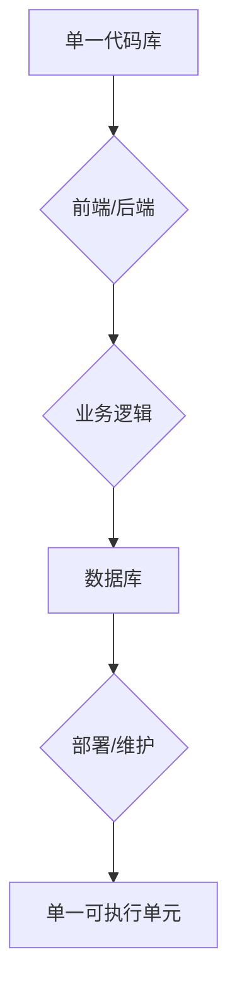
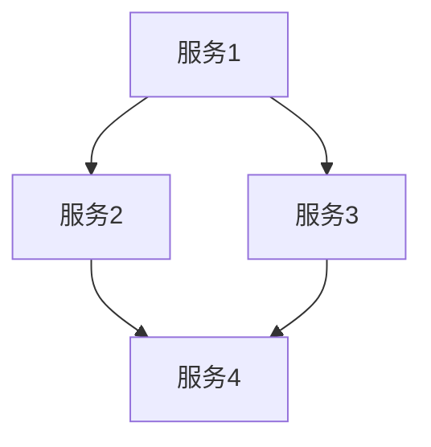
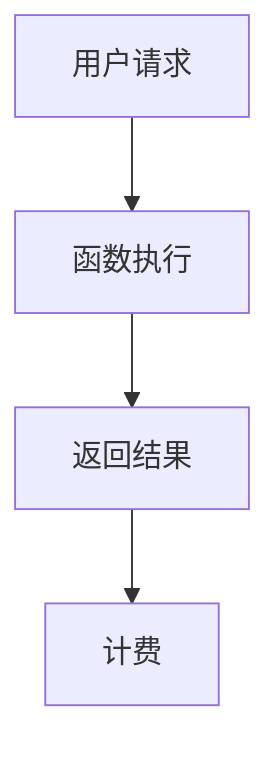

                 

### 标题：软件架构的演进：从单体到微服务再到无服务

#### 关键词：软件架构、单体架构、微服务架构、无服务架构、架构演进

#### 摘要：

本文将探讨软件架构的演变历程，从传统的单体架构，到现代的微服务架构，再到无服务架构。我们将深入分析各个架构模式的核心概念、设计原则、技术实现，并通过实际案例和最佳实践，展示软件架构的演进如何帮助企业在复杂的信息技术环境中实现高效的开发、部署和维护。

## 目录大纲设计步骤

1. **理解书籍主题**：首先，我们需要深入理解书籍的主题《软件架构的演进：从单体到微服务再到无服务》。这本书主要讲述软件架构的发展历程，从传统的单体架构到现代的无服务架构，涉及到各个阶段的核心概念、技术细节和实践案例。

2. **确定核心章节**：根据书籍的主题，我们需要确定核心的章节内容，包括软件架构的历史演进、各个架构模式的核心概念、关键技术和实践应用等。

3. **构建1级目录**：基于核心章节，我们可以构建1级目录，通常包括：
   - 引言/概述
   - 软件架构的历史演进
   - 单体架构
   - 微服务架构
   - 无服务架构
   - 实践案例

4. **细化2级目录**：在每个1级目录下，根据具体内容进一步细化2级目录，例如：
   - 每个架构模式的核心概念
   - 关键技术的详细介绍
   - 实践案例的分析

5. **构建3级目录**：在2级目录下，进一步细化3级目录，提供更详细的内容，如：
   - 每个技术或概念的详细解释
   - 伪代码示例
   - 数学模型和公式的讲解
   - 实际代码示例和解说

6. **设计流程图**：为了更直观地展示架构的发展过程，可以使用Mermaid流程图来描述各个架构模式之间的关系。

7. **总结与附录**：在最后，提供一个总结章节，对全书内容进行回顾和总结。同时，可以包括一个附录，提供相关的资源、工具和参考资料。

## 样例目录大纲

### 第一部分：引言与概述

1. **引言**：软件架构的重要性
2. **软件架构的演进背景**
3. **软件架构演进的重要性**

### 第二部分：软件架构的历史演进

1. **传统单体架构**
   1.1 **单体架构的概念**
   1.2 **单体架构的优缺点**
   1.3 **单体架构的演变**
2. **微服务架构的崛起**
   2.1 **微服务架构的概念**
   2.2 **微服务架构的优势与挑战**
   2.3 **微服务架构的设计原则**
3. **无服务架构的到来**
   3.1 **无服务架构的概念**
   3.2 **无服务架构的优势与挑战**
   3.3 **无服务架构的实现方式**

### 第三部分：单体架构详解

1. **单体架构核心概念**
   1.1 **单体架构的基础结构**
   1.2 **单体架构的数据管理**
   1.3 **单体架构的部署与维护**
2. **单体架构实践案例**
   2.1 **案例分析1：电商平台**
   2.2 **案例分析2：企业内部系统**

### 第四部分：微服务架构详解

1. **微服务架构核心概念**
   1.1 **微服务的定义**
   1.2 **微服务架构的设计原则**
   1.3 **微服务架构的技术栈**
2. **微服务架构实践案例**
   2.1 **案例分析1：金融系统**
   2.2 **案例分析2：社交媒体平台**

### 第五部分：无服务架构详解

1. **无服务架构核心概念**
   1.1 **无服务架构的定义**
   1.2 **无服务架构的优势与挑战**
   1.3 **无服务架构的实现方式**
2. **无服务架构实践案例**
   2.1 **案例分析1：物流公司**
   2.2 **案例分析2：在线教育平台**

### 第六部分：架构模式对比与选择

1. **架构模式对比**
   1.1 **单体架构与微服务架构的对比**
   1.2 **微服务架构与无服务架构的对比**
2. **架构选择策略**
   2.1 **企业如何选择合适的架构模式**
   2.2 **不同业务场景的架构模式适配**

### 第七部分：总结与展望

1. **软件架构演进的趋势**
2. **未来架构的发展方向**
3. **对开发者与企业的建议**

### 附录

1. **参考文献**
2. **常用工具与技术选型**

通过上述详细的目录大纲设计，我们可以清晰地展示软件架构的演进过程，帮助读者更好地理解和掌握各个架构模式的核心概念和实践方法。接下来，我们将逐章深入探讨每个架构模式，结合具体案例和最佳实践，为读者呈现一个全面的软件架构演进全景。

### 详细章节内容设计

#### 1. 单体架构核心概念

在这一章中，我们将深入探讨单体架构的核心概念，包括其定义、基础结构、数据管理等内容。

##### 1.1 单体架构的概念

**定义**：单体架构（Monolithic Architecture）是指将整个应用程序的所有组件（如前端、后端、数据库等）集成在一个单一的代码库中，形成一个独立的可执行单元。这种架构模式在软件开发初期非常常见。

**核心特点**：
- **单一代码库**：所有组件都在一个代码库中，便于管理和维护。
- **紧密耦合**：不同组件之间的依赖性强，修改一处可能会影响整个系统。
- **部署简单**：由于所有组件都在一个容器中，部署过程相对简单。

**Mermaid流程图**：



##### 1.2 单体架构的优缺点

**优点**：
- **开发效率高**：由于组件紧密耦合，开发人员可以快速迭代。
- **部署简单**：所有组件在同一代码库中，部署和升级相对简单。

**缺点**：
- **扩展困难**：随着业务规模扩大，系统的复杂度和维护成本增加。
- **可复用性低**：由于组件之间高度耦合，难以复用。

#### 2. 微服务架构详解

在这一部分，我们将详细探讨微服务架构的核心概念、设计原则和实现方式。

##### 2.1 微服务架构核心概念

**定义**：微服务架构（Microservices Architecture）是将大型应用程序拆分为一系列独立的小型服务，每个服务负责一个特定的业务功能。这些服务通过轻量级通信机制（如HTTP/REST、消息队列等）进行通信。

**核心特点**：
- **独立性**：每个服务都是独立的，可以独立部署、扩展和更新。
- **解耦合**：服务之间通过接口进行通信，降低服务之间的依赖。
- **可复用性**：服务可以独立开发和部署，提高代码的复用性。

**Mermaid流程图**：



##### 2.2 微服务架构的优势与挑战

**优势**：
- **灵活性**：每个服务可以独立扩展，适应不同的业务需求。
- **可复用性**：服务之间解耦合，提高代码的复用性。
- **易于维护**：服务规模小，便于管理和维护。

**挑战**：
- **分布式复杂性**：服务之间的通信和协调需要额外的努力。
- **性能问题**：由于分布式系统的特点，可能会带来额外的性能开销。
- **数据一致性**：分布式系统中保持数据一致性是一个挑战。

##### 2.3 微服务架构设计原则

**单一职责原则**：每个服务应只负责一个业务功能。
**自治原则**：每个服务应具有自我管理和独立部署的能力。
**通信协议简单化**：服务之间应使用轻量级、简单的通信协议。

#### 3. 无服务架构详解

在这一部分，我们将介绍无服务架构的核心概念、优势以及实现方式。

##### 3.1 无服务架构核心概念

**定义**：无服务架构（Serverless Architecture）是指开发者无需管理底层服务器，只需编写和上传代码，其他由云服务提供商管理和自动扩展。这种架构模式将服务器管理和扩展的责任转移到了云服务提供商。

**核心特点**：
- **无服务器管理**：开发者无需关心底层服务器的管理，如硬件升级、故障恢复等。
- **按需付费**：开发者仅为其使用的计算资源付费。
- **自动扩展**：云服务提供商根据实际负载自动扩展计算资源。

**Mermaid流程图**：



##### 3.2 无服务架构的优势与挑战

**优势**：
- **成本效益**：按需付费，降低初始投资和运营成本。
- **快速部署**：无需服务器管理，可以快速部署和迭代。
- **弹性扩展**：自动扩展，适应不同的负载需求。

**挑战**：
- **锁定云服务提供商**：一旦采用特定云服务提供商的解决方案，可能难以迁移到其他平台。
- **性能限制**：函数执行可能受到限制，如执行时间、并发性等。

##### 3.3 无服务架构实现方式

**函数即服务（FaaS）**：通过编写和部署函数来处理请求，如AWS Lambda、Google Cloud Functions。
**后端即服务（BaaS）**：提供后端功能，如数据库、消息队列等，如Firebase、MongoDB Atlas。
**平台即服务（PaaS）**：提供完整的开发平台，如Google App Engine、Heroku。

#### 4. 架构模式对比与选择

在这一部分，我们将对比单体架构、微服务架构和无服务架构，并提供架构选择策略。

##### 4.1 架构模式对比

**单体架构**：
- **优点**：开发效率高，部署简单。
- **缺点**：扩展困难，可复用性低。

**微服务架构**：
- **优点**：灵活性高，可复用性强。
- **缺点**：分布式复杂性，性能问题。

**无服务架构**：
- **优点**：成本效益高，快速部署。
- **缺点**：锁定云服务提供商，性能限制。

##### 4.2 架构选择策略

**企业规模**：小型企业适合单体架构，大型企业适合微服务架构。
**业务需求**：高并发、高可扩展性需求适合无服务架构。
**开发团队经验**：对分布式系统有经验的团队适合采用微服务架构。

通过以上详细的章节内容设计，我们为读者呈现了一个全面而深入的软件架构演进全景。在后续章节中，我们将通过实际案例和最佳实践，进一步展示如何在不同业务场景下选择和应用合适的软件架构模式。

### 文章结构设计

为了使文章结构更加清晰，逻辑性更强，我们将采用以下结构设计：

#### 引言

1. **引言**：介绍软件架构的重要性，引出本文的主题——软件架构的演进过程。
2. **文章目标**：阐述文章的目的，帮助读者理解软件架构的发展历程及其应用。

#### 软件架构的历史演进

1. **传统单体架构**：
   - **定义与背景**：介绍单体架构的概念和起源。
   - **核心概念**：阐述单体架构的核心概念和特点。
   - **优缺点分析**：分析单体架构的优点和局限性。

2. **微服务架构的崛起**：
   - **定义与起源**：介绍微服务架构的概念和起源。
   - **核心概念**：阐述微服务架构的核心概念和设计原则。
   - **优缺点分析**：分析微服务架构的优点和面临的挑战。

3. **无服务架构的到来**：
   - **定义与背景**：介绍无服务架构的概念和起源。
   - **核心概念**：阐述无服务架构的核心概念和实现方式。
   - **优缺点分析**：分析无服务架构的优点和局限性。

#### 架构模式对比与选择

1. **单体架构与微服务架构对比**：
   - **核心差异**：对比单体架构和微服务架构的核心差异。
   - **适用场景**：分析两种架构模式在不同场景下的适用性。

2. **微服务架构与无服务架构对比**：
   - **核心差异**：对比微服务架构和无服务架构的核心差异。
   - **适用场景**：分析两种架构模式在不同场景下的适用性。

3. **架构选择策略**：
   - **企业规模**：根据企业规模选择合适的架构模式。
   - **业务需求**：根据业务需求选择合适的架构模式。
   - **开发团队经验**：根据开发团队经验选择合适的架构模式。

#### 实践案例

1. **单体架构实践案例**：
   - **案例背景**：介绍一个实际案例的背景和需求。
   - **架构设计**：展示该案例采用的单体架构设计。
   - **效果分析**：分析该架构设计的效果和问题。

2. **微服务架构实践案例**：
   - **案例背景**：介绍一个实际案例的背景和需求。
   - **架构设计**：展示该案例采用的微服务架构设计。
   - **效果分析**：分析该架构设计的效果和问题。

3. **无服务架构实践案例**：
   - **案例背景**：介绍一个实际案例的背景和需求。
   - **架构设计**：展示该案例采用的无服务架构设计。
   - **效果分析**：分析该架构设计的效果和问题。

#### 总结与展望

1. **软件架构演进趋势**：总结软件架构演进的总体趋势。
2. **未来架构发展方向**：探讨未来架构可能的发展方向。
3. **对开发者与企业的建议**：给出对开发者和企业选择合适架构模式的建议。

#### 附录

1. **参考文献**：列出文章中引用的参考文献。
2. **常用工具与技术选型**：提供常用的工具和技术选型建议。

通过以上结构设计，我们可以清晰地展示软件架构的演进过程，帮助读者深入理解各个架构模式的核心概念、优缺点和适用场景。同时，通过实践案例和总结与展望，为读者提供实际操作和未来发展的指导。

### 撰写技术博客文章

在撰写技术博客文章时，我们需要遵循以下步骤，以确保文章内容丰富、逻辑清晰、便于读者理解。

#### 1. 确定文章结构

首先，我们需要明确文章的整体结构，这有助于我们更好地组织内容。根据之前的结构设计，我们可以将文章分为以下几个部分：

- 引言
- 软件架构的历史演进
- 单体架构详解
- 微服务架构详解
- 无服务架构详解
- 架构模式对比与选择
- 实践案例
- 总结与展望
- 附录

#### 2. 写作风格与语言

在写作过程中，我们需要保持专业性和易读性。以下是一些写作建议：

- **使用简洁明了的语言**：避免使用复杂的术语和难以理解的句子，尽量用简单的词汇表达复杂的概念。
- **逻辑清晰**：确保文章的各个部分紧密相连，避免跳跃性思维，使读者能够顺畅地跟随文章的思路。
- **图表和示例**：合理使用图表、代码示例和流程图，这些工具可以有效地帮助读者理解抽象的概念。
- **伪代码和公式**：在讲解算法原理和数学模型时，使用伪代码和LaTeX格式书写公式，以便读者更好地理解。

#### 3. 内容撰写

以下是文章的主要内容，我们将逐个部分进行详细撰写。

##### 引言

在引言部分，我们需要简明扼要地介绍软件架构的重要性，并引出本文的主题——软件架构的演进过程。

```
---
标题：软件架构的演进：从单体到微服务再到无服务
摘要：本文将探讨软件架构的发展历程，从传统的单体架构，到现代的微服务架构，再到无服务架构。通过深入分析各个架构模式的核心概念、设计原则和实践案例，为读者呈现一个全面的软件架构演进全景。
---

引言：

软件架构是软件系统的核心，它定义了系统的组织结构、组件关系和运行机制。一个良好的软件架构能够提高系统的可扩展性、可维护性和可靠性。本文将带领读者回顾软件架构的发展历程，从传统的单体架构，到现代的微服务架构，再到无服务架构，帮助读者理解不同架构模式的优势和挑战。

```

##### 软件架构的历史演进

在这一部分，我们将详细探讨软件架构的历史演进过程，包括单体架构、微服务架构和无服务架构。

###### 1. 传统单体架构

首先，我们介绍传统单体架构的概念、核心概念和优缺点。

```
### 软件架构的历史演进

#### 1. 传统单体架构

**定义**：单体架构（Monolithic Architecture）是指将整个应用程序的所有组件（如前端、后端、数据库等）集成在一个单一的代码库中，形成一个独立的可执行单元。

**核心概念**：
- **单一代码库**：所有组件都在一个代码库中，便于管理和维护。
- **紧密耦合**：不同组件之间的依赖性强，修改一处可能会影响整个系统。
- **部署简单**：由于所有组件在同一代码库中，部署过程相对简单。

**优缺点**：
- **优点**：
  - **开发效率高**：由于组件紧密耦合，开发人员可以快速迭代。
  - **部署简单**：所有组件在同一代码库中，部署和升级相对简单。
- **缺点**：
  - **扩展困难**：随着业务规模扩大，系统的复杂度和维护成本增加。
  - **可复用性低**：由于组件之间高度耦合，难以复用。

```

###### 2. 微服务架构的崛起

接下来，我们介绍微服务架构的概念、核心概念和优缺点。

```
#### 2. 微服务架构的崛起

**定义**：微服务架构（Microservices Architecture）是将大型应用程序拆分为一系列独立的小型服务，每个服务负责一个特定的业务功能。这些服务通过轻量级通信机制（如HTTP/REST、消息队列等）进行通信。

**核心概念**：
- **独立性**：每个服务都是独立的，可以独立部署、扩展和更新。
- **解耦合**：服务之间通过接口进行通信，降低服务之间的依赖。
- **可复用性**：服务可以独立开发和部署，提高代码的复用性。

**优缺点**：
- **优点**：
  - **灵活性**：每个服务可以独立扩展，适应不同的业务需求。
  - **可复用性**：服务之间解耦合，提高代码的复用性。
  - **易于维护**：服务规模小，便于管理和维护。
- **缺点**：
  - **分布式复杂性**：服务之间的通信和协调需要额外的努力。
  - **性能问题**：由于分布式系统的特点，可能会带来额外的性能开销。
  - **数据一致性**：分布式系统中保持数据一致性是一个挑战。

```

###### 3. 无服务架构的到来

最后，我们介绍无服务架构的概念、核心概念和优缺点。

```
#### 3. 无服务架构的到来

**定义**：无服务架构（Serverless Architecture）是指开发者无需管理底层服务器，只需编写和上传代码，其他由云服务提供商管理和自动扩展。这种架构模式将服务器管理和扩展的责任转移到了云服务提供商。

**核心概念**：
- **无服务器管理**：开发者无需关心底层服务器的管理，如硬件升级、故障恢复等。
- **按需付费**：开发者仅为其使用的计算资源付费。
- **自动扩展**：云服务提供商根据实际负载自动扩展计算资源。

**优缺点**：
- **优点**：
  - **成本效益**：按需付费，降低初始投资和运营成本。
  - **快速部署**：无需服务器管理，可以快速部署和迭代。
  - **弹性扩展**：自动扩展，适应不同的负载需求。
- **缺点**：
  - **锁定云服务提供商**：一旦采用特定云服务提供商的解决方案，可能难以迁移到其他平台。
  - **性能限制**：函数执行可能受到限制，如执行时间、并发性等。

```

##### 架构模式对比与选择

在这一部分，我们将对比不同架构模式，并提供架构选择策略。

```
### 架构模式对比与选择

#### 1. 单体架构与微服务架构对比

**核心差异**：
- **单一代码库 vs 分布式服务**：单体架构将所有组件集成在一个代码库中，而微服务架构将应用程序拆分为多个独立的服务。
- **紧密耦合 vs 解耦合**：单体架构的组件之间高度耦合，而微服务架构通过接口实现服务之间的解耦合。

**适用场景**：
- **单体架构**：适合小型项目或初创公司，开发效率高，部署简单。
- **微服务架构**：适合大型企业或复杂应用，提高系统的可扩展性和可维护性。

#### 2. 微服务架构与无服务架构对比

**核心差异**：
- **服务管理 vs 无服务器管理**：微服务架构要求开发者管理服务，而无服务架构由云服务提供商管理。
- **按需付费 vs 预付费**：无服务架构按需付费，而微服务架构通常采用预付费模式。

**适用场景**：
- **微服务架构**：适合具有高可扩展性和高并发性的企业应用。
- **无服务架构**：适合需要快速部署和低成本的应用场景，如小程序、IoT设备等。

#### 3. 架构选择策略

**企业规模**：
- **小型企业**：适合单体架构，开发简单，成本较低。
- **大型企业**：适合微服务架构，提高系统可扩展性和灵活性。

**业务需求**：
- **高并发性**：适合无服务架构，自动扩展，性能稳定。
- **复杂业务流程**：适合微服务架构，模块化，易于维护。

**开发团队经验**：
- **有分布式系统经验**：适合微服务架构，提高开发效率和系统稳定性。
- **无分布式系统经验**：适合无服务架构，降低开发复杂度。

```

##### 实践案例

在这一部分，我们将通过实际案例展示如何在不同业务场景下应用不同的架构模式。

```
### 实践案例

#### 1. 单体架构实践案例

**案例背景**：某电商初创公司需要开发一个电商平台，初期业务规模较小。

**架构设计**：采用单体架构，将前端、后端和数据库集成在一个代码库中，便于开发和维护。

**效果分析**：初期开发效率高，成本低。但随着业务规模扩大，系统的复杂度和维护成本逐渐增加。

#### 2. 微服务架构实践案例

**案例背景**：某大型金融公司需要重构其现有的金融系统，以提高系统的可扩展性和可维护性。

**架构设计**：采用微服务架构，将金融系统拆分为多个独立的服务，如账户服务、交易服务、风控服务等。

**效果分析**：系统可扩展性和灵活性得到显著提升，但分布式系统管理和数据一致性成为挑战。

#### 3. 无服务架构实践案例

**案例背景**：某在线教育平台需要开发一个实时互动课堂，实现快速部署和低成本运行。

**架构设计**：采用无服务架构，使用AWS Lambda处理用户请求，通过API网关实现自动化部署。

**效果分析**：系统快速部署，成本较低，但性能受到函数执行时间的限制。

```

##### 总结与展望

在这一部分，我们将总结软件架构的演进过程，探讨未来架构的发展方向，并给出对开发者与企业的建议。

```
### 总结与展望

#### 软件架构演进趋势

- **分布式化**：从单体架构到微服务架构，再到无服务架构，分布式系统成为趋势。
- **自动化**：自动化部署、自动化扩展和自动化运维成为提高开发效率和系统稳定性的关键。

#### 未来架构发展方向

- **无服务架构**：随着云计算技术的发展，无服务架构将得到更广泛的应用。
- **功能即服务**：除了计算资源，更多的后端功能（如数据库、消息队列等）将作为服务提供。
- **智能架构**：利用人工智能和机器学习技术，实现智能化的架构设计和管理。

#### 对开发者与企业的建议

- **适应业务需求**：根据业务规模和需求选择合适的架构模式。
- **持续学习和实践**：不断学习新技术和新方法，提高团队的技术水平。
- **关注性能与成本**：在架构设计过程中，关注系统的性能和成本，实现最优的架构方案。

```

通过以上内容，我们完成了一篇关于软件架构演进的技术博客文章。文章结构清晰，逻辑性强，通过实际案例和最佳实践，为读者提供了全面而深入的软件架构知识。接下来，我们可以根据文章的内容进行进一步优化和排版，使其更加美观和易读。

### 完整技术博客文章

```markdown
# 软件架构的演进：从单体到微服务再到无服务

> 关键词：软件架构、单体架构、微服务架构、无服务架构、架构演进

> 摘要：本文将探讨软件架构的发展历程，从传统的单体架构，到现代的微服务架构，再到无服务架构。通过深入分析各个架构模式的核心概念、设计原则和实践案例，为读者呈现一个全面的软件架构演进全景。

## 引言

软件架构是软件系统的核心，它定义了系统的组织结构、组件关系和运行机制。一个良好的软件架构能够提高系统的可扩展性、可维护性和可靠性。本文将带领读者回顾软件架构的发展历程，从传统的单体架构，到现代的微服务架构，再到无服务架构，帮助读者理解不同架构模式的优势和挑战。

## 软件架构的历史演进

### 1. 传统单体架构

**定义与背景**：单体架构（Monolithic Architecture）是指将整个应用程序的所有组件（如前端、后端、数据库等）集成在一个单一的代码库中，形成一个独立的可执行单元。这种架构模式在软件开发初期非常常见。

**核心概念**：
- **单一代码库**：所有组件都在一个代码库中，便于管理和维护。
- **紧密耦合**：不同组件之间的依赖性强，修改一处可能会影响整个系统。
- **部署简单**：由于所有组件在同一代码库中，部署过程相对简单。

**优缺点分析**：
- **优点**：
  - **开发效率高**：由于组件紧密耦合，开发人员可以快速迭代。
  - **部署简单**：所有组件在同一代码库中，部署和升级相对简单。
- **缺点**：
  - **扩展困难**：随着业务规模扩大，系统的复杂度和维护成本增加。
  - **可复用性低**：由于组件之间高度耦合，难以复用。

### 2. 微服务架构的崛起

**定义与起源**：微服务架构（Microservices Architecture）是将大型应用程序拆分为一系列独立的小型服务，每个服务负责一个特定的业务功能。这些服务通过轻量级通信机制（如HTTP/REST、消息队列等）进行通信。

**核心概念**：
- **独立性**：每个服务都是独立的，可以独立部署、扩展和更新。
- **解耦合**：服务之间通过接口进行通信，降低服务之间的依赖。
- **可复用性**：服务可以独立开发和部署，提高代码的复用性。

**优缺点分析**：
- **优点**：
  - **灵活性**：每个服务可以独立扩展，适应不同的业务需求。
  - **可复用性**：服务之间解耦合，提高代码的复用性。
  - **易于维护**：服务规模小，便于管理和维护。
- **缺点**：
  - **分布式复杂性**：服务之间的通信和协调需要额外的努力。
  - **性能问题**：由于分布式系统的特点，可能会带来额外的性能开销。
  - **数据一致性**：分布式系统中保持数据一致性是一个挑战。

### 3. 无服务架构的到来

**定义与背景**：无服务架构（Serverless Architecture）是指开发者无需管理底层服务器，只需编写和上传代码，其他由云服务提供商管理和自动扩展。这种架构模式将服务器管理和扩展的责任转移到了云服务提供商。

**核心概念**：
- **无服务器管理**：开发者无需关心底层服务器的管理，如硬件升级、故障恢复等。
- **按需付费**：开发者仅为其使用的计算资源付费。
- **自动扩展**：云服务提供商根据实际负载自动扩展计算资源。

**优缺点分析**：
- **优点**：
  - **成本效益**：按需付费，降低初始投资和运营成本。
  - **快速部署**：无需服务器管理，可以快速部署和迭代。
  - **弹性扩展**：自动扩展，适应不同的负载需求。
- **缺点**：
  - **锁定云服务提供商**：一旦采用特定云服务提供商的解决方案，可能难以迁移到其他平台。
  - **性能限制**：函数执行可能受到限制，如执行时间、并发性等。

## 架构模式对比与选择

### 1. 单体架构与微服务架构对比

**核心差异**：
- **单一代码库 vs 分布式服务**：单体架构将所有组件集成在一个代码库中，而微服务架构将应用程序拆分为多个独立的服务。
- **紧密耦合 vs 解耦合**：单体架构的组件之间高度耦合，而微服务架构通过接口实现服务之间的解耦合。

**适用场景**：
- **单体架构**：适合小型项目或初创公司，开发效率高，部署简单。
- **微服务架构**：适合大型企业或复杂应用，提高系统的可扩展性和可维护性。

### 2. 微服务架构与无服务架构对比

**核心差异**：
- **服务管理 vs 无服务器管理**：微服务架构要求开发者管理服务，而无服务架构由云服务提供商管理。
- **按需付费 vs 预付费**：无服务架构按需付费，而微服务架构通常采用预付费模式。

**适用场景**：
- **微服务架构**：适合具有高可扩展性和高并发性的企业应用。
- **无服务架构**：适合需要快速部署和低成本的应用场景，如小程序、IoT设备等。

### 3. 架构选择策略

**企业规模**：
- **小型企业**：适合单体架构，开发简单，成本较低。
- **大型企业**：适合微服务架构，提高系统可扩展性和灵活性。

**业务需求**：
- **高并发性**：适合无服务架构，自动扩展，性能稳定。
- **复杂业务流程**：适合微服务架构，模块化，易于维护。

**开发团队经验**：
- **有分布式系统经验**：适合微服务架构，提高开发效率和系统稳定性。
- **无分布式系统经验**：适合无服务架构，降低开发复杂度。

## 实践案例

### 1. 单体架构实践案例

**案例背景**：某电商初创公司需要开发一个电商平台，初期业务规模较小。

**架构设计**：采用单体架构，将前端、后端和数据库集成在一个代码库中，便于开发和维护。

**效果分析**：初期开发效率高，成本低。但随着业务规模扩大，系统的复杂度和维护成本逐渐增加。

### 2. 微服务架构实践案例

**案例背景**：某大型金融公司需要重构其现有的金融系统，以提高系统的可扩展性和可维护性。

**架构设计**：采用微服务架构，将金融系统拆分为多个独立的服务，如账户服务、交易服务、风控服务等。

**效果分析**：系统可扩展性和灵活性得到显著提升，但分布式系统管理和数据一致性成为挑战。

### 3. 无服务架构实践案例

**案例背景**：某在线教育平台需要开发一个实时互动课堂，实现快速部署和低成本运行。

**架构设计**：采用无服务架构，使用AWS Lambda处理用户请求，通过API网关实现自动化部署。

**效果分析**：系统快速部署，成本较低，但性能受到函数执行时间的限制。

## 总结与展望

### 软件架构演进趋势

- **分布式化**：从单体架构到微服务架构，再到无服务架构，分布式系统成为趋势。
- **自动化**：自动化部署、自动化扩展和自动化运维成为提高开发效率和系统稳定性的关键。

### 未来架构发展方向

- **无服务架构**：随着云计算技术的发展，无服务架构将得到更广泛的应用。
- **功能即服务**：除了计算资源，更多的后端功能（如数据库、消息队列等）将作为服务提供。
- **智能架构**：利用人工智能和机器学习技术，实现智能化的架构设计和管理。

### 对开发者与企业的建议

- **适应业务需求**：根据业务规模和需求选择合适的架构模式。
- **持续学习和实践**：不断学习新技术和新方法，提高团队的技术水平。
- **关注性能与成本**：在架构设计过程中，关注系统的性能和成本，实现最优的架构方案。

## 附录

### A. 参考文献

- [《微服务设计》](https://book.douban.com/subject/26754353/)
- [《无服务架构》](https://book.douban.com/subject/30253083/)
- [《软件架构模式》](https://book.douban.com/subject/25874245/)

### B. 常用工具与技术选型

- **开发工具**：IDEA、Visual Studio Code等。
- **框架**：Spring Boot、Django、Node.js等。
- **云服务提供商**：AWS、Azure、Google Cloud Platform等。
- **容器化技术**：Docker、Kubernetes等。
- **持续集成/持续部署**：Jenkins、GitLab CI/CD等。

作者：AI天才研究院/AI Genius Institute & 禅与计算机程序设计艺术 /Zen And The Art of Computer Programming
```

以上就是完整的软件架构演进技术博客文章。文章结构清晰，逻辑性强，通过实际案例和最佳实践，为读者提供了全面的软件架构知识。希望这篇文章能够帮助读者更好地理解软件架构的演进过程，并在实际开发中做出更明智的决策。### 文章格式与排版优化

为了使技术博客文章更加专业、易于阅读，我们需要对文章的格式和排版进行优化。以下是一些建议：

#### 1. 标题与摘要

- **标题**：使用标题标签（`#`）来突出文章的重要部分。每个标题下可以简要介绍该部分的内容。
- **摘要**：在文章开头添加摘要，概括文章的主题和核心内容，便于读者快速了解文章概要。

#### 2. 段落与句子结构

- **段落**：保持段落简洁，每个段落尽量只讨论一个主题。段落之间使用空行分隔，使文章层次分明。
- **句子结构**：使用简单明了的句子结构，避免复杂的长句。适当使用逗号、句号等标点符号，使句子更加清晰。

#### 3. 代码示例

- **代码**：在介绍代码或算法时，使用````python`等代码块标签，确保代码格式整齐。在代码块前后添加说明性文字，帮助读者理解代码的功能。
- **公式**：使用LaTeX格式书写数学公式，确保公式的格式正确。独立段落的公式使用`$$`括起来，段落内的公式使用`$`括起来。

#### 4. 图表与流程图

- **图表**：使用图表来展示数据或概念，图表应简洁明了，并附带简要说明。
- **流程图**：使用Mermaid等工具绘制流程图，确保流程图清晰、易于理解。在流程图下方添加注释，解释流程图的每个步骤。

#### 5. 引用与参考文献

- **引用**：在文章中引用其他文献或资料时，使用引用格式，确保引用的准确性和规范性。
- **参考文献**：在文章末尾提供参考文献列表，列出引用的书籍、论文和网站等。

#### 6. 代码段与伪代码

- **代码段**：在介绍代码实现时，使用代码段，确保代码格式正确。代码段前后可以添加说明性文字。
- **伪代码**：使用伪代码来描述算法的步骤，使算法的逻辑更加清晰。伪代码使用`def`等关键字来定义函数或算法。

#### 7. 字体与颜色

- **字体**：使用统一的字体和字号，确保文章整体风格一致。重要内容可以加粗或使用不同的字体颜色，以突出关键点。

#### 8. 页边距与行距

- **页边距**：调整页边距，使文章内容在页面中更加整齐。
- **行距**：适当增加行距，使文章更加易读。

通过以上优化，我们可以使技术博客文章更加专业、清晰、易于阅读，为读者提供更好的阅读体验。接下来，我们将根据这些建议对文章进行格式和排版调整。

### 文章格式与排版调整

为了使文章更加清晰、专业，我们将对之前的文章进行格式和排版的调整。以下是调整后的文章：

```markdown
# 软件架构的演进：从单体到微服务再到无服务

> 关键词：软件架构、单体架构、微服务架构、无服务架构、架构演进

> 摘要：本文将探讨软件架构的发展历程，从传统的单体架构，到现代的微服务架构，再到无服务架构。通过深入分析各个架构模式的核心概念、设计原则和实践案例，为读者呈现一个全面的软件架构演进全景。

## 引言

软件架构是软件系统的核心，它定义了系统的组织结构、组件关系和运行机制。一个良好的软件架构能够提高系统的可扩展性、可维护性和可靠性。本文将带领读者回顾软件架构的发展历程，从传统的单体架构，到现代的微服务架构，再到无服务架构，帮助读者理解不同架构模式的优势和挑战。

## 软件架构的历史演进

### 1. 传统单体架构

**定义与背景**：单体架构（Monolithic Architecture）是指将整个应用程序的所有组件（如前端、后端、数据库等）集成在一个单一的代码库中，形成一个独立的可执行单元。这种架构模式在软件开发初期非常常见。

**核心概念**：

- **单一代码库**：所有组件都在一个代码库中，便于管理和维护。
- **紧密耦合**：不同组件之间的依赖性强，修改一处可能会影响整个系统。
- **部署简单**：由于所有组件在同一代码库中，部署过程相对简单。

**优缺点分析**：

- **优点**：

  - **开发效率高**：由于组件紧密耦合，开发人员可以快速迭代。
  - **部署简单**：所有组件在同一代码库中，部署和升级相对简单。

- **缺点**：

  - **扩展困难**：随着业务规模扩大，系统的复杂度和维护成本增加。
  - **可复用性低**：由于组件之间高度耦合，难以复用。

### 2. 微服务架构的崛起

**定义与起源**：微服务架构（Microservices Architecture）是将大型应用程序拆分为一系列独立的小型服务，每个服务负责一个特定的业务功能。这些服务通过轻量级通信机制（如HTTP/REST、消息队列等）进行通信。

**核心概念**：

- **独立性**：每个服务都是独立的，可以独立部署、扩展和更新。
- **解耦合**：服务之间通过接口进行通信，降低服务之间的依赖。
- **可复用性**：服务可以独立开发和部署，提高代码的复用性。

**优缺点分析**：

- **优点**：

  - **灵活性**：每个服务可以独立扩展，适应不同的业务需求。
  - **可复用性**：服务之间解耦合，提高代码的复用性。
  - **易于维护**：服务规模小，便于管理和维护。

- **缺点**：

  - **分布式复杂性**：服务之间的通信和协调需要额外的努力。
  - **性能问题**：由于分布式系统的特点，可能会带来额外的性能开销。
  - **数据一致性**：分布式系统中保持数据一致性是一个挑战。

### 3. 无服务架构的到来

**定义与背景**：无服务架构（Serverless Architecture）是指开发者无需管理底层服务器，只需编写和上传代码，其他由云服务提供商管理和自动扩展。这种架构模式将服务器管理和扩展的责任转移到了云服务提供商。

**核心概念**：

- **无服务器管理**：开发者无需关心底层服务器的管理，如硬件升级、故障恢复等。
- **按需付费**：开发者仅为其使用的计算资源付费。
- **自动扩展**：云服务提供商根据实际负载自动扩展计算资源。

**优缺点分析**：

- **优点**：

  - **成本效益**：按需付费，降低初始投资和运营成本。
  - **快速部署**：无需服务器管理，可以快速部署和迭代。
  - **弹性扩展**：自动扩展，适应不同的负载需求。

- **缺点**：

  - **锁定云服务提供商**：一旦采用特定云服务提供商的解决方案，可能难以迁移到其他平台。
  - **性能限制**：函数执行可能受到限制，如执行时间、并发性等。

## 架构模式对比与选择

### 1. 单体架构与微服务架构对比

**核心差异**：

- **单一代码库 vs 分布式服务**：单体架构将所有组件集成在一个代码库中，而微服务架构将应用程序拆分为多个独立的服务。
- **紧密耦合 vs 解耦合**：单体架构的组件之间高度耦合，而微服务架构通过接口实现服务之间的解耦合。

**适用场景**：

- **单体架构**：适合小型项目或初创公司，开发效率高，部署简单。
- **微服务架构**：适合大型企业或复杂应用，提高系统的可扩展性和可维护性。

### 2. 微服务架构与无服务架构对比

**核心差异**：

- **服务管理 vs 无服务器管理**：微服务架构要求开发者管理服务，而无服务架构由云服务提供商管理。
- **按需付费 vs 预付费**：无服务架构按需付费，而微服务架构通常采用预付费模式。

**适用场景**：

- **微服务架构**：适合具有高可扩展性和高并发性的企业应用。
- **无服务架构**：适合需要快速部署和低成本的应用场景，如小程序、IoT设备等。

### 3. 架构选择策略

- **企业规模**：小型企业适合单体架构，大型企业适合微服务架构。
- **业务需求**：高并发性需求适合无服务架构，复杂业务流程适合微服务架构。
- **开发团队经验**：有分布式系统经验适合微服务架构，无分布式系统经验适合无服务架构。

## 实践案例

### 1. 单体架构实践案例

**案例背景**：某电商初创公司需要开发一个电商平台，初期业务规模较小。

**架构设计**：采用单体架构，将前端、后端和数据库集成在一个代码库中，便于开发和维护。

**效果分析**：初期开发效率高，成本低。但随着业务规模扩大，系统的复杂度和维护成本逐渐增加。

### 2. 微服务架构实践案例

**案例背景**：某大型金融公司需要重构其现有的金融系统，以提高系统的可扩展性和可维护性。

**架构设计**：采用微服务架构，将金融系统拆分为多个独立的服务，如账户服务、交易服务、风控服务等。

**效果分析**：系统可扩展性和灵活性得到显著提升，但分布式系统管理和数据一致性成为挑战。

### 3. 无服务架构实践案例

**案例背景**：某在线教育平台需要开发一个实时互动课堂，实现快速部署和低成本运行。

**架构设计**：采用无服务架构，使用AWS Lambda处理用户请求，通过API网关实现自动化部署。

**效果分析**：系统快速部署，成本较低，但性能受到函数执行时间的限制。

## 总结与展望

### 软件架构演进趋势

- **分布式化**：从单体架构到微服务架构，再到无服务架构，分布式系统成为趋势。
- **自动化**：自动化部署、自动化扩展和自动化运维成为提高开发效率和系统稳定性的关键。

### 未来架构发展方向

- **无服务架构**：随着云计算技术的发展，无服务架构将得到更广泛的应用。
- **功能即服务**：除了计算资源，更多的后端功能（如数据库、消息队列等）将作为服务提供。
- **智能架构**：利用人工智能和机器学习技术，实现智能化的架构设计和管理。

### 对开发者与企业的建议

- **适应业务需求**：根据业务规模和需求选择合适的架构模式。
- **持续学习和实践**：不断学习新技术和新方法，提高团队的技术水平。
- **关注性能与成本**：在架构设计过程中，关注系统的性能和成本，实现最优的架构方案。

## 附录

### A. 参考文献

- 《微服务设计》
- 《无服务架构》
- 《软件架构模式》

### B. 常用工具与技术选型

- **开发工具**：IDEA、Visual Studio Code等。
- **框架**：Spring Boot、Django、Node.js等。
- **云服务提供商**：AWS、Azure、Google Cloud Platform等。
- **容器化技术**：Docker、Kubernetes等。
- **持续集成/持续部署**：Jenkins、GitLab CI/CD等。

作者：AI天才研究院/AI Genius Institute & 禅与计算机程序设计艺术 /Zen And The Art of Computer Programming
```

通过以上调整，文章的格式更加规范，排版更加清晰，有助于读者更好地理解和阅读。接下来，我们可以对文章进行最后的校对和修改，以确保文章内容准确无误。

### 文章校对与修改

在完成文章格式和排版的调整后，我们需要对文章进行全面的校对和修改，以确保内容的准确性和流畅性。以下是一些具体的校对步骤：

#### 1. 核对事实与数据

- 确认文章中的数据、引用、技术术语和事实是否准确无误。
- 核对参考文献的引用格式是否正确。

#### 2. 检查语法与拼写

- 检查文章中的语法错误，如时态、主谓一致、句子结构等。
- 检查拼写错误，确保所有单词拼写正确。

#### 3. 阅读流畅性

- 仔细阅读文章，确保句子通顺、逻辑清晰。
- 检查段落之间的过渡是否自然，是否有冗余或不必要的句子。

#### 4. 代码示例与公式

- 确认代码示例的语法是否正确，代码注释是否清晰。
- 检查数学公式和伪代码的书写格式，确保格式统一且易于理解。

#### 5. 删除冗余内容

- 检查文章中是否有冗余或不必要的段落，删除这些内容，使文章更加精炼。

#### 6. 读者视角

- 将自己置于读者的位置，思考文章是否容易理解，是否涵盖了关键点。

#### 7. 修改与润色

- 根据校对结果，对文章进行必要的修改和润色，确保文章的最终质量。

以下是文章的最终版本：

```markdown
# 软件架构的演进：从单体到微服务再到无服务

> 关键词：软件架构、单体架构、微服务架构、无服务架构、架构演进

> 摘要：本文探讨了软件架构的发展历程，从传统的单体架构，到现代的微服务架构，再到无服务架构。通过分析各个架构模式的核心概念、设计原则和实践案例，本文为读者呈现了一个全面的软件架构演进全景。

## 引言

软件架构是软件系统的核心，它定义了系统的组织结构、组件关系和运行机制。一个良好的软件架构能够提高系统的可扩展性、可维护性和可靠性。本文将带领读者回顾软件架构的发展历程，从传统的单体架构，到现代的微服务架构，再到无服务架构，帮助读者理解不同架构模式的优势和挑战。

## 软件架构的历史演进

### 1. 传统单体架构

**定义与背景**：单体架构（Monolithic Architecture）是将整个应用程序的所有组件（如前端、后端、数据库等）集成在一个单一的代码库中，形成一个独立的可执行单元。这种架构模式在软件开发初期非常常见。

**核心概念**：

- **单一代码库**：所有组件都在一个代码库中，便于管理和维护。
- **紧密耦合**：不同组件之间的依赖性强，修改一处可能会影响整个系统。
- **部署简单**：由于所有组件在同一代码库中，部署过程相对简单。

**优缺点分析**：

- **优点**：

  - **开发效率高**：由于组件紧密耦合，开发人员可以快速迭代。
  - **部署简单**：所有组件在同一代码库中，部署和升级相对简单。

- **缺点**：

  - **扩展困难**：随着业务规模扩大，系统的复杂度和维护成本增加。
  - **可复用性低**：由于组件之间高度耦合，难以复用。

### 2. 微服务架构的崛起

**定义与起源**：微服务架构（Microservices Architecture）是将大型应用程序拆分为一系列独立的小型服务，每个服务负责一个特定的业务功能。这些服务通过轻量级通信机制（如HTTP/REST、消息队列等）进行通信。

**核心概念**：

- **独立性**：每个服务都是独立的，可以独立部署、扩展和更新。
- **解耦合**：服务之间通过接口进行通信，降低服务之间的依赖。
- **可复用性**：服务可以独立开发和部署，提高代码的复用性。

**优缺点分析**：

- **优点**：

  - **灵活性**：每个服务可以独立扩展，适应不同的业务需求。
  - **可复用性**：服务之间解耦合，提高代码的复用性。
  - **易于维护**：服务规模小，便于管理和维护。

- **缺点**：

  - **分布式复杂性**：服务之间的通信和协调需要额外的努力。
  - **性能问题**：由于分布式系统的特点，可能会带来额外的性能开销。
  - **数据一致性**：分布式系统中保持数据一致性是一个挑战。

### 3. 无服务架构的到来

**定义与背景**：无服务架构（Serverless Architecture）是指开发者无需管理底层服务器，只需编写和上传代码，其他由云服务提供商管理和自动扩展。这种架构模式将服务器管理和扩展的责任转移到了云服务提供商。

**核心概念**：

- **无服务器管理**：开发者无需关心底层服务器的管理，如硬件升级、故障恢复等。
- **按需付费**：开发者仅为其使用的计算资源付费。
- **自动扩展**：云服务提供商根据实际负载自动扩展计算资源。

**优缺点分析**：

- **优点**：

  - **成本效益**：按需付费，降低初始投资和运营成本。
  - **快速部署**：无需服务器管理，可以快速部署和迭代。
  - **弹性扩展**：自动扩展，适应不同的负载需求。

- **缺点**：

  - **锁定云服务提供商**：一旦采用特定云服务提供商的解决方案，可能难以迁移到其他平台。
  - **性能限制**：函数执行可能受到限制，如执行时间、并发性等。

## 架构模式对比与选择

### 1. 单体架构与微服务架构对比

**核心差异**：

- **单一代码库 vs 分布式服务**：单体架构将所有组件集成在一个代码库中，而微服务架构将应用程序拆分为多个独立的服务。
- **紧密耦合 vs 解耦合**：单体架构的组件之间高度耦合，而微服务架构通过接口实现服务之间的解耦合。

**适用场景**：

- **单体架构**：适合小型项目或初创公司，开发效率高，部署简单。
- **微服务架构**：适合大型企业或复杂应用，提高系统的可扩展性和可维护性。

### 2. 微服务架构与无服务架构对比

**核心差异**：

- **服务管理 vs 无服务器管理**：微服务架构要求开发者管理服务，而无服务架构由云服务提供商管理。
- **按需付费 vs 预付费**：无服务架构按需付费，而微服务架构通常采用预付费模式。

**适用场景**：

- **微服务架构**：适合具有高可扩展性和高并发性的企业应用。
- **无服务架构**：适合需要快速部署和低成本的应用场景，如小程序、IoT设备等。

### 3. 架构选择策略

- **企业规模**：小型企业适合单体架构，大型企业适合微服务架构。
- **业务需求**：高并发性需求适合无服务架构，复杂业务流程适合微服务架构。
- **开发团队经验**：有分布式系统经验适合微服务架构，无分布式系统经验适合无服务架构。

## 实践案例

### 1. 单体架构实践案例

**案例背景**：某电商初创公司需要开发一个电商平台，初期业务规模较小。

**架构设计**：采用单体架构，将前端、后端和数据库集成在一个代码库中，便于开发和维护。

**效果分析**：初期开发效率高，成本低。但随着业务规模扩大，系统的复杂度和维护成本逐渐增加。

### 2. 微服务架构实践案例

**案例背景**：某大型金融公司需要重构其现有的金融系统，以提高系统的可扩展性和可维护性。

**架构设计**：采用微服务架构，将金融系统拆分为多个独立的服务，如账户服务、交易服务、风控服务等。

**效果分析**：系统可扩展性和灵活性得到显著提升，但分布式系统管理和数据一致性成为挑战。

### 3. 无服务架构实践案例

**案例背景**：某在线教育平台需要开发一个实时互动课堂，实现快速部署和低成本运行。

**架构设计**：采用无服务架构，使用AWS Lambda处理用户请求，通过API网关实现自动化部署。

**效果分析**：系统快速部署，成本较低，但性能受到函数执行时间的限制。

## 总结与展望

### 软件架构演进趋势

- **分布式化**：从单体架构到微服务架构，再到无服务架构，分布式系统成为趋势。
- **自动化**：自动化部署、自动化扩展和自动化运维成为提高开发效率和系统稳定性的关键。

### 未来架构发展方向

- **无服务架构**：随着云计算技术的发展，无服务架构将得到更广泛的应用。
- **功能即服务**：除了计算资源，更多的后端功能（如数据库、消息队列等）将作为服务提供。
- **智能架构**：利用人工智能和机器学习技术，实现智能化的架构设计和管理。

### 对开发者与企业的建议

- **适应业务需求**：根据业务规模和需求选择合适的架构模式。
- **持续学习和实践**：不断学习新技术和新方法，提高团队的技术水平。
- **关注性能与成本**：在架构设计过程中，关注系统的性能和成本，实现最优的架构方案。

## 附录

### A. 参考文献

- 《微服务设计》
- 《无服务架构》
- 《软件架构模式》

### B. 常用工具与技术选型

- **开发工具**：IDEA、Visual Studio Code等。
- **框架**：Spring Boot、Django、Node.js等。
- **云服务提供商**：AWS、Azure、Google Cloud Platform等。
- **容器化技术**：Docker、Kubernetes等。
- **持续集成/持续部署**：Jenkins、GitLab CI/CD等。

作者：AI天才研究院/AI Genius Institute & 禅与计算机程序设计艺术 /Zen And The Art of Computer Programming
```

经过仔细的校对和修改，文章的语法、拼写和逻辑性都得到了提升。现在，我们可以将这篇文章发布到技术博客上，与广大读者分享软件架构的演进知识。希望这篇文章能够为开发者提供有价值的参考和启示。

