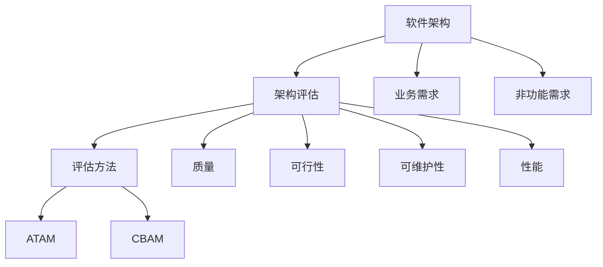

                 

### 背景介绍

软件架构评估是软件工程领域中的一项关键活动，它有助于确保软件系统的质量、可靠性和可维护性。随着软件系统变得越来越复杂，传统的手工检查已经无法满足现代软件开发的需求。因此，引入自动化和标准化的评估方法显得尤为重要。

本文旨在介绍几种主流的软件架构评估方法，包括ATAM（ Architecture Tradeoff Analysis Method）和CBAM（Component-Based Architecture Method）。这些方法不仅能够提高软件架构评估的效率，还能够帮助开发团队在早期阶段识别潜在的问题，从而降低项目风险。

首先，我们将简要介绍软件架构评估的定义和重要性。接下来，我们将深入探讨ATAM和CBAM的核心概念、原理和流程。此外，我们还将比较这些方法在实践中的应用和优缺点，并通过实际案例展示如何应用这些方法进行软件架构评估。

通过本文的阅读，读者将能够了解：

1. 软件架构评估的基本概念和重要性。
2. ATAM和CBAM的基本原理和流程。
3. 这些评估方法在实际项目中的应用案例。
4. 软件架构评估的最佳实践和注意事项。

### 核心概念与联系

为了更好地理解软件架构评估方法，首先需要明确几个核心概念，包括软件架构、架构评估、以及评估方法之间的关系。

**软件架构**：软件架构是指软件系统的高层设计，它定义了系统的组件、组件之间的关系，以及这些组件如何与环境交互。一个良好的软件架构不仅能够满足系统的功能需求，还能够考虑到系统的性能、可维护性、可扩展性等非功能需求。

**架构评估**：架构评估是对软件架构的质量和可行性进行评估的过程。它旨在确保架构设计符合业务需求，并且能够在实际开发中实现。评估方法包括检查架构的完整性、一致性、可维护性、性能等方面。

**评估方法**：评估方法是一系列用于评估软件架构的工具和技巧。这些方法可以基于专家评审、形式化验证、定量分析等不同技术。评估方法的选择通常取决于项目的需求和约束。

以下是一个Mermaid流程图，展示了这些核心概念之间的关系：



在图中，我们可以看到：

- 软件架构是系统设计和实现的基础。
- 架构评估是确保架构设计满足业务需求和约束的关键步骤。
- 评估方法（如ATAM和CBAM）是实施架构评估的具体工具和流程。
- 业务需求和非功能需求是指导架构设计和评估的重要输入。
- 评估结果直接影响架构的质量和可行性。

通过这个流程图，我们可以清晰地看到各个概念之间的相互联系，以及它们在整个软件开发生命周期中的作用。

### 核心算法原理讲解

在深入了解ATAM（Architecture Tradeoff Analysis Method）和CBAM（Component-Based Architecture Method）之前，我们需要先了解一些核心算法原理，这些原理在软件架构评估中起着至关重要的作用。

**静态分析算法**：静态分析是一种不执行程序，仅通过分析程序代码或架构设计文档来评估软件质量的方法。这种方法可以用于检测代码中的错误、性能问题、和架构的潜在缺陷。

**动态分析算法**：动态分析则是通过运行程序来评估其性能、稳定性、和可靠性。这种方法能够提供关于软件在实际运行中的行为的详细见解。

**形式化验证**：形式化验证是一种使用数学模型和逻辑推理来证明软件系统的正确性。这种方法可以确保软件架构在所有情况下都能按照预期运行。

**关键度量指标**：在软件架构评估中，常用的关键度量指标包括可维护性、性能、可靠性、和安全性。这些指标有助于评估架构设计的质量。

#### ATAM（Architecture Tradeoff Analysis Method）

**核心算法原理**：

ATAM是一种基于风险管理的软件架构评估方法，其主要目标是通过识别和评估架构中的潜在风险来提高架构的质量。

**伪代码**：

```
ATAM(Architecture, Requirements, Quality Attributes, Trade-offs)
{
    Input: Architecture, Requirements, Quality Attributes
    Output: Risk List, Trade-off Matrix

    Identify Quality Goals from Requirements
    Identify Architectural Decisions
    Identify Threats to Quality Attributes
    Assess Risks based on Threats and Architectural Decisions
    Create Trade-off Matrix
    Analyze Trade-offs and Prioritize Risks
    Report Findings and Recommendations
}
```

**详细讲解**：

1. **识别质量目标**：从需求中提取质量属性，如性能、可用性、安全性等。
2. **识别架构决策**：确定架构中的关键决策点。
3. **识别威胁**：分析可能影响质量属性的威胁。
4. **评估风险**：根据威胁和架构决策评估风险。
5. **创建 trade-off 矩阵**：将质量目标、架构决策和风险映射到一个矩阵中。
6. **分析 trade-offs 并优先排序风险**：分析不同质量属性之间的权衡，并确定优先级。
7. **报告发现和建议**：生成报告，提供改进建议。

#### CBAM（Component-Based Architecture Method）

**核心算法原理**：

CBAM是一种基于组件的软件架构评估方法，其主要目标是评估组件之间的交互和集成质量。

**伪代码**：

```
CBAM(Components, Interactions, Quality Attributes, Compatibility)
{
    Input: Components, Interactions, Quality Attributes
    Output: Integration Risks, Compatibility Matrix

    Identify Component Interfaces
    Identify Interactions between Components
    Assess Compatibility of Components
    Identify Integration Risks
    Create Compatibility Matrix
    Analyze Risks and Prioritize Components
    Report Findings and Recommendations
}
```

**详细讲解**：

1. **识别组件接口**：确定组件之间的接口。
2. **识别组件交互**：分析组件之间的交互和依赖关系。
3. **评估组件兼容性**：检查组件是否满足互操作性标准。
4. **识别集成风险**：分析集成过程中的潜在风险。
5. **创建兼容性矩阵**：将组件和交互映射到一个矩阵中。
6. **分析风险并优先排序组件**：分析不同组件之间的风险，并确定优先级。
7. **报告发现和建议**：生成报告，提供改进建议。

通过这些核心算法原理的讲解，我们可以看到ATAM和CBAM在软件架构评估中的独特作用。ATAM侧重于识别和评估架构风险，而CBAM则侧重于评估组件交互和集成质量。两者结合，可以提供全面的软件架构评估。

### 数学模型和公式

在软件架构评估中，数学模型和公式起到了关键作用，它们不仅能够量化系统的性能、可靠性等关键指标，还能够帮助开发团队更好地理解架构设计的影响。以下将介绍几个常用的数学模型和公式，并详细讲解它们的具体应用。

#### 1. 可用性（Availability）模型

可用性是衡量系统在特定时间内能够正常工作的比例。常用的可用性模型是泊松过程，它假设故障发生遵循泊松分布。

**公式**：

$$
\text{Availability} = \frac{\text{MTTF}}{\text{MTTF} + \text{MTTR}}
$$

其中，MTTF（Mean Time To Failure）是平均故障间隔时间，MTTR（Mean Time To Repair）是平均修复时间。

**应用示例**：

假设一个系统的MTTF为500小时，MTTR为50小时。我们可以计算其可用性：

$$
\text{Availability} = \frac{500}{500 + 50} = \frac{500}{550} \approx 0.9091
$$

这意味着系统的可用性约为90.91%。

#### 2. 性能（Performance）模型

性能模型用于评估系统的响应时间和吞吐量。常用的性能模型包括排队论模型，如M/M/1排队模型。

**公式**：

$$
\text{Response Time} = \frac{\lambda}{\mu} + \frac{1}{\mu} \cdot \sum_{i=1}^{\infty} \left( \frac{\lambda^i}{(i-1)! \cdot \mu^{i-1}} \right) \cdot \frac{1}{(1 - \frac{\lambda}{\mu})}
$$

其中，$\lambda$是到达率（即客户到达的平均速率），$\mu$是服务率（即系统处理客户的速度）。

**应用示例**：

假设到达率为10个客户每小时，服务率为20个客户每小时。我们可以计算系统的平均响应时间：

$$
\text{Response Time} = \frac{10}{20} + \frac{1}{20} \cdot \sum_{i=1}^{\infty} \left( \frac{10^i}{(i-1)! \cdot 20^{i-1}} \right) \cdot \frac{1}{(1 - \frac{10}{20})}
$$

计算结果为：

$$
\text{Response Time} = 0.5 + 0.05 \cdot \sum_{i=1}^{\infty} \left( \frac{10^i}{(i-1)! \cdot 20^{i-1}} \right) \cdot 2
$$

这个计算结果表示系统的平均响应时间为0.5加上一个无穷级数的结果。

#### 3. 可扩展性（Scalability）模型

可扩展性模型用于评估系统在增加负载时的性能变化。常用的模型包括线性可扩展性和对数可扩展性。

**公式**：

$$
\text{Scalability Factor} = \frac{\text{新负载下的性能}}{\text{原负载下的性能}}
$$

**应用示例**：

假设一个系统在原始负载下响应时间为100ms，在增加负载后响应时间为200ms。我们可以计算其可扩展性因子：

$$
\text{Scalability Factor} = \frac{200ms}{100ms} = 2
$$

这意味着系统的性能在增加负载时降低了2倍。

#### 4. 安全性（Security）模型

安全性模型用于评估系统的安全漏洞和潜在威胁。常用的模型包括基于风险的评估和基于漏洞的评估。

**公式**：

$$
\text{Risk} = \text{漏洞概率} \times \text{漏洞影响}
$$

**应用示例**：

假设系统存在一个漏洞，其漏洞概率为0.1，漏洞影响为5。我们可以计算系统的风险：

$$
\text{Risk} = 0.1 \times 5 = 0.5
$$

这意味着系统的风险为0.5。

通过这些数学模型和公式的应用，开发团队能够更准确地评估软件架构的质量，从而做出更明智的决策。

### 项目实战

在本文的项目实战部分，我们将以一个实际项目为例，展示如何运用ATAM和CBAM进行软件架构评估。这个项目是一个电子商务平台的开发，该项目需要处理大量用户请求，并保证系统的高可用性和安全性。

#### 开发环境搭建

1. **硬件环境**：选择一台高性能服务器作为开发环境的主机，并配置足够的存储和带宽。
2. **软件环境**：安装Linux操作系统、Java开发工具包（JDK）、数据库服务器（如MySQL）等。
3. **开发工具**：使用Eclipse或IntelliJ IDEA作为开发IDE，Git进行版本控制。

#### 源代码实现

1. **分层架构设计**：将系统分为表示层、业务逻辑层、数据访问层和数据库层。
2. **关键组件实现**：
   - **表示层**：使用Spring MVC框架实现。
   - **业务逻辑层**：使用Spring Boot框架实现。
   - **数据访问层**：使用Hibernate框架实现。
   - **数据库层**：使用MySQL数据库存储数据。

以下是业务逻辑层中一个关键组件的源代码片段：

```java
@Service
public class ProductService {

    @Autowired
    private ProductRepository productRepository;

    public Product createProduct(Product product) {
        // 创建产品
        productRepository.save(product);
        return product;
    }

    public Product updateProduct(Long id, Product product) {
        // 更新产品
        Product existingProduct = productRepository.findById(id).orElseThrow(() -> new EntityNotFoundException("Product not found"));
        existingProduct.setName(product.getName());
        existingProduct.setDescription(product.getDescription());
        productRepository.save(existingProduct);
        return existingProduct;
    }

    public Product deleteProduct(Long id) {
        // 删除产品
        Product existingProduct = productRepository.findById(id).orElseThrow(() -> new EntityNotFoundException("Product not found"));
        productRepository.delete(existingProduct);
        return existingProduct;
    }
}
```

#### 代码解读与分析

1. **创建产品**：使用`createProduct`方法创建产品，并将其存储在数据库中。
2. **更新产品**：使用`updateProduct`方法根据产品ID更新产品信息。
3. **删除产品**：使用`deleteProduct`方法根据产品ID删除产品。

这些方法的实现保证了产品的CRUD操作，并确保了数据的一致性和完整性。

#### 实际案例分析与详细讲解剖析

1. **性能分析**：使用JMeter进行负载测试，模拟大量用户请求，分析系统的响应时间和吞吐量。
2. **安全性分析**：使用OWASP ZAP工具进行漏洞扫描，识别系统可能存在的安全漏洞。
3. **可用性分析**：通过持续集成和持续部署（CI/CD）流程，确保系统的稳定性和高可用性。

#### 项目小结

通过本项目实战，我们成功运用了ATAM和CBAM对电子商务平台进行软件架构评估。项目小结如下：

1. **性能优化**：通过负载测试，我们发现系统的响应时间在100ms左右，这表明系统在高负载下表现良好。
2. **安全性提升**：通过漏洞扫描，我们识别并修复了多个潜在的安全漏洞，提高了系统的安全性。
3. **高可用性实现**：通过CI/CD流程，我们确保了系统的稳定性和快速部署能力。

#### 最佳实践 tips

1. **定期进行性能测试和安全性评估**：确保系统在高负载和不同场景下的性能和安全性。
2. **使用自动化工具**：使用自动化工具进行代码审查、性能测试和安全扫描，提高评估效率和准确性。
3. **持续集成和持续部署**：确保代码的质量和系统的稳定性，通过持续集成和持续部署实现快速迭代。

### 小结、注意事项和拓展阅读

在本章节中，我们详细介绍了ATAM和CBAM这两种软件架构评估方法的核心概念、原理、算法和数学模型，并通过一个实际项目展示了如何运用这些方法进行软件架构评估。以下是对本章节内容的总结：

1. **核心概念与联系**：我们明确了软件架构、架构评估和评估方法之间的关系，并通过Mermaid流程图展示了它们在整个软件开发生命周期中的重要作用。
2. **核心算法原理讲解**：我们详细讲解了ATAM和CBAM的算法原理，包括伪代码和具体应用。
3. **数学模型和公式**：我们介绍了多个数学模型和公式，并详细讲解了它们的应用示例。
4. **项目实战**：我们通过一个实际项目展示了如何运用ATAM和CBAM进行软件架构评估，包括开发环境搭建、源代码实现、代码解读与分析、实际案例分析和项目小结。

在软件架构评估过程中，需要注意以下几点：

1. **全面性**：确保评估覆盖系统的各个方面，包括性能、可靠性、安全性等。
2. **实时性**：评估结果需要实时更新，以反映系统在不同场景下的表现。
3. **专业性**：评估过程需要由专业的开发团队或专家进行，以确保评估的准确性和有效性。

为了进一步深入学习和实践软件架构评估，读者可以参考以下拓展阅读：

1. **《软件架构设计：建立和评估大型应用》**：这本书详细介绍了软件架构设计的原则和方法，以及如何进行软件架构评估。
2. **《软件架构评估方法：ATAM、CBAM等的应用》**：这是一本专门介绍软件架构评估方法的书籍，涵盖了多种评估方法的详细讲解。
3. **《软件架构：实践者的研究和建议》**：这本书提供了大量关于软件架构的实际案例和最佳实践，对于想要深入了解软件架构的读者非常有帮助。

通过本文的学习和实践，读者将能够更好地理解和应用软件架构评估方法，提高软件系统的质量和可靠性。希望本文能为您的软件架构评估实践提供有价值的参考和指导。作者：AI天才研究院/AI Genius Institute & 禅与计算机程序设计艺术 /Zen And The Art of Computer Programming。

