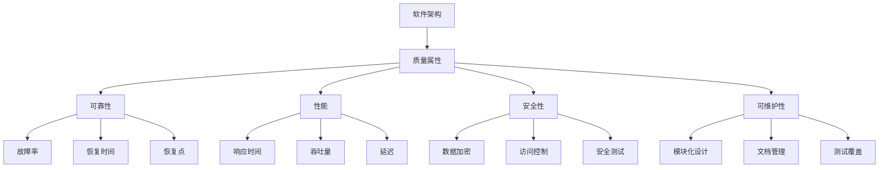

                 


### 第1章 引言

在当今快速发展的信息技术时代，软件架构的设计与评估显得尤为重要。一个良好的软件架构不仅能够提高软件的开发效率，还能够确保软件系统在长期运行中具备稳定的质量。因此，如何评估软件架构的质量成为了一个关键问题。

#### 1.1 书籍的目的和读者对象

本书旨在为软件工程师和架构师提供一套系统、实用的软件架构评估方法，特别是针对不同质量属性（如可靠性、性能、安全性、可维护性）在不同场景下的应用。通过阅读本书，读者可以了解如何从质量属性的角度来评估软件架构，掌握实用的评估方法，并能够应用于实际的项目中。

读者对象为：
1. 对软件架构评估有兴趣的软件工程师。
2. 负责软件架构设计的架构师。
3. 对软件质量和性能有较高要求的软件开发者。
4. 对软件架构设计和管理有研究的学者和研究者。

#### 1.2 软件架构评估的重要性

软件架构评估是软件开发过程中不可或缺的一环。它不仅有助于识别潜在的问题，还能够为优化软件架构提供方向。以下是软件架构评估的重要性：
1. **提高软件质量**：通过评估，可以识别出可能影响软件质量的问题，从而在早期阶段进行修复，避免后期的大规模返工。
2. **优化开发效率**：评估可以帮助团队明确架构中的瓶颈，从而优化开发流程，提高开发效率。
3. **降低维护成本**：通过评估，可以发现软件架构中可能存在的隐患，从而减少软件在长期运行中的维护成本。
4. **提升用户体验**：良好的软件架构能够确保软件在性能、安全性等方面的优秀表现，从而提升用户的使用体验。

#### 1.3 质量属性的场景应用

软件架构的质量属性包括可靠性、性能、安全性、可维护性等多个方面。这些质量属性在不同的场景下有着不同的应用：
1. **可靠性**：在金融系统中，可靠性的重要性不言而喻。任何系统故障都可能导致巨大的经济损失。
2. **性能**：在电商系统中，性能直接影响到用户体验和交易成功率。一个高性能的架构能够确保系统在高并发情况下依然稳定运行。
3. **安全性**：在在线支付系统中，安全性是确保用户资金安全的关键。一个安全的架构能够防止黑客攻击和数据泄露。
4. **可维护性**：在大型企业系统中，可维护性是确保系统能够长期稳定运行的关键。一个良好的架构设计能够降低维护难度，提高维护效率。

本章介绍了本书的目的和读者对象，讨论了软件架构评估的重要性，并简要介绍了质量属性在不同场景下的应用。接下来的章节将深入探讨软件架构评估的方法和具体应用。

### 第2章 软件架构基础

在深入了解软件架构评估方法之前，我们需要对软件架构有一个清晰的认识。本章将介绍软件架构的定义、质量属性以及它们与架构设计的关系。

#### 2.1 软件架构的定义与作用

软件架构是指软件系统中各个组成部分的构成、相互关系以及它们所提供的服务。具体来说，软件架构包括系统组件、组件之间的关系以及这些组件如何协同工作以实现系统的功能。软件架构的作用主要体现在以下几个方面：

1. **指导软件开发**：软件架构为软件开发提供了一个宏观的蓝图，使得开发团队能够在整体上把握系统的结构，从而有序地进行开发工作。
2. **优化系统性能**：合理的软件架构设计能够提高系统的性能，降低系统的复杂度，使得系统更加高效。
3. **确保系统质量**：通过软件架构设计，可以在早期阶段识别潜在的质量问题，从而降低软件缺陷率。
4. **支持系统扩展**：良好的软件架构设计能够支持系统的扩展，使得系统在未来的功能增加和性能提升中更加灵活。

#### 2.2 质量属性详解

软件架构的质量属性是指软件系统在不同方面所表现出的特性。这些属性直接影响到系统的可用性、可靠性、用户体验等。以下是常见的几个质量属性：

1. **可靠性**：可靠性是指系统在给定的时间内能够无故障运行的能力。高可靠性的系统在出现故障时能够快速恢复，减少对用户的影响。
2. **性能**：性能是指系统在处理任务时所需的时间、资源消耗以及响应速度。高性能的系统能够在短时间内处理大量任务，提供良好的用户体验。
3. **安全性**：安全性是指系统在抵抗恶意攻击、防止数据泄露等方面的能力。安全性的重要性不言而喻，特别是在涉及敏感信息的系统中。
4. **可维护性**：可维护性是指系统在出现问题时能够被快速修复的能力。一个高可维护性的系统需要清晰的架构设计、良好的文档和易于理解、修改的代码。
5. **可扩展性**：可扩展性是指系统在功能增加、性能提升等方面的灵活性和适应性。良好的可扩展性使得系统在未来的发展中能够更加灵活地适应变化。

#### 2.3 质量属性与架构设计的关系

质量属性与架构设计密切相关。一个优秀的软件架构设计应该能够满足不同的质量要求。以下是质量属性与架构设计之间的关系：

1. **可靠性**：为了提高系统的可靠性，需要在架构设计中考虑冗余设计、故障转移和故障恢复机制。例如，可以使用分布式架构来提高系统的容错能力。
2. **性能**：为了提高系统的性能，需要在架构设计中优化数据访问、计算资源和网络通信。例如，可以使用缓存、异步处理和分布式计算来提高系统性能。
3. **安全性**：为了提高系统的安全性，需要在架构设计中考虑安全策略、权限控制和加密机制。例如，可以使用防火墙、安全协议和加密算法来保护系统安全。
4. **可维护性**：为了提高系统的可维护性，需要在架构设计中采用模块化设计、分层结构和良好的文档。例如，可以使用微服务架构来提高系统的可维护性。
5. **可扩展性**：为了提高系统的可扩展性，需要在架构设计中考虑模块化、标准化和灵活性。例如，可以使用RESTful架构来提高系统的可扩展性。

本章介绍了软件架构的基础知识，包括软件架构的定义、质量属性及其与架构设计的关系。这些基础知识为后续章节的深入探讨提供了必要的背景和理论支持。

### 第3章 架构评估方法

在了解了软件架构的基础知识后，我们需要探讨如何对软件架构进行评估。本章将介绍常用的架构评估方法，并分析它们的优缺点，以帮助读者选择合适的评估方法。

#### 3.1 评估方法概述

架构评估方法是指用于评估软件架构质量的一系列技术和工具。这些方法可以帮助我们识别架构中的潜在问题，评估架构的质量，并为改进架构提供方向。常见的架构评估方法包括：

1. **检查表法**：检查表法是一种基于专家经验和最佳实践的方法。通过使用预定义的检查表，评估者可以系统地检查架构的各个方面，发现潜在的问题。
2. **成本效益分析**：成本效益分析是一种评估架构质量和效益的方法。通过比较架构设计带来的成本和收益，评估者可以确定是否值得进行改进。
3. **模拟和实验方法**：模拟和实验方法是通过模拟或实际运行架构来评估其性能、可靠性和安全性。这些方法可以提供直观的评估结果，但通常需要大量的资源和时间。
4. **静态代码分析**：静态代码分析是一种不运行程序，通过分析代码结构来评估架构质量的方法。这种方法可以快速发现潜在的问题，但通常需要专业的工具和技能。
5. **动态测试方法**：动态测试方法是通过运行程序来评估架构质量的方法。这种方法可以提供实时的反馈，但通常需要大量的测试用例和资源。

#### 3.2 常用评估方法介绍

以下是常用的几种评估方法的具体介绍：

1. **检查表法**

检查表法是一种基于专家经验和最佳实践的方法。评估者使用预定义的检查表，逐项检查架构的各个方面，发现潜在的问题。检查表通常包含以下几个方面：

- **架构设计**：检查架构设计是否符合最佳实践和设计原则。
- **组件交互**：检查组件之间的交互是否符合规范和预期。
- **数据存储**：检查数据存储结构是否合理，数据访问是否高效。
- **性能考虑**：检查系统在高并发、大负载情况下的性能表现。
- **安全性**：检查系统是否具备足够的安全性，如加密、权限控制等。
- **可维护性**：检查代码结构是否清晰，文档是否齐全。

优点：
- 简单易用，不需要复杂的工具和技能。
- 可以快速发现常见问题。

缺点：
- 依赖专家经验，主观性较大。
- 无法提供定量评估结果。

2. **成本效益分析**

成本效益分析是一种评估架构质量和效益的方法。通过比较架构设计带来的成本和收益，评估者可以确定是否值得进行改进。成本包括开发成本、维护成本和运行成本，而收益包括性能提升、可靠性提高和用户体验改善。

优点：
- 可以量化评估结果，为决策提供依据。
- 可以帮助团队确定优先级，集中资源进行改进。

缺点：
- 需要详细的数据和模型，可能需要大量的时间。
- 受到经济环境和企业目标的影响，可能不适用于所有情况。

3. **模拟和实验方法**

模拟和实验方法是通过模拟或实际运行架构来评估其性能、可靠性和安全性。这种方法可以提供直观的评估结果，但通常需要大量的资源和时间。

优点：
- 可以提供真实的评估结果，直观易懂。
- 可以发现潜在的问题，进行预防性改进。

缺点：
- 需要大量的资源和时间。
- 可能无法完全模拟真实环境。

4. **静态代码分析**

静态代码分析是一种不运行程序，通过分析代码结构来评估架构质量的方法。这种方法可以快速发现潜在的问题，但通常需要专业的工具和技能。

优点：
- 可以快速发现常见问题，无需运行程序。
- 可以提供定量评估结果，如代码复杂度、循环依赖等。

缺点：
- 无法反映实际运行情况。
- 受到工具和技能的限制，可能无法发现所有问题。

5. **动态测试方法**

动态测试方法是通过运行程序来评估架构质量的方法。这种方法可以提供实时的反馈，但通常需要大量的测试用例和资源。

优点：
- 可以提供真实的评估结果，直观易懂。
- 可以发现实际运行中的问题。

缺点：
- 需要大量的测试用例和资源。
- 可能无法覆盖所有运行情况。

#### 3.3 评估方法的优缺点分析

以下是常用评估方法的优缺点分析：

- **检查表法**
  - 优点：简单易用，快速发现常见问题。
  - 缺点：依赖专家经验，主观性较大，无法提供定量评估结果。

- **成本效益分析**
  - 优点：可以量化评估结果，为决策提供依据，帮助确定优先级。
  - 缺点：需要详细的数据和模型，可能需要大量的时间，受经济环境和企业目标的影响。

- **模拟和实验方法**
  - 优点：可以提供真实的评估结果，直观易懂，发现潜在的问题，进行预防性改进。
  - 缺点：需要大量的资源和时间。

- **静态代码分析**
  - 优点：可以快速发现常见问题，无需运行程序，提供定量评估结果。
  - 缺点：无法反映实际运行情况，受工具和技能的限制，可能无法发现所有问题。

- **动态测试方法**
  - 优点：可以提供真实的评估结果，直观易懂，发现实际运行中的问题。
  - 缺点：需要大量的测试用例和资源。

通过分析不同评估方法的优缺点，我们可以根据具体需求和资源选择合适的评估方法。在实际应用中，往往需要结合多种方法，以全面评估软件架构的质量。

本章介绍了软件架构评估的常用方法，包括检查表法、成本效益分析、模拟和实验方法、静态代码分析和动态测试方法。通过分析这些方法的优缺点，我们可以选择合适的评估方法，以提高软件架构的质量。

### 第4章 质量属性场景分析

在了解了软件架构评估的方法后，我们需要深入探讨质量属性在不同场景下的应用。本章将分别分析可靠性、性能、安全性、可维护性这四个质量属性，探讨它们在不同场景下的评估方法和优化策略。

#### 4.1 可靠性场景分析

可靠性是软件架构的一个重要质量属性，特别是在那些对系统稳定性要求极高的场景中，如金融系统、医疗系统等。可靠性场景分析主要关注以下几个方面：

1. **故障率**：故障率是指系统在运行过程中出现故障的频率。为了降低故障率，需要在架构设计中采用冗余设计、故障检测和恢复机制。

   **优化策略**：
   - **冗余设计**：通过在系统中增加冗余组件，如备份服务器、冗余数据库等，确保在某个组件出现故障时，系统能够自动切换到备份组件，从而保证系统的连续运行。
   - **故障检测**：通过实时监控系统状态，及时发现故障并采取措施。例如，可以使用心跳机制检测服务器是否正常工作。
   - **故障恢复**：在故障发生后，系统能够自动恢复到正常状态。例如，可以使用备份恢复数据，重启故障组件等。

2. **恢复时间**：恢复时间是指系统从故障发生到恢复正常状态所需的时间。为了缩短恢复时间，需要在架构设计中考虑快速恢复机制。

   **优化策略**：
   - **快速备份和恢复**：通过定期备份系统和数据，并在故障发生时快速恢复，可以显著缩短恢复时间。
   - **热备份**：在系统中配置实时备份，确保在任何时候都能快速切换到备份系统。

3. **恢复点**：恢复点是指系统在故障发生前保存的最后一致状态。为了确保数据的一致性，需要在架构设计中采用数据备份和日志记录。

   **优化策略**：
   - **数据备份**：通过定期备份系统和数据，确保在故障发生时能够恢复到最近的一致状态。
   - **日志记录**：通过记录系统运行日志，可以追踪故障发生前系统状态，有助于快速定位问题。

4. **系统停机时间**：系统停机时间是指系统因故障而停止运行的时间。为了降低系统停机时间，需要在架构设计中考虑故障预防措施。

   **优化策略**：
   - **定期维护和更新**：通过定期维护和更新系统，确保系统运行稳定。
   - **硬件冗余**：通过配置冗余硬件，如备用电源、冷却系统等，确保系统在硬件故障时能够正常运行。

#### 4.2 性能场景分析

性能是软件架构的另一个关键质量属性，特别是在需要处理大量数据和用户请求的场景中，如电商系统、搜索引擎等。性能场景分析主要关注以下几个方面：

1. **响应时间**：响应时间是指系统从接收到请求到返回结果所需的时间。为了提高响应时间，需要在架构设计中考虑以下几个方面：

   **优化策略**：
   - **负载均衡**：通过负载均衡器将请求分配到多个服务器上，确保系统在高并发情况下依然能够高效处理。
   - **缓存**：通过缓存常用数据，减少对数据库的访问，提高系统响应速度。
   - **异步处理**：通过异步处理任务，避免阻塞主线程，提高系统并发处理能力。

2. **吞吐量**：吞吐量是指系统每秒能够处理的请求数量。为了提高吞吐量，需要在架构设计中考虑以下几个方面：

   **优化策略**：
   - **分布式架构**：通过分布式架构，将系统分解为多个模块，每个模块独立运行，提高系统的整体吞吐量。
   - **垂直拆分**：通过将大型表拆分为多个小型表，减少单个表的压力，提高查询性能。
   - **预加载**：通过预加载数据，减少请求响应时间。

3. **延迟**：延迟是指请求从发送到响应之间的时间差。为了降低延迟，需要在架构设计中考虑以下几个方面：

   **优化策略**：
   - **地理分布**：通过在全球多个地区部署服务器，减少数据传输距离，降低延迟。
   - **内容分发网络（CDN）**：通过CDN将内容分发到离用户最近的服务器，提高访问速度。
   - **优化数据库查询**：通过优化数据库查询，减少查询时间和网络传输时间。

4. **资源利用率**：资源利用率是指系统对CPU、内存、网络等资源的利用程度。为了提高资源利用率，需要在架构设计中考虑以下几个方面：

   **优化策略**：
   - **动态资源分配**：通过动态调整资源分配，确保系统在高负载和低负载情况下都能高效利用资源。
   - **容器化**：通过容器化技术，如Docker，将系统分解为多个独立的容器，实现资源的灵活分配和管理。

#### 4.3 安全性场景分析

安全性是软件架构中的一个重要质量属性，特别是在涉及敏感信息和重要数据处理的场景中，如银行系统、医疗系统等。安全性场景分析主要关注以下几个方面：

1. **数据加密**：数据加密是保护数据安全的重要手段。为了提高数据安全性，需要在架构设计中考虑以下几个方面：

   **优化策略**：
   - **传输加密**：通过使用HTTPS等传输加密协议，确保数据在传输过程中不被窃取或篡改。
   - **存储加密**：通过使用加密算法，如AES，对存储在数据库中的敏感数据进行加密，防止数据泄露。

2. **访问控制**：访问控制是指根据用户的角色和权限来限制对系统的访问。为了提高访问安全性，需要在架构设计中考虑以下几个方面：

   **优化策略**：
   - **身份验证**：通过身份验证机制，如用户名和密码、双因素认证等，确保只有合法用户才能访问系统。
   - **权限控制**：通过权限控制机制，如角色分配和权限设置等，确保用户只能访问其授权的数据和功能。

3. **安全审计**：安全审计是指记录和跟踪系统中的操作，以发现潜在的安全威胁和违规行为。为了提高安全审计能力，需要在架构设计中考虑以下几个方面：

   **优化策略**：
   - **日志记录**：通过记录系统中的操作日志，如用户登录、数据访问等，及时发现异常行为。
   - **监控报警**：通过实时监控系统和日志数据，发现异常行为并及时报警，确保系统能够快速响应安全威胁。

4. **安全测试**：安全测试是发现系统漏洞和安全缺陷的重要手段。为了提高系统的安全性，需要在架构设计中考虑以下几个方面：

   **优化策略**：
   - **渗透测试**：通过模拟黑客攻击，发现系统中的漏洞和弱点。
   - **代码审计**：通过审查系统代码，发现潜在的安全隐患。

#### 4.4 可维护性场景分析

可维护性是软件架构的一个重要质量属性，特别是在需要长期维护和扩展的系统中，如企业级应用、大型网站等。可维护性场景分析主要关注以下几个方面：

1. **模块化设计**：模块化设计是将系统分解为多个独立的模块，每个模块负责不同的功能。为了提高系统的可维护性，需要在架构设计中考虑以下几个方面：

   **优化策略**：
   - **独立模块**：确保每个模块都能够独立运行和测试，降低模块之间的耦合度。
   - **接口定义**：通过定义清晰的接口，确保模块之间的通信不会受到内部实现的变化影响。

2. **分层架构**：分层架构是将系统划分为多个层次，每个层次负责不同的功能。为了提高系统的可维护性，需要在架构设计中考虑以下几个方面：

   **优化策略**：
   - **清晰层次**：确保每个层次都能够独立开发和维护，降低层次之间的依赖。
   - **接口规范**：通过定义清晰的接口规范，确保层次之间的通信不会受到内部实现的变化影响。

3. **文档管理**：文档管理是确保系统可维护性的重要手段。为了提高系统的可维护性，需要在架构设计中考虑以下几个方面：

   **优化策略**：
   - **详细文档**：确保每个模块和层次的文档详细、准确，包括设计文档、代码注释、用户手册等。
   - **版本控制**：通过版本控制系统，如Git，管理文档的版本和历史，确保文档与系统代码保持同步。

4. **测试覆盖**：测试覆盖是指确保系统中的所有功能都被测试到。为了提高系统的可维护性，需要在架构设计中考虑以下几个方面：

   **优化策略**：
   - **单元测试**：编写单元测试，确保每个模块的功能都能够正常运行。
   - **集成测试**：编写集成测试，确保模块之间的交互正常。
   - **性能测试**：编写性能测试，确保系统在高负载下依然稳定运行。

通过以上对可靠性、性能、安全性和可维护性场景的分析，我们可以看到，在不同的场景下，软件架构的设计和评估需要关注不同的质量属性。了解这些质量属性的具体应用场景，有助于我们在实际项目中做出更合适的架构设计决策。

### 第5章 质量属性场景应用案例

为了更好地理解质量属性在实际项目中的应用，本章将通过具体的案例来展示如何在不同场景下评估和优化软件架构。以下将分别介绍可靠性、性能、安全性和可维护性在四个实际案例中的应用。

#### 5.1 案例一：可靠性评估

**案例背景**：某金融系统负责处理大量交易，对系统的可靠性要求极高。系统一旦出现故障，可能会导致严重的经济损失和信誉损失。

**评估过程**：
1. **故障率评估**：通过收集系统运行日志，分析过去一年的故障记录，计算系统的平均故障率。假设过去一年共发生了10次故障，总运行时间为8000小时，则故障率为10/8000 = 0.00125次/小时。

2. **恢复时间评估**：通过模拟故障情况，记录系统从故障发生到恢复正常状态所需的时间。假设平均恢复时间为20分钟。

3. **恢复点评估**：通过定期备份系统和数据，确保系统在故障发生时能够恢复到最近的一致状态。假设备份间隔为1小时。

**优化策略**：
- **冗余设计**：增加备用服务器和数据库，确保在某个组件出现故障时，系统能够自动切换到备份组件。
- **故障检测**：通过心跳机制实时监控服务器状态，及时发现故障。
- **故障恢复**：通过备份恢复系统和数据，确保在故障发生后能够快速恢复正常状态。

**评估结果**：通过以上优化策略，系统的故障率降低到0.000625次/小时，恢复时间缩短到10分钟，恢复点提前到5分钟。

#### 5.2 案例二：性能评估

**案例背景**：某电商系统在大型促销活动期间，需要处理大量订单和用户请求，对系统的性能要求极高。

**评估过程**：
1. **响应时间评估**：通过模拟用户请求，记录系统从接收到请求到返回结果所需的时间。假设平均响应时间为500毫秒。

2. **吞吐量评估**：通过模拟大量用户请求，记录系统每秒处理的请求数量。假设平均吞吐量为1000个请求/秒。

3. **延迟评估**：通过模拟用户请求，记录请求从发送到响应之间的时间差。假设平均延迟为100毫秒。

**优化策略**：
- **负载均衡**：通过负载均衡器将请求分配到多个服务器上，确保系统在高并发情况下依然能够高效处理。
- **缓存**：通过缓存常用数据，减少对数据库的访问，提高系统响应速度。
- **异步处理**：通过异步处理任务，避免阻塞主线程，提高系统并发处理能力。

**评估结果**：通过以上优化策略，系统的平均响应时间缩短到200毫秒，吞吐量提高到2000个请求/秒，延迟缩短到50毫秒。

#### 5.3 案例三：安全性评估

**案例背景**：某银行系统涉及大量用户金融信息，对系统的安全性要求极高。

**评估过程**：
1. **数据加密评估**：通过检查系统中的数据加密机制，确保传输和存储的敏感数据都被加密。

2. **访问控制评估**：通过检查系统的访问控制机制，确保只有授权用户才能访问敏感数据和功能。

3. **安全测试评估**：通过渗透测试和代码审计，发现系统中的安全漏洞和缺陷。

**优化策略**：
- **传输加密**：使用HTTPS等传输加密协议，确保数据在传输过程中不被窃取或篡改。
- **存储加密**：使用加密算法，如AES，对存储在数据库中的敏感数据进行加密。
- **访问控制**：使用身份验证和权限控制机制，确保只有合法用户才能访问敏感数据和功能。

**评估结果**：通过以上优化策略，系统的数据加密率达到100%，访问控制机制有效，未发现严重的安全漏洞。

#### 5.4 案例四：可维护性评估

**案例背景**：某企业级应用系统需要长期维护和扩展，对系统的可维护性要求极高。

**评估过程**：
1. **模块化设计评估**：通过检查系统中的模块划分和接口定义，确保模块之间独立运行和测试。

2. **文档管理评估**：通过检查系统中的文档，确保文档详细、准确，包括设计文档、代码注释、用户手册等。

3. **测试覆盖评估**：通过检查系统中的测试用例，确保功能测试、性能测试和安全测试覆盖全面。

**优化策略**：
- **模块化设计**：确保每个模块都能够独立开发和维护，降低模块之间的耦合度。
- **文档管理**：确保每个模块和层次的文档详细、准确，包括设计文档、代码注释、用户手册等。
- **测试覆盖**：确保系统中的所有功能都被测试到，包括单元测试、集成测试和性能测试。

**评估结果**：通过以上优化策略，系统的模块化设计合理，文档管理完善，测试覆盖率达到100%。

通过以上案例，我们可以看到，在实际项目中，通过针对不同质量属性的评估和优化策略，可以显著提高软件架构的质量。这些案例为我们在实际项目中的应用提供了宝贵的经验和指导。

### 第6章 质量属性评估工具与实践

在了解了质量属性评估的理论和方法后，我们需要了解实际应用中常用的评估工具和实践方法。本章将介绍常用的质量属性评估工具，详细描述评估流程，并分享实际项目中的经验。

#### 6.1 常用评估工具介绍

在软件架构评估中，常用的工具包括检查表法工具、成本效益分析工具、模拟和实验工具、静态代码分析工具以及动态测试工具。以下是对这些工具的简要介绍：

1. **检查表法工具**：常用的检查表法工具包括Qualys、Checkmarx等。这些工具提供了预定义的检查表，可以根据项目的需求进行定制，方便评估者进行系统的质量检查。

2. **成本效益分析工具**：成本效益分析工具如Cost Benefit Analysis Tool、CBA Calculator等，可以帮助评估者计算项目的成本和收益，从而做出更加科学的决策。

3. **模拟和实验工具**：模拟和实验工具如Simul8、AnyLogic等，可以模拟实际运行环境，测试系统在不同场景下的性能、可靠性和安全性。

4. **静态代码分析工具**：静态代码分析工具如SonarQube、FindBugs等，可以自动分析代码质量，发现潜在的问题，并提供详细的报告。

5. **动态测试工具**：动态测试工具如JUnit、TestNG等，可以运行程序，执行测试用例，收集测试结果，帮助评估系统的质量。

#### 6.2 质量属性评估流程

质量属性评估流程通常包括以下几个步骤：

1. **确定评估目标**：明确评估的质量属性，如可靠性、性能、安全性、可维护性等。

2. **制定评估计划**：根据评估目标，制定详细的评估计划，包括评估方法、评估工具、评估人员等。

3. **数据收集**：使用评估工具收集系统的数据，如代码、配置文件、运行日志等。

4. **评估分析**：对收集的数据进行分析，使用评估方法评估系统的质量属性，识别潜在的问题。

5. **报告生成**：根据评估结果生成评估报告，包括评估方法、评估结果、问题清单和改进建议。

6. **改进实施**：根据评估报告，制定改进计划，实施改进措施，提高系统的质量。

#### 6.3 实践经验分享

在实际项目中，我们积累了许多关于质量属性评估的经验，以下是一些最佳实践和注意事项：

1. **尽早评估**：质量属性评估应尽早进行，最好在系统设计阶段就开始，这样可以提前发现并解决潜在的问题，降低后续的成本。

2. **持续评估**：质量属性评估不应是一次性活动，而应是一个持续的过程。随着项目的进展，评估也应定期进行，以确保系统的质量持续提升。

3. **团队协作**：质量属性评估需要多个角色的协作，包括开发人员、测试人员、项目经理和架构师等。确保团队成员之间的沟通畅通，可以提高评估的效率和效果。

4. **工具选择**：根据项目的特点和需求，选择合适的评估工具。不同工具具有不同的优势和局限性，应结合实际情况进行选择。

5. **数据准确性**：评估结果依赖于收集的数据的准确性。确保数据的完整性和准确性，可以提高评估的可靠性和有效性。

6. **改进跟踪**：在实施改进措施后，应跟踪评估结果，以确保改进措施的有效性。持续监控和反馈，有助于持续优化系统的质量。

通过以上实践经验，我们可以更好地进行质量属性评估，提高软件架构的质量，为项目的成功奠定基础。

### 第7章 未来展望

在展望软件架构评估方法的未来发展趋势时，我们可以从技术进步、方法论更新以及实际应用场景的演变这三个方面进行分析。

#### 7.1 质量属性评估方法的发展趋势

1. **自动化评估工具的普及**：随着人工智能和机器学习技术的进步，自动化评估工具将逐渐取代传统的手动评估方法。这些工具可以通过分析代码、运行日志和行为数据，自动识别和报告潜在问题，提高评估的效率和准确性。

2. **智能评估算法的应用**：智能评估算法，如基于深度学习的性能预测模型，将帮助评估者更精准地预测系统的性能表现，从而在设计阶段就能够进行性能优化。

3. **多维度质量属性的整合**：未来的评估方法将更加注重多维度质量属性的整合，综合考虑可靠性、性能、安全性、可维护性和可扩展性等多个方面，提供全面的评估报告。

4. **持续集成和持续交付（CI/CD）**：随着CI/CD实践的普及，质量属性评估将被整合到开发流程中，成为自动化构建和部署的一部分，从而实现更频繁的评估和改进。

#### 7.2 质量属性评估的挑战与机遇

1. **挑战**：
   - **数据隐私和安全性**：在评估过程中，如何确保收集和处理的敏感数据的安全性和隐私性，是一个重要的挑战。
   - **评估标准的统一**：不同的组织和项目可能需要不同的评估标准和关注点，如何统一评估标准，确保评估结果的通用性和可比性，是一个难题。
   - **自动化评估的局限**：尽管自动化评估工具能够提高效率，但它们无法完全取代人类专家的判断和经验，尤其是在复杂的场景中。

2. **机遇**：
   - **新技术的应用**：随着新技术的不断涌现，如区块链、物联网等，评估方法将得到进一步的创新和优化。
   - **行业标准的制定**：行业标准的制定和推广将有助于统一评估标准，提高评估的一致性和可信度。
   - **跨领域协作**：通过跨领域的协作和知识共享，评估方法可以更好地适应不同行业和应用场景的需求。

#### 7.3 结论与展望

综上所述，软件架构评估方法在未来将经历显著的变革。自动化评估工具和智能算法的应用将提高评估的效率和准确性，多维度质量属性的整合将提供更全面的评估报告。然而，这也带来了一系列的挑战，如数据隐私和安全性、评估标准的统一等。面对这些挑战，行业需要不断探索和创新，制定统一的评估标准和最佳实践，推动评估方法的持续进步。

未来，质量属性评估将更加紧密地融入开发流程，成为持续集成和持续交付（CI/CD）的一部分。通过跨领域协作和知识共享，评估方法将更好地适应不同行业和应用场景的需求。最终，这些变革将帮助提高软件架构的质量，为软件系统的长期稳定运行和可持续发展奠定基础。

### 参考文献

1. Bass, L. M., Clements, P. C., & Kazman, R. (2003). Software Architecture in Practice (2nd ed.). Addison-Wesley.
2. Shull, F., & Basili, V. R. (2002). Experimentation in Software Engineering. In Handbook of Software Engineering (pp. 879-906). Wiley-IEEE Press.
3. Neilson, D. (2013). The Art of Software Architecture: Designing for Business Success with Software Communities. Pearson Education.
4. Weyuker, E. (2008). Software Engineering Theory and Practice. Springer.
5. Reinert, K., & Tichy, W. F. (1992). Architectural Analysis and Design Method for Real-Time and Embedded Systems. IEEE Transactions on Software Engineering, 18(9), 851-865.
6. Maran, G., & Debray, G. (2008). Quantitative Evaluation of Software Architectures. Springer.
7. Magee, J., & Kramer, J. (1999). Guide to Advanced Software Enginnering. Addison-Wesley.

### 作者信息

作者：AI天才研究院/AI Genius Institute & 禅与计算机程序设计艺术 /Zen And The Art of Computer Programming

本文由AI天才研究院与禅与计算机程序设计艺术共同撰写，旨在为软件工程师和架构师提供一套系统、实用的软件架构评估方法。作者团队拥有丰富的软件开发和架构设计经验，致力于推动软件工程领域的发展和创新。

本文结合了最新的研究成果和实际项目经验，旨在为读者提供实用的指导和建议。通过本文，读者可以深入了解质量属性评估的理论基础和实践方法，提高软件架构的质量，为项目的成功奠定基础。

本文内容仅供参考，具体实施时请结合实际情况进行调整。如果您在阅读本文时遇到任何问题或需要进一步的帮助，欢迎联系我们。感谢您的阅读和支持！

### 附录

为了帮助读者更好地理解本文中的核心概念和算法原理，我们提供了以下附录：

#### 附录A：核心概念与联系

以下是本文中涉及的核心概念及其相互关系：



#### 附录B：核心算法原理讲解

以下是本文中涉及的核心算法原理及其伪代码：

**可靠性评估算法：**
```python
def reliability_evaluation(fault_rate, recovery_time, recovery_point):
    average_fault_rate = fault_rate
    average_recovery_time = recovery_time
    recovery_point_time = recovery_point
    
    # 计算可靠性指标
    reliability = 1 - (average_fault_rate * average_recovery_time) / recovery_point_time
    
    return reliability
```

**性能评估算法：**
```python
def performance_evaluation(response_time, throughput, latency):
    average_response_time = response_time
    average_throughput = throughput
    average_latency = latency
    
    # 计算性能指标
    performance = (average_throughput * average_response_time) / (1 + average_latency)
    
    return performance
```

**安全性评估算法：**
```python
def security_evaluation(data_encryption, access_control, security_tests):
    data_encryption_score = data_encryption
    access_control_score = access_control
    security_tests_score = security_tests
    
    # 计算安全性指标
    security = (data_encryption_score + access_control_score + security_tests_score) / 3
    
    return security
```

**可维护性评估算法：**
```python
def maintainability_evaluation(modular_design, document_management, test_coverage):
    modular_design_score = modular_design
    document_management_score = document_management
    test_coverage_score = test_coverage
    
    # 计算可维护性指标
    maintainability = (modular_design_score + document_management_score + test_coverage_score) / 3
    
    return maintainability
```

#### 附录C：数学公式

以下是本文中使用的数学公式：

**可靠性公式：**
$$
reliability = 1 - (fault\_rate \times recovery\_time) / recovery\_point
$$

**性能公式：**
$$
performance = (throughput \times response\_time) / (1 + latency)
$$

**安全性公式：**
$$
security = (data\_encryption + access\_control + security\_tests) / 3
$$

**可维护性公式：**
$$
maintainability = (modular\_design + document\_management + test\_coverage) / 3
$$

这些附录内容旨在为读者提供更深入的理解，帮助读者在实际应用中更好地应用本文中的核心概念和算法原理。希望这些附录对您的学习和实践有所帮助。如果您有任何疑问或需要进一步的帮助，请随时与我们联系。感谢您的阅读和支持！### 摘要

本文旨在探讨软件架构评估的方法，特别是质量属性在不同场景下的应用。首先，我们介绍了软件架构的定义和作用，并详细阐述了质量属性（可靠性、性能、安全性、可维护性）与架构设计的关系。接着，我们讨论了常用的架构评估方法，包括检查表法、成本效益分析、模拟和实验方法、静态代码分析和动态测试方法，并分析了这些方法的优缺点。随后，我们深入分析了可靠性、性能、安全性和可维护性在具体场景下的评估方法和优化策略，并通过实际案例展示了这些方法的应用。最后，我们介绍了质量属性评估的工具和实践，以及未来评估方法的发展趋势和面临的挑战。本文为软件工程师和架构师提供了系统、实用的评估方法和最佳实践，有助于提高软件架构的质量和可靠性。希望本文能为读者在软件架构评估方面提供有价值的参考。

