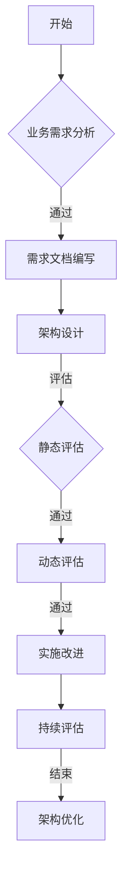

                 


### 文章标题：《软件架构评估：确保设计满足业务需求》

### 关键词：软件架构、业务需求、评估方法、静态评估、动态评估、架构评估工具

### 摘要：
本文旨在探讨软件架构评估的重要性，并详细阐述评估过程中所需的方法和工具。文章首先介绍了软件架构的基本概念和业务需求分析，然后深入探讨了静态和动态评估方法，以及常用架构评估工具的配置与使用。通过具体实践案例，本文展示了架构评估在实际项目中的应用，并总结了持续架构评估与改进的最佳实践。读者通过本文可以掌握软件架构评估的核心知识，提升业务需求理解和设计能力。

---

## 第1章 引言

### 1.1 软件架构评估的重要性

软件架构评估是确保软件系统能够满足业务需求的关键环节。一个良好的软件架构不仅能够提高系统的可靠性、可维护性和可扩展性，还能显著降低开发成本和风险。然而，在实际开发过程中，软件架构的设计往往受到时间、资源和经验的限制，导致设计偏离业务需求，甚至出现严重缺陷。因此，软件架构评估成为软件开发过程中不可或缺的一环。

**架构评估的定义与目的**：
架构评估是指通过一系列方法和技术，对软件架构的设计、实现和质量进行评价，以确保其满足业务需求。其目的在于发现潜在问题、优化设计、降低风险，并提高系统的整体性能。

**架构评估与业务成功的关联**：
成功的软件项目往往离不开良好的软件架构。架构评估能够帮助开发团队确保架构设计符合业务需求，避免因设计缺陷导致的后期修正和重做，从而提高开发效率和项目成功率。

### 1.2 书籍概述与目标

**书籍结构概述**：
本书分为八个章节，涵盖了软件架构评估的各个方面，包括基本概念、业务需求分析、评估方法、评估工具和实践案例。通过系统化的讲解，读者可以全面了解软件架构评估的全过程。

**读者预期收获**：
通过阅读本书，读者将能够：
1. 理解软件架构评估的基本原理和重要性。
2. 掌握业务需求分析的方法和技巧。
3. 熟悉静态和动态评估方法及其应用。
4. 学会使用常见的架构评估工具。
5. 获得实际项目中的架构评估经验。

### 1.3 读者对象与预期收获

**适合读者群体**：
本书适合以下读者：
1. 软件开发人员，特别是负责软件架构设计和评估的工程师。
2. 项目经理和产品经理，需要了解软件架构评估以指导项目决策。
3. 软件架构师和软件设计师，希望通过评估提高设计质量。

**学习路线与建议**：
为了更好地理解软件架构评估，读者可以按照以下学习路线进行：
1. 首先，阅读第1章，了解软件架构评估的背景和目标。
2. 然后，从第2章开始，逐步学习软件架构的基础知识。
3. 接着，深入学习第3章的业务需求分析。
4. 之后，通过第4章和第5章，掌握评估方法和工具。
5. 最后，通过第6章和第7章的实践案例，将所学知识应用于实际项目中。

---

**本章小结**：
本章介绍了软件架构评估的重要性，并概述了本书的结构和目标。通过本章的学习，读者可以初步了解软件架构评估的核心概念，为后续章节的深入学习打下基础。

## 第2章 软件架构基础

### 2.1 软件架构的基本概念

软件架构是软件系统的骨架，它定义了系统的组成组件、组件之间的关系，以及这些组件如何协同工作来实现系统的功能。理解软件架构的基本概念是进行架构评估的基础。

**架构、设计、实现的关系**：
- **架构**：描述系统的整体结构和设计原则，是高层次的设计。
- **设计**：在架构指导下，详细定义各个组件的行为和交互。
- **实现**：根据设计和架构，编写具体的代码和程序。

**软件架构的要素**：
- **组件**：软件系统中的基本构建块，如模块、库、服务。
- **接口**：组件之间的交互方式，定义了组件如何进行通信和协作。
- **依赖**：组件之间的关系，描述了组件之间的依赖程度和交互模式。
- **交互模式**：组件之间如何通信和协作，如请求响应、事件驱动。

**软件架构的层次结构**：
软件架构通常可以分为以下几个层次：
1. **基础架构层**：提供基础服务和功能，如数据库、缓存、消息队列。
2. **业务逻辑层**：实现核心业务逻辑，处理业务流程和规则。
3. **表现层**：负责用户界面的展示，与用户进行交互。
4. **数据访问层**：负责数据的存储和访问，包括数据库、文件系统等。

### 2.2 软件架构的框架和模型

软件架构的框架和模型提供了对软件系统结构的描述方法，有助于理解和评估架构的设计质量。

**软件架构框架概述**：
- **模型驱动架构（MDA）**：将软件系统建模为抽象的、与平台无关的模型，强调模型的规范性和可重用性。
- **分层架构**：将系统划分为多个层次，每个层次负责不同的功能，如MVC（模型-视图-控制器）。
- **微服务架构**：将系统拆分为多个独立的服务，每个服务负责单一的业务功能，强调服务的自治性和可扩展性。

**典型软件架构模型**：
1. **层状架构**：
    - **特点**：各层之间松耦合，每层负责不同的功能。
    - **应用场景**：传统的企业级应用，如Web应用和桌面应用。

2. **微服务架构**：
    - **特点**：每个服务都是独立的、自治的组件，可以独立部署、扩展和更新。
    - **应用场景**：需要高度可扩展和可维护的系统，如电子商务平台、社交网络。

3. **事件驱动架构**：
    - **特点**：基于事件进行通信和协作，系统中的各个组件通过事件进行交互。
    - **应用场景**：实时系统、物联网应用。

### 2.3 软件架构设计原则

软件架构设计原则是指导软件架构设计的基本原则，有助于提高架构的质量和可维护性。

**设计原则概述**：
- **简单性**：设计应尽可能简单，避免不必要的复杂性。
- **模块化**：将系统划分为独立的模块，每个模块具有清晰的功能和接口。
- **可复用性**：设计应支持组件的重用，降低开发成本。
- **可扩展性**：设计应易于扩展，以适应业务需求的变更。
- **可维护性**：设计应易于理解和修改，降低维护成本。

**核心原则讲解**：
1. **单一职责原则**：
    - **定义**：每个模块应仅负责单一的功能。
    - **作用**：提高模块的独立性，降低模块间的耦合度。

2. **开闭原则**：
    - **定义**：模块应对扩展开放，对修改关闭。
    - **作用**：提高系统的可维护性和可扩展性，避免因修改引起的连锁反应。

3. **里氏替换原则**：
    - **定义**：子类可以替换父类，而不改变系统的行为。
    - **作用**：提高代码的可复用性和可测试性。

4. **依赖倒置原则**：
    - **定义**：高层模块不应依赖于低层模块，二者都应依赖于抽象。
    - **作用**：降低模块间的耦合度，提高系统的灵活性和可维护性。

---

**本章小结**：
本章介绍了软件架构的基本概念、框架和设计原则。通过本章的学习，读者可以理解软件架构的构成要素和设计方法，为后续的架构评估奠定基础。

## 第3章 业务需求分析

### 3.1 业务需求的识别与理解

业务需求分析是软件架构评估的重要前置步骤，它直接影响到软件架构的设计质量。正确识别和理解业务需求，有助于确保软件架构能够满足实际业务需求。

**业务需求的概念**：
业务需求是指为了实现特定业务目标，软件系统需要具备的功能、性能、约束和限制等要求。业务需求可以来源于客户、市场、政策等多种渠道。

**业务需求的识别方法**：
1. **访谈法**：通过面对面的访谈，了解业务人员的实际需求和痛点。
2. **问卷调查**：通过设计问卷，收集大量业务需求信息。
3. **用户故事**：采用用户故事的形式，描述用户的需求和使用场景。
4. **需求文档**：编写详细的需求文档，记录业务需求的具体内容。

**业务需求的层次结构**：
业务需求可以从不同维度进行分类，常见的层次结构包括：
1. **功能性需求**：软件系统需要实现的具体功能。
2. **非功能性需求**：软件系统需要满足的性能、安全性、可靠性等非功能要求。
3. **约束性需求**：软件系统需要遵守的法律法规、标准规范等。

**业务需求的识别步骤**：
1. **收集信息**：通过各种途径收集业务需求信息。
2. **分析需求**：对收集到的信息进行分析，识别出具体的业务需求。
3. **分类和优先级排序**：将业务需求分类，并根据其重要性进行优先级排序。

**业务需求的文档化**：
业务需求文档是记录业务需求的重要文件，其结构和内容应清晰、完整、易于理解。业务需求文档通常包括以下部分：
1. **封面**：包括文档标题、版本号、编写人、审核人等。
2. **目录**：列出文档的主要章节和子章节。
3. **需求概述**：简要描述业务需求的背景和目标。
4. **需求描述**：详细描述每个业务需求的功能、性能和约束。
5. **需求分析**：对业务需求进行分析，解释需求之间的关联和依赖关系。
6. **需求验证**：描述如何验证业务需求的实现情况。

---

**本章小结**：
本章介绍了业务需求分析的基本概念、识别方法和层次结构，并详细阐述了业务需求的文档化过程。通过本章的学习，读者可以掌握业务需求分析的技巧，为后续的架构评估提供准确的业务需求基础。

## 第4章 软件架构评估方法

### 4.1 评估方法的概述

软件架构评估是通过一系列方法和工具，对软件架构的设计、实现和质量进行评价，以确保其满足业务需求。评估方法的选择取决于评估的目标、范围和约束条件。

**评估方法的分类**：
1. **静态评估方法**：通过分析设计文档和代码，评估软件架构的质量和符合度。
2. **动态评估方法**：通过运行软件系统，评估其在实际运行环境中的性能和行为。

**评估方法的优劣分析**：
1. **静态评估方法**：
    - **优点**：评估过程无需运行软件，可以在设计阶段发现潜在问题，减少开发成本。
    - **缺点**：评估的准确性受限于文档和代码的质量，无法完全反映软件的实际性能。

2. **动态评估方法**：
    - **优点**：能够反映软件在实际运行环境中的性能和稳定性。
    - **缺点**：评估过程需要运行软件，可能影响系统的正常运行，且评估结果受限于测试环境和数据。

**评估方法的适用场景**：
- **静态评估方法**：适用于架构设计阶段，用于评估架构的可行性和符合度。
- **动态评估方法**：适用于软件交付前，用于验证软件的实际性能和稳定性。

---

### 4.2 静态评估方法

静态评估方法主要通过对设计文档和代码的分析，评估软件架构的质量。以下是一些常用的静态评估方法：

**基于设计文档的评估**：

1. **Use Case Analysis**：
    - **定义**：Use Case Analysis 是一种需求分析方法，通过描述系统与用户之间的交互来理解系统的功能。
    - **作用**：帮助评估架构是否满足用户需求，确保功能完整性。

2. **Component Diagrams**：
    - **定义**：Component Diagrams 是一种UML图，用于表示系统的组件及其相互关系。
    - **作用**：帮助评估架构的模块化和独立性。

3. **Sequence Diagrams**：
    - **定义**：Sequence Diagrams 是一种UML图，用于描述系统组件之间的交互顺序。
    - **作用**：帮助评估架构的交互性和一致性。

**基于代码的评估**：

1. **Code Metrics**：
    - **定义**：Code Metrics 是用于评估代码复杂度、可维护性和可读性的量化指标。
    - **作用**：帮助评估代码质量，确保代码的可维护性和可扩展性。

2. **Code Review**：
    - **定义**：Code Review 是一种通过同行评审来评估代码质量的方法。
    - **作用**：发现潜在的设计问题和代码缺陷，提高代码质量。

---

**本章小结**：
本章介绍了软件架构评估方法的基本概念和分类，重点阐述了静态评估方法的原理和应用。通过本章的学习，读者可以了解静态评估方法在软件架构评估中的重要性，并掌握其具体应用技巧。

## 第5章 软件架构评估工具

### 5.1 评估工具的选择

选择合适的软件架构评估工具是确保评估过程高效、准确的关键。评估工具的选择应考虑以下几个因素：

**工具类型**：
1. **静态评估工具**：如SonarQube、Checkstyle等，用于代码质量分析。
2. **动态评估工具**：如LoadRunner、JMeter等，用于性能测试。
3. **综合性评估工具**：如ArchUnit、NDepend等，具备静态和动态评估功能。

**评估需求**：
1. **代码质量**：检查代码复杂度、代码规范、潜在的缺陷。
2. **架构质量**：分析模块依赖关系、架构风格、设计模式等。
3. **性能和可扩展性**：评估系统的响应时间、吞吐量、资源消耗等。

**工具性能**：
1. **评估速度**：工具应能够快速完成评估，以适应敏捷开发。
2. **准确性**：工具应能够准确识别问题和提供有效的改进建议。

**用户友好性**：
1. **界面**：易于理解和操作。
2. **文档和支持**：提供详细的文档和良好的技术支持。

**成本**：
1. **开源工具**：免费，但可能需要更多的配置和维护。
2. **商业工具**：提供专业支持，但需要付费。

### 5.2 常用评估工具介绍

**SonarQube**：
- **特点**：开源，支持多种编程语言，提供代码质量分析、安全漏洞检测等功能。
- **应用**：用于代码质量评估，包括代码风格、复杂度、潜在缺陷等。

**Checkstyle**：
- **特点**：开源，支持多种编程语言，用于检查代码规范。
- **应用**：用于代码规范检查，确保代码风格一致性。

**LoadRunner**：
- **特点**：商业工具，用于性能测试，支持多种协议和平台。
- **应用**：用于评估系统性能和可扩展性，包括响应时间、吞吐量、资源消耗等。

**JMeter**：
- **特点**：开源，用于性能测试，支持HTTP、HTTPS、Web等协议。
- **应用**：用于评估Web应用的性能和负载能力。

**ArchUnit**：
- **特点**：开源，用于静态代码分析，用于检查代码质量。
- **应用**：用于确保代码遵循设计原则，如单一职责、开闭原则等。

**NDepend**：
- **特点**：商业工具，用于代码质量分析，支持多种编程语言。
- **应用**：用于评估代码质量、架构质量和依赖关系。

### 5.3 工具的配置与使用

**配置步骤**：
1. **安装和部署**：根据工具的文档，安装并配置所需的环境。
2. **连接代码库**：配置代码库的访问权限，以便工具能够读取代码。
3. **设置规则和指标**：根据项目需求，配置工具的规则和指标。

**使用技巧**：
1. **定期评估**：定期运行评估工具，检查代码质量和架构问题。
2. **分析报告**：仔细阅读评估报告，识别问题和改进点。
3. **持续改进**：根据评估结果，持续优化代码和架构。

---

**本章小结**：
本章介绍了软件架构评估工具的选择标准和常用工具，并详细阐述了工具的配置和使用方法。通过本章的学习，读者可以掌握评估工具的应用技巧，提高软件架构评估的效率和质量。

## 第6章 软件架构评估实践

### 6.1 实践案例1：Web应用架构评估

**案例背景**：
一个电子商务网站需要对其现有的Web应用架构进行评估，以确保其满足业务需求，支持未来的扩展和优化。

**评估目标**：
- 评估现有的Web应用架构是否符合业务需求。
- 识别潜在的性能瓶颈和设计缺陷。
- 提供改进建议，以优化系统的性能和可维护性。

**评估过程**：

1. **需求分析**：
   - 收集并分析业务需求，了解系统的功能要求。
   - 识别系统的关键性能指标，如响应时间、吞吐量、并发用户数。

2. **静态评估**：
   - 使用SonarQube和Checkstyle对代码进行质量分析，识别代码复杂度、规范性和潜在缺陷。
   - 使用ArchUnit检查代码是否符合设计原则，如单一职责、开闭原则等。

3. **动态评估**：
   - 使用JMeter模拟用户负载，评估系统的性能和稳定性。
   - 使用LoadRunner进行压力测试，识别系统的瓶颈和性能问题。

4. **评估报告**：
   - 编写详细的评估报告，列出发现的问题和改进建议。
   - 提供具体的改进措施，如优化数据库查询、使用缓存、改进负载均衡策略。

**改进措施**：
- **代码优化**：减少代码复杂度，提高代码可读性和可维护性。
- **性能优化**：优化数据库查询，使用缓存减少数据库访问次数，优化负载均衡策略。
- **架构改进**：改进系统的模块划分，增加微服务，提高系统的可扩展性和灵活性。

**案例小结**：
通过静态和动态评估，电子商务网站识别出了多个性能瓶颈和设计缺陷。根据评估结果，网站进行了代码优化和性能改进，显著提升了系统的性能和稳定性，为未来的扩展和优化奠定了基础。

### 6.2 实践案例2：移动应用架构评估

**案例背景**：
一个移动应用需要对其架构进行评估，以确保其满足用户体验需求，支持多平台部署和性能优化。

**评估目标**：
- 评估现有移动应用架构的合理性，包括模块划分、依赖关系和性能表现。
- 识别潜在的性能瓶颈和用户体验问题。
- 提供改进建议，以优化应用性能和用户体验。

**评估过程**：

1. **需求分析**：
   - 收集并分析用户反馈和业务需求，了解应用的功能要求和用户体验预期。
   - 识别关键性能指标，如加载时间、响应速度、数据传输效率等。

2. **静态评估**：
   - 使用SonarQube和Checkstyle对应用代码进行质量分析，识别代码规范性和潜在缺陷。
   - 使用ArchUnit检查代码架构是否符合设计原则。

3. **动态评估**：
   - 使用Appium进行自动化测试，评估应用的稳定性和用户体验。
   - 使用Profiler工具分析应用的性能，识别加载时间、内存使用、CPU负载等问题。

4. **评估报告**：
   - 编写详细的评估报告，列出发现的问题和改进建议。
   - 提供具体的优化措施，如优化图片资源、减少网络请求、改进数据库操作。

**改进措施**：
- **代码优化**：优化代码结构，减少不必要的网络请求和数据传输。
- **资源优化**：优化图片和音频资源，使用压缩算法减少文件大小。
- **架构改进**：改进数据存储和缓存策略，提高数据的读取和写入速度。

**案例小结**：
通过静态和动态评估，移动应用识别出了多个性能瓶颈和用户体验问题。根据评估结果，应用进行了代码优化和架构改进，显著提升了用户体验和应用性能，为用户提供了更好的服务。

### 6.3 实践案例3：云计算应用架构评估

**案例背景**：
一个云计算应用需要对其架构进行评估，以确保其满足云服务的特性，如弹性扩展、高可用性和安全性。

**评估目标**：
- 评估现有云计算应用架构的合理性和安全性。
- 识别潜在的性能瓶颈和安全隐患。
- 提供改进建议，以优化应用的性能和安全性。

**评估过程**：

1. **需求分析**：
   - 收集并分析业务需求，了解应用的云服务特性要求，如弹性扩展、负载均衡、安全性等。
   - 识别关键性能指标，如响应时间、并发用户数、资源利用率等。

2. **静态评估**：
   - 使用ArchUnit检查代码架构是否符合云服务特性，如模块划分、依赖关系等。
   - 使用SonarQube分析代码质量，识别潜在的安全漏洞和性能问题。

3. **动态评估**：
   - 使用云平台提供的监控工具，评估应用的性能和资源利用率。
   - 使用安全扫描工具，评估应用的安全性，识别潜在的安全漏洞。

4. **评估报告**：
   - 编写详细的评估报告，列出发现的问题和改进建议。
   - 提供具体的优化措施，如优化网络配置、改进负载均衡策略、加强安全防护等。

**改进措施**：
- **性能优化**：优化网络配置，提高数据传输效率。
- **弹性扩展**：改进自动化扩展策略，确保应用能够根据负载自动调整资源。
- **安全性提升**：加强安全防护，如使用加密技术、访问控制策略等。

**案例小结**：
通过静态和动态评估，云计算应用识别出了多个性能瓶颈和安全隐患。根据评估结果，应用进行了性能优化和安全改进，显著提升了应用的性能和安全性，为用户提供了更可靠的服务。

---

**本章小结**：
通过三个实际案例，本章展示了软件架构评估在不同类型的应用中的具体应用。通过案例实践，读者可以了解架构评估的方法和技巧，为实际项目中的架构评估提供参考。

## 第7章 软件架构评估报告

### 7.1 报告的结构与内容

软件架构评估报告是评估结果的总结和展示，其结构和内容应清晰、系统、具有可操作性。以下是评估报告的基本结构：

1. **封面**：
   - 包括报告标题、版本号、编写人、审核人、编写日期等。

2. **摘要**：
   - 概述评估的主要目标、过程、发现的问题和改进建议。

3. **目录**：
   - 列出报告的主要章节和子章节，便于读者快速定位。

4. **评估概述**：
   - 简要介绍评估的目标、范围、方法和工具。

5. **评估结果**：
   - 详细列出评估过程中发现的问题，包括问题类型、位置、影响等。

6. **改进建议**：
   - 针对发现的问题，提供具体的改进措施和实施方案。

7. **风险评估**：
   - 评估改进措施的潜在风险，并提供风险缓解策略。

8. **实施计划**：
   - 描述改进措施的执行计划，包括时间表、责任人和资源配置。

9. **附录**：
   - 包括评估工具使用说明、数据源、参考文献等。

### 7.2 报告的编写技巧

**结构清晰**：
- 报告应采用清晰的结构，确保读者能够迅速理解报告内容。
- 每个章节应有明确的主题和结论。

**语言简练**：
- 使用简明的语言，避免冗长的描述。
- 使用图表、流程图等视觉元素，增强报告的可读性。

**数据准确**：
- 报告中的数据应准确无误，确保评估结果的可靠性。
- 使用图表和数据表，清晰展示评估结果。

**可操作性**：
- 改进建议应具体、可操作，便于团队执行。
- 提供详细的实施步骤和资源配置，确保改进措施能够顺利实施。

### 7.3 演示与展示

**演示目的**：
- 展示评估工具的使用方法和评估结果。
- 提供改进措施的可视化展示。

**演示内容**：
1. **评估工具介绍**：
   - 展示评估工具的界面和功能。
   - 介绍如何配置和使用评估工具。

2. **评估结果展示**：
   - 使用图表、流程图等展示评估结果。
   - 解释评估结果对架构设计和改进的影响。

3. **改进措施演示**：
   - 演示如何根据评估结果实施改进措施。
   - 展示改进后的架构设计和性能提升。

**演示技巧**：
- 使用演示软件或实际代码，确保演示内容真实可信。
- 结合实际案例，解释评估结果和改进措施的实用价值。
- 保持演示简洁明了，突出重点。

---

**本章小结**：
本章介绍了软件架构评估报告的结构与内容，并详细阐述了报告编写的技巧和演示方法。通过本章的学习，读者可以掌握撰写高质量评估报告的技巧，确保评估结果能够有效地传达和实施。

## 第8章 持续架构评估与改进

### 8.1 持续架构评估的概念与重要性

持续架构评估是一种动态、持续的评估过程，旨在确保软件架构在开发和运维过程中始终保持高质量和适应性。与一次性评估相比，持续评估能够及时发现和解决架构问题，减少对业务的影响，提高系统的稳定性和可维护性。

**概念**：
- **持续架构评估**：在软件生命周期内，定期对软件架构进行评估，识别潜在问题并进行改进。
- **架构审计**：一种特殊的持续评估方法，通过外部专家的审计，确保架构设计符合最佳实践和标准。

**重要性**：
1. **适应业务变化**：随着业务需求的变化，软件架构需要不断调整和优化，以保持适应性。
2. **提高质量**：持续评估能够及时发现设计缺陷和性能瓶颈，提高系统的可靠性和性能。
3. **降低风险**：持续评估有助于识别和缓解潜在风险，降低系统故障和业务中断的概率。
4. **优化成本**：通过持续优化架构，降低维护成本和开发成本，提高资源利用效率。

### 8.2 持续架构评估的策略

**评估频率**：
- **定期评估**：根据项目周期和业务需求，定期进行架构评估，如季度评估、半年评估等。
- **持续监控**：使用自动化工具和监控平台，实时监控架构性能和稳定性，及时发现问题。

**评估方法**：
- **静态评估**：通过代码分析、设计文档审查等方法，识别潜在问题。
- **动态评估**：通过性能测试、负载测试等方法，评估系统在实际运行环境中的表现。

**评估内容**：
- **架构质量**：评估架构是否符合设计原则和最佳实践。
- **性能和可扩展性**：评估系统的性能指标和可扩展性。
- **安全性和合规性**：评估系统是否符合安全标准和合规要求。

**评估流程**：
1. **需求分析**：确定评估目标和内容。
2. **评估执行**：按照评估方法和流程，执行评估任务。
3. **问题识别**：分析评估结果，识别问题。
4. **改进实施**：制定改进计划，实施改进措施。
5. **结果验证**：验证改进措施的有效性，确保问题得到解决。

### 8.3 架构改进的实施与跟踪

**实施步骤**：
1. **问题定位**：根据评估结果，确定需要改进的具体问题和领域。
2. **方案制定**：制定具体的改进方案，包括技术方案和实施计划。
3. **资源分配**：分配所需资源，包括人力、时间和资金。
4. **实施执行**：按照改进方案，执行具体实施任务。
5. **测试验证**：在实施后进行测试验证，确保改进措施的有效性。

**跟踪与反馈**：
1. **进度跟踪**：监控改进措施的执行进度，确保按照计划进行。
2. **反馈收集**：收集改进措施的实际效果和用户反馈。
3. **持续优化**：根据反馈和评估结果，持续优化改进措施，确保系统持续改进。

**工具支持**：
- **自动化工具**：使用自动化工具，如Jenkins、GitLab CI等，自动化执行评估和改进任务。
- **监控工具**：使用监控工具，如Prometheus、Grafana等，实时监控系统的性能和稳定性。

---

**本章小结**：
本章介绍了持续架构评估的概念、策略和实施方法。通过持续架构评估，开发团队可以确保软件架构在开发和运维过程中始终保持高质量和适应性，为业务的持续发展提供有力支持。

## 附录

### 附录A：常用架构评估工具与资源

**静态评估工具**：
- **SonarQube**：[https://www.sonarqube.org/](https://www.sonarqube.org/)
- **Checkstyle**：[https://www.checkstyle.org/](https://www.checkstyle.org/)
- **ArchUnit**：[https://archunit.org/](https://archunit.org/)
- **NDepend**：[https://www.ndepend.com/](https://www.ndepend.com/)

**动态评估工具**：
- **LoadRunner**：[https://www.hp.com/us/en/products/LoadRunner.html](https://www.hp.com/us/en/products/LoadRunner.html)
- **JMeter**：[https://jmeter.apache.org/](https://jmeter.apache.org/)
- **Appium**：[https://appium.io/](https://appium.io/)

**综合评估工具**：
- **CodeScene**：[https://codesceneapp.com/](https://codesceneapp.com/)

**资源与参考文献**：
- 《软件架构：实践者的研究方法》（Mark Richards）
- 《软件架构设计：基于模式的工程方法》（David Schmidt）

### 附录B：参考资料与推荐阅读

- 《软件架构：实践者的研究方法》作者：Mark Richards
- 《软件架构设计：基于模式的工程方法》作者：David Schmidt
- 《持续交付：发布可靠软件的系统化方法》作者：Jez Humble 和 David Farley

### 附录C：术语表

- **软件架构**：软件系统的整体结构和设计原则，定义了系统的组件、组件之间的关系以及这些组件如何协同工作。
- **业务需求**：为了实现特定业务目标，软件系统需要具备的功能、性能、约束和限制等要求。
- **静态评估**：在不运行软件的情况下，通过分析设计文档和代码，评估软件架构的质量和符合度。
- **动态评估**：在运行软件的情况下，通过测试和性能分析，评估软件架构的实际性能和稳定性。
- **微服务架构**：将系统拆分为多个独立的服务，每个服务负责单一的业务功能，强调服务的自治性和可扩展性。
- **模块化**：将软件系统划分为多个独立的模块，每个模块具有清晰的功能和接口。

---

**本章小结**：
通过附录部分，本文提供了常用的架构评估工具和资源，推荐了相关的参考文献，并定义了本文中涉及的关键术语。这些内容为读者进一步学习和实践提供了丰富的资源和指导。

## 总结

本文全面探讨了软件架构评估的重要性和方法。首先，介绍了软件架构的基本概念、业务需求分析以及评估方法的分类。接着，详细阐述了静态和动态评估方法，以及常用评估工具的配置与使用。通过实际案例，展示了架构评估在不同类型应用中的具体应用，并提供了详细的改进措施。最后，本章介绍了持续架构评估的策略和实施方法，强调了持续改进在软件架构设计中的重要性。通过本文的学习，读者可以掌握软件架构评估的核心知识，提升业务需求理解和设计能力。希望本文能为您的软件开发工作提供有价值的参考和指导。感谢您的阅读！

**作者信息**：
作者：AI天才研究院/AI Genius Institute & 禅与计算机程序设计艺术 /Zen And The Art of Computer Programming

---

### 附录：补充材料与示例

**示例：Mermaid流程图**



**示例：伪代码**

```plaintext
// 伪代码：事件驱动架构中的消息处理
function handleMessage(message) {
    if (message.type == "ORDER_PLACED") {
        processOrder(message.data);
    } else if (message.type == "PAYMENT_CONFIRMED") {
        updateOrderStatus(message.data);
    } else {
        log("Unsupported message type: " + message.type);
    }
}

function processOrder(orderData) {
    // 处理订单逻辑
}

function updateOrderStatus(orderData) {
    // 更新订单状态逻辑
}
```

**示例：LaTeX数学公式**

```plaintext
// LaTeX公式：基本运算
$$1 + 1 = 2$$

// LaTeX公式：复杂运算
$E = mc^2$
```

通过上述示例，读者可以更好地理解文中提到的技术概念和工具的使用方法。这些补充材料和示例为深入学习和实践提供了直观的参考。希望这些材料能够帮助读者更好地掌握软件架构评估的核心知识。

---

### 结语

本文详细探讨了软件架构评估的重要性、方法和实践，旨在帮助读者深入了解软件架构评估的核心知识，提升业务需求理解和设计能力。通过实际案例的分析，读者可以更好地理解评估方法在实际项目中的应用。持续架构评估和改进是确保软件系统稳定性和性能的关键。感谢您的阅读，希望本文能为您的软件开发工作提供有价值的参考和指导。作者：AI天才研究院/AI Genius Institute & 禅与计算机程序设计艺术 /Zen And The Art of Computer Programming。如果您有任何疑问或建议，欢迎在评论区留言，期待与您交流。再次感谢您的支持和关注！

