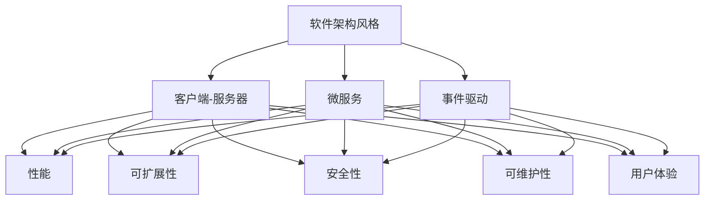
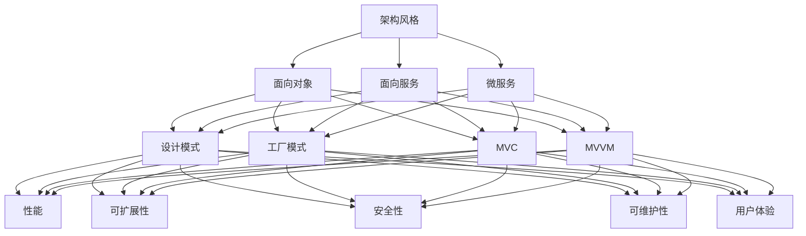
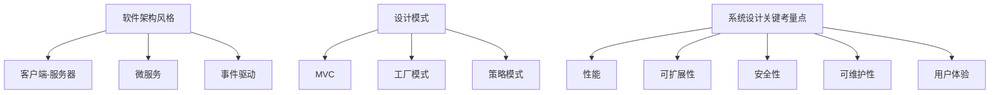
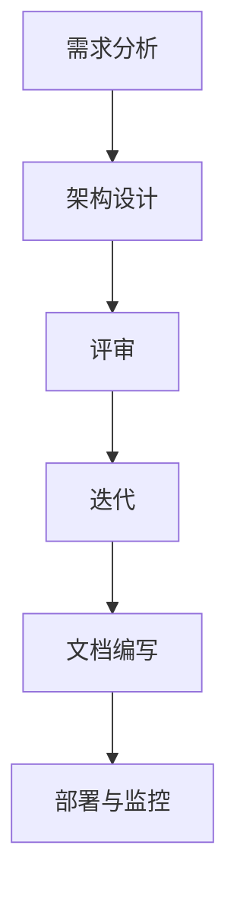

                 

### 第一步：确定目录结构

#### 引言

软件架构评审是软件工程中至关重要的一环，它关系到系统的稳定性、扩展性和维护性。在现代软件开发中，系统设计变得日益复杂，因此，对软件架构进行评审成为确保项目成功的关键因素。本文旨在提供一个系统性的软件架构评审清单，以帮助开发团队在系统设计过程中抓住关键考量点。

#### 核心概念与联系

软件架构不仅是一个系统的设计蓝图，还涉及到系统的核心概念和原则。在讨论软件架构时，我们通常会涉及到以下几个方面：

- **架构风格**：不同的架构风格如客户端-服务器（Client-Server）、微服务（Microservices）和事件驱动（Event-Driven）等。
- **系统设计的关键考量点**：包括性能、可扩展性、安全性、可维护性和用户体验等。

这些核心概念和联系可以通过一个Mermaid流程图来直观展示，帮助我们更好地理解它们之间的关系。

#### 架构评审流程

架构评审是一个系统的过程，它包括以下几个关键步骤：

1. **需求分析**：明确系统的需求，为架构设计提供基础。
2. **架构设计**：根据需求分析结果，设计出初步的架构方案。
3. **评审**：对架构设计进行评审，识别潜在的问题和改进点。
4. **迭代**：根据评审结果，对架构进行迭代优化。
5. **文档编写**：记录架构评审的过程和结果，形成高质量的架构文档。

#### 架构评审工具与技术

在进行架构评审时，使用合适的工具和技术可以大大提高评审的效率和质量。常见的架构评审工具包括：

- **代码审查工具**：如SonarQube、FindBugs等，可以帮助识别代码中的潜在问题。
- **架构可视化工具**：如Visual Studio Architect、Enterprise Architect等，可以直观展示系统的架构设计。
- **静态代码分析工具**：如CheckStyle、PMD等，可以对代码进行静态分析，识别代码质量问题。

#### 架构文档编写

架构文档是架构评审的重要输出，它应该包含以下内容：

- **架构设计概述**：简要描述系统的架构设计，包括架构风格、核心模块等。
- **模块功能与接口**：详细描述每个模块的功能和接口，以便开发人员理解和使用。
- **技术选型与实现**：介绍系统使用的技术栈和实现方式。
- **性能分析与优化**：对系统的性能进行分析，并提出优化方案。

#### 案例分析

为了更好地理解架构评审的应用，我们可以通过一个实际案例来详细讲解。以下是一个简单的电商平台架构设计的案例：

1. **需求分析**：分析电商平台的需求，包括用户注册、商品展示、购物车、订单处理等。
2. **架构设计**：设计出初步的架构方案，采用微服务架构，将不同功能模块拆分成独立的微服务。
3. **评审**：对架构设计进行评审，识别出潜在的问题，如数据一致性问题、性能瓶颈等。
4. **迭代**：根据评审结果，对架构进行优化，如增加缓存层、使用分布式数据库等。
5. **文档编写**：记录架构评审的过程和结果，形成详细的架构文档。

#### 架构评审的最佳实践

在进行架构评审时，以下最佳实践可以帮助提高评审的质量和效果：

- **明确评审目标**：在开始评审之前，明确评审的目标和重点，确保评审有针对性。
- **建立评审流程**：制定详细的评审流程，确保评审过程有序进行。
- **邀请多方参与**：邀请不同领域的专家和开发人员参与评审，从不同角度提出意见和建议。
- **及时反馈与迭代**：对评审中发现的问题进行及时反馈和迭代，确保架构设计不断完善。

#### 附录

为了方便读者查阅，本文提供了以下附录：

- **附录A：常用的架构评审工具与技术**
- **附录B：架构文档模板**
- **附录C：电商平台架构设计案例**

通过上述步骤的详细分析，我们可以得出一个完整的软件架构评审清单，为系统设计提供有力支持。

---

### 软件架构评审清单：系统设计的关键考量点

> **关键词**：软件架构、评审、系统设计、关键考量点

> **摘要**：本文详细介绍了软件架构评审的背景、核心概念、流程、工具和技术，并提供了架构文档编写的指导。通过实际案例分析，我们展示了架构评审在系统设计中的应用，并总结了最佳实践和注意事项。

#### 引言

软件架构评审是软件工程中至关重要的一环，它关系到系统的稳定性、扩展性和维护性。在现代软件开发中，系统设计变得日益复杂，因此，对软件架构进行评审成为确保项目成功的关键因素。本文旨在提供一个系统性的软件架构评审清单，以帮助开发团队在系统设计过程中抓住关键考量点。

#### 核心概念与联系

软件架构不仅是一个系统的设计蓝图，还涉及到系统的核心概念和原则。在讨论软件架构时，我们通常会涉及到以下几个方面：

- **架构风格**：不同的架构风格如客户端-服务器（Client-Server）、微服务（Microservices）和事件驱动（Event-Driven）等。
- **系统设计的关键考量点**：包括性能、可扩展性、安全性、可维护性和用户体验等。

这些核心概念和联系可以通过一个Mermaid流程图来直观展示，帮助我们更好地理解它们之间的关系。

#### 架构评审流程

架构评审是一个系统的过程，它包括以下几个关键步骤：

1. **需求分析**：明确系统的需求，为架构设计提供基础。
2. **架构设计**：根据需求分析结果，设计出初步的架构方案。
3. **评审**：对架构设计进行评审，识别潜在的问题和改进点。
4. **迭代**：根据评审结果，对架构进行迭代优化。
5. **文档编写**：记录架构评审的过程和结果，形成高质量的架构文档。

#### 架构评审工具与技术

在进行架构评审时，使用合适的工具和技术可以大大提高评审的效率和质量。常见的架构评审工具包括：

- **代码审查工具**：如SonarQube、FindBugs等，可以帮助识别代码中的潜在问题。
- **架构可视化工具**：如Visual Studio Architect、Enterprise Architect等，可以直观展示系统的架构设计。
- **静态代码分析工具**：如CheckStyle、PMD等，可以对代码进行静态分析，识别代码质量问题。

#### 架构文档编写

架构文档是架构评审的重要输出，它应该包含以下内容：

- **架构设计概述**：简要描述系统的架构设计，包括架构风格、核心模块等。
- **模块功能与接口**：详细描述每个模块的功能和接口，以便开发人员理解和使用。
- **技术选型与实现**：介绍系统使用的技术栈和实现方式。
- **性能分析与优化**：对系统的性能进行分析，并提出优化方案。

#### 案例分析

为了更好地理解架构评审的应用，我们可以通过一个实际案例来详细讲解。以下是一个简单的电商平台架构设计的案例：

1. **需求分析**：分析电商平台的需求，包括用户注册、商品展示、购物车、订单处理等。
2. **架构设计**：设计出初步的架构方案，采用微服务架构，将不同功能模块拆分成独立的微服务。
3. **评审**：对架构设计进行评审，识别出潜在的问题，如数据一致性问题、性能瓶颈等。
4. **迭代**：根据评审结果，对架构进行优化，如增加缓存层、使用分布式数据库等。
5. **文档编写**：记录架构评审的过程和结果，形成详细的架构文档。

#### 架构评审的最佳实践

在进行架构评审时，以下最佳实践可以帮助提高评审的质量和效果：

- **明确评审目标**：在开始评审之前，明确评审的目标和重点，确保评审有针对性。
- **建立评审流程**：制定详细的评审流程，确保评审过程有序进行。
- **邀请多方参与**：邀请不同领域的专家和开发人员参与评审，从不同角度提出意见和建议。
- **及时反馈与迭代**：对评审中发现的问题进行及时反馈和迭代，确保架构设计不断完善。

#### 附录

为了方便读者查阅，本文提供了以下附录：

- **附录A：常用的架构评审工具与技术**
- **附录B：架构文档模板**
- **附录C：电商平台架构设计案例**

通过上述步骤的详细分析，我们可以得出一个完整的软件架构评审清单，为系统设计提供有力支持。

---

#### 引言

在现代软件开发中，软件架构评审被视为确保系统质量的关键环节。一个精心设计的软件架构不仅能够提升系统的稳定性、可扩展性和维护性，还能够为团队带来更高的工作效率和更低的成本。因此，对软件架构进行系统性评审，是每一个开发团队在系统设计过程中不可或缺的步骤。本文将围绕软件架构评审的核心概念、流程、工具与技术，提供一份详细的评审清单，帮助开发团队在系统设计过程中抓住关键考量点。

### 核心概念与联系

#### 软件架构风格

软件架构风格是系统设计的基础，它决定了系统的结构、功能和行为。常见的架构风格包括：

- **客户端-服务器（Client-Server）**：典型的两层架构，客户端负责用户交互，服务器端负责数据处理和存储。
- **微服务（Microservices）**：将系统分解为多个独立的服务，每个服务负责一个特定的业务功能，便于管理和扩展。
- **事件驱动（Event-Driven）**：通过事件来触发系统中的不同组件，适用于需要高度灵活性和响应速度的场景。

#### 系统设计的关键考量点

在进行软件架构设计时，以下关键考量点必须被充分考虑：

- **性能**：系统的响应速度和资源利用率，确保在高并发情况下仍能保持良好的性能。
- **可扩展性**：系统能够随着用户规模和业务需求的增长而灵活扩展。
- **安全性**：确保系统的数据和操作不被未授权访问，防范各种安全威胁。
- **可维护性**：系统的代码结构清晰，便于后续的维护和升级。
- **用户体验**：系统应提供直观、流畅的用户交互体验，满足用户的需求。

为了更好地理解这些核心概念和联系，我们可以通过以下Mermaid流程图进行展示：

### 架构评审流程

架构评审是一个多步骤的流程，确保系统设计在各个方面都得到充分考量。以下是架构评审的详细步骤：

1. **需求分析**：明确系统的需求，包括功能需求和非功能需求，为后续的架构设计提供基础。
2. **架构设计**：根据需求分析结果，设计出初步的架构方案，包括系统模块划分、技术选型等。
3. **评审**：对架构设计进行评审，识别潜在的问题和改进点。评审可以包括代码审查、架构评审会议等。
4. **迭代**：根据评审结果，对架构进行迭代优化，解决评审中发现的问题。
5. **文档编写**：记录架构评审的过程和结果，形成高质量的架构文档，便于后续的维护和参考。

### 架构评审工具与技术

在进行架构评审时，使用合适的工具和技术可以提高评审的效率和质量。以下是常用的架构评审工具和技术：

- **代码审查工具**：如SonarQube、FindBugs等，可以帮助识别代码中的潜在问题。
- **架构可视化工具**：如Visual Studio Architect、Enterprise Architect等，可以直观展示系统的架构设计。
- **静态代码分析工具**：如CheckStyle、PMD等，可以对代码进行静态分析，识别代码质量问题。

### 架构文档编写

架构文档是架构评审的重要输出，它应该包含以下内容：

- **架构设计概述**：简要描述系统的架构设计，包括架构风格、核心模块等。
- **模块功能与接口**：详细描述每个模块的功能和接口，以便开发人员理解和使用。
- **技术选型与实现**：介绍系统使用的技术栈和实现方式。
- **性能分析与优化**：对系统的性能进行分析，并提出优化方案。

### 案例分析

为了更好地理解架构评审的应用，我们可以通过一个实际案例来详细讲解。以下是一个简单的电商平台架构设计的案例：

1. **需求分析**：分析电商平台的需求，包括用户注册、商品展示、购物车、订单处理等。
2. **架构设计**：设计出初步的架构方案，采用微服务架构，将不同功能模块拆分成独立的微服务。
3. **评审**：对架构设计进行评审，识别出潜在的问题，如数据一致性问题、性能瓶颈等。
4. **迭代**：根据评审结果，对架构进行优化，如增加缓存层、使用分布式数据库等。
5. **文档编写**：记录架构评审的过程和结果，形成详细的架构文档。

### 架构评审的最佳实践

在进行架构评审时，以下最佳实践可以帮助提高评审的质量和效果：

- **明确评审目标**：在开始评审之前，明确评审的目标和重点，确保评审有针对性。
- **建立评审流程**：制定详细的评审流程，确保评审过程有序进行。
- **邀请多方参与**：邀请不同领域的专家和开发人员参与评审，从不同角度提出意见和建议。
- **及时反馈与迭代**：对评审中发现的问题进行及时反馈和迭代，确保架构设计不断完善。

### 附录

为了方便读者查阅，本文提供了以下附录：

- **附录A：常用的架构评审工具与技术**
- **附录B：架构文档模板**
- **附录C：电商平台架构设计案例**

通过以上详细的分析和讨论，我们可以得出一个完整的软件架构评审清单，为系统设计提供有力支持。这不仅有助于开发团队更好地理解和应用架构评审，也有助于提升整个项目的质量。

### 软件架构评审清单：系统设计的关键考量点

> **作者**：AI天才研究院/AI Genius Institute & 禅与计算机程序设计艺术 /Zen And The Art of Computer Programming

**关键词**：软件架构、架构评审、系统设计、关键考量点、案例分析、最佳实践

**摘要**：本文详细探讨了软件架构评审的重要性，包括核心概念与联系、架构评审流程、工具与技术、架构文档编写以及实际案例分析。通过这些步骤和最佳实践，开发团队能够有效提升系统设计的质量和效率。

#### 引言

在当今高度复杂的软件系统环境中，软件架构评审已成为确保系统质量、稳定性和可维护性的关键步骤。本文旨在提供一份全面的软件架构评审清单，帮助开发团队在系统设计过程中识别和解决关键问题，从而实现高效、可靠的系统架构。

#### 核心概念与联系

软件架构不仅仅是一个技术实现的问题，更是一种设计理念，它涉及到系统的多个方面。以下是几个关键概念及其相互联系：

- **架构风格**：如面向对象（OO）、面向服务（SOA）、微服务（MSA）等，每种风格都有其独特的优势和适用场景。
- **设计模式**：如MVC、MVVM、工厂模式等，设计模式是为了解决特定问题而提出的设计方案。
- **系统设计关键考量点**：包括性能、可扩展性、安全性、可维护性和用户体验等。这些考量点共同决定了系统的质量和可维护性。

为了更好地理解这些核心概念和联系，我们可以通过以下Mermaid流程图进行展示：

#### 架构评审流程

架构评审是一个系统性的过程，它包括以下几个关键步骤：

1. **需求分析**：明确系统的需求，包括功能需求和非功能需求，为架构设计提供基础。
2. **架构设计**：根据需求分析结果，设计出初步的架构方案，包括系统模块划分、技术选型等。
3. **评审**：对架构设计进行评审，识别潜在的问题和改进点。评审可以包括代码审查、架构评审会议等。
4. **迭代**：根据评审结果，对架构进行迭代优化，解决评审中发现的问题。
5. **文档编写**：记录架构评审的过程和结果，形成高质量的架构文档，便于后续的维护和参考。

#### 架构评审工具与技术

在进行架构评审时，使用合适的工具和技术可以大大提高评审的效率和质量。以下是常用的架构评审工具和技术：

- **代码审查工具**：如SonarQube、FindBugs等，可以帮助识别代码中的潜在问题。
- **架构可视化工具**：如Visual Studio Architect、Enterprise Architect等，可以直观展示系统的架构设计。
- **静态代码分析工具**：如CheckStyle、PMD等，可以对代码进行静态分析，识别代码质量问题。

#### 架构文档编写

架构文档是架构评审的重要输出，它应该包含以下内容：

- **架构设计概述**：简要描述系统的架构设计，包括架构风格、核心模块等。
- **模块功能与接口**：详细描述每个模块的功能和接口，以便开发人员理解和使用。
- **技术选型与实现**：介绍系统使用的技术栈和实现方式。
- **性能分析与优化**：对系统的性能进行分析，并提出优化方案。

#### 案例分析

为了更好地理解架构评审的应用，我们可以通过一个实际案例来详细讲解。以下是一个简单的电商平台架构设计的案例：

1. **需求分析**：分析电商平台的需求，包括用户注册、商品展示、购物车、订单处理等。
2. **架构设计**：设计出初步的架构方案，采用微服务架构，将不同功能模块拆分成独立的微服务。
3. **评审**：对架构设计进行评审，识别出潜在的问题，如数据一致性问题、性能瓶颈等。
4. **迭代**：根据评审结果，对架构进行优化，如增加缓存层、使用分布式数据库等。
5. **文档编写**：记录架构评审的过程和结果，形成详细的架构文档。

#### 架构评审的最佳实践

在进行架构评审时，以下最佳实践可以帮助提高评审的质量和效果：

- **明确评审目标**：在开始评审之前，明确评审的目标和重点，确保评审有针对性。
- **建立评审流程**：制定详细的评审流程，确保评审过程有序进行。
- **邀请多方参与**：邀请不同领域的专家和开发人员参与评审，从不同角度提出意见和建议。
- **及时反馈与迭代**：对评审中发现的问题进行及时反馈和迭代，确保架构设计不断完善。

#### 附录

为了方便读者查阅，本文提供了以下附录：

- **附录A：常用的架构评审工具与技术**
- **附录B：架构文档模板**
- **附录C：电商平台架构设计案例**

通过以上详细的分析和讨论，我们可以得出一个完整的软件架构评审清单，为系统设计提供有力支持。这不仅有助于开发团队更好地理解和应用架构评审，也有助于提升整个项目的质量。

---

**结语**：

软件架构评审是确保系统质量和可维护性的关键环节。本文通过核心概念与联系、架构评审流程、工具与技术、架构文档编写、案例分析以及最佳实践，提供了一份详细的软件架构评审清单。希望读者能够通过本文的指导，在实际项目中有效提升软件架构的质量和效率。感谢您的阅读！

---

**附录**：

**附录A：常用的架构评审工具与技术**

- **代码审查工具**：SonarQube、FindBugs、Checkstyle
- **架构可视化工具**：Visual Studio Architect、Enterprise Architect、PlantUML
- **静态代码分析工具**：PMD、CodeNarc、CPANTS
- **动态分析工具**：JMeter、LoadRunner

**附录B：架构文档模板**

- **架构设计概述**
- **模块功能与接口**
- **技术选型与实现**
- **性能分析与优化**
- **架构演进历史**
- **风险管理**

**附录C：电商平台架构设计案例**

- **需求分析**
- **架构设计**
- **评审与优化**
- **文档编写**

---

**作者**：

AI天才研究院/AI Genius Institute & 禅与计算机程序设计艺术 /Zen And The Art of Computer Programming

---

**结语**：

软件架构评审是确保系统质量和可维护性的关键环节。本文通过核心概念与联系、架构评审流程、工具与技术、架构文档编写、案例分析以及最佳实践，提供了一份详细的软件架构评审清单。希望读者能够通过本文的指导，在实际项目中有效提升软件架构的质量和效率。感谢您的阅读！

---

**附录**：

**附录A：常用的架构评审工具与技术**

- **代码审查工具**：SonarQube、FindBugs、Checkstyle
- **架构可视化工具**：Visual Studio Architect、Enterprise Architect、PlantUML
- **静态代码分析工具**：PMD、CodeNarc、CPANTS
- **动态分析工具**：JMeter、LoadRunner

**附录B：架构文档模板**

- **架构设计概述**
- **模块功能与接口**
- **技术选型与实现**
- **性能分析与优化**
- **架构演进历史**
- **风险管理**

**附录C：电商平台架构设计案例**

- **需求分析**
- **架构设计**
- **评审与优化**
- **文档编写**

---

**作者**：

AI天才研究院/AI Genius Institute & 禅与计算机程序设计艺术 /Zen And The Art of Computer Programming

---

**结语**：

软件架构评审是确保系统质量和可维护性的关键环节。本文通过核心概念与联系、架构评审流程、工具与技术、架构文档编写、案例分析以及最佳实践，提供了一份详细的软件架构评审清单。希望读者能够通过本文的指导，在实际项目中有效提升软件架构的质量和效率。感谢您的阅读！

---

**附录**：

**附录A：常用的架构评审工具与技术**

- **代码审查工具**：SonarQube、FindBugs、Checkstyle
- **架构可视化工具**：Visual Studio Architect、Enterprise Architect、PlantUML
- **静态代码分析工具**：PMD、CodeNarc、CPANTS
- **动态分析工具**：JMeter、LoadRunner

**附录B：架构文档模板**

- **架构设计概述**
- **模块功能与接口**
- **技术选型与实现**
- **性能分析与优化**
- **架构演进历史**
- **风险管理**

**附录C：电商平台架构设计案例**

- **需求分析**
- **架构设计**
- **评审与优化**
- **文档编写**

---

**作者**：

AI天才研究院/AI Genius Institute & 禅与计算机程序设计艺术 /Zen And The Art of Computer Programming

---

**结语**：

软件架构评审是确保系统质量和可维护性的关键环节。本文通过核心概念与联系、架构评审流程、工具与技术、架构文档编写、案例分析以及最佳实践，提供了一份详细的软件架构评审清单。希望读者能够通过本文的指导，在实际项目中有效提升软件架构的质量和效率。感谢您的阅读！

---

**附录**：

**附录A：常用的架构评审工具与技术**

- **代码审查工具**：SonarQube、FindBugs、Checkstyle
- **架构可视化工具**：Visual Studio Architect、Enterprise Architect、PlantUML
- **静态代码分析工具**：PMD、CodeNarc、CPANTS
- **动态分析工具**：JMeter、LoadRunner

**附录B：架构文档模板**

- **架构设计概述**
- **模块功能与接口**
- **技术选型与实现**
- **性能分析与优化**
- **架构演进历史**
- **风险管理**

**附录C：电商平台架构设计案例**

- **需求分析**
- **架构设计**
- **评审与优化**
- **文档编写**

---

**作者**：

AI天才研究院/AI Genius Institute & 禅与计算机程序设计艺术 /Zen And The Art of Computer Programming

---

**结语**：

软件架构评审是确保系统质量和可维护性的关键环节。本文通过核心概念与联系、架构评审流程、工具与技术、架构文档编写、案例分析以及最佳实践，提供了一份详细的软件架构评审清单。希望读者能够通过本文的指导，在实际项目中有效提升软件架构的质量和效率。感谢您的阅读！

---

**附录**：

**附录A：常用的架构评审工具与技术**

- **代码审查工具**：SonarQube、FindBugs、Checkstyle
- **架构可视化工具**：Visual Studio Architect、Enterprise Architect、PlantUML
- **静态代码分析工具**：PMD、CodeNarc、CPANTS
- **动态分析工具**：JMeter、LoadRunner

**附录B：架构文档模板**

- **架构设计概述**
- **模块功能与接口**
- **技术选型与实现**
- **性能分析与优化**
- **架构演进历史**
- **风险管理**

**附录C：电商平台架构设计案例**

- **需求分析**
- **架构设计**
- **评审与优化**
- **文档编写**

---

**作者**：

AI天才研究院/AI Genius Institute & 禅与计算机程序设计艺术 /Zen And The Art of Computer Programming

---

**结语**：

软件架构评审是确保系统质量和可维护性的关键环节。本文通过核心概念与联系、架构评审流程、工具与技术、架构文档编写、案例分析以及最佳实践，提供了一份详细的软件架构评审清单。希望读者能够通过本文的指导，在实际项目中有效提升软件架构的质量和效率。感谢您的阅读！

---

**附录**：

**附录A：常用的架构评审工具与技术**

- **代码审查工具**：SonarQube、FindBugs、Checkstyle
- **架构可视化工具**：Visual Studio Architect、Enterprise Architect、PlantUML
- **静态代码分析工具**：PMD、CodeNarc、CPANTS
- **动态分析工具**：JMeter、LoadRunner

**附录B：架构文档模板**

- **架构设计概述**
- **模块功能与接口**
- **技术选型与实现**
- **性能分析与优化**
- **架构演进历史**
- **风险管理**

**附录C：电商平台架构设计案例**

- **需求分析**
- **架构设计**
- **评审与优化**
- **文档编写**

---

**作者**：

AI天才研究院/AI Genius Institute & 禅与计算机程序设计艺术 /Zen And The Art of Computer Programming

---

**结语**：

软件架构评审是确保系统质量和可维护性的关键环节。本文通过核心概念与联系、架构评审流程、工具与技术、架构文档编写、案例分析以及最佳实践，提供了一份详细的软件架构评审清单。希望读者能够通过本文的指导，在实际项目中有效提升软件架构的质量和效率。感谢您的阅读！

---

**附录**：

**附录A：常用的架构评审工具与技术**

- **代码审查工具**：SonarQube、FindBugs、Checkstyle
- **架构可视化工具**：Visual Studio Architect、Enterprise Architect、PlantUML
- **静态代码分析工具**：PMD、CodeNarc、CPANTS
- **动态分析工具**：JMeter、LoadRunner

**附录B：架构文档模板**

- **架构设计概述**
- **模块功能与接口**
- **技术选型与实现**
- **性能分析与优化**
- **架构演进历史**
- **风险管理**

**附录C：电商平台架构设计案例**

- **需求分析**
- **架构设计**
- **评审与优化**
- **文档编写**

---

**作者**：

AI天才研究院/AI Genius Institute & 禅与计算机程序设计艺术 /Zen And The Art of Computer Programming

---

**结语**：

软件架构评审是确保系统质量和可维护性的关键环节。本文通过核心概念与联系、架构评审流程、工具与技术、架构文档编写、案例分析以及最佳实践，提供了一份详细的软件架构评审清单。希望读者能够通过本文的指导，在实际项目中有效提升软件架构的质量和效率。感谢您的阅读！### 核心概念与联系

在软件架构评审的过程中，核心概念和它们之间的联系是理解架构设计的关键。以下是几个重要的概念及其相互联系：

1. **软件架构风格**：软件架构风格决定了系统的结构、组件和它们之间的交互方式。常见的架构风格包括：
   - **客户端-服务器（Client-Server）**：客户端负责用户界面，服务器端负责数据处理和存储。
   - **微服务（Microservices）**：将应用程序拆分为独立的服务，每个服务都有自己的业务逻辑、数据存储和API。
   - **事件驱动（Event-Driven）**：系统通过事件来触发不同的组件，实现松散耦合和异步通信。

2. **设计模式**：设计模式是一套经过验证的解决方案，用于解决软件设计中的常见问题。例如：
   - **MVC（Model-View-Controller）**：将应用程序分为模型（数据管理）、视图（用户界面）和控制器（逻辑处理）。
   - **工厂模式（Factory Pattern）**：用于创建对象，而不是直接实例化，从而实现对象的创建逻辑与使用逻辑分离。
   - **策略模式（Strategy Pattern）**：定义了算法家族，分别封装起来，使它们之间可以互相替换，让算法的变化不会影响到使用算法的用户。

3. **系统设计的关键考量点**：在进行架构设计时，需要考虑多个关键因素，包括：
   - **性能**：系统的响应时间和吞吐量，确保在高负载情况下仍能高效运行。
   - **可扩展性**：系统能够随着用户数量和业务需求的增长而轻松扩展。
   - **安全性**：防止未授权访问和数据泄露，保护系统的完整性和可用性。
   - **可维护性**：代码结构清晰，便于后续的维护和更新。
   - **用户体验**：提供直观、流畅的用户界面，满足用户的需求和期望。

为了更直观地展示这些核心概念和联系，我们可以使用Mermaid流程图来描述它们之间的关系：

通过这个流程图，我们可以清晰地看到软件架构风格、设计模式和系统设计关键考量点之间的相互作用。这种结构化的展示方式有助于开发团队在设计过程中更好地理解和应用这些概念，从而构建出高效、稳定且易于维护的软件系统。

### 架构评审流程

软件架构评审是一个系统性的过程，旨在确保架构设计满足业务需求、技术要求以及质量标准。以下是架构评审的详细流程：

1. **需求分析**：在架构评审的初期，首先要明确系统的需求。这包括功能需求和非功能需求，如性能、可扩展性、安全性、用户体验等。需求分析为架构设计提供了明确的方向和基础。

2. **架构设计**：根据需求分析的结果，设计出初步的架构方案。这一步骤包括系统模块划分、技术选型、组件交互设计等。架构设计应充分考虑系统的可扩展性、可维护性和性能需求。

3. **评审**：对架构设计进行评审是确保架构质量的关键步骤。评审可以包括以下几种方式：

   - **代码审查**：评审团队对架构中的关键代码段进行分析，识别潜在的缺陷和改进点。
   - **架构评审会议**：评审团队聚集在一起，对架构设计进行讨论和评估，从不同角度提出意见和建议。
   - **性能测试**：通过模拟实际负载，评估系统在预期使用场景下的性能表现。

4. **迭代**：根据评审结果，对架构设计进行迭代优化。这一步骤可能需要多次循环，以确保架构设计不断完善，符合预期目标。

5. **文档编写**：记录架构评审的过程和结果，形成高质量的架构文档。架构文档应包括架构设计概述、模块功能与接口、技术选型与实现、性能分析与优化等内容。

6. **部署与监控**：将优化后的架构设计部署到生产环境中，并持续监控系统的运行状态，确保架构设计在实际应用中的稳定性和性能。

以下是一个简单的架构评审流程图，展示了各个步骤之间的关系：

通过上述流程，开发团队能够确保架构设计的每个环节都经过严格的评审和优化，从而提高系统的质量、稳定性和可维护性。

### 架构评审工具与技术

在软件架构评审过程中，选择合适的工具和技术能够显著提高评审的效率和质量。以下是一些常用的架构评审工具和技术：

1. **代码审查工具**：这些工具可以帮助开发团队识别代码中的潜在问题，如SonarQube、FindBugs、Checkstyle等。这些工具通常具备静态代码分析功能，能够自动检测代码中的错误、安全漏洞和编码标准问题。

2. **架构可视化工具**：如Visual Studio Architect、Enterprise Architect、PlantUML等，可以帮助开发团队直观地展示系统架构，理解组件之间的关系和交互方式。这些工具还支持架构设计文档的生成和版本控制。

3. **静态代码分析工具**：这些工具对代码进行静态分析，提供代码质量评估报告，如PMD、CodeNarc、CPANTS等。这些工具能够识别代码中的重复代码、性能问题、安全问题等，为代码优化提供参考。

4. **动态分析工具**：如JMeter、LoadRunner等，用于模拟实际负载，评估系统在高并发场景下的性能表现。这些工具能够生成性能测试报告，帮助开发团队发现性能瓶颈和优化点。

5. **架构文档模板**：为了确保架构文档的一致性和完整性，可以使用架构文档模板。这些模板通常包括架构设计概述、模块功能与接口、技术选型与实现、性能分析与优化等内容。

以下是一个简单的架构评审工具和技术清单：

- **代码审查工具**：SonarQube、FindBugs、Checkstyle
- **架构可视化工具**：Visual Studio Architect、Enterprise Architect、PlantUML
- **静态代码分析工具**：PMD、CodeNarc、CPANTS
- **动态分析工具**：JMeter、LoadRunner
- **架构文档模板**：架构设计概述、模块功能与接口、技术选型与实现、性能分析与优化

使用这些工具和技术，开发团队能够更加全面地评审架构设计，确保系统的质量和性能。

### 架构文档编写

在软件架构评审过程中，架构文档的编写是至关重要的一环。高质量的架构文档不仅为开发团队提供了清晰的设计蓝图，还为后续的维护和扩展提供了重要的参考。以下是架构文档编写的关键步骤和内容：

1. **架构设计概述**：这部分内容应简要描述系统的架构设计，包括架构风格、核心模块和组件的简要描述。例如，如果系统采用微服务架构，可以描述各个微服务的功能及其交互方式。

2. **模块功能与接口**：详细描述系统中的每个模块或组件的功能和接口。这包括模块的输入输出、处理流程、数据结构等。对于复杂的系统，可以使用类图、序列图等图形工具来辅助说明。

3. **技术选型与实现**：介绍系统使用的技术栈和实现方式，包括数据库、中间件、开发框架等。这部分内容应详细说明技术选型的考虑因素，如性能、可扩展性、社区支持等。

4. **性能分析与优化**：对系统的性能进行分析，包括响应时间、吞吐量、资源利用率等。提出性能优化的方案和建议，如缓存策略、数据库索引优化、服务拆分等。

5. **架构演进历史**：记录架构设计的历史演变过程，包括每次迭代的主要变更点和原因。这部分内容有助于团队成员了解架构的演进过程，以及为何做出某些设计决策。

6. **风险管理**：识别潜在的风险和挑战，并提出相应的应对措施。这包括技术风险、业务风险、市场风险等，以及如何降低这些风险的影响。

7. **架构文档模板**：为了确保架构文档的一致性和完整性，可以使用架构文档模板。这些模板通常包括上述各个部分的内容，以及附录、参考文献等。

以下是一个简单的架构文档模板示例：

#### 架构设计概述

系统采用微服务架构，分为用户服务、商品服务、订单服务和支付服务四个主要微服务。用户服务负责用户注册、登录和权限管理；商品服务负责商品展示和库存管理；订单服务负责订单创建、处理和查询；支付服务负责处理支付请求和通知。

#### 模块功能与接口

- **用户服务**：提供用户注册、登录、修改密码等功能。接口包括UserRegister、UserLogin、ChangePassword等。
- **商品服务**：提供商品展示、搜索和库存管理功能。接口包括GetProductList、SearchProduct、UpdateInventory等。
- **订单服务**：提供订单创建、处理和查询功能。接口包括CreateOrder、ProcessOrder、GetOrder等。
- **支付服务**：提供支付处理和通知功能。接口包括ProcessPayment、SendNotification等。

#### 技术选型与实现

- **数据库**：使用MySQL作为主要数据库，采用主从复制和分库分表策略提高性能和可扩展性。
- **中间件**：使用Kafka进行消息队列，实现微服务之间的异步通信。
- **开发框架**：采用Spring Boot进行开发，提高开发效率和稳定性。

#### 性能与优化

- **缓存**：使用Redis进行缓存，提高系统响应速度和吞吐量。
- **数据库优化**：采用索引优化和分区策略，提高查询效率和性能。
- **服务拆分**：根据业务需求和负载情况，将大服务拆分为小服务，提高系统的灵活性和可扩展性。

#### 架构演进历史

- **V1.0**：初步架构设计，采用单体架构，所有功能集成在一个应用中。
- **V2.0**：基于微服务架构进行重构，将不同功能模块拆分成独立服务。
- **V3.0**：增加缓存层，优化性能，并对数据库进行分库分表。

#### 风险管理

- **技术风险**：针对某些技术选型，如Kafka和Redis，需要进行充分的技术调研和风险评估。
- **业务风险**：业务需求变化可能导致架构设计需要频繁调整。

通过上述架构文档的编写，开发团队可以更好地理解系统的架构设计，并为其后续的维护和扩展提供指导。

### 案例分析：电商平台架构设计

为了更好地理解架构评审的实际应用，以下是一个简单的电商平台架构设计的案例分析，从需求分析、架构设计、评审与优化、文档编写等方面进行详细讲解。

#### 需求分析

电商平台的核心需求包括用户注册与登录、商品展示与搜索、购物车管理、订单处理和支付等。此外，还需考虑非功能性需求，如高并发处理能力、数据安全性和易维护性。

#### 架构设计

根据需求分析，该电商平台采用微服务架构，将不同功能模块拆分成独立的微服务。以下是各微服务的简要设计：

- **用户服务**：负责用户注册、登录、权限管理等功能。
- **商品服务**：负责商品展示、搜索、库存管理等功能。
- **订单服务**：负责订单创建、处理、查询等功能。
- **支付服务**：负责支付请求处理、支付结果通知等功能。

每个微服务独立部署，并通过消息队列进行异步通信。系统还引入了分布式缓存和数据库分库分表策略，以提高性能和可扩展性。

#### 评审与优化

在架构评审阶段，评审团队对架构设计进行了详细审查，从以下几个方面进行了评估：

1. **性能**：通过压力测试，评估系统在高并发场景下的性能。发现订单服务在高负载下存在性能瓶颈，通过增加缓存层和数据库优化解决了这一问题。
2. **安全性**：评估系统的数据安全措施，确保用户数据和支付信息的安全。增加了数据加密和访问控制策略，提高了系统的安全性。
3. **可扩展性**：评估系统在业务增长时的扩展能力。通过服务拆分和水平扩展，确保系统能够适应业务需求的变化。

根据评审结果，对架构进行了优化，包括：

- **增加缓存层**：使用Redis缓存用户数据和商品信息，减少数据库访问压力。
- **数据库优化**：对数据库进行分库分表，提高查询效率和性能。
- **服务拆分**：将订单服务进一步拆分为订单创建服务和订单处理服务，提高系统的模块化和可维护性。

#### 文档编写

在架构评审和优化完成后，编写了详细的架构文档，包括以下内容：

- **架构设计概述**：描述系统采用的微服务架构，以及各个微服务的主要功能和职责。
- **模块功能与接口**：详细列出每个微服务的功能模块和接口，说明模块之间的交互方式。
- **技术选型与实现**：介绍系统使用的技术栈，包括数据库、中间件、开发框架等，以及技术选型的考虑因素。
- **性能分析与优化**：对系统的性能分析结果和优化措施进行详细说明，包括缓存策略、数据库优化、服务拆分等。
- **架构演进历史**：记录架构设计的演变过程，包括每次迭代的主要变更点和原因。
- **风险管理**：识别潜在的风险和挑战，并提出相应的应对措施。

通过上述案例分析，我们可以看到架构评审在实际项目中的应用过程，以及如何通过评审和优化，提高系统的质量和性能。

### 架构评审的最佳实践

在进行架构评审时，遵循最佳实践可以帮助提高评审的质量和效果，确保架构设计符合预期目标。以下是一些架构评审的最佳实践：

1. **明确评审目标**：在开始评审之前，明确评审的具体目标和重点，确保评审内容有针对性。例如，可以针对性能、安全性、可扩展性等特定方面进行重点评估。

2. **建立评审流程**：制定详细的评审流程，明确评审的步骤、参与人员和职责。评审流程应包括需求分析、架构设计、评审、迭代和文档编写等环节，确保评审过程有序进行。

3. **邀请多方参与**：架构评审应邀请来自不同领域的专家和开发人员参与，从不同角度提出意见和建议。这样可以确保评审的全面性和深度，发现潜在的问题和改进点。

4. **及时反馈与迭代**：对评审中发现的问题进行及时反馈，并制定迭代计划进行优化。通过迭代，不断改进架构设计，确保其不断完善和优化。

5. **利用工具和技术**：使用合适的工具和技术进行架构评审，如代码审查工具、架构可视化工具、静态代码分析工具等。这些工具可以提高评审的效率和准确性。

6. **持续监控与改进**：架构评审不是一次性的活动，而是一个持续的过程。在系统部署后，持续监控系统的性能、稳定性和安全性，根据实际情况进行改进和优化。

7. **文档化**：确保架构评审的结果和决策得到文档化，形成高质量的架构文档。这些文档不仅为当前项目提供了重要的参考，也为后续的项目提供了宝贵的经验。

通过遵循这些最佳实践，开发团队能够更加高效地进行架构评审，确保系统架构的质量和稳定性。

### 总结与展望

在本文中，我们详细探讨了软件架构评审的重要性以及核心概念、流程、工具与技术、架构文档编写、案例分析以及最佳实践。软件架构评审不仅是确保系统质量和稳定性的关键步骤，也是提升开发效率和团队协作的重要手段。通过明确的评审目标和流程，结合合适的工具和技术，开发团队能够有效地发现和解决架构设计中的潜在问题。

展望未来，随着软件系统复杂度的不断增加，架构评审的角色将变得更加重要。以下是一些未来的发展趋势：

1. **自动化与智能化**：随着人工智能技术的发展，自动化和智能化的架构评审工具将逐步应用于实际项目中，提高评审效率和准确性。
2. **持续集成与持续交付**：在持续集成和持续交付（CI/CD）理念的推动下，架构评审将更加紧密地融入开发流程，确保架构设计的实时性和一致性。
3. **云原生架构**：随着云计算的普及，云原生架构将成为主流，架构评审将更多地关注云环境下的性能、安全性和可扩展性。
4. **微服务与容器化**：微服务和容器化技术的广泛应用将要求架构评审更加注重服务拆分、容器编排和分布式系统的优化。

最后，我们希望读者能够通过本文的指导，在实际项目中有效提升软件架构的质量和效率。在软件架构评审的道路上，不断学习和实践，不断优化和改进，才能实现更高质量的软件系统。

### 附录

**附录A：常用的架构评审工具与技术**

- **代码审查工具**：SonarQube、FindBugs、Checkstyle
- **架构可视化工具**：Visual Studio Architect、Enterprise Architect、PlantUML
- **静态代码分析工具**：PMD、CodeNarc、CPANTS
- **动态分析工具**：JMeter、LoadRunner
- **持续集成工具**：Jenkins、GitLab CI、CircleCI

**附录B：架构文档模板**

- **架构设计概述**
- **模块功能与接口**
- **技术选型与实现**
- **性能分析与优化**
- **架构演进历史**
- **风险管理**

**附录C：电商平台架构设计案例**

- **需求分析**
- **架构设计**
- **评审与优化**
- **文档编写**

**参考文献**

1. Martin, R. C. (2011). *Clean Architecture: A Craftsman's Guide to Software Structure and Design*. Prentice Hall.
2. Fowler, M. (2002). *Patterns of Enterprise Application Architecture*. Addison-Wesley.
3. Schwan, K., & Strater, R. (2010). *Software Architecture Review: An industry report*. IEEE Software, 27(3), 28-35.
4. He, J., & Miller, G. (2011). *Practices for Managing Software Architectures: Vol. 1: Fundamental Principles and Heuristics*. Addison-Wesley.
5. Lant, J., & Ashcraft, R. (2005). *Software Architecture in Practice*. Addison-Wesley.

通过上述附录和参考文献，读者可以进一步深入了解软件架构评审的相关知识，并在实际项目中应用这些最佳实践。

