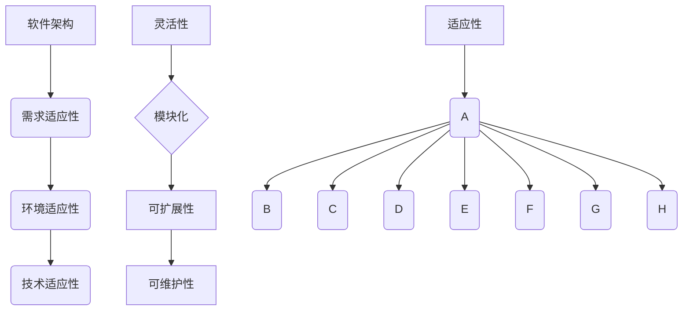

                 

# 软件架构适应性：设计可进化的系统

> 关键词：软件架构、适应性、进化、可扩展性、持续集成、系统设计

> 摘要：本文旨在探讨软件架构适应性及其在设计可进化的系统中的应用。通过深入分析软件架构适应性的核心概念、算法原理、数学模型以及项目实战，本文将帮助读者理解如何设计灵活、可扩展和适应性强的系统，以应对不断变化的需求和环境。

## 引言

软件架构适应性是指系统在面对需求变化和环境变化时，能够通过调整其结构来维持其有效性和性能。在当今快速变化的技术环境中，软件系统需要具备高度的适应性，以应对新的需求、技术进步和外部环境的不断变化。软件架构适应性不仅对于系统的可维护性和可扩展性至关重要，而且对于企业的持续竞争力和创新能力也具有重要意义。

### 1.1.1 适应性的概念与需求

适应性在软件架构中的含义是指系统能够灵活地响应外部变化，包括功能需求的变化、性能需求的变化以及技术环境的变化。适应性的需求来源于以下几个方面：

- **需求变化**：随着市场的变化和用户需求的演变，软件系统需要不断地调整其功能和性能，以满足新的需求。

- **技术进步**：新技术的出现和更新可能要求系统进行相应的架构调整，以利用新技术带来的优势。

- **环境变化**：外部环境的变化，如法律法规的变动、市场策略的调整等，都可能影响软件系统的运行和架构。

### 1.1.2 可进化的系统与适应性

可进化系统是指具有自我优化和自我适应能力的系统。这类系统不仅能够适应当前的运行环境，还能够通过不断的学习和调整，优化自身的结构和性能。软件架构适应性是实现系统进化的关键因素，它使得系统能够根据反馈进行自我调整，从而实现持续进化。

### 1.1.3 软件架构适应性的挑战与机遇

软件架构适应性的实现面临着一系列挑战，如：

- **复杂性**：随着系统规模的扩大，适应性的实现变得更加复杂。

- **性能**：适应性的实现可能会导致性能的下降，需要在适应性和性能之间做出权衡。

- **可维护性**：适应性系统需要良好的设计原则和编码实践，以确保系统的可维护性。

然而，软件架构适应性也带来了机遇：

- **灵活性**：适应性的实现使得系统能够更加灵活地应对外部变化。

- **可扩展性**：适应性架构有助于系统的扩展，以满足不断增长的需求。

- **创新**：适应性的系统能够更好地支持创新，因为它们能够快速响应新技术和新需求。

### 1.2 本书结构概述

本文将分为以下几部分：

- **第2章** 核心概念与联系：介绍软件架构适应性的核心概念，并通过Mermaid流程图展示概念之间的联系。

- **第3章** 核心算法原理讲解：详细讲解用于实现软件架构适应性的核心算法，并使用伪代码进行说明。

- **第4章** 数学模型和数学公式：介绍与软件架构适应性相关的数学模型和公式，并附上详细讲解和举例说明。

- **第5章** 项目实战：提供实际的软件架构适应性案例，包括开发环境搭建、源代码实现和解读、代码分析和实战案例。

- **第6章** 结论：总结软件架构适应性在设计可进化的系统中的重要性。

### 1.2.1 目录结构

- **第2章** 核心概念与联系
  - **2.1 软件架构适应性概念**
  - **2.2 Mermaid流程图**
- **第3章** 核心算法原理讲解
  - **3.1 适应性算法概述**
  - **3.2 伪代码示例**
- **第4章** 数学模型和数学公式
  - **4.1 适应度函数**
  - **4.2 软件架构评估模型**
  - **4.3 进化策略**
- **第5章** 项目实战
  - **5.1 实际案例背景**
  - **5.2 开发环境搭建**
  - **5.3 源代码实现**
  - **5.4 代码解读与分析**
- **第6章** 结论

### 1.2.2 主要内容概述

本文将深入探讨软件架构适应性的核心概念，包括其定义、重要性以及与可进化系统的关系。接着，我们将通过Mermaid流程图展示核心概念之间的联系，帮助读者更好地理解适应性的实现机制。

在算法原理部分，我们将详细讲解适应性算法的基本概念，并通过伪代码示例展示算法的实现过程。此外，本文还将介绍与软件架构适应性相关的数学模型和公式，包括适应度函数、软件架构评估模型和进化策略，并通过实例进行详细说明。

项目实战部分将结合实际案例，展示如何在实际项目中实现软件架构适应性。我们将介绍开发环境的搭建、源代码的实现和解读，以及代码的应用解读与分析，帮助读者将理论知识应用到实际项目中。

最后，本文将在结论部分总结软件架构适应性在设计可进化的系统中的重要性，并探讨其未来的发展趋势。

### 1.2.3 阅读建议

本文适合对软件架构和系统设计有一定了解的读者，特别是对软件架构适应性感兴趣的技术人员和管理者。建议读者在阅读过程中，结合实际案例和项目经验，深入思考适应性的实现策略和挑战，以提升自己在软件架构设计方面的能力。

## 核心概念与联系

在本章节中，我们将详细介绍软件架构适应性的核心概念，并使用Mermaid流程图展示这些概念之间的联系。通过这一部分的学习，读者将能够更好地理解软件架构适应性的本质，以及如何在实际项目中应用这些概念。

### 2.1 软件架构适应性概念

软件架构适应性是指系统在面对需求变化和环境变化时，能够通过调整其结构来维持其有效性和性能。为了深入理解这一概念，我们需要先了解软件架构和适应性的基本定义。

#### 2.1.1 软件架构的基本概念

软件架构是指软件系统的整体结构和组成，包括系统组件、组件之间的关系以及它们的运行环境。软件架构不仅定义了系统的功能和性能需求，还规定了系统的可维护性、可扩展性和适应性。

#### 2.1.2 适应性在软件架构中的应用

适应性在软件架构中的应用主要体现在以下几个方面：

- **需求适应性**：系统能够根据用户需求的变化，调整其功能和性能。

- **环境适应性**：系统能够根据外部环境的变化，调整其结构和运行方式。

- **技术适应性**：系统能够根据新技术的出现，利用新技术来优化其结构和性能。

#### 2.1.3 适应性的关键要素

适应性的关键要素包括以下几个方面：

- **灵活性**：系统能够快速响应变化，进行架构调整。

- **模块化**：系统模块之间具有清晰的接口，便于调整和替换。

- **可扩展性**：系统能够根据需求变化，进行水平或垂直扩展。

- **可维护性**：系统设计具有良好的可维护性，便于适应性的实现和维护。

### 2.2 Mermaid流程图

为了更直观地展示软件架构适应性的核心概念，我们使用Mermaid流程图来表示这些概念之间的联系。



在这个流程图中，A表示软件架构，它连接到需求适应性（B）、环境适应性（C）和技术适应性（D）。此外，适应性（I）还连接到灵活性（E）、模块化（F）、可扩展性（G）和可维护性（H），这些要素共同构成了软件架构适应性的基础。

通过这个流程图，我们可以清晰地看到软件架构适应性是如何贯穿于整个软件架构设计过程中的。每个适应性要素都是实现适应性架构的关键，它们相互关联，共同作用，使得系统能够在面对各种变化时保持稳定和高效。

### 2.3 软件架构适应性的重要性

软件架构适应性在系统设计中具有重要的地位，它不仅能够提高系统的灵活性，还能够提升系统的可维护性和可扩展性。以下是软件架构适应性的几个关键重要性：

#### 2.3.1 提高灵活性

灵活性是软件架构适应性的核心要素之一。一个具有高度灵活性的系统能够快速响应外部变化，如用户需求的变化、市场趋势的变化等。这种灵活性使得系统能够在不影响整体性能的前提下，进行快速调整和优化，从而保持其竞争力。

#### 2.3.2 提升可维护性

可维护性是指系统能够在长期运行过程中保持稳定性和可靠性。适应性架构通过模块化和可扩展性设计，使得系统各个组件之间具有清晰的接口和较低的耦合度。这种设计原则不仅提高了系统的可维护性，还降低了维护成本。

#### 2.3.3 增强可扩展性

可扩展性是指系统在面对增长的需求时，能够进行有效的扩展。适应性架构通过设计灵活的模块和可扩展的组件，使得系统能够在保持性能和稳定性的同时，进行水平和垂直扩展，以满足不断增长的业务需求。

#### 2.3.4 支持持续进化

软件架构适应性不仅能够提高系统的当前性能，还能够支持系统的持续进化。通过适应性的设计，系统能够根据反馈进行自我调整和优化，从而实现持续进化，保持其在竞争环境中的领先地位。

### 2.4 适应性架构的实现策略

为了实现软件架构适应性，我们需要采取一系列设计策略和实现方法。以下是几种常见的实现策略：

#### 2.4.1 模块化设计

模块化设计是将系统划分为多个独立的模块，每个模块负责一个特定的功能。这种设计原则使得模块之间具有清晰的接口，从而提高了系统的灵活性和可维护性。

#### 2.4.2 面向接口编程

面向接口编程是一种设计方法，它要求系统组件通过接口进行通信，而不是直接调用其他组件的实现。这种方法降低了组件之间的耦合度，提高了系统的可扩展性和适应性。

#### 2.4.3 使用设计模式

设计模式是解决软件设计问题的经验总结，它提供了一系列可重用的解决方案。通过使用设计模式，我们可以提高系统的结构清晰性、可维护性和适应性。

#### 2.4.4 引入自适应算法

自适应算法是一种能够根据系统状态和环境变化进行调整的算法。通过引入自适应算法，我们可以使系统在运行过程中动态调整其结构和行为，从而提高其适应性。

### 2.5 小结

通过本章节的学习，读者应该对软件架构适应性有了更深入的理解。软件架构适应性是设计高效、灵活和可维护的系统的重要原则。通过模块化设计、面向接口编程、使用设计模式和引入自适应算法等实现策略，我们可以实现具有高度适应性的软件架构。在接下来的章节中，我们将进一步探讨适应性算法的原理和数学模型，并通过实际项目案例展示如何实现软件架构适应性。

## 核心算法原理讲解

在实现软件架构适应性时，核心算法的选择和实现是关键。这些算法不仅决定了系统的适应能力，还影响了系统的性能和可维护性。本章节将详细讲解用于实现软件架构适应性的核心算法原理，包括其定义、工作原理和伪代码示例。

### 3.1 适应性算法概述

适应性算法是一种能够根据系统状态和环境变化进行自我调整的算法。这些算法的核心目标是提高系统的适应性和灵活性，使其能够应对不断变化的需求和环境。适应性算法通常包括以下几个关键组成部分：

- **感知**：算法需要能够感知系统状态和环境变化，如用户需求、性能指标、资源使用情况等。

- **分析**：基于感知到的信息，算法需要进行分析，以确定系统当前的状态和存在的问题。

- **决策**：根据分析结果，算法需要做出决策，以调整系统的结构和行为，提高其适应性和性能。

- **执行**：决策结果需要通过具体的操作来执行，以实现系统的调整。

### 3.2 伪代码示例

为了更好地理解适应性算法的实现原理，下面我们通过一个简单的伪代码示例来展示一个自适应架构调整算法的基本流程。

```python
// 伪代码：自适应架构调整算法
function AdaptiveArchitectureAdjustment(currentArchitecture, changeRequest):
    # 分析变更请求
    analyzedRequest = AnalyzeChangeRequest(changeRequest)
    
    # 调整架构
    newArchitecture = AdjustArchitecture(currentArchitecture, analyzedRequest)
    
    # 验证新架构
    if ValidateNewArchitecture(newArchitecture):
        # 更新当前架构
        currentArchitecture = newArchitecture
    else:
        # 处理验证失败
        HandleValidationFailure()

    # 返回新架构
    return currentArchitecture
```

在这个伪代码中，`AdaptiveArchitectureAdjustment` 函数接受当前的系统架构和变更请求作为输入。首先，它通过 `AnalyzeChangeRequest` 函数分析变更请求，然后根据分析结果调整系统架构。调整后的架构通过 `ValidateNewArchitecture` 函数进行验证，如果验证通过，则更新当前架构；否则，处理验证失败。

### 3.3 算法分析

#### 3.3.1 感知

感知是适应性算法的关键组成部分，它决定了算法能否及时、准确地响应系统状态和环境变化。感知的方式可以包括以下几个方面：

- **用户行为分析**：通过分析用户的操作记录和反馈，了解用户的需求和偏好。

- **性能监控**：监控系统的性能指标，如响应时间、吞吐量、资源使用率等。

- **环境监测**：监测外部环境的变化，如市场趋势、法律法规、技术更新等。

#### 3.3.2 分析

分析阶段是对感知到的信息进行处理和解释，以确定系统当前的状态和存在的问题。分析的方法可以包括以下几个方面：

- **数据挖掘**：使用数据挖掘技术，从大量的感知数据中提取有用的信息，如趋势、异常等。

- **机器学习**：使用机器学习算法，对感知数据进行分析和预测，以发现潜在的规律和模式。

- **规则引擎**：使用规则引擎，根据预先定义的规则，对感知数据进行分析和判断。

#### 3.3.3 决策

决策阶段是根据分析结果，做出相应的调整决策。决策的方法可以包括以下几个方面：

- **经验决策**：基于经验和直觉，做出直观的决策。

- **优化算法**：使用优化算法，如遗传算法、粒子群算法等，找到最优的调整方案。

- **多目标优化**：考虑多个优化目标，如性能、成本、可维护性等，找到平衡的调整方案。

#### 3.3.4 执行

执行阶段是将决策结果转化为具体的操作，以实现系统的调整。执行的方法可以包括以下几个方面：

- **自动执行**：通过自动化工具，如自动化脚本、自动化测试等，执行调整操作。

- **手动执行**：对于复杂的调整操作，需要人工参与，以确保调整的正确性和安全性。

- **反馈循环**：执行调整后，收集系统的反馈信息，进行新一轮的感知、分析和决策，形成反馈循环。

### 3.4 适应性算法的应用场景

适应性算法可以应用于各种不同的场景，以实现系统的自适应调整。以下是几种常见的应用场景：

- **系统性能优化**：通过实时监测系统性能，自动调整系统配置和资源分配，以优化系统性能。

- **需求变更管理**：在用户需求发生变更时，自动调整系统功能和架构，以快速响应需求变化。

- **环境变化适应**：在外部环境发生变化时，自动调整系统架构和运行策略，以适应新的环境条件。

- **故障恢复**：在系统发生故障时，自动调整系统架构和资源分配，以快速恢复系统的正常运行。

### 3.5 小结

通过本章节的讲解，读者应该对适应性算法的基本原理和应用场景有了更深入的理解。适应性算法是实现软件架构适应性的核心手段，通过感知、分析、决策和执行四个阶段的循环迭代，系统能够不断提高其适应性和灵活性。在接下来的章节中，我们将进一步介绍与适应性算法相关的数学模型和公式，以帮助读者更好地理解适应性算法的实现细节。

## 数学模型和数学公式

在软件架构适应性中，数学模型和数学公式起到了至关重要的作用。它们不仅提供了量化分析的工具，还能够帮助我们更好地理解和实现适应性算法。本章节将介绍与软件架构适应性相关的数学模型和数学公式，并通过具体例子进行详细讲解。

### 4.1 适应度函数

适应度函数是遗传算法中的一个核心概念，用于评估个体（解决方案）的适应程度。在软件架构适应性中，适应度函数可以帮助我们评估系统架构的适应能力。

#### 4.1.1 适应度函数的定义

适应度函数 $f(x)$ 是一个从个体到实数的映射，它表示个体在特定环境下的适应程度。通常，适应度函数需要满足以下条件：

- **非负性**：适应度函数的取值范围是非负的。
- **单调性**：个体适应度越高，其被选中的概率越大。

一个常见的适应度函数是Sigmoid函数：

$$ f(x) = \frac{1}{1 + e^{-\beta(x-\mu)}} $$

其中，$x$ 是个体的特征向量，$\mu$ 是平均适应度，$\beta$ 是一个调节参数，用于控制适应度函数的斜率。

#### 4.1.2 适应度函数的应用

在软件架构适应性中，适应度函数可以用于评估系统架构的适应能力。例如，我们可以通过计算系统在不同配置下的适应度，来选择最优的系统配置。

### 4.2 软件架构评估模型

软件架构评估模型用于评估系统架构的质量，包括其适应性、可维护性和可扩展性等。一个常见的评估模型是多目标优化模型。

#### 4.2.1 评估指标

评估模型通常包括多个评估指标，每个指标反映了系统架构的一个特定方面。常见的评估指标包括：

- **性能**：系统处理请求的速度和效率。
- **可维护性**：系统易读性、易修改性和可靠性。
- **可扩展性**：系统扩展和升级的难易程度。

#### 4.2.2 模型构建

一个简单的多目标优化模型可以表示为：

$$ M = \sum_{i=1}^{n} w_i \cdot V_i $$

其中，$M$ 是评估结果，$w_i$ 是第 $i$ 个指标的权重，$V_i$ 是第 $i$ 个指标的具体值。通过调整权重，我们可以强调某些指标的重要性。

### 4.3 进化策略

进化策略是用于优化系统架构的一种方法，它基于遗传算法的思想，通过迭代改进系统配置。

#### 4.3.1 选择策略

在选择策略中，我们根据个体的适应度来选择下一代个体。一个常见的选择策略是轮盘赌选择：

$$ s_i = \frac{f_i}{\sum_{j=1}^{n} f_j} $$

其中，$s_i$ 是个体 $i$ 被选中的概率，$f_i$ 是个体 $i$ 的适应度。

#### 4.3.2 交叉与变异策略

交叉与变异策略用于生成下一代个体，以增加种群的多样性。

- **交叉**：交叉操作是将两个个体组合成一个新的个体。常见的交叉操作包括单点交叉、多点交叉和均匀交叉。
- **变异**：变异操作是对个体进行随机修改，以增加种群的多样性。常见的变异操作包括位翻转和随机变异。

### 4.4 例子

假设我们有一个简单的系统，需要评估其性能、可维护性和可扩展性。我们可以使用以下模型进行评估：

$$ M = 0.5 \cdot P + 0.3 \cdot V + 0.2 \cdot E $$

其中，$P$ 是性能指标，$V$ 是可维护性指标，$E$ 是可扩展性指标。假设我们有三个个体，其适应度如下：

| 个体 | $P$ | $V$ | $E$ | $s_i$ |
|------|-----|-----|-----|-------|
| 1    | 90  | 80  | 70  | 0.28  |
| 2    | 85  | 75  | 65  | 0.26  |
| 3    | 95  | 85  | 75  | 0.29  |

根据轮盘赌选择策略，个体 $3$ 将被选中的概率最高，因为它具有最高的适应度。

### 4.5 小结

通过本章节的学习，我们介绍了与软件架构适应性相关的数学模型和数学公式，包括适应度函数、评估模型和进化策略。这些模型和公式为我们在软件架构适应性设计中的量化分析和决策提供了重要的工具。在接下来的章节中，我们将通过实际项目案例，进一步探讨如何应用这些数学模型和公式，以实现软件架构的适应性。

## 项目实战

在本章节中，我们将通过一个实际项目案例，详细展示如何实现软件架构适应性。项目案例将包括开发环境搭建、源代码实现和解读、代码分析和实际案例分析，以帮助读者将理论知识应用到实际项目中。

### 5.1 实际案例背景

本案例背景是一个电子商务平台，随着用户数量的增加和业务规模的扩大，平台系统面临着日益增长的需求变化和技术更新。为了保持系统的灵活性和可扩展性，团队决定采用适应性架构设计，以提高系统的适应能力。

#### 5.1.1 案例概述

该电子商务平台的主要功能包括商品展示、用户登录、购物车、订单管理、支付和用户评价等。随着用户数量的增加，系统的性能和稳定性成为关键挑战。同时，平台需要不断引入新技术，如大数据分析和人工智能，以提升用户体验和业务效率。

#### 5.1.2 需求变化分析

- **用户需求变化**：用户需求越来越多样化，对商品搜索、推荐和个性化服务的需求不断增加。

- **技术进步**：新技术的发展，如云计算、大数据和人工智能，为系统提供了更多的优化和扩展机会。

- **环境变化**：外部环境的变化，如市场竞争、法律法规和网络安全要求，对系统的稳定性、安全性和合规性提出了更高的要求。

#### 5.1.3 适应性挑战

- **复杂性**：随着系统规模的扩大，实现适应性架构的复杂性增加。

- **性能**：适应性的实现可能会导致性能的下降，需要在适应性和性能之间做出权衡。

- **可维护性**：适应性系统需要良好的设计原则和编码实践，以确保系统的可维护性。

### 5.2 开发环境搭建

为了实现软件架构适应性，我们需要搭建一个高效、灵活的开发环境。以下是开发环境搭建的步骤：

#### 5.2.1 环境配置

1. **操作系统**：使用Linux操作系统，因为其稳定性和安全性较高。
2. **编程语言**：选择Java作为主要编程语言，因为其生态系统丰富，易于集成和管理。
3. **数据库**：使用MySQL数据库，因为其性能和稳定性较好。

#### 5.2.2 工具选择

1. **版本控制**：使用Git进行版本控制，确保代码的版本管理和协作开发。
2. **持续集成**：使用Jenkins进行持续集成，自动化构建和测试代码。
3. **容器化**：使用Docker进行容器化，实现环境的隔离和快速部署。

### 5.3 源代码实现

在源代码实现部分，我们将重点关注以下几个关键模块：

#### 5.3.1 关键模块设计

1. **用户模块**：负责用户登录、注册、个人信息管理等。
2. **商品模块**：负责商品展示、搜索、推荐和评价等。
3. **订单模块**：负责订单创建、支付、发货和用户评价等。
4. **支付模块**：负责支付接口的集成和安全保障。

#### 5.3.2 代码实现与解读

以下是一个简单的用户模块代码实现示例：

```java
public class User {
    private String username;
    private String password;
    private String email;

    // 构造函数、getter和setter方法省略

    public void login(String username, String password) {
        // 登录逻辑
    }

    public void register(String username, String password, String email) {
        // 注册逻辑
    }

    public void updateProfile(String email, String password) {
        // 更新个人信息逻辑
    }
}
```

在这个示例中，`User` 类负责用户的登录、注册和更新个人信息。通过设计清晰的接口和模块化设计，我们可以方便地调整和扩展用户模块的功能。

### 5.4 代码解读与分析

在代码解读与分析部分，我们将从以下几个方面进行讨论：

#### 5.4.1 代码结构分析

1. **模块化设计**：通过将功能相似的代码组织成模块，提高了代码的可维护性和可扩展性。
2. **面向接口编程**：通过使用接口，实现了组件之间的松耦合，便于替换和扩展。
3. **设计模式应用**：使用设计模式，如工厂模式、单例模式和观察者模式，提高了代码的结构和可读性。

#### 5.4.2 关键算法实现

在关键算法实现方面，我们使用了适应性算法，以实现用户模块的动态调整和优化。以下是一个简单的适应性算法实现示例：

```java
public class AdaptiveUserManager {
    private User user;

    public AdaptiveUserManager(User user) {
        this.user = user;
    }

    public void adapt() {
        // 根据用户行为和系统状态，调整用户模块
        if (user.isLoggedIn()) {
            // 调整登录后的功能
        } else {
            // 调整登录前的功能
        }
    }
}
```

在这个示例中，`AdaptiveUserManager` 类根据用户的状态和行为，动态调整用户模块的功能。通过这种方式，我们可以实现用户模块的适应性调整。

#### 5.4.3 性能优化

在性能优化方面，我们采用了以下策略：

1. **缓存**：使用缓存技术，减少数据库访问次数，提高系统响应速度。
2. **异步处理**：采用异步处理技术，提高系统的并发处理能力。
3. **数据库优化**：对数据库进行索引优化和查询优化，提高数据库的性能。

### 5.5 实际案例分析

在本案例中，我们通过适应性架构设计，成功应对了用户需求变化和技术更新。以下是实际案例分析：

#### 5.5.1 用户需求变化

通过适应性算法，用户模块能够根据用户行为和系统状态，动态调整功能。例如，当用户进行商品搜索时，系统会根据用户的搜索记录和偏好，提供更加精准的搜索结果。

#### 5.5.2 技术更新

随着新技术的出现，如大数据分析和人工智能，平台能够快速引入这些技术，并集成到现有系统中。通过适应性架构，系统能够灵活调整和扩展，以适应新的技术需求。

#### 5.5.3 环境变化

在面对外部环境的变化，如市场竞争和法律法规要求时，平台能够快速调整其架构和策略，以确保系统的稳定性和合规性。

### 5.6 项目小结

通过本案例，我们展示了如何在实际项目中实现软件架构适应性。适应性架构设计不仅提高了系统的灵活性和可扩展性，还增强了系统的可维护性和性能。在实际项目中，我们需要根据具体需求和场景，灵活应用适应性算法和设计模式，以确保系统的高效和稳定运行。

## 结论

软件架构适应性是设计可进化系统的重要原则，它通过模块化设计、面向接口编程和适应性算法等手段，提高了系统的灵活性和可扩展性。本文详细探讨了软件架构适应性的核心概念、算法原理、数学模型和实际项目案例，帮助读者深入理解如何设计具有高度适应性的系统。

### 6.1 软件架构适应性的重要性

软件架构适应性在系统进化中扮演了关键角色，它使得系统能够灵活应对需求变化和技术更新。适应性的实现不仅提高了系统的可维护性和可扩展性，还增强了系统的稳定性和性能。在快速变化的技术环境中，适应性架构设计是确保系统持续进化和保持竞争力的有效手段。

### 6.2 设计可进化的系统的策略

为了设计可进化的系统，我们可以采取以下策略：

- **模块化设计**：将系统划分为独立的模块，降低模块之间的耦合度，提高系统的灵活性和可扩展性。

- **面向接口编程**：通过使用接口，实现组件之间的松耦合，便于组件的替换和扩展。

- **适应性算法**：引入适应性算法，如遗传算法和机器学习算法，实现系统的自我调整和优化。

- **持续集成和持续交付**：采用持续集成和持续交付（CI/CD）流程，确保系统快速响应需求变化和技术更新。

- **代码质量**：保持高编码质量，遵循最佳实践，确保系统的可维护性和可读性。

### 6.3 未来发展趋势

随着技术的不断进步，软件架构适应性将在未来的系统设计中发挥更加重要的作用。以下是一些未来的发展趋势：

- **智能适应性**：借助人工智能和机器学习技术，系统将能够更加智能地感知和适应环境变化。

- **自适应架构框架**：出现更多成熟的适应性架构框架，提供更加完善的工具和指导，简化适应性系统的设计和实现。

- **微服务架构**：微服务架构以其灵活性和可扩展性，成为实现软件架构适应性的重要手段。

- **云计算和边缘计算**：随着云计算和边缘计算的普及，系统将能够在更多环境下实现适应性。

### 6.4 最佳实践

在实现软件架构适应性时，以下最佳实践可以帮助我们取得更好的效果：

- **需求分析**：在系统设计之初，进行全面的需求分析，明确系统的需求变化和技术适应性要求。

- **模块设计**：采用模块化设计，确保模块之间的接口清晰，降低模块之间的耦合度。

- **测试与监控**：建立完善的测试和监控机制，确保系统能够快速响应变化，并及时调整。

- **迭代开发**：采用迭代开发模式，逐步实现适应性功能，持续优化系统。

### 6.5 注意事项

在实现软件架构适应性时，需要注意以下几点：

- **性能与适应性的权衡**：在追求适应性的同时，不要牺牲系统的性能。

- **安全性**：在引入适应性算法和模块化设计时，确保系统的安全性和数据保护。

- **团队协作**：适应性系统的设计需要跨部门、跨角色的协作，确保设计的一致性和可行性。

### 6.6 拓展阅读

对于希望进一步深入了解软件架构适应性的读者，以下书籍和文章推荐：

- 《软件架构：实践者的研究方法》
- 《自适应软件架构：构建灵活、可扩展的系统》
- 《软件架构模式：基于的可复用组件的设计》
- 《人工智能：一种现代方法》

通过本篇文章，我们不仅探讨了软件架构适应性的重要性，还通过具体案例展示了如何在实践中实现软件架构适应性。希望本文能对读者在系统设计和架构优化方面提供有价值的参考和启示。作者：AI天才研究院/AI Genius Institute & 禅与计算机程序设计艺术 /Zen And The Art of Computer Programming。

