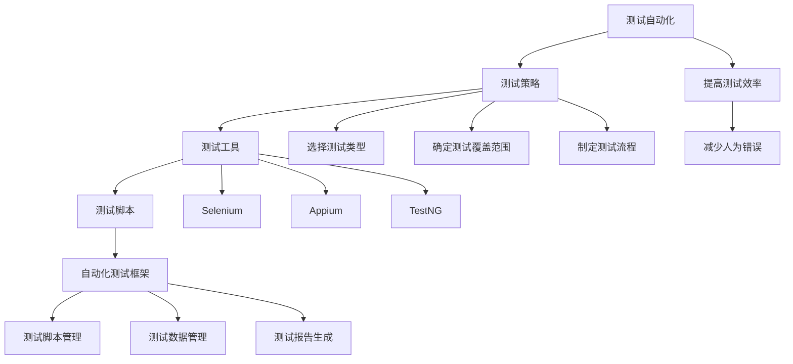

                 

### 测试自动化策略

在制定测试自动化策略时，我们需要考虑以下几个关键步骤：

**1. 背景分析**

首先，我们需要对现有测试流程进行分析，了解当前的测试过程、测试工具和方法。这包括测试的频率、测试的范围、测试的覆盖率、测试的效率和测试的质量等。

**2. 目标确定**

接下来，我们需要明确自动化测试的目标。目标可以是提高测试效率、减少测试时间、提高测试覆盖率、降低测试成本等。这些目标应该与项目整体目标和业务需求相一致。

**3. 自动化测试类型的选择**

自动化测试类型的选择取决于软件的特点和测试需求。常见的自动化测试类型包括功能测试、性能测试、安全测试、接口测试等。我们需要根据测试需求选择适合的测试类型。

**4. 自动化工具的选择**

选择合适的自动化测试工具是关键步骤。常见的自动化测试工具有Selenium、Appium、TestNG等。我们需要根据测试类型、测试环境和测试需求来选择合适的工具。

**5. 测试脚本设计**

测试脚本设计是自动化测试的核心。我们需要设计高质量的测试脚本，确保测试脚本能够准确地模拟用户操作，并验证系统的功能。测试脚本的设计原则包括可读性、可维护性、可扩展性和可重用性。

**6. 测试数据管理**

测试数据管理是自动化测试的重要组成部分。我们需要设计合适的测试数据管理策略，包括测试数据生成、存储、处理和清理等。测试数据管理策略应该确保测试数据的完整性和一致性。

**7. 测试执行与监控**

在测试执行过程中，我们需要监控测试进度和测试结果。这包括测试执行环境的配置、测试脚本的执行、测试结果的收集和测试失败的调试等。通过监控，我们可以及时发现和解决问题，确保测试的顺利进行。

**8. 测试报告生成**

测试报告生成是测试结束后的重要环节。我们需要生成详细的测试报告，包括测试覆盖率、测试结果、测试失败原因等。测试报告应该能够清晰地展示测试结果，为项目决策提供依据。

**9. 测试自动化流程优化**

在测试自动化实施过程中，我们需要不断地优化测试流程。这包括测试策略的调整、测试工具的升级、测试脚本的优化等。通过优化，我们可以进一步提高测试效率和测试质量。

通过以上步骤，我们可以制定一个全面的测试自动化策略，确保自动化测试能够有效地提高测试效率、降低测试成本、确保软件质量。接下来，我们将详细讨论测试自动化的核心概念，包括测试策略、自动化测试工具的选择、测试脚本设计、测试数据管理等内容。

### 核心概念与联系

在《软件测试自动化：策略、工具与最佳实践》一书中，核心概念包括测试自动化、测试策略、测试工具、测试脚本、自动化测试框架等。这些概念之间有着紧密的联系，构成了软件测试自动化的基础。

- **测试自动化**：测试自动化是指使用软件工具代替人工执行测试活动的过程。它能够提高测试的效率和准确性，减少人为错误。

- **测试策略**：测试策略是制定测试目标和计划的过程，包括选择测试类型、确定测试覆盖范围、制定测试流程等。

- **测试工具**：测试工具是执行自动化测试的软件，如Selenium、Appium、TestNG等。它们提供了多种功能，包括测试脚本编写、执行、报告生成等。

- **测试脚本**：测试脚本是一系列命令或指令，用于模拟用户操作并验证系统功能。脚本编写是自动化测试的关键步骤。

- **自动化测试框架**：自动化测试框架是一个结构化的测试解决方案，包括测试脚本管理、测试数据管理、测试报告生成等。框架能够提高测试的可维护性和可扩展性。

为了更好地理解这些概念之间的关系，我们可以使用Mermaid流程图来展示它们之间的联系。



在图1中，我们可以看到测试自动化是整体目标，测试策略指导测试工作，测试工具和测试脚本实现具体的测试活动，而自动化测试框架则为整个测试过程提供结构化和一致性。

### 测试自动化的核心算法原理

在软件测试自动化过程中，核心算法原理起着至关重要的作用。以下是测试自动化的几个核心算法原理及其详细说明：

#### 1. 测试用例设计算法

**原理描述：** 测试用例设计算法是自动化测试的基础，其目标是生成一组有效的测试用例，以全面覆盖系统功能和业务逻辑。

**算法步骤：**
- **需求分析**：首先分析软件的需求文档，确定功能点和业务逻辑。
- **功能划分**：将需求划分为多个功能模块。
- **用例生成**：使用算法生成每个功能模块的测试用例。常见的算法有边界值分析、等价类划分、因果图等。

**伪代码示例：**
```python
function generate_test_cases(function_module):
    test_cases = []
    for input in get_all_inputs(function_module):
        for output in get_all_outputs(function_module):
            test_case = {"input": input, "output": output}
            test_cases.append(test_case)
    return test_cases
```

#### 2. 测试脚本执行算法

**原理描述：** 测试脚本执行算法用于模拟用户操作并验证系统功能。其核心是按照预定的步骤执行操作，并记录结果。

**算法步骤：**
- **初始化**：设置测试环境，准备测试数据。
- **执行操作**：按照测试脚本中的步骤进行操作。
- **结果验证**：对比实际结果和预期结果，判断测试通过或失败。
- **报告生成**：生成测试报告，记录测试结果和失败原因。

**伪代码示例：**
```python
function execute_test_script(test_script):
    initialize_environment()
    for step in test_script.steps:
        execute_operation(step)
        result = verify_result(step)
        if not result:
            report_failure(step)
    generate_report()
```

#### 3. 测试数据管理算法

**原理描述：** 测试数据管理算法用于生成、存储、处理和清理测试数据，确保测试数据的完整性和一致性。

**算法步骤：**
- **数据生成**：根据测试需求生成测试数据。
- **数据存储**：将测试数据存储在数据库或文件中。
- **数据处理**：对测试数据进行预处理，如清洗、转换等。
- **数据清理**：测试完成后清理测试数据，释放资源。

**伪代码示例：**
```python
function manage_test_data(test_data):
    generate_data()
    store_data(data)
    preprocess_data(data)
    after_test_cleanup(data)
```

#### 4. 测试结果分析算法

**原理描述：** 测试结果分析算法用于分析测试结果，识别潜在的问题和缺陷。

**算法步骤：**
- **结果收集**：收集测试执行过程中产生的结果数据。
- **结果分析**：对结果数据进行分析，识别异常和失败。
- **报告生成**：生成分析报告，提供问题定位和改进建议。

**伪代码示例：**
```python
function analyze_test_results(test_results):
    collect_results()
    for result in test_results:
        if result.failed:
            identify_issue(result)
    generate_analysis_report()
```

通过上述核心算法原理，我们可以实现自动化测试的各个阶段，确保测试过程的高效性和准确性。在实际应用中，这些算法可以根据具体需求进行调整和优化，以适应不同的测试场景和项目需求。

### 测试自动化工具详解

在《软件测试自动化：策略、工具与最佳实践》一书中，测试自动化工具的选择和配置是至关重要的环节。以下将详细介绍几种常见的测试自动化工具，包括Selenium、Appium和TestNG，并详细阐述它们的概述、安装与配置方法以及基本使用方法。

#### 1. Selenium

##### 概述

Selenium是一个开源的自动化测试工具，主要用于Web应用的自动化测试。它支持多种编程语言，如Java、Python、C#等，可以运行在不同的操作系统上，如Windows、Linux和Mac OS。

##### 安装与配置

- **安装Java**：由于Selenium是基于Java开发的，首先需要安装Java。可以从[Oracle官网](https://www.oracle.com/java/technologies/javase-downloads.html)下载并安装Java。

- **安装Selenium**：在命令行中运行以下命令来安装Selenium：
  ```bash
  pip install selenium
  ```

- **配置WebDriver**：下载相应浏览器的WebDriver，并将其添加到系统的PATH环境变量中。例如，对于Chrome浏览器，下载ChromeDriver并添加到PATH。

##### 基本使用方法

以下是一个使用Python编写的基本Selenium测试脚本，用于打开浏览器并访问一个网站：

```python
from selenium import webdriver
from selenium.webdriver.common.by import By

# 创建Chrome浏览器实例
driver = webdriver.Chrome()

# 打开百度网站
driver.get("https://www.baidu.com/")

# 查找并点击百度搜索框
search_box = driver.find_element(By.ID, "kw")
search_box.send_keys("自动化测试")

# 查找并点击搜索按钮
search_button = driver.find_element(By.ID, "su")
search_button.click()

# 关闭浏览器
driver.quit()
```

#### 2. Appium

##### 概述

Appium是一个开源的跨平台自动化测试工具，主要用于移动应用的自动化测试。它支持iOS和Android平台，并且可以同时测试Web、Native和Hybrid应用。

##### 安装与配置

- **安装Node.js**：Appium是基于Node.js开发的，首先需要安装Node.js。可以从[Node.js官网](https://nodejs.org/)下载并安装Node.js。

- **安装Appium**：在命令行中运行以下命令来全局安装Appium：
  ```bash
  npm install -g appium
  ```

- **启动Appium**：在命令行中运行以下命令来启动Appium：
  ```bash
  appium
  ```

##### 基本使用方法

以下是一个使用Java编写的基本Appium测试脚本，用于启动Android应用并执行一些基本操作：

```java
import io.appium.java_client.AppiumDriver;
import io.appium.java_client.android.AndroidElement;
import org.openqa.selenium.By;
import org.openqa.selenium.remote.DesiredCapabilities;

public class AppiumTest {
    public static void main(String[] args) {
        DesiredCapabilities caps = new DesiredCapabilities();
        caps.setCapability("platformName", "Android");
        caps.setCapability("platformVersion", "11");
        caps.setCapability("deviceName", "emulator-5554");
        caps.setCapability("appPackage", "com.android.chrome");
        caps.setCapability("appActivity", "com.google.android.apps.chrome.Main");

        AppiumDriver<AndroidElement> driver = new AppiumDriver<>(new URL("http://127.0.0.1:4723/wd/hub"), caps);

        driver.findElement(By.ID("search_box_text")).sendKeys("Appium");

        driver.quit();
    }
}
```

#### 3. TestNG

##### 概述

TestNG是一个开源的测试框架，主要用于自动化测试。它提供了强大的测试报告生成功能和灵活的测试用例管理能力，广泛用于功能测试和性能测试。

##### 安装与配置

- **安装TestNG**：下载TestNG的JAR文件，并将其添加到项目的构建路径中。

- **编写测试类**：创建一个测试类，并使用TestNG的注解来定义测试方法和测试数据。

##### 基本使用方法

以下是一个使用Java编写的TestNG测试类，用于测试Web应用的功能：

```java
import org.testng.annotations.Test;
import org.testng.annotations.DataProvider;
import org.openqa.selenium.By;
import org.openqa.selenium.WebDriver;
import org.openqa.selenium.chrome.ChromeDriver;

public class TestNGExample {
    private WebDriver driver;

    @Test(dataProvider = "data-provider")
    public void testLogin(String username, String password) {
        // 启动Chrome浏览器
        driver = new ChromeDriver();

        // 打开百度网站
        driver.get("https://www.baidu.com/");

        // 查找并输入用户名和密码
        driver.findElement(By.ID("user-name")).sendKeys(username);
        driver.findElement(By.ID("password")).sendKeys(password);

        // 点击登录按钮
        driver.findElement(By.ID("login-button")).click();

        // 断言登录成功
        String expected = "Welcome";
        String actual = driver.findElement(By.tagName("h1")).getText();
        Assert.assertEquals(actual, expected);

        // 关闭浏览器
        driver.quit();
    }

    @DataProvider(name = "data-provider")
    public Object[][] testData() {
        return new Object[][] {
            {"standard_user", "secret_sauce"},
            {"problem_user", "secret_sauce"}
        };
    }
}
```

通过以上介绍，我们可以看到Selenium、Appium和TestNG各有其独特的优势和适用场景。在实际应用中，可以根据项目需求和测试目标选择合适的工具，并对其进行适当的配置，以实现高效、准确的自动化测试。

### 自动化测试脚本编写

自动化测试脚本是实现自动化测试的核心组成部分，其编写质量直接影响到测试的效率和结果。以下是自动化测试脚本编写过程中需要注意的关键要素：

#### 1. 脚本语言选择

选择合适的脚本语言是编写自动化测试脚本的第一步。常见的脚本语言包括Python、Java、C#、Ruby等。每种语言都有其优势和劣势，选择时应考虑以下几个方面：

- **易用性**：对于没有编程基础的人来说，Python和Ruby可能更易上手。
- **性能**：Java和C#在性能方面表现较好，适合复杂和性能要求高的自动化测试。
- **社区支持**：Python和Java有庞大的社区支持，可以方便地获取资源和帮助。

#### 2. 脚本结构设计

一个良好的脚本结构能够提高代码的可读性、可维护性和可扩展性。以下是一个自动化测试脚本的基本结构：

```python
import unittest
from selenium import webdriver

class TestCase(unittest.TestCase):
    def setUp(self):
        # 初始化浏览器
        self.driver = webdriver.Chrome()

    def test_case_1(self):
        # 测试用例1的执行逻辑
        self.driver.get("https://www.example.com")
        # 执行具体操作并验证结果

    def test_case_2(self):
        # 测试用例2的执行逻辑
        self.driver.get("https://www.example.com")
        # 执行具体操作并验证结果

    def tearDown(self):
        # 关闭浏览器
        self.driver.quit()

if __name__ == "__main__":
    unittest.main()
```

#### 3. 脚本执行流程

自动化测试脚本的执行流程包括以下几个关键步骤：

- **初始化**：设置测试环境，包括启动浏览器、加载测试数据等。
- **执行测试**：按照测试用例的步骤执行操作，如输入数据、点击按钮等。
- **结果验证**：对比实际结果和预期结果，判断测试通过或失败。
- **报告生成**：记录测试结果，生成测试报告。

以下是一个简单的脚本执行流程的伪代码：

```python
function execute_test_case(test_case):
    setup_environment()
    for step in test_case.steps:
        execute_operation(step)
        if not verify_result(step):
            log_failure(step)
    generate_test_report()
    cleanup_environment()
```

#### 4. 脚本调试与优化

编写测试脚本后，调试和优化是必不可少的步骤。以下是一些常用的调试和优化方法：

- **调试**：使用调试工具（如IDE的调试功能）逐步执行脚本，定位和修复问题。
- **日志记录**：在脚本中添加日志记录，便于调试和问题排查。
- **性能优化**：分析脚本执行时间，优化代码以提高性能。例如，减少不必要的等待时间，使用更高效的API等。

- **代码复用**：编写通用函数和模块，避免重复代码，提高脚本的可维护性。

通过上述方法，我们可以编写出高质量的自动化测试脚本，确保测试过程的高效和准确。

### 自动化测试框架搭建

自动化测试框架是提高自动化测试效率和质量的关键组件。一个良好的测试框架能够提供结构化的测试过程、统一的测试数据管理、高效的测试脚本执行和详细的测试报告生成。以下是搭建自动化测试框架的基本步骤和核心组件：

#### 1. 自动化测试框架概述

自动化测试框架是一个基于测试策略和工具的解决方案，用于管理自动化测试的全过程。它包括以下几个核心部分：

- **测试脚本管理**：用于组织、存储和管理测试脚本。
- **测试数据管理**：用于生成、存储和处理测试数据。
- **测试执行管理**：用于执行测试脚本，并监控测试进度。
- **测试报告生成**：用于生成详细的测试报告。

#### 2. 测试数据管理策略

测试数据管理是自动化测试框架的重要组成部分。一个有效的测试数据管理策略应包括以下方面：

- **数据生成**：根据测试需求生成测试数据，确保数据覆盖各种可能的场景。
- **数据存储**：将测试数据存储在数据库或文件中，确保数据的安全和一致性。
- **数据处理**：对测试数据进行预处理，如数据清洗、转换和格式化等。
- **数据清理**：测试完成后清理测试数据，释放存储资源。

#### 3. 测试报告生成

测试报告是测试执行结果的总结和展示，对于项目决策和问题定位具有重要意义。以下是测试报告生成的主要步骤：

- **报告模板设计**：设计测试报告的模板，包括测试结果、错误日志、覆盖率等。
- **数据收集**：在测试执行过程中收集测试结果数据。
- **报告生成**：根据收集的数据和报告模板生成详细的测试报告。
- **报告发布**：将测试报告发布到指定的位置，如服务器或邮件系统。

#### 4. 自动化测试框架的维护与升级

自动化测试框架的维护与升级是确保其持续有效运行的关键。以下是自动化测试框架维护和升级的几个方面：

- **框架更新**：随着测试需求和环境的变化，定期更新测试框架，以适应新的测试需求。
- **脚本维护**：定期审查和优化测试脚本，修复潜在的问题和漏洞。
- **性能优化**：分析测试框架的性能，进行必要的性能优化，如减少等待时间、优化数据库查询等。
- **文档更新**：更新测试框架的文档，包括框架架构、配置和使用说明等。

#### 5. 自动化测试框架示例

以下是一个简单的自动化测试框架示例，包括测试脚本管理、测试数据管理和测试报告生成：

```python
# 测试脚本管理
class TestScriptManager:
    def __init__(self, script_path):
        self.script_path = script_path

    def load_script(self):
        # 加载测试脚本
        pass

    def run_script(self):
        # 执行测试脚本
        pass

# 测试数据管理
class TestDataManager:
    def __init__(self, data_source):
        self.data_source = data_source

    def generate_data(self):
        # 生成测试数据
        pass

    def store_data(self):
        # 存储测试数据
        pass

    def process_data(self):
        # 预处理测试数据
        pass

# 测试报告生成
class TestReportGenerator:
    def __init__(self, report_template):
        self.report_template = report_template

    def generate_report(self, test_results):
        # 生成测试报告
        pass

    def publish_report(self):
        # 发布测试报告
        pass
```

通过上述步骤和组件，我们可以搭建一个高效、稳定的自动化测试框架，为项目的自动化测试提供强有力的支持。在后续的实际案例中，我们将进一步探讨如何应用这个框架进行具体的自动化测试。

### 测试自动化实施策略

在实施测试自动化时，制定合理的策略是确保项目成功的关键。以下步骤将详细说明如何制定测试自动化策略，包括测试自动化规划、测试自动化风险评估、测试自动化团队建设以及测试自动化流程优化。

#### 1. 测试自动化规划

测试自动化规划是实施自动化测试的第一步，它涉及确定自动化测试的范围、目标和时间表。以下是测试自动化规划的关键步骤：

- **需求分析**：分析软件的需求文档，确定需要自动化的测试点，包括功能测试、性能测试、安全测试等。
- **资源评估**：评估现有的资源和技能，确定是否需要招聘新的自动化测试工程师或培训现有人员。
- **工具评估**：评估现有的测试工具，选择最适合项目的自动化测试工具，如Selenium、Appium、TestNG等。
- **时间表制定**：根据项目进度和需求，制定自动化测试的时间表，包括自动化测试的启动、脚本开发、执行和报告等。

#### 2. 测试自动化风险评估

在实施自动化测试时，风险评估是必不可少的环节。以下是一些常见的自动化测试风险及其应对措施：

- **技术风险**：自动化测试工具的技术成熟度和兼容性可能存在问题。应对措施包括选择经过验证的成熟工具，并保持工具的更新。
- **资源风险**：自动化测试需要投入更多的人力和时间，可能影响其他项目的进度。应对措施包括合理分配资源，确保自动化测试与项目其他部分相协调。
- **数据风险**：测试数据的不完整或错误可能影响测试结果。应对措施包括建立完善的测试数据管理策略，确保数据的准确性和完整性。
- **执行风险**：自动化测试脚本在执行过程中可能遇到无法预料的问题。应对措施包括编写可维护、可扩展的测试脚本，并建立完善的错误处理机制。

#### 3. 测试自动化团队建设

成功的自动化测试需要一支专业的团队。以下是如何建设自动化测试团队的建议：

- **人员招聘**：招聘具有自动化测试经验的技术人员，包括自动化测试工程师、测试开发工程师等。
- **技能培训**：对团队成员进行自动化测试工具和编程语言的培训，确保他们具备所需的技能。
- **知识共享**：建立团队的知识管理体系，鼓励成员分享经验和最佳实践。
- **团队协作**：使用团队协作工具，如JIRA、Confluence等，确保团队成员之间的沟通和协作。

#### 4. 测试自动化流程优化

测试自动化流程的优化是提高测试效率和准确性的关键。以下是一些优化建议：

- **持续集成**：将自动化测试集成到持续集成（CI）流程中，确保每次代码提交都自动执行测试。
- **自动化测试管理**：使用自动化测试管理工具，如TestLink、JMeter等，管理测试用例、测试数据和测试报告。
- **脚本优化**：定期审查和优化自动化测试脚本，提高其可读性、可维护性和性能。
- **测试环境管理**：确保测试环境与生产环境的一致性，减少环境差异导致的测试问题。
- **自动化测试监控**：建立自动化测试监控机制，实时跟踪测试进度和结果，及时发现问题并采取措施。

通过以上策略，我们可以制定一个全面、可行的自动化测试计划，为项目的成功实施提供保障。在接下来的案例中，我们将进一步探讨如何在实际项目中应用这些策略。

### 测试自动化案例分析

在实际项目中实施测试自动化可以大大提高测试效率和软件质量。以下将结合两个具体案例——电商平台的自动化测试实践和金融行业的自动化测试实践，详细分析其背景、测试需求分析、测试用例设计、自动化测试工具选择、测试脚本编写与执行过程，并总结其中的经验和教训。

#### 案例一：电商平台的自动化测试实践

##### 案例背景

某知名电商平台，为了应对日益增长的用户量和复杂的功能需求，决定实施自动化测试以提高软件质量和测试效率。电商平台涵盖了商品展示、购物车、订单管理、支付等多个功能模块。

##### 测试需求分析

电商平台的主要测试需求包括：

- **功能测试**：验证商品搜索、购物车、订单管理、支付等核心功能的正确性。
- **性能测试**：评估系统在高并发情况下的响应时间和稳定性。
- **安全测试**：检测系统是否容易受到常见的安全攻击，如SQL注入、跨站脚本攻击等。

##### 测试用例设计

根据测试需求，设计了一系列功能测试用例、性能测试用例和安全测试用例。以下是功能测试用例的一个示例：

- **用例名称**：商品搜索功能测试
- **前提条件**：用户已经登录系统
- **测试步骤**：
  1. 在搜索框中输入关键词
  2. 点击搜索按钮
  3. 验证搜索结果是否包含关键词
  4. 验证搜索结果是否按相关度排序
- **预期结果**：搜索结果包含关键词，并按相关度排序
- **实际结果**：实际搜索结果与预期结果一致

##### 自动化测试工具选择

为了实现电商平台的自动化测试，选择了以下工具：

- **Selenium**：用于Web应用的自动化测试。
- **Appium**：用于移动应用的自动化测试。
- **JMeter**：用于性能测试。
- **OWASP ZAP**：用于安全测试。

##### 测试脚本编写与执行

以下是一个使用Selenium编写的商品搜索功能测试脚本的示例：

```python
from selenium import webdriver
from selenium.webdriver.common.by import By

def test_search_function():
    driver = webdriver.Chrome()
    driver.get("https://www.example.com")
    search_box = driver.find_element(By.ID, "search_box")
    search_button = driver.find_element(By.ID, "search_button")

    search_box.send_keys("iPhone")
    search_button.click()

    results = driver.find_elements(By.CLASS_NAME, "search_result")
    assert "iPhone" in results[0].text
    driver.quit()

if __name__ == "__main__":
    test_search_function()
```

执行该测试脚本，验证商品搜索功能的正确性。通过自动化测试工具，可以快速执行大量测试用例，提高测试覆盖率和效率。

##### 总结

电商平台自动化测试的实施，提高了测试效率，缩短了测试周期，降低了人为错误的风险。主要经验教训包括：

- **前期规划**：明确测试需求和目标，合理分配资源和时间。
- **工具选择**：根据项目需求选择合适的自动化测试工具。
- **脚本编写**：编写高质量的测试脚本，确保其可维护性和可扩展性。

#### 案例二：金融行业的自动化测试实践

##### 案例背景

某大型金融科技公司开发了一款金融交易系统，为了确保系统的稳定性和安全性，决定实施自动化测试。金融交易系统涉及股票交易、基金交易、支付等多个模块，对安全性和性能有很高的要求。

##### 测试需求分析

金融交易系统的主要测试需求包括：

- **功能测试**：验证交易功能、支付功能、用户权限等。
- **性能测试**：评估系统在高并发交易情况下的处理能力和稳定性。
- **安全测试**：检测系统是否容易受到SQL注入、跨站脚本攻击等安全威胁。

##### 测试用例设计

根据测试需求，设计了一系列功能测试用例、性能测试用例和安全测试用例。以下是功能测试用例的一个示例：

- **用例名称**：股票交易功能测试
- **前提条件**：用户已登录系统并持有股票
- **测试步骤**：
  1. 进入股票交易页面
  2. 输入股票代码和交易数量
  3. 点击“买入”按钮
  4. 验证交易结果
- **预期结果**：交易成功，股票持有量增加
- **实际结果**：实际交易结果与预期结果一致

##### 自动化测试工具选择

为了实现金融交易系统的自动化测试，选择了以下工具：

- **Selenium**：用于Web应用的自动化测试。
- **Appium**：用于移动应用的自动化测试。
- **JMeter**：用于性能测试。
- **OWASP ZAP**：用于安全测试。

##### 测试脚本编写与执行

以下是一个使用Selenium编写的股票交易功能测试脚本的示例：

```python
from selenium import webdriver
from selenium.webdriver.common.by import By

def test_stock_trade():
    driver = webdriver.Chrome()
    driver.get("https://www.example.com")
    search_box = driver.find_element(By.ID, "search_box")
    trade_button = driver.find_element(By.ID, "trade_button")

    search_box.send_keys("AAPL")
    trade_button.click()

    trade_confirm = driver.find_element(By.ID, "trade_confirm")
    trade_confirm.click()

    result = driver.find_element(By.ID, "result")
    assert "Success" in result.text
    driver.quit()

if __name__ == "__main__":
    test_stock_trade()
```

执行该测试脚本，验证股票交易功能的正确性。通过自动化测试工具，可以快速执行大量测试用例，提高测试覆盖率和效率。

##### 总结

金融交易系统的自动化测试，提高了测试效率和软件质量，降低了安全风险。主要经验教训包括：

- **需求分析**：详细分析测试需求，确保覆盖所有关键功能。
- **安全测试**：特别关注安全测试，确保系统不受常见攻击。
- **性能测试**：评估系统在高并发情况下的性能，优化系统设计。

通过这两个案例，我们可以看到测试自动化在提高测试效率和软件质量方面的巨大作用。在实际应用中，应根据项目特点和需求，合理选择测试工具和策略，编写高质量的测试脚本，并不断优化测试流程，以实现最佳的测试效果。

### 测试自动化未来趋势与展望

随着技术的不断进步，测试自动化的未来充满了潜力和可能性。以下是测试自动化未来趋势与展望的几个关键方向：

#### 1. 人工智能与机器学习在测试自动化中的应用

人工智能（AI）和机器学习（ML）技术的快速发展为测试自动化带来了新的机遇。通过利用AI和ML技术，测试自动化可以实现：

- **智能测试用例生成**：AI算法可以根据历史测试数据和代码变更自动生成测试用例，提高测试覆盖率。
- **异常检测与预测**：ML模型可以分析测试结果，识别异常模式，预测潜在问题，从而提前进行风险防范。
- **自动化测试优化**：AI算法可以根据测试执行数据，自动优化测试策略和脚本，提高测试效率和准确性。

#### 2. 低代码与无代码测试自动化工具

随着低代码（Low-Code）与无代码（No-Code）技术的发展，测试自动化工具变得越来越易于使用，不再局限于专业的开发者。这些工具使得非技术人员也能参与测试自动化，极大地扩展了测试自动化的应用范围。未来，低代码与无代码测试自动化工具将变得更加成熟和强大，使更多企业能够实现自动化测试。

#### 3. 测试自动化平台整合

随着测试自动化工具和框架的增多，测试自动化平台整合将成为趋势。未来，测试自动化平台将集成多种自动化工具和框架，提供统一的测试管理、执行和报告功能，实现自动化测试的全生命周期管理。这种整合将提高测试自动化的一致性和效率，降低复杂度。

#### 4. 持续集成与持续交付（CI/CD）

持续集成（CI）和持续交付（CD）已经成为软件开发和测试的标配。未来，测试自动化将更加紧密地与CI/CD流程集成，确保每次代码提交都自动执行测试，并在必要时自动部署。这种集成将实现快速、安全的软件开发和交付，缩短产品上市时间。

#### 5. 测试数据隐私和安全

随着数据隐私和安全法规的日益严格，测试自动化在数据处理方面将面临更大的挑战和机遇。未来，测试自动化工具将更加注重数据隐私和保护，确保测试数据的安全和合规性。同时，利用加密和脱敏技术，测试自动化可以在不泄露敏感数据的情况下进行测试。

#### 6. 测试自动化最佳实践

随着测试自动化的普及，最佳实践将变得更加重要。未来，业界将更加重视测试自动化的最佳实践，包括测试策略的制定、自动化工具的选择、测试脚本的设计和执行等。通过遵循最佳实践，企业可以确保测试自动化实施的成功和高效。

综上所述，测试自动化未来将继续发展，带来更多的机遇和挑战。企业应紧跟技术趋势，积极采用先进的测试自动化工具和方法，不断提高测试效率和质量，为软件交付的成功保驾护航。

### 附录

在本节中，我们将提供《软件测试自动化：策略、工具与最佳实践》一书的附录内容，包括测试自动化工具资源列表和常用自动化测试工具使用指南。

#### 附录A：测试自动化工具资源列表

1. **Selenium**
   - 官网：[https://www.selenium.dev/](https://www.selenium.dev/)
   - 文档：[https://www.selenium.dev/documentation/](https://www.selenium.dev/documentation/)

2. **Appium**
   - 官网：[https://appium.io/](https://appium.io/)
   - 文档：[https://appium.io/docs/](https://appium.io/docs/)

3. **TestNG**
   - 官网：[https://testng.org/](https://testng.org/)
   - 文档：[https://testng.org/doc/index.html](https://testng.org/doc/index.html)

4. **JMeter**
   - 官网：[https://jmeter.apache.org/](https://jmeter.apache.org/)
   - 文档：[https://jmeter.apache.org/usermanual/](https://jmeter.apache.org/usermanual/)

5. **OWASP ZAP**
   - 官网：[https://owasp.zap.vula.co.za/](https://owasp.zap.vula.co.za/)
   - 文档：[https://owasp.zap.vula.co.za/docs/](https://owasp.zap.vula.co.za/docs/)

6. **Selenium WebDriver**
   - 官网：[https://www.selenium.dev/documentation/](https://www.selenium.dev/documentation/)

7. **Cypress**
   - 官网：[https://www.cypress.io/](https://www.cypress.io/)
   - 文档：[https://www.cypress.io/docs/](https://www.cypress.io/docs/)

8. **Puppeteer**
   - 官网：[https://pptr.dev/](https://pptr.dev/)
   - 文档：[https://pptr.dev/documentation](https://pptr.dev/documentation)

#### 附录B：常用自动化测试工具使用指南

1. **Selenium**

**安装与配置**：
- 安装Java环境：`brew install openjdk`（macOS）或 `sudo apt-get install openjdk-8-jdk`（Linux）。
- 安装Selenium：`pip install selenium`。
- 下载WebDriver：根据使用的浏览器下载相应的WebDriver，并添加到系统的PATH环境变量中。

**基本用法**：
```python
from selenium import webdriver
from selenium.webdriver.common.by import By

driver = webdriver.Chrome()
driver.get("https://www.example.com")
search_box = driver.find_element(By.ID, "search_box")
search_box.send_keys("automation")
search_box.submit()
```

2. **Appium**

**安装与配置**：
- 安装Node.js：`npm install -g node`。
- 安装Appium：`npm install -g appium`。
- 启动Appium：`appium`。

**基本用法**：
```java
import io.appium.java_client.AppiumDriver;
import io.appium.java_client.android.AndroidElement;
import org.openqa.selenium.remote.DesiredCapabilities;

DesiredCapabilities caps = new DesiredCapabilities();
caps.setCapability("platformName", "Android");
caps.setCapability("deviceName", "emulator-5554");
caps.setCapability("appPackage", "com.example.app");
caps.setCapability("appActivity", ".MainActivity");

AppiumDriver<AndroidElement> driver = new AppiumDriver<>(new URL("http://127.0.0.1:4723/wd/hub"), caps);
driver.findElement(By.ID("input_field")).sendKeys("test_value");
driver.quit();
```

3. **TestNG**

**安装与配置**：
- 下载TestNG JAR文件，并添加到项目的构建路径中。

**基本用法**：
```java
import org.testng.annotations.Test;

public class TestNGExample {
    @Test
    public void testMethod() {
        System.out.println("This is a TestNG test method");
    }
}
```

4. **JMeter**

**安装与配置**：
- 下载JMeter：[https://jmeter.apache.org/download_jmeter.cgi](https://jmeter.apache.org/download_jmeter.cgi)
- 解压并运行JMeter：`java -jar jmeter/bin/ApacheJMeter.jar`

**基本用法**：
- 创建测试计划
- 添加线程组
- 添加取样器（如HTTP请求、Java请求等）
- 运行测试并查看报告

5. **OWASP ZAP**

**安装与配置**：
- 下载OWASP ZAP：[https://www.owasp.org/www-project-zap/](https://www.owasp.org/www-project-zap/)
- 安装并启动OWASP ZAP。

**基本用法**：
- 添加目标URL
- 执行扫描
- 分析报告

以上附录内容和使用指南将帮助读者更好地理解和应用本书中介绍的测试自动化工具，提高自动化测试的能力和实践水平。

### 结束语

通过本文的详细讨论，我们系统地介绍了软件测试自动化的核心概念、策略、工具、脚本编写、框架搭建以及实施策略。自动化测试不仅能够提高测试效率，减少人工错误，还能确保软件质量，降低成本。随着技术的不断进步，测试自动化在未来将发挥更加重要的作用。

本文通过具体的案例分析，展示了测试自动化在实际项目中的应用，为读者提供了宝贵的经验和实践指导。同时，我们也展望了测试自动化的未来趋势，包括人工智能与机器学习的应用、低代码与无代码工具的发展、持续集成与持续交付的整合等。

为了使读者更好地掌握测试自动化的知识和技能，我们建议以下拓展阅读：

1. 《Selenium WebDriver Python自动化测试实战》
2. 《Appium实战：移动应用自动化测试》
3. 《TestNG实战：Java自动化测试》
4. 《JMeter性能测试实战》
5. 《OWASP ZAP Web应用安全测试实战》

通过深入学习和实践，读者可以不断提升自动化测试的能力，为软件质量和项目成功贡献力量。最后，感谢您对本文的关注和支持，我们期待与您共同探讨和推动测试自动化的未来发展。作者：AI天才研究院/AI Genius Institute & 禅与计算机程序设计艺术 /Zen And The Art of Computer Programming。

