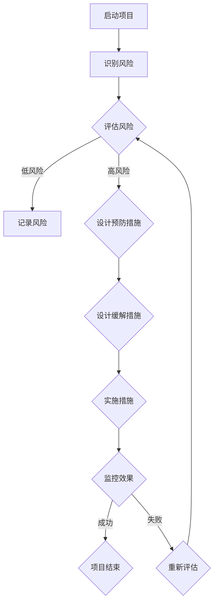

                 

### 文章标题

# 软件项目风险管理：预防与缓解措施

### 关键词

- 软件项目管理
- 风险识别
- 风险评估
- 风险预防
- 风险缓解
- 软件质量保证

### 摘要

本文深入探讨了软件项目风险管理的重要性，详细介绍了风险识别、评估、预防与缓解措施。通过案例分析，展示了如何有效应对软件项目中的风险，保障项目顺利进行。文章旨在为软件工程师和项目经理提供实用的风险管理策略和实践指导。

---

## 第1章 引言

### 1.1 风险管理的重要性

在当今高度复杂和动态变化的软件行业中，风险管理已成为确保项目成功的关键因素。风险管理不仅关乎项目的经济效益，更关乎企业的长期生存和发展。有效的风险管理能够帮助企业：

1. **降低损失**：通过识别和评估潜在风险，提前采取预防措施，减少项目过程中可能发生的损失。
2. **提高项目成功率**：风险管理能够帮助项目经理更好地规划项目进度，确保项目按时、按预算完成。
3. **增强团队信心**：当团队成员了解潜在风险并知道如何应对时，他们的工作积极性和信心会得到显著提升。

### 1.2 软件项目的特性与风险

软件项目具有以下特性：

1. **复杂性**：软件项目通常涉及多种技术、需求和变更，这使得项目变得更加复杂。
2. **不确定性**：由于技术的不断进步和客户需求的不断变化，软件项目的不确定性较高。
3. **时效性**：软件项目通常有明确的交付时间要求，这增加了项目管理的难度。

这些特性使得软件项目面临多种风险，包括：

1. **技术风险**：包括技术选型不当、技术难题解决不及时等。
2. **需求风险**：包括需求变更、需求不明确等。
3. **时间风险**：包括项目延期、进度失控等。
4. **成本风险**：包括预算超支、成本控制不力等。

### 1.3 风险管理的目标与原则

风险管理的目标包括：

1. **识别和评估风险**：通过系统化的方法识别项目中的潜在风险，并对这些风险进行评估，确定其严重程度和发生概率。
2. **制定应对策略**：根据风险评估结果，制定相应的预防措施和缓解措施，以减少风险对项目的影响。
3. **监控和更新**：在项目执行过程中，持续监控风险的变化，并根据实际情况更新风险管理计划。

风险管理应遵循以下原则：

1. **全面性**：风险管理应覆盖项目的各个方面，确保所有潜在风险都被识别和评估。
2. **系统性**：风险管理应采用系统化的方法，确保风险识别、评估、预防与缓解措施的连贯性和一致性。
3. **动态性**：风险管理应具有动态性，能够根据项目进展和外部环境的变化进行调整。

---

## 第2章 软件项目风险识别

### 2.1 风险识别的过程与方法

风险识别是风险管理的基础，其目标是系统地识别项目中的潜在风险。风险识别的过程通常包括以下步骤：

1. **收集信息**：通过访谈、文档审查、会议记录等方式收集与项目相关的信息。
2. **筛选风险**：根据项目的特性和目标，筛选出可能对项目产生重大影响的风险。
3. **记录风险**：将识别出的风险记录在风险登记册中，包括风险的名称、描述、发生概率和潜在影响等。

风险识别的方法包括：

1. **专家判断法**：通过专家的判断和经验识别风险。
2. **头脑风暴法**：通过团队成员的集体讨论，识别潜在风险。
3. **历史数据分析法**：通过分析过去项目的风险记录，识别类似项目的潜在风险。
4. **风险检查表法**：使用预先准备的风险检查表，系统化地识别风险。

### 2.2 常见的风险类型

软件项目常见的风险类型包括：

1. **技术风险**：包括技术难题、技术过时、技术选型不当等。
2. **需求风险**：包括需求变更、需求不明确、需求与实际需求不符等。
3. **时间风险**：包括项目延期、进度失控、时间安排不当等。
4. **成本风险**：包括预算超支、成本控制不力、资源分配不当等。
5. **质量风险**：包括软件质量不达标、测试不充分、缺陷率高等。
6. **外部风险**：包括市场变化、法律政策变化、供应商问题等。

### 2.3 实例：如何识别软件项目的风险

假设我们正在开发一个电子商务平台，以下是一个风险识别的实例：

1. **收集信息**：
   - 访谈项目经理、开发团队和产品经理，了解项目的背景和目标。
   - 审查项目文档，包括需求文档、技术方案、时间计划和预算。

2. **筛选风险**：
   - 根据项目的特性和目标，筛选出可能对项目产生重大影响的风险。
   - 识别出的风险包括技术风险（如技术难题、技术选型不当）、需求风险（如需求变更、需求不明确）、时间风险（如项目延期、进度失控）和成本风险（如预算超支、成本控制不力）。

3. **记录风险**：
   - 将识别出的风险记录在风险登记册中，包括风险的名称、描述、发生概率和潜在影响。
   - 例如，技术风险：技术难题，发生概率：50%，潜在影响：项目延期。

通过以上步骤，我们成功地识别了电子商务平台项目的潜在风险，为后续的风险评估和预防措施奠定了基础。

---

## 第3章 软件项目风险评估

### 3.1 风险评估的概念与步骤

风险评估是风险管理的重要环节，其目标是评估已识别风险的严重程度和发生概率，以便制定相应的应对策略。风险评估的过程通常包括以下步骤：

1. **确定评估标准**：根据项目的目标和要求，确定评估风险的标准，如风险严重程度、发生概率等。
2. **收集评估数据**：通过访谈、调查、历史数据分析等方式收集与风险相关的数据。
3. **评估风险**：使用评估标准对收集到的数据进行评估，确定每个风险的严重程度和发生概率。
4. **记录评估结果**：将评估结果记录在风险登记册中，包括每个风险的严重程度、发生概率和潜在影响。

### 3.2 风险评估的定量与定性方法

风险评估可以分为定量评估和定性评估：

1. **定量评估**：
   - 使用数学模型和统计方法对风险进行量化评估。
   - 常用的定量评估方法包括风险优先级矩阵、蒙特卡洛模拟、决策树分析等。
   - 例如，使用风险优先级矩阵，可以将风险按照严重程度和发生概率进行量化，得到每个风险的风险值。

2. **定性评估**：
   - 通过专家判断和主观评估对风险进行定性分析。
   - 常用的定性评估方法包括风险地图、风险矩阵等。
   - 例如，使用风险地图，可以将风险按照严重程度和发生概率进行分类，帮助团队成员直观地了解项目面临的风险。

### 3.3 实例：风险评估在软件项目中的应用

假设我们已经完成了电子商务平台项目的风险识别，接下来进行风险评估：

1. **确定评估标准**：
   - 根据项目的特性和目标，确定评估风险的标准，如风险严重程度（从低到高分为1-5级）、发生概率（从低到高分为1-5级）。

2. **收集评估数据**：
   - 通过访谈、调查、历史数据分析等方式收集与风险相关的数据。
   - 例如，通过访谈项目经理、开发团队和产品经理，了解每个风险的严重程度和发生概率。

3. **评估风险**：
   - 使用风险优先级矩阵对每个风险进行评估。
   - 例如，对于技术风险：技术难题，严重程度为4级，发生概率为3级，风险值为12。

4. **记录评估结果**：
   - 将评估结果记录在风险登记册中，包括每个风险的严重程度、发生概率和风险值。

通过以上步骤，我们完成了电子商务平台项目的风险评估，为后续的风险预防措施和缓解措施提供了依据。

---

## 第4章 软件项目风险预防措施

### 4.1 预防措施的设计原则

风险预防措施的设计应遵循以下原则：

1. **全面性**：预防措施应覆盖项目的各个方面，确保所有潜在风险都得到关注。
2. **针对性**：预防措施应针对具体的风险类型，确保措施的针对性和有效性。
3. **可操作性**：预防措施应易于操作和实施，确保团队能够顺利执行。
4. **灵活性**：预防措施应具有一定的灵活性，能够根据项目进展和风险变化进行调整。

### 4.2 预防措施的实施策略

预防措施的实施策略包括以下几个方面：

1. **制定预防计划**：根据风险评估结果，制定详细的预防计划，明确预防措施的具体内容、实施时间和负责人。
2. **培训与沟通**：对团队成员进行风险预防培训，提高他们的风险意识和应对能力，同时确保团队成员之间的有效沟通。
3. **资源分配**：根据预防计划，合理分配资源，确保预防措施的有效实施。
4. **监控与反馈**：在项目执行过程中，持续监控预防措施的实施效果，及时反馈和调整。

### 4.3 预防措施的案例分析

以下是一个关于电子商务平台项目预防措施的实施案例：

1. **识别风险**：
   - 根据风险评估，确定项目面临的主要风险，包括技术风险（如技术难题、技术选型不当）、需求风险（如需求变更、需求不明确）和时间风险（如项目延期、进度失控）。

2. **设计预防措施**：
   - 针对技术风险，制定技术方案评审流程，确保技术选型的合理性和可行性。
   - 针对需求风险，加强与产品经理的沟通，确保需求明确和稳定。
   - 针对时间风险，制定详细的项目进度计划，确保项目按时交付。

3. **实施预防措施**：
   - 根据预防计划，对团队成员进行培训，提高他们的风险意识和应对能力。
   - 加强与产品经理的沟通，确保需求的明确和稳定。
   - 实施技术方案评审流程，确保技术选型的合理性和可行性。

4. **监控与反馈**：
   - 在项目执行过程中，持续监控预防措施的实施效果，及时反馈和调整。
   - 例如，定期召开项目会议，检查技术方案评审的进展情况，及时解决出现的问题。

通过以上预防措施的实施，电子商务平台项目成功地降低了风险，确保了项目的顺利进行。

---

## 第5章 软件项目风险缓解措施

### 5.1 缓解措施的选择与设计

风险缓解措施的选择和设计应遵循以下原则：

1. **针对性**：缓解措施应针对具体的风险类型，确保措施的有效性。
2. **可行性**：缓解措施应具有可行性，能够在项目执行过程中实施。
3. **可追溯性**：缓解措施的实施效果应可追溯，以便后续的改进和优化。

缓解措施的设计包括以下几个方面：

1. **风险应对策略**：根据风险评估结果，确定针对不同风险的应对策略，如风险回避、风险减轻、风险转移等。
2. **资源分配**：根据应对策略，合理分配资源，确保缓解措施的有效实施。
3. **实施方案**：制定详细的实施方案，明确缓解措施的具体内容、实施时间和负责人。

### 5.2 缓解措施的实施与监控

缓解措施的实施与监控包括以下几个方面：

1. **实施计划**：根据缓解措施的设计，制定详细的实施计划，明确实施的时间、步骤和责任人。
2. **培训与沟通**：对团队成员进行缓解措施的培训，提高他们的风险意识和应对能力，同时确保团队成员之间的有效沟通。
3. **资源调配**：根据实施计划，合理调配资源，确保缓解措施的有效实施。
4. **监控与反馈**：在项目执行过程中，持续监控缓解措施的实施效果，及时反馈和调整。

### 5.3 缓解措施的案例分析

以下是一个关于电子商务平台项目风险缓解措施的实施案例：

1. **识别风险**：
   - 根据风险评估，确定项目面临的主要风险，包括技术风险（如技术难题、技术选型不当）、需求风险（如需求变更、需求不明确）和时间风险（如项目延期、进度失控）。

2. **设计缓解措施**：
   - 针对技术风险，制定技术问题解决方案，包括技术选型的调整、技术难题的攻关等。
   - 针对需求风险，加强与产品经理的沟通，确保需求的明确和稳定。
   - 针对时间风险，调整项目进度计划，确保项目按时交付。

3. **实施缓解措施**：
   - 根据缓解措施的设计，对团队成员进行培训，提高他们的风险意识和应对能力。
   - 加强与产品经理的沟通，确保需求的明确和稳定。
   - 实施技术问题解决方案，包括技术选型的调整、技术难题的攻关等。

4. **监控与反馈**：
   - 在项目执行过程中，持续监控缓解措施的实施效果，及时反馈和调整。
   - 例如，定期召开项目会议，检查技术问题解决方案的进展情况，及时解决出现的问题。

通过以上缓解措施的实施，电子商务平台项目成功地降低了风险，确保了项目的顺利进行。

---

## 第6章 软件项目风险管理工具与技术

### 6.1 风险管理工具的选择

在软件项目风险管理中，选择合适的工具至关重要。常见的风险管理工具包括：

1. **风险登记册**：用于记录和管理项目中的所有风险，包括风险名称、描述、发生概率、潜在影响和应对措施等。
2. **风险地图**：用于可视化项目中的风险，帮助团队成员直观地了解项目面临的风险状况。
3. **风险矩阵**：用于评估风险的严重程度和发生概率，帮助确定优先级和应对策略。
4. **风险管理软件**：如JIRA、Trello等，提供全面的风险管理功能，包括风险识别、评估、预防与缓解措施等。

### 6.2 风险管理技术的应用

在软件项目风险管理中，常见的风险管理技术包括：

1. **头脑风暴法**：通过团队集体讨论，识别项目中的潜在风险。
2. **专家判断法**：通过专家的经验和判断，识别和评估风险。
3. **历史数据分析法**：通过分析过去项目的风险记录，识别类似项目的潜在风险。
4. **蒙特卡洛模拟**：通过模拟项目执行过程，评估不同风险对项目的影响。
5. **决策树分析**：通过决策树模型，分析不同决策方案的风险和收益。

### 6.3 风险管理工具的案例分析

以下是一个关于电子商务平台项目风险管理工具应用的案例：

1. **风险登记册**：
   - 使用风险登记册记录电子商务平台项目的所有风险，包括风险名称、描述、发生概率、潜在影响和应对措施。
   - 风险登记册帮助团队清晰地了解项目面临的风险，并确保所有风险都得到有效管理。

2. **风险地图**：
   - 使用风险地图可视化电子商务平台项目的风险，帮助团队成员直观地了解项目面临的风险状况。
   - 风险地图帮助团队确定风险优先级，确保高风险得到重点关注。

3. **风险矩阵**：
   - 使用风险矩阵评估电子商务平台项目的风险严重程度和发生概率，帮助确定应对策略。
   - 风险矩阵帮助团队确定高风险和关键风险，确保项目资源得到合理分配。

4. **风险管理软件**：
   - 使用JIRA等风险管理软件，实现电子商务平台项目的风险识别、评估、预防与缓解措施的全过程管理。
   - 风险管理软件提供实时数据更新和通知功能，确保团队随时掌握项目风险状况。

通过以上风险管理工具的应用，电子商务平台项目成功降低了风险，确保了项目的顺利进行。

---

## 第7章 软件项目风险管理实践

### 7.1 实践案例概述

在本节中，我们将通过一个电子商务平台项目的实践案例，详细讲解软件项目风险管理的全过程。这个案例涵盖了风险识别、评估、预防与缓解措施的实施，以及项目进展和风险管理的效果。

### 7.2 案例分析

#### 1. 风险识别

在项目启动阶段，团队通过头脑风暴法识别了以下潜在风险：

- **技术风险**：包括技术难题、技术选型不当、技术过时等。
- **需求风险**：包括需求变更、需求不明确、需求与实际需求不符等。
- **时间风险**：包括项目延期、进度失控、时间安排不当等。
- **成本风险**：包括预算超支、成本控制不力、资源分配不当等。

#### 2. 风险评估

团队使用风险矩阵对识别出的风险进行了评估，确定了每个风险的严重程度和发生概率。以下是一个示例：

| 风险类型 | 风险名称 | 严重程度 | 发生概率 | 风险值 |
| :----: | :----: | :----: | :----: | :----: |
| 技术风险 | 技术难题 | 4 | 3 | 12 |
| 需求风险 | 需求变更 | 3 | 2 | 6 |
| 时间风险 | 项目延期 | 5 | 1 | 5 |
| 成本风险 | 预算超支 | 2 | 2 | 4 |

#### 3. 风险预防措施

根据风险评估结果，团队制定了以下预防措施：

- **技术风险**：制定技术方案评审流程，确保技术选型的合理性和可行性。
- **需求风险**：加强与产品经理的沟通，确保需求的明确和稳定。
- **时间风险**：制定详细的项目进度计划，确保项目按时交付。
- **成本风险**：合理分配资源，确保项目成本在预算范围内。

#### 4. 风险缓解措施

对于高风险，团队制定了以下缓解措施：

- **技术风险**：成立技术攻关小组，解决技术难题。
- **需求风险**：建立需求变更管理流程，确保需求变更得到妥善处理。
- **时间风险**：制定应急预案，确保项目在延期时能够迅速调整。
- **成本风险**：引入成本控制工具，实时监控项目成本。

#### 5. 项目进展与风险管理效果

在项目执行过程中，团队持续监控风险管理措施的实施效果。通过定期的项目会议，检查技术方案评审的进展情况、需求变更的处理情况、项目进度和成本控制情况。以下是一些关键指标：

- **技术风险**：技术难题得到及时解决，技术选型合理。
- **需求风险**：需求变更得到有效管理，需求与实际需求一致。
- **时间风险**：项目进度得到严格控制，未出现延期现象。
- **成本风险**：项目成本控制在预算范围内，成本控制效果良好。

通过以上风险管理措施的实施，电子商务平台项目成功地降低了风险，确保了项目的顺利进行。

### 7.3 启示与教训

通过这个实践案例，我们可以得到以下启示和教训：

1. **风险管理的重要性**：风险管理是确保项目成功的关键环节，必须得到足够的重视。
2. **全面的识别和评估**：识别和评估风险是风险管理的核心，必须全面、准确地识别和评估风险。
3. **预防与缓解措施的有效性**：预防措施和缓解措施的设计和实施必须具有针对性和可行性。
4. **持续监控与调整**：在项目执行过程中，持续监控风险管理措施的实施效果，并根据实际情况进行调整。

通过以上启示和教训，我们可以更好地应对软件项目中的风险，确保项目的成功。

---

## 第8章 未来展望与挑战

### 8.1 风险管理发展趋势

随着软件项目的日益复杂化和技术变革的加速，软件项目风险管理也呈现出以下发展趋势：

1. **自动化和智能化**：利用人工智能和大数据分析技术，提高风险识别、评估和缓解的效率和准确性。
2. **实时风险管理**：通过实时数据监控和智能预警系统，实现风险管理的实时性和动态调整。
3. **全员风险管理**：推动风险管理从项目经理和风险管理人员扩展到整个团队，提高全员的风险意识和参与度。

### 8.2 面临的挑战与应对策略

尽管软件项目风险管理取得了显著进展，但仍面临以下挑战：

1. **技术复杂性**：随着新技术和新框架的不断涌现，如何有效地识别和评估技术风险成为一大挑战。
2. **需求变化**：客户需求的快速变化给需求风险的管理带来了巨大压力。
3. **资源限制**：有限的资源常常导致风险管理工作的不完善。
4. **沟通障碍**：团队成员之间的沟通不畅会影响风险管理的效果。

应对策略包括：

1. **加强技术培训和知识分享**：定期组织技术培训和知识分享活动，提高团队成员对新技术和风险的认识。
2. **优化需求管理流程**：建立稳定的沟通渠道和需求变更管理机制，确保需求变更的及时响应和处理。
3. **合理分配资源**：在资源有限的情况下，优先考虑风险管理的重要性和紧急性，确保关键风险得到充分关注。
4. **提升沟通效率**：采用协作工具和沟通平台，提高团队成员之间的沟通效率和协同性。

### 8.3 结论

软件项目风险管理是确保项目成功的关键因素。通过有效的风险识别、评估、预防与缓解措施，以及持续的监控和调整，我们可以更好地应对软件项目中的各种风险，确保项目的顺利进行。面对未来，我们需要不断探索和创新，以应对不断变化的挑战，推动软件项目风险管理向更加智能化和自动化的方向发展。

---

## 附录

### A.1 风险管理相关工具与资源

以下是一些常用的风险管理工具和资源：

- **JIRA**：一款功能强大的项目管理工具，支持风险识别、评估、预防与缓解措施的管理。
- **Trello**：一款简洁易用的项目管理工具，适合小型团队进行风险管理。
- **Microsoft Excel**：一款通用的数据处理工具，可以用于风险矩阵的计算和分析。
- **RiskLens**：一款专业的风险管理软件，提供风险识别、评估、监控和报告功能。

### A.2 风险管理参考文献

以下是一些关于风险管理的重要参考文献：

- *《风险管理：企业风险管理指南》* （Paul A.zikmund, John B. Scherer）
- *《项目风险管理》* （Michael J. Jenkins）
- *《软件项目管理：实践者的指南》* （Jean-Jacques Dubray, Jean-Luc Chatelain）
- *《风险管理基础》* （罗伯特·赫希）

### A.3 Mermaid流程图示例

以下是一个Mermaid流程图的示例：



### A.4 伪代码示例

以下是一个伪代码示例，用于描述风险识别的过程：

```plaintext
function riskIdentification(project):
    risks = []
    for team_member in project.team_members:
        risks.extend(team_member.identifyRisks())
    risks.extend(externalRiskSources())
    return risks
```

通过以上伪代码，我们能够系统地识别项目中的风险，为后续的风险评估和预防措施奠定基础。

---

### 作者信息

作者：AI天才研究院/AI Genius Institute & 禅与计算机程序设计艺术 /Zen And The Art of Computer Programming

本文通过深入探讨软件项目风险管理的重要性，详细介绍了风险识别、评估、预防与缓解措施。通过实践案例分析和未来展望，文章旨在为软件工程师和项目经理提供实用的风险管理策略和实践指导。作者拥有丰富的软件开发和项目管理经验，致力于推动软件项目管理的最佳实践。

