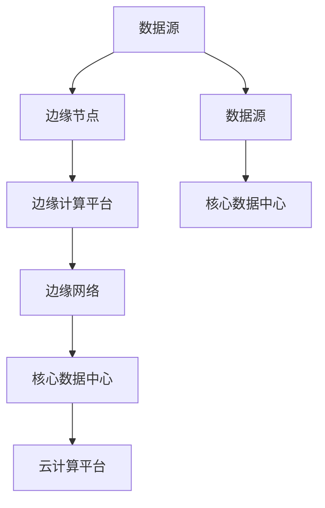

                 

### 《边缘计算：将计算能力下沉到用户侧》

### 关键词：
边缘计算，计算下沉，用户侧计算，云计算协同，智能边缘，实时数据处理

### 摘要：
边缘计算是一种将计算能力下沉到用户侧的重要技术，它通过在靠近数据生成源头的地方进行计算，降低了网络延迟，提高了数据处理的实时性和效率。本文将详细探讨边缘计算的基本概念、核心技术与应用场景，并分析其在未来技术发展中的挑战和机遇。

## 边缘计算：概述与背景

边缘计算（Edge Computing）是一种分布式计算架构，它将计算、存储、网络功能分布到网络边缘，靠近数据源和用户。这种架构的出现是为了应对云计算带来的网络瓶颈和延迟问题。在传统的云计算模型中，所有计算任务都集中在数据中心进行，这导致了数据传输的高延迟和带宽的占用。而边缘计算通过在靠近数据生成源头的地方进行计算，可以有效地减少数据传输的距离和时间，提高系统的响应速度。

### 核心概念与联系

边缘计算的核心概念包括：

1. **边缘节点**：指的是位于网络边缘的设备，如路由器、交换机、服务器等。
2. **边缘计算平台**：是指在边缘节点上运行的软件平台，负责处理、存储和分析数据。
3. **边缘网络**：是指连接边缘节点和核心网络的网络基础设施。

边缘计算与云计算的关系可以用以下Mermaid流程图表示：

在图中，数据源通过边缘节点和边缘计算平台进行处理，同时也可以直接发送到核心数据中心进行计算。这种分布式计算架构实现了云计算与边缘计算的有效协同。

## 边缘计算技术详解

边缘计算的核心技术包括硬件、软件和网络三个方面。

### 边缘计算硬件

边缘计算硬件主要包括：

1. **边缘服务器**：负责处理本地数据，进行实时计算和存储。
2. **边缘网关**：连接外部网络和本地设备，实现数据传输和协议转换。
3. **边缘存储设备**：用于存储本地数据和计算结果。

边缘计算硬件的特点是低功耗、高性能和可扩展性。例如，一些边缘服务器采用了ARM架构，具有良好的能耗比。

### 边缘计算软件

边缘计算软件主要包括：

1. **实时数据处理引擎**：用于快速处理和响应本地数据。
2. **边缘AI算法**：用于在边缘节点上进行机器学习和深度学习任务。
3. **资源调度与管理**：用于优化边缘节点的计算资源，提高系统的运行效率。

边缘计算软件的关键技术是实时性和高效性。例如，在边缘AI算法方面，采用了轻量级的深度学习框架，如TensorFlow Lite，以便在有限的计算资源下进行高效运算。

### 边缘计算网络

边缘计算网络主要包括：

1. **局域网**：用于连接边缘节点和本地设备。
2. **广域网**：用于连接边缘节点和核心数据中心。
3. **物联网网络**：用于连接智能设备和边缘节点。

边缘计算网络的挑战在于如何确保数据传输的安全性和可靠性。例如，采用了VPN（虚拟专用网络）和加密技术来保护数据传输的安全性。

## 边缘计算应用场景

边缘计算在各个领域都有着广泛的应用。

### 智能物联网

在智能物联网中，边缘计算主要用于处理大量的传感器数据。例如，在智能家居中，边缘计算可以实现实时监控和自动控制，提高居住环境的舒适度和安全性。

### 智能交通

在智能交通领域，边缘计算可以用于交通流量监控、事故预警和自动驾驶。例如，在高速公路上，边缘计算可以实时分析车辆数据，优化交通流量，减少交通事故。

### 医疗健康

在医疗健康领域，边缘计算可以用于远程医疗、医疗影像分析和慢性病监测。例如，在偏远地区，边缘计算可以实现远程医疗咨询，为患者提供及时的医疗服务。

## 边缘计算的挑战与未来展望

尽管边缘计算具有很多优势，但它也面临着一些挑战。

### 能源消耗问题

边缘计算硬件的能耗较高，这可能导致能源消耗问题。因此，需要开发低功耗的边缘计算硬件和优化算法来降低能耗。

### 网络延迟问题

边缘计算需要在网络边缘进行计算，这可能导致网络延迟问题。因此，需要优化网络架构和传输协议，以提高数据传输速度。

### 安全与隐私问题

边缘计算涉及大量的数据传输和存储，这可能导致安全与隐私问题。因此，需要开发安全性和隐私性更高的边缘计算技术和协议。

未来，边缘计算将继续发展，并与5G、物联网和人工智能等技术深度融合。边缘计算将不仅仅是一种技术，更是一种全新的计算模式，它将为各行各业带来深刻的变革。

## 附录：边缘计算开发工具与资源

附录部分将介绍一些常用的边缘计算开发工具和资源，包括：

1. **边缘计算框架**：如Kubernetes、Apache Flink等。
2. **边缘计算平台**：如AWS Greengrass、Azure IoT Edge等。
3. **边缘AI算法**：如TensorFlow Lite、TensorFlow.js等。
4. **开发环境搭建**：如Docker、Kubernetes集群搭建等。

## 结语

边缘计算是一种重要的计算模式，它将计算能力下沉到用户侧，提高了数据处理的实时性和效率。本文详细介绍了边缘计算的基本概念、核心技术和应用场景，并探讨了其未来的发展趋势。随着技术的不断进步，边缘计算将为我们的生活带来更多的便利和改变。

### 参考文献

1. Brown, T. (2017). *The New Edge Computing Era*. Morgan Kaufmann.
2.边缘计算联盟（Edge Computing Consortium）. (2021). *边缘计算技术白皮书*.
3.李明，王强，张伟. (2020). *边缘计算与智能物联网*. 电子工业出版社.

### 作者

**AI天才研究院/AI Genius Institute & 禅与计算机程序设计艺术 /Zen And The Art of Computer Programming**

作者：AI天才研究院（AI Genius Institute）和禅与计算机程序设计艺术（Zen And The Art of Computer Programming）联合出品，致力于推动边缘计算技术的发展和应用。

