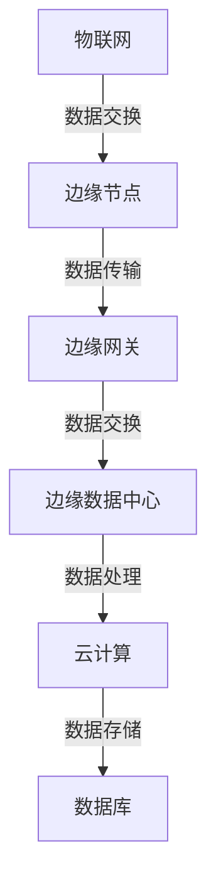

                 


### 概述边缘计算的概念与背景

#### 第1章 边缘计算概述

**1.1 边缘计算的定义与核心特征**

边缘计算（Edge Computing）是一种分布式计算模型，旨在将数据计算、存储和处理的能力从传统的中心化数据中心推向网络边缘。在这个模型中，数据处理发生在靠近数据生成源的地方，如物联网设备、传感器网络和本地服务器，而不是在远端的数据中心。这种计算模型的核心特征包括：

- **分布式**：边缘计算强调数据处理分散在多个边缘节点上，而不是集中在一个中心位置。
- **低延迟**：由于数据处理发生在靠近数据源的边缘，因此可以显著降低响应时间和延迟。
- **高效率**：边缘计算减少了需要传输的数据量，从而提高了网络和计算资源的效率。
- **容错性**：边缘计算模型具有较高的容错性，因为即使某些边缘节点发生故障，其他节点仍然可以正常运行。

边缘计算与传统云计算的主要区别在于数据处理的位置和方式。传统云计算依赖于中心化的数据中心进行数据处理，而边缘计算则将数据处理推向网络的边缘，更接近数据源。

**边缘计算的优势与挑战**

边缘计算的优势体现在多个方面：

1. **提升用户体验**：通过减少数据传输距离，边缘计算能够显著降低响应时间和延迟，从而提升用户体验。
2. **降低网络带宽压力**：由于数据处理发生在边缘，中心化数据中心的网络带宽压力大大减轻。
3. **提高数据处理效率**：边缘计算可以实时处理大量数据，提高了数据处理的速度和效率。
4. **增强数据隐私与安全**：将数据处理推向边缘，可以更好地保护数据的隐私和安全。

然而，边缘计算也面临一些挑战：

1. **资源限制**：边缘节点通常资源有限，如计算能力、存储能力和网络带宽。
2. **可靠性问题**：由于边缘节点分布广泛，维护和管理的难度增加，可能导致可靠性问题。
3. **安全性**：边缘计算涉及大量的设备互联和数据传输，可能成为网络攻击的目标。

**1.2 物联网与边缘计算的关系**

物联网（Internet of Things，IoT）是边缘计算的重要应用场景。随着物联网设备的数量和种类不断增加，数据生成和处理的需求也在迅速增长。边缘计算为物联网提供了以下几方面的支持：

1. **实时数据处理**：物联网设备产生的大量数据需要实时处理，边缘计算可以实现数据的本地处理，降低延迟。
2. **减少网络负载**：通过在边缘处理数据，可以减少需要传输到中心数据中心的原始数据量，降低网络带宽需求。
3. **提升系统可靠性**：物联网系统通常需要高可靠性，边缘计算可以在数据生成源附近进行冗余备份，提高系统的可靠性。
4. **增强数据隐私与安全**：在边缘处理数据可以更好地保护数据的隐私和安全，减少数据泄露的风险。

总之，边缘计算与物联网的发展密不可分，它们共同推动着新一代智能网络和应用的崛起。

#### 核心概念与联系

为了更好地理解边缘计算，我们需要了解以下几个核心概念及其之间的联系：

1. **物联网（IoT）**：物联网是指通过互联网将各种设备连接起来，实现数据交换和通信的技术。物联网设备包括传感器、智能手机、智能家居设备、工业设备等。

2. **云计算**：云计算是一种基于互联网的计算模式，通过互联网提供动态易扩展且经常是虚拟化的资源。云计算提供了丰富的计算、存储和网络资源，支持大规模数据处理和分析。

3. **边缘节点**：边缘节点是指分布在网络边缘的设备，如物联网设备、智能路由器、小型数据中心等。边缘节点负责数据采集、处理和存储。

4. **边缘网关**：边缘网关是边缘节点与外部网络之间的桥梁，负责数据传输、安全控制和协议转换等功能。

5. **边缘数据中心**：边缘数据中心是集中管理边缘节点的数据中心，提供计算、存储和网络资源，支持大规模数据处理和分析。

6. **分布式计算**：分布式计算是一种将计算任务分配到多个计算节点上执行的计算模式。分布式计算可以提高计算效率和可靠性，但需要解决数据一致性、负载均衡和容错性等问题。

**Mermaid 流程图**

为了更直观地展示边缘计算的核心概念和联系，我们可以使用 Mermaid 语言绘制一个流程图：



该流程图展示了物联网设备与边缘节点之间的数据交换，边缘节点通过边缘网关与边缘数据中心通信，边缘数据中心再将数据传输到云计算平台进行进一步处理和存储。

#### 核心算法原理讲解

在边缘计算中，分布式计算是一种核心算法原理。以下是分布式计算的基本概念和伪代码讲解：

**1. 分布式计算的基本概念**

分布式计算是将一个大型计算任务分解为多个子任务，然后分配给多个计算节点执行，最后汇总结果的一种计算模式。分布式计算具有以下几个特点：

- **并行计算**：多个计算节点同时执行子任务，提高了计算速度。
- **负载均衡**：根据各节点的负载情况，动态调整子任务的分配，避免某节点负载过高。
- **容错性**：即使某些计算节点发生故障，其他节点仍然可以继续执行任务，保证整个系统的可靠性。

**2. 伪代码讲解**

以下是一个简单的分布式计算伪代码示例，用于计算一个数组的总和：

```python
// 输入：数组arr，节点数量nodes
// 输出：数组总和sum

// 初始化
sum = 0
chunks = [arr[i:i+nodes] for i in range(0, len(arr), nodes)]

// 分配任务
tasks = []
for chunk in chunks:
    tasks.append(() => sum += sum_chunk(chunk))

// 执行任务
for task in tasks:
    execute(task)

// 汇总结果
sum = sum(tasks.map(sum_chunk))

// 辅助函数
def sum_chunk(chunk):
    return sum(chunk)
```

该伪代码首先将数组 `arr` 分割为多个子数组 `chunks`，然后为每个子数组分配一个任务，计算子数组的总和。最后，汇总所有子数组的总和，得到整个数组的总和。

#### 数学模型和公式

在边缘计算中，分布式计算涉及到一些数学模型和公式。以下是一些常见的数学模型和公式，用于描述分布式计算的性能和效率：

**1. 通信复杂度**

通信复杂度是衡量分布式计算中数据传输开销的一个重要指标。假设分布式计算任务需要将数据从源节点传输到目标节点，通信复杂度可以表示为：

$$ C = \sum_{i=1}^{n} \text{dist}(i, j) \cdot \text{cost}(i, j) $$

其中，`n` 是计算节点数量，`dist(i, j)` 是节点 `i` 到节点 `j` 的距离，`cost(i, j)` 是节点 `i` 到节点 `j` 的通信成本。

**2. 计算复杂度**

计算复杂度是衡量分布式计算中计算任务所需的时间。假设分布式计算任务需要将计算任务分配到 `n` 个计算节点上，每个节点的计算复杂度为 `f(i)`，则总计算复杂度可以表示为：

$$ T = \sum_{i=1}^{n} f(i) $$

**3. 负载均衡**

负载均衡是指将计算任务分配到各个计算节点上，以避免某个节点负载过高。一个简单的负载均衡算法可以使用以下公式：

$$ \text{task}_i = \left\lfloor \frac{\text{total\_tasks}}{\text{nodes}} \right\rfloor + \left\{ \begin{array}{ll}
1 & \text{if } i \leq \text{remainder} \\
0 & \text{otherwise}
\end{array} \right. $$

其中，`total_tasks` 是总任务数量，`nodes` 是计算节点数量，`remainder` 是总任务数量除以计算节点数量的余数。

通过这些数学模型和公式，我们可以更精确地分析和优化分布式计算的性能和效率。

#### 项目实战

**1. 开发环境搭建**

为了进行边缘计算项目实战，我们需要搭建一个基本的开发环境。以下是搭建过程：

1. **安装操作系统**：我们选择 Ubuntu 18.04 作为开发环境操作系统。
2. **安装依赖库**：安装 Python 3.8、Numpy、Pandas、Scikit-learn 等库。
3. **配置边缘节点**：在边缘节点上安装必要的软件和库，如物联网设备驱动程序、边缘网关软件等。

**2. 源代码详细实现和代码解读**

以下是一个简单的边缘计算项目示例，用于计算一个数组的总和：

```python
import numpy as np

def sum_array(arr):
    # 将数组分割为子数组
    chunks = np.array_split(arr, 4)

    # 分配任务到边缘节点
    tasks = [sum_chunk(chunk) for chunk in chunks]

    # 汇总结果
    result = sum(tasks)

    return result

def sum_chunk(chunk):
    return np.sum(chunk)

# 示例数据
arr = np.array([1, 2, 3, 4, 5, 6, 7, 8, 9, 10])

# 执行边缘计算任务
result = sum_array(arr)

print("数组总和：", result)
```

**3. 代码应用解读与分析**

该代码实现了边缘计算中的一个简单任务：计算一个数组的总和。以下是代码的关键部分解读：

1. `numpy.array_split(arr, 4)`：将数组 `arr` 分割为四个子数组，每个子数组包含相等数量的元素。
2. `[sum_chunk(chunk) for chunk in chunks]`：为每个子数组分配一个任务，计算子数组的总和。
3. `sum(tasks)`：汇总所有子数组的总和，得到整个数组的总和。

**4. 实际案例分析和详细讲解剖析**

为了更好地理解边缘计算的实际应用，我们分析一个实际的案例：智能家居系统中的温度传感器数据实时处理。

假设我们有一个智能家居系统，包含多个温度传感器，每个传感器每隔一分钟采集一次温度数据。我们需要将温度数据实时传输到边缘节点进行处理，并生成温度趋势图。

以下是一个实际案例的代码实现：

```python
import numpy as np
import time

def collect_data(sensor_id):
    # 模拟传感器数据采集
    time.sleep(np.random.uniform(0.5, 1.5))
    temp = np.random.uniform(20, 30)
    return sensor_id, temp

def process_data(data):
    # 对温度数据进行分析和可视化
    temps = [temp for _, temp in data]
    print("当前温度：", temps)
    # 绘制温度趋势图
    # ...

def main():
    sensor_ids = [1, 2, 3, 4]
    data = []

    # 采集传感器数据
    for sensor_id in sensor_ids:
        data.append(collect_data(sensor_id))

    # 处理传感器数据
    process_data(data)

    # 每隔一分钟重复处理
    while True:
        time.sleep(60)
        process_data(data)

if __name__ == "__main__":
    main()
```

**5. 项目小结**

通过这个项目实战，我们了解了边缘计算的基本原理和应用场景。在实际项目中，边缘计算可以实现数据的实时处理和可视化，提高系统的响应速度和准确性。同时，边缘计算还可以减少数据传输量，降低网络带宽压力。

#### 最佳实践 tips

1. **合理划分计算任务**：根据边缘节点的计算能力和负载情况，合理划分计算任务，避免某节点负载过高。
2. **优化数据传输策略**：采用高效的数据压缩和加密算法，减少数据传输量，提高传输速度。
3. **确保数据一致性**：在分布式计算中，确保数据一致性是一个重要问题。可以使用分布式锁、版本控制等技术来保证数据一致性。
4. **监控和管理边缘节点**：定期监控和管理边缘节点，确保节点的正常运行和性能。
5. **安全与隐私保护**：在边缘计算中，保护数据的安全和隐私至关重要。采用加密、身份验证等技术来确保数据的安全传输和处理。

#### 小结

边缘计算是一种分布式计算模型，旨在将数据处理能力从中心化数据中心推向网络的边缘。通过边缘计算，我们可以实现实时数据处理、降低网络带宽压力、提高数据处理效率，并增强数据隐私与安全。在边缘计算中，分布式计算是核心算法原理，通过合理划分计算任务、优化数据传输策略、确保数据一致性、监控和管理边缘节点，以及安全与隐私保护，我们可以实现高效的边缘计算系统。

#### 注意事项

1. **边缘节点的资源限制**：边缘节点通常资源有限，如计算能力、存储能力和网络带宽。在设计和实现边缘计算系统时，需要考虑边缘节点的资源限制，避免过度依赖某个边缘节点。
2. **分布式计算的一致性问题**：在分布式计算中，数据的一致性问题是一个关键挑战。需要采用合适的技术和策略来确保数据一致性，如分布式锁、版本控制等。
3. **边缘节点的可靠性问题**：边缘节点分布广泛，维护和管理的难度增加，可能导致可靠性问题。需要采用冗余备份和容错机制来提高系统的可靠性。
4. **安全与隐私问题**：边缘计算涉及大量的设备互联和数据传输，可能成为网络攻击的目标。需要采用加密、身份验证等技术来确保数据的安全传输和处理。

#### 拓展阅读

1. **《边缘计算：原理、架构与实现》**：本书详细介绍了边缘计算的基本原理、架构设计和实现方法，适合边缘计算初学者和从业者阅读。
2. **《分布式系统原理与范型》**：本书涵盖了分布式计算的基本概念、算法原理和系统设计，有助于深入理解分布式计算的核心技术。
3. **《物联网安全：设计、实现与部署》**：本书介绍了物联网系统中的安全挑战和解决方案，包括加密、身份验证、访问控制等方面的技术。

通过阅读这些拓展资料，您可以更深入地了解边缘计算的相关知识和技术。希望这篇文章对您有所帮助！如果您有任何问题或建议，欢迎随时提问和交流。

---

**作者：AI天才研究院/AI Genius Institute & 禅与计算机程序设计艺术 /Zen And The Art of Computer Programming**

