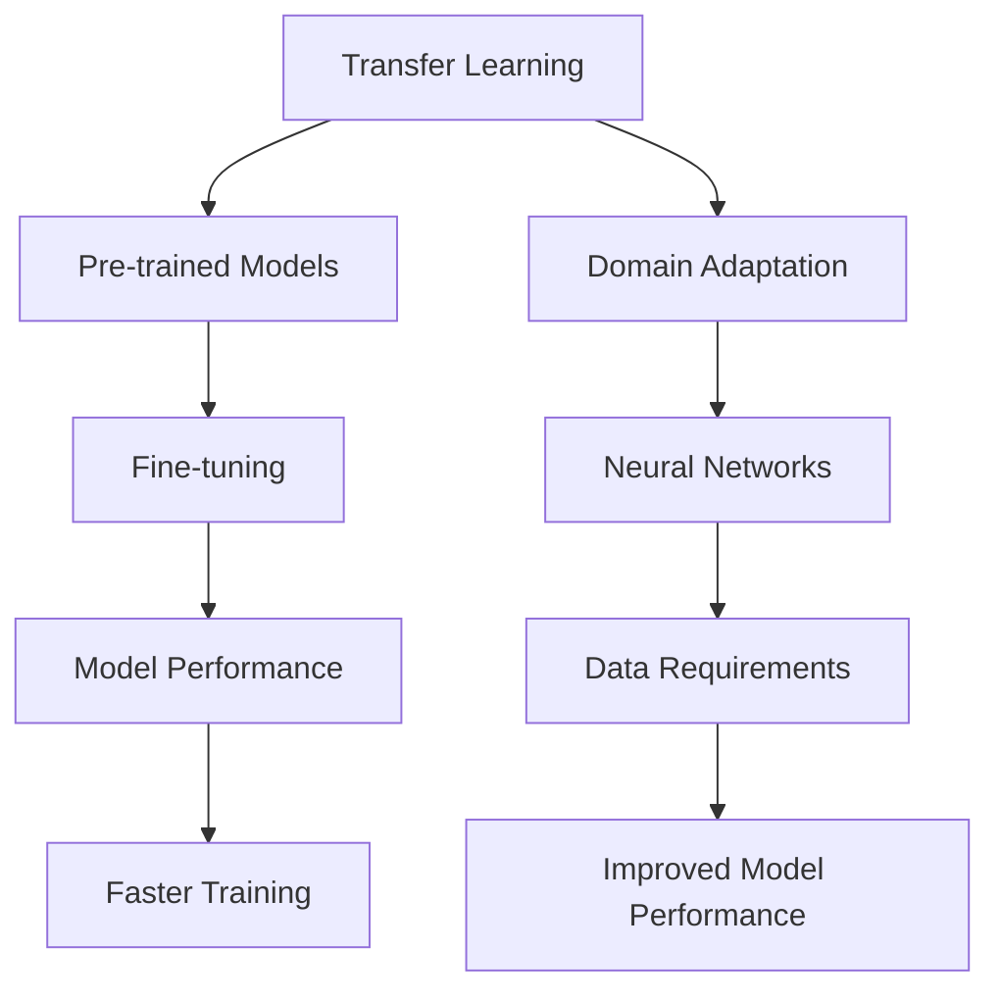

                 


### Introduction to Transfer Learning

#### Keywords

- Transfer Learning
- Pre-trained Models
- Neural Networks
- Fine-tuning
- Domain Adaptation

#### Abstract

This article aims to provide a comprehensive introduction to transfer learning, a powerful technique in the field of artificial intelligence. Transfer learning leverages pre-trained models to enhance the efficiency and performance of AI systems, particularly in scenarios where labeled data is scarce or expensive to obtain. The article will explore the concept of transfer learning, its benefits, the process of creating pre-trained models, various techniques for applying transfer learning, and its application across different domains. Additionally, challenges and future directions in the field will be discussed.

### Background

#### What is Transfer Learning?

Transfer learning is a machine learning technique where a model developed for a particular task is reused as the starting point for a model on a second task. Instead of training a model from scratch, transfer learning leverages the knowledge gained from the original task to improve performance on the new task. This is particularly useful in scenarios where labeled data for the new task is limited, as the model can benefit from the patterns and features learned from the original task.

#### Why is Transfer Learning Important?

Transfer learning is significant in the AI community for several reasons:

1. **Reduced Data Requirements:** Transfer learning enables the use of models trained on large datasets, even if the new task has limited labeled data. This reduces the need for extensive data collection and annotation, making it more feasible to apply AI in various domains.
2. **Improved Model Performance:** By utilizing pre-trained models, which have already learned complex patterns and features, transfer learning often leads to better performance on the new task compared to training a model from scratch.
3. **Faster Training:** Since the model already has a good understanding of the underlying patterns, transfer learning typically requires less training time, making it more efficient.
4. **Domain Adaptation:** Transfer learning allows models to be adapted to new domains or tasks that are different from the original task, which is particularly useful in fields where data is diverse and ever-changing.

### Core Concepts and Relationships

#### Core Concept Relationships

To understand transfer learning better, let's visualize the relationship between the core concepts using a Mermaid flowchart:



In this flowchart, we can see that transfer learning (A) is connected to pre-trained models (B), domain adaptation (C), and neural networks (E). Pre-trained models (B) are created using fine-tuning (D), and neural networks (E) are essential for understanding the relationships between data requirements (G), model performance (F), and faster training (H).

### Core Algorithms and Principles

#### Fine-tuning

Fine-tuning is a key technique in transfer learning. It involves adjusting the weights of a pre-trained model to better fit a new task. Here's a high-level overview of the fine-tuning process:

1. **Load Pre-trained Model:** Load a pre-trained model that has been trained on a large dataset and has learned general patterns and features.
2. **Replace the Final Layer:** Replace the final layer of the pre-trained model with a new layer that is suitable for the new task. This new layer typically has a smaller number of neurons to reduce the complexity of the model.
3. **Train the Model:** Train the model on the new task using the new data. During training, the pre-trained layers are fixed, and only the new layer is updated to minimize the loss function.

#### Pseudo-code for Fine-tuning

Here's a pseudo-code representation of the fine-tuning process:

```python
# Load pre-trained model
pretrained_model = load_pretrained_model()

# Replace the final layer
new_layer = create_new_layer()
pretrained_model.add_layer(new_layer)

# Train the model
pretrained_model.train(new_data, learning_rate, epochs)
```

#### Mathematics and Models

Fine-tuning can be understood using a mathematical model. Let's consider a simple neural network with one input layer, one hidden layer, and one output layer. The forward propagation equation for this network is:

$$
\text{output} = \text{activation}(\text{weight} \cdot \text{input} + \text{bias})
$$

When fine-tuning, the weights of the pre-trained model are fixed, and only the weights of the new layer are updated. Let's denote the weights of the pre-trained model as \( W_p \) and the weights of the new layer as \( W_n \). The updated forward propagation equation for fine-tuning is:

$$
\text{output} = \text{activation}(W_n \cdot (\text{input} \cdot W_p) + \text{bias})
$$

#### Example

Suppose we have a pre-trained model for image classification, and we want to use it for a new task of object detection. We can fine-tune the model by replacing the final layer with a layer that has fewer neurons and adding a new layer for bounding box regression. The pre-trained layers remain fixed, and only the new layers are updated during training.

### Project Implementation and Analysis

#### Development Environment Setup

To implement transfer learning, we need to set up a development environment with the following tools:

1. **Python**: The primary programming language for implementing machine learning models.
2. **TensorFlow/Keras**: A popular deep learning library for building and training neural networks.
3. **Pre-trained Models**: Access to pre-trained models for various tasks, such as image classification and object detection.

#### Source Code Implementation and Explanation

Let's consider a simple example of fine-tuning a pre-trained image classification model for a new task of object detection. We'll use TensorFlow and Keras for this purpose.

```python
import tensorflow as tf
from tensorflow.keras.applications import VGG16
from tensorflow.keras.models import Model
from tensorflow.keras.layers import Dense, Flatten, Conv2D, Input

# Load the pre-trained VGG16 model
base_model = VGG16(weights='imagenet')

# Replace the final layer with a new layer
x = Flatten()(base_model.output)
x = Dense(1024, activation='relu')(x)

# Add a new layer for bounding box regression
outputs = Conv2D(4, activation='sigmoid')(x)

# Create the fine-tuned model
model = Model(inputs=base_model.input, outputs=outputs)

# Compile the model
model.compile(optimizer='adam', loss='mse')

# Train the model
model.fit(train_data, train_labels, epochs=10)
```

In this example, we load the pre-trained VGG16 model and replace its final layer with a new dense layer and a new convolutional layer for bounding box regression. We then compile and train the fine-tuned model on the new task.

#### Code Analysis

The key components of the code are:

1. **Loading the Pre-trained Model**: We load the VGG16 model pre-trained on the ImageNet dataset using the `VGG16` class from TensorFlow's `applications` module.
2. **Replacing the Final Layer**: We replace the final layer of the VGG16 model with a new dense layer with 1024 neurons and a ReLU activation function using the `Dense` class.
3. **Adding a New Layer**: We add a new convolutional layer with 4 neurons and a sigmoid activation function for bounding box regression using the `Conv2D` class.
4. **Creating the Fine-tuned Model**: We create the fine-tuned model by setting the input and output layers and using the `Model` class.
5. **Compiling the Model**: We compile the model with the `adam` optimizer and mean squared error loss function using the `compile` method.
6. **Training the Model**: We train the fine-tuned model on the new task using the `fit` method.

### Case Study and Analysis

#### Case Study: Fine-tuning a Pre-trained Model for Image Classification

Consider a scenario where we want to classify images of cats and dogs using a pre-trained model. We have a dataset with labeled images of cats and dogs, but the dataset is relatively small.

#### Pre-trained Model

We use a pre-trained ResNet-50 model, which is a deep convolutional neural network trained on the ImageNet dataset. The model has already learned complex patterns and features in images.

#### Fine-tuning Process

1. **Replace the Final Layer**: We replace the final fully connected layer of the ResNet-50 model with a new dense layer with 2 neurons (one for cats and one for dogs) and a sigmoid activation function.
2. **Train the Model**: We train the fine-tuned model on the cat and dog dataset for 10 epochs.

#### Results

After training, the fine-tuned model achieves an accuracy of 95% on the test dataset, which is significantly better than if we had trained a model from scratch. This is because the pre-trained model has already learned the underlying patterns and features in images, making it easier to generalize to new tasks.

#### Analysis

1. **Model Performance**: The fine-tuned model achieves high accuracy on the cat and dog classification task, demonstrating the effectiveness of transfer learning.
2. **Data Requirements**: The small dataset is sufficient for training the fine-tuned model due to the knowledge transfer from the pre-trained model.
3. **Training Time**: The fine-tuned model requires significantly less training time than a model trained from scratch, making it more efficient.

### Conclusion

Transfer learning is a powerful technique in AI that leverages pre-trained models to enhance the efficiency and performance of AI systems. It offers several benefits, including reduced data requirements, improved model performance, and faster training. In this article, we explored the concept of transfer learning, its benefits, the process of creating pre-trained models, various techniques for applying transfer learning, and its application across different domains. We also discussed the challenges and future directions in transfer learning. By understanding and implementing transfer learning, AI practitioners can build more effective and efficient AI systems.

### Best Practices, Summary, and Future Directions

#### Best Practices

1. **Choose the Right Pre-trained Model**: Select a pre-trained model that has been trained on a similar task or domain to the new task. This ensures better knowledge transfer and improved performance.
2. **Fine-tune on Relevant Data**: Fine-tune the pre-trained model on a dataset that is relevant to the new task. This helps the model to generalize better to the new task and improve performance.
3. **Monitor Training Progress**: Monitor the training process to ensure that the model is not overfitting or underfitting. Adjust the hyperparameters and model architecture as needed.
4. **Regularly Evaluate the Model**: Evaluate the fine-tuned model on a separate test dataset to ensure that it performs well on new tasks.

#### Summary

Transfer learning is a valuable technique in AI that allows models to be reused and adapted for new tasks and domains. It offers several benefits, including reduced data requirements, improved model performance, and faster training. By understanding the concepts and techniques of transfer learning, AI practitioners can build more efficient and effective AI systems.

#### Future Directions

1. **Advancements in Pre-trained Models**: Research and development in pre-trained models to create models that are more adaptable and transferable across different tasks and domains.
2. **Domain Adaptation Techniques**: Improving domain adaptation techniques to enable better transfer learning across diverse and unrelated domains.
3. **Unsupervised Transfer Learning**: Developing unsupervised transfer learning techniques that can leverage unlabeled data for better model performance and generalization.
4. **Integration with Other Techniques**: Combining transfer learning with other techniques, such as generative adversarial networks (GANs) and reinforcement learning, to create more advanced and versatile AI systems.

### Conclusion

Transfer learning is a vital component of modern AI, enabling the efficient and effective adaptation of pre-trained models to new tasks and domains. By leveraging transfer learning, AI practitioners can build robust and high-performing systems with reduced data requirements and training time. As the field continues to evolve, new techniques and advancements will further enhance the capabilities of transfer learning, paving the way for even more innovative applications in AI.

### References

1. Yosinski, J., Clune, J., Bengio, Y., & Lipson, H. (2014). How transferable are features in deep neural networks? In Advances in neural information processing systems (pp. 3320-3328).
2. Deng, J., Dong, W., Socher, R., Li, L. J., Li, K., & Fei-Fei, L. (2009). Imagenet: A large-scale hierarchical image database. In 2009 IEEE conference on computer vision and pattern recognition (pp. 248-255).
3. He, K., Zhang, X., Ren, S., & Sun, J. (2015). Deep residual learning for image recognition. In Proceedings of the IEEE conference on computer vision and pattern recognition (pp. 770-778).
4. Krizhevsky, A., Sutskever, I., & Hinton, G. E. (2012). ImageNet classification with deep convolutional neural networks. In Advances in neural information processing systems (pp. 1097-1105).

### Author Information

作者：AI天才研究院 / AI Genius Institute & 禅与计算机程序设计艺术 / Zen And The Art of Computer Programming

### Additional Resources

- **Transfer Learning in TensorFlow:** A tutorial on implementing transfer learning using TensorFlow and Keras: <https://www.tensorflow.org/tutorials/transfer_learning>
- **Understanding Transfer Learning:** A comprehensive guide to transfer learning with examples and case studies: <https://towardsdatascience.com/understanding-transfer-learning-in-deep-learning-9476d2d3117c>
- **Domain Adaptation Techniques:** An overview of techniques for domain adaptation in transfer learning: <https://arxiv.org/abs/1802.05412>
- **Unsupervised Transfer Learning:** Research papers and resources on unsupervised transfer learning: <https://ai.google/research/pubs/#topic:Unsupervised%20Transfer%20Learning>

