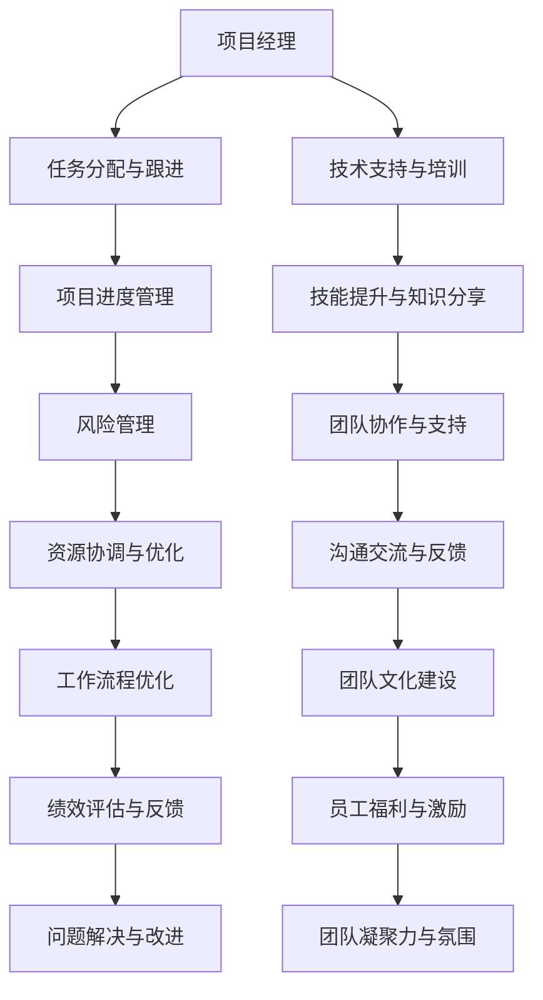

                 

### 文章标题：远程办公团队的管理策略

#### 关键词：远程办公、团队管理、协作工具、绩效评估、安全与隐私

#### 摘要：
随着全球化和数字化的发展，远程办公逐渐成为企业运营的重要组成部分。本文旨在探讨远程办公团队的管理策略，从团队构建、协作工具选择、绩效管理、安全与隐私保护、心理健康和团队文化等多方面，为远程办公团队提供全面的管理指南。

---

## 引言

### 1.1 远程办公的兴起与现状

远程办公，作为一种灵活的办公模式，已经在全球范围内得到广泛应用。其兴起得益于互联网技术的发展和全球化的加速。近年来，由于疫情的影响，远程办公的需求更加迫切，许多企业开始重新审视远程办公的优势和挑战。

### 1.2 远程办公的优势与挑战

远程办公的优势包括：

- **灵活性与效率**：员工可以在任何时间、任何地点工作，提高了工作效率和灵活性。
- **成本节约**：减少了企业的办公场所租金、水电费等开支。
- **员工满意度**：提供了更好的工作和生活平衡，提高了员工的满意度和忠诚度。

然而，远程办公也面临一些挑战：

- **沟通与协作**：由于地理距离和时间的差异，远程团队之间的沟通和协作变得更加困难。
- **管理难度**：远程办公对管理者的管理技能和策略提出了更高的要求。
- **工作监督**：如何确保员工在工作时保持专注和高效，成为企业管理者面临的一大难题。

### 1.3 本书的目的与结构

本书旨在为远程办公团队提供一套完整的管理策略，帮助团队克服挑战，发挥远程办公的优势。本书的结构如下：

- **第1章 引言**：介绍远程办公的兴起、优势与挑战。
- **第2章 远程办公团队的构建**：讨论团队成员的角色与职责、团队组建的步骤与策略、团队领导力。
- **第3章 远程协作工具与环境**：介绍远程协作工具的选择、远程办公环境的设置、集成与管理。
- **第4章 远程沟通与协作**：探讨远程沟通的技巧、远程协作的流程与规范、突破远程协作的障碍。
- **第5章 远程办公团队的绩效管理**：讲解远程绩效评估的方法、建立绩效考核体系、提升工作效率。
- **第6章 远程办公的安全与隐私**：分析远程办公的安全风险、数据保护、隐私保护策略。
- **第7章 远程办公的心理健康与团队文化**：讨论远程办公的心理健康问题、培养团队文化、社交互动与支持。
- **第8章 案例分析**：分析成功的远程办公案例和失败的远程办公案例。
- **第9章 远程办公的未来趋势与发展方向**：展望远程办公的未来发展趋势和新技术的应用。

---

## 远程办公团队的构建

### 2.1 团队成员的角色与职责

远程办公团队的成员角色和职责至关重要，合理的角色分配和明确的职责划分有助于团队的高效运作。以下是一个典型的远程办公团队成员角色与职责的 Mermaid 流程图：

#### 项目经理

项目经理是远程办公团队的核心角色，主要负责以下工作：

- **任务分配与跟进**：根据项目需求，将任务合理分配给团队成员，并跟踪进度，确保任务按时完成。
- **项目进度管理**：制定项目计划，监控项目进度，及时调整计划，确保项目按期完成。
- **风险管理**：识别项目风险，制定应对策略，降低风险对项目的影响。

#### 技术专家

技术专家是团队中的技术支柱，主要负责以下工作：

- **技术支持与培训**：为团队成员提供技术支持和培训，提升团队整体技术能力。
- **项目开发与维护**：参与项目开发，负责关键技术问题的解决，确保项目质量。
- **技术文档编写**：编写项目相关的技术文档，为后续维护和升级提供参考。

#### 运营人员

运营人员是团队的运营核心，主要负责以下工作：

- **日常运营**：负责团队的日常运营工作，如客户服务、业务拓展等。
- **客户服务**：处理客户反馈，解决客户问题，提高客户满意度。
- **业务拓展**：开展市场调研，寻找新的业务机会，推动团队业务发展。

#### 设计师

设计师是团队中的创意源泉，主要负责以下工作：

- **产品设计与用户体验优化**：根据用户需求，设计产品界面和用户体验，提高产品竞争力。
- **设计文档编写**：编写项目相关的设计文档，为后续开发和测试提供参考。
- **设计资源管理**：管理设计资源，如素材库、工具等，确保设计工作的高效进行。

### 2.2 团队组建的步骤与策略

远程办公团队的组建需要一系列科学的步骤和策略，以下是团队组建的基本步骤：

#### 步骤1：需求分析

需求分析是团队组建的第一步，主要包括以下几个方面：

- **团队目标**：明确团队的目标和愿景，确保团队成员对团队的使命有清晰的认识。
- **人员需求**：分析项目需求，确定所需的技术、运营、设计等人员。
- **技能要求**：根据项目需求，制定人员技能要求，确保团队成员具备所需技能。

#### 步骤2：招聘策略

招聘策略是团队组建的关键，以下是一些招聘策略：

- **远程面试**：采用视频面试等方式，评估应聘者的专业技能和沟通能力。
- **多渠道招聘**：通过招聘网站、社交媒体、人才市场等渠道，扩大招聘范围。
- **人才筛选**：根据招聘策略，筛选合适的人才，确保团队的人员质量。

#### 步骤3：团队建设

团队建设是团队组建的最后一步，主要包括以下几个方面：

- **沟通与协作规范**：制定沟通与协作规范，确保团队成员之间的信息畅通和协作高效。
- **团队文化建设**：培养团队文化，增强团队成员的归属感和凝聚力。
- **培训与发展**：为团队成员提供培训和发展机会，提升团队整体能力。

### 2.3 远程办公团队的领导力

远程办公团队的领导力对于团队的成功至关重要。以下是一些关键的领导力要素：

#### 目标导向

领导者应明确团队的目标和愿景，确保团队成员对团队的目标有清晰的认识，并围绕目标开展各项工作。

#### 沟通能力

远程办公对领导者的沟通能力提出了更高的要求。领导者需要掌握高效的沟通技巧，确保信息传递的准确性和及时性。

#### 激励与支持

领导者需要激励团队成员，提供必要的支持，帮助团队成员克服困难，发挥潜能。

#### 反馈与改进

领导者应及时给予团队成员反馈，帮助团队成员发现问题和改进，提升团队的整体水平。

#### 创新思维

领导者应具备创新思维，鼓励团队成员提出新的想法和解决方案，推动团队的创新发展。

---

## 远程协作工具与环境

### 3.1 远程协作工具的选择

远程协作工具是远程办公团队高效协作的重要保障。选择合适的远程协作工具，能够提升团队的协作效率和工作质量。以下是一些关键因素，供团队在选择远程协作工具时参考：

#### 功能需求

远程协作工具的功能需求包括：

- **项目管理**：如任务分配、进度跟踪、时间管理等功能。
- **文档共享与协作**：支持在线编辑、评论、版本控制等。
- **即时通讯与会议**：支持实时聊天、视频会议、屏幕共享等。
- **数据库与存储**：提供安全可靠的云存储服务，方便团队成员随时访问和共享文件。

#### 用户界面

用户界面是远程协作工具的一个重要因素，一个简洁易用的界面能够提高团队的工作效率。以下是一些建议：

- **直观**：界面设计应直观，易于理解，避免复杂的操作流程。
- **美观**：界面设计应美观，提高用户体验。
- **响应速度**：界面响应速度要快，减少用户等待时间。

#### 兼容性

远程协作工具应具有良好的跨平台、跨浏览器兼容性，以便团队成员可以在不同的设备和使用不同浏览器的情况下顺利工作。

#### 安全性能

远程协作工具应具备良好的安全性能，包括：

- **数据加密**：对传输和存储的数据进行加密，确保数据安全。
- **权限管理**：支持多级权限管理，确保团队成员只能访问其权限范围内的数据。
- **审计日志**：记录用户的操作日志，便于追踪和审计。

#### 成本效益

远程协作工具的选择还需考虑成本效益，包括：

- **费用**：考虑工具的订阅费用或购买成本。
- **预算**：根据团队的预算，选择合适的工具。

#### 市场口碑

市场口碑是远程协作工具选择的一个重要参考因素。一个口碑良好的工具通常意味着其稳定性、性能和用户满意度较高。

### 3.2 远程办公环境的设置

远程办公环境的设置直接影响团队成员的工作效率和舒适度。以下是一些关键步骤和注意事项：

#### 硬件设备

硬件设备是远程办公的基础，包括：

- **笔记本电脑**：选择性能稳定、续航能力强的笔记本电脑，确保远程工作的连续性。
- **网络设备**：配置高性能路由器和交换机，确保网络连接的稳定性和速度。
- **其他设备**：如摄像头、麦克风、耳机等，提高远程会议和协作的音视频质量。

#### 软件工具

软件工具是远程办公的核心，包括：

- **操作系统**：选择稳定、安全的操作系统，如Windows、MacOS或Linux。
- **办公软件**：如Microsoft Office、Google Workspace等，提供文档编辑、邮件、日历等功能。
- **开发环境**：根据团队的需求，配置相应的开发环境，如Java、Python、Node.js等。

#### 网络环境

网络环境是远程办公的重要保障，以下是一些建议：

- **带宽**：确保网络带宽足够，满足团队成员的在线协作需求。
- **稳定性**：选择稳定可靠的网络服务商，避免网络中断或速度过慢。
- **安全性**：配置防火墙和防病毒软件，确保网络安全。

#### 工作空间

工作空间的设计和布局对远程办公的影响也很大，以下是一些建议：

- **安静**：选择一个安静的环境，减少噪音干扰。
- **舒适**：确保工作区域舒适，配备合适的桌椅、照明等。
- **整洁**：保持工作区域的整洁，提高工作效率。

#### 集成与管理

远程办公环境的集成与管理是确保团队高效协作的关键。以下是一些建议：

- **统一平台**：选择一个统一的远程办公平台，集成各种工具和功能，提高工作效率。
- **权限管理**：对团队成员的权限进行合理分配，确保数据安全。
- **监控与维护**：定期对硬件设备和软件工具进行监控和维护，确保远程办公环境的稳定运行。

---

## 远程沟通与协作

### 4.1 远程沟通的技巧

远程沟通是远程办公团队高效协作的基础。以下是一些关键的远程沟通技巧：

#### 清晰表达

清晰表达是远程沟通的关键。以下是一些建议：

- **简洁明了**：避免使用复杂的术语和冗长的句子，确保信息的简洁明了。
- **结构化表达**：按照逻辑顺序表达观点，确保信息的条理清晰。
- **强调重点**：在表达过程中，明确强调关键信息，避免信息遗漏。

#### 主动倾听

主动倾听是有效沟通的重要一环。以下是一些建议：

- **专注倾听**：在沟通过程中，保持专注，避免分心。
- **理解对方**：努力理解对方的观点和需求，避免误解和冲突。
- **及时反馈**：在沟通后，及时给予反馈，确认信息的准确性和有效性。

#### 及时反馈

及时反馈是确保沟通效果的重要手段。以下是一些建议：

- **快速响应**：在收到信息后，尽快给予反馈，避免延迟。
- **具体明确**：在反馈时，具体明确，避免模糊不清。
- **建设性反馈**：在反馈时，提出建设性意见，帮助对方改进。

#### 其他沟通技巧

除了以上三个关键技巧，还有一些其他沟通技巧可以帮助提高远程沟通的效果：

- **使用表情和手势**：在视频会议中，适当使用表情和手势，增加沟通的趣味性和生动性。
- **利用工具**：合理利用远程协作工具，如即时通讯、视频会议、屏幕共享等，提高沟通效率。
- **定期沟通**：制定定期沟通计划，如每日站会、每周会议等，确保团队成员之间的信息畅通。

### 4.2 远程协作的流程与规范

远程协作的流程与规范是确保团队高效协作的重要保障。以下是一些关键流程和规范：

#### 项目规划

项目规划是远程协作的第一步，主要包括以下几个方面：

- **明确目标**：明确项目的目标，确保团队成员对项目的目标和方向有清晰的认识。
- **任务分配**：根据项目需求，将任务合理分配给团队成员，确保每个人都有明确的责任和任务。
- **时间表**：制定项目时间表，明确项目的关键节点和里程碑，确保项目按期完成。

#### 任务分配

任务分配是项目规划的核心，以下是一些建议：

- **合理分配**：根据团队成员的技能和经验，合理分配任务，确保每个人都能发挥自己的优势。
- **明确责任**：明确每个人的责任和任务，确保任务分工清晰，避免职责重叠或责任缺失。
- **沟通确认**：在任务分配后，与团队成员进行沟通确认，确保每个人对任务的理解一致。

#### 进度跟踪

进度跟踪是确保项目按时完成的重要手段。以下是一些建议：

- **定期检查**：定期检查项目进度，及时发现和解决问题，确保项目按计划进行。
- **透明度**：保持项目进度的透明度，让团队成员了解项目的进展情况，提高团队的协作效率。
- **报告机制**：建立项目报告机制，定期向团队成员报告项目进展，确保信息畅通。

#### 沟通与协作

沟通与协作是远程协作的核心，以下是一些建议：

- **建立沟通渠道**：建立有效的沟通渠道，如即时通讯、视频会议、邮件等，确保团队成员之间的信息畅通。
- **规范沟通流程**：制定沟通流程和规范，确保沟通的效率和效果。
- **协作工具**：合理利用协作工具，如项目管理软件、文档共享平台等，提高协作效率。

### 4.3 突破远程协作的障碍

远程协作面临许多障碍，以下是一些建议，帮助团队突破这些障碍：

#### 技术障碍

技术障碍是远程协作的主要障碍之一，以下是一些建议：

- **提高网络质量**：确保网络连接稳定、速度快，提高远程协作的效率。
- **选择合适的协作工具**：选择功能强大、易用性高的协作工具，提高协作效率。
- **技术支持**：提供及时的技术支持，解决团队成员在协作过程中遇到的技术问题。

#### 沟通障碍

沟通障碍是远程协作的另一个主要障碍，以下是一些建议：

- **加强沟通培训**：定期组织沟通培训，提高团队成员的沟通能力。
- **建立沟通机制**：建立有效的沟通机制，确保团队成员之间的信息畅通。
- **鼓励反馈**：鼓励团队成员提出意见和建议，提高沟通的积极性。

#### 文化和心理障碍

文化和心理障碍也是远程协作的障碍之一，以下是一些建议：

- **培养团队文化**：建立积极的团队文化，提高团队成员的归属感和凝聚力。
- **关注员工心理健康**：关注员工的心理健康，提供心理支持和关爱。
- **定期团队建设**：定期组织团队建设活动，增强团队成员之间的信任和合作关系。

---

## 远程办公团队的绩效管理

### 5.1 远程绩效评估的方法

远程办公团队的绩效管理是一项复杂而重要的任务，以下是一些常见的远程绩效评估方法：

#### 定量评估

定量评估是通过具体的量化指标来评估团队成员的绩效。以下是一些常见的定量评估指标：

- **任务完成率**：根据任务计划，计算任务完成率，评估团队成员的工作效率。
- **工作时长**：记录团队成员的工作时长，评估其工作时间分配和利用情况。
- **质量指标**：根据项目质量要求，评估团队成员的工作质量。

#### 定性评估

定性评估是通过主观评价来评估团队成员的绩效。以下是一些常见的定性评估方法：

- **领导评价**：项目经理或其他领导者对团队成员的工作进行评价。
- **同事评价**：团队成员之间的相互评价，了解团队成员的协作能力和工作态度。
- **客户评价**：根据客户反馈，评估团队成员的服务质量和客户满意度。

#### 综合评估

综合评估是将定量评估和定性评估相结合，全面评估团队成员的绩效。以下是一些常见的综合评估方法：

- **360度评估**：从多个角度（如领导、同事、客户等）对团队成员进行评估，全面了解其绩效。
- **KPI（关键绩效指标）**：根据项目目标和团队目标，制定关键绩效指标，评估团队成员的工作成果。
- **PBC（个人业务承诺）**：根据团队成员的个人目标和团队目标，评估其绩效达成情况。

### 5.2 建立远程绩效考核体系

建立远程绩效考核体系是远程办公团队绩效管理的重要一环。以下是一些关键步骤：

#### 步骤1：明确绩效目标

明确绩效目标是建立绩效考核体系的第一步，主要包括以下几个方面：

- **团队目标**：根据公司战略和项目需求，明确团队的目标和愿景。
- **个人目标**：根据团队目标，为每个团队成员制定个人目标，确保团队成员的工作方向一致。

#### 步骤2：制定绩效指标

制定绩效指标是建立绩效考核体系的核心，主要包括以下几个方面：

- **定量指标**：根据团队目标和项目需求，制定具体的定量指标，如任务完成率、工作时长等。
- **定性指标**：根据团队目标和项目需求，制定具体的定性指标，如工作质量、客户满意度等。
- **关键指标**：根据团队目标和项目需求，确定关键绩效指标（KPI），确保关键任务的完成。

#### 步骤3：制定考核标准

制定考核标准是确保绩效考核公正、公平的重要保障，主要包括以下几个方面：

- **量化标准**：对定量指标进行量化，制定具体的考核标准，如任务完成率90%以上为优秀。
- **定性标准**：对定性指标进行定性描述，制定具体的考核标准，如工作质量高、团队合作好等。
- **调整标准**：根据项目进展和团队实际情况，及时调整考核标准，确保考核的公正性和有效性。

#### 步骤4：沟通与确认

沟通与确认是建立绩效考核体系的关键步骤，主要包括以下几个方面：

- **与团队成员沟通**：与团队成员充分沟通，了解他们的意见和建议，确保考核体系的合理性和可操作性。
- **确认考核标准**：与团队成员确认考核标准，确保团队成员对考核标准的理解和认同。

### 5.3 提升远程工作效率

提升远程工作效率是远程办公团队的重要目标，以下是一些有效的方法：

#### 规划工作

规划工作是提升远程工作效率的基础，主要包括以下几个方面：

- **制定工作计划**：根据项目需求和团队成员的能力，制定详细的工作计划，明确每个人的任务和责任。
- **分解任务**：将任务分解为具体的小任务，明确每个小任务的负责人和时间节点，确保任务的高效完成。

#### 利用工具

利用工具是提升远程工作效率的重要手段，主要包括以下几个方面：

- **协作工具**：选择合适的协作工具，如项目管理软件、文档共享平台、即时通讯工具等，提高团队的协作效率。
- **自动化工具**：利用自动化工具，如自动化测试、自动化部署等，减少手动操作，提高工作效率。
- **时间管理工具**：利用时间管理工具，如时间跟踪软件、待办事项列表等，提高时间管理效率。

#### 提高沟通效率

提高沟通效率是提升远程工作效率的关键，主要包括以下几个方面：

- **简洁明了**：在沟通时，使用简洁明了的语言，避免复杂的术语和冗长的句子，提高沟通效率。
- **及时沟通**：及时沟通，避免信息滞后，确保团队成员之间的信息畅通。
- **有效沟通**：在沟通时，注重倾听和理解对方，确保信息的准确传递。

#### 保持工作节奏

保持工作节奏是提升远程工作效率的重要保障，主要包括以下几个方面：

- **合理安排工作时间**：合理安排工作时间，避免疲劳工作，提高工作效率。
- **保持良好的工作习惯**：保持良好的工作习惯，如定时休息、定时完成任务等，提高工作效率。
- **避免干扰**：在工作时，避免不必要的干扰，如关闭不必要的社交媒体通知等，提高工作效率。

---

## 远程办公的安全与隐私

### 6.1 远程办公的安全风险

远程办公虽然提供了灵活性，但也带来了安全风险。以下是远程办公可能面临的一些安全风险：

#### 数据泄露

数据泄露是远程办公最常见的风险之一。团队成员可能在不安全的网络环境中访问公司数据，或者在公共Wi-Fi上进行敏感操作，导致数据泄露。

#### 网络钓鱼

远程办公使员工更容易成为网络钓鱼攻击的目标。攻击者可能通过伪装成合法机构发送钓鱼邮件，诱骗员工泄露敏感信息。

#### 恶意软件感染

远程办公设备可能更容易感染恶意软件，如病毒、木马等。这些恶意软件可能窃取敏感信息，破坏系统，甚至破坏整个网络。

#### 内部威胁

远程办公可能增加内部威胁的风险，如员工滥用权限、泄露公司机密等。

### 6.2 远程办公的数据保护

为了保护远程办公的数据，企业需要采取一系列措施：

#### 数据加密

对传输和存储的数据进行加密是防止数据泄露的有效手段。使用SSL/TLS协议加密数据传输，使用AES等加密算法保护数据存储。

#### 访问控制

实施严格的访问控制策略，确保员工只能访问其权限范围内的数据。使用多因素认证（MFA）增加访问的安全性。

#### 数据备份

定期备份数据，确保在数据丢失或损坏时能够迅速恢复。备份应存储在安全的远程位置，如云存储服务。

#### 安全培训

定期对员工进行安全培训，提高员工的安全意识，教育员工如何识别和防范安全威胁。

### 6.3 远程办公的隐私保护策略

远程办公不仅涉及数据安全，还涉及员工隐私的保护。以下是远程办公隐私保护的一些策略：

#### 隐私政策

制定明确的隐私政策，告知员工公司如何收集、使用和保护个人信息。确保员工了解并同意这些政策。

#### 隐私保护工具

使用隐私保护工具，如VPN（虚拟专用网络）、隐私浏览器扩展等，保护员工在远程办公时的数据传输和浏览安全。

#### 隐私保护培训

对员工进行隐私保护培训，教育员工如何保护个人隐私，避免在远程办公中泄露敏感信息。

#### 工作与生活分离

鼓励员工在远程办公时保持工作与生活的分离，避免在工作环境中处理个人事务，减少隐私泄露的风险。

#### 定期审计

定期审计远程办公的安全和隐私措施，确保这些措施的有效性和符合性。

---

## 远程办公的心理健康与团队文化

### 7.1 远程办公的心理健康问题

远程办公虽然提供了灵活性，但也可能导致一些心理健康问题。以下是远程办公可能引发的一些心理健康问题：

#### 孤独感

由于缺乏面对面交流，远程办公可能导致员工感到孤独，影响心理健康。

#### 压力增大

远程办公可能会增加员工的工作压力，如工作与生活平衡困难、任务繁多等。

#### 久坐不动

远程办公可能使员工长时间坐在家中，缺乏运动，导致身体不适。

#### 沟通障碍

远程沟通可能不如面对面沟通有效，导致员工产生误解和冲突。

### 7.2 培养远程办公的团队文化

良好的团队文化是远程办公团队稳定发展的基石。以下是培养远程办公团队文化的一些策略：

#### 建立共同目标

明确团队目标，确保团队成员对团队的目标和愿景有共同的认识，增强团队的凝聚力。

#### 定期团队建设

定期组织团队建设活动，如线上聚会、虚拟团建等，增强团队成员之间的联系和信任。

#### 强调沟通

建立有效的沟通机制，鼓励团队成员之间进行开放、真诚的沟通，减少误解和冲突。

#### 知识共享

鼓励团队成员分享知识和经验，促进团队整体技能的提升。

#### 激励与支持

为团队成员提供激励和支持，如认可员工的贡献、提供培训机会等，提高员工的满意度和忠诚度。

### 7.3 远程办公的社交互动与支持

为了保持远程办公团队的活力和凝聚力，以下是一些社交互动与支持的建议：

#### 定期交流

定期组织团队交流，如每日站会、每周会议等，确保团队成员之间的信息畅通和协作高效。

#### 线上活动

组织线上活动，如线上游戏、线上聚会等，增加团队成员之间的互动和交流。

#### 心理支持

提供心理支持服务，如线上心理咨询服务、心理健康培训等，帮助员工应对心理健康问题。

#### 社交平台

利用社交平台，如企业微信、Slack等，建立线上社交圈，促进团队成员之间的互动和支持。

---

## 案例分析

### 8.1 成功的远程办公案例

以下是一个成功的远程办公案例：

**案例名称**：全球知名软件开发公司

**背景**：该公司在疫情期间采用了远程办公模式，以确保业务的连续性和员工的安全。

**解决方案**：

- **远程协作工具**：选择了几款主流的远程协作工具，如Slack、Zoom、Trello等，确保团队成员之间的信息畅通和协作高效。
- **远程办公环境**：为员工提供远程办公的环境支持，包括硬件设备、软件工具和网络安全。
- **绩效管理**：建立了远程绩效考核体系，采用定量和定性评估方法，确保员工的绩效得到公正评价。
- **心理健康与团队文化**：定期组织线上聚会、团队建设活动等，增强团队成员之间的联系和信任。

**结果**：

- **业务连续性**：在疫情期间，公司业务未受影响，保持了稳定的运营。
- **员工满意度**：员工对远程办公的满意度提高，工作生活平衡得到改善。
- **团队凝聚力**：团队成员之间的沟通和协作增强，团队凝聚力提升。

### 8.2 失败的远程办公案例

以下是一个失败的远程办公案例：

**案例名称**：小型创业公司

**背景**：该公司在疫情初期尝试远程办公，但由于管理不善，导致业务陷入困境。

**问题**：

- **沟通不畅**：团队成员之间的沟通不畅，导致任务延误和误解。
- **绩效管理**：缺乏有效的绩效评估体系，员工工作积极性下降。
- **团队文化**：缺乏团队文化，团队成员之间缺乏联系和信任。
- **网络安全**：远程办公环境设置不当，导致公司数据泄露。

**解决方案**：

- **改善沟通**：建立有效的沟通机制，如每日站会、每周会议等，确保团队成员之间的信息畅通。
- **完善绩效管理**：建立远程绩效考核体系，采用定量和定性评估方法，确保员工的绩效得到公正评价。
- **加强团队文化**：定期组织团队建设活动，增强团队成员之间的联系和信任。
- **提升网络安全**：加强网络安全措施，如使用VPN、加密数据传输等，保护公司数据安全。

**结果**：

- **业务恢复**：通过改善管理，公司业务逐渐恢复，摆脱了困境。
- **员工满意度**：员工对远程办公的满意度提高，工作积极性提升。
- **团队凝聚力**：团队成员之间的沟通和协作增强，团队凝聚力提升。

### 8.3 案例启示与经验总结

从以上案例中，我们可以得出以下启示和经验总结：

- **有效的沟通是关键**：建立有效的沟通机制，确保团队成员之间的信息畅通。
- **绩效管理至关重要**：建立科学的绩效评估体系，确保员工的绩效得到公正评价。
- **团队文化不可忽视**：培养积极的团队文化，增强团队成员之间的联系和信任。
- **网络安全要重视**：加强网络安全措施，保护公司数据安全。

---

## 远程办公的未来趋势与发展方向

### 9.1 远程办公的未来发展趋势

随着科技的进步和人们对工作与生活平衡的需求，远程办公在未来将继续发展，以下是一些发展趋势：

#### 人工智能与机器学习

人工智能与机器学习技术将在远程办公中发挥重要作用，如自动化任务分配、智能沟通助手、预测性分析等。

#### 虚拟现实与增强现实

虚拟现实（VR）和增强现实（AR）技术将为远程办公提供更加沉浸式的体验，如虚拟会议室、虚拟办公室等。

#### 自动化与智能化工具

自动化与智能化工具将进一步提高远程办公的效率，如自动化流程、智能助手等。

#### 弹性工作制

弹性工作制将成为远程办公的一种常见模式，员工可以根据自身情况灵活安排工作时间。

### 9.2 新技术的应用

以下是一些新技术在远程办公中的应用：

#### 云计算

云计算提供了强大的计算能力和存储空间，支持远程办公的持续发展和创新。

#### 5G网络

5G网络的高速度、低延迟特性将显著提升远程办公的体验，减少网络拥堵和延迟。

#### 区块链

区块链技术可以提供安全的身份验证和数据存储，提升远程办公的数据安全和隐私保护。

### 9.3 远程办公的发展方向

远程办公的未来发展方向将围绕以下几个方面：

#### 全天候远程办公

远程办公将不再局限于特定的时间和地点，员工可以随时随地工作，实现真正的全天候远程办公。

#### 多元化的工作模式

远程办公将结合多种工作模式，如远程全职、远程兼职、远程协作等，满足不同员工的需求。

#### 混合办公

混合办公模式将成为远程办公的主流，员工可以在远程办公和现场办公之间灵活切换。

#### 综合化服务平台

远程办公将发展成为一个综合化服务平台，提供从硬件设备、软件工具到培训支持等全方位的服务。

---

## 附录

### 10.1 远程办公常用工具清单

以下是一些常用的远程办公工具：

- **项目管理**：Trello、Asana、Jira等
- **文档协作**：Google Workspace、Microsoft 365、Notion等
- **即时通讯**：Slack、WhatsApp、Telegram等
- **视频会议**：Zoom、Microsoft Teams、Google Meet等
- **远程桌面**：TeamViewer、AnyDesk、Remote Desktop等
- **时间跟踪**：Toggl、Harvest、RescueTime等
- **数据存储与同步**：Google Drive、Dropbox、OneDrive等

### 10.2 远程办公团队建设资源指南

以下是一些远程办公团队建设资源：

- **远程办公指南**：《远程工作的艺术》、《远程团队的五大成功要素》等书籍
- **在线培训课程**：Coursera、Udemy、edX等平台上的远程办公相关课程
- **博客与论坛**：远程办公相关的博客、论坛和社区，如Remote.co、Trello Forum等
- **咨询服务**：专业远程办公咨询公司，如Workfrom、Noction等

---

## 结语

远程办公作为一种灵活的工作模式，正日益受到企业的重视。本文从团队构建、协作工具选择、绩效管理、安全与隐私保护、心理健康和团队文化等多方面，为远程办公团队提供了全面的管理策略。随着远程办公的不断发展，管理者需要不断学习和适应，以应对新的挑战，推动团队的持续发展。

### 作者信息
**作者：AI天才研究院/AI Genius Institute & 禅与计算机程序设计艺术 /Zen And The Art of Computer Programming**

