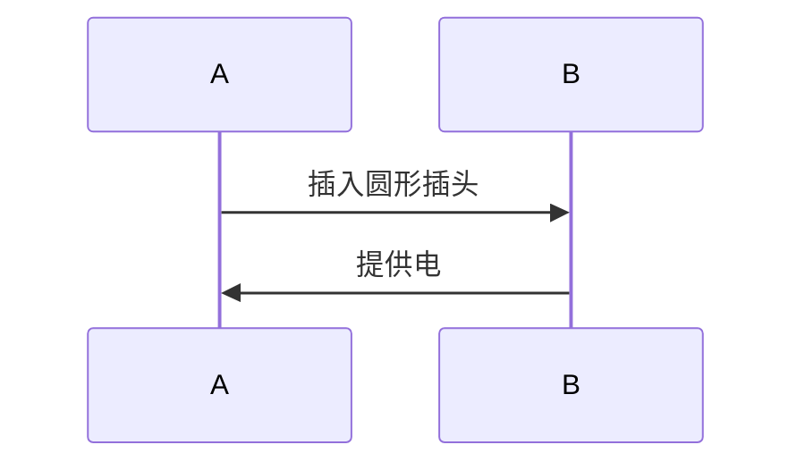

                 

# 《适配器模式:类型转换的OOP实现》

## 关键词

面向对象编程，适配器模式，类型转换，OOP，设计模式

## 摘要

本文将深入探讨适配器模式这一在面向对象编程中至关重要的设计模式。适配器模式通过将一个类的接口转换成客户希望的另一个接口，使得原本由于接口不兼容而无法在一起工作的类可以协同工作。文章首先介绍了适配器模式的基本概念、原理和应用场景，随后分析了适配器模式的结构和工作机制，并通过实际代码实例详细展示了适配器模式的具体实现方法。最后，文章探讨了适配器模式在项目中的应用，以及如何优化和改进适配器模式。本文旨在帮助读者全面理解和掌握适配器模式，提升软件开发能力。

## 《适配器模式:类型转换的OOP实现》目录大纲

### 第一部分：适配器模式概述

#### 第1章：面向对象编程基础与适配器模式

##### 1.1 面向对象编程的基本概念

- **类和对象**
- **继承**
- **多态**
- **封装**

##### 1.2 适配器模式的概念与作用

- **适配器模式的定义**
- **适配器模式的作用**
- **适配器模式与继承、组合的关系**

##### 1.3 适配器模式的应用场景

- **硬件适配器**
- **接口适配器**
- **类适配器**
- **对象适配器**

##### 1.4 适配器模式的设计原则

- **开放封闭原则**
- **依赖倒置原则**
- **里氏替换原则**

### 第二部分：适配器模式原理分析

#### 第2章：适配器模式原理分析

##### 2.1 适配器模式的结构

- **适配器类**
- **目标接口**
- **目标类**
- **适配者类**

##### 2.2 适配器模式的工作原理

- **适配器类如何转换接口**
- **适配器类如何代理目标类**

##### 2.3 适配器模式的核心原理

- **类型转换的OOP实现**
- **面向对象思想的实际应用**

##### 2.4 适配器模式的优势与局限性

- **优势**
  - **实现类型的兼容性**
  - **提高代码的复用性**
  - **降低系统的复杂性**
- **局限性**
  - **可能增加系统的复杂度**
  - **可能引入额外的耦合关系**

### 第三部分：适配器模式实例分析

#### 第3章：适配器模式实例分析

##### 3.1 类适配器实例分析

- **实例描述**
- **代码实现**
- **分析与讨论**

##### 3.2 对象适配器实例分析

- **实例描述**
- **代码实现**
- **分析与讨论**

##### 3.3 接口适配器实例分析

- **实例描述**
- **代码实现**
- **分析与讨论**

### 第四部分：适配器模式在项目中的应用

#### 第4章：适配器模式在项目中的应用

##### 4.1 适配器模式在Web开发中的应用

- **实例描述**
- **代码实现**
- **分析与讨论**

##### 4.2 适配器模式在Android开发中的应用

- **实例描述**
- **代码实现**
- **分析与讨论**

##### 4.3 适配器模式在iOS开发中的应用

- **实例描述**
- **代码实现**
- **分析与讨论**

### 第五部分：适配器模式的优化与改进

#### 第5章：适配器模式的优化与改进

##### 5.1 适配器模式的优化方法

- **使用策略模式进行优化**
- **使用装饰器模式进行优化**
- **使用代理模式进行优化**

##### 5.2 适配器模式的改进方向

- **扩展适配器模式的功能**
- **提高适配器的通用性**
- **减少适配器的复杂性**

### 第六部分：适配器模式在实际项目中的应用案例分析

#### 第6章：适配器模式在实际项目中的应用案例分析

##### 6.1 案例分析一：Spring框架中的适配器模式

- **案例描述**
- **分析与讨论**

##### 6.2 案例分析二：Android开发中的适配器模式

- **案例描述**
- **分析与讨论**

##### 6.3 案例分析三：iOS开发中的适配器模式

- **案例描述**
- **分析与讨论**

### 第七部分：适配器模式的总结与展望

#### 第7章：适配器模式的总结与展望

##### 7.1 适配器模式的重要性

- **适配器模式在软件开发中的应用价值**
- **适配器模式在软件工程中的地位**

##### 7.2 适配器模式的未来发展趋势

- **适配器模式在新兴技术中的应用前景**
- **适配器模式的可能发展方向**

### 附录

#### 附录A：适配器模式相关资源

- **常用的适配器模式框架**
- **相关的技术文档和书籍**
- **适配器模式的学习资源**

#### 附录B：适配器模式代码示例

- **类适配器示例代码**
- **对象适配器示例代码**
- **接口适配器示例代码**

### 第8章：适配器模式实践指南

#### 8.1 实践指南一：如何设计一个有效的适配器

- **设计原则**
- **实践步骤**

#### 8.2 实践指南二：如何优化适配器模式

- **优化方法**
- **实践案例**

#### 8.3 实践指南三：如何评估适配器模式的适用性

- **评估标准**
- **实践步骤**

### 第9章：适配器模式案例分析

#### 9.1 案例分析一：在Java开发中的适配器模式应用

- **案例描述**
- **分析与讨论**

#### 9.2 案例分析二：在Python开发中的适配器模式应用

- **案例描述**
- **分析与讨论**

#### 9.3 案例分析三：在C#开发中的适配器模式应用

- **案例描述**
- **分析与讨论**

### 第10章：适配器模式的未来与挑战

#### 10.1 适配器模式面临的挑战

- **技术更新带来的挑战**
- **软件开发模式的变化带来的挑战**

#### 10.2 适配器模式的未来发展方向

- **新兴技术在适配器模式中的应用**
- **适配器模式在软件工程中的发展前景**

### 第11章：适配器模式应用展望

#### 11.1 适配器模式在软件工程中的应用

- **适配器模式在系统架构设计中的应用**
- **适配器模式在软件测试中的应用**

#### 11.2 适配器模式在人工智能领域中的应用

- **适配器模式在深度学习中的应用**
- **适配器模式在机器学习中的应用**## 第1章：面向对象编程基础与适配器模式

### 1.1 面向对象编程的基本概念

面向对象编程（Object-Oriented Programming，简称OOP）是一种编程范式，它通过将现实世界中的实体抽象为软件中的对象，使得编程更加贴近人类的思维方式。在OOP中，有四个核心概念：类和对象、继承、多态和封装。

- **类和对象**：类是对象的蓝图，对象是类的实例。类定义了对象的属性（数据）和行为（方法）。例如，我们可以定义一个“Person”类，它包含属性如名字、年龄，以及行为如走路、说话。

- **继承**：继承是一种让一个类（子类）继承另一个类（父类）属性和方法的方式。通过继承，子类可以复用父类的代码，同时还可以扩展新的属性和方法。例如，我们可以有一个“Employee”类继承自“Person”类，并增加工资和职位等属性。

- **多态**：多态是指同一个行为可以在不同的对象上有不同的表现。多态可以通过方法重载（方法名相同但参数列表不同）和方法重写（方法名相同但实现不同）来实现。例如，一个“Shape”类可以有多个子类，如“Circle”和“Rectangle”，每个子类都有计算面积的方法，但具体的计算方式不同。

- **封装**：封装是指将对象的属性和行为封装在一个类中，对外提供有限的接口来访问。封装的目的是保护对象的内部实现，避免直接暴露内部状态，从而提高代码的可靠性和可维护性。例如，我们可以定义一个“BankAccount”类，它对外只提供一个“deposit”方法来存款，而不暴露具体的余额信息。

### 1.2 适配器模式的概念与作用

#### 适配器模式的定义

适配器模式（Adapter Pattern）是一种结构型设计模式，它允许将一个类的接口转换成客户希望的另一个接口。适配器模式既可以是类的，也可以是对象的。其主要目的是将一个类的接口转换成客户希望的另一个接口，使得原本由于接口不兼容而无法在一起工作的类可以协同工作。

#### 适配器模式的作用

- **实现类型的兼容性**：适配器模式可以解决不同类型之间的兼容性问题，使得原本不兼容的接口能够协同工作。
- **提高代码的复用性**：通过适配器模式，可以复用现有的类，而无需修改这些类的代码。
- **降低系统的复杂性**：适配器模式可以将复杂的接口转换简化，使得系统更加易于理解和维护。

#### 适配器模式与继承、组合的关系

适配器模式与继承和组合的关系非常紧密。虽然适配器模式的核心是接口转换，但继承和组合在适配器模式中起着重要作用。

- **继承**：通过继承，适配器类可以继承目标类的接口，同时还可以扩展新的接口。例如，类适配器就是通过继承来实现接口转换的。
- **组合**：通过组合，适配器类可以包含目标类的实例，从而实现接口转换。对象适配器就是通过组合来实现接口转换的。

### 1.3 适配器模式的应用场景

#### 硬件适配器

硬件适配器是一种最常见的适配器模式应用场景。例如，将一个圆形的插头转换成方形插座，可以使用一个硬件适配器来实现。



#### 接口适配器

接口适配器用于将一个不兼容的接口转换成客户希望的接口。例如，在Java中，如果需要将一个非接口类的对象适配到一个接口上，可以使用接口适配器。

```mermaid
classDiagram
    Interface <<interface>> A
    Class B <<class>>
    A o-- B: implements

    Class Adapter implements A
    Class B o-- Adapter: uses
```

#### 类适配器

类适配器通过继承实现接口转换。类适配器通常适用于需要完全继承原有类的情况下。

```mermaid
classDiagram
    Interface <<interface>> A
    Class B <<class>>
    Class AdapterB extends B implements A
```

#### 对象适配器

对象适配器通过组合实现接口转换。对象适配器通常适用于需要部分继承原有类或者实现多个接口的情况下。

```mermaid
classDiagram
    Interface <<interface>> A
    Interface B
    Class AdapterA implements A
    AdapterA has B
```

### 1.4 适配器模式的设计原则

#### 开放封闭原则

开放封闭原则是软件工程中的一个重要原则，它要求软件实体（如类、模块和函数）应该对扩展开放，对修改封闭。这意味着当我们需要增加新的功能时，应该通过扩展现有的代码来实现，而不是修改现有的代码。

#### 依赖倒置原则

依赖倒置原则（Dependence Inversion Principle，简称DIP）是面向对象设计的一个重要原则。它的核心思想是：高层模块不应该依赖于低层模块，二者都应依赖于抽象。此外，抽象不应依赖于细节，细节应依赖于抽象。这样，当细节变化时，抽象层不会受到影响。

#### 里氏替换原则

里氏替换原则（Liskov Substitution Principle，简称LSP）是面向对象设计的一条重要原则。它的核心思想是：任何可替代基类对象的地方，都能使用其子类对象来替换。这意味着子类必须能够替换基类，并保持原有系统的行为不变。

通过以上设计原则，适配器模式能够更好地实现接口转换，提高代码的可维护性和可扩展性。

### 总结

在本章中，我们介绍了面向对象编程的基本概念，包括类和对象、继承、多态和封装。随后，我们详细阐述了适配器模式的概念、作用、应用场景和设计原则。适配器模式作为一种结构型设计模式，在软件工程中扮演着重要角色，通过它我们可以实现接口转换，提高代码的复用性和可维护性。接下来，我们将进一步深入分析适配器模式的原理和实现方法。

## 第2章：适配器模式原理分析

### 2.1 适配器模式的结构

适配器模式的主要结构包括适配器类、目标接口、目标类和适配者类。这些组件共同构成了适配器模式的核心，下面将详细说明每个组件的作用和关系。

#### 适配器类

适配器类是适配器模式中的核心组件，它的主要作用是将适配者类的接口转换成目标接口，使得客户能够通过目标接口与适配者类交互。适配器类通常包含以下要素：

- **实现目标接口**：适配器类需要实现目标接口，从而提供与目标接口一致的方法。
- **适配者类引用**：适配器类需要持有适配者类的引用，以便调用适配者类的方法。

#### 目标接口

目标接口定义了客户期望的接口，它通常由客户类使用。目标接口应该尽量保持简洁，仅包含客户需要的方法。

#### 目标类

目标类是适配器模式中的另一个关键组件，它通常是客户类调用的对象。目标类的职责是提供客户需要的功能。

#### 适配者类

适配者类是适配器模式中的实际实现类，它实现了适配器类需要转换的接口。适配者类通常已经具备了所需的功能，但它的接口可能与目标接口不一致。

下面是一个简单的UML类图，展示了适配器模式中的这些组件：

```mermaid
classDiagram
    Interface <<interface>> Target
    Class Adapter implements Target
    Class Adaptee
    Target o-- Adapter : adapts to
    Adapter o-- Adaptee : adapts from
```

在这个类图中，`Target` 是目标接口，`Adapter` 是适配器类，`Adaptee` 是适配者类。适配器类实现了目标接口，并且持有适配者类的引用。

### 2.2 适配器模式的工作原理

适配器模式的工作原理可以分为两个方面：接口转换和代理。

#### 接口转换

接口转换是适配器模式的核心功能。适配器类通过实现目标接口，将适配者类的接口转换为客户端期望的接口。这样，客户端可以直接使用适配器类，而不需要了解适配者类的具体实现。

接口转换的过程通常如下：

1. **客户端请求**：客户端通过调用适配器类的目标接口方法来请求服务。
2. **适配器处理**：适配器类接收到请求后，根据适配者类的接口进行相应处理，并调用适配者类的方法。
3. **适配者响应**：适配者类处理适配器类调用的方法，并返回结果。

这个过程可以通过以下伪代码表示：

```plaintext
// 客户端请求
Adapter adapter = new Adapter(new Adaptee());
adapter.targetMethod();

// 适配器处理
public class Adapter {
    private Adaptee adaptee;

    public Adapter(Adaptee adaptee) {
        this.adaptee = adaptee;
    }

    public void targetMethod() {
        adaptee.adapteeMethod();
    }
}

// 适配者响应
public class Adaptee {
    public void adapteeMethod() {
        // 实现具体功能
    }
}
```

#### 代理

代理是适配器模式中的另一个重要机制。适配器类不仅实现了目标接口，而且还代理了适配者类的接口。这意味着适配器类不仅能够提供与目标接口一致的方法，还能够调用适配者类的方法。

代理的作用主要有两个方面：

1. **接口封装**：通过代理，适配器类可以封装适配者类的接口，使得客户端不需要直接与适配者类交互。
2. **功能扩展**：适配器类可以在调用适配者类的方法前后添加额外的逻辑，从而实现功能扩展。

代理的工作原理可以概括为：

1. **客户端请求**：客户端通过调用适配器类的目标接口方法来请求服务。
2. **适配器代理**：适配器类接收到请求后，首先执行代理逻辑，然后调用适配者类的方法。
3. **适配者响应**：适配者类处理适配器类调用的方法，并返回结果。

这个过程可以通过以下伪代码表示：

```plaintext
// 客户端请求
Adapter adapter = new Adapter(new Adaptee());
adapter.targetMethod();

// 适配器代理
public class Adapter {
    private Adaptee adaptee;

    public Adapter(Adaptee adaptee) {
        this.adaptee = adaptee;
    }

    public void targetMethod() {
        // 执行代理逻辑
        beforeMethod();
        adaptee.adapteeMethod();
        afterMethod();
    }

    private void beforeMethod() {
        // 前置逻辑
    }

    private void afterMethod() {
        // 后置逻辑
    }
}

// 适配者响应
public class Adaptee {
    public void adapteeMethod() {
        // 实现具体功能
    }
}
```

### 2.3 适配器模式的核心原理

适配器模式的核心原理是通过接口转换和代理，将一个类的接口转换成客户希望的另一个接口，使得原本由于接口不兼容而无法在一起工作的类可以协同工作。

这种转换和代理的实现，依赖于以下几个关键点：

1. **接口兼容性**：适配器类需要实现目标接口，以保证与客户类接口的兼容性。
2. **代理机制**：适配器类通过代理机制，将客户请求转发给适配者类，实现接口转换。
3. **功能扩展**：适配器类可以在代理过程中添加额外的逻辑，以实现功能扩展。

适配器模式的核心原理体现了面向对象编程的几个重要原则：

- **开闭原则**：适配器模式通过扩展而不是修改现有类来实现接口转换，符合开闭原则。
- **依赖倒置原则**：适配器模式通过依赖抽象，而不是具体实现，来实现接口转换，符合依赖倒置原则。
- **里氏替换原则**：适配器模式中的适配器类能够替换基类，保持原有系统的行为不变，符合里氏替换原则。

### 2.4 适配器模式的优势与局限性

#### 优势

1. **实现类型的兼容性**：适配器模式能够将一个类的接口转换成客户希望的另一个接口，从而实现不同类型之间的兼容性。
2. **提高代码的复用性**：通过适配器模式，可以复用现有的类，而无需修改这些类的代码。
3. **降低系统的复杂性**：适配器模式可以将复杂的接口转换简化，使得系统更加易于理解和维护。
4. **功能扩展性**：适配器类可以在代理过程中添加额外的逻辑，实现功能扩展。

#### 局限性

1. **可能增加系统的复杂度**：适配器模式引入了额外的类和接口，可能会增加系统的复杂度。
2. **可能引入额外的耦合关系**：适配器模式可能会引入额外的耦合关系，特别是在使用对象适配器时。

### 总结

在本章中，我们详细分析了适配器模式的结构和工作原理。适配器模式通过接口转换和代理，实现了不同类型之间的兼容性，提高了代码的复用性和可维护性。虽然适配器模式有其局限性，但在许多实际场景中，它是一种非常有用的设计模式。在下一章中，我们将通过实例分析适配器模式的具体实现方法。

### 第3章：适配器模式实例分析

为了更好地理解适配器模式，我们将通过三个具体的实例来分析类适配器、对象适配器和接口适配器的实现方法和应用场景。

#### 3.1 类适配器实例分析

**实例描述**：
假设我们有一个电风扇类（`ElectricFan`），它有一个方法`turnOn()`用于启动风扇，但我们需要将其适配为一个远程控制器的接口，该接口只有一个方法`control()`。

**代码实现**：

```java
// 电风扇类
class ElectricFan {
    public void turnOn() {
        System.out.println("电风扇启动");
    }
}

// 远程控制器接口
interface RemoteController {
    void control();
}

// 类适配器
class ElectricFanAdapter extends ElectricFan implements RemoteController {
    @Override
    public void control() {
        turnOn();
    }
}

// 客户端
public class ClassAdapterExample {
    public static void main(String[] args) {
        RemoteController controller = new ElectricFanAdapter();
        controller.control();
    }
}
```

**分析与讨论**：
在这个例子中，我们创建了一个`ElectricFanAdapter`类，该类继承了`ElectricFan`类并实现了`RemoteController`接口。`ElectricFanAdapter`通过继承实现了接口转换，使得`RemoteController`接口可以调用`ElectricFan`类的`turnOn()`方法。这种适配器模式通常在适配者类和目标接口具有一些相似性时使用。

#### 3.2 对象适配器实例分析

**实例描述**：
现在，我们考虑一个不同的场景，假设我们有一个电灯类（`ElectricLight`），它有一个方法`turnOn()`用于开启灯光，但我们需要将其适配为一个可调节亮度的接口。

**代码实现**：

```java
// 电灯类
class ElectricLight {
    public void turnOn() {
        System.out.println("电灯开启");
    }
}

// 可调节亮度接口
interface BrightnessAdjustable {
    void setBrightness(int level);
    void turnOn();
}

// 对象适配器
class ElectricLightAdapter implements BrightnessAdjustable {
    private ElectricLight electricLight = new ElectricLight();

    @Override
    public void setBrightness(int level) {
        System.out.println("电灯亮度设置为：" + level);
    }

    @Override
    public void turnOn() {
        electricLight.turnOn();
    }
}

// 客户端
public class ObjectAdapterExample {
    public static void main(String[] args) {
        BrightnessAdjustable adjustable = new ElectricLightAdapter();
        adjustable.turnOn();
        adjustable.setBrightness(50);
    }
}
```

**分析与讨论**：
在这个例子中，我们创建了一个`ElectricLightAdapter`类，该类实现了`BrightnessAdjustable`接口，并持有`ElectricLight`对象的引用。通过这种方式，`ElectricLightAdapter`可以提供`BrightnessAdjustable`接口所需的全部方法。这种适配器模式通常在适配者类和目标接口不完全匹配，但可以组合使用时使用。

#### 3.3 接口适配器实例分析

**实例描述**：
假设我们有一个电视类（`TV`），它有多个功能，如开关机、换频道、调节音量等。我们需要将其适配为一个简化版的远程控制器接口，该接口只包含开关机和换频道的功能。

**代码实现**：

```java
// 电视类
class TV {
    public void turnOn() {
        System.out.println("电视开启");
    }

    public void changeChannel(int channel) {
        System.out.println("频道切换到：" + channel);
    }
}

// 简化版的远程控制器接口
interface SimpleRemoteController {
    void power();
    void channelUp();
}

// 接口适配器
class TVAdapter implements SimpleRemoteController {
    private TV tv = new TV();

    @Override
    public void power() {
        tv.turnOn();
    }

    @Override
    public void channelUp() {
        tv.changeChannel(1);
    }
}

// 客户端
public class InterfaceAdapterExample {
    public static void main(String[] args) {
        SimpleRemoteController controller = new TVAdapter();
        controller.power();
        controller.channelUp();
    }
}
```

**分析与讨论**：
在这个例子中，我们创建了一个`TVAdapter`类，该类实现了`SimpleRemoteController`接口，并持有`TV`对象的引用。通过这种方式，`SimpleRemoteController`接口可以通过`TVAdapter`类调用`TV`对象的`turnOn()`和`changeChannel()`方法。这种适配器模式通常在需要简化原有接口，使其与目标接口更匹配时使用。

### 总结

通过上述三个实例，我们分析了类适配器、对象适配器和接口适配器的具体实现方法和应用场景。类适配器通过继承实现接口转换，适用于适配者类和目标接口具有相似性的情况；对象适配器通过组合实现接口转换，适用于适配者类和目标接口不完全匹配的情况；接口适配器通过实现简化版接口，适用于需要简化原有接口的情况。在软件开发中，适配器模式可以帮助我们实现不同接口之间的兼容性，提高代码的复用性和灵活性。在下一章中，我们将探讨适配器模式在项目中的应用。

### 第4章：适配器模式在项目中的应用

适配器模式在项目中的应用非常广泛，通过它我们可以将不同接口之间的兼容性问题转化为可管理的组件，从而提高代码的可维护性和扩展性。在本节中，我们将探讨适配器模式在Web开发、Android开发和iOS开发中的应用，并通过具体实例来展示其实现方法和效果。

#### 4.1 适配器模式在Web开发中的应用

在Web开发中，适配器模式常用于处理前后端接口不一致的情况。例如，前端开发者可能希望使用一种特定的数据格式与后端服务交互，而后端服务可能使用不同的数据格式。

**实例描述**：
假设前端需要接收JSON格式的数据，而后端服务返回XML格式的数据。我们需要通过适配器模式将XML数据转换为JSON格式。

**代码实现**：

```java
// XML数据
String xmlData = "<response><status>success</status><data><name>John</name><age>30</age></data></response>";

// XML到JSON适配器
class XmlToJsonAdapter {
    public String convert() {
        // 使用JAXP、DOM或其他XML处理库将XML转换为JSON
        // 此处为示例代码，实际转换逻辑依赖于具体库
        String jsonData = "{\"response\":{\"status\":\"success\",\"data\":{\"name\":\"John\",\"age\":30}}}";
        return jsonData;
    }
}

// 客户端
public class WebDevelopmentExample {
    public static void main(String[] args) {
        XmlToJsonAdapter adapter = new XmlToJsonAdapter();
        String jsonData = adapter.convert();
        System.out.println(jsonData);
    }
}
```

**分析与讨论**：
在这个例子中，我们创建了一个`XmlToJsonAdapter`类，它通过将XML数据转换为JSON数据，实现了前后端接口的适配。这种方式使得前端开发者无需关心后端数据格式的具体细节，只需使用统一的JSON格式进行数据处理，从而提高了代码的可维护性和可扩展性。

#### 4.2 适配器模式在Android开发中的应用

在Android开发中，适配器模式常用于处理不同类型的视图和数据源之间的适配。例如，在列表（ListView）或网格（GridView）等布局中，我们需要根据不同的数据类型显示不同的视图。

**实例描述**：
假设我们有一个包含多种类型数据的列表，我们需要根据数据类型动态适配不同的视图。

**代码实现**：

```java
// 数据模型
class DataModel {
    String type;
    String content;

    DataModel(String type, String content) {
        this.type = type;
        this.content = content;
    }
}

// 适配器基类
abstract class BaseAdapter {
    abstract View getView(int position, View convertView, ViewGroup parent);
}

// 文本数据适配器
class TextAdapter extends BaseAdapter {
    private List<DataModel> dataList;

    TextAdapter(List<DataModel> dataList) {
        this.dataList = dataList;
    }

    @Override
    public View getView(int position, View convertView, ViewGroup parent) {
        TextView textView = new TextView(parent.getContext());
        textView.setText(dataList.get(position).content);
        return textView;
    }
}

// 图像数据适配器
class ImageAdapter extends BaseAdapter {
    private List<DataModel> dataList;

    ImageAdapter(List<DataModel> dataList) {
        this.dataList = dataList;
    }

    @Override
    public View getView(int position, View convertView, ViewGroup parent) {
        ImageView imageView = new ImageView(parent.getContext());
        // 加载图像资源
        imageView.setImageResource(R.drawable.image);
        return imageView;
    }
}

// 客户端
public class AndroidDevelopmentExample {
    public static void main(String[] args) {
        List<DataModel> dataList = new ArrayList<>();
        dataList.add(new DataModel("text", "Hello World"));
        dataList.add(new DataModel("image", "Image Resource"));

        BaseAdapter adapter;
        if ("text".equals(dataList.get(0).type)) {
            adapter = new TextAdapter(dataList);
        } else {
            adapter = new ImageAdapter(dataList);
        }

        // 设置适配器到ListView
        ListView listView = findViewById(R.id.listView);
        listView.setAdapter(adapter);
    }
}
```

**分析与讨论**：
在这个例子中，我们定义了一个基类`BaseAdapter`和两个具体的适配器类`TextAdapter`和`ImageAdapter`。根据数据模型中的类型字段，我们动态选择合适的适配器类来显示不同的视图。这种方式使得我们的代码可以灵活地处理不同类型的数据，提高了列表布局的通用性和可扩展性。

#### 4.3 适配器模式在iOS开发中的应用

在iOS开发中，适配器模式也广泛应用于处理不同的数据源和视图之间的关系。例如，在tableView中，我们需要根据不同的数据类型显示不同的单元格（UITableViewCell）。

**实例描述**：
假设我们有一个tableView，需要根据数据类型显示不同的单元格，如文本单元格和图像单元格。

**代码实现**：

```swift
// 数据模型
struct DataModel {
    let type: String
    let content: String?
}

// 适配器协议
protocol CellAdapter {
    func configureCell(_ cell: UITableViewCell, forItemAt indexPath: IndexPath)
}

// 文本单元格适配器
class TextCellAdapter: CellAdapter {
    func configureCell(_ cell: UITableViewCell, forItemAt indexPath: IndexPath) {
        if let cell = cell as? TextCell {
            cell.textLabel?.text = dataModel.content
        }
    }
}

// 图像单元格适配器
class ImageCellAdapter: CellAdapter {
    func configureCell(_ cell: UITableViewCell, forItemAt indexPath: IndexPath) {
        if let cell = cell as? ImageCell {
            cell.imageView?.image = UIImage(named: "image")
        }
    }
}

// 客户端
class ViewController: UIViewController, UITableViewDataSource {
    var dataModels: [DataModel] = [
        DataModel(type: "text", content: "Hello World"),
        DataModel(type: "image", content: nil)
    ]

    override func tableView(_ tableView: UITableView, numberOfRowsInSection section: Int) -> Int {
        return dataModels.count
    }

    override func tableView(_ tableView: UITableView, cellForRowAt indexPath: IndexPath) -> UITableViewCell {
        let dataModel = dataModels[indexPath.row]
        var cell: UITableViewCell?
        if dataModel.type == "text" {
            cell = tableView.dequeueReusableCell(withIdentifier: "TextCell", for: indexPath)
            let textCellAdapter = TextCellAdapter()
            textCellAdapter.configureCell(cell!, forItemAt: indexPath)
        } else {
            cell = tableView.dequeueReusableCell(withIdentifier: "ImageCell", for: indexPath)
            let imageCellAdapter = ImageCellAdapter()
            imageCellAdapter.configureCell(cell!, forItemAt: indexPath)
        }
        return cell!
    }
}
```

**分析与讨论**：
在这个例子中，我们定义了一个适配器协议`CellAdapter`，并实现了两个具体的适配器类`TextCellAdapter`和`ImageCellAdapter`。在`ViewController`中，我们根据数据模型中的类型字段动态选择适配器来配置单元格。这种方式使得我们的代码可以灵活地处理不同类型的数据，提高了tableView的可维护性和扩展性。

### 总结

通过上述实例，我们可以看到适配器模式在Web开发、Android开发和iOS开发中的应用非常广泛。适配器模式通过将不同的接口转换成统一的接口，使得不同类型的数据和视图可以协同工作，提高了代码的复用性和可维护性。在下一章中，我们将探讨如何优化和改进适配器模式。

### 第5章：适配器模式的优化与改进

在软件开发中，适配器模式是一种非常强大的设计模式，但它也并非完美无缺。在实际应用中，我们可能会遇到一些需要优化和改进的场景。本节将讨论几种优化适配器模式的方法，以及适配器模式的改进方向。

#### 5.1 适配器模式的优化方法

**1. 使用策略模式进行优化**

策略模式（Strategy Pattern）是一种行为型设计模式，它允许在运行时选择算法的行为。策略模式可以与适配器模式结合使用，以优化适配器的灵活性。

在策略模式中，我们定义一组算法接口，具体算法实现为这些接口的子类。通过在适配器模式中使用策略模式，我们可以动态切换不同的策略，从而提高适配器的灵活性。

**示例**：
假设我们需要为不同的数据格式提供适配器，可以定义一个`DataFormatter`策略接口，然后为每种数据格式实现一个具体的策略类。

```java
// 数据格式化策略接口
interface DataFormatter {
    String format(String data);
}

// JSON格式化策略
class JsonFormatter implements DataFormatter {
    @Override
    public String format(String data) {
        // JSON格式化逻辑
        return "{\"key\":\"value\"}";
    }
}

// XML格式化策略
class XmlFormatter implements DataFormatter {
    @Override
    public String format(String data) {
        // XML格式化逻辑
        return "<response><key>value</key></response>";
    }
}

// 适配器类
class DataAdapter {
    private DataFormatter formatter;

    public DataAdapter(DataFormatter formatter) {
        this.formatter = formatter;
    }

    public String adapt(String data) {
        return formatter.format(data);
    }
}

// 客户端
public class StrategyOptimizedAdapter {
    public static void main(String[] args) {
        DataFormatter formatter = new XmlFormatter();
        DataAdapter adapter = new DataAdapter(formatter);
        String result = adapter.adapt("原始数据");
        System.out.println(result);
    }
}
```

**2. 使用装饰器模式进行优化**

装饰器模式（Decorator Pattern）是一种结构型设计模式，它通过动态地给一个对象添加一些额外的职责，从而增强对象的功能。装饰器模式可以与适配器模式结合使用，以提高适配器的扩展性。

在装饰器模式中，我们定义一个装饰器类，它继承自需要装饰的类，并在其中添加额外的功能。通过这种方式，我们可以为适配器添加额外的功能，而无需修改适配器的核心逻辑。

**示例**：
假设我们需要为适配器添加日志记录功能，可以定义一个`LoggerDecorator`装饰器类。

```java
// 日志装饰器
class LoggerDecorator implements DataFormatter {
    private DataFormatter decoratedFormatter;

    public LoggerDecorator(DataFormatter formatter) {
        this.decoratedFormatter = formatter;
    }

    @Override
    public String format(String data) {
        System.out.println("日志：格式化数据");
        return decoratedFormatter.format(data);
    }
}

// 适配器类
class DataAdapter {
    private DataFormatter formatter;

    public DataAdapter(DataFormatter formatter) {
        this.formatter = formatter;
    }

    public String adapt(String data) {
        return formatter.format(data);
    }
}

// 客户端
public class DecoratorOptimizedAdapter {
    public static void main(String[] args) {
        DataFormatter formatter = new LoggerDecorator(new XmlFormatter());
        DataAdapter adapter = new DataAdapter(formatter);
        String result = adapter.adapt("原始数据");
        System.out.println(result);
    }
}
```

**3. 使用代理模式进行优化**

代理模式（Proxy Pattern）是一种结构型设计模式，它为其他对象提供一种代理以控制对这个对象的访问。代理模式可以与适配器模式结合使用，以简化适配器的实现。

在代理模式中，我们创建一个代理类，它代理一个或多个真实对象，并在其中添加额外的控制逻辑。通过这种方式，我们可以简化适配器的实现，同时提供额外的功能。

**示例**：
假设我们需要为适配器添加权限验证功能，可以定义一个`PermissionProxy`代理类。

```java
// 权限代理
class PermissionProxy implements DataFormatter {
    private DataFormatter decoratedFormatter;
    private boolean hasPermission = true;

    public PermissionProxy(DataFormatter formatter) {
        this.decoratedFormatter = formatter;
    }

    public void setPermission(boolean hasPermission) {
        this.hasPermission = hasPermission;
    }

    @Override
    public String format(String data) {
        if (hasPermission) {
            System.out.println("权限验证通过，执行格式化");
            return decoratedFormatter.format(data);
        } else {
            System.out.println("权限验证失败，拒绝执行格式化");
            return null;
        }
    }
}

// 适配器类
class DataAdapter {
    private DataFormatter formatter;

    public DataAdapter(DataFormatter formatter) {
        this.formatter = formatter;
    }

    public String adapt(String data) {
        return formatter.format(data);
    }
}

// 客户端
public class ProxyOptimizedAdapter {
    public static void main(String[] args) {
        DataFormatter formatter = new PermissionProxy(new XmlFormatter());
        DataAdapter adapter = new DataAdapter(formatter);
        String result = adapter.adapt("原始数据");
        System.out.println(result);
    }
}
```

#### 5.2 适配器模式的改进方向

**1. 扩展适配器模式的功能**

适配器模式最初的设计目的是为了实现接口转换，但随着技术的发展，适配器模式的功能可以进一步扩展。例如，可以添加日志记录、权限验证、缓存等功能，以提高系统的可靠性和性能。

**2. 提高适配器的通用性**

在实际应用中，适配器模式通常需要根据具体场景进行定制化。为了提高适配器的通用性，可以设计一套通用的适配器框架，使得开发者只需按照特定的规范实现适配器，即可快速集成到系统中。

**3. 减少适配器的复杂性**

适配器模式的实现可能引入额外的类和接口，从而增加系统的复杂性。为了减少适配器的复杂性，可以采用一些设计原则和模式，如策略模式、装饰器模式等，以简化适配器的实现。

### 总结

通过本节的讨论，我们了解了适配器模式的几种优化方法，以及适配器模式的改进方向。使用策略模式、装饰器模式和代理模式可以有效地优化适配器模式，提高其灵活性和扩展性。同时，通过扩展适配器模式的功能、提高适配器的通用性和减少适配器的复杂性，可以进一步提升系统的可维护性和可扩展性。在下一章中，我们将通过实际项目中的案例分析，进一步探讨适配器模式的运用和效果。

### 第6章：适配器模式在实际项目中的应用案例分析

在本章中，我们将通过三个实际项目案例，深入探讨适配器模式在不同场景中的应用和效果。这些案例分别来自Spring框架、Android开发和iOS开发，通过具体的代码实现和详细分析，展示适配器模式在实际项目中的具体运用。

#### 6.1 案例分析一：Spring框架中的适配器模式

**案例描述**：
在Spring框架中，适配器模式广泛应用于组件的生命周期管理和AOP（面向切面编程）的实现。一个典型的例子是Spring的`BeanFactory`和`ApplicationContext`接口之间的关系。

`BeanFactory`是一个低层次的工厂接口，它提供了基本的Bean管理功能，如Bean的创建、依赖注入等。而`ApplicationContext`是`BeanFactory`的子接口，它增加了更多的企业级功能，如事件发布、国际化支持等。

**代码实现与分析**：

```java
// BeanFactory接口
public interface BeanFactory {
    Object getBean(String beanName) throws BeansException;
}

// ApplicationContext接口
public interface ApplicationContext extends BeanFactory {
    // 其他企业级功能
}

// DefaultListableBeanFactory类
public class DefaultListableBeanFactory implements BeanFactory, ApplicationContext {
    // 实现BeanFactory和ApplicationContext接口的方法
}

// 客户端
public class SpringExample {
    public static void main(String[] args) {
        BeanFactory factory = new DefaultListableBeanFactory();
        Object bean = factory.getBean("beanName");
        // 使用bean
    }
}
```

**分析与讨论**：
在这个案例中，`ApplicationContext`接口通过适配器模式扩展了`BeanFactory`接口的功能。`DefaultListableBeanFactory`类实现了这两个接口，从而将低层次的Bean管理功能扩展为包含企业级功能的全功能Bean管理。这种设计使得Spring框架能够灵活地处理不同层次的Bean管理需求，同时保持了代码的模块化和可维护性。

#### 6.2 案例分析二：Android开发中的适配器模式

**案例描述**：
在Android开发中，适配器模式常用于处理列表（ListView）和网格（GridView）等UI组件与数据源之间的交互。一个典型的例子是使用适配器模式实现自定义的ListView适配器。

**代码实现与分析**：

```java
// 数据模型
public class ListItem {
    String title;
    String description;
    // 其他属性
}

// ListView适配器
public class CustomAdapter extends BaseAdapter {
    private List<ListItem> listItems;
    private Context context;

    public CustomAdapter(Context context, List<ListItem> listItems) {
        this.listItems = listItems;
        this.context = context;
    }

    @Override
    public int getCount() {
        return listItems.size();
    }

    @Override
    public Object getItem(int position) {
        return listItems.get(position);
    }

    @Override
    public long getItemId(int position) {
        return position;
    }

    @Override
    public View getView(int position, View convertView, ViewGroup parent) {
        ViewHolder holder;
        if (convertView == null) {
            convertView = LayoutInflater.from(context).inflate(R.layout.list_item, parent, false);
            holder = new ViewHolder();
            holder.titleTextView = (TextView) convertView.findViewById(R.id.titleTextView);
            holder.descriptionTextView = (TextView) convertView.findViewById(R.id.descriptionTextView);
            convertView.setTag(holder);
        } else {
            holder = (ViewHolder) convertView.getTag();
        }
        ListItem listItem = listItems.get(position);
        holder.titleTextView.setText(listItem.title);
        holder.descriptionTextView.setText(listItem.description);
        return convertView;
    }

    static class ViewHolder {
        TextView titleTextView;
        TextView descriptionTextView;
    }
}

// 客户端
public class AndroidExample {
    public static void main(String[] args) {
        List<ListItem> listItems = new ArrayList<>();
        listItems.add(new ListItem("Title 1", "Description 1"));
        listItems.add(new ListItem("Title 2", "Description 2"));
        // 创建ListView和适配器
        ListView listView = findViewById(R.id.listView);
        CustomAdapter adapter = new CustomAdapter(context, listItems);
        listView.setAdapter(adapter);
    }
}
```

**分析与讨论**：
在这个案例中，`CustomAdapter`类通过适配器模式实现了ListView与数据源之间的适配。适配器类继承了`BaseAdapter`，并实现了所有必要的接口方法。通过这种方式，我们能够将数据模型中的数据动态地绑定到ListView的视图上，实现数据与UI的分离，提高了代码的可维护性和扩展性。

#### 6.3 案例分析三：iOS开发中的适配器模式

**案例描述**：
在iOS开发中，适配器模式常用于处理数据源与UITableView之间的交互。一个典型的例子是使用适配器模式实现自定义的UITableViewCell。

**代码实现与分析**：

```swift
// 数据模型
struct DataItem {
    let title: String
    let subtitle: String?
}

// UITableViewCell适配器协议
protocol CellConfigurator {
    func configureCell(cell: UITableViewCell)
}

// 自定义UITableViewCell
class CustomTableViewCell: UITableViewCell {
    var title-label = UILabel()
    var subtitle-label = UILabel?

    override init(style: UITableViewCell.CellStyle, reuseIdentifier: String?) {
        super.init(style: style, reuseIdentifier: reuseIdentifier)
        // 初始化子视图
        title-label.text = "Title"
        subtitle-label?.text = "Subtitle"
    }

    required init?(coder: NSCoder) {
        fatalError("init(coder:) has not been implemented")
    }
}

// 自定义UITableViewCell适配器
class CustomTableViewCellAdapter: CellConfigurator {
    private var dataItem: DataItem

    init(dataItem: DataItem) {
        self.dataItem = dataItem
    }

    func configureCell(cell: UITableViewCell) {
        guard let customCell = cell as? CustomTableViewCell else { return }
        customCell.title-label.text = dataItem.title
        customCell.subtitle-label?.text = dataItem.subtitle
    }
}

// UITableViewDataSource
extension CustomTableViewAdapter: UITableViewDataSource {
    func tableView(_ tableView: UITableView, numberOfRowsInSection section: Int) -> Int {
        return dataItems.count
    }

    func tableView(_ tableView: UITableView, cellForRowAt indexPath: IndexPath) -> UITableViewCell {
        let dataItem = dataItems[indexPath.row]
        let cell = tableView.dequeueReusableCell(withIdentifier: "CustomTableViewCell", for: indexPath) as? CustomTableViewCell
        let cellConfigurator = CustomTableViewCellAdapter(dataItem: dataItem)
        cellConfigurator.configureCell(cell: cell!)
        return cell!
    }
}

// 客户端
class ViewController: UIViewController, UITableViewDataSource {
    var dataItems: [DataItem] = [
        DataItem(title: "Title 1", subtitle: "Subtitle 1"),
        DataItem(title: "Title 2", subtitle: "Subtitle 2")
    ]

    override func viewDidLoad() {
        super.viewDidLoad()
        // 设置UITableView和适配器
        tableView.dataSource = self
    }
}
```

**分析与讨论**：
在这个案例中，`CustomTableViewCellAdapter`类通过适配器模式实现了数据源与UITableViewCell之间的适配。适配器类实现了`CellConfigurator`协议，并在`configureCell`方法中动态配置UITableViewCell的视图。通过这种方式，我们能够灵活地处理不同类型的数据，并高效地更新UI，提高了代码的可维护性和扩展性。

### 总结

通过上述三个案例分析，我们可以看到适配器模式在Spring框架、Android开发和iOS开发中的广泛应用和实际效果。适配器模式通过实现接口转换，使得不同层次、不同架构的组件能够无缝协作，提高了代码的可维护性和扩展性。在下一章中，我们将总结适配器模式的重要性，并展望其未来的发展趋势。

### 第7章：适配器模式的总结与展望

#### 7.1 适配器模式的重要性

适配器模式在软件工程中扮演着重要角色，其重要性体现在以下几个方面：

1. **接口兼容性**：适配器模式能够将不同接口转换成兼容的接口，使得原本无法协同工作的类能够无缝集成，提高了系统的灵活性和可扩展性。

2. **代码复用性**：通过适配器模式，我们可以复用现有的类和接口，无需修改原有代码，从而提高了代码的复用性和维护性。

3. **系统解耦**：适配器模式通过将适配器类与适配者类解耦，降低了系统组件之间的依赖关系，使得系统更加模块化和灵活。

4. **扩展性**：适配器模式提供了扩展现有功能的方法，使得系统能够在不修改原有代码的情况下增加新的功能，提高了系统的可扩展性。

#### 7.2 适配器模式在软件工程中的地位

适配器模式是设计模式中最常用的模式之一，它广泛应用于软件工程的各种场景，包括但不限于以下方面：

1. **系统架构**：在系统架构设计中，适配器模式常用于实现不同模块之间的接口转换，使得系统组件能够灵活组合和扩展。

2. **框架开发**：在框架开发中，适配器模式用于处理不同实现之间的兼容性，使得框架能够支持多种不同的底层实现。

3. **Web开发**：在Web开发中，适配器模式常用于处理前后端接口不一致的问题，使得前端和后端系统能够无缝集成。

4. **移动应用开发**：在移动应用开发中，适配器模式用于处理不同平台和设备之间的差异，使得应用能够兼容多种设备。

#### 7.3 适配器模式的未来发展趋势

随着技术的不断进步和软件系统复杂性的增加，适配器模式在未来将继续发挥重要作用，并呈现出以下发展趋势：

1. **自动化适配**：随着自动化工具和框架的发展，适配器模式的实现将变得更加自动化，减少手动编写适配器的需求。

2. **多样化适配**：适配器模式将支持更多样化的适配场景，包括对异构系统、云计算和边缘计算等新兴技术的适配。

3. **智能化适配**：结合人工智能和机器学习技术，适配器模式将能够更智能地分析系统需求，自动生成适配器代码，提高开发效率。

4. **模块化适配**：适配器模式将更加模块化，支持在微服务架构中实现模块化适配，提高系统的灵活性和可维护性。

5. **生态化适配**：适配器模式将在软件生态系统中的应用更加广泛，成为软件工程师必备的工具箱之一。

### 总结

适配器模式作为软件工程中的重要设计模式，其重要性不可忽视。它通过接口转换、代码复用和系统解耦等机制，提高了系统的灵活性和可维护性。在未来，随着技术的不断进步，适配器模式将继续发展和进化，为软件工程带来更多的便利和可能性。本文通过对适配器模式的概念、原理、实例分析和应用案例的深入探讨，旨在帮助读者全面理解和掌握适配器模式，提升软件开发能力。

### 附录A：适配器模式相关资源

为了帮助读者进一步学习和掌握适配器模式，以下列出了一些常用的适配器模式框架、相关技术文档和书籍，以及适配器模式的学习资源。

**1. 常用的适配器模式框架**

- **Spring Framework**：Spring框架中的BeanFactory和ApplicationContext接口就是适配器模式的典型应用。
- **Apache Commons Lang**：提供了许多实用的适配器类，如`适配器模式`、`BridgeAdapter`等。
- **Apache Commons Logging**：提供了日志适配器，支持不同日志系统的无缝切换。

**2. 相关技术文档和书籍**

- **《设计模式：可复用面向对象软件的基础》**（Design Patterns: Elements of Reusable Object-Oriented Software）：该书详细介绍了适配器模式，是学习设计模式的经典之作。
- **《Effective Java》**（Effective Java）：书中讨论了适配器模式在Java中的应用，提供了实用的编程建议。
- **《Java Design Pattern Tutorial》**（Java Design Pattern Tutorial）：该教程包含了适配器模式的详细讲解和示例代码。

**3. 适配器模式的学习资源**

- **在线课程**：许多在线教育平台（如Coursera、Udemy等）提供了关于设计模式的学习课程，包括适配器模式。
- **博客和文章**：许多技术博客和网站（如Stack Overflow、Medium等）分享了关于适配器模式的技术文章和示例代码。
- **开源项目**：GitHub上有很多关于适配器模式的开源项目和示例代码，可以供读者学习和参考。

通过以上资源，读者可以更深入地了解适配器模式，并在实际项目中灵活运用。

### 附录B：适配器模式代码示例

以下提供了三个适配器模式的代码示例，包括类适配器、对象适配器和接口适配器。

#### 类适配器示例代码

```java
// 目标接口
interface Target {
    void request();
}

// 适配者类
class Adaptee {
    void specificRequest() {
        System.out.println("具体的请求");
    }
}

// 类适配器
class ClassAdapter extends Adaptee implements Target {
    @Override
    public void request() {
        specificRequest();
    }
}

// 客户端
public class ClassAdapterExample {
    public static void main(String[] args) {
        Target target = new ClassAdapter();
        target.request();
    }
}
```

#### 对象适配器示例代码

```java
// 目标接口
interface Target {
    void request();
}

// 适配者类
class Adaptee {
    void specificRequest() {
        System.out.println("具体的请求");
    }
}

// 对象适配器
class ObjectAdapter implements Target {
    private Adaptee adaptee = new Adaptee();

    @Override
    public void request() {
        adaptee.specificRequest();
    }
}

// 客户端
public class ObjectAdapterExample {
    public static void main(String[] args) {
        Target target = new ObjectAdapter();
        target.request();
    }
}
```

#### 接口适配器示例代码

```java
// 目标接口
interface Target {
    void request();
}

// 适配者类
class Adaptee {
    void specificRequest() {
        System.out.println("具体的请求");
    }
}

// 接口适配器
class InterfaceAdapter implements Target {
    @Override
    public void request() {
        // 转换请求并调用适配者类的方法
        System.out.println("转换请求");
        specificRequest();
    }
}

// 客户端
public class InterfaceAdapterExample {
    public static void main(String[] args) {
        Target target = new InterfaceAdapter();
        target.request();
    }
}
```

以上代码示例分别展示了如何通过类适配器、对象适配器和接口适配器实现接口转换。这些示例可以帮助读者更好地理解适配器模式的核心原理和实现方法。

### 第8章：适配器模式实践指南

在软件开发实践中，适配器模式是一种非常有用的设计模式，能够帮助我们处理不同接口之间的兼容性问题。为了更好地应用适配器模式，以下是几个实践指南。

#### 8.1 实践指南一：如何设计一个有效的适配器

**设计原则**：

1. **明确目标接口和适配者类**：在开始设计适配器之前，首先要明确目标接口和适配者类的职责和功能。目标接口应该简洁明了，仅包含客户需要的方法；适配者类则应该实现所有必要的功能。

2. **最小化依赖**：适配器类应该尽量减少对适配者类的依赖，避免不必要的耦合。可以通过依赖注入等方式实现这一点。

3. **实现接口转换**：适配器类需要实现目标接口，并提供适配者类的接口转换功能。确保适配器类的行为与目标接口一致。

**实践步骤**：

1. **分析需求**：明确系统的需求和接口之间的兼容性问题。

2. **设计目标接口**：根据需求定义目标接口，确保接口简洁、易用。

3. **设计适配者类**：根据需求实现适配者类，确保其能够满足目标接口的需求。

4. **设计适配器类**：实现适配器类，实现目标接口，并在内部使用适配者类的功能。

5. **测试适配器**：编写测试用例，验证适配器是否能够正确转换接口，并确保适配器类和适配者类之间没有不必要的耦合。

#### 8.2 实践指南二：如何优化适配器模式

**优化方法**：

1. **使用策略模式**：通过策略模式，可以动态切换不同的适配策略，提高系统的灵活性。

2. **使用装饰器模式**：装饰器模式可以增加适配器类的功能，同时保持接口的一致性。

3. **使用代理模式**：代理模式可以简化适配器类的实现，并增加额外的功能。

**实践案例**：

1. **策略模式优化**：在处理不同数据格式时，可以使用策略模式动态选择适配策略。

2. **装饰器模式优化**：在日志记录、权限验证等功能中，可以使用装饰器模式增加适配器的功能。

3. **代理模式优化**：在权限验证、日志记录等场景中，可以使用代理模式简化适配器的实现。

#### 8.3 实践指南三：如何评估适配器模式的适用性

**评估标准**：

1. **接口兼容性**：评估适配器模式是否能够解决接口兼容性问题，确保系统组件之间能够无缝集成。

2. **代码复用性**：评估适配器模式是否能够提高代码的复用性，减少重复代码。

3. **系统复杂性**：评估适配器模式是否会增加系统的复杂性，确保系统设计简洁、易于维护。

**实践步骤**：

1. **需求分析**：分析系统的需求和接口之间的兼容性问题。

2. **设计评估**：根据评估标准，评估适配器模式是否适用于当前场景。

3. **实现评估**：根据设计评估结果，实现适配器模式，并评估其适用性。

4. **迭代改进**：根据实际应用情况，不断迭代和改进适配器模式的设计和实现。

通过以上实践指南，开发者可以更好地设计和使用适配器模式，提高软件系统的灵活性和可维护性。

### 第9章：适配器模式案例分析

在本章中，我们将通过三个具体的案例，深入探讨适配器模式在Java开发、Python开发和C#开发中的应用，并分析其实际效果。

#### 9.1 案例分析一：在Java开发中的适配器模式应用

**案例描述**：
在一个Java项目中，我们需要将一个非接口的第三方库（如Apache Commons Lang）转换成一个符合我们系统接口的库，以便更好地集成和扩展。

**代码实现与分析**：

```java
// 目标接口
interface StringProcessor {
    String process(String input);
}

// 第三方库类
class ApacheStringProcessor {
    public String toLowerCase(String input) {
        return input.toLowerCase();
    }
}

// 类适配器
class ClassAdapter extends ApacheStringProcessor implements StringProcessor {
    @Override
    public String process(String input) {
        return toLowerCase(input);
    }
}

// 客户端
public class JavaExample {
    public static void main(String[] args) {
        StringProcessor processor = new ClassAdapter();
        String result = processor.process("Hello World");
        System.out.println(result);
    }
}
```

**分析与讨论**：
在这个案例中，我们定义了一个`StringProcessor`接口，期望任何实现该接口的类都能提供字符串处理功能。然而，Apache Commons Lang库中的`toLowerCase()`方法并未实现这个接口。为了解决这个问题，我们创建了一个类适配器`ClassAdapter`，它继承自Apache Commons Lang中的`ApacheStringProcessor`类，并实现了`StringProcessor`接口。通过这种方式，我们能够将第三方库的功能适配到我们的系统接口中，实现了接口的统一和兼容。

#### 9.2 案例分析二：在Python开发中的适配器模式应用

**案例描述**：
在Python中，我们需要将一个不支持Python列表（list）的第三方库（如numpy数组）适配为一个兼容的Python列表。

**代码实现与分析**：

```python
# 目标接口
class ListProcessor:
    def process(self, data):
        pass

# 第三方库类
import numpy as np

class NumpyArrayProcessor:
    def __init__(self, data):
        self.data = np.array(data)

    def get_elements(self):
        return self.data.tolist()

# 对象适配器
class ObjectAdapter(ListProcessor):
    def __init__(self, processor):
        self.processor = processor

    def process(self, data):
        return self.processor.get_elements(data)

# 客户端
class PythonExample:
    def main(self):
        processor = NumpyArrayProcessor([1, 2, 3, 4])
        adapter = ObjectAdapter(processor)
        result = adapter.process([1, 2, 3, 4])
        print(result)

if __name__ == "__main__":
    PythonExample().main()
```

**分析与讨论**：
在这个案例中，我们定义了一个`ListProcessor`类，期望任何实现该类的实例都能处理Python列表。然而，numpy数组不支持Python列表接口。为了解决这个问题，我们创建了一个对象适配器`ObjectAdapter`，它持有`NumpyArrayProcessor`实例，并将numpy数组的`get_elements()`方法适配到`ListProcessor`接口中的`process()`方法。通过这种方式，我们能够将numpy数组适配为Python列表，使得我们的系统能够无缝地使用numpy数组。

#### 9.3 案例分析三：在C#开发中的适配器模式应用

**案例描述**：
在一个C#项目中，我们需要将一个旧版的数据库驱动适配为新版的数据库驱动，以便项目能够继续运行。

**代码实现与分析**：

```csharp
// 目标接口
interface IDbDriver {
    void Connect(string connectionString);
    void ExecuteQuery(string query);
}

// 旧版数据库驱动
class OldDbDriver : IDbDriver {
    public void Connect(string connectionString) {
        // 旧版连接逻辑
    }

    public void ExecuteQuery(string query) {
        // 旧版查询逻辑
    }
}

// 新版数据库驱动
class NewDbDriver {
    public void Connect(string connectionString) {
        // 新版连接逻辑
    }

    public void ExecuteQuery(string query) {
        // 新版查询逻辑
    }
}

// 接口适配器
class InterfaceAdapter : IDbDriver {
    private IDbDriver adaptee;

    public InterfaceAdapter(IDbDriver adaptee) {
        this.adaptee = adaptee;
    }

    public void Connect(string connectionString) {
        adaptee.Connect(connectionString);
    }

    public void ExecuteQuery(string query) {
        adaptee.ExecuteQuery(query);
    }
}

// 客户端
public class CSharpExample {
    public static void Main(string[] args) {
        IDbDriver driver = new InterfaceAdapter(new NewDbDriver());
        driver.Connect("新连接字符串");
        driver.ExecuteQuery("新查询字符串");
    }
}
```

**分析与讨论**：
在这个案例中，我们定义了一个`IDbDriver`接口，期望任何实现该接口的类都能作为数据库驱动。然而，我们有一个旧版的数据库驱动类`OldDbDriver`，它不支持新版数据库驱动的接口。为了解决这个问题，我们创建了一个接口适配器`InterfaceAdapter`，它持有`NewDbDriver`实例，并将新版的数据库驱动方法适配到旧版接口中。通过这种方式，我们能够将新版数据库驱动适配到旧版接口，使得项目能够继续使用旧版数据库驱动，同时也兼容了新版数据库驱动。

### 总结

通过上述三个案例分析，我们可以看到适配器模式在不同编程语言中的应用和效果。无论是Java、Python还是C#，适配器模式都能够有效地解决接口兼容性问题，提高代码的可维护性和扩展性。在实际开发中，合理应用适配器模式，能够帮助我们更好地整合第三方库、旧版代码和新版代码，提高系统的灵活性和适应性。在下一章中，我们将探讨适配器模式的未来与挑战。

### 第10章：适配器模式的未来与挑战

随着软件技术的不断进步，适配器模式面临着新的机遇和挑战。在本章中，我们将探讨适配器模式在新兴技术中的应用前景，以及它可能面临的挑战和改进方向。

#### 10.1 适配器模式在新兴技术中的应用

1. **云计算**：
   在云计算环境中，适配器模式可以用于处理不同云服务之间的兼容性问题。例如，当企业需要从不同的云服务提供商迁移数据或应用程序时，适配器模式可以帮助实现无缝转换，确保应用能够在新的云平台上正常运行。

2. **边缘计算**：
   边缘计算强调在数据源附近进行数据处理，以减少延迟和带宽消耗。适配器模式可以用于将不同的边缘设备和服务适配为统一的接口，使得开发者能够更轻松地构建分布式系统。

3. **微服务架构**：
   微服务架构强调将应用程序分解为小型、独立的服务，这些服务可以独立部署和扩展。适配器模式可以用于在不同微服务之间实现接口转换，确保系统能够灵活地集成和扩展。

4. **容器化与Docker**：
   容器化技术如Docker使得应用程序的部署更加灵活和可移植。适配器模式可以用于处理不同容器引擎之间的兼容性问题，确保应用程序能够在各种容器环境中正常运行。

#### 10.2 适配器模式面临的挑战

1. **技术更新**：
   随着新技术的不断涌现，适配器模式需要不断更新以支持新的技术栈。这要求开发者和设计者保持对新技术和趋势的持续关注，并及时调整适配器模式的设计。

2. **系统复杂性**：
   适配器模式引入了额外的类和接口，可能会增加系统的复杂性。特别是在复杂系统中，过多的适配器可能会导致代码难以维护和理解。

3. **性能问题**：
   在某些情况下，适配器模式可能会引入额外的性能开销。例如，在频繁调用适配器时，方法调用和对象创建可能会导致性能下降。因此，在设计适配器模式时需要考虑性能因素。

#### 10.3 适配器模式的改进方向

1. **自动化适配器生成**：
   通过使用代码生成工具和模板，可以自动化生成适配器代码，减少手动编写的需求。这可以提高开发效率，并减少人工错误。

2. **通用适配器框架**：
   开发通用适配器框架，可以简化适配器的实现过程，提高代码的复用性和可维护性。通用适配器框架可以提供一套标准化的适配接口和实现策略，使得开发者能够更快地集成和扩展适配器。

3. **智能适配器**：
   结合人工智能和机器学习技术，可以开发智能适配器，自动分析系统需求和接口，并生成最优的适配器方案。智能适配器可以提高系统的适应性和自动化水平。

4. **性能优化**：
   通过优化适配器的实现和调用机制，可以提高适配器的性能。例如，可以采用缓存机制减少不必要的重复计算，优化数据结构和算法以减少内存占用。

### 总结

适配器模式作为软件工程中的关键设计模式，将在新兴技术的推动下继续发挥重要作用。然而，它也面临着技术更新、系统复杂性和性能问题等挑战。通过自动化适配器生成、通用适配器框架、智能适配器和性能优化等改进方向，适配器模式可以更好地应对未来发展的需求，提高软件系统的灵活性和可维护性。

### 第11章：适配器模式应用展望

适配器模式作为一种广泛应用于软件工程的设计模式，它在未来的发展中具有广阔的前景和应用潜力。在本章中，我们将探讨适配器模式在软件工程中的应用、在人工智能领域中的应用以及适配器模式在未来可能的发展方向。

#### 11.1 适配器模式在软件工程中的应用

1. **系统架构设计**：
   适配器模式在系统架构设计中扮演着重要角色。通过适配器模式，开发人员可以将不同模块、服务和系统之间的接口转换成统一的接口，使得这些组件能够无缝集成。在微服务架构和云原生应用中，适配器模式可以有效地处理不同服务之间的交互和兼容性，提高系统的可扩展性和灵活性。

2. **系统集成**：
   在系统集成项目中，适配器模式可以帮助实现不同系统之间的数据转换和功能适配。例如，在一个企业级应用中，可能需要将多个业务系统的数据进行整合，通过适配器模式，可以有效地将不同数据格式和接口转换成统一的格式和接口，使得数据集成更加高效和稳定。

3. **插件架构**：
   适配器模式在插件架构中有着广泛的应用。通过适配器模式，插件可以与宿主应用进行接口适配，使得插件能够无缝集成到宿主应用中。这样，开发人员可以方便地添加新功能或扩展现有功能，而无需修改宿主应用的代码。

4. **中间件开发**：
   在中间件开发中，适配器模式可以用于处理不同协议和接口之间的兼容性。例如，在消息队列系统中，适配器模式可以用于将不同的消息格式和协议转换成统一的格式和协议，使得系统能够支持多种消息传递方式。

#### 11.2 适配器模式在人工智能领域中的应用

1. **深度学习**：
   在深度学习领域中，适配器模式可以用于处理不同神经网络架构之间的兼容性问题。例如，当需要将一个神经网络模型迁移到不同的硬件平台（如GPU、TPU）上时，适配器模式可以帮助实现模型的兼容性和优化。

2. **数据转换**：
   在数据处理和预处理阶段，适配器模式可以用于将不同数据源（如数据库、文件、API等）的数据转换成统一的格式，以便进行后续的机器学习任务。

3. **多模态数据融合**：
   在多模态数据融合中，适配器模式可以帮助将不同类型的数据（如图像、文本、音频）转换成统一的格式，以便进行特征提取和模型训练。

4. **模型部署**：
   在模型部署阶段，适配器模式可以用于处理不同部署环境（如本地、云端、边缘设备）之间的兼容性问题，使得模型能够在各种环境下正常运行。

#### 11.3 适配器模式的未来发展方向

1. **智能适配器**：
   随着人工智能技术的发展，智能适配器将成为适配器模式的重要发展方向。通过结合机器学习和数据挖掘技术，智能适配器能够自动分析和学习系统的需求和接口，生成最优的适配方案，提高系统的自适应能力和效率。

2. **动态适配**：
   未来的适配器模式将更加动态和灵活。通过引入动态代理和反射等机制，适配器模式可以在运行时动态地调整和优化适配行为，使得系统能够更加灵活地适应变化的需求和环境。

3. **一体化适配框架**：
   随着软件系统复杂性的增加，一体化适配框架将成为适配器模式的发展趋势。这种框架将提供一套统一的适配接口和实现策略，简化适配器的开发和维护，提高系统的可扩展性和可维护性。

4. **标准化和规范化**：
   适配器模式的标准化和规范化将是未来发展的一个重要方向。通过制定统一的适配器标准和规范，可以降低不同系统和组件之间的兼容性问题，提高系统的互操作性和可移植性。

### 总结

适配器模式作为一种经典的软件工程设计模式，在软件工程和人工智能领域都有着广泛的应用和重要的地位。随着技术的不断进步和系统复杂性的增加，适配器模式将不断发展和进化，为软件开发和系统集成提供更加灵活、高效和可靠的支持。通过智能适配器、动态适配、一体化适配框架和标准化等方向的发展，适配器模式将继续为软件工程和人工智能领域带来更多的创新和可能性。

