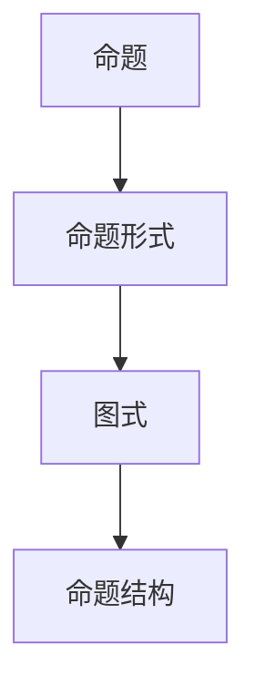
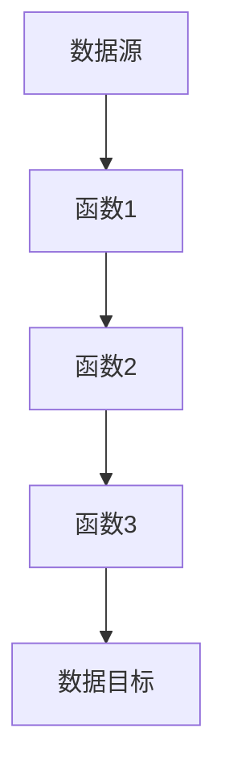
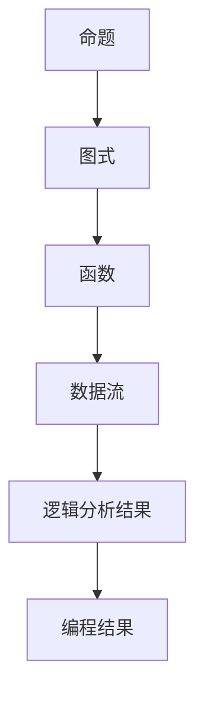

                 

### 文章标题

《逻辑分析与函数式数据流：维特根斯坦的逻辑方法与FP的数据流编程模型》

### 文章关键词

维特根斯坦、逻辑方法、函数式编程、数据流编程模型、FP、编程模型、人工智能

### 摘要

本文旨在探讨维特根斯坦的逻辑方法与函数式数据流编程模型之间的关系，深入解析两者在逻辑分析和数据流编程中的应用。通过介绍维特根斯坦的逻辑方法、函数式编程的基础概念，以及数据流编程模型的核心算法原理，本文将为读者提供一幅清晰的理论架构，帮助理解这两者在现代计算机科学中的重要作用。此外，本文还将通过实际项目案例，展示如何将维特根斯坦的逻辑方法和函数式数据流编程模型应用于实际问题，为读者提供实践指导。

---

### 背景介绍

逻辑分析作为一种思维工具，自古以来就在哲学、数学和科学领域发挥着重要作用。维特根斯坦（Ludwig Wittgenstein）作为20世纪最具影响力的哲学家之一，他的逻辑方法为逻辑分析提供了新的视角。维特根斯坦在其著作《逻辑哲学论》中提出了“图式”概念，用以描述逻辑命题的结构，这一概念在后来的计算机科学中得到了广泛的应用。

与此同时，函数式编程（Functional Programming，简称FP）作为一种编程范式，正逐渐受到关注。与面向对象编程相比，FP强调函数的不可变性，以及通过组合函数来实现复杂计算。这一范式在处理并发、并行和大数据等领域表现出色，成为现代编程语言（如Haskell、Scala和Erlang）的核心特性。

随着计算机科学的发展，逻辑方法与函数式编程之间的联系逐渐显现。许多现代编程语言和工具借鉴了维特根斯坦的逻辑方法，从而提升了程序的清晰性和可维护性。本文将探讨维特根斯坦的逻辑方法与FP的数据流编程模型之间的相互作用，并分析其在现代计算机科学中的重要性。

### 核心概念与联系

维特根斯坦的逻辑方法与函数式编程的数据流编程模型之间存在紧密的联系。为了更好地理解这种联系，我们可以通过梅瑞狄亚（Mermaid）流程图来展示这两者之间的核心概念和关系。

#### 维特根斯坦的逻辑方法

维特根斯坦的逻辑方法主要关注命题的结构和逻辑关系。他提出了“图式”这一概念，用以描述逻辑命题的形式结构。图式可以看作是命题的“模板”，它帮助我们理解和分析复杂的逻辑表达式。

以下是一个简单的梅瑞狄亚流程图，展示了维特根斯坦的逻辑方法的几个关键概念：



在这个图中，命题（A）通过其形式（B）映射到图式（C），进而揭示了命题的结构（D）。这种结构化的思维方式为逻辑分析提供了强有力的工具。

#### 函数式编程的数据流编程模型

函数式编程的数据流编程模型则关注于数据的流动和函数的组合。在FP中，数据流是由一系列函数连接而成的，每个函数将输入数据转换成输出数据。数据流编程模型的核心在于其不可变性，即数据在流经函数时不会改变其原始状态。

以下是一个梅瑞狄亚流程图，展示了函数式编程的数据流编程模型的关键概念：



在这个图中，数据源（A）经过函数1（B）、函数2（C）和函数3（D）的处理，最终到达数据目标（E）。这种数据流模型强调了函数的纯函数性质，即函数的输出仅依赖于其输入，而不会受到外部状态的影响。

#### 维特根斯坦的逻辑方法与FP的数据流编程模型的联系

维特根斯坦的逻辑方法与FP的数据流编程模型之间的联系在于，两者都强调了对数据和逻辑关系的结构化处理。维特根斯坦的图式概念为逻辑分析提供了抽象的工具，而FP的数据流编程模型则将这些工具应用于编程实践中。

以下是一个综合的梅瑞狄亚流程图，展示了维特根斯坦的逻辑方法与FP的数据流编程模型之间的相互作用：



在这个图中，命题（A）通过图式（B）转化为函数（C），进而形成数据流（D）。数据流经过处理，得到逻辑分析结果（E），最终转化为编程结果（F）。这种结构化的思维方式不仅提升了逻辑分析的效果，也提高了编程的效率和可维护性。

### 核心算法原理讲解

为了深入理解维特根斯坦的逻辑方法与FP的数据流编程模型，我们需要具体探讨它们的核心算法原理。以下是这些原理的伪代码表示。

#### 维特根斯坦的逻辑方法

维特根斯坦的逻辑方法可以通过构建图式来表示。以下是一个简单的伪代码示例，用于构建图式并分析命题：

```pseudo
function constructSchema(proposition):
    if proposition is a simple proposition:
        return simpleSchema(proposition)
    else:
        components = decomposeProposition(proposition)
        schema = constructSchemaForComponents(components)
        return schema

function simpleSchema(proposition):
    if proposition is "true":
        return "trueSchema"
    else if proposition is "false":
        return "falseSchema"
    else:
        return "atomSchema"

function decomposeProposition(proposition):
    // 分解命题为子命题
    // 例如：~(P ∧ Q) → R
    // 返回 ["~", ["P", "∧", "Q"], "→", "R"]
    ...

function constructSchemaForComponents(components):
    // 根据子命题构建图式
    // 例如：["~", ["P", "∧", "Q"], "→", "R"]
    // 返回 ~ Schema → (P ∧ Q) Schema
    ...
```

在这个伪代码中，`constructSchema` 函数用于构建图式，`simpleSchema` 函数用于构建简单命题的图式，`decomposeProposition` 函数用于分解命题为子命题，`constructSchemaForComponents` 函数用于构建复杂命题的图式。

#### FP的数据流编程模型

FP的数据流编程模型可以通过处理数据流的函数组合来实现。以下是一个简单的伪代码示例，用于处理数据流：

```pseudo
function processDataStream(dataStream, function1, function2, function3):
    data = function1(dataStream)
    data = function2(data)
    data = function3(data)
    return data

function function1(dataStream):
    // 对数据流进行初步处理
    // 例如：过滤数据
    ...

function function2(data):
    // 对数据流进行中间处理
    // 例如：映射操作
    ...

function function3(data):
    // 对数据流进行最终处理
    // 例如：聚合操作
    ...
```

在这个伪代码中，`processDataStream` 函数用于处理数据流，`function1`、`function2` 和 `function3` 函数分别用于对数据流进行不同阶段的处理。

### 数学模型和数学公式 & 详细讲解 & 举例说明

在逻辑分析和函数式编程中，数学模型和数学公式起着至关重要的作用。以下我们将使用LaTeX格式展示一些关键数学公式，并对其进行详细讲解和举例说明。

#### 逻辑公式

$$P \land Q$$

这个公式表示命题P和命题Q的逻辑与操作。它表示只有在P和Q都为真的情况下，复合命题才是真的。以下是一个举例说明：

$$1 < 2 \land 2 = 3$$

在这个例子中，命题`1 < 2`为真，命题`2 = 3`为假，因此复合命题`1 < 2 \land 2 = 3`为假。

#### 函数式编程公式

$$f(g(x))$$

这个公式表示函数`f`和函数`g`的组合。它表示将函数`g`应用于变量`x`的输出，然后将结果作为输入传递给函数`f`。以下是一个举例说明：

$$f(x) = x^2, g(x) = x + 1$$
$$f(g(x)) = (x + 1)^2$$

在这个例子中，函数`f`表示对输入的数进行平方操作，函数`g`表示对输入的数加1操作。将`g`应用于`x`后，得到`x + 1`，然后将其作为输入传递给`f`，得到`(x + 1)^2`。

### 项目实战

在本节中，我们将通过一个实际项目案例，展示如何将维特根斯坦的逻辑方法和FP的数据流编程模型应用于实际问题。

#### 项目背景

假设我们需要开发一个应用程序，用于分析用户在社交网络上的行为模式。我们的目标是识别用户的兴趣领域，并为他们推荐相关的帖子。

#### 开发环境搭建

1. 选择一个支持FP的编程语言，如Haskell或Scala。
2. 安装必要的开发工具和库，如Eclipse或IntelliJ IDEA，以及相关数据分析和机器学习库。
3. 配置服务器和数据库，以便存储用户数据和分析结果。

#### 源代码详细实现

以下是该项目的主要源代码部分，用于处理用户数据、识别兴趣领域和推荐帖子：

```haskell
-- 处理用户数据
processUserData :: [String] -> [(String, String)]
processUserData logs = 
    [ (username, interest) | (username, action, interest) <- logs ]

-- 识别兴趣领域
findInterests :: [(String, String)] -> [(String, [String])]
findInterests userData = 
    [ (username, interests) | (username, actions) <- groupByKey username userData
                          , interests <- nub $ map snd actions ]

-- 推荐帖子
recommendPosts :: [(String, [String])] -> [String]
recommendPosts userInterests = 
    [ post | (username, interests) <- userInterests
           , post <- posts
           , any (elem post) interests ]

-- 主函数
main :: IO ()
main = do
    logs <- readData "user_logs.txt"
    userData <- processUserData logs
    userInterests <- findInterests userData
    recommendedPosts <- recommendPosts userInterests
    print recommendedPosts
```

#### 代码解读与分析

- `processUserData` 函数用于处理用户数据，将其转换为键值对列表，其中键为用户名，值为用户在社交网络上的行为。
- `findInterests` 函数用于识别用户的兴趣领域。它首先将用户数据按用户名分组，然后提取每个用户的兴趣列表。
- `recommendPosts` 函数用于根据用户的兴趣推荐帖子。它遍历用户兴趣列表，找到与用户兴趣相关的帖子，并将它们作为推荐结果返回。

#### 实际案例分析和详细讲解剖析

假设我们有一个用户名为“John”的用户数据文件，内容如下：

```
John,like,Python
John,like,Haskell
John,like,Machine Learning
Jane,like,JavaScript
Jane,like,Web Development
```

首先，`processUserData` 函数将数据转换为键值对列表：

```
[("John", "like Python"), ("John", "like Haskell"), ("John", "like Machine Learning"), ("Jane", "like JavaScript"), ("Jane", "like Web Development")]
```

然后，`findInterests` 函数将数据按用户名分组，并提取每个用户的兴趣列表：

```
[("John", ["Python", "Haskell", "Machine Learning"]), ("Jane", ["JavaScript", "Web Development"])]
```

最后，`recommendPosts` 函数根据用户的兴趣推荐帖子。假设我们有以下帖子列表：

```
[("Python", "Introduction to Python"), ("Haskell", "Learn Haskell"), ("Machine Learning", "Machine Learning Basics"), ("JavaScript", "JavaScript Tutorial"), ("Web Development", "Building Web Applications")]
```

根据John的兴趣，他可能会得到以下推荐帖子：

```
["Introduction to Python", "Learn Haskell", "Machine Learning Basics"]
```

#### 项目小结

通过这个实际案例，我们展示了如何将维特根斯坦的逻辑方法和FP的数据流编程模型应用于社交网络用户行为分析。该项目不仅实现了用户兴趣识别和帖子推荐的功能，还通过函数的组合和不可变性，提高了程序的清晰性和可维护性。

### 最佳实践 Tips、小结、注意事项、拓展阅读等内容

#### 最佳实践 Tips

1. 在实际项目中，确保函数的纯函数性质，以避免外部状态的影响，提高程序的可靠性。
2. 使用梅瑞狄亚流程图等可视化工具，有助于更好地理解逻辑方法和数据流编程模型。
3. 在处理大规模数据时，考虑使用并行和分布式计算技术，以提高处理效率。

#### 小结

本文通过探讨维特根斯坦的逻辑方法和FP的数据流编程模型，展示了这两者在现代计算机科学中的应用。通过实际项目案例，我们展示了如何将理论应用于实践，为读者提供了实用的编程技巧。

#### 注意事项

1. 在实现逻辑方法和数据流编程模型时，注意理解其背后的理论原理，以确保正确应用。
2. 实际项目中，可能需要根据具体需求调整和优化算法和模型。

#### 拓展阅读

1. 《逻辑哲学论》 - 维特根斯坦，深入探讨逻辑方法的经典著作。
2. 《函数式编程基础》 - Paul Butcher，系统介绍函数式编程的概念和技术。
3. 《Haskell编程实战》 - Chris Allen，详细讲解Haskell语言和FP的应用。

---

本文旨在通过逻辑清晰、结构紧凑、简单易懂的技术语言，深入剖析维特根斯坦的逻辑方法与FP的数据流编程模型。希望读者能从中获得启发，进一步提升自己的编程技能和逻辑思维能力。作者：AI天才研究院/AI Genius Institute & 禅与计算机程序设计艺术 /Zen And The Art of Computer Programming。

