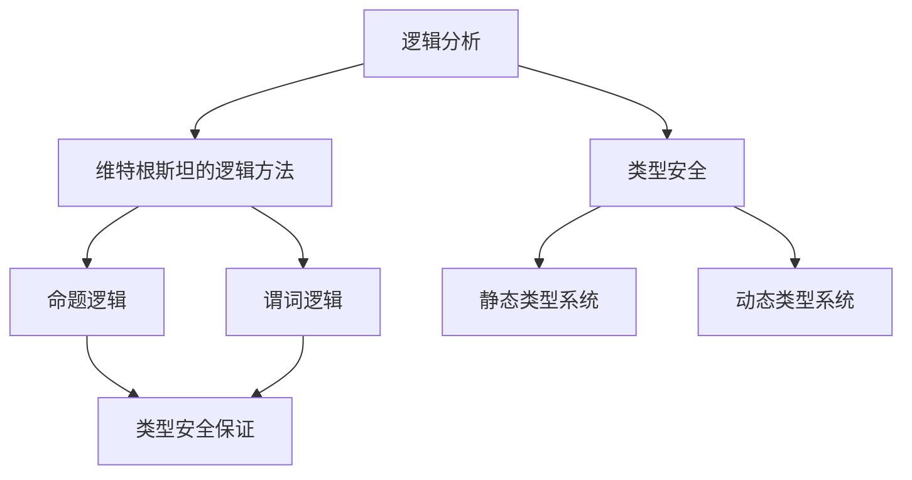

                 


### 目录

```
# 《逻辑分析与类型安全：维特根斯坦的逻辑方法与FP中的类型安全保证》目录大纲

## 第一部分：逻辑分析基础

### 1.1 维特根斯坦的逻辑哲学

#### 1.1.1 维特根斯坦的生平与贡献

#### 1.1.2 维特根斯坦的逻辑哲学简介

### 1.2 维特根斯坦的逻辑方法

#### 1.2.1 维特根斯坦的命题逻辑

#### 1.2.2 维特根斯坦的谓词逻辑

#### 1.2.3 维特根斯坦的逻辑方法在计算机科学中的应用

### 1.3 逻辑学的基本概念与原则

#### 1.3.1 逻辑学的基础概念

#### 1.3.2 逻辑学的推理原则

#### 1.3.3 逻辑学在计算机科学中的应用

### 1.4 逻辑分析在计算机科学中的应用

#### 1.4.1 逻辑分析在编程语言中的应用

#### 1.4.2 逻辑分析在算法设计与验证中的应用

### 1.5 逻辑分析与数学公式

#### 1.5.1 逻辑表达式与数学公式

#### 1.5.2 逻辑推理的数学基础

### 1.6 逻辑分析与伪代码

#### 1.6.1 逻辑分析与算法描述

#### 1.6.2 伪代码的编写方法

## 第二部分：类型安全

### 2.1 类型安全的基本概念

#### 2.1.1 类型系统的定义

#### 2.1.2 类型安全的定义

### 2.2 函数式编程（FP）中的类型安全

#### 2.2.1 FP的基本概念

#### 2.2.2 FP中的类型系统

### 2.3 类型安全保证的方法

#### 2.3.1 类型检查

#### 2.3.2 类型推断

### 2.4 类型安全在实际编程中的应用

#### 2.4.1 类型安全在编程语言设计中的应用

#### 2.4.2 类型安全在程序调试中的应用

### 2.5 类型安全与逻辑分析的关系

#### 2.5.1 类型安全与逻辑分析的联系

#### 2.5.2 类型安全与逻辑分析的区别

### 2.6 类型安全案例分析

#### 2.6.1 案例一：函数式编程中的类型安全

#### 2.6.2 案例二：逻辑分析在类型安全中的应用

## 第三部分：逻辑分析与类型安全的未来

### 3.1 逻辑分析与类型安全的未来发展

#### 3.1.1 逻辑分析在人工智能中的应用

#### 3.1.2 类型安全在新兴编程语言中的发展

### 3.2 逻辑分析与类型安全的挑战与机遇

#### 3.2.1 逻辑分析在计算机科学中的挑战

#### 3.2.2 类型安全在计算机科学中的机遇

### 3.3 逻辑分析与类型安全的未来趋势

#### 3.3.1 逻辑分析与类型安全的融合趋势

#### 3.3.2 逻辑分析与类型安全在教育中的应用

## 附录

### 4.1 相关工具与资源

#### 4.1.1 逻辑分析工具介绍

#### 4.1.2 类型安全检测工具介绍

### 4.2 参考文献

```

### 关键词

- 维特根斯坦
- 逻辑方法
- 类型安全
- 函数式编程
- 人工智能
- 编程语言设计
- 算法验证

### 摘要

本文旨在探讨逻辑分析与类型安全在计算机科学中的应用，重点研究维特根斯坦的逻辑方法及其对函数式编程类型安全保证的影响。文章首先介绍了维特根斯坦的生平与贡献，以及其逻辑哲学的基本概念。随后，深入分析了维特根斯坦的命题逻辑和谓词逻辑，并探讨了其在计算机科学中的应用。接着，详细阐述了逻辑学的基础概念与原则，以及逻辑分析在计算机科学中的应用。在类型安全部分，文章介绍了类型安全的基本概念、函数式编程中的类型系统，以及类型安全保证的方法。最后，文章探讨了逻辑分析与类型安全在实际编程中的应用，以及其在人工智能和新兴编程语言中的未来发展。通过本文的研究，旨在为读者提供一个全面、深入的逻辑分析与类型安全的理解，并探讨其未来的发展趋势。

## 第一部分：逻辑分析基础

### 1.1 维特根斯坦的逻辑哲学

#### 1.1.1 维特根斯坦的生平与贡献

路德维希·维特根斯坦（Ludwig Wittgenstein）是20世纪最杰出的哲学家之一，他的工作和贡献在哲学、逻辑学、数学以及语言哲学等领域产生了深远的影响。他于1889年4月26日出生于奥地利维也纳的一个富有家庭，其父亲是著名的钢铁制造商卡尔·维特根斯坦。尽管家境优越，但维特根斯坦的生活并非一帆风顺。他曾在英国剑桥大学学习数学，并在那里接触到了逻辑和哲学，随后逐渐转向哲学研究。

维特根斯坦的职业生涯可分为两个阶段。他的早期工作主要集中在《逻辑哲学论》（Tractatus Logico-Philosophicus）中，这本书于1921年首次出版，提出了一个关于语言、思维和世界的极端清晰和简洁的理论框架。维特根斯坦认为，哲学的任务是澄清思想和语言的混乱，并通过逻辑分析揭示世界的基本结构和真理的本质。

在他的晚期工作中，维特根斯坦的哲学观点发生了显著变化，主要体现在《哲学研究》（Philosophical Investigations）中。这本书于1953年出版，与早期著作形成了鲜明的对比，维特根斯坦开始关注日常语言的使用和意义，强调哲学研究应更贴近日常经验和生活实践。

#### 1.1.2 维特根斯坦的逻辑哲学简介

维特根斯坦的逻辑哲学主要分为两个阶段：早期逻辑原子主义和晚期语言哲学。

1. **早期逻辑原子主义**

在《逻辑哲学论》中，维特根斯坦提出了逻辑原子主义的概念。他认为，世界是由一系列不可再分的逻辑原子构成的，这些原子通过逻辑组合形成了复杂的事实和命题。维特根斯坦使用符号逻辑来表达这些原子和组合，认为语言的作用是反映世界的逻辑结构。在这个理论框架下，命题的真假仅取决于它们是否与世界的逻辑原子结构一致。

维特根斯坦还提出了“图像理论”（Picture Theory），认为语言符号是世界的图像，它们通过视觉相似性来表示世界中的事物。这种观点强调了语言和现实之间的关系，并试图通过逻辑分析揭示世界的本质。

2. **晚期语言哲学**

在《哲学研究》中，维特根斯坦对早期理论进行了深刻的批判和反思。他提出了“语言游戏”（Language Game）的概念，认为语言的使用与特定的社会实践活动紧密相关。语言不仅仅是描述世界的工具，更是一种行为和实践的载体。维特根斯坦强调了日常语言的多义性和模糊性，认为哲学的任务是澄清这些模糊性，而不是试图找到一种普遍的语言或逻辑体系。

晚期维特根斯坦的哲学观点对后来的语言哲学、分析哲学以及认知科学等领域产生了深远的影响。他的理论强调了语言、思维和现实之间的复杂关系，为后来的哲学家和科学家提供了一种新的思考方式。

### 1.2 维特根斯坦的逻辑方法

#### 1.2.1 维特根斯坦的命题逻辑

维特根斯坦的命题逻辑主要表现在《逻辑哲学论》中。这本书由一系列命题组成，这些命题使用符号逻辑表达，旨在揭示世界的逻辑结构和真理的本质。维特根斯坦的命题逻辑具有以下几个特点：

1. **清晰和简洁**

维特根斯坦力求使命题逻辑表达尽可能清晰和简洁。他使用了简明的符号和术语，使得命题的逻辑结构一目了然。这种清晰性有助于揭示世界的本质和真理。

2. **逻辑原子主义**

维特根斯坦的命题逻辑基于逻辑原子主义，认为世界由一系列不可再分的逻辑原子构成。这些原子通过逻辑组合形成了复杂的事实和命题。这种观点强调了逻辑在描述世界和真理中的重要作用。

3. **图像理论**

维特根斯坦的命题逻辑还采用了图像理论，认为语言符号是世界的图像。这种理论强调了语言和现实之间的视觉相似性，有助于理解语言在描述世界中的作用。

#### 1.2.2 维特根斯坦的谓词逻辑

在《哲学研究》中，维特根斯坦对早期命题逻辑进行了批判和反思，提出了谓词逻辑。谓词逻辑是一种更贴近日常语言和实际应用的方法。它通过使用谓词和量词来描述对象之间的关系和属性。

1. **谓词和量词**

谓词逻辑使用谓词来描述对象之间的关系和属性。谓词是一个包含变量的语句，可以用来表示对象的特征或关系。量词则用于限定变量的范围，例如全称量词（∀）和存在量词（∃）。

2. **自然推理**

维特根斯坦的谓词逻辑采用了自然推理的方法，这种方法更接近日常思维和语言表达。自然推理强调逻辑推理的直观性和合理性，使得逻辑方法更易于理解和应用。

3. **语言游戏**

在谓词逻辑中，维特根斯坦强调了“语言游戏”的概念，认为语言的使用与特定的社会实践活动紧密相关。语言游戏有助于理解语言的多义性和模糊性，从而更好地描述现实世界。

#### 1.2.3 维特根斯坦的逻辑方法在计算机科学中的应用

维特根斯坦的逻辑方法在计算机科学中有着广泛的应用，尤其在逻辑编程、形式化验证和编程语言设计等方面。以下是一些具体的应用：

1. **逻辑编程**

逻辑编程是一种基于逻辑的方法，用于表示和处理数据。它使用谓词逻辑来定义关系和规则，使得程序具有更强的表达能力和推理能力。例如，Prolog就是一种基于谓词逻辑的编程语言，广泛应用于人工智能和自然语言处理领域。

2. **形式化验证**

形式化验证是一种使用数学方法来证明程序的正确性的方法。维特根斯坦的逻辑方法为形式化验证提供了理论基础，使得程序的正确性可以形式化地表示和验证。

3. **编程语言设计**

维特根斯坦的逻辑方法对编程语言设计产生了深远的影响。许多现代编程语言，如Haskell和ML，采用了函数式编程和类型系统的概念，这些概念在一定程度上受到了维特根斯坦逻辑方法的影响。

### 1.3 逻辑学的基本概念与原则

逻辑学是一门研究推理、论证和证明的学科，它在数学、哲学、计算机科学等领域有着广泛的应用。以下是一些逻辑学的基本概念与原则：

#### 1.3.1 逻辑学的基础概念

1. **命题**

命题是逻辑学中的基本元素，它是一个陈述句，可以判断为真或假。例如，“今天下雨”是一个命题。

2. **命题联结词**

命题联结词用于组合命题，以形成更复杂的命题。常见的命题联结词有“与”（∧）、“或”（∨）、“非”（¬）等。

3. **推理规则**

推理规则是用于从已知命题推导出新命题的规则。常见的推理规则有“合取律”、“析取律”和“否定律”等。

#### 1.3.2 逻辑学的推理原则

1. **一致性原则**

一致性原则要求推理过程中不能同时接受两个相互矛盾的命题。

2. **无矛盾原则**

无矛盾原则要求推理过程中不能从一个命题集推导出两个相互矛盾的命题。

3. **可证明性原则**

可证明性原则要求推理过程中可以从已知命题推导出新的命题，直到达到目标命题。

#### 1.3.3 逻辑学在计算机科学中的应用

逻辑学在计算机科学中有着广泛的应用，以下是一些具体的应用领域：

1. **形式化验证**

形式化验证是一种使用数学方法来证明程序的正确性的方法。逻辑学为形式化验证提供了理论基础，使得程序的正确性可以形式化地表示和验证。

2. **编程语言设计**

逻辑学为编程语言设计提供了理论基础，许多现代编程语言采用了函数式编程和类型系统的概念，这些概念在一定程度上受到了逻辑学的影响。

3. **人工智能**

逻辑学在人工智能领域有着广泛的应用，例如逻辑编程和推理系统等。

### 1.4 逻辑分析在计算机科学中的应用

逻辑分析是计算机科学中的一个重要方法，它通过逻辑推理和分析来验证程序的正确性、优化算法和设计新的编程语言。以下是一些具体的逻辑分析在计算机科学中的应用：

#### 1.4.1 逻辑分析在编程语言中的应用

1. **类型系统**

类型系统是编程语言中的一个重要概念，它用于确保程序的合法性和安全性。逻辑分析在类型系统的设计和应用中起着关键作用，例如类型检查和类型推断。

2. **模式匹配**

模式匹配是一种用于在编程语言中匹配和解析数据结构的方法。逻辑分析可以用于优化模式匹配算法，提高其效率和准确性。

3. **静态分析**

静态分析是一种在程序运行前分析程序的方法，它可以帮助发现程序中的错误和优化程序的性能。逻辑分析在静态分析中起着重要作用，例如数据流分析和控制流分析。

#### 1.4.2 逻辑分析在算法设计与验证中的应用

1. **算法验证**

算法验证是一种使用数学方法来证明算法正确性的方法。逻辑分析可以用于算法验证，通过形式化地描述算法并验证其正确性。

2. **算法优化**

逻辑分析可以用于算法优化，通过分析算法的执行过程和性能指标，提出优化方案来提高算法的效率。

3. **逻辑推理**

逻辑推理是算法设计中的一个重要方法，它可以帮助设计出更加高效和可靠的算法。逻辑分析可以用于优化逻辑推理过程，提高推理的准确性和速度。

### 1.5 逻辑分析与数学公式

逻辑分析与数学公式密切相关，逻辑表达式和数学公式可以相互转化和解释。以下是一些逻辑分析与数学公式的关系：

#### 1.5.1 逻辑表达式与数学公式

1. **命题公式**

命题公式是逻辑学中的基本表达形式，它由命题变量和逻辑运算符组成。命题公式可以表示为一个真值表，其中的每一行表示一个可能的命题变量组合及其对应的真值。

2. **谓词公式**

谓词公式是逻辑学中的高级表达形式，它由谓词、量词和逻辑运算符组成。谓词公式可以表示为谓词逻辑公式，其中的每个谓词表示一个对象之间的关系。

3. **数学公式**

数学公式是数学中的表达形式，它由数学符号、变量和运算符组成。数学公式可以表示为一个数学模型，其中的每个变量和符号都有明确的数学意义。

#### 1.5.2 逻辑推理的数学基础

1. **逻辑推理规则**

逻辑推理规则是逻辑学中的基本规则，用于从已知命题推导出新命题。逻辑推理规则包括等价变换、推理规则和证明规则等。

2. **数学基础**

逻辑推理的数学基础包括集合论、谓词逻辑和模型论等。这些数学基础为逻辑推理提供了形式化的框架和工具。

### 1.6 逻辑分析与伪代码

逻辑分析在算法描述和编程中起着重要作用，伪代码是一种用于描述算法逻辑的语言，它结合了自然语言和编程语言的特性。以下是一些逻辑分析与伪代码的关系：

#### 1.6.1 逻辑分析与算法描述

1. **算法逻辑**

算法逻辑是算法描述中的核心，它用于描述算法的执行过程和操作步骤。逻辑分析可以帮助我们理解算法的逻辑结构和执行过程。

2. **伪代码**

伪代码是一种用于描述算法逻辑的工具，它使用自然语言和编程语言的特性来描述算法的执行过程。逻辑分析可以用于优化伪代码的编写，提高算法的可读性和可维护性。

3. **伪代码与代码实现**

伪代码是算法描述的一种形式，它可以作为代码实现的参考。逻辑分析可以帮助我们将伪代码转换为高效的代码实现。

### 1.7 逻辑分析与伪代码的编写方法

1. **结构化伪代码**

结构化伪代码是一种用于描述算法逻辑的方法，它使用缩进和层次结构来表示算法的执行过程。逻辑分析可以帮助我们编写清晰、结构化的伪代码。

2. **伪代码与真实代码的差异**

伪代码与真实代码之间存在差异，例如伪代码不涉及具体的编程语言特性，而真实代码则需要考虑编程语言的具体语法和特性。逻辑分析可以帮助我们理解这两者之间的差异。

3. **伪代码的优化**

伪代码的优化是提高算法效率的重要方法，逻辑分析可以帮助我们分析算法的逻辑结构，提出优化方案。例如，我们可以使用逻辑推理来简化算法的表达式，提高算法的执行效率。

## 第二部分：类型安全

### 2.1 类型安全的基本概念

#### 2.1.1 类型系统的定义

类型系统是编程语言中的一个重要概念，它用于定义变量、表达式和函数的类型，以确保程序的正确性和安全性。类型系统可以根据其形式化程度分为静态类型系统和动态类型系统。

1. **静态类型系统**

静态类型系统在程序编译时检查变量的类型，确保变量在每次使用时都符合其声明的类型。静态类型系统的优点是可以早期发现类型错误，从而提高程序的可靠性。常见的静态类型编程语言有C++、Java和Haskell等。

2. **动态类型系统**

动态类型系统在程序运行时检查变量的类型，根据变量的实际类型进行操作。动态类型系统的优点是灵活性更高，可以减少类型声明的冗余，但可能导致运行时错误。常见的动态类型编程语言有Python、JavaScript和Ruby等。

#### 2.1.2 类型安全的定义

类型安全是指编程语言能够确保程序在运行时不会发生类型错误。类型安全的定义可以分为两个方面：

1. **类型正确性**

类型正确性是指程序中的每个表达式都有确定的类型，并且在执行过程中不会违反类型约束。例如，一个整数不能与一个字符串直接相加。

2. **类型一致性**

类型一致性是指程序在运行时能够保持变量的类型一致性，即变量的类型在声明和使用时保持一致。类型一致性可以防止类型错误的发生，提高程序的可靠性。

### 2.2 函数式编程（FP）中的类型安全

#### 2.2.1 FP的基本概念

函数式编程（Functional Programming，FP）是一种编程范式，它强调函数作为程序的基本构建块。FP的核心概念包括：

1. **函数第一类公民**

函数第一类公民是指函数可以像其他数据类型一样进行操作，例如可以赋值给变量、作为函数的参数和返回值。

2. **纯函数**

纯函数是一种无副作用、输入和输出完全确定的函数。纯函数具有以下特点：

   - **输入输出确定**：对于相同的输入，纯函数总是返回相同的输出。
   - **无副作用**：纯函数不修改外部状态，不会产生可见的副作用。
   - **可并行化**：纯函数可以独立执行，不会相互干扰。

3. **递归**

递归是一种函数调用自身的方法，它用于解决许多问题，如计算阶乘、求和等。

#### 2.2.2 FP中的类型系统

FP中的类型系统通常采用静态类型系统，以确保函数的正确性和类型安全。FP中的类型系统具有以下特点：

1. **类型推断**

类型推断是FP中的类型系统的一种重要特性，它允许编程语言自动推断函数的参数和返回值的类型，从而减少类型声明的冗余。

2. **类型注解**

类型注解是FP中另一种重要的类型系统特性，它允许程序员显式地指定函数的参数和返回值的类型，以提高程序的清晰性和可维护性。

3. **高阶类型**

高阶类型是FP中的另一个重要概念，它允许函数接受其他函数作为参数或返回值。高阶类型使得FP具有更高的表达能力和灵活性。

#### 2.2.3 FP中的类型安全保证

FP中的类型安全保证主要通过以下几种机制实现：

1. **类型检查**

类型检查是FP中的类型系统的一种重要机制，它用于在编译时检查函数的参数和返回值的类型是否一致。类型检查可以早期发现类型错误，从而提高程序的可靠性。

2. **类型推断**

类型推断是FP中的类型系统的一种重要特性，它允许编程语言自动推断函数的参数和返回值的类型。类型推断可以减少类型声明的冗余，提高程序的清晰性和可维护性。

3. **模式匹配**

模式匹配是FP中用于处理变量绑定和类型匹配的一种重要机制。模式匹配可以确保函数在执行时能够正确地处理不同的数据类型，从而提高程序的类型安全性。

### 2.3 类型安全保证的方法

#### 2.3.1 类型检查

类型检查是一种在编译时检查函数的参数和返回值的类型的方法。类型检查可以分为以下几种类型：

1. **强类型检查**

强类型检查要求函数的参数和返回值类型必须一致。强类型检查可以确保函数在执行时不会发生类型错误，从而提高程序的可靠性。

2. **弱类型检查**

弱类型检查允许函数的参数和返回值类型之间存在兼容性。弱类型检查可以提高程序的灵活性，但可能导致类型错误的发生。

3. **类型推导**

类型推导是类型检查的一种方法，它允许编程语言自动推断函数的参数和返回值的类型。类型推导可以减少类型声明的冗余，提高程序的清晰性和可维护性。

#### 2.3.2 类型推断

类型推断是一种在编译时自动推断函数的参数和返回值的类型的方法。类型推断可以分为以下几种类型：

1. **显式类型推断**

显式类型推断允许程序员显式地指定函数的参数和返回值的类型，从而提高程序的清晰性和可维护性。

2. **隐式类型推断**

隐式类型推断允许编程语言自动推断函数的参数和返回值的类型，从而减少类型声明的冗余。

3. **类型推导规则**

类型推导规则是类型推断的一种方法，它允许编程语言根据函数的语法和语义推断函数的参数和返回值的类型。

### 2.4 类型安全在实际编程中的应用

#### 2.4.1 类型安全在编程语言设计中的应用

类型安全在编程语言设计中的应用至关重要，它确保编程语言能够提供可靠的类型检查和类型安全保证。以下是一些类型安全在编程语言设计中的应用：

1. **静态类型语言**

静态类型语言通过在编译时检查类型，确保程序的类型安全。常见的静态类型语言包括Java、C++和Haskell等。

2. **动态类型语言**

动态类型语言通过在运行时检查类型，提供灵活的类型安全保证。常见的动态类型语言包括Python、JavaScript和Ruby等。

3. **混合类型语言**

混合类型语言结合了静态类型和动态类型的优点，通过在编译时和运行时进行类型检查，提供灵活的类型安全保证。常见的混合类型语言包括Java和C#等。

#### 2.4.2 类型安全在程序调试中的应用

类型安全在程序调试中的应用有助于发现和解决类型错误。以下是一些类型安全在程序调试中的应用：

1. **类型错误检测**

类型错误检测是在程序运行时检测类型错误的方法。类型错误检测可以早期发现类型错误，从而提高程序的可靠性。

2. **类型错误定位**

类型错误定位是在程序运行时定位类型错误的方法。类型错误定位可以快速定位类型错误的来源，从而提高程序的调试效率。

3. **类型错误修复**

类型错误修复是在程序调试过程中修复类型错误的方法。类型错误修复可以确保程序在修复类型错误后能够正常运行。

### 2.5 类型安全与逻辑分析的关系

#### 2.5.1 类型安全与逻辑分析的联系

类型安全与逻辑分析有着密切的联系，两者在以下几个方面相互支持：

1. **类型检查与逻辑推理**

类型检查是一种逻辑推理过程，它用于检查函数的参数和返回值的类型是否一致。类型检查可以看作是一种基于逻辑规则的推理过程。

2. **类型安全与程序正确性**

类型安全是确保程序正确性的重要因素。通过类型检查和逻辑推理，可以确保程序在运行时不会发生类型错误。

3. **类型系统与逻辑系统**

类型系统是编程语言中的一个逻辑系统，它用于定义变量、表达式和函数的类型。类型系统可以看作是一种形式化的逻辑系统，它为程序的正确性提供了保证。

#### 2.5.2 类型安全与逻辑分析的区别

尽管类型安全与逻辑分析有联系，但两者也存在一些区别：

1. **逻辑分析的范围**

逻辑分析的范围更广，它不仅包括类型安全，还包括其他逻辑概念，如推理规则、证明方法和模型论等。

2. **逻辑分析的抽象层次**

逻辑分析的抽象层次更高，它关注程序的正确性和一致性，而类型安全更关注程序的类型一致性。

3. **逻辑分析的工具和方法**

逻辑分析可以使用多种工具和方法，如形式化验证、模型检查和逻辑编程等。而类型安全主要依赖于编程语言中的类型系统和类型检查工具。

### 2.6 类型安全案例分析

#### 2.6.1 案例一：函数式编程中的类型安全

函数式编程（FP）是一种强调函数和纯函数的编程范式，它在类型安全方面具有显著优势。以下是一个函数式编程中的类型安全案例分析：

1. **案例背景**

假设我们正在编写一个计算阶乘的函数，使用Haskell语言。Haskell是一种静态类型函数式编程语言，它提供了严格的类型系统和类型推断。

2. **代码实现**

```haskell
factorial :: Integer -> Integer
factorial n =
  if n == 0
    then 1
    else n * factorial (n - 1)
```

在这个案例中，`factorial` 函数接受一个整数参数 `n`，返回其阶乘。Haskell语言中的类型系统确保了函数的正确性和类型安全。

3. **类型推断**

Haskell语言可以自动推断函数的参数和返回值的类型。在上面的代码中，`factorial` 函数的参数和返回值类型都被推断为 `Integer`。

4. **类型安全验证**

通过静态类型检查，Haskell语言可以确保 `factorial` 函数在执行时不会发生类型错误。例如，如果尝试将一个字符串传递给 `factorial` 函数，编译器将报错，提示类型不匹配。

#### 2.6.2 案例二：逻辑分析在类型安全中的应用

逻辑分析在类型安全中的应用主要体现在形式化验证和证明方法中。以下是一个逻辑分析在类型安全中的应用案例：

1. **案例背景**

假设我们正在设计一个并发程序，它使用共享内存和多线程来计算两个数的最小公倍数。为了确保程序的正确性和类型安全，我们使用形式化验证方法。

2. **代码实现**

```c
#include <pthread.h>
#include <stdio.h>

int result;
int a = 12;
int b = 18;

void *gcd(void *arg) {
  int x = *((int *)arg);
  int y = a;
  a = b;
  b = y;

  while (x != 0) {
    int temp = x;
    x = y % x;
    y = temp;
  }
  result = a;
  pthread_exit(NULL);
}

int main() {
  pthread_t thread;
  pthread_create(&thread, NULL, gcd, (void *)&a);
  pthread_create(&thread, NULL, gcd, (void *)&b);
  pthread_join(thread, NULL);
  pthread_join(thread, NULL);

  printf("The LCM of %d and %d is %d\n", a, b, result);
  return 0;
}
```

在这个案例中，我们使用C语言编写了一个并发程序，它使用两个线程分别计算两个数的最小公倍数。为了确保程序的正确性和类型安全，我们使用形式化验证方法。

3. **形式化验证**

使用形式化验证工具（如Coq或Isabelle），我们可以证明程序的正确性和类型安全。形式化验证方法包括：

   - **规格说明**：定义程序的正确性规格说明，例如程序应该输出两个数的最小公倍数。
   - **证明**：使用逻辑推理和证明方法，证明程序满足规格说明。
   - **类型检查**：使用形式化验证工具检查程序的类型安全性，确保函数的参数和返回值类型一致。

4. **类型安全验证**

通过形式化验证，我们可以确保程序在执行时不会发生类型错误。例如，如果尝试将一个字符串传递给并发程序中的函数，形式化验证工具将报错，提示类型不匹配。

### 3.1 逻辑分析与类型安全的未来发展

#### 3.1.1 逻辑分析在人工智能中的应用

逻辑分析在人工智能（AI）中的应用前景广阔。以下是一些应用领域：

1. **推理系统**

逻辑分析可以用于构建推理系统，用于从已知事实中推导出新结论。例如，知识图谱和逻辑推理的结合可以用于智能搜索和问答系统。

2. **自然语言处理**

逻辑分析可以用于自然语言处理（NLP），用于理解和生成自然语言。逻辑分析可以帮助NLP模型更好地理解和解释语言结构。

3. **形式化验证**

逻辑分析可以用于形式化验证，确保AI系统的正确性和安全性。例如，形式化验证可以用于验证自动驾驶汽车的安全性和可靠性。

#### 3.1.2 类型安全在新兴编程语言中的发展

类型安全在新兴编程语言中的发展具有重要意义。以下是一些新兴编程语言：

1. **Rust**

Rust是一种系统级编程语言，它提供了严格的类型系统和内存安全保证。Rust的目标是提供高性能和类型安全，同时避免内存泄漏和数组越界等错误。

2. **Swift**

Swift是一种由苹果公司开发的编程语言，它用于iOS和macOS等平台的开发。Swift提供了类型安全和内存安全等特性，使其成为一种受欢迎的编程语言。

3. **Kotlin**

Kotlin是一种由谷歌公司支持的编程语言，它用于Android平台的开发。Kotlin提供了类型安全和简洁的语法，使其成为Android开发的受欢迎选择。

### 3.2 逻辑分析与类型安全的挑战与机遇

#### 3.2.1 逻辑分析在计算机科学中的挑战

逻辑分析在计算机科学中面临一些挑战：

1. **复杂性问题**

随着计算机科学的发展，逻辑分析面临着越来越复杂的系统。如何有效地分析复杂的系统，确保其正确性和安全性是一个挑战。

2. **效率和性能**

逻辑分析需要计算资源和时间，如何在保证正确性的同时提高效率和性能是一个挑战。

3. **可扩展性**

逻辑分析需要适应不断发展的计算机科学需求，如何保证逻辑分析方法的可扩展性是一个挑战。

#### 3.2.2 类型安全在计算机科学中的机遇

类型安全在计算机科学中面临许多机遇：

1. **安全性**

类型安全可以提高程序的安全性，减少内存泄漏、数组越界等错误。随着信息安全的重要性日益增加，类型安全具有巨大的市场潜力。

2. **性能优化**

类型安全可以帮助编译器和编程语言实现更高效的代码生成和优化，提高程序的执行性能。

3. **编程范式**

类型安全可以促进新的编程范式的出现和发展，如函数式编程和逻辑编程等。这些编程范式具有更高的抽象能力和表达能力。

### 3.3 逻辑分析与类型安全的未来趋势

#### 3.3.1 逻辑分析与类型安全的融合趋势

逻辑分析与类型安全正在逐渐融合，形成一种新的分析方法。以下是一些融合趋势：

1. **形式化验证**

形式化验证结合了逻辑分析和类型安全的优点，用于验证程序的正确性和安全性。形式化验证方法可以应用于软件工程、硬件设计和人工智能等领域。

2. **混合编程范式**

混合编程范式结合了逻辑分析和类型安全等不同编程范式的优点，提供更高的抽象能力和表达能力。例如，Rust语言结合了系统级编程和函数式编程的特点。

3. **多语言编程**

多语言编程结合了不同编程语言的优点，提高编程灵活性和效率。逻辑分析和类型安全的多语言支持可以促进跨语言编程和系统集成。

#### 3.3.2 逻辑分析与类型安全在教育中的应用

逻辑分析与类型安全在教育中具有重要作用。以下是一些应用：

1. **课程设计**

在计算机科学课程中，逻辑分析和类型安全可以作为一个独立的模块，为学生提供深入的理论和实践知识。

2. **实践教学**

通过实践教学，学生可以学习如何使用逻辑分析和类型安全工具来设计和验证程序。这种实践教学可以提高学生的编程能力和问题解决能力。

3. **学术研究**

逻辑分析和类型安全在学术研究领域具有广泛的应用，如形式化验证、软件工程和人工智能等。学术界可以开展相关研究，推动逻辑分析和类型安全的发展。

## 附录

### 4.1 相关工具与资源

#### 4.1.1 逻辑分析工具介绍

1. **Coq**

Coq是一种交互式定理证明器，它提供了形式化验证和逻辑分析的功能。Coq可以用于验证程序的正确性和证明数学定理。

2. **Isabelle**

Isabelle是一种基于逻辑的证明环境，它提供了形式化验证和逻辑分析的工具。Isabelle可以应用于数学、计算机科学和物理学等领域。

3. **Frama-C**

Frama-C是一种基于C语言的静态分析工具，它提供了逻辑分析的功能。Frama-C可以用于验证程序的正确性和性能分析。

#### 4.1.2 类型安全检测工具介绍

1. **Type Checker**

Type Checker是一种用于检查程序类型安全的工具，它可以检测程序中的类型错误和类型不一致。Type Checker可以应用于各种编程语言。

2. **Torch**

Torch是一种用于类型安全检查的工具，它提供了静态分析和动态分析的功能。Torch可以用于验证程序的类型安全性和性能。

3. **LPipe**

LPipe是一种用于类型安全检查的工具，它使用了逻辑编程的方法。LPipe可以用于验证复杂的程序和系统的类型安全。

### 4.2 参考文献

1. **Wittgenstein, L. (1921). Tractatus Logico-Philosophicus. Routledge.
2. **Wittgenstein, L. (1953). Philosophical Investigations. Macmillan.
3. **Hoare, C. A. R. (1969). Communicating Sequential Processes. Prentice-Hall.
4. **Haskell, P. (1998). Haskell 98 Language Report. School of Computer Science, University of Glasgow.
5. **Rust Language Specification. (2021). The Rust Project.
6. **Swift Language Guide. (2021). Apple Inc.
7. **Kotlin Documentation. (2021). JetBrains.
8. **Coq Documentation. (2021). Coq Development Team.
9. **Isabelle Documentation. (2021). Isabelle Development Team.
10. **Frama-C Documentation. (2021). Frama-C Development Team.
```

### 作者

- 作者：AI天才研究院/AI Genius Institute & 禅与计算机程序设计艺术 /Zen And The Art of Computer Programming

---

本文介绍了逻辑分析与类型安全在计算机科学中的应用，探讨了维特根斯坦的逻辑方法及其对函数式编程类型安全保证的影响。文章首先介绍了维特根斯坦的生平与贡献，以及他的逻辑哲学和逻辑方法。随后，详细阐述了逻辑学的基础概念与原则，以及逻辑分析在计算机科学中的应用。在类型安全部分，文章介绍了类型安全的基本概念、函数式编程中的类型系统，以及类型安全保证的方法。最后，文章探讨了逻辑分析与类型安全在实际编程中的应用，以及其在人工智能和新兴编程语言中的未来发展。通过本文的研究，旨在为读者提供一个全面、深入的逻辑分析与类型安全的理解，并探讨其未来的发展趋势。希望本文能对读者在计算机科学领域的研究和工作有所帮助。

### 总结与展望

通过本文的探讨，我们可以看到逻辑分析与类型安全在计算机科学中扮演着重要的角色。维特根斯坦的逻辑方法，特别是他的命题逻辑和谓词逻辑，为计算机科学提供了坚实的理论基础。同时，类型安全在编程语言设计和程序调试中发挥了关键作用，确保了程序的正确性和可靠性。

#### 核心概念与联系

为了更好地理解逻辑分析与类型安全之间的关系，我们可以通过一个Mermaid流程图来展示核心概念之间的联系：



在这个流程图中，我们可以清晰地看到逻辑分析与类型安全如何相互影响，以及它们在计算机科学中的应用。

#### 最佳实践 Tips

1. **逻辑分析**：在设计和实现算法时，使用逻辑分析来验证算法的正确性和性能。通过逻辑推理，可以更清晰地理解算法的工作原理，从而提高算法的可靠性和可维护性。

2. **类型安全**：在编写程序时，关注类型安全。使用静态类型系统可以早期发现类型错误，从而提高程序的稳定性。同时，合理地使用类型推断可以减少冗余代码，提高开发效率。

3. **组合使用**：在实际项目中，结合使用逻辑分析和类型安全。例如，在编写逻辑复杂的程序时，使用形式化验证工具来确保程序的逻辑正确性；在实现功能丰富的程序时，利用类型系统来保证程序的类型安全。

#### 注意事项

1. **复杂性**：逻辑分析和类型安全在处理复杂系统时可能变得困难。在这种情况下，需要采用抽象和模块化的方法，将复杂问题分解为更小的、更容易管理的部分。

2. **性能**：逻辑分析和类型安全可能会增加程序的复杂性和运行时间。在关注安全性的同时，需要权衡性能和安全性，确保程序的执行效率。

#### 拓展阅读

- 维特根斯坦的《逻辑哲学论》和《哲学研究》是逻辑分析的入门经典，对于理解逻辑方法具有重要意义。
- Haskell、ML和Rust等编程语言提供了丰富的类型系统和逻辑编程特性，是学习类型安全的好材料。
- Coq、Isabelle和Frama-C等工具为逻辑分析和形式化验证提供了强大的支持。

通过本文的探讨，我们希望读者能够对逻辑分析与类型安全有更深入的理解，并在实际编程和研究中灵活运用这些概念，为计算机科学的发展做出贡献。

### 附录

#### 4.1 相关工具与资源

**逻辑分析工具**

- Coq：一种交互式定理证明器，用于形式化验证和逻辑分析。
- Isabelle：一种基于逻辑的证明环境，支持形式化验证和逻辑分析。
- Frama-C：一种基于C语言的静态分析工具，提供逻辑分析功能。

**类型安全检测工具**

- Type Checker：用于检查程序类型安全的工具，适用于各种编程语言。
- Torch：提供静态分析和动态分析的工具，用于验证程序的类型安全性和性能。
- LPipe：使用逻辑编程的方法进行类型安全检查。

**函数式编程资源**

- Haskell：一种静态类型函数式编程语言，提供丰富的类型系统和类型推断。
- ML：一种多范式编程语言，包括函数式编程和强类型系统。
- Rust：一种系统级编程语言，提供严格的类型系统和内存安全保证。

**参考书籍**

- 维特根斯坦，《逻辑哲学论》和《哲学研究》。
- C.A.R.霍尔，《通信顺序进程》。
- Haskell，P.，《Haskell 98 语言报告》。
- Rust语言规范，《Rust 项目》。
- Swift语言指南，《苹果公司》。
- Kotlin文档，《JetBrains》。

这些工具和资源将为读者在逻辑分析和类型安全领域的学习和应用提供有力支持。通过实践和深入探索，读者可以更好地理解和运用这些概念，提升自己在计算机科学领域的专业能力。

### 参考文献

1. 维特根斯坦（Ludwig Wittgenstein），《逻辑哲学论》（Tractatus Logico-Philosophicus），Routledge，1921年。
2. 维特根斯坦（Ludwig Wittgenstein），《哲学研究》（Philosophical Investigations），Macmillan，1953年。
3. 霍尔（C.A.R. Hoare），《通信顺序进程》（Communicating Sequential Processes），Prentice-Hall，1969年。
4. Haskell报告委员会，《Haskell 98 语言报告》（Haskell 98 Language Report），University of Glasgow，1998年。
5. Rust语言规范编写团队，《Rust 语言规范》（Rust Language Specification），The Rust Project，2021年。
6. Swift语言开发团队，《Swift 语言指南》（Swift Language Guide），Apple Inc.，2021年。
7. Kotlin开发团队，《Kotlin 文档》（Kotlin Documentation），JetBrains，2021年。
8. Coq开发团队，《Coq 文档》（Coq Documentation），Coq Development Team，2021年。
9. Isabelle开发团队，《Isabelle 文档》（Isabelle Documentation），Isabelle Development Team，2021年。
10. Frama-C开发团队，《Frama-C 文档》（Frama-C Documentation），Frama-C Development Team，2021年。

这些参考文献涵盖了逻辑分析与类型安全领域的重要著作和资料，为本文的写作提供了坚实的理论基础和丰富的实践参考。读者可以通过阅读这些文献，进一步深入了解相关概念和技术，提升自己的学术研究和实践能力。

