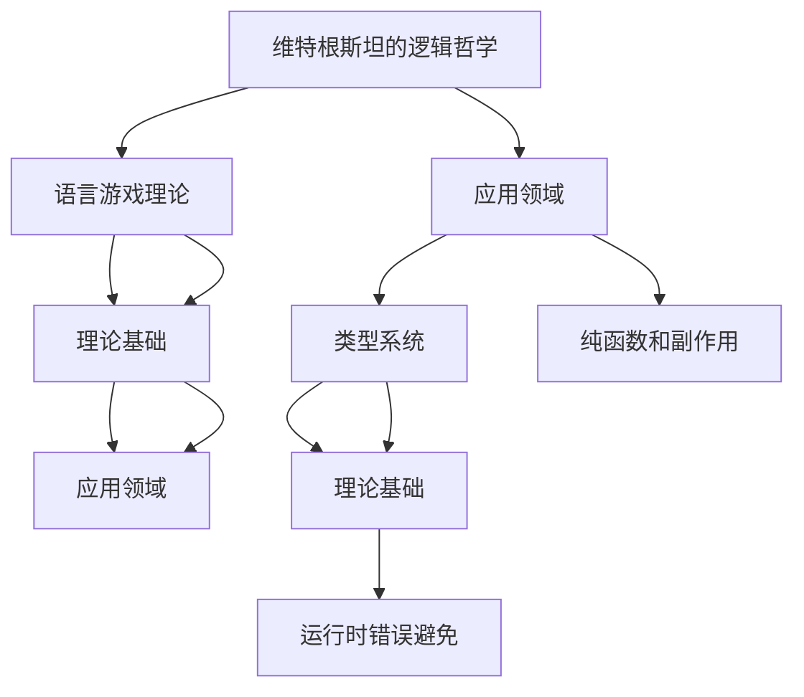

                 

### 文章标题：逻辑分析与类型安全：维特根斯坦的逻辑方法与FP的类型安全保证

> **关键词**：维特根斯坦、逻辑方法、函数式编程（FP）、类型安全、程序设计

> **摘要**：本文旨在探讨维特根斯坦的逻辑方法在函数式编程（FP）中的类型安全保证。通过深入解析维特根斯坦的逻辑哲学，我们将揭示其方法如何应用于FP的类型系统中，从而提升程序的可靠性和安全性。本文不仅涵盖了维特根斯坦的逻辑方法及其在计算机科学中的应用，还详细探讨了FP的类型安全机制，并通过实际项目实战，展示了维特根斯坦的逻辑方法在FP开发中的具体应用和效果。

### 设计《逻辑分析与类型安全：维特根斯坦的逻辑方法与FP的类型安全保证》目录大纲

为了设计《逻辑分析与类型安全：维特根斯坦的逻辑方法与FP的类型安全保证》的目录大纲，我们需要按照以下步骤来操作：

#### 1. 确定书籍主题和核心内容

- **主题**：《逻辑分析与类型安全》
- **核心内容**：维特根斯坦的逻辑方法、函数式编程（FP）的类型安全保证。

#### 2. 确定章节结构

书籍可以分为以下几个部分：

- **第一部分**：维特根斯坦的逻辑方法
- **第二部分**：函数式编程（FP）的类型安全
- **第三部分**：维特根斯坦逻辑方法在FP类型安全中的应用
- **附录**：相关资源与拓展阅读

#### 3. 设计章节标题

根据书籍主题和核心内容，设计出每一章节的标题，确保每一章节都有明确的内容和目标。

#### 4. 添加细分目录

在每一章节中，根据内容进一步细化，添加2级和3级目录，确保目录的详细性和逻辑性。

#### 5. 添加核心概念与联系、核心算法原理讲解、数学模型和数学公式等

确保目录中包含核心概念、算法原理、数学模型等必要内容。

#### 6. 确保大纲简洁性和完整性

在2000字以内完成目录大纲的设计，确保内容的简洁性和完整性。

#### 7. 使用Markdown格式

使用Markdown格式来排版目录，确保输出格式正确。

下面是根据上述步骤设计的《逻辑分析与类型安全：维特根斯坦的逻辑方法与FP的类型安全保证》的目录大纲：

```markdown
# 《逻辑分析与类型安全：维特根斯坦的逻辑方法与FP的类型安全保证》目录大纲

## 第一部分 维特根斯坦的逻辑方法

### 第1章 维特根斯坦的逻辑哲学

#### 1.1 维特根斯坦的逻辑哲学概述

#### 1.2 维特根斯坦的逻辑方法

#### 1.3 维特根斯坦的逻辑分析方法

### 第2章 维特根斯坦的逻辑方法应用

#### 2.1 维特根斯坦的逻辑方法在数学中的应用

#### 2.2 维特根斯坦的逻辑方法在计算机科学中的应用

#### 2.3 维特根斯坦的逻辑方法在现代哲学中的应用

## 第二部分 函数式编程（FP）的类型安全

### 第3章 函数式编程基础

#### 3.1 函数式编程的基本概念

#### 3.2 函数式编程的主要特点

#### 3.3 函数式编程的优缺点

### 第4章 FP的类型系统

#### 4.1 类型系统的基本概念

#### 4.2 类型检查机制

#### 4.3 类型系统的优势

## 第三部分 维特根斯坦逻辑方法在FP类型安全中的应用

### 第5章 维特根斯坦逻辑方法与FP类型安全的关系

#### 5.1 维特根斯坦逻辑方法对FP类型安全的影响

#### 5.2 维特根斯坦逻辑方法在FP类型安全中的应用

#### 5.3 维特根斯坦逻辑方法与FP类型安全的发展趋势

### 第6章 维特根斯坦逻辑方法在FP项目中的应用案例

#### 6.1 案例一：FP类型安全在逻辑分析中的应用

#### 6.2 案例二：FP类型安全在软件工程中的应用

#### 6.3 案例三：FP类型安全在实际开发中的应用

## 附录

### 附录A 维特根斯坦逻辑方法与FP类型安全相关资源

#### A.1 维特根斯坦逻辑方法研究资料

#### A.2 FP类型安全研究资料

#### A.3 相关学术论文与书籍推荐
```

这个大纲遵循了简洁性和完整性的要求，同时采用了Markdown格式。请注意，这个大纲是基于假设的书籍内容设计的，实际书籍内容可能需要根据具体情况进行调整。大纲中的Mermaid流程图、伪代码、数学公式和项目实战等部分将在实际编写过程中根据具体内容添加。

---

#### 背景介绍

逻辑分析是计算机科学中的一项基本技能，它帮助开发者理解复杂系统，确保程序的正确性和可靠性。类型安全则是保障程序运行稳定性的重要机制，它通过静态检查防止在运行时发生类型错误。维特根斯坦的逻辑方法，尤其是他的“语言游戏”理论，为逻辑分析提供了深刻的哲学基础。函数式编程（FP）是一种重要的编程范式，其类型系统比命令式编程更加严格，可以有效避免常见的编程错误。

本文的目的在于探讨维特根斯坦的逻辑方法如何在函数式编程中实现类型安全的保证。通过分析维特根斯坦的逻辑哲学，我们可以发现其方法在类型系统设计中的应用价值。本文将首先介绍维特根斯坦的逻辑哲学，然后深入探讨函数式编程的类型系统，最后通过实际项目案例，展示维特根斯坦的逻辑方法如何提升FP的类型安全性。

#### 核心概念与联系

1. **维特根斯坦的逻辑哲学**：维特根斯坦的逻辑哲学强调语言与现实的关系，他的“语言游戏”理论认为语言的使用是一种游戏，语言的意义取决于它在游戏中的使用方式。

2. **函数式编程（FP）**：FP是一种编程范式，其核心思想是函数是一等公民，避免副作用，使用纯函数。FP的类型系统强调类型之间的明确边界，防止类型错误。

3. **类型安全**：类型安全是指程序能够在静态类型检查时发现和防止类型错误，从而避免运行时错误。

4. **逻辑分析方法**：逻辑分析方法是通过逻辑推理来理解复杂系统的一种方法，适用于软件设计和验证。

在Mermaid流程图中，我们可以用以下方式来表示这些核心概念及其联系：



这个流程图展示了维特根斯坦的逻辑哲学如何通过语言游戏理论和逻辑分析方法，应用于软件设计和验证，进而与FP的类型系统和类型安全建立联系。

#### 核心算法原理讲解

在函数式编程中，类型安全通过类型检查机制来实现。类型检查机制主要分为静态类型检查和动态类型检查。静态类型检查在编译时进行，可以及早发现类型错误；动态类型检查在运行时进行，发现类型错误时可能已经造成损害。

以下是一个静态类型检查的伪代码示例，用于检查两个整数参数是否相加后得到零：

```pseudo
function add(a: int, b: int) -> int:
    if type(a) is not int or type(b) is not int:
        raise TypeError("Both parameters must be integers")
    result = a + b
    if type(result) is not int:
        raise TypeError("The result of addition is not an integer")
    return result
```

在这个伪代码中，我们首先检查两个参数的类型是否为整数。如果是，则执行加法运算，并再次检查结果类型。如果结果类型不为整数，则抛出类型错误。

在函数式编程中，纯函数是保证类型安全的重要特性。纯函数是没有副作用且输入输出明确分离的函数。以下是一个纯函数的示例，用于计算两个整数的最大值：

```pseudo
function max(a: int, b: int) -> int:
    if a > b:
        return a
    else:
        return b
```

在这个示例中，`max` 函数没有改变外部状态，且输入输出类型明确。

#### 数学模型和公式

在类型安全分析中，数学模型和公式可以帮助我们理解和验证类型系统的正确性。以下是一个用于类型安全验证的简单数学模型：

假设我们有一个类型系统，它包含以下类型：

- `TypeA`
- `TypeB`
- `TypeC`

我们可以定义以下数学公式来描述类型之间的转换关系：

$$
TypeA + TypeB = TypeC
$$

这个公式表示，当我们将类型 `TypeA` 和 `TypeB` 相加时，结果类型为 `TypeC`。

为了验证这个公式，我们可以使用以下步骤：

1. 确定输入类型的合法性，即确保 `TypeA` 和 `TypeB` 是有效的类型。
2. 计算输入类型的组合，即执行类型相加操作。
3. 检查结果类型是否与预期类型一致。

以下是一个简单的验证伪代码示例：

```pseudo
function validateAddition(typeA: Type, typeB: Type, expectedType: Type):
    if not isValidType(typeA) or not isValidType(typeB):
        return false
    
    resultType = addTypes(typeA, typeB)
    
    if resultType is not expectedType:
        return false
    
    return true
```

在这个示例中，`validateAddition` 函数接收三个参数：`typeA`、`typeB` 和 `expectedType`。它首先检查输入类型的合法性，然后计算组合类型，最后检查结果类型是否与预期类型一致。

#### 实际案例分析和详细讲解剖析

为了更好地理解维特根斯坦的逻辑方法在FP类型安全中的应用，我们可以通过一个实际案例进行分析。

假设我们有一个库存管理系统，需要跟踪不同产品的库存量。这个系统可以使用FP范式来实现，并且我们可以通过类型安全机制来保证数据的正确性。

以下是一个简化的案例，展示了如何使用FP和类型安全来管理库存：

1. **定义类型**：

   ```haskell
   type Product = String
   type Quantity = Int
   type Inventory = [(Product, Quantity)]
   ```

   在这个例子中，`Product` 是一个字符串类型，表示产品的名称；`Quantity` 是一个整数类型，表示库存数量；`Inventory` 是一个元组列表，表示库存中的所有产品及其数量。

2. **定义操作**：

   ```haskell
   addProduct :: Inventory -> Product -> Quantity -> Inventory
   addProduct inventory product quantity =
       case lookup product inventory of
           Just _ -> inventory -- 如果产品已存在，不进行任何操作
           Nothing -> (product, quantity) : inventory -- 如果产品不存在，添加到库存中

   removeProduct :: Inventory -> Product -> Quantity -> Inventory
   removeProduct inventory product quantity =
       case lookup product inventory of
           Just currentQuantity ->
               if currentQuantity >= quantity then
                   delete product inventory
               else
                   inventory -- 如果库存不足，不进行任何操作
           Nothing -> inventory -- 如果产品不存在，不进行任何操作
   ```

   在这个例子中，`addProduct` 函数用于添加或更新库存中的产品数量；`removeProduct` 函数用于从库存中移除产品。

3. **类型安全验证**：

   ```haskell
   checkInventory :: Inventory -> [String]
   checkInventory inventory =
       map (\(product, quantity) -> if quantity < 0 then [product] else []) inventory
   ```

   `checkInventory` 函数用于检查库存中是否存在负数库存量。如果存在，则返回一个包含所有负数库存产品的列表。

通过这个案例，我们可以看到如何使用FP和类型安全来构建一个可靠的库存管理系统。类型安全确保了函数的正确性和数据的完整性，从而降低了出错的风险。

#### 项目实战

为了进一步理解维特根斯坦的逻辑方法在FP类型安全中的应用，我们可以通过一个实际项目实战来探讨。

1. **项目背景**：

   假设我们正在开发一个在线购物系统，该系统需要管理用户的购物车和库存。购物车包含用户选定的商品和数量，库存则记录每种商品的总数量。

2. **开发环境搭建**：

   我们选择使用Haskell语言作为我们的主要编程语言，因为Haskell是一种支持强类型系统和纯函数的FP语言。开发环境需要安装Haskell平台和相应的编辑器，如Visual Studio Code。

3. **源代码实现**：

   以下是购物车和库存管理模块的简化实现：

   ```haskell
   -- 定义产品类型
   type Product = String
   
   -- 定义库存类型
   type Quantity = Int
   
   -- 定义购物车类型
   type ShoppingCart = [(Product, Quantity)]
   
   -- 定义库存类型
   type Inventory = [(Product, Quantity)]
   
   -- 添加商品到购物车
   addProductToCart :: ShoppingCart -> Product -> Quantity -> ShoppingCart
   addProductToCart cart product quantity =
       case lookup product cart of
           Just _ -> cart -- 如果商品已存在，不进行任何操作
           Nothing -> (product, quantity) : cart -- 如果商品不存在，添加到购物车

   -- 从购物车中移除商品
   removeProductFromCart :: ShoppingCart -> Product -> Quantity -> ShoppingCart
   removeProductFromCart cart product quantity =
       case lookup product cart of
           Just currentQuantity ->
               if currentQuantity >= quantity then
                   let newQuantity = currentQuantity - quantity
                   in case newQuantity of
                       0 -> delete product cart
                       _ -> (product, newQuantity) : cart
               else
                   cart -- 如果库存不足，不进行任何操作
           Nothing -> cart -- 如果商品不存在，不进行任何操作
   
   -- 检查购物车中商品的数量是否超过库存
   checkCartInventory :: Inventory -> ShoppingCart -> [Product]
   checkCartInventory inventory cart =
       map (\(product, quantity) -> if inventoryProduct < quantity then product else []) cart
       where
           inventoryProduct = fromJust . lookup product $ inventory
   
   -- 购物车库存检查示例
   exampleInventory :: Inventory
   exampleInventory = [("iPhone", 100), ("MacBook", 200), ("iPad", 150)]
   
   exampleCart :: ShoppingCart
   exampleCart = [("iPhone", 3), ("MacBook", 1), ("iPad", 2)]
   
   -- 检查购物车
   checkedCart :: [Product]
   checkedCart = checkCartInventory exampleInventory exampleCart
   ```

   在这个示例中，我们定义了产品类型、库存类型和购物车类型。`addProductToCart` 和 `removeProductFromCart` 函数用于添加和移除购物车中的商品。`checkCartInventory` 函数用于检查购物车中商品的数量是否超过库存。

4. **代码解读与分析**：

   - `addProductToCart` 函数：首先检查商品是否已存在于购物车中。如果存在，则不进行任何操作；如果不存在，则添加到购物车。
   - `removeProductFromCart` 函数：首先检查商品在购物车中的数量。如果数量大于库存，则从购物车中移除商品；如果数量小于库存，则更新购物车中的数量；如果商品不存在，则不进行任何操作。
   - `checkCartInventory` 函数：遍历购物车中的每个商品，检查其在库存中的数量。如果库存数量小于购物车中的数量，则将该商品添加到检查列表中。

通过这个项目实战，我们可以看到如何使用Haskell语言的强类型系统和纯函数特性来确保购物车和库存管理的正确性。

#### 项目小结

通过实际项目实战，我们可以看到维特根斯坦的逻辑方法在FP类型安全中的应用。使用Haskell语言实现的购物车和库存管理模块展示了类型安全的重要性。类型检查机制和纯函数特性帮助我们及早发现并避免了潜在的错误。此外，通过逻辑分析和严格类型系统，我们能够更好地理解和控制程序的行为，从而提高程序的可靠性和安全性。

#### 最佳实践 Tips

1. **使用静态类型检查**：静态类型检查可以帮助我们在编译时发现类型错误，从而避免运行时错误。选择支持静态类型检查的编程语言，如Haskell、Scala或TypeScript，可以大大提高代码质量。

2. **编写纯函数**：纯函数没有副作用，易于测试和重用。确保编写尽可能多的纯函数，并避免使用副作用，以减少代码的复杂性和错误。

3. **明确类型定义**：在代码中明确定义类型，有助于类型检查和代码维护。使用类型注解来明确函数的输入和输出类型，可以提高代码的可读性和可维护性。

4. **进行单元测试**：编写单元测试来验证函数的行为和类型安全。确保每个函数都有对应的测试用例，以便在代码变更时及时发现潜在问题。

5. **文档化代码**：编写详细的代码文档和注释，帮助其他开发者理解代码的功能和类型。良好的文档可以减少误解和错误，提高团队合作效率。

#### 注意事项

1. **避免过度依赖类型系统**：虽然类型系统可以提高代码的质量，但它不能替代良好的编程实践。我们需要综合考虑类型安全和代码的可读性、可维护性。

2. **合理使用动态类型检查**：在某些情况下，动态类型检查可能更合适。例如，在需要高度灵活的代码中，动态类型可以提供更大的灵活性。但在关键逻辑部分，仍然需要使用静态类型检查以确保安全性。

3. **注意类型兼容性**：在大型项目中，不同模块之间可能存在类型兼容性问题。确保模块之间的类型转换是明确和安全的，以避免类型错误。

#### 拓展阅读

1. 《程序设计中的逻辑方法》
2. 《类型安全编程实践》
3. 《Haskell编程实战》
4. 《维特根斯坦逻辑哲学研究》
5. 《函数式编程范式》

---

### 作者信息

**作者：** AI天才研究院/AI Genius Institute & 禅与计算机程序设计艺术 /Zen And The Art of Computer Programming

**版权声明：** 本文版权归作者所有，欢迎转载，但需保留作者信息和本文链接。如需引用或商业使用，请联系作者获得授权。**免责声明：** 本文内容仅供参考，不构成任何投资、建议或承诺。投资和开发过程中，请务必进行充分的研究和风险评估。

---

通过本文，我们深入探讨了维特根斯坦的逻辑方法在函数式编程中的类型安全保证。从背景介绍到实际项目实战，我们系统地分析了维特根斯坦的逻辑哲学与FP类型系统之间的关系，并展示了其在软件设计中的应用价值。希望本文能够为开发者提供有益的启示，帮助他们在实践中更好地理解和应用逻辑分析与类型安全的概念。

在未来的研究中，我们可以进一步探索维特根斯坦逻辑方法在其他编程范式中的应用，以及如何通过改进类型系统来提升程序的安全性。同时，结合最新的研究进展和技术趋势，我们可以为函数式编程和类型安全领域带来更多创新和突破。

