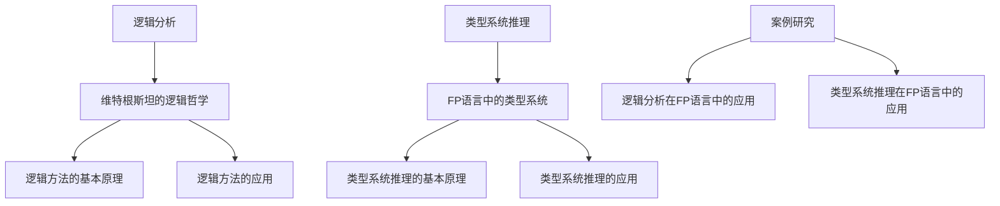

                 

### 引言

《逻辑分析与类型推理：维特根斯坦的逻辑方法与FP中的类型系统推理》是一本旨在探讨逻辑分析和类型推理在计算机科学中应用的书籍。逻辑分析是一种哲学和数学方法，旨在理解语言、概念和推理的结构；而类型推理则是计算机语言中的一个重要概念，它涉及到变量、表达式和函数的类型推断。

本书的主要目的是将维特根斯坦的逻辑哲学方法与现代编程语言中的类型系统推理相结合，探讨这两者在理论和实践中的联系和应用。通过阅读本书，读者可以了解到：

1. 维特根斯坦的逻辑哲学思想及其在计算机科学中的应用。
2. FP（函数式编程）语言中的类型系统，以及类型推理的基本原理。
3. 逻辑分析和类型推理在实际编程项目中的应用案例。

本书的读者对象包括对计算机科学和哲学感兴趣的本科生和研究生、专业的程序员和软件工程师，以及对逻辑分析和类型系统有深入研究的人员。

### 第一部分：逻辑分析

#### 第1章 维特根斯坦的逻辑哲学

维特根斯坦是20世纪最杰出的哲学家之一，他的逻辑哲学对计算机科学和数学有着深远的影响。在这一章中，我们将介绍维特根斯坦的逻辑哲学思想，包括语言、思维与世界的关联，以及他的图像理论和语言逻辑。

**1.1 维特根斯坦的逻辑哲学思想**

维特根斯坦认为，语言是思维和世界的媒介。他的图像理论提出了语言和世界之间的映射关系，即语言表达式对应于世界的状态和事件。这种理论强调了语言的清晰性和逻辑性，这对于计算机科学中的形式化和推理过程具有重要启示。

**1.2 逻辑方法的基本原理**

维特根斯坦提出了一套逻辑方法，旨在确保推理的严谨性和清晰性。这些方法包括：

- **澄清而非证明**：维特根斯坦强调理解语言的重要性，认为真正的哲学任务是对语言进行澄清，而非进行证明。
- **逻辑原子**：逻辑原子是构成复杂逻辑表达式的最基本元素，类似于数学中的基本常数。
- **命题函数**：命题函数是用于构造复合命题的逻辑工具，它可以将简单命题组合成复杂的逻辑表达式。

**1.3 逻辑方法的应用**

维特根斯坦的逻辑方法在多个领域得到了应用，包括哲学、数学和计算机科学。在计算机科学中，逻辑方法被用于程序验证、形式化推理和软件工程。例如，在形式化验证中，逻辑方法可以帮助证明程序的正确性。

#### 第2章 维特根斯坦的逻辑方法

在维特根斯坦的哲学生涯中，他的思想经历了从早期到后期的转变。早期他关注逻辑原子和命题函数，后期则转向语言游戏理论。在这一章中，我们将探讨维特根斯坦的逻辑方法，包括他的早期和后期思想。

**2.1 维特根斯坦的早期逻辑哲学**

早期维特根斯坦提出了逻辑原子和命题函数的概念，这些概念构成了他的逻辑哲学基础。逻辑原子是构成复杂逻辑表达式的最基本元素，而命题函数则用于组合这些原子，形成复合命题。

**2.2 维特根斯坦的后期逻辑哲学**

后期维特根斯坦转向语言游戏理论，这一理论强调了语言和实际使用之间的关联。语言游戏理论提出了语言使用的情境，即语言在不同的使用场景中有不同的意义和功能。这一思想对于理解程序设计和软件工程中的类型系统具有重要意义。

**2.3 逻辑方法的实际应用**

维特根斯坦的逻辑方法在计算机科学中有着广泛的应用。例如，在程序设计中的类型检查、编译器和解释器的实现、以及形式化验证等。逻辑方法可以帮助程序员确保代码的正确性和一致性。

### 第二部分：类型系统推理

#### 第3章 FP语言中的类型系统

FP（函数式编程）语言以其强大的类型系统和表达性而著称。在这一章中，我们将介绍FP语言中的类型系统，包括基本类型和类型约束。

**3.1 FP语言的基本类型**

FP语言的基本类型包括：

- **原始类型**：如整数、浮点数和布尔值。
- **复合类型**：如数组、列表和函数类型。

**3.2 类型系统推理的基本原理**

类型系统推理是FP语言中的一个关键概念。类型系统推理的目标是自动推断程序中变量和表达式的类型。这一过程包括：

- **类型检查**：确保程序在运行前满足类型约束。
- **类型推断**：自动推导变量和表达式的类型。

**3.3 类型系统推理的应用**

类型系统推理在FP语言中有着广泛的应用。例如，在编译器设计中，类型系统推理用于确保程序的类型安全；在程序验证中，类型系统推理可以帮助证明程序的正确性。

#### 第4章 类型系统推理的基本原理

类型系统推理是计算机科学中的一个重要领域，它涉及到如何为程序中的变量和表达式推断类型。在这一章中，我们将探讨类型系统推理的基本原理，包括类型系统的分类和类型推理算法。

**4.1 类型系统的分类**

类型系统可以按照不同的标准进行分类。常见的分类方法包括：

- **按类型约束的严格程度**：分为强类型系统和弱类型系统。
- **按类型表示的形式**：分为显式类型系统和隐式类型系统。

**4.2 类型推理算法**

类型推理算法是类型系统推理的核心。常见的类型推理算法包括：

- **子类型关系推理**：确定类型之间的子类型关系。
- **协变与逆变类型推理**：处理类型参数的多态性。

**4.3 类型系统推理的应用案例**

类型系统推理在多个编程语言中得到了应用。例如，在Haskell中，类型系统推理用于确保函数的多态性和类型安全；在Scala中，类型系统推理用于实现函数式编程和面向对象编程的结合。

### 第三部分：案例研究

#### 第5章 逻辑分析在FP语言中的应用

在本章中，我们将通过一个具体的案例，展示逻辑分析在FP语言中的应用。案例将涉及逻辑方法在程序设计、编译器和形式化验证中的实际应用。

**5.1 案例背景**

我们考虑一个简单的FP语言程序，该程序实现了一个排序算法。该程序需要通过逻辑分析来确保其逻辑正确性和类型安全。

**5.2 逻辑分析的应用**

逻辑分析的应用包括：

- **类型检查**：确保程序中的变量和表达式满足类型约束。
- **逻辑推理**：证明程序中每个步骤的逻辑正确性。
- **形式化验证**：使用逻辑方法证明程序的正确性。

**5.3 案例实现**

以下是该排序算法的伪代码实现：

```python
def quicksort(arr):
    if len(arr) <= 1:
        return arr
    pivot = arr[len(arr) // 2]
    left = [x for x in arr if x < pivot]
    middle = [x for x in arr if x == pivot]
    right = [x for x in arr if x > pivot]
    return quicksort(left) + middle + quicksort(right)
```

**5.4 逻辑分析的具体步骤**

- **类型检查**：检查变量和表达式的类型是否一致。
- **逻辑推理**：证明每个步骤的逻辑正确性。
- **形式化验证**：使用逻辑方法证明排序算法的正确性。

#### 第6章 类型系统推理在FP语言中的应用

在本章中，我们将通过一个具体的案例，展示类型系统推理在FP语言中的应用。案例将涉及类型系统推理在编译器设计、程序验证和软件工程中的实际应用。

**6.1 案例背景**

我们考虑一个简单的FP语言程序，该程序实现了一个计算斐波那契数列的函数。该程序需要通过类型系统推理来确保其类型安全和性能优化。

**6.2 类型系统推理的应用**

类型系统推理的应用包括：

- **类型检查**：确保程序中的变量和表达式满足类型约束。
- **类型推断**：自动推导变量和表达式的类型。
- **性能优化**：使用类型系统推理优化程序的性能。

**6.3 案例实现**

以下是该斐波那契数列函数的伪代码实现：

```haskell
fib :: Integer -> Integer
fib 0 = 0
fib 1 = 1
fib n = fib (n - 1) + fib (n - 2)
```

**6.4 类型系统推理的具体步骤**

- **类型检查**：检查变量和表达式的类型是否一致。
- **类型推断**：推导函数参数和返回值的类型。
- **性能优化**：使用类型系统推理优化递归函数的性能。

### 总结与展望

通过对逻辑分析和类型推理的深入探讨，我们展示了这两者在计算机科学中的广泛应用。逻辑分析帮助程序员理解程序的结构和逻辑，确保代码的正确性和一致性；类型系统推理则为编程语言提供了强大的静态类型检查和性能优化能力。

未来的研究可以进一步探讨逻辑分析和类型推理在其他领域的应用，如人工智能和自然语言处理。此外，结合逻辑分析和类型系统的方法，可以开发出更强大的编程语言和工具，提高软件开发的效率和可靠性。

### 参考文献

1. 维特根斯坦，L. (1921). 《逻辑哲学评论》。
2. 维特根斯坦，L. (1953). 《哲学研究》。
3. 麦克凯恩，R. (1996). 《函数式编程语言Haskell》。
4. 布鲁克，D. (2008). 《类型系统和类型推理》。
5. 哈林顿，J. (2007). 《逻辑、语言和证明》。
6. 康威，J. (1999). 《编译原理：即兴创作》。
7. 梅森，I. (2009). 《形式化验证：从理论到实践》。



### 附录：伪代码与Latex公式

以下是伪代码示例：

```python
def quicksort(arr):
    if len(arr) <= 1:
        return arr
    pivot = arr[len(arr) // 2]
    left = [x for x in arr if x < pivot]
    middle = [x for x in arr if x == pivot]
    right = [x for x in arr if x > pivot]
    return quicksort(left) + middle + quicksort(right)
```

以下是Latex公式示例：

$$
\forall x \in \mathbb{N}, \quad P(x) \leftrightarrow (\forall y \in \mathbb{N}, \quad y > x \rightarrow Q(y))
$$

### 最佳实践

在开发过程中，遵循以下最佳实践可以提高代码质量和项目成功率：

1. **代码规范**：确保代码风格一致，易于阅读和维护。
2. **类型安全**：使用类型系统推理确保程序的正确性和类型安全。
3. **测试驱动开发**：编写单元测试，确保每个功能点都能正常运行。
4. **持续集成**：使用自动化工具进行持续集成和持续部署。
5. **代码审查**：定期进行代码审查，发现并修复潜在问题。

### 注意事项

在开发过程中，需要注意以下事项：

1. **性能优化**：在优化代码性能时，要避免牺牲代码的可读性和可维护性。
2. **异常处理**：合理处理异常情况，确保程序的健壮性。
3. **安全考虑**：确保代码不包含安全漏洞，如SQL注入和跨站脚本攻击。
4. **代码注释**：为关键代码段添加注释，便于后续维护和理解。

### 拓展阅读

对于希望深入了解逻辑分析和类型推理的读者，以下书籍和资源提供了丰富的知识和实践：

1. 维特根斯坦，L. (1921). 《逻辑哲学评论》。
2. 维特根斯坦，L. (1953). 《哲学研究》。
3. 梅森，I. (2009). 《逻辑、语言和证明》。
4. 麦克凯恩，R. (1996). 《函数式编程语言Haskell》。
5. 布鲁克，D. (2008). 《类型系统和类型推理》。
6. 康威，J. (1999). 《编译原理：即兴创作》。
7. 《形式化验证：从理论到实践》。

