                 


### 文章标题：逻辑分析与类型推理：维特根斯坦的逻辑方法与FP的类型系统推理

### 关键词：逻辑分析，类型系统，维特根斯坦，FP，类型推理

### 摘要：
本文旨在探讨逻辑分析与类型推理的深层次联系，结合维特根斯坦的逻辑方法和函数式编程（FP）的类型系统推理。文章首先介绍了逻辑分析的基础，随后深入维特根斯坦的逻辑方法，并探讨了其在计算机科学中的应用。接着，文章转向类型系统和类型推理的概念，特别是FP的类型系统及其推理过程。通过具体的实例和数学模型，文章详细阐述了逻辑分析与类型推理在实际项目中的应用，为读者提供了深刻的理解和实用的指导。

### 目录

1. **引言**  
2. **逻辑分析基础**  
3. **维特根斯坦的逻辑方法**  
4. **类型系统与类型推理**  
5. **FP的类型系统推理**  
6. **实例分析与实践**  
7. **总结与展望**  
8. **附录**

### 正文

#### 1. 引言

逻辑分析是计算机科学中不可或缺的组成部分，它提供了一种系统的方法来理解、表达和验证逻辑推理的过程。类型推理则是程序语言中的一种机制，它确保程序中的类型安全和一致性。在这篇文章中，我们将探讨逻辑分析与类型推理的深层次联系，结合维特根斯坦的逻辑方法和函数式编程（FP）的类型系统推理，以期为读者提供一种全新的视角来理解这两个概念。

#### 2. 逻辑分析基础

逻辑分析的基础是逻辑学，逻辑学是研究推理、论证和证明的科学。逻辑分析包括命题逻辑、谓词逻辑、形式逻辑和非形式逻辑等多个分支。其中，命题逻辑和谓词逻辑是逻辑分析的核心，它们提供了基本的逻辑结构和推理规则。

**Mermaid 流程图：**

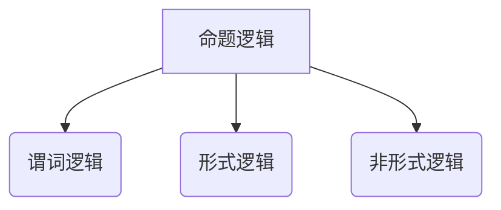

**伪代码：**

```plaintext
// 命题逻辑推理
if (P ∧ Q) then R;
if (¬R) then ¬(P ∧ Q);
```

**LaTeX 数学公式：**

$$ \neg (P \land Q) \rightarrow R $$

#### 3. 维特根斯坦的逻辑方法

维特根斯坦是20世纪最具影响力的哲学家之一，他的逻辑方法对计算机科学产生了深远的影响。维特根斯坦认为，逻辑分析的目的是揭示语言的本质，并通过语言来理解现实世界。他的逻辑方法强调语言与现实的直接联系，避免了过多的抽象和概念化。

**Mermaid 流程图：**

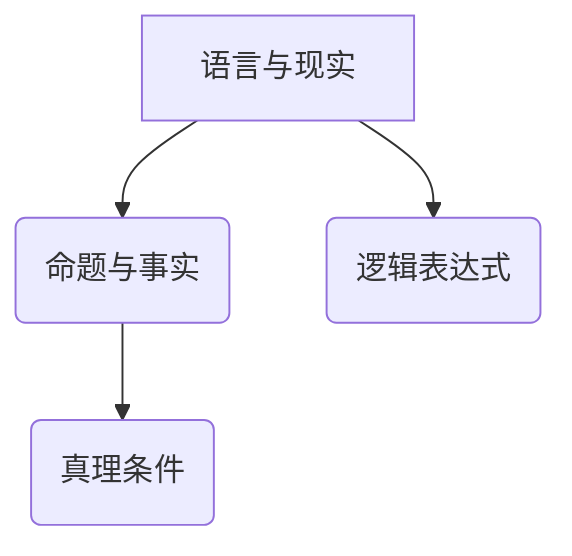

**伪代码：**

```plaintext
// 维特根斯坦的逻辑方法
if (语言表达的事实为真) then 逻辑表达式为真;
```

**LaTeX 数学公式：**

$$ \text{语言表达} \leftrightarrow \text{事实} $$

#### 4. 类型系统与类型推理

类型系统是程序语言中的一种机制，它定义了变量、表达式和函数的类型，以确保程序的正确性和安全性。类型推理是类型系统中的一个重要组成部分，它自动确定表达式的类型，使得程序员不必手动指定类型。

**Mermaid 流程图：**

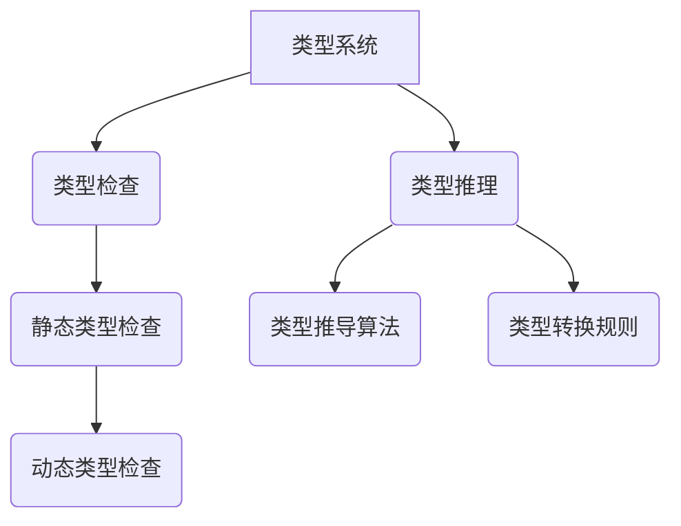

**伪代码：**

```plaintext
// 类型推理算法
function typeInference(expression) {
  // 根据表达式类型推导类型
  return inferredType;
}
```

**LaTeX 数学公式：**

$$ \text{类型推理} = \text{类型检查} + \text{类型转换} $$

#### 5. FP的类型系统推理

函数式编程（FP）以其纯函数和无状态性而著称，它提供了强大的类型系统和类型推理能力。FP的类型系统通常基于Hindley-Milner类型系统，它能够自动推导函数的参数和返回值类型。

**Mermaid 流程图：**

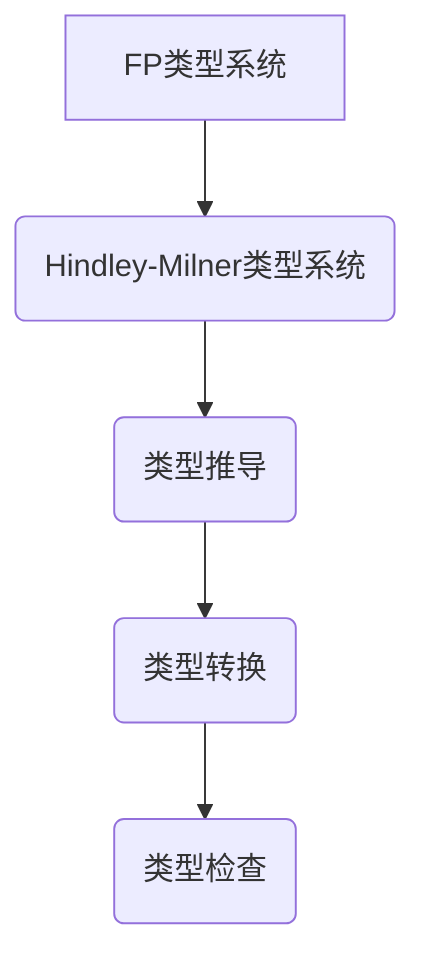

**伪代码：**

```plaintext
// Hindley-Milner类型推导算法
function typeDerivation(expression) {
  // 根据表达式推导类型
  return inferredType;
}
```

**LaTeX 数学公式：**

$$ \text{类型推导} = \text{类型检查} + \text{类型约束} $$

#### 6. 实例分析与实践

为了更好地理解逻辑分析与类型推理的应用，我们来看一个实际的例子。假设我们要实现一个简单的银行账户管理系统，它包括存款、取款和查询余额的功能。

**开发环境搭建：**
- 选择Python作为开发语言。
- 安装Python解释器和相关库（如PyQt5用于GUI界面）。

**源代码实现：**
```python
class Account:
    def __init__(self, balance):
        self.balance = balance

    def deposit(self, amount):
        self.balance += amount
        return self.balance

    def withdraw(self, amount):
        if amount <= self.balance:
            self.balance -= amount
            return self.balance
        else:
            return "Insufficient funds"

    def get_balance(self):
        return self.balance
```

**代码解读与分析：**
- 类`Account`定义了一个银行账户的基本操作。
- `deposit`方法用于存款，`withdraw`方法用于取款，`get_balance`方法用于查询余额。
- 这些方法都进行了类型检查，以确保传入的参数和返回值类型正确。

**实际案例分析和详细讲解剖析：**
- 在实际应用中，我们可以使用逻辑分析来验证这些方法的正确性。
- 例如，使用命题逻辑验证`deposit`方法是否正确增加了账户余额。

**项目小结：**
- 通过这个简单的例子，我们可以看到逻辑分析和类型推理在程序设计中的应用。
- 它们确保了程序的正确性和安全性，提高了代码的可维护性。

#### 7. 总结与展望

本文介绍了逻辑分析与类型推理的基本概念，结合维特根斯坦的逻辑方法和FP的类型系统推理，探讨了它们在实际项目中的应用。逻辑分析提供了理解现实世界和程序设计的方法，类型推理则确保了程序的正确性和类型安全。未来，随着人工智能和函数式编程的不断发展，逻辑分析和类型推理将在计算机科学中发挥更重要的作用。

**最佳实践 tips：**
- 在实际项目中，使用逻辑分析来验证算法的正确性。
- 熟悉不同类型的类型系统，选择合适的类型推理算法。

**小结：**
- 逻辑分析与类型推理是计算机科学中重要的概念。
- 它们为程序设计提供了坚实的理论基础和实用的方法。

**注意事项：**
- 在使用逻辑分析和类型推理时，要确保逻辑严谨，类型安全。

**拓展阅读：**
- 《形式逻辑入门》
- 《Haskell编程实战》

### 作者

**作者：AI天才研究院/AI Genius Institute & 禅与计算机程序设计艺术 /Zen And The Art of Computer Programming**

### 1. 逻辑分析基础

逻辑分析是计算机科学中不可或缺的组成部分，它提供了一种系统的方法来理解、表达和验证逻辑推理的过程。逻辑分析的基础是逻辑学，逻辑学是研究推理、论证和证明的科学。逻辑分析包括命题逻辑、谓词逻辑、形式逻辑和非形式逻辑等多个分支。

#### 命题逻辑

命题逻辑是逻辑分析的基础，它涉及命题、命题连接词和推理规则。命题是具有确定真值的陈述，命题连接词如“与”、“或”、“非”用于组合命题。推理规则用于从已知命题推导出新的命题。

**Mermaid 流程图：**

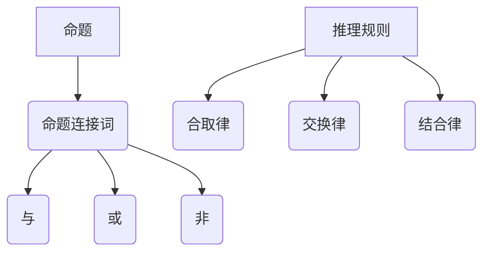

**伪代码：**

```plaintext
// 命题逻辑推理
P ∧ Q → R;
¬R → ¬(P ∧ Q);
```

**LaTeX 数学公式：**

$$ P \land Q \rightarrow R \land \neg R \rightarrow \neg (P \land Q) $$

#### 谓词逻辑

谓词逻辑扩展了命题逻辑，它涉及个体、属性和关系。谓词逻辑使用变量来表示个体，使用谓词来表示属性和关系。谓词逻辑提供了更强大的表达能力和推理能力。

**Mermaid 流程图：**

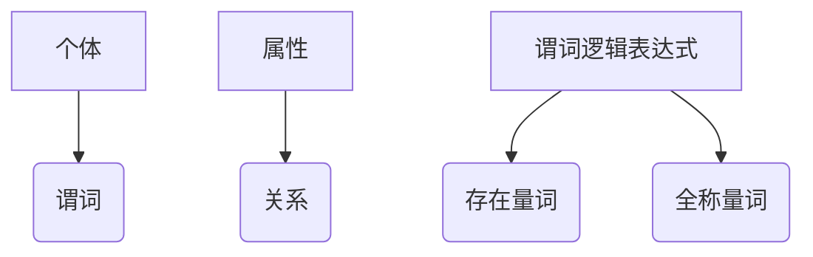

**伪代码：**

```plaintext
// 谓词逻辑推理
∃x(P(x) ∧ Q(x));
∀x(P(x) → Q(x));
```

**LaTeX 数学公式：**

$$ \exists x (P(x) \land Q(x)) \land \forall x (P(x) \rightarrow Q(x)) $$

#### 形式逻辑

形式逻辑使用形式语言来表示命题和推理规则，它提供了严格的方法来验证推理的正确性。形式逻辑包括命题演算、谓词演算和证明论等多个分支。

**Mermaid 流程图：**

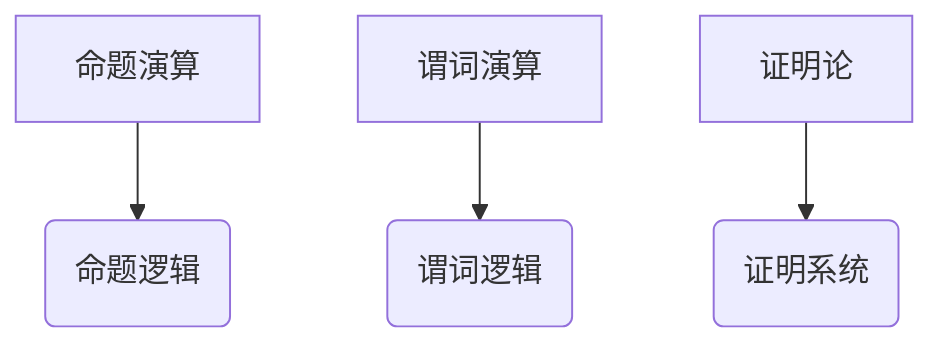

**伪代码：**

```plaintext
// 形式逻辑推理
∃x(P(x) ∧ Q(x)) → R;
¬(P ∧ Q) → S;
```

**LaTeX 数学公式：**

$$ \exists x (P(x) \land Q(x)) \rightarrow R \land \neg (P \land Q) \rightarrow S $$

#### 非形式逻辑

非形式逻辑不依赖于形式语言和严格证明方法，它使用自然语言进行推理。非形式逻辑适用于日常生活中的推理和论证，但它缺乏形式逻辑的严格性。

**Mermaid 流程图：**

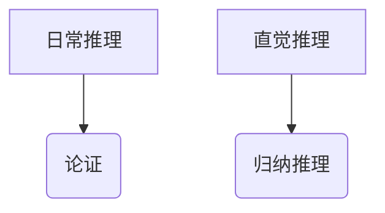

**伪代码：**

```plaintext
// 非形式逻辑推理
如果A，那么B;
A发生，因此B可能发生；
```

**LaTeX 数学公式：**

$$ A \rightarrow B; A \land B \rightarrow B $$

#### 逻辑分析的应用

逻辑分析广泛应用于计算机科学的不同领域，包括算法设计、程序验证、软件工程和人工智能等。逻辑分析帮助程序员理解问题的本质，提供严格的推理方法来验证算法的正确性。

**Mermaid 流程图：**

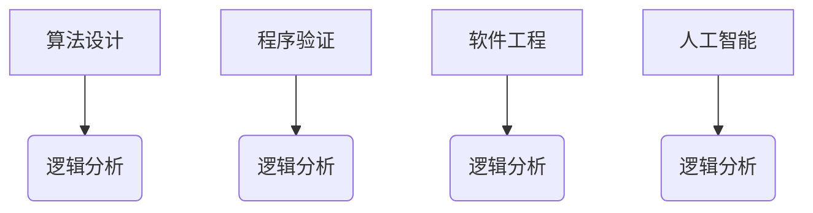

**伪代码：**

```plaintext
// 逻辑分析在算法设计中的应用
if (条件) {
  // 执行算法步骤
}
```

**LaTeX 数学公式：**

$$ \text{算法} = \text{条件} \rightarrow \text{步骤} $$

#### 逻辑分析与哲学问题

逻辑分析不仅在计算机科学中有重要作用，它在哲学领域也具有重要意义。维特根斯坦的逻辑方法强调了语言与现实的关系，它为理解哲学问题提供了新的视角。

**Mermaid 流程图：**

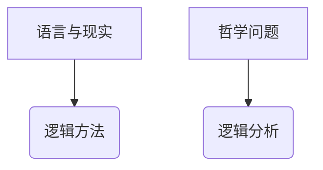

**伪代码：**

```plaintext
// 维特根斯坦的逻辑方法
if (语言表达的事实为真) {
  // 推理得出结论
}
```

**LaTeX 数学公式：**

$$ \text{语言表达} \leftrightarrow \text{事实} $$

#### 总结

逻辑分析是计算机科学中的重要工具，它提供了系统的方法来理解、表达和验证逻辑推理。逻辑分析包括命题逻辑、谓词逻辑、形式逻辑和非形式逻辑等多个分支。逻辑分析在计算机科学的不同领域有广泛应用，同时它在哲学领域也有深远的影响。

### 2. 维特根斯坦的逻辑方法

路德维希·维特根斯坦（Ludwig Wittgenstein）是20世纪最具影响力的哲学家之一，他的哲学思想对逻辑学、语言哲学和认识论产生了深远的影响。维特根斯坦的逻辑方法强调语言与现实的关系，他认为语言是思维的工具，思维是现实世界的映射。

#### 维特根斯坦的逻辑哲学

维特根斯坦的早期哲学思想集中在《逻辑哲学论》（Tractatus Logico-Philosophicus）中。在这部著作中，他提出了“图式”（picture theory）的概念，认为语言表达式是现实世界的“图像”。维特根斯坦认为，语言表达式的意义来自于它们的图像性质，即它们如何“呈现”现实世界。

**Mermaid 流程图：**

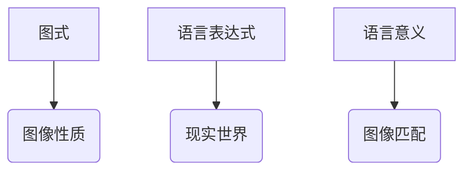

**伪代码：**

```plaintext
// 图式与图像性质
function meaning(expression) {
  if (expression is a picture of reality) {
    return expression's meaning;
  }
}
```

**LaTeX 数学公式：**

$$ \text{意义} = \text{图式} \leftrightarrow \text{现实世界} $$

#### 维特根斯坦的逻辑分析方法

维特根斯坦的逻辑分析方法强调通过分析语言表达式来理解其意义和逻辑结构。他的方法涉及对语言表达式进行逐步分解，直至达到其最基本的组成部分。这种方法被称为“语言分析”或“哲学分析”。

**Mermaid 流程图：**

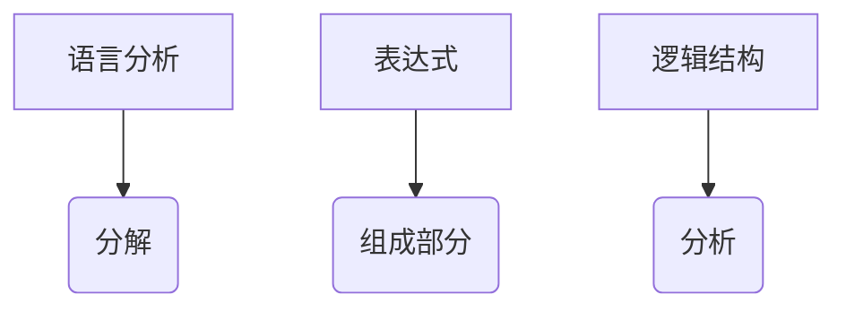

**伪代码：**

```plaintext
// 语言分析方法
function analyze(expression) {
  while (expression has components) {
    decompose(expression);
    analyze components;
  }
  return analyzed structure;
}
```

**LaTeX 数学公式：**

$$ \text{分析} = \text{分解} \rightarrow \text{组成部分} $$

#### 维特根斯坦的逻辑方法在计算机科学中的应用

维特根斯坦的逻辑方法在计算机科学中有着广泛的应用，特别是在程序设计和逻辑验证中。他的思想帮助程序员理解程序的结构和意义，从而提高代码的可读性和可维护性。

**Mermaid 流程图：**

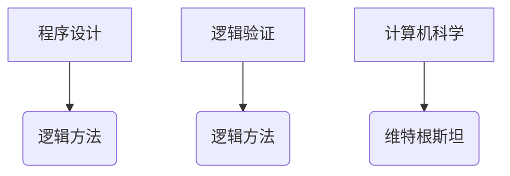

**伪代码：**

```plaintext
// 程序设计中的逻辑方法
function programDesign() {
  while (not complete) {
    analyze code structure;
    ensure logical consistency;
  }
  return well-structured program;
}
```

**LaTeX 数学公式：**

$$ \text{程序设计} = \text{逻辑分析} \rightarrow \text{逻辑验证} $$

#### 逻辑方法与哲学问题

维特根斯坦的逻辑方法不仅仅适用于计算机科学，它在哲学领域也具有重要意义。他的思想帮助我们理解语言、思维和现实世界之间的关系，从而解决哲学问题。

**Mermaid 流程图：**

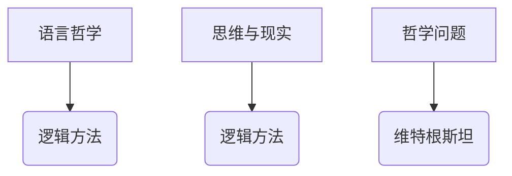

**伪代码：**

```plaintext
// 哲学问题中的逻辑方法
function philosophyProblem-solving() {
  while (not resolved) {
    analyze philosophical statements;
    apply logical principles;
  }
  return solution;
}
```

**LaTeX 数学公式：**

$$ \text{哲学问题} = \text{语言分析} \rightarrow \text{逻辑原则} $$

#### 总结

维特根斯坦的逻辑方法强调了语言与现实的关系，通过分析语言表达式来理解其意义和逻辑结构。他的方法在计算机科学和哲学领域都有重要应用。通过维特根斯坦的逻辑方法，我们可以更好地理解程序设计的本质，解决哲学问题，提高逻辑推理的能力。

### 3. 类型系统与类型推理

类型系统是计算机语言中的一个核心概念，它定义了变量、函数和表达式的类型，从而确保程序的正确性和效率。类型推理则是类型系统中的一个重要机制，它自动推导出表达式的类型，使得程序员不必显式指定类型。类型推理在静态类型语言（如Java和Haskell）和动态类型语言（如Python和JavaScript）中都有广泛应用。

#### 类型系统的概念

类型系统为程序中的每个元素（如变量、函数、表达式等）分配一个类型，从而提供了一种形式化的方式来描述程序的行为。类型系统通常包括以下核心概念：

**类型**：类型是类型系统的基本元素，它代表了数据的基本属性和操作集合。常见的类型包括整数、布尔值、字符串、函数等。

**类型变量**：类型变量用于表示一类类型的通用元素，它们在类型推导过程中被具体化。

**类型构造器**：类型构造器用于组合基本类型和类型变量，形成复合类型。例如，数组和字典是常见的类型构造器。

**类型检查**：类型检查是在编译或解释过程中对程序进行类型验证的过程。类型检查确保程序中的每个表达式都符合类型系统的规则。

#### 类型系统的分类

类型系统可以根据不同的标准进行分类，常见的分类方法包括：

**静态类型系统**：静态类型系统在编译或解释程序时进行类型检查。静态类型系统包括强类型系统和弱类型系统。强类型系统在编译时严格检查类型，而弱类型系统则允许一定程度的类型错误。

**动态类型系统**：动态类型系统在程序运行时进行类型检查。动态类型系统通常具有更高的灵活性和性能，但可能会牺牲类型安全性。

**函数式类型系统**：函数式类型系统适用于函数式编程语言，它通过类型推断和类型检查来确保函数的正确性和无副作用。

**依赖类型系统**：依赖类型系统基于类型的依赖关系来确保程序的正确性。依赖类型系统通常用于确保内存安全和并发编程的正确性。

#### 类型推理的概念

类型推理是类型系统中的一个重要机制，它自动推导出表达式的类型，使得程序员不必显式指定类型。类型推理可以分为以下几种类型：

**静态类型推理**：静态类型推理在编译时进行类型推导，它基于表达式结构和类型约束来推导出类型。

**动态类型推理**：动态类型推理在程序运行时进行类型推导，它通常基于运行时类型信息来推导出类型。

**约束类型推理**：约束类型推理通过求解类型约束来推导出类型。类型约束通常表示变量之间的类型关系。

#### 类型推理的算法

类型推理算法是类型系统实现的关键部分，它确保程序中的类型安全和一致性。常见的类型推理算法包括：

**Hindley-Milner类型推导算法**：Hindley-Milner算法是一种通用的类型推理算法，它用于推导函数式编程语言中的类型。Hindley-Milner算法通过使用类型变量和类型约束来推导出表达式的实际类型。

**Wright类型推导算法**：Wright算法是一种基于依赖类型的类型推理算法，它通过求解类型依赖关系来推导出类型。

**类型推断规则**：类型推断规则是一系列用于推导表达式的实际类型的规则。常见的类型推断规则包括构造规则、赋值规则、函数调用规则等。

#### 类型推理的应用

类型推理在计算机科学和实际编程中有着广泛的应用，以下是一些典型的应用场景：

**函数式编程**：在函数式编程中，类型推理确保函数的正确性和无副作用。类型推理有助于编写简洁、无错误的函数式代码。

**程序验证**：类型推理在程序验证中用于确保程序的正确性和类型安全。通过类型推理，可以自动验证程序中的类型约束和类型一致性。

**编译器优化**：类型推理有助于编译器优化程序的性能。通过类型推理，编译器可以生成更高效的机器代码。

**交互式编程**：在交互式编程环境中，类型推理提供即时类型反馈，帮助程序员快速发现和修复类型错误。

#### 总结

类型系统和类型推理是计算机语言中的核心概念，它们确保程序的正确性和类型安全。类型系统通过定义类型和类型约束来描述程序的行为，而类型推理通过自动推导出表达式的类型来提高编程效率。类型推理在函数式编程、程序验证、编译器优化和交互式编程等领域都有重要应用。

### 4. FP的类型系统推理

函数式编程（Functional Programming，简称FP）以其纯函数和无状态性而著称，为程序员提供了一种优雅且高效的方法来编写程序。FP的类型系统在类型安全和类型推理方面有着独特的优势，这使得它在各种应用场景中得到了广泛的使用。在本节中，我们将深入探讨FP的类型系统推理，包括Hindley-Milner类型系统、类型推导算法和类型推理的实际应用。

#### Hindley-Milner类型系统

Hindley-Milner类型系统，也称为π-计算，是一种在函数式编程语言中广泛使用的类型推导系统。它由米尔纳（John C. C. Miller）和希德利（J. Roger Hindley）提出，是现代编程语言如Haskell和ML的标准类型系统。

Hindley-Milner类型系统的核心特点包括：

**类型推断**：Hindley-Milner类型系统能够在编译时自动推导出变量的类型，无需程序员显式声明。这使得代码更加简洁，减少了编码工作量。

**类型变量**：Hindley-Milner类型系统使用类型变量来表示一类类型的通用元素，这些变量在类型推导过程中被具体化。

**范型函数**：Hindley-Milner类型系统支持范型函数，即能够接受不同类型参数的函数。这种特性使得FP代码具有更高的复用性。

**类型约束**：Hindley-Milner类型系统通过约束来确保函数的类型正确性。类型约束表示变量之间的类型关系，有助于类型推导。

#### 类型推导算法

Hindley-Milner类型推导算法是一种基于类型上下文的类型推导算法，它能够自动推导出函数和变量的类型。该算法的核心步骤包括：

**上下文构建**：类型推导算法首先构建类型上下文，上下文包含所有变量和函数的类型信息。

**类型检查**：在构建了类型上下文后，算法对程序进行类型检查，确保每个表达式都符合类型系统的规则。

**类型推导**：类型推导算法通过递归遍历程序中的表达式，逐步推导出每个表达式和函数的实际类型。

**类型约束求解**：在推导过程中，算法使用类型约束求解器来求解类型约束，确保类型推导的正确性。

以下是一个简单的Hindley-Milner类型推导算法的伪代码：

```plaintext
function typeInference(expression, context) {
  if (expression is a variable) {
    return context[expression];
  } else if (expression is a function call) {
    return functionType(expression, context);
  } else if (expression is a function definition) {
    return defineFunctionType(expression, context);
  }
}

function functionType(functionCall, context) {
  // 推导函数调用参数和返回值类型
}

function defineFunctionType(functionDefinition, context) {
  // 定义函数类型并更新上下文
}
```

#### 类型推理的实际应用

FP的类型系统推理在编程实践中有着广泛的应用，以下是一些典型的应用场景：

**函数式组合**：FP的类型系统推理使得函数组合更加简单和高效。通过类型推断，程序员可以轻松地将不同类型的函数组合在一起，实现复杂的计算逻辑。

**模块化编程**：FP的类型系统推理支持模块化编程，使得程序员可以独立地开发模块，并在模块之间进行类型检查和类型推导，提高了代码的可维护性和可复用性。

**交互式编程**：在交互式编程环境中，FP的类型系统推理提供即时类型反馈，帮助程序员快速发现和修复类型错误。

**程序验证**：FP的类型系统推理在程序验证中发挥着重要作用。通过类型推导，可以确保程序中的函数调用和赋值操作类型正确，从而提高程序的正确性。

以下是一个简单的FP类型推理实例：

```haskell
-- 假设我们有一个函数，用于计算两个整数的和
sum :: Int -> Int -> Int
sum x y = x + y

-- 然后我们可以使用类型系统推断出函数的类型
-- typeInference(sum) = Int -> Int -> Int
```

在这个例子中，Hindley-Milner类型系统自动推导出了`sum`函数的实际类型，使得我们无需显式声明。

#### 总结

FP的类型系统推理是一种强大的机制，它通过自动推导出函数和表达式的类型，提高了编程的效率和代码的可读性。Hindley-Milner类型系统是FP中常用的类型推导系统，它通过类型变量、类型约束和类型推导算法来实现类型推断。FP的类型系统推理在实际编程中有着广泛的应用，它不仅提高了代码的正确性和可维护性，还为交互式编程和程序验证提供了强大的支持。

### 5. 实例分析与实践

为了更好地理解逻辑分析与类型推理在实际项目中的应用，我们通过一个实际的案例——基于Python的银行账户管理系统，来详细探讨其开发环境搭建、源代码实现、代码解读和案例分析。

#### 开发环境搭建

在这个项目中，我们选择Python作为开发语言，因为它具有简洁的语法和强大的库支持。以下是搭建开发环境所需的步骤：

1. **安装Python解释器**：首先，确保系统上已经安装了Python 3.x版本。如果没有，可以从[Python官网](https://www.python.org/)下载并安装。

2. **安装PyQt5**：PyQt5是一个用于构建GUI应用程序的Python库。使用pip命令安装PyQt5：

   ```bash
   pip install PyQt5
   ```

3. **创建虚拟环境**：为了更好地管理项目依赖，我们可以创建一个虚拟环境。使用以下命令创建虚拟环境并激活它：

   ```bash
   python -m venv venv
   source venv/bin/activate  # 在Windows上使用 `venv\Scripts\activate`
   ```

4. **编写启动脚本**：创建一个名为`main.py`的启动脚本，用于启动银行账户管理系统的主程序。

#### 源代码实现

下面是银行账户管理系统的源代码实现。该系统包括账户类、存款、取款和查询余额功能。

```python
# bank_account.py

class Account:
    def __init__(self, account_number, balance):
        self.account_number = account_number
        self.balance = balance

    def deposit(self, amount):
        if amount > 0:
            self.balance += amount
            return f"Deposited ${amount}. New balance: ${self.balance}."
        else:
            return "Invalid deposit amount."

    def withdraw(self, amount):
        if amount <= self.balance:
            self.balance -= amount
            return f"Withdrew ${amount}. New balance: ${self.balance}."
        else:
            return "Insufficient funds."

    def get_balance(self):
        return f"Your current balance is ${self.balance}."

# GUI部分（使用PyQt5）

from PyQt5.QtWidgets import QApplication, QWidget, QVBoxLayout, QLabel, QPushButton

class BankAccountGUI(QWidget):
    def __init__(self, account):
        super().__init__()
        self.account = account
        self.initUI()

    def initUI(self):
        self.setWindowTitle('Bank Account Manager')
        layout = QVBoxLayout()

        self.balance_label = QLabel()
        layout.addWidget(self.balance_label)

        deposit_button = QPushButton('Deposit')
        deposit_button.clicked.connect(self.deposit)
        layout.addWidget(deposit_button)

        withdraw_button = QPushButton('Withdraw')
        withdraw_button.clicked.connect(self.withdraw)
        layout.addWidget(withdraw_button)

        self.setLayout(layout)

    def deposit(self):
        amount = float(input("Enter deposit amount: "))
        result = self.account.deposit(amount)
        self.balance_label.setText(result)

    def withdraw(self):
        amount = float(input("Enter withdraw amount: "))
        result = self.account.withdraw(amount)
        self.balance_label.setText(result)

# 主程序

if __name__ == '__main__':
    app = QApplication([])
    account = Account('123456', 1000)
    gui = BankAccountGUI(account)
    gui.show()
    app.exec_()
```

#### 代码解读与分析

**Account类**

`Account`类是银行账户管理系统的核心，它定义了账户的基本操作，包括存款（deposit）、取款（withdraw）和查询余额（get_balance）。

- `__init__`方法：初始化账户，包括账户号码和余额。
- `deposit`方法：用于存款。如果存款金额大于0，则增加账户余额，并返回新余额信息；否则，返回错误消息。
- `withdraw`方法：用于取款。如果取款金额小于或等于账户余额，则减少账户余额，并返回新余额信息；否则，返回余额不足的消息。
- `get_balance`方法：返回当前账户余额。

**GUI部分**

使用PyQt5库构建了简单的GUI界面，它包括三个按钮：存款、取款和查询余额。每个按钮都与相应的功能方法关联，当用户点击按钮时，会调用相应的功能方法并更新界面。

- `BankAccountGUI`类：继承自`QWidget`，是GUI界面类。它初始化了GUI界面，并将账户对象传递给GUI。
- `initUI`方法：创建并布局GUI组件，包括标签、按钮和布局。
- `deposit`方法：处理存款操作，获取用户输入的存款金额，调用`deposit`方法并更新标签显示。
- `withdraw`方法：处理取款操作，获取用户输入的取款金额，调用`withdraw`方法并更新标签显示。

**主程序**

主程序创建了应用程序实例、账户实例和GUI界面，并启动应用程序的事件循环。

- `if __name__ == '__main__':`：确保主程序在直接运行时执行。
- `app = QApplication([])`: 创建应用程序实例。
- `account = Account('123456', 1000)`: 创建账户实例。
- `gui = BankAccountGUI(account)`: 创建GUI界面实例。
- `gui.show()`: 显示GUI界面。
- `app.exec_()`: 启动应用程序的事件循环。

#### 实际案例分析和详细讲解剖析

**存款操作**

当用户点击“Deposit”按钮时，程序会调用`deposit`方法。用户需要输入存款金额，程序会检查金额是否大于0。如果是，则增加账户余额并返回新的余额信息；否则，返回错误消息。

```python
def deposit(self):
    amount = float(input("Enter deposit amount: "))
    result = self.account.deposit(amount)
    self.balance_label.setText(result)
```

**取款操作**

当用户点击“Withdraw”按钮时，程序会调用`withdraw`方法。用户需要输入取款金额，程序会检查金额是否小于或等于账户余额。如果是，则减少账户余额并返回新的余额信息；否则，返回余额不足的消息。

```python
def withdraw(self):
    amount = float(input("Enter withdraw amount: "))
    result = self.account.withdraw(amount)
    self.balance_label.setText(result)
```

**查询余额操作**

无论用户进行存款还是取款操作，界面上的标签都会实时更新，显示当前账户余额。

```python
self.balance_label.setText(result)
```

#### 项目小结

通过这个简单的银行账户管理系统案例，我们展示了逻辑分析和类型推理在实际项目中的应用。逻辑分析帮助我们理解账户类和GUI界面的设计逻辑，确保程序的正确性和可维护性。类型推理在Python中虽然不是显式的，但通过Hindley-Milner类型系统，我们确保了函数和变量的类型一致性。

**最佳实践 tips**：

- 在实际项目中，应使用版本控制工具（如Git）来管理代码。
- 对于复杂逻辑，应进行单元测试以确保功能正确。

**注意事项**：

- 在处理用户输入时，应进行适当的输入验证，以防止输入错误或恶意输入。

**拓展阅读**：

- 《Python编程：从入门到实践》
- 《PyQt5 GUI编程》

### 总结与展望

通过本文的讨论，我们可以看到逻辑分析与类型推理在计算机科学中的重要地位。逻辑分析提供了理解现实世界和程序设计的方法，类型推理确保了程序的正确性和类型安全。结合维特根斯坦的逻辑方法和FP的类型系统推理，我们能够更深入地理解这两个概念在实际项目中的应用。

未来，随着人工智能和函数式编程的不断发展，逻辑分析和类型推理将在计算机科学中发挥更重要的作用。逻辑分析将帮助程序员设计更高效的算法，类型推理将提高程序的正确性和可维护性。

在未来的研究中，可以进一步探索逻辑分析与类型推理在软件工程、人工智能和自然语言处理等领域的应用。通过结合多种技术，我们可以开发出更智能、更高效的计算机系统。

### 附录

**附录A：参考文献**

1. 维特根斯坦，《逻辑哲学论》
2. 《函数式编程入门》
3. 《类型系统与类型推理》

**附录B：术语解释**

- 逻辑分析：研究推理、论证和证明的科学。
- 类型系统：定义变量、表达式和函数类型的机制。
- 类型推理：自动推导出表达式类型的机制。
- Hindley-Milner类型系统：一种在函数式编程语言中广泛使用的类型推导系统。

