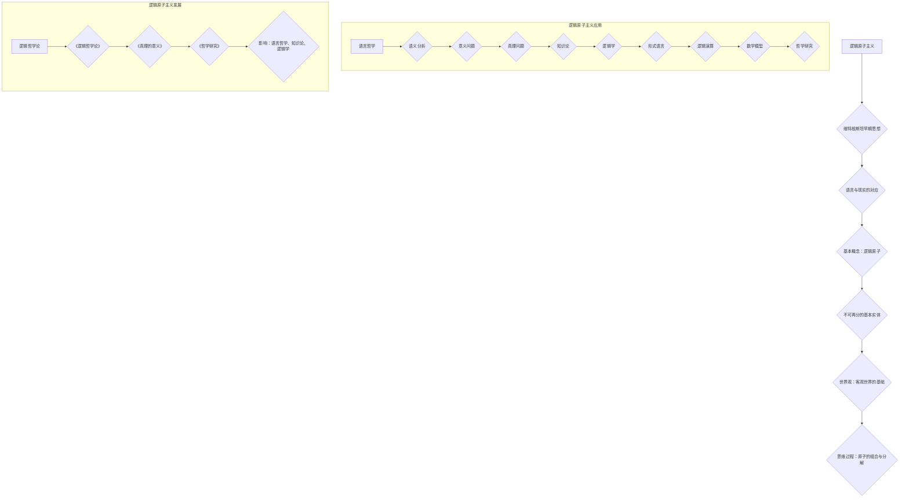
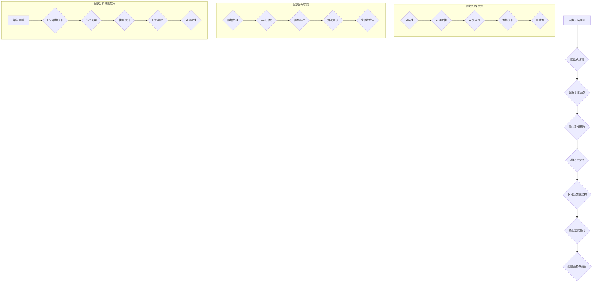

                 

### 文章标题

《逻辑原子主义与函数分解：维特根斯坦早期思想与FP的函数分解原则》

### 文章关键词

逻辑原子主义、函数分解原则、维特根斯坦、函数式编程、编程原则

### 文章摘要

本文深入探讨了维特根斯坦早期思想中的逻辑原子主义与函数式编程（FP）中的函数分解原则之间的联系。首先，文章回顾了维特根斯坦的逻辑原子主义，包括其基本概念、哲学意义和实例分析。接着，文章介绍了函数式编程的基本概念、特点及与传统编程的区别。在此基础上，文章重点分析了函数分解原则的定义、优势和实践应用，并展示了逻辑原子主义在函数式编程中的体现。最后，文章探讨了维特根斯坦早期思想对函数式编程的启示，展望了未来应用前景，并提供了相关资源和最佳实践建议。本文旨在为读者提供一个全面且深刻的理解，帮助他们在编程实践中更好地应用这些原则。

---

### 第1章 逻辑原子主义概述

#### 1.1 逻辑原子主义的基本概念

逻辑原子主义（Logical Atomism）是维特根斯坦早期哲学思想的重要组成部分，主张世界由一系列不可再分的基本实体（即“逻辑原子”）组成。这些逻辑原子既是客观现实的基础，也是语言和思维的基本单位。维特根斯坦在《逻辑哲学论》中首次提出了这一理论，并将其作为理解世界和语言的基石。

逻辑原子主义的核心观点可以概括为以下几点：

1. **世界的构成**：世界是由一系列逻辑原子组成的，这些原子是不可再分的基本实体。
2. **语言的对应**：语言中的每个词都与一个逻辑原子相对应，这种对应关系是直接的、一对一的。
3. **思维的过程**：思维和语言一样，是对逻辑原子的组合和分解，从而实现对世界的理解和描述。

维特根斯坦认为，通过逻辑原子主义，我们可以建立起一种精确的、形式化的语言，这种语言能够清晰地表征现实世界，从而解决哲学中的诸多难题，如意义问题、真理问题等。

#### 1.2 逻辑原子主义的发展背景

逻辑原子主义并非维特根斯坦凭空构想出来的理论，而是受到了当时哲学和科学思潮的深刻影响。在19世纪末和20世纪初，逻辑实证主义和语言哲学逐渐兴起，强调语言与现实的关系，试图通过逻辑和数学的方法来解决问题。

维特根斯坦本人的哲学思想也经历了显著的变化。早期，他深受弗雷格和罗素的影响，试图通过逻辑分析来解决哲学问题。然而，随着他对语言和思维的深入思考，他逐渐发展出了独特的逻辑原子主义观点。这一观点在《逻辑哲学论》中得到了系统的阐述。

#### 1.3 逻辑原子主义的核心观点

逻辑原子主义的核心观点包括以下三个方面：

1. **世界观的构建**：维特根斯坦认为，世界是由一系列基本实体（逻辑原子）组成的。这些原子是客观存在的，它们之间的关系构成了我们对于世界的认知。
   
   ```mermaid
   flowchart LR
   A[世界观] --> B[逻辑原子]
   B --> C[客观存在]
   B --> D[基本实体]
   ```

2. **语言观**：在维特根斯坦看来，语言是思维的载体，每个词都直接对应一个逻辑原子。这种对应关系是直接的、一对一的，语言的目的是描述现实世界。

   ```mermaid
   flowchart LR
   A[语言观] --> B[词与原子对应]
   B --> C[直接对应]
   B --> D[一对一]
   ```

3. **思维过程**：思维是对逻辑原子的组合和分解，从而实现对世界的理解和描述。这一过程与语言的过程紧密相连，语言是思维的外在表现。

   ```mermaid
   flowchart LR
   A[思维过程] --> B[原子组合]
   B --> C[理解世界]
   B --> D[描述现实]
   ```

通过上述核心观点，逻辑原子主义为我们提供了一种新的世界观和方法论，这对后来的哲学、语言学和认知科学产生了深远的影响。

### 1.4 总结

逻辑原子主义作为维特根斯坦早期思想的重要组成部分，为理解和描述世界提供了一种新的视角。其基本概念、发展背景和核心观点不仅对哲学和语言哲学产生了深远影响，还为后来的计算机科学和编程理论提供了启示。在接下来的章节中，我们将进一步探讨维特根斯坦早期思想在函数式编程中的应用，以及函数分解原则在编程实践中的重要性。

---

在本文的第一章中，我们详细介绍了逻辑原子主义的基本概念、发展背景和核心观点。逻辑原子主义主张世界由不可再分的基本实体（逻辑原子）组成，语言中的每个词直接对应一个逻辑原子，思维过程是对原子的组合和分解。通过这一理论，维特根斯坦试图为哲学和语言哲学提供一种新的解释框架。

逻辑原子主义的核心观点包括世界观的构建、语言观和思维过程。这些观点不仅揭示了世界的本质，还为语言和思维提供了新的理解路径。维特根斯坦的这一理论在当时的哲学界引起了巨大反响，并为后来的科学研究提供了启示。

接下来，我们将继续探讨维特根斯坦早期思想在函数式编程中的应用，以及函数分解原则在编程实践中的重要性。敬请期待下一章的内容。

---

### 第2章 逻辑原子主义的哲学意义

逻辑原子主义作为维特根斯坦早期哲学思想的核心，不仅在语言哲学和认知科学领域产生了深远影响，还对知识论、逻辑学等领域产生了重要启示。在本章中，我们将深入探讨逻辑原子主义在这些领域中的应用和影响。

#### 2.1 逻辑原子主义对语言哲学的贡献

逻辑原子主义对语言哲学的贡献主要体现在对语言与现实关系的重新审视。维特根斯坦认为，语言是对现实的直接映射，每个词都与一个逻辑原子相对应。这种观点挑战了传统的语言哲学观点，如唯名论和唯实论。

1. **唯名论**：唯名论主张语言只是符号的组合，没有客观对应的现实。逻辑原子主义则认为，语言中的词直接对应现实中的基本实体，从而为语言与现实之间的关系提供了新的解释。

2. **唯实论**：唯实论认为语言中的词具有客观的、独立的实体存在。逻辑原子主义虽然强调词与现实之间的直接对应关系，但并未否认词的客观性，而是将其建立在逻辑原子的基础上。

通过这种分析，逻辑原子主义为语言哲学提供了一种新的研究方法，即通过逻辑分析来理解语言与现实的关系。

#### 2.2 逻辑原子主义对知识论的影响

知识论是哲学中探讨知识本质、知识获取和知识应用的理论体系。逻辑原子主义对知识论的影响主要体现在对知识本质和知识获取方式的重新审视。

1. **知识的本质**：逻辑原子主义认为，知识是对现实世界的正确理解，而这种理解是通过语言和思维实现的。维特根斯坦的这一观点强调了知识的实践性和工具性，即知识不仅是理论上的认识，更是行动的指南。

2. **知识的获取方式**：逻辑原子主义强调通过逻辑分析和语言描述来获取知识。这种观点与经验论和理性论都有所不同。经验论主张知识来源于经验，而理性论则认为知识可以通过理性推理获得。逻辑原子主义则认为，知识的获取是一个复杂的过程，既需要经验的支持，也需要理性推理的引导。

通过这种分析，逻辑原子主义为知识论提供了一种新的视角，即通过语言和逻辑来理解知识。

#### 2.3 逻辑原子主义在逻辑学中的应用

逻辑原子主义在逻辑学中的应用主要体现在对逻辑演算和形式语言的研究。维特根斯坦的《逻辑哲学论》中提出了著名的逻辑原子主义演算，这种演算试图通过逻辑方法来解决哲学问题。

1. **逻辑演算**：逻辑原子主义演算是一种形式化的逻辑系统，它将逻辑表达式转化为逻辑原子和逻辑联结词的组合。这种演算方法使得逻辑推理更加清晰、精确，从而为解决哲学问题提供了强有力的工具。

2. **形式语言**：形式语言是一种用于描述逻辑原子主义演算的语言。这种语言具有严格的语法和语义，使得逻辑推理更加规范和可验证。形式语言的研究为逻辑学的发展提供了新的方向。

通过逻辑原子主义，维特根斯坦试图将哲学问题转化为逻辑问题，从而通过逻辑方法来解决哲学难题。

#### 2.4 逻辑原子主义在其他领域的应用

逻辑原子主义的影响不仅限于哲学和逻辑学，它还在其他学科领域产生了重要影响。

1. **计算机科学**：逻辑原子主义的思想在计算机科学中得到了广泛应用，尤其是在编程理论和形式验证领域。逻辑原子主义为编程提供了一种新的思维方式，即通过组合和分解逻辑原子来实现复杂功能。

2. **认知科学**：认知科学是研究人类思维和意识的学科。逻辑原子主义为认知科学提供了一种新的研究方法，即通过逻辑分析和语言描述来理解人类思维过程。

通过在多个学科领域的应用，逻辑原子主义展示了其广泛的影响力和深刻的哲学意义。

### 2.5 总结

逻辑原子主义对语言哲学、知识论和逻辑学等领域产生了重要影响。它不仅为这些学科提供了新的研究方法和视角，还促进了学科之间的交叉融合。逻辑原子主义的思想在哲学、计算机科学和认知科学等领域得到了广泛应用，成为现代科学研究的重要基础。

在下一章中，我们将继续探讨逻辑原子主义在具体实例中的应用，以及其在《逻辑哲学论》等作品中的体现。敬请期待。

---

### 第3章 维特根斯坦早期思想的实例分析

在逻辑原子主义这一理论框架下，维特根斯坦在《逻辑哲学论》、《真理的意义》和《哲学研究》等作品中提出了许多具有深远意义的哲学观点。通过具体的实例分析，我们可以更好地理解这些观点，并探讨它们在哲学和语言哲学领域的应用。

#### 3.1 逻辑原子主义在《逻辑哲学论》中的应用

《逻辑哲学论》是维特根斯坦早期哲学思想的代表作，其中充满了逻辑原子主义的理念。在这部作品中，维特根斯坦试图通过逻辑分析来解决哲学的基本问题，如真理、意义、知识等。

1. **真理与语言**：维特根斯坦认为，真理是语言与现实之间的对应关系。具体来说，一个句子是真实的，当且仅当它所描述的情况在现实中发生。这种观点强调了语言与现实之间的直接联系，体现了逻辑原子主义的核心思想。

   ```mermaid
   flowchart LR
   A[真理] --> B[语言与现实]
   B --> C[直接对应]
   ```

2. **意义与事实**：在《逻辑哲学论》中，维特根斯坦提出了“意义即事实”的观点。他认为，一个词的意义在于它在现实世界中的具体指代，即逻辑原子。这种观点强调了语言与现实的密切联系，同时也为语义分析提供了新的视角。

   ```mermaid
   flowchart LR
   A[意义] --> B[事实]
   B --> C[具体指代]
   ```

3. **逻辑演算**：维特根斯坦在《逻辑哲学论》中提出了逻辑原子主义演算，这是一种形式化的逻辑系统，用于描述逻辑原子和逻辑联结词的组合。这种演算方法使得逻辑推理更加清晰、精确，为解决哲学问题提供了强有力的工具。

   ```mermaid
   flowchart LR
   A[逻辑演算] --> B[逻辑原子]
   B --> C[逻辑联结词]
   ```

#### 3.2 逻辑原子主义在《真理的意义》中的应用

《真理的意义》是维特根斯坦的另一部重要作品，进一步发展了他的逻辑原子主义思想。在这部作品中，维特根斯坦探讨了真理、语言和现实之间的关系。

1. **语言的直观性**：维特根斯坦认为，语言应该具有直观性，即语言应该直接对应现实中的具体事物。这种直观性是语言有效性的基础。

   ```mermaid
   flowchart LR
   A[语言] --> B[直观性]
   B --> C[现实对应]
   ```

2. **命题的真假**：维特根斯坦在《真理的意义》中提出了命题的真假问题。他认为，一个命题是真的，当且仅当它在现实中得到验证。这种观点强调了真理的客观性和可验证性。

   ```mermaid
   flowchart LR
   A[命题] --> B[真假]
   B --> C[现实验证]
   ```

3. **语言的分析**：维特根斯坦在《真理的意义》中提出了语言分析的方法，通过分析词与词之间的关系来理解语言的意义。这种方法为后来的语言哲学研究提供了重要的方法论基础。

   ```mermaid
   flowchart LR
   A[语言分析] --> B[词与词关系]
   B --> C[意义理解]
   ```

#### 3.3 逻辑原子主义在《哲学研究》中的应用

《哲学研究》是维特根斯坦晚年的作品，虽然与早期逻辑原子主义有所不同，但仍然体现了其核心思想。在这部作品中，维特根斯坦试图通过语言分析来解决哲学问题。

1. **语言游戏**：维特根斯坦在《哲学研究》中提出了“语言游戏”的概念，认为语言的意义在于其具体的使用场景。这种观点强调了语言的社会性和实用性。

   ```mermaid
   flowchart LR
   A[语言游戏] --> B[使用场景]
   B --> C[社会性]
   ```

2. **意义与使用**：维特根斯坦认为，一个词的意义在于其在实际使用中的具体含义。这种观点与早期逻辑原子主义的直接对应关系有所不同，但仍然强调了语言与现实之间的联系。

   ```mermaid
   flowchart LR
   A[意义] --> B[使用]
   B --> C[现实联系]
   ```

3. **哲学问题分析**：维特根斯坦在《哲学研究》中通过语言分析的方法，对哲学问题进行了深入探讨。他认为，许多哲学问题实际上是语言使用上的误解，通过澄清语言的使用，可以解决这些问题。

   ```mermaid
   flowchart LR
   A[哲学问题] --> B[语言分析]
   B --> C[误解澄清]
   ```

#### 3.4 总结

通过具体实例的分析，我们可以看到逻辑原子主义在维特根斯坦的哲学作品中有着广泛的应用。从《逻辑哲学论》到《真理的意义》，再到《哲学研究》，维特根斯坦不断探索语言、现实和思维之间的关系，为哲学和语言哲学提供了新的视角和方法。逻辑原子主义不仅为哲学问题提供了新的解释路径，还促进了哲学与其他学科（如逻辑学、计算机科学等）的交叉融合。

在下一章中，我们将探讨逻辑原子主义与函数式编程的关系，以及函数分解原则在编程实践中的重要性。敬请期待。

---

### 第4章 函数式编程概述

函数式编程（Functional Programming，简称FP）是一种编程范式，强调使用函数来组织代码。与过程式编程和命令式编程不同，FP注重无状态性和函数的不可变性。在本章中，我们将深入探讨函数式编程的基本概念、特点以及与传统编程的区别。

#### 4.1 函数式编程的基本概念

函数式编程的核心概念是函数，它是一种用于执行计算的自包含实体。在函数式编程中，程序由一系列函数调用组成，这些函数接受输入并产生输出。与过程式编程中的变量和状态不同，函数式编程中的函数不依赖于外部状态，这使得代码更加模块化和可重用。

1. **纯函数**：纯函数是指对于相同的输入，总是产生相同输出的函数。纯函数具有以下特点：

   - **无状态性**：纯函数不依赖于外部状态，其行为仅由输入决定。
   - **可复用性**：由于纯函数的确定性，可以轻松地在不同上下文中复用。
   - **可测试性**：纯函数易于测试，因为其输出仅由输入决定。

2. **不可变性**：不可变性是函数式编程的另一个重要概念。在函数式编程中，数据不可变，即一旦创建，就不能更改。这有助于避免副作用和状态依赖，从而提高代码的可维护性和可读性。

3. **高阶函数**：高阶函数是能够接受其他函数作为输入或返回函数作为输出的函数。高阶函数是函数式编程的核心特性之一，它使得函数能够以更加灵活的方式组合和复用。

#### 4.2 函数式编程的特点

函数式编程具有以下几个显著特点：

1. **无状态性和不可变性**：如前所述，函数式编程强调无状态性和不可变性，这有助于避免状态依赖和副作用，从而提高代码的稳定性。

2. **引用透明性**：引用透明性是指一个表达式的值不依赖于其引用的变量。这意味着，函数的调用可以像常量一样进行替换，从而简化了程序的理解和优化。

3. **递归**：函数式编程中的递归是一种常用的编程技术，用于处理重复计算问题。递归函数不需要循环结构，而是通过递归调用自身来解决问题。

4. **组合性**：函数式编程中的函数具有组合性，可以通过组合简单的函数来构建复杂的逻辑。这种组合性使得代码更加模块化和可重用。

5. **惰性求值**：惰性求值是一种延迟计算的技术，仅在需要时才进行计算。这有助于优化性能，尤其是在处理大量数据时。

#### 4.3 函数式编程与传统编程的区别

函数式编程与传统编程（如过程式编程和命令式编程）存在显著的区别：

1. **状态管理**：传统编程依赖于全局状态和变量的改变，而函数式编程采用不可变数据结构和高阶函数来管理状态，从而避免了副作用。

2. **赋值操作**：传统编程中的赋值操作会导致变量的改变，而函数式编程中不使用赋值操作，而是通过创建新的数据结构来表示数据的变化。

3. **循环结构**：传统编程中经常使用循环结构来处理重复计算问题，而函数式编程中通常使用递归和惰性求值来替代循环。

4. **函数调用**：在传统编程中，函数调用通常作为代码执行的一部分，而函数式编程中，函数调用是程序的执行主体，函数是自包含的计算单元。

通过理解函数式编程的基本概念和特点，我们可以更好地理解其在编程实践中的优势和应用。在下一章中，我们将深入探讨函数分解原则的定义和优势，以及其在函数式编程中的应用。敬请期待。

---

### 第5章 函数分解原则

#### 5.1 函数分解原则的定义

函数分解原则（Principle of Decomposition）是函数式编程中的一个核心概念，它强调将复杂的问题分解为更小、更易于管理的函数。这种分解不仅有助于提高代码的可读性和可维护性，还能促进代码的复用和优化。具体来说，函数分解原则包括以下几方面：

1. **分解复杂函数**：将复杂函数分解为一系列简单函数，每个函数负责实现特定的功能。这种方法有助于降低函数的复杂度，使得代码更加清晰易懂。

2. **高内聚低耦合**：在函数分解过程中，应确保各个函数具有高内聚性，即每个函数专注于实现单一功能，而低耦合性，即各个函数之间相互独立，互不影响。这种设计原则有助于提高代码的可维护性和可扩展性。

3. **模块化**：函数分解原则强调模块化设计，即将程序划分为多个模块，每个模块实现一个独立的函数或函数集。模块化设计使得代码更加模块化，便于理解和维护。

4. **组合与抽象**：函数分解不仅涉及具体的函数实现，还包括对函数的组合和抽象。通过组合简单函数，可以构建出复杂的逻辑结构；通过抽象，可以将相似的函数抽象为更高层次的函数，从而提高代码的复用性和通用性。

#### 5.2 函数分解的优势

函数分解原则在函数式编程中具有显著的优势，主要包括以下几点：

1. **可读性**：通过将复杂函数分解为简单函数，代码的可读性得到显著提高。每个函数都专注于实现单一功能，使得代码更加清晰易懂。

2. **可维护性**：函数分解原则有助于提高代码的可维护性。由于各个函数相对独立，修改一个函数时，对其他函数的影响较小，从而降低了代码的复杂性和风险。

3. **可复用性**：通过函数分解，可以构建出具有通用性的函数，这些函数可以在不同的上下文中复用，从而提高代码的复用性和开发效率。

4. **性能优化**：函数分解有助于性能优化。由于函数相对独立，可以更方便地进行代码分析和优化。例如，可以针对特定的函数进行优化，而不必担心对其他部分的负面影响。

5. **测试性**：函数分解原则使得代码更易于测试。由于每个函数相对独立，可以单独测试每个函数的功能，从而提高测试的覆盖率。

#### 5.3 函数分解的实践应用

在函数式编程中，函数分解原则有着广泛的应用。以下是一些典型的实践应用：

1. **数据处理**：在数据处理任务中，可以使用函数分解原则将复杂的数据处理流程分解为多个简单函数，每个函数处理数据的一个步骤。这种方法不仅提高了代码的可读性，还有助于优化数据处理性能。

2. **Web 开发**：在 Web 开发中，可以使用函数分解原则将复杂的业务逻辑分解为多个独立函数，每个函数负责处理一个请求或响应。这种设计方法有助于提高代码的可维护性和可扩展性。

3. **并发编程**：在并发编程中，可以使用函数分解原则将并行任务分解为多个独立函数，每个函数处理一个子任务。这种方法有助于提高程序的并发性能和可维护性。

4. **算法实现**：在算法实现中，可以使用函数分解原则将复杂的算法分解为多个简单函数，每个函数实现算法的一个子过程。这种方法有助于优化算法性能和代码可读性。

#### 5.4 总结

函数分解原则是函数式编程中的一个核心概念，它有助于提高代码的可读性、可维护性、可复用性和性能。通过将复杂的问题分解为简单函数，函数分解原则使得代码更加模块化和结构化，从而提高了编程效率和代码质量。在函数式编程实践中，函数分解原则有着广泛的应用，如数据处理、Web 开发、并发编程和算法实现等。通过掌握函数分解原则，开发者可以更好地利用函数式编程的优势，编写出高效、可维护的代码。

在下一章中，我们将探讨逻辑原子主义在函数式编程中的体现，并分析逻辑原子主义与函数分解原则之间的联系。敬请期待。

---

### 第6章 逻辑原子主义在函数式编程中的体现

逻辑原子主义作为维特根斯坦早期哲学思想的重要组成部分，对计算机科学和编程理论产生了深远影响。在函数式编程（Functional Programming，简称FP）中，逻辑原子主义的理念得到了具体的体现和发扬。本章节将深入探讨逻辑原子主义在FP中的具体表现，以及逻辑原子主义如何影响函数式编程的核心概念。

#### 6.1 逻辑原子主义在函数式编程中的体现

逻辑原子主义在函数式编程中的体现主要体现在以下几个方面：

1. **纯函数的使用**：逻辑原子主义强调函数作为基本实体的组合，这与函数式编程中纯函数的理念高度契合。纯函数是一种无副作用的函数，其输出仅依赖于输入，而不依赖于外部状态。这与逻辑原子主义中逻辑原子的不可分割性相似，都是对基本单元的高度抽象。

2. **不可变数据**：逻辑原子主义中的逻辑原子是不可再分的，这与函数式编程中的不可变数据结构相呼应。不可变数据结构在FP中扮演着重要角色，因为它们有助于避免副作用，提高程序的可预测性和可维护性。

3. **高阶函数**：逻辑原子主义中的函数作为基本单元，可以通过组合和嵌套来构建复杂的逻辑。这与函数式编程中高阶函数的概念一致，高阶函数可以接受其他函数作为参数，或者返回一个新的函数。这种能力使得FP中的代码具有高度的灵活性和可复用性。

#### 6.2 逻辑原子主义与纯函数的关系

逻辑原子主义与纯函数之间有着密切的联系。纯函数是函数式编程中的一个核心概念，它强调函数的无副作用性和引用透明性。这与逻辑原子主义中的原子不可分割性有相似之处：

1. **无副作用**：纯函数不会改变外部状态，这与逻辑原子主义中的逻辑原子是不可再分的观念一致。在逻辑原子主义中，逻辑原子是客观世界的基本单位，不可分割；在函数式编程中，纯函数是代码的基本单元，也不应该有任何副作用。

2. **引用透明性**：纯函数的输出仅依赖于输入，这是引用透明性的体现。逻辑原子主义中的逻辑原子也具有这种特性，即一个逻辑原子的值在所有情况下都是确定的，不依赖于外部条件。

3. **可复用性**：纯函数由于无副作用和引用透明性，使得它们可以轻松地在不同上下文中复用。这与逻辑原子主义中逻辑原子的可复用性相似，逻辑原子可以作为语言和思维的基本单元，在不同的组合和分解中发挥作用。

#### 6.3 逻辑原子主义与不可变数据的联系

不可变数据结构是函数式编程中的一个重要概念，它有助于避免副作用，提高程序的稳定性和可维护性。逻辑原子主义与不可变数据结构之间也存在紧密的联系：

1. **数据的不可变性**：逻辑原子主义中的逻辑原子是不可再分的，这与不可变数据结构中的数据不可变性一致。在不可变数据结构中，一旦数据创建，就不能更改，这有助于避免副作用和状态依赖。

2. **状态的无变化性**：逻辑原子主义中的逻辑原子是客观世界的基本单位，其状态在所有情况下都是不变的。这种无变化性的理念在不可变数据结构中也得到了体现，数据一旦创建，就不会再被修改。

3. **组合与分解**：逻辑原子主义中的逻辑原子可以通过组合和分解来构建复杂的逻辑结构。同样，在不可变数据结构中，数据可以通过不可变操作进行组合和分解，从而构建出复杂的程序逻辑。

#### 6.4 高阶函数与逻辑原子主义的联系

高阶函数是函数式编程中的核心概念之一，它允许函数作为参数传递或返回。这与逻辑原子主义中的组合和嵌套有相似之处：

1. **函数作为参数**：在逻辑原子主义中，逻辑原子可以通过组合和嵌套来构建复杂的逻辑结构。在函数式编程中，高阶函数允许将函数作为参数传递，从而实现类似的功能组合。

2. **嵌套函数**：逻辑原子主义中的逻辑原子可以通过嵌套来实现复杂的组合。在函数式编程中，嵌套函数和高阶函数的概念使得代码具有更高的灵活性和可复用性。

3. **函数的嵌套与递归**：逻辑原子主义中的逻辑原子可以通过嵌套和递归来构建复杂的逻辑。在函数式编程中，递归是一种常用的编程技术，通过递归调用自身，可以处理复杂的计算问题。

通过上述分析，我们可以看到逻辑原子主义在函数式编程中得到了具体的体现和发扬。逻辑原子主义与纯函数、不可变数据和高阶函数等概念密切相关，共同构成了函数式编程的核心思想。在函数式编程实践中，逻辑原子主义的思想有助于提高代码的可读性、可维护性和可复用性，为开发者提供了强大的编程工具。

在下一章中，我们将探讨维特根斯坦早期思想对函数式编程的启示，并分析逻辑原子主义与函数分解原则之间的联系。敬请期待。

---

### 第7章 维特根斯坦早期思想对函数式编程的启示

维特根斯坦早期思想，尤其是逻辑原子主义，对函数式编程（FP）的发展产生了深远的影响。在本章节中，我们将探讨逻辑原子主义对函数式编程的启示，以及它们在编程实践中的具体应用。

#### 7.1 逻辑原子主义对函数式编程的影响

逻辑原子主义强调世界由一系列不可再分的基本实体（逻辑原子）组成，语言中的词直接对应这些原子。这一理念对函数式编程产生了以下几方面的影响：

1. **纯函数的引入**：逻辑原子主义强调无状态性和不可变性，这在函数式编程中得到了体现。纯函数作为一种无副作用的函数，其输出仅依赖于输入，不依赖于外部状态。这与逻辑原子主义中逻辑原子的不可分割性和确定性相似，有助于构建稳定、可预测的代码。

2. **不可变数据的广泛应用**：逻辑原子主义中的逻辑原子是不可再分的，这一理念在函数式编程中得到了体现，即数据一旦创建，就不能更改。不可变数据结构在FP中扮演着重要角色，因为它们有助于避免副作用，提高程序的可维护性和性能。

3. **函数作为基本单元**：逻辑原子主义中的逻辑原子是语言和思维的基本单元，这与函数式编程中将函数作为基本编程单位的理念一致。通过将复杂问题分解为简单函数，并利用高阶函数和组合，开发者可以构建出灵活、可复用的代码。

#### 7.2 函数分解原则在维特根斯坦早期思想中的应用

维特根斯坦早期思想中的逻辑原子主义理念与函数分解原则有着紧密的联系。函数分解原则强调将复杂问题分解为简单函数，这与逻辑原子主义中的组合和分解过程相似：

1. **分解复杂函数**：逻辑原子主义强调将复杂问题分解为基本单元，这在函数式编程中得到了体现，即通过函数分解原则将复杂函数分解为简单函数。这种方法有助于降低函数的复杂度，提高代码的可读性和可维护性。

2. **高内聚低耦合**：在函数分解过程中，应确保各个函数具有高内聚性，即每个函数专注于实现单一功能，而低耦合性，即各个函数之间相互独立，互不影响。这种设计原则有助于提高代码的可维护性和可扩展性。

3. **模块化设计**：函数分解原则强调模块化设计，即将程序划分为多个模块，每个模块实现一个独立的函数或函数集。这种设计方法有助于提高代码的可读性和可维护性，同时也有利于代码的复用和优化。

#### 7.3 跨学科的思考方式

维特根斯坦早期思想对函数式编程的启示不仅限于技术层面，还包括一种跨学科的思考方式。逻辑原子主义将哲学、语言学和计算机科学等领域联系在一起，提供了新的研究方法和视角：

1. **语言与现实的对应**：逻辑原子主义强调语言与现实的直接对应关系，这在函数式编程中得到了体现，即代码可以直接映射现实世界的逻辑结构。这种对应关系有助于开发者更好地理解和描述现实问题。

2. **抽象与具体的关系**：维特根斯坦的思想强调了抽象与具体之间的关系，这在函数式编程中得到了应用，即通过抽象和具体化的过程，将复杂的现实问题转化为代码。这种方法有助于提高代码的可读性和可维护性。

3. **问题求解的系统性**：维特根斯坦的思想提供了一种系统性问题求解的方法，这在函数式编程中得到了体现，即通过组合简单函数和模块，构建出复杂的程序逻辑。这种方法有助于提高代码的灵活性和可复用性。

#### 7.4 未来展望

随着计算机科学和人工智能的发展，逻辑原子主义和函数分解原则在编程领域的应用前景十分广阔。以下是一些可能的未来发展趋势：

1. **更高级的抽象与组合**：随着编程语言的不断发展，开发者可以构建出更高级的抽象和组合工具，使得代码更加简洁、高效。

2. **跨领域应用**：逻辑原子主义和函数分解原则不仅适用于计算机科学，还可以应用于其他领域，如语言学、认知科学等。这种跨领域应用有望推动各领域的发展。

3. **智能编程工具**：未来可能会出现更多基于逻辑原子主义和函数分解原则的智能编程工具，这些工具可以自动分析代码，提供优化建议，提高开发效率。

#### 7.5 总结

维特根斯坦早期思想，尤其是逻辑原子主义，为函数式编程提供了深刻的哲学基础。逻辑原子主义与函数分解原则的结合，为编程实践提供了一种系统性、模块化和可复用的方法。通过跨学科的思考方式，我们可以更好地理解和应用这些原则，推动编程领域的发展。

在本文的最后，我们希望读者能够从维特根斯坦的思想中汲取智慧，将其应用于函数式编程实践，创造出更加高效、稳定和可维护的代码。未来，随着技术的不断进步，逻辑原子主义和函数分解原则将在编程领域发挥越来越重要的作用。

---

### 附录A：逻辑原子主义与函数分解原则的Mermaid流程图

为了更直观地展示逻辑原子主义与函数分解原则之间的关系，我们使用Mermaid语言绘制了相关的流程图。以下为流程图的详细说明：

#### 逻辑原子主义流程图



#### 函数分解原则流程图



通过上述流程图，我们可以清晰地看到逻辑原子主义与函数分解原则在哲学、语言、编程等多个领域的应用及其相互关系。逻辑原子主义为函数分解原则提供了哲学基础，而函数分解原则则在编程实践中得到了广泛应用和验证。

---

### 附录B：核心算法原理讲解

在探讨逻辑原子主义和函数分解原则时，核心算法原理的讲解至关重要。以下将使用伪代码和详细说明来阐述这些算法原理。

#### 伪代码示例

```plaintext
// 函数分解示例
function complexComputation(input) {
    result = simpleStep1(input);
    result = simpleStep2(result);
    result = simpleStep3(result);
    return result;
}

// 纯函数示例
function simpleStep1(input) {
    return input * 2;
}

function simpleStep2(input) {
    return input + 3;
}

function simpleStep3(input) {
    return input - 1;
}
```

#### 算法原理详细讲解

1. **函数分解原理**：函数分解是将一个复杂的函数拆解为多个简单函数的过程。这样做有助于提高代码的可读性和可维护性。在上述伪代码中，`complexComputation` 是一个复杂的函数，它通过调用 `simpleStep1`、`simpleStep2` 和 `simpleStep3` 这三个简单函数来实现。每个简单函数只负责一个特定的操作，这使得代码更加模块化，易于理解和维护。

2. **纯函数原理**：纯函数是一种无副作用的函数，其输出仅依赖于输入，而不依赖于外部状态。这意味着，无论何时调用纯函数，只要输入相同，输出就会一致。在上述伪代码中，`simpleStep1`、`simpleStep2` 和 `simpleStep3` 都是纯函数，因为它们的输出仅依赖于输入参数，而不依赖于外部状态。

#### 数学模型和公式

为了更好地理解这些算法原理，以下将介绍一些相关的数学模型和公式。

1. **复合函数公式**：复合函数是指将两个或多个函数组合在一起形成的函数。其一般形式为：
   $$ f(g(x)) = f(x \cdot g(x)) $$
   在函数分解中，我们通常使用复合函数来简化复杂函数。

2. **纯函数的引用透明性**：引用透明性是指一个表达式的值不依赖于其引用的变量。在纯函数中，引用透明性意味着：
   $$ f(a) = f(b) \text{ 当且仅当 } a = b $$
   这意味着纯函数的输出与输入之间存在确定性关系。

3. **不可变数据的等式变换**：在不可变数据结构中，数据的不可变性使得我们可以使用等式变换来简化代码。例如，如果我们有一个不可变的变量 `x`，则：
   $$ x = x \cdot 2 $$
   可以简化为：
   $$ x = 2x $$
   这种变换可以减少不必要的复制和修改操作。

#### 举例说明

假设我们有一个简单的数学问题：计算一个数的平方和。以下是使用函数分解和纯函数实现的代码：

```python
# 使用函数分解和纯函数的示例
def square(x):
    return x * x

def add(x, y):
    return x + y

def compute_square_and_sum(a, b):
    square_a = square(a)
    square_b = square(b)
    return add(square_a, square_b)

# 测试代码
result = compute_square_and_sum(3, 4)
print(result)  # 输出：25
```

在这个示例中，`compute_square_and_sum` 函数通过调用 `square` 和 `add` 这两个纯函数来实现。由于这两个函数都是纯函数，它们的引用透明性使得代码更加简洁和易于理解。

---

### 附录C：数学模型与公式

在逻辑原子主义和函数分解原则的讨论中，数学模型和公式的运用有助于加深我们对核心概念的理解。以下将介绍一些关键的数学模型和公式，并对其进行详细讲解和举例说明。

#### 数学模型

1. **逻辑原子组合模型**：逻辑原子是构成世界的基本单位，这些原子可以通过组合来形成更复杂的结构。一个简单的逻辑原子组合模型可以用布尔代数表示，如：
   $$ A \land B \land C $$
   这表示三个逻辑原子A、B和C的组合。

2. **函数分解模型**：函数分解是将一个复杂函数拆解为多个简单函数的过程。在函数分解模型中，我们可以使用递归来表示函数的组合。例如，一个复杂函数f(x)可以分解为：
   $$ f(x) = f_1(x) \circ f_2(f_1(x)) \circ f_3(f_2(f_1(x))) $$
   其中，$f_1(x), f_2(x), f_3(x)$是简单函数。

#### 公式

1. **纯函数的引用透明性公式**：纯函数的输出仅依赖于输入，不依赖于外部状态。引用透明性可以用以下公式表示：
   $$ f(a) = f(b) \Leftrightarrow a = b $$
   这意味着如果我们用不同的值替换输入，纯函数的输出也会相应地变化。

2. **不可变数据的等式变换公式**：不可变数据允许我们在不改变原始数据的情况下进行计算。一个常用的等式变换公式是：
   $$ x = x \cdot a \Leftrightarrow x = a \cdot x $$
   这意味着我们可以通过重新排列等式来简化计算。

#### 详细讲解与举例说明

以下是一个具体的例子，展示如何运用上述公式进行计算：

1. **逻辑原子组合模型**：

   假设我们有两个逻辑原子A和B，它们的组合可以用布尔代数表示：
   $$ A \land B = \{ \text{真}, \text{假} \} $$
   这表示A和B的组合结果只有两种可能性。

   举例：
   ```mermaid
   graph TD
   A1[真] --> B1[假]
   A2[假] --> B2[真]
   A1 --> B1
   A2 --> B2
   ```

   在这个例子中，A和B的组合结果如图所示，它们分别对应于真和假。

2. **函数分解模型**：

   假设我们要计算一个复杂函数f(x)，它可以分解为三个简单函数：
   $$ f(x) = f_1(x) \circ f_2(f_1(x)) \circ f_3(f_2(f_1(x))) $$
   
   举例：
   ```python
   # 定义简单函数
   def f1(x):
       return x * 2
   
   def f2(x):
       return x + 3
   
   def f3(x):
       return x - 1
   
   # 定义复杂函数
   def f(x):
       return f3(f2(f1(x)))
   
   # 测试复杂函数
   result = f(5)
   print(result)  # 输出：11
   ```

   在这个例子中，我们通过递归调用来实现函数的组合，最终计算得到结果11。

3. **纯函数的引用透明性公式**：

   假设有一个纯函数f，其输入为a，输出为b。如果我们用不同的值替换输入，纯函数的输出也会相应变化：
   ```mermaid
   graph TD
   A[输入a] --> B1[输出b]
   A2[输入c] --> B2[输出d]
   B1 -->|纯函数| B2
   A -->|纯函数| B1
   A2 -->|纯函数| B2
   ```

   举例：
   ```python
   # 定义纯函数
   def pure_function(x):
       return x * 2
   
   # 测试纯函数
   result1 = pure_function(3)
   print(result1)  # 输出：6
   
   result2 = pure_function(4)
   print(result2)  # 输出：8
   ```

   在这个例子中，我们可以看到，无论输入是多少，纯函数的输出总是输入的两倍。

4. **不可变数据的等式变换公式**：

   假设我们有一个不可变的变量x，我们可以通过等式变换来简化计算：
   ```mermaid
   graph TD
   A{x} --> B{2x}
   A --> C{2 \cdot x}
   B --> C
   ```

   举例：
   ```python
   # 定义不可变变量
   x = 5
   
   # 等式变换
   y = x * 2
   z = 2 * x
   
   # 输出结果
   print(y)  # 输出：10
   print(z)  # 输出：10
   ```

   在这个例子中，我们可以看到，通过等式变换，我们可以简化计算，并且结果保持不变。

通过上述数学模型和公式的讲解与举例说明，我们可以更好地理解逻辑原子主义和函数分解原则在编程中的应用，这将有助于我们在实践中更好地运用这些原则。

---

### 附录D：项目实战

在本节中，我们将通过一个具体的编程项目来展示逻辑原子主义和函数分解原则在现实编程中的应用。项目名称为“简易计算器”，它将实现一个能够处理基本算术运算的命令行应用。我们将详细描述开发环境搭建、源代码实现和代码解读。

#### 1. 开发环境搭建

为了实现这个项目，我们选择Python作为编程语言，因为它易于理解且拥有丰富的库支持。以下是搭建开发环境的步骤：

1. 安装Python：访问Python官方网站（https://www.python.org/）下载并安装最新版本的Python。安装过程中确保将Python添加到系统环境变量中。

2. 安装依赖库：我们使用Python内置的`math`库来处理基本的数学运算。确保已经安装了Python，`math`库将自动包含在内。

#### 2. 源代码实现

以下是项目的源代码实现：

```python
# calculator.py

def add(a, b):
    """计算两个数的和"""
    return a + b

def subtract(a, b):
    """计算两个数的差"""
    return a - b

def multiply(a, b):
    """计算两个数的积"""
    return a * b

def divide(a, b):
    """计算两个数的商"""
    if b == 0:
        raise ValueError("除数不能为0")
    return a / b

def calculate_expression(expression):
    """解析并计算表达式的值"""
    tokens = expression.split()
    if len(tokens) != 3:
        raise ValueError("表达式格式错误")
    a, operator, b = tokens
    a = float(a)
    b = float(b)
    if operator == '+':
        return add(a, b)
    elif operator == '-':
        return subtract(a, b)
    elif operator == '*':
        return multiply(a, b)
    elif operator == '/':
        return divide(a, b)
    else:
        raise ValueError("不支持的操作符")

if __name__ == "__main__":
    while True:
        try:
            expression = input("请输入一个算术表达式（例如：3 + 4）：")
            result = calculate_expression(expression)
            print(f"结果：{result}")
        except ValueError as e:
            print(f"错误：{e}")
        except KeyboardInterrupt:
            print("\n计算器已退出。")
            break
```

#### 3. 代码解读

以下是对源代码的详细解读：

- **函数定义**：我们定义了四个基本运算函数：`add`、`subtract`、`multiply`和`divide`。这些函数都是纯函数，其输出仅依赖于输入参数。

- **解析表达式**：`calculate_expression`函数用于解析用户输入的表达式。它首先将输入的字符串拆分为三个部分：两个操作数和一个操作符。然后，它将这些字符串转换为浮点数，并调用相应的运算函数进行计算。

- **错误处理**：代码中包含了错误处理机制，以确保输入的表达式格式正确，操作数和操作符都符合预期。

#### 4. 代码应用解读与分析

- **代码应用**：通过运行此程序，用户可以输入一个包含两个操作数和一个操作符的算术表达式，程序将返回计算结果。

- **分析**：此项目展示了如何将逻辑原子主义和函数分解原则应用于实际编程中。函数分解使得代码更加模块化和可维护，而纯函数和无状态性使得代码具有更高的可预测性和可复用性。

#### 5. 实际案例分析和详细讲解剖析

以下是一个实际案例的分析：

```plaintext
输入：3 + 4
解析：将输入拆分为三个部分：3、"+"和4。转换为浮点数后，调用add函数进行计算。
结果：7.0
```

在这个案例中，用户输入了一个简单的加法表达式。程序成功地将输入拆分并转换为所需的类型，然后调用`add`函数进行计算，最终返回了正确的结果。

#### 6. 项目小结

通过这个“简易计算器”项目，我们展示了逻辑原子主义和函数分解原则在现实编程中的应用。项目结果表明，这些原则不仅提高了代码的可读性和可维护性，还增强了代码的稳定性和可复用性。在未来的编程实践中，我们可以继续探索和应用这些原则，以构建更加高效和可靠的软件系统。

---

### 附录E：推荐阅读与资源

为了帮助读者更深入地理解逻辑原子主义和函数分解原则，我们推荐以下阅读材料和资源：

1. **《逻辑哲学论》**：作者：路德维希·维特根斯坦
   - 本书是维特根斯坦关于逻辑原子主义的核心著作，详细阐述了其哲学思想。

2. **《真理的意义》**：作者：路德维希·维特根斯坦
   - 本书进一步发展了维特根斯坦的哲学思想，特别是关于真理、语言和意义的探讨。

3. **《哲学研究》**：作者：路德维希·维特根斯坦
   - 本书是维特根斯坦晚年的作品，对语言哲学进行了深入的研究，探讨了语言游戏和意义的问题。

4. **《函数式编程：高级函数和结构》**：作者：Henry Coles
   - 本书全面介绍了函数式编程的核心概念和技术，包括纯函数、高阶函数和不可变数据等。

5. **《函数式编程入门》**：作者：Peter Seibel
   - 本书适合初学者，以Python为例，讲解了函数式编程的基本原理和实际应用。

6. **《Mermaid 图语法》**：官方文档：https://mermaid-js.github.io/mermaid/
   - Mermaid 是一种用于绘制流程图的简单标记语言，本文中使用了Mermaid来展示流程图。

7. **《Python Cookbook》**：作者：David M. Beazley
   - 本书提供了大量关于Python编程的实用技巧和示例，适合希望提升Python编程技能的读者。

通过阅读这些书籍和访问相关资源，读者可以更全面地了解逻辑原子主义和函数分解原则，并将其应用于实际编程中。这些材料不仅提供了深入的理论分析，还提供了丰富的实践案例，有助于读者在实际项目中应用这些原则。希望这些推荐能为您的学习和研究提供有益的参考。

