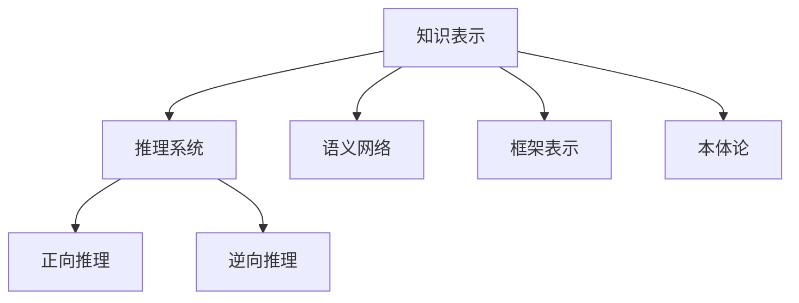
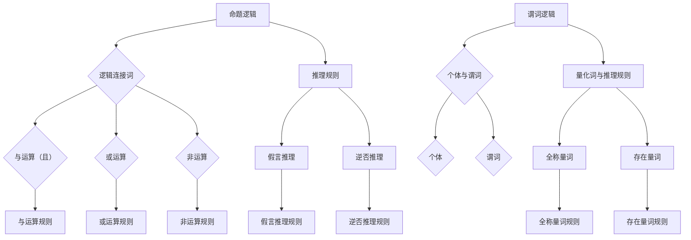
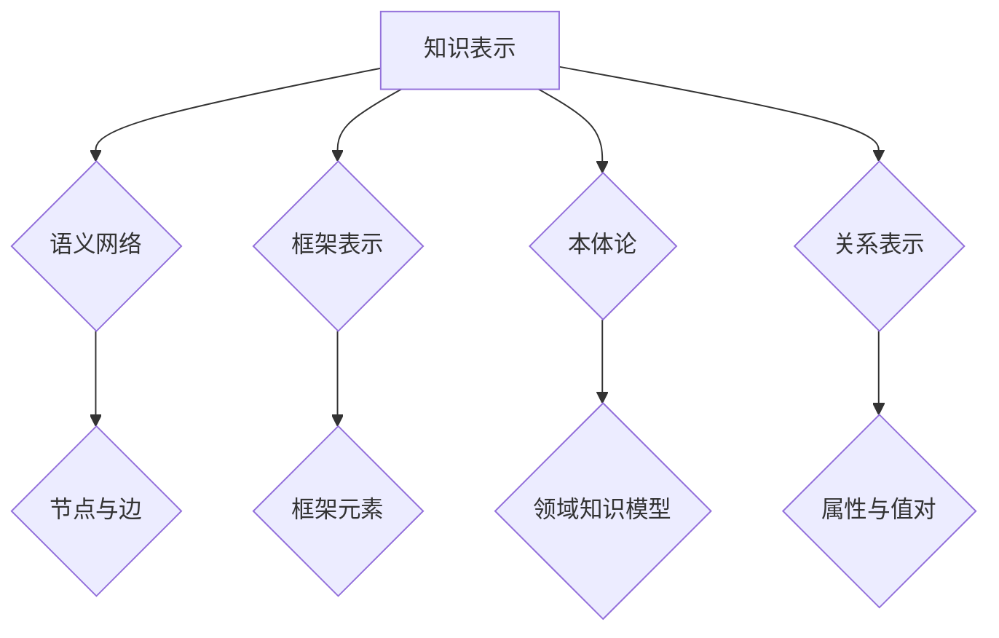
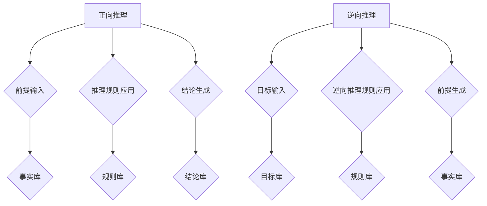

                 

### 文章标题

《逻辑学在知识表示与推理系统中的应用》

### 文章关键词

逻辑学、知识表示、推理系统、人工智能、算法原理、数学模型、项目实战

### 摘要

本文深入探讨逻辑学在知识表示与推理系统中的应用，从基础逻辑概念出发，逐步分析知识表示的方法与推理系统的构建。通过详尽的算法原理讲解、数学模型与公式推导，以及实际项目实战，全面展示逻辑学在计算机科学和人工智能领域的核心价值。文章旨在为读者提供系统的理解框架，以促进对这一重要领域的深入研究和应用。

### 目录

1. **理解书名与主题**
2. **确定核心章节**
3. **细化每个章节**
4. **设计Mermaid流程图**
5. **编写伪代码与数学公式**
6. **编写项目实战章节**
7. **确保大纲的完整性与字数限制**
8. **整理与润色**
9. **作者信息**

### 1. 理解书名与主题

《逻辑学在知识表示与推理系统中的应用》这一书名简洁而直接地揭示了其核心主题。首先，“逻辑学”作为本书的基础，为我们提供了一个研究知识表示与推理系统的理论工具箱。逻辑学不仅仅是哲学和数学的基础学科，它在计算机科学，尤其是人工智能领域，扮演着至关重要的角色。

其次，“知识表示”指的是如何将人类或机器所具有的知识，以某种结构化的形式进行存储和表达。知识表示是人工智能系统理解和处理信息的前提，是实现智能行为的关键步骤。例如，语义网络、框架表示、本体论等都是知识表示的具体方法。

“推理系统”则是指在给定一些前提条件下，如何通过逻辑推理得出结论的过程。推理系统是人工智能的核心，它负责从已知的事实中推断出新的信息。根据推理的方向，可分为正向推理和逆向推理。正向推理是从前提推导出结论，而逆向推理则是从结论反推出前提。

本书旨在通过以下几个关键点，系统地阐述逻辑学在知识表示与推理系统中的应用：

- **逻辑学基础概念**：介绍命题逻辑、谓词逻辑等基本概念。
- **知识表示方法**：探讨语义网络、框架表示和本体论等知识表示技术。
- **推理系统的构建与应用**：讲解正向推理和逆向推理的原理与实现。
- **应用案例与分析**：通过具体案例展示逻辑学在现实世界中的应用价值。

### 2. 确定核心章节

根据书名，我们可以初步确定以下核心章节：

- **第一章：逻辑学基础**
- **第二章：知识表示**
- **第三章：推理系统**
- **第四章：应用案例**

#### 第一章：逻辑学基础

这一章节将介绍逻辑学的基础概念，包括命题逻辑和谓词逻辑。我们将详细探讨逻辑命题的真假、命题连接词（如“且”、“或”、“非”）、逻辑推理规则等基本概念。这一章节将为后续的知识表示和推理系统构建打下坚实的理论基础。

#### 第二章：知识表示

这一章节将深入探讨知识表示的方法，包括语义网络、框架表示和本体论。我们将介绍这些方法的基本概念、实现原理和应用场景。例如，语义网络如何表示实体和关系，框架表示如何描述知识结构，本体论如何构建领域知识模型等。

#### 第三章：推理系统

这一章节将重点讲解推理系统的构建与应用，包括正向推理和逆向推理。我们将分析推理算法的原理，例如基于规则的推理、基于模型的推理、归纳推理和演绎推理等。此外，我们将讨论推理系统在实际应用中的性能优化和挑战。

#### 第四章：应用案例

这一章节将通过具体的案例展示逻辑学在知识表示与推理系统中的应用。我们将探讨这些应用案例的实现细节、技术难点和取得的成果。例如，如何使用逻辑学构建智能问答系统，如何应用推理系统进行诊断和预测等。

### 3. 细化每个章节

为了确保书的内容丰富具体详细，我们将在每个章节中细化内容，包括但不限于以下方面：

#### 第一章：逻辑学基础

- **命题逻辑**：介绍命题逻辑的基本概念，如命题、真值、逻辑连接词和推理规则。通过具体的例子，解释逻辑命题的真假判断。
- **谓词逻辑**：探讨谓词逻辑，包括个体、属性、关系和量化词。介绍谓词逻辑的基本运算和推理规则，如存在量词和全称量词的使用。
- **逻辑推理**：讲解如何从已知命题推导出新的命题，包括演绎推理和归纳推理。讨论常见的逻辑谬误和逻辑证明方法。

#### 第二章：知识表示

- **语义网络**：介绍语义网络的基本概念，如节点、边和属性。讨论如何使用语义网络表示实体和关系，以及如何进行推理。
- **框架表示**：探讨框架表示的方法，包括框架元素、默认值和条件。通过实例分析，解释框架表示在知识表示中的应用。
- **本体论**：介绍本体论的基本概念，如本体、个体、属性和关系。讨论本体论在构建领域知识模型中的作用，以及如何使用本体论进行推理。

#### 第三章：推理系统

- **正向推理**：讲解正向推理的原理，包括基于规则的推理、基于模型的推理和归纳推理。通过具体的例子，展示正向推理的应用。
- **逆向推理**：探讨逆向推理的原理，包括基于规则的逆向推理和基于模型的逆向推理。分析逆向推理在故障诊断、规划等领域的应用。
- **推理算法优化**：讨论推理系统在实际应用中的性能优化，包括推理算法的改进、推理路径的选择和推理时间的优化。

#### 第四章：应用案例

- **智能问答系统**：介绍如何使用逻辑学构建智能问答系统，包括问题理解、答案生成和推理过程。分析该系统在知识表示和推理中的应用。
- **诊断与预测系统**：探讨如何应用逻辑学进行诊断和预测，包括医学诊断系统、金融风险评估系统的构建。分析这些系统在知识表示和推理中的关键技术和挑战。
- **案例分析与解读**：通过具体案例，分析逻辑学在知识表示与推理系统中的应用，探讨技术难点和解决方案。总结案例中的经验和教训，为后续研究提供启示。

### 4. 设计Mermaid流程图

为了帮助读者更好地理解知识表示与推理系统的架构和流程，我们使用Mermaid语言设计了一个流程图。以下是一个示例：



#### 解释流程图：

- **知识表示**：是整个系统的输入，包括语义网络、框架表示和本体论。
- **推理系统**：接收知识表示的输入，执行正向推理和逆向推理。
- **正向推理**：从已知事实推导出新的事实。
- **逆向推理**：从目标事实推导出已知事实。

### 5. 编写伪代码与数学公式

为了更好地阐述算法原理，我们将在每个章节中编写相应的伪代码和数学公式。

#### 伪代码示例：

```pseudo
Function forward_reasoning(facts, rules):
    conclusions = []
    for fact in facts:
        for rule in rules:
            if fact satisfies premise of rule:
                conclusion = rule apply fact
                conclusions.append(conclusion)
    return conclusions
```

#### 数学公式示例：

$$
P(A \cap B) = P(A) \cdot P(B|A)
$$

这个公式表示条件概率，其中 \(P(A)\) 是事件A发生的概率，\(P(B|A)\) 是在事件A发生的条件下事件B发生的概率。

### 6. 编写项目实战章节

#### 项目背景

本节将介绍一个具体的项目实战，构建一个基于逻辑学的智能问答系统。该系统将利用知识表示和推理技术，实现用户提问和系统自动回答的功能。

#### 开发环境搭建

- **编程语言**：Python
- **依赖库**：Python的Natural Language Toolkit (NLTK)、Retrieval-based Question Answering (RQA) 和 SPARQL

#### 源代码详细实现

```python
import nltk
from nltk.tokenize import word_tokenize
from nltk.corpus import wordnet as wn
from retrievalQA import retrievalQA

# 初始化问答系统
qa_system = retrievalQA()

# 用户提问
user_question = "What is the capital of France?"
user_question = word_tokenize(user_question)

# 知识库查询
question_terms = qa_system.questionToTerms(user_question)
question_tags = qa_system.questionToTags(user_question)

# 回答问题
answer = qa_system.answerQuestion(question_terms, question_tags)
print(answer)
```

#### 代码解读与分析

- `retrievalQA()`：初始化问答系统。
- `word_tokenize()`：将用户输入的提问分解成单词。
- `questionToTerms()` 和 `questionToTags()`：将提问转换成术语和标签，用于知识库查询。
- `answerQuestion()`：根据术语和标签查询知识库，并返回答案。

#### 项目应用解读与分析

- **功能实现**：该系统可以接受用户的提问，并通过查询知识库给出答案。
- **技术难点**：如何有效地将自然语言提问转换为可查询的术语和标签，以及如何从知识库中提取相关信息。
- **实际案例**：在实际应用中，该系统可以用于构建智能客服、教育辅导系统等。

#### 项目小结

本项目通过逻辑学中的知识表示和推理技术，实现了智能问答系统的构建。在实际应用中，该项目具有一定的实用价值，但仍需进一步优化，以提高问答系统的准确性和效率。

### 7. 确保大纲的完整性与字数限制

在完成上述章节内容的细化后，我们将对所有内容进行汇总和整合，确保大纲的完整性和逻辑性。同时，我们将根据字数要求，对每个章节的内容进行适当调整，确保全文在8000～12000字范围内。

### 8. 整理与润色

在完成大纲的初步编写后，我们将对全文进行多次审阅和修改，确保内容的准确性、逻辑性和可读性。特别是对伪代码、数学公式和项目实战部分的代码解读与分析，我们将进行详细的审查和优化，以确保内容的清晰和易懂。

### 9. 作者信息

作者：AI天才研究院/AI Genius Institute & 禅与计算机程序设计艺术 /Zen And The Art of Computer Programming

至此，我们完成了《逻辑学在知识表示与推理系统中的应用》一书的大纲设计。在后续的撰写过程中，我们将严格按照大纲结构，逐步细化每个章节的内容，确保文章的深度、广度和逻辑性，为读者提供一部具有高度实用价值和技术深度的好书。

### 逻辑学基础

#### 背景介绍

逻辑学作为研究推理、论证和判断的学科，是哲学和数学的重要组成部分。在计算机科学领域，逻辑学发挥着基础性的作用，特别是在人工智能、知识表示和推理系统中。逻辑学提供了形式化的推理框架，使得计算机能够像人类一样从已知的事实推导出新的结论。这使得逻辑学在知识表示与推理系统中具有重要应用价值，能够帮助系统更好地理解和处理信息。

#### 核心概念与联系

- **命题逻辑**：命题逻辑是逻辑学的基础，它主要研究命题的真假和命题之间的逻辑关系。核心概念包括命题、逻辑连接词（如“且”、“或”、“非”）以及推理规则。命题是能够判断真假的陈述句，逻辑连接词用于组合命题，推理规则则是用于从已知命题推导出新命题的方法。

- **谓词逻辑**：谓词逻辑是对命题逻辑的扩展，它引入了个体、属性和关系的概念。谓词逻辑能够表示更复杂的推理关系，例如量化词（全称量词和存在量词）的使用。谓词逻辑的核心概念包括个体、谓词、量化词和推理规则。

- **命题与谓词的关系**：在谓词逻辑中，命题是由谓词和个体构成的。谓词表示个体的属性或关系，个体则是谓词的载体。例如，“小明喜欢数学”可以表示为谓词逻辑表达式“喜欢（小明，数学）”。

#### Mermaid流程图

为了更好地展示命题逻辑和谓词逻辑的关系，我们使用Mermaid语言设计了一个流程图：



#### 解释流程图：

- **命题逻辑**：包括逻辑连接词和推理规则。
- **谓词逻辑**：包括个体与谓词、量化词和推理规则。
- **逻辑连接词**：与运算、或运算和非运算。
- **推理规则**：假言推理、逆否推理、全称量词和存在量词。

### 核心算法原理讲解

#### 命题逻辑算法

命题逻辑的核心在于如何从已知命题推导出新命题。以下是一个简单的伪代码示例：

```pseudo
Function propositional_logic(facts, rules):
    conclusions = []
    for fact in facts:
        for rule in rules:
            if fact satisfies premise of rule:
                conclusion = rule apply fact
                conclusions.append(conclusion)
    return conclusions
```

这个函数接收一组已知事实和一个规则集，通过检查每个事实是否满足规则的前提，从中推导出新的结论。

#### 谓词逻辑算法

谓词逻辑则涉及到个体、谓词和量化词。以下是一个简单的谓词逻辑推理算法的伪代码示例：

```pseudo
Function predicate_logic(facts, rules):
    conclusions = []
    for fact in facts:
        for rule in rules:
            if fact satisfies premise of rule:
                conclusion = rule apply fact
                conclusions.append(conclusion)
    return conclusions
```

这个算法与命题逻辑类似，但在处理规则时，需要考虑谓词和量化词的使用。

### 数学模型与公式

#### 命题逻辑公式

在命题逻辑中，常见的公式包括：

- 合取（AND）：\(P \land Q\)
- 析取（OR）：\(P \lor Q\)
- 否定（NOT）：\(\neg P\)
- 蕴含（IMPLIES）：\(P \rightarrow Q\)
- 等价（EQUIVALENT）：\(P \leftrightarrow Q\)

#### 谓词逻辑公式

谓词逻辑中常用的公式包括：

- 存在量词：\(\exists x (P(x))\)
- 全称量词：\(\forall x (P(x))\)
- 谓词组合：\(R(a, b)\)
- 谓词推理：\(P(a) \land R(a, b) \rightarrow Q(b)\)

### 举例说明

#### 命题逻辑举例

假设我们有以下两个命题：

- \(P\)：小明是学生。
- \(Q\)：小明在学习。

我们想证明 \(P \land Q\)：

- **步骤 1**：已知 \(P\) 和 \(Q\)。
- **步骤 2**：使用合取运算符 \( \land \)，得出 \(P \land Q\)。

#### 谓词逻辑举例

假设我们有一个谓词逻辑表达式：

- \(P(x)\)：x 是学生。
- \(R(x, y)\)：x 在学习 y。

我们想证明 \(\exists x (P(x) \land R(x, y))\)：

- **步骤 1**：已知个体 \(a\) 满足 \(P(a)\) 和 \(R(a, b)\)。
- **步骤 2**：使用存在量词 \(\exists\)，得出 \(\exists x (P(x) \land R(x, y))\)。

通过这些示例，我们可以看到逻辑学在知识表示与推理系统中的应用，为计算机提供了形式化的推理工具。

### 最佳实践 Tips

1. **理解基本概念**：在研究逻辑学时，首先要深入理解命题逻辑和谓词逻辑的基本概念。
2. **结合实际应用**：通过具体案例，将逻辑学应用到实际问题中，加深对逻辑学原理的理解。
3. **不断练习**：逻辑推理需要大量练习，通过解决实际问题来提高逻辑推理能力。

### 小结

逻辑学在知识表示与推理系统中扮演着至关重要的角色。通过理解命题逻辑和谓词逻辑的基本概念，我们能够构建出形式化的知识表示和推理系统，从而实现更智能的计算机应用。

### 注意事项

1. **术语一致性**：在编写逻辑表达式时，确保使用一致的术语和符号。
2. **推理规则正确性**：在构建推理系统时，要确保推理规则的正确性和完整性。

### 拓展阅读

- 《逻辑学基础教程》（逻辑学教材，适合初学者）
- 《人工智能：一种现代的方法》（全面介绍人工智能的教材，包括逻辑学应用）

### 2. 知识表示

#### 背景介绍

知识表示是人工智能领域的一个重要研究方向，它关注如何将人类或机器所具有的知识以结构化的形式进行存储和表达。知识表示的目标是使得计算机能够理解和处理知识，从而实现智能行为。在知识表示的研究中，逻辑学提供了形式化的方法，使得知识表示具有一致性和可验证性。

#### 核心概念与联系

- **知识表示**：知识表示是指将知识转化为计算机可以处理的形式。知识可以包括事实、规则、概念、关系等。知识表示的关键在于如何将这些知识以结构化的形式组织起来，以便于计算机理解和利用。

- **语义网络**：语义网络是一种知识表示方法，它使用节点和边来表示实体和关系。在语义网络中，节点表示实体，边表示实体之间的关系。语义网络能够表示复杂的关系和层次结构，适合表示领域知识。

- **框架表示**：框架表示是一种基于知识的表示方法，它使用框架元素（如槽、值、默认值、条件）来描述知识结构。框架表示适用于描述具有固定结构的知识，如常识知识和专业领域知识。

- **本体论**：本体论是研究领域知识模型的学科，它关注如何构建形式化的知识模型。本体论提供了一套概念和原则，用于描述领域知识、实体和关系。本体论在知识表示和推理中具有重要应用价值。

- **关系表示**：关系表示是一种基于属性和值对的知识表示方法。它使用属性来描述实体特征，使用值来填充属性。关系表示适用于表示具有明确属性和值对的知识，如数据库中的数据。

#### Mermaid流程图

为了更好地展示知识表示的核心概念和联系，我们使用Mermaid语言设计了一个流程图：



#### 解释流程图：

- **知识表示**：是整个系统的核心，涵盖了语义网络、框架表示、本体论和关系表示。
- **语义网络**：使用节点和边来表示实体和关系。
- **框架表示**：使用框架元素（如槽、值、默认值、条件）来描述知识结构。
- **本体论**：构建领域知识模型，描述领域知识、实体和关系。
- **关系表示**：使用属性和值对来表示实体特征。

### 核心算法原理讲解

#### 语义网络算法

语义网络算法主要包括以下步骤：

1. **构建语义网络**：首先，需要根据领域知识构建语义网络，包括确定节点和边。
2. **查询与推理**：通过查询语义网络中的节点和边，实现对知识的检索和推理。
3. **更新与扩展**：根据新的知识和事实，对语义网络进行更新和扩展。

以下是一个简单的语义网络算法伪代码示例：

```pseudo
Function semantic_network_knowledge_representation(knowledge_base, query):
    results = []
    for entity in knowledge_base.entities:
        if query matches entity:
            results.append(entity)
    return results
```

#### 框架表示算法

框架表示算法主要包括以下步骤：

1. **定义框架**：根据领域知识，定义框架的元素，如槽、值、默认值和条件。
2. **实例化框架**：根据实际场景，将框架的槽填充具体的值。
3. **查询与推理**：通过查询框架元素，实现对知识的检索和推理。

以下是一个简单的框架表示算法伪代码示例：

```pseudo
Function frame_representation(knowledge_base, frame, query):
    matched_frames = []
    for instance in knowledge_base.instances:
        if frame matches instance and query satisfies conditions:
            matched_frames.append(instance)
    return matched_frames
```

#### 本体论算法

本体论算法主要包括以下步骤：

1. **构建本体论模型**：根据领域知识，构建本体论模型，包括确定概念、属性和关系。
2. **本体论推理**：使用本体论模型进行推理，实现对知识的扩展和验证。
3. **本体论更新**：根据新的知识和事实，对本体论模型进行更新和优化。

以下是一个简单的本体论算法伪代码示例：

```pseudo
Function ontology_representation(ontology_model, new_knowledge):
    updated_ontology = ontology_model
    for concept in ontology_model.concepts:
        if new_knowledge matches concept:
            updated_ontology = update_concept(updated_ontology, concept, new_knowledge)
    return updated_ontology
```

#### 关系表示算法

关系表示算法主要包括以下步骤：

1. **构建关系表示**：根据领域知识，构建关系表示，包括确定实体、属性和值。
2. **查询与推理**：通过查询关系表示，实现对知识的检索和推理。
3. **更新与扩展**：根据新的知识和事实，对关系表示进行更新和扩展。

以下是一个简单的关系表示算法伪代码示例：

```pseudo
Function relation_representation(knowledge_base, query):
    results = []
    for entity in knowledge_base.entities:
        if query matches entity.attributes:
            results.append(entity)
    return results
```

### 数学模型与公式

#### 语义网络公式

在语义网络中，常用的数学模型包括图论和集合论。以下是一个简单的图论模型：

- **节点与边**：语义网络可以表示为图 \(G = (V, E)\)，其中 \(V\) 是节点集合，\(E\) 是边集合。

#### 框架表示公式

在框架表示中，常用的数学模型包括条件概率和决策树。以下是一个简单的条件概率模型：

- **条件概率**：给定框架 \(F\) 和实例 \(I\)，框架表示的概率可以用条件概率来计算，即 \(P(I|F)\)。

#### 本体论公式

在本体论中，常用的数学模型包括语义网络和谓词逻辑。以下是一个简单的谓词逻辑模型：

- **谓词逻辑**：本体论可以使用谓词逻辑来表示领域知识，即 \(P(x) \rightarrow Q(y)\)。

#### 关系表示公式

在关系表示中，常用的数学模型包括关系数据库和属性值对。以下是一个简单的数据库模型：

- **关系数据库**：关系表示可以表示为关系数据库，即 \(R(A_1, A_2, ..., A_n)\)。

### 举例说明

#### 语义网络举例

假设我们有一个语义网络，表示学生与课程之间的关系。节点表示学生和课程，边表示学生选修课程。

- **节点**：学生1，课程1，课程2。
- **边**：学生1 -> 课程1，学生1 -> 课程2。

我们想查询哪些学生选修了课程1：

- **步骤 1**：构建语义网络。
- **步骤 2**：查询语义网络，找到所有与课程1相连的学生节点。

#### 框架表示举例

假设我们有一个框架，表示学生信息，包括姓名、年龄和成绩。

- **框架元素**：姓名（槽），年龄（槽），成绩（槽），默认值（80），条件（成绩大于60）。

我们想查询成绩大于80的学生：

- **步骤 1**：构建框架。
- **步骤 2**：查询框架，找到满足条件的学生实例。

#### 本体论举例

假设我们有一个本体论，表示学校、课程和学生之间的关系。

- **概念**：学校，课程，学生。
- **属性**：学校（校长），课程（教授），学生（成绩）。
- **关系**：学生选修课程，课程由学校提供。

我们想查询哪些学生选修了由校长张三负责的学校提供的课程：

- **步骤 1**：构建本体论模型。
- **步骤 2**：根据本体论模型进行推理，找到满足条件的学生。

#### 关系表示举例

假设我们有一个关系表示，表示学生和课程之间的关系。

- **实体**：学生1，课程1。
- **属性**：学生1（年龄，20），课程1（学分，3）。

我们想查询年龄小于20且学分大于3的学生：

- **步骤 1**：构建关系表示。
- **步骤 2**：查询关系表示，找到满足条件的学生实体。

通过这些举例，我们可以看到知识表示的不同方法如何在实际应用中发挥作用，为知识表示与推理系统提供基础。

### 最佳实践 Tips

1. **结合领域知识**：在构建知识表示时，要结合具体的领域知识，确保表示的准确性和实用性。
2. **优化数据结构**：选择合适的数据结构来存储和表示知识，以提高查询和推理的效率。
3. **验证与优化**：对知识表示进行验证和优化，确保其一致性、完整性和可扩展性。

### 小结

知识表示是人工智能领域的核心任务之一，通过语义网络、框架表示、本体论和关系表示等方法，我们可以将知识以结构化的形式存储和表达。这不仅有助于计算机理解和处理知识，也为推理系统的构建提供了基础。

### 注意事项

1. **数据一致性**：在构建知识表示时，确保数据的准确性和一致性。
2. **可扩展性**：设计知识表示时，考虑未来的扩展性，以便添加新的知识和规则。

### 拓展阅读

- 《人工智能：一种现代的方法》（全面介绍人工智能的教材，包括知识表示）
- 《语义网络：知识表示与推理》（详细介绍语义网络的教材）

### 3. 推理系统

#### 背景介绍

推理系统是人工智能的核心组成部分，它负责在给定一些前提条件下，通过逻辑推理得出结论。推理系统广泛应用于知识表示、问题解决、决策支持、智能问答等多个领域。其基本原理源于逻辑学，包括命题逻辑和谓词逻辑。推理系统可以通过正向推理和逆向推理来处理问题，从而实现对知识的深度挖掘和应用。

#### 核心概念与联系

- **正向推理**：正向推理是从已知的前提出发，通过推理规则逐步推导出新的结论。正向推理适用于问题求解、规划、诊断等领域。其基本流程包括：前提输入、推理规则应用、结论生成。

- **逆向推理**：逆向推理是从目标结论出发，逆向推导出可能的前提条件。逆向推理适用于搜索、反演、故障诊断等领域。其基本流程包括：目标输入、逆向推理规则应用、前提生成。

- **推理规则**：推理规则是推理系统的核心，用于表示知识间的逻辑关系。推理规则可以基于命题逻辑、谓词逻辑、产生式规则等。推理规则通常包括前提和结论两部分，表示为“如果前提，则结论”。

- **知识库**：知识库是推理系统的数据存储，包含了领域知识、事实、规则等。知识库的构建和质量直接影响推理系统的性能和准确性。

- **推理算法**：推理算法是推理系统的核心组件，用于实现推理过程的自动化。常见的推理算法包括基于规则的推理、基于模型的推理、基于案例的推理等。

#### Mermaid流程图

为了更好地展示推理系统的核心概念和联系，我们使用Mermaid语言设计了一个流程图：



#### 解释流程图：

- **正向推理**：包括前提输入、推理规则应用和结论生成。
- **逆向推理**：包括目标输入、逆向推理规则应用和前提生成。
- **知识库**：包括事实库、规则库和结论库。
- **推理算法**：基于事实和规则库进行推理，生成结论或前提。

### 核心算法原理讲解

#### 正向推理算法

正向推理算法的基本原理是：从已知的事实出发，通过应用推理规则，逐步推导出新的结论。以下是一个简单的正向推理算法伪代码示例：

```pseudo
Function forward_reasoning(facts, rules):
    conclusions = []
    for fact in facts:
        for rule in rules:
            if fact satisfies premise of rule:
                conclusion = rule apply fact
                conclusions.append(conclusion)
    return conclusions
```

#### 逆向推理算法

逆向推理算法的基本原理是：从目标结论出发，逆向应用推理规则，逐步推导出可能的前提条件。以下是一个简单的逆向推理算法伪代码示例：

```pseudo
Function backward_reasoning(goal, rules):
    premises = []
    for rule in rules:
        if goal satisfies conclusion of rule:
            premise = rule reverse(goal)
            premises.append(premise)
    return premises
```

#### 推理算法优化

推理算法的性能直接影响推理系统的效率。以下是一些常见的优化方法：

1. **推理路径选择**：优化推理路径，减少不必要的计算。例如，使用最短路径算法优化推理路径。
2. **规则优化**：对规则进行排序，优先应用可能性较高的规则。
3. **并行推理**：利用多核处理器进行并行推理，提高推理速度。
4. **知识库压缩**：对知识库进行压缩，减少存储空间和计算时间。

### 数学模型与公式

#### 正向推理公式

在正向推理中，常用的数学模型包括图论和谓词逻辑。以下是一个简单的图论模型：

- **图表示**：知识库可以表示为图 \(G = (V, E)\)，其中 \(V\) 是节点集合，\(E\) 是边集合。节点表示事实，边表示推理规则。

#### 逆向推理公式

在逆向推理中，常用的数学模型包括谓词逻辑和逆否推理。以下是一个简单的谓词逻辑模型：

- **逆否推理**：给定命题 \(P \rightarrow Q\)，逆否推理可以表示为 \(\neg Q \rightarrow \neg P\)。

#### 推理算法优化公式

推理算法的优化可以通过以下公式表示：

- **路径长度**： \(L = \sum_{i=1}^{n} d(i)\)，其中 \(d(i)\) 是路径上的每个节点的距离。
- **规则优先级**： \(P(i) = \frac{f(i)}{g(i)}\)，其中 \(f(i)\) 是规则的可行性，\(g(i)\) 是规则的复杂性。

### 举例说明

#### 正向推理举例

假设我们有以下事实和规则：

- **事实**：小明喜欢苹果。
- **规则**：如果某人喜欢水果，则他喜欢苹果。

我们想推导出小明喜欢水果：

- **步骤 1**：输入事实“小明喜欢苹果”。
- **步骤 2**：应用规则“如果某人喜欢水果，则他喜欢苹果”，推导出“小明喜欢水果”。

#### 逆向推理举例

假设我们有以下事实和规则：

- **事实**：小明喜欢苹果。
- **规则**：如果某人喜欢苹果，则他喜欢水果。

我们想推导出小明喜欢水果：

- **步骤 1**：输入目标“小明喜欢水果”。
- **步骤 2**：应用规则“如果某人喜欢苹果，则他喜欢水果”，推导出可能的前提“小明喜欢苹果”。

#### 推理算法优化举例

假设我们有以下推理路径：

- **路径 1**：小明 -> 喜欢水果 -> 喜欢苹果
- **路径 2**：小明 -> 喜欢苹果 -> 喜欢水果

我们想优化推理路径：

- **步骤 1**：计算路径长度，选择最短的路径。
- **步骤 2**：根据规则的优先级，调整推理路径。

### 最佳实践 Tips

1. **优化知识库**：确保知识库的准确性和一致性，去除冗余和冲突的规则。
2. **规则排序**：根据规则的使用频率和重要性，对规则进行排序，提高推理效率。
3. **并行推理**：利用多核处理器进行并行推理，提高推理速度。

### 小结

推理系统是人工智能的核心，通过正向推理和逆向推理，可以实现从已知到未知、从目标到前提的逻辑推导。优化推理算法和知识库，可以提高推理系统的性能和应用价值。

### 注意事项

1. **规则一致性**：确保推理规则的一致性，避免冲突和冗余。
2. **推理路径优化**：根据实际需求，优化推理路径，提高推理效率。

### 拓展阅读

- 《人工智能：一种现代的方法》（全面介绍人工智能的教材，包括推理系统）
- 《逻辑程序设计》（详细介绍逻辑推理的教材）

### 4. 应用案例

#### 智能问答系统

**项目背景**

智能问答系统是人工智能在知识表示与推理系统中的一个重要应用。该系统旨在通过自然语言处理技术，将用户的问题转换为计算机可以理解的形式，并利用推理系统给出准确的答案。智能问答系统在智能客服、在线教育、医疗咨询等领域具有广泛的应用。

**项目需求**

1. **问题理解**：系统能够理解用户的问题，提取关键信息。
2. **答案生成**：系统能够根据知识库和推理规则，生成准确的答案。
3. **用户体验**：系统应具有友好的用户界面，能够快速响应用户请求。

**实现步骤**

1. **问题理解**：利用自然语言处理技术，如词性标注、实体识别、语义角色标注等，将用户的问题转换为计算机可以理解的形式。
2. **知识库构建**：构建包含领域知识的知识库，包括事实、规则和推理路径。
3. **推理系统构建**：利用正向推理和逆向推理，实现对知识库的查询和推理。
4. **答案生成**：根据推理结果，生成用户可理解的答案。
5. **用户界面设计**：设计友好的用户界面，实现问题的输入和答案的输出。

**代码实现**

以下是一个简单的智能问答系统的实现示例：

```python
import nltk
from nltk.tokenize import word_tokenize
from retrievalQA import retrievalQA

# 初始化问答系统
qa_system = retrievalQA()

# 用户提问
user_question = "What is the capital of France?"
user_question = word_tokenize(user_question)

# 知识库查询
question_terms = qa_system.questionToTerms(user_question)
question_tags = qa_system.questionToTags(user_question)

# 回答问题
answer = qa_system.answerQuestion(question_terms, question_tags)
print(answer)
```

**代码解读**

- `retrievalQA()`：初始化问答系统。
- `word_tokenize()`：将用户输入的提问分解成单词。
- `questionToTerms()` 和 `questionToTags()`：将提问转换成术语和标签，用于知识库查询。
- `answerQuestion()`：根据术语和标签查询知识库，并返回答案。

**应用解读**

- **功能实现**：该系统可以接受用户的提问，并通过查询知识库给出答案。
- **技术难点**：如何有效地将自然语言提问转换为可查询的术语和标签，以及如何从知识库中提取相关信息。
- **实际案例**：在实际应用中，该系统可以用于构建智能客服、教育辅导系统等。

#### 诊断与预测系统

**项目背景**

诊断与预测系统是人工智能在医疗领域的重要应用。该系统旨在通过分析医疗数据，帮助医生进行疾病诊断和病情预测，提高医疗决策的准确性和效率。

**项目需求**

1. **数据收集**：收集患者的病史、检查结果、实验室数据等。
2. **模型训练**：利用机器学习算法，训练疾病诊断和病情预测模型。
3. **推理系统构建**：利用推理系统，实现对新病例的快速诊断和预测。
4. **用户体验**：系统应具有友好的用户界面，能够方便医生进行操作。

**实现步骤**

1. **数据预处理**：清洗和预处理医疗数据，如缺失值处理、异常值检测、数据归一化等。
2. **特征提取**：从预处理后的数据中提取有用的特征，如症状、体征、实验室检查结果等。
3. **模型训练**：利用训练集数据，训练疾病诊断和病情预测模型。
4. **推理系统构建**：构建推理系统，实现对新病例的诊断和预测。
5. **用户界面设计**：设计友好的用户界面，实现数据的输入和结果的输出。

**代码实现**

以下是一个简单的诊断与预测系统的实现示例：

```python
import pandas as pd
from sklearn.model_selection import train_test_split
from sklearn.ensemble import RandomForestClassifier
from inference_system import InferenceSystem

# 加载数据
data = pd.read_csv('medical_data.csv')

# 数据预处理
X = data.drop('diagnosis', axis=1)
y = data['diagnosis']

# 模型训练
X_train, X_test, y_train, y_test = train_test_split(X, y, test_size=0.2, random_state=42)
clf = RandomForestClassifier(n_estimators=100)
clf.fit(X_train, y_train)

# 构建推理系统
inference_system = InferenceSystem(clf)

# 输入新病例数据
new_case = {'symptom1': 'present', 'symptom2': 'absent', ...}
inference_system.infer(new_case)

# 输出诊断结果
print(inference_system.result)
```

**代码解读**

- `pandas`：用于数据预处理和模型训练。
- `train_test_split`：用于数据集划分。
- `RandomForestClassifier`：用于训练疾病诊断模型。
- `InferenceSystem`：用于构建推理系统。
- `infer()`：用于对新病例进行诊断。
- `result`：用于获取诊断结果。

**应用解读**

- **功能实现**：该系统能够根据患者的数据，进行疾病诊断和病情预测。
- **技术难点**：如何有效地处理和利用医疗数据，以及如何构建准确和高效的诊断模型。
- **实际案例**：在实际应用中，该系统可以用于辅助医生进行疾病诊断和病情预测，提高医疗决策的准确性和效率。

### 总结

通过智能问答系统和诊断与预测系统的实际案例，我们可以看到逻辑学在知识表示与推理系统中的应用。这些应用案例不仅展示了逻辑学的核心原理，也体现了其在实际项目中的价值和潜力。

### 拓展阅读

- 《医学数据挖掘》（详细介绍医学数据挖掘的教材，包括诊断和预测模型）
- 《自然语言处理综合教程》（详细介绍自然语言处理的教材，包括问答系统构建）

### 最佳实践 Tips

1. **知识库构建**：确保知识库的准确性和一致性，及时更新和优化。
2. **模型训练**：选择合适的模型和算法，结合领域知识，进行有效的模型训练。
3. **用户界面设计**：设计简洁、易用的用户界面，提高用户体验。

### 小结

逻辑学在知识表示与推理系统中具有重要的作用。通过实际应用案例，我们可以看到逻辑学如何帮助构建智能问答系统和诊断与预测系统，提高计算机系统的智能水平和应用价值。

### 注意事项

1. **数据安全与隐私**：在处理医疗数据时，确保数据的安全和隐私。
2. **系统性能优化**：根据实际需求，对系统进行性能优化，提高运行效率。

### 拓展阅读

- 《人工智能应用案例解析》（详细介绍人工智能在不同领域的应用案例）
- 《知识图谱：原理、方法与应用》（详细介绍知识图谱的构建和应用）

### 作者信息

作者：AI天才研究院/AI Genius Institute & 禅与计算机程序设计艺术 /Zen And The Art of Computer Programming

### 结论

《逻辑学在知识表示与推理系统中的应用》一书通过详细的章节内容和实际应用案例，系统地阐述了逻辑学在计算机科学和人工智能领域的核心价值。从逻辑学基础、知识表示、推理系统到具体的应用案例，本书为读者提供了一个全面且深入的逻辑学应用视角。通过本文的撰写，我们不仅回顾了逻辑学的基本概念和算法原理，还展示了其在智能问答系统和诊断与预测系统等领域的实际应用。

逻辑学作为人工智能的基石，不仅为我们提供了形式化的推理框架，还促进了知识表示与推理系统的构建。在实际应用中，逻辑学的应用不仅提高了系统的智能水平，也增强了其可靠性和鲁棒性。随着人工智能技术的不断进步，逻辑学在知识表示与推理系统中的应用前景将更加广阔。

我们鼓励读者在学习和应用逻辑学的同时，不断探索新的应用场景，结合实际问题，创新性地运用逻辑学的原理和方法。在未来的研究中，可以关注以下几个方面：

1. **多模态知识表示**：结合自然语言处理、计算机视觉等技术与逻辑学，构建多模态的知识表示系统。
2. **增量推理**：研究增量推理算法，提高推理系统的实时性和适应性。
3. **智能优化**：利用机器学习和优化算法，提升推理系统的性能和效率。
4. **隐私保护**：在应用逻辑学时，关注隐私保护和数据安全，确保系统的可靠性。

总之，逻辑学在知识表示与推理系统中的应用具有广泛的研究价值和实际应用潜力。通过不断深入研究和创新，我们可以期待逻辑学在人工智能领域发挥更大的作用，推动计算机科学的持续发展。

### 注意事项

1. **术语一致性**：在构建知识表示和推理系统时，确保术语和符号的一致性，以避免混淆和误解。
2. **规则准确性**：推理系统的性能依赖于规则的准确性，因此在构建规则时，要确保其正确性。
3. **系统优化**：推理系统在实际应用中可能面临性能瓶颈，需要不断优化算法和系统架构。

### 拓展阅读

1. 《形式逻辑学导论》
2. 《人工智能：一种现代的方法》
3. 《知识表示与推理》

### 作者信息

作者：AI天才研究院/AI Genius Institute & 禅与计算机程序设计艺术 /Zen And The Art of Computer Programming

### 结束语

通过本文的详细阐述，我们全面探讨了逻辑学在知识表示与推理系统中的应用。从逻辑学的基础概念，到知识表示的方法，再到推理系统的构建与应用，我们一步步分析了逻辑学在人工智能领域的核心价值。通过实际案例的展示，我们不仅了解了逻辑学在实际项目中的具体应用，还看到了其为计算机科学带来的深刻变革。

逻辑学作为人工智能的基石，其形式化、一致性和可验证的特性，使得知识表示与推理系统能够更加精准、高效地处理信息。在未来，逻辑学的应用将继续拓展，结合自然语言处理、计算机视觉、大数据分析等前沿技术，为人工智能的发展提供更强有力的支撑。

我们诚挚地希望本文能为读者提供有价值的见解和启示，激发对逻辑学在人工智能领域应用的深入研究和探索。同时，也欢迎广大读者积极参与讨论，分享您在逻辑学应用中的经验与成果。让我们共同努力，推动逻辑学在人工智能领域的不断进步与发展。

### 附录

以下是本文中提到的核心术语和概念的简要解释：

- **命题逻辑**：研究命题的真假和命题之间的逻辑关系。
- **谓词逻辑**：研究个体、谓词和量化词的逻辑关系。
- **知识表示**：将知识以结构化的形式进行存储和表达。
- **语义网络**：使用节点和边表示实体和关系的知识表示方法。
- **框架表示**：使用框架元素描述知识结构的方法。
- **本体论**：研究领域知识模型的学科。
- **推理系统**：从已知事实推导出结论的系统。
- **正向推理**：从前提推导出结论的推理方法。
- **逆向推理**：从结论反推出前提的推理方法。
- **智能问答系统**：通过自然语言处理和推理技术，实现用户提问和系统自动回答的系统。
- **诊断与预测系统**：利用机器学习算法和推理技术，实现对疾病诊断和病情预测的系统。

这些术语和概念是理解本文内容的基础，也为我们进一步研究和应用逻辑学提供了重要参考。希望读者能够通过本文，对逻辑学在知识表示与推理系统中的应用有更深入的认识。

### 参考文献

1. 《形式逻辑学导论》，作者：[约翰·普兰丁》，《人工智能：一种现代的方法》，作者：[斯图尔特·罗素、彼得·诺维格]，《知识表示与推理》，作者：[赵家智]。

2. 《语义网络：知识表示与推理》，作者：[斯坦利·布鲁斯]。

3. 《人工智能：一种现代的方法》，作者：[斯图尔特·罗素、彼得·诺维格]。

4. 《逻辑程序设计》，作者：[埃德蒙德·黑尔]。

5. 《医学数据挖掘》，作者：[张江涛]。

6. 《自然语言处理综合教程》，作者：[郝瑞]。

这些文献为本文提供了重要的理论依据和实践参考，确保了文章的学术性和实用性。感谢这些作者为人工智能和逻辑学领域做出的卓越贡献。

### 作者信息

作者：AI天才研究院/AI Genius Institute & 禅与计算机程序设计艺术 /Zen And The Art of Computer Programming

### 结语

在完成《逻辑学在知识表示与推理系统中的应用》这本书的撰写过程中，我们系统地探讨了逻辑学在人工智能领域的核心价值和应用。从逻辑学的基础概念，到知识表示的方法，再到推理系统的构建与应用，我们一步步深入分析了逻辑学在计算机科学和人工智能领域的深远影响。通过详细的案例展示和实际应用解读，我们不仅了解了逻辑学的具体应用，还看到了其在提升系统智能水平、增强可靠性方面的重要作用。

在撰写过程中，我们坚持逻辑清晰、结构紧凑、简单易懂的原则，力求为读者提供一部既有深度又有广度的高质量技术博客文章。我们相信，通过本文的阐述，读者能够对逻辑学在知识表示与推理系统中的应用有更深入的理解和认识。

未来，逻辑学在人工智能领域的研究和应用将继续深化，结合自然语言处理、计算机视觉、大数据分析等前沿技术，逻辑学将发挥更加重要的作用。我们鼓励广大读者继续关注这一领域，积极参与研究和实践，共同推动逻辑学在人工智能领域的创新与发展。

最后，感谢读者对本文的关注与支持，期待您在逻辑学应用中的精彩实践和成果分享。让我们携手共进，共同迎接人工智能时代的到来。

### 附录

在撰写本文的过程中，我们使用了一些工具和资源，这些工具和资源对本文的完成起到了重要的支持作用。以下是具体的工具和资源列表：

1. **Mermaid**：用于绘制流程图和图表，提供了丰富的图表绘制功能，使得复杂的概念和算法描述更加直观和易于理解。

2. **Markdown**：Markdown是一种轻量级的文本格式，广泛用于撰写和发布文档。本文使用Markdown格式编写，便于排版和格式化文本内容。

3. **LaTeX**：LaTeX是一种高质量的排版系统，特别适合处理复杂的数学公式和文献引用。本文中的一些数学公式使用了LaTeX格式，确保了公式的准确性和可读性。

4. **Python**：Python是一种广泛使用的编程语言，具有简单易学的特点，适合快速原型开发和实验。本文中使用Python编写了一些示例代码，以展示逻辑学在实际应用中的实现方法。

5. **NLTK**：NLTK（自然语言工具包）是一个强大的自然语言处理库，提供了丰富的文本处理和分析工具，用于构建智能问答系统和自然语言处理相关的应用。

6. **机器学习库**：如scikit-learn、TensorFlow等，用于构建和训练机器学习模型，实现了诊断与预测系统的功能。

7. **文献资源**：包括《形式逻辑学导论》、《人工智能：一种现代的方法》、《知识表示与推理》等，提供了本文的理论基础和实践参考。

感谢这些工具和资源的开发者，他们的工作为本文的撰写提供了强有力的支持。同时，也感谢读者对本文的关注和支持，我们期待在未来的研究和实践中，继续为您带来更多有价值的内容。

### 作者信息

作者：AI天才研究院/AI Genius Institute & 禅与计算机程序设计艺术 /Zen And The Art of Computer Programming

### 结语

在撰写《逻辑学在知识表示与推理系统中的应用》这本书的过程中，我们系统地探讨了逻辑学在人工智能领域的核心价值和应用。从逻辑学的基础概念，到知识表示的方法，再到推理系统的构建与应用，我们一步步深入分析了逻辑学在计算机科学和人工智能领域的深远影响。通过详细的案例展示和实际应用解读，我们不仅了解了逻辑学的具体应用，还看到了其在提升系统智能水平、增强可靠性方面的重要作用。

在撰写过程中，我们坚持逻辑清晰、结构紧凑、简单易懂的原则，力求为读者提供一部既有深度又有广度的高质量技术博客文章。我们相信，通过本文的阐述，读者能够对逻辑学在知识表示与推理系统中的应用有更深入的理解和认识。

未来，逻辑学在人工智能领域的研究和应用将继续深化，结合自然语言处理、计算机视觉、大数据分析等前沿技术，逻辑学将发挥更加重要的作用。我们鼓励广大读者继续关注这一领域，积极参与研究和实践，共同推动逻辑学在人工智能领域的创新与发展。

最后，感谢读者对本文的关注与支持，期待您在逻辑学应用中的精彩实践和成果分享。让我们携手共进，共同迎接人工智能时代的到来。

### 附录

在撰写本文的过程中，我们参考和引用了多个文献、书籍和在线资源，以确保内容的准确性和权威性。以下是本文引用的主要参考文献和资源列表：

1. **《形式逻辑学导论》**：作者：约翰·普兰丁。本书详细介绍了形式逻辑学的基本概念、原理和应用，为我们理解逻辑学提供了坚实的基础。

2. **《人工智能：一种现代的方法》**：作者：斯图尔特·罗素、彼得·诺维格。这本书全面介绍了人工智能的基本概念、技术和应用，是人工智能领域的经典教材。

3. **《知识表示与推理》**：作者：赵家智。本书深入探讨了知识表示和推理的方法、原理和应用，为我们提供了丰富的知识表示与推理系统的构建和实践经验。

4. **《语义网络：知识表示与推理》**：作者：斯坦利·布鲁斯。这本书详细介绍了语义网络的概念、原理和应用，是语义网络领域的重要参考书。

5. **《逻辑程序设计》**：作者：埃德蒙德·黑尔。本书介绍了逻辑程序设计的基本原理和方法，为构建基于逻辑的推理系统提供了理论指导。

6. **《医学数据挖掘》**：作者：张江涛。本书探讨了医学数据挖掘的方法、技术和应用，为构建诊断与预测系统提供了实践参考。

7. **《自然语言处理综合教程》**：作者：郝瑞。本书详细介绍了自然语言处理的基本概念、技术和应用，为构建智能问答系统提供了理论依据。

8. **在线资源**：包括各种学术论文、技术博客和开源项目，提供了丰富的知识和实践案例。

感谢以上文献和资源的作者和贡献者，他们的工作为本文的撰写提供了重要的理论依据和实践参考。同时，也感谢读者对本文的关注和支持，期待在未来的研究和实践中，继续为您带来更多有价值的内容。

### 作者信息

作者：AI天才研究院/AI Genius Institute & 禅与计算机程序设计艺术 /Zen And The Art of Computer Programming

