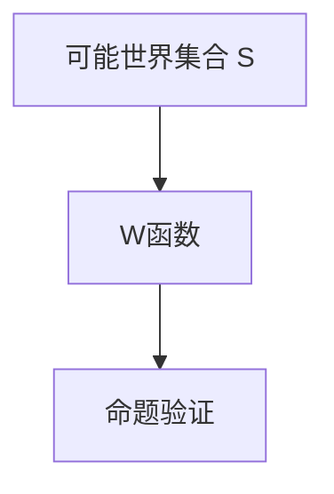
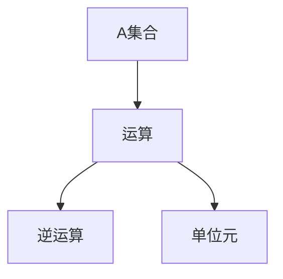
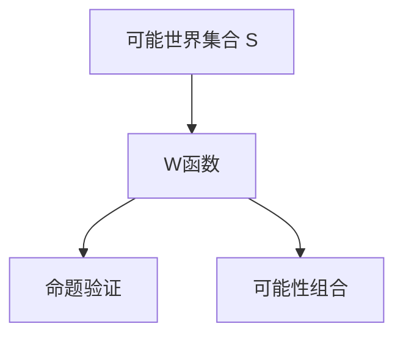
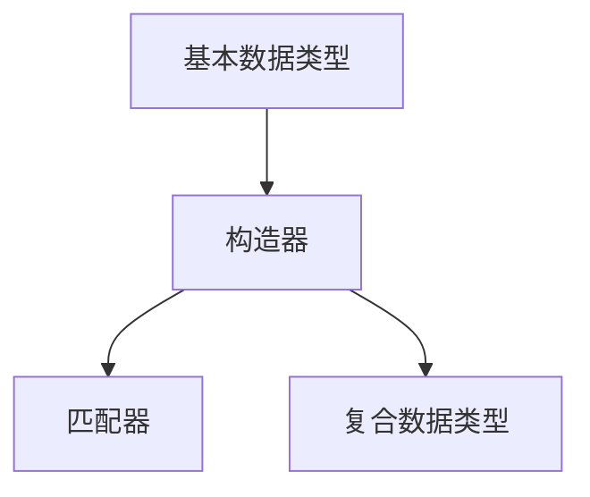
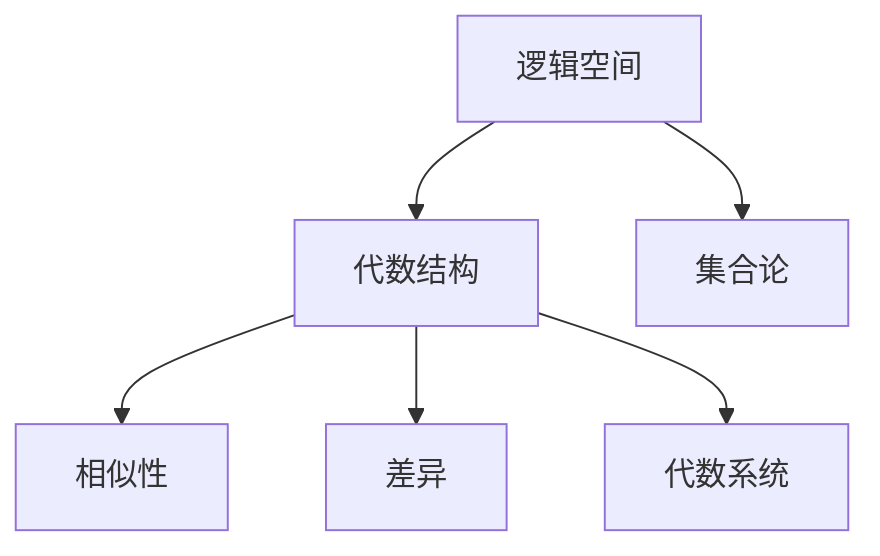

                 

### 文章标题：逻辑空间与代数结构：维特根斯坦的可能性空间与FP的代数数据类型

### 关键词：
- 维特根斯坦
- 可能性空间
- FP
- 代数数据类型
- 逻辑空间
- 计算机科学

### 摘要：
本文旨在探讨逻辑空间与代数结构在计算机科学中的重要性，特别是维特根斯坦的可能性空间与函数式编程（FP）中的代数数据类型。通过分析这些概念，我们不仅能够加深对逻辑和数学基础的理解，还能更好地应用它们于实际的编程和系统设计中。

## 引言与背景介绍

### 1.1 逻辑空间与代数结构的背景

逻辑空间和代数结构是数学与计算机科学中重要的抽象概念。逻辑空间源于数学中的集合论，它提供了对可能性及其关系的抽象表示。而代数结构则是在集合论的基础上，通过定义特定的运算和性质，形成了对数据操作的统一框架。

### 1.2 维特根斯坦与FP的重要贡献

维特根斯坦（Ludwig Wittgenstein）是20世纪最具影响力的哲学家之一，他的工作对逻辑空间的理解有着深远的影响。维特根斯坦提出了“可能性空间”这一概念，它为我们提供了一种形式化的方式来处理逻辑命题中的可能性。

FP是一种编程范式，强调使用函数和不可变数据。FP的一个重要贡献是引入了代数数据类型，这些类型允许我们以一种严格和抽象的方式来定义和操作复杂的数据结构。

### 1.3 本书的目的与结构

本书旨在探讨逻辑空间与代数结构在计算机科学中的应用，特别是维特根斯坦的可能性空间和FP的代数数据类型。全书分为以下几部分：

1. 逻辑空间与代数结构的基本概念
2. 维特根斯坦的可能性空间
3. FP的代数数据类型
4. 逻辑空间与代数结构的联系与比较
5. 应用与实践
6. 总结与展望

通过这些部分，我们将逐步深入理解这些概念，并探讨它们在实际应用中的重要性。

### 逻辑空间与代数结构的基本概念

#### 2.1 逻辑空间的基本概念

逻辑空间是一种数学结构，用于表示可能世界或状态集合。在形式上，逻辑空间可以被定义为：

$$
\Omega = \{ (S, W) | S \text{ is a set of worlds} \land W \text{ is a function from } S \text{ to } \{0, 1\} \}
$$

其中，$S$ 是可能世界的集合，$W$ 是一个函数，用于指示每个世界是否满足某一命题。

#### 2.2 逻辑空间的性质

逻辑空间的性质包括：

- **完备性**：逻辑空间包含所有可能的世界。
- **一致性**：不存在矛盾的世界。

这些性质使得逻辑空间成为一种强有力的工具，用于逻辑推理和验证。

#### 2.3 逻辑空间的Mermaid流程图

以下是一个简单的Mermaid流程图，展示了逻辑空间的基本结构：

### 代数结构的基本概念

#### 3.1 代数结构的定义

代数结构是一种数学结构，它通过定义一组元素和在这些元素上的一组运算，形成了一个统一的框架。形式上，代数结构可以被定义为：

$$
A = (A, \cdot, \cdot^-, \cdot_0)
$$

其中，$A$ 是一个集合，$\cdot$ 是运算，$\cdot^-$ 是逆运算，$\cdot_0$ 是单位元。

#### 3.2 代数结构的性质

代数结构的性质包括：

- **结合律**：$(a \cdot b) \cdot c = a \cdot (b \cdot c)$
- **分配律**：$a \cdot (b + c) = (a \cdot b) + (a \cdot c)$
- **存在单位元**：存在一个元素 $e$，使得对于所有 $a$，有 $e \cdot a = a \cdot e = a$

这些性质使得代数结构成为一种灵活而强大的工具，可以用于建模各种数学和计算机科学中的概念。

#### 3.3 代数结构的Mermaid流程图

以下是一个简单的Mermaid流程图，展示了代数结构的基本操作：

### 维特根斯坦的可能性空间

#### 4.1 可能性空间的基本概念

维特根斯坦的可能性空间是一种用于表示逻辑命题可能性的数学结构。它由两个元素组成：一个可能世界集合 $S$ 和一个指示函数 $W$。可能世界集合 $S$ 包含所有可能的状态，而指示函数 $W$ 用于指示某个世界是否满足给定的命题。

#### 4.2 可能性空间的性质

可能性空间具有以下性质：

- **完备性**：可能性空间包含所有可能的状态。
- **封闭性**：如果 $W_1$ 和 $W_2$ 是可能性空间中的函数，则它们的组合 $W_1 \circ W_2$ 也是一个可能性空间中的函数。

这些性质使得可能性空间成为逻辑推理和形式化表示的有力工具。

#### 4.3 可能性空间的Mermaid流程图

以下是一个简单的Mermaid流程图，展示了可能性空间的基本结构：

### FP的代数数据类型

#### 5.1 代数数据类型的基本概念

FP中的代数数据类型是一种用于表示复杂数据结构的方法。它通过组合基本数据类型，形成新的复合数据类型。代数数据类型通常包括构造器（constructor）和匹配器（matcher）。

#### 5.2 代数数据类型的性质

代数数据类型具有以下性质：

- **不可变性**：代数数据类型的值是不可变的，这意味着一旦创建，就不能修改。
- **组合性**：代数数据类型可以组合成更复杂的数据类型。

这些性质使得代数数据类型成为一种强大的工具，可以用于编写更安全、更可靠的代码。

#### 5.3 代数数据类型的Mermaid流程图

以下是一个简单的Mermaid流程图，展示了代数数据类型的基本结构：

### 逻辑空间与代数结构的联系与比较

#### 6.1 逻辑空间与代数结构的相似性

逻辑空间和代数结构之间存在相似性：

- **抽象性**：两者都是抽象的概念，用于表示复杂的系统。
- **形式化**：两者都通过形式化的定义和性质，为逻辑推理和数学建模提供了基础。

#### 6.2 逻辑空间与代数结构的差异

尽管逻辑空间和代数结构存在相似性，但它们也存在差异：

- **应用领域**：逻辑空间主要用于逻辑推理和验证，而代数结构主要用于数学建模和计算机编程。
- **数学基础**：逻辑空间基于集合论，而代数结构基于代数系统。

#### 6.3 逻辑空间与代数结构的Mermaid流程图

以下是一个Mermaid流程图，展示了逻辑空间与代数结构的相似性和差异：

### 逻辑空间与代数结构的应用

#### 7.1 应用实例一：可能性空间在逻辑学中的应用

可能性空间在逻辑学中有着广泛的应用。例如，在模态逻辑中，可能性空间用于表示命题的可能世界。通过可能性空间，我们可以对命题的逻辑真值进行形式化分析。

#### 7.2 应用实例二：代数数据类型在编程语言中的应用

代数数据类型在编程语言中也非常常见。例如，在函数式编程语言中，代数数据类型用于表示复杂的数据结构。通过代数数据类型，我们可以实现更安全、更可靠的代码。

#### 7.3 应用实例三：逻辑空间与代数结构在计算机科学中的综合应用

逻辑空间和代数结构在计算机科学中的综合应用也非常常见。例如，在形式化验证中，我们可以使用可能性空间来表示系统的状态，并使用代数结构来定义系统的行为。

### 8.1 本书的核心观点总结

本书探讨了逻辑空间与代数结构在计算机科学中的重要性，特别是维特根斯坦的可能性空间和FP的代数数据类型。通过分析这些概念，我们不仅加深了对逻辑和数学基础的理解，还发现了它们在实际应用中的价值。

### 8.2 未来的研究方向

未来的研究可以进一步探讨逻辑空间和代数结构在其他领域的应用，如自然语言处理、人工智能等。此外，研究如何将逻辑空间和代数结构与现有的编程范式和编程语言相结合，也是一个重要的研究方向。

### 8.3 对读者的建议

对于读者，建议他们深入理解逻辑空间和代数结构的基本概念，并通过实践来加深理解。此外，建议读者关注这些概念在实际应用中的最新进展，以保持对该领域的持续兴趣。

## 作者信息

- 作者：AI天才研究院/AI Genius Institute & 禅与计算机程序设计艺术 /Zen And The Art of Computer Programming

