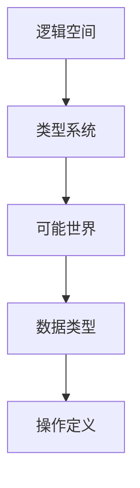
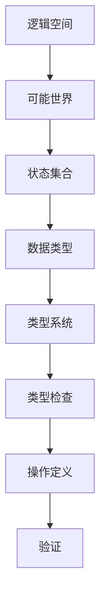

                 

### 文章标题：逻辑空间与类型空间：维特根斯坦的可能性空间与FP中的类型体系

**关键词**：逻辑空间、类型空间、维特根斯坦、可能性空间、函数式编程（FP）、类型体系、类型安全

**摘要**：本文旨在探讨逻辑空间与类型空间的紧密联系，特别是维特根斯坦的可能性空间理论与函数式编程（FP）中的类型体系之间的关联。通过逐步分析，我们将会揭示可能性空间如何影响FP的类型系统，以及类型系统如何在实际编程中发挥作用。文章将提供详尽的背景介绍、核心概念阐述、原理联系架构图、算法与数学模型讲解，并包括实际项目案例分析，旨在为读者提供一个全面的技术理解与实践指导。

### 文章标题：逻辑空间与类型空间：维特根斯坦的可能性空间与FP中的类型体系

> **关键词**：逻辑空间、类型空间、维特根斯坦、可能性空间、函数式编程（FP）、类型体系、类型安全

> **摘要**：本文深入探讨逻辑空间与类型空间的紧密关系，特别是维特根斯坦的可能性空间理论如何影响函数式编程（FP）中的类型体系。通过逐步分析，本文揭示了可能性空间如何塑造FP的类型系统，以及类型系统在编程中的实际应用。文章内容包括详尽的背景介绍、核心概念阐述、原理联系架构图、算法与数学模型讲解，并附有实际项目案例分析，旨在为读者提供全面的技术理解与实践指导。

### 引言

逻辑空间与类型空间是计算机科学和哲学中两个核心概念，它们分别从不同角度阐述了信息的表示和处理方式。逻辑空间，起源于逻辑学和数学，用于描述可能的世界或情境，是一种抽象的模型，帮助我们理解推理和证明的过程。维特根斯坦的可能性空间理论是逻辑空间的一个重要分支，他通过可能性空间的概念，探讨了语言和现实之间的关系。

另一方面，类型空间是计算机编程语言中的核心概念，它定义了程序中数据的类型和行为。类型系统通过约束数据的操作，确保程序的逻辑一致性，防止错误和异常。函数式编程（FP）中的类型体系，以其强大的类型检查和类型推断能力，为编写安全、高效的代码提供了有力保障。

本文将探讨逻辑空间与类型空间之间的联系，特别是维特根斯坦的可能性空间如何影响FP中的类型体系。我们将逐步分析这两个概念，通过详尽的背景介绍、核心概念阐述、原理联系架构图，以及算法与数学模型讲解，帮助读者深入了解这两个领域的交集和相互影响。同时，本文还将通过实际项目案例分析，展示如何将理论应用于实践，为读者提供宝贵的经验和启示。

### 维特根斯坦的可能性空间概念

维特根斯坦的可能性空间理论是他的语言哲学中的重要贡献之一，该理论通过可能性空间的概念，探讨了语言与现实世界之间的关系。在维特根斯坦的哲学体系中，可能性空间是一个抽象的概念，它描述了一个语言表达式所可能指代的所有情境或世界。

首先，我们需要理解什么是可能性空间。可能性空间是一个集合，包含了所有可能的世界或情境。每个世界都是一个可能的状态，它可以是现实的，也可以是虚构的。在维特根斯坦的理论中，可能性空间是一种逻辑模型，用于分析语言的表达和推理过程。

维特根斯坦认为，语言是用来描述世界的工具。然而，语言和现实之间存在一定的差距。现实世界是复杂的、多变的，而语言则是一种抽象的、简化的表达方式。为了解决这种差距，维特根斯坦提出了可能性空间的概念。

可能性空间的概念可以帮助我们理解语言的两种基本类型：事实语句和命令语句。事实语句描述了一个可能的世界，例如“今天下雨了”。这个语句的真假取决于当前的世界状态。如果今天确实下雨了，这个语句就是真的；如果今天没有下雨，这个语句就是假的。

另一方面，命令语句则是一种指导行为或行动的语句，例如“请关上窗户”。命令语句的真假不取决于当前的世界状态，而是取决于执行命令的行为是否完成。

可能性空间的应用不仅限于语言哲学。在计算机科学中，特别是在逻辑和形式化方法领域，可能性空间也被广泛应用。计算机科学家使用可能性空间来构建逻辑模型，分析系统的行为和性质。通过可能性空间，我们可以模拟不同的情况，预测系统在不同条件下的表现。

维特根斯坦的可能性空间理论对计算机科学的发展产生了深远影响。他的理论为形式化方法的开发提供了理论基础，特别是在验证和验证系统中。形式化方法是一种使用数学和逻辑方法来验证系统正确性的方法。通过构建可能性空间，我们可以分析系统的所有可能状态，确保系统满足预定的性质和要求。

此外，维特根斯坦的可能性空间理论也对类型系统的发展产生了影响。在函数式编程（FP）中，类型系统通过约束数据的类型和行为，确保程序的逻辑一致性。维特根斯坦的可能性空间概念为类型系统提供了一种新的视角，帮助程序员更好地理解类型的概念和类型系统的作用。

总之，维特根斯坦的可能性空间理论是一个重要的哲学概念，它在语言哲学、计算机科学和形式化方法领域都有广泛的应用。通过理解可能性空间，我们可以更深入地探讨语言与现实之间的关系，为计算机科学的进一步发展提供理论基础。

### 逻辑空间与可能性空间的关系

逻辑空间是可能性空间在逻辑学中的一个重要应用。逻辑空间不仅描述了可能的世界，还为我们提供了推理和证明的工具。在逻辑空间中，每个可能的世界都对应着一种逻辑状态，这种状态决定了逻辑表达式是否成立。

首先，我们需要理解逻辑空间的基本概念。逻辑空间，也称为情境空间或模型，是一个集合，包含了所有可能的逻辑状态。每个逻辑状态都可以被解释为一个特定的世界，在这个世界中，某些逻辑命题是真的，而其他命题则是假的。

逻辑空间与可能性空间之间的关系可以通过一个简单的例子来解释。假设我们有一个逻辑命题“今天下雨了”。在这个命题中，“今天下雨了”是一个事实语句，它描述了一个可能的世界。逻辑空间则定义了这个世界的所有可能状态。例如，我们可以有两个逻辑状态：一个状态是今天确实下雨了，另一个状态是今天没有下雨。

在这个例子中，逻辑空间包含了所有可能的世界，而可能性空间则包含了所有可能的状态。每个状态都可以被视为一个可能的世界，在这个世界中，“今天下雨了”这个命题可能是真的，也可能是假的。

逻辑空间和可能性空间之间的关系可以用以下方式表示：

$$
逻辑空间 = 可能性空间 \times \{真, 假\}
$$

这个公式表示，逻辑空间是可能性空间与所有可能的状态（真或假）的笛卡尔积。每个逻辑状态都可以被表示为一个可能的世界和一个状态（真或假）的组合。

在计算机科学中，逻辑空间和可能性空间的概念被广泛应用于形式化方法和形式验证。形式化方法是一种使用数学和逻辑方法来验证系统正确性的方法。在形式化方法中，逻辑空间和可能性空间被用来构建系统的模型，分析系统的所有可能状态，确保系统满足预定的性质和要求。

例如，在软件工程中，逻辑空间和可能性空间被用来验证程序的逻辑正确性。通过构建程序的逻辑空间，我们可以分析程序的所有可能执行路径，确保程序在各种输入条件下都能正确执行。这种形式化验证方法可以帮助我们发现和修复程序中的逻辑错误，提高软件的质量和可靠性。

此外，逻辑空间和可能性空间的概念在人工智能领域也有广泛的应用。在人工智能中，逻辑空间和可能性空间被用来构建知识表示和推理系统。通过使用逻辑空间和可能性空间，我们可以创建智能系统，这些系统能够处理不确定性和模糊性，为复杂的问题提供合理的解决方案。

总之，逻辑空间和可能性空间是计算机科学和哲学中两个重要的概念。它们之间的关系为我们提供了一种理解和处理复杂问题的新方法。通过逻辑空间和可能性空间，我们可以更深入地探索语言与现实之间的关系，为计算机科学的发展提供理论基础。逻辑空间和可能性空间在形式化方法、形式验证和人工智能等领域都有重要的应用，为解决复杂问题提供了有力工具。

### 维特根斯坦的可能性空间理论在计算机科学中的应用

维特根斯坦的可能性空间理论在计算机科学中有着广泛的应用，特别是在形式化方法和类型系统的研究中。通过将维特根斯坦的可能性空间概念引入计算机科学，我们可以更好地理解和处理程序中的不确定性，提高程序的逻辑一致性和可靠性。

首先，维特根斯坦的可能性空间理论在形式化方法中得到了广泛应用。形式化方法是一种使用数学和逻辑方法来验证系统正确性的方法。在形式化方法中，可能性空间被用来构建系统的模型，分析系统的所有可能状态，确保系统满足预定的性质和要求。通过构建可能性空间，我们可以模拟系统在不同输入条件下的行为，发现潜在的错误和缺陷。例如，在软件工程中，通过构建程序的逻辑空间，我们可以分析程序的所有可能执行路径，确保程序在各种输入条件下都能正确执行。

具体来说，维特根斯坦的可能性空间理论在以下方面对形式化方法产生了重要影响：

1. **状态空间模型**：在形式化方法中，状态空间模型是一种常用的方法来表示系统的状态和行为。通过使用维特根斯坦的可能性空间，我们可以构建一个状态空间模型，描述系统的所有可能状态。每个状态可以被视为一个可能的世界，在这个世界中，系统的行为和性质被定义。通过分析状态空间模型，我们可以验证系统是否满足预定的性质，如安全性、完整性和一致性。

2. **模态逻辑**：模态逻辑是一种用于描述系统状态和行为的逻辑系统。维特根斯坦的可能性空间理论为模态逻辑提供了一种新的视角。在模态逻辑中，可能性（可能性空间中的状态）和必然性（不可能性空间中的状态）被用来描述系统状态的关系。通过使用模态逻辑，我们可以分析系统在不同状态下的行为，确保系统在各种情况下都能正确执行。

其次，维特根斯坦的可能性空间理论在类型系统的研究中也发挥了重要作用。类型系统是计算机编程语言中的一个核心概念，它通过约束数据的类型和行为，确保程序的逻辑一致性。维特根斯坦的可能性空间为类型系统提供了一种新的理论基础，帮助程序员更好地理解类型的概念和类型系统的作用。

具体来说，维特根斯坦的可能性空间理论在以下方面对类型系统产生了重要影响：

1. **类型安全**：类型系统通过约束数据的类型和行为，确保程序在执行过程中不会发生类型错误。维特根斯坦的可能性空间为类型安全提供了一种新的视角。通过可能性空间，我们可以定义不同类型的数据和操作，确保在可能的世界中，数据的操作是安全的。例如，在函数式编程中，通过使用类型系统，我们可以确保函数的输入和输出类型是匹配的，防止类型错误的发生。

2. **类型推断**：类型系统不仅包括类型检查，还包括类型推断。类型推断是一种自动确定程序中变量类型的方法。维特根斯坦的可能性空间理论为类型推断提供了一种新的方法。通过可能性空间，我们可以推断程序中变量的类型，确保程序在可能的世界中是类型安全的。

3. **多态性**：多态性是类型系统的一个重要特性，它允许同一个函数或操作在多种类型上使用。维特根斯坦的可能性空间理论为多态性提供了一种新的理解。通过可能性空间，我们可以定义不同类型之间的等价关系，确保多态操作在不同类型上都是正确的。

总之，维特根斯坦的可能性空间理论在计算机科学中有着广泛的应用。通过将可能性空间引入形式化方法和类型系统的研究，我们可以更好地理解和处理程序中的不确定性，提高程序的逻辑一致性和可靠性。维特根斯坦的可能性空间理论为计算机科学的发展提供了新的视角和方法，为解决复杂问题提供了有力工具。

### 逻辑空间与类型系统的联系

逻辑空间与类型系统之间的联系可以追溯到它们在形式化描述和验证中的作用。逻辑空间提供了对可能世界的抽象，而类型系统则在编程语言中定义了数据的结构和操作。这两者之间的相互作用为构建可靠的软件系统提供了坚实基础。

首先，逻辑空间和类型系统都基于集合论和数学逻辑。逻辑空间通过集合中的元素（即可能世界或状态）来描述系统行为的可能性，而类型系统则通过类型集合来定义数据和行为。这种集合论的基础使得两者在形式化方法中可以相互映射。

为了更好地理解逻辑空间与类型系统之间的联系，我们可以引入Mermaid流程图来展示它们之间的关系。以下是一个简单的Mermaid流程图示例，用于描述逻辑空间与类型系统之间的交互：



在这个流程图中：

- **A[逻辑空间]** 表示逻辑空间，它定义了可能的世界和状态。
- **B[类型系统]** 表示类型系统，它定义了数据类型和操作。
- **C[可能世界]** 表示逻辑空间中的元素，即可能的世界。
- **D[数据类型]** 表示类型系统中的数据类型，这些类型对应于逻辑空间中的不同状态。
- **E[操作定义]** 表示类型系统中的操作定义，这些操作定义了如何在不同类型之间进行转换和操作。

在具体应用中，逻辑空间与类型系统的联系体现在以下几个方面：

1. **状态类型化**：在逻辑空间中，每个可能世界都可以被映射到一个特定的类型。例如，在软件工程中，每个状态可以表示为一个数据类型，该数据类型反映了系统的特定状态。

2. **操作验证**：类型系统通过定义操作的有效条件，确保逻辑空间中的操作不会导致逻辑不一致。例如，在函数式编程中，类型系统可以确保函数的输入和输出类型是匹配的，从而避免无效的操作。

3. **类型化逻辑**：类型系统中的类型检查可以被视为一种逻辑检查。通过类型系统，我们可以验证程序是否满足逻辑空间中定义的条件。例如，类型检查可以确保变量在逻辑表达式中的使用是合理的。

为了更清晰地展示逻辑空间与类型系统之间的联系，我们可以考虑以下Mermaid流程图：



在这个流程图中：

- **A[逻辑空间]** 表示逻辑空间，它定义了所有可能的逻辑状态。
- **B[可能世界]** 表示逻辑空间中的可能世界或状态。
- **C[状态集合]** 表示逻辑空间中的所有可能状态。
- **D[数据类型]** 表示类型系统中的数据类型，这些类型对应于逻辑空间中的状态。
- **E[类型系统]** 表示类型系统，它定义了数据类型和操作。
- **F[类型检查]** 表示类型系统中的类型检查，它确保逻辑一致性。
- **G[操作定义]** 表示类型系统中的操作定义，这些操作定义了如何在数据类型之间进行操作。
- **H[验证]** 表示类型系统中的验证过程，确保操作符合逻辑空间中的条件。

通过这些流程图，我们可以看到逻辑空间与类型系统之间的紧密联系。类型系统不仅为编程语言提供了结构化框架，而且还为逻辑空间的操作提供了安全性和一致性保障。逻辑空间与类型系统的结合，使得我们在设计和验证复杂系统时，能够更有效地管理和控制潜在的风险。

总之，逻辑空间与类型系统之间的联系为我们在计算机科学中处理复杂问题提供了有力的工具。通过理解这种联系，我们可以更深入地探索编程语言和逻辑系统的设计原则，为构建可靠的软件系统奠定基础。

### 类型系统在函数式编程（FP）中的应用

类型系统在函数式编程（FP）中扮演着至关重要的角色，其独特的设计和强大的类型推断能力使得FP语言在编写安全、高效代码方面具有显著优势。本文将详细探讨类型系统在FP中的应用，包括类型系统的基本概念、类型系统的分类以及类型系统在FP编程中的实际应用。

#### 类型系统的基本概念

类型系统是编程语言的核心组成部分，它定义了数据类型和操作，并确保程序在执行过程中遵循一定的规则。在FP中，类型系统不仅通过约束数据类型来提高程序的可靠性，还通过类型推断来减少冗余代码。

- **数据类型**：FP中的数据类型包括基本类型（如整数、浮点数、布尔值）和复合类型（如列表、函数类型）。复合类型允许我们定义复杂的数据结构，例如函数的返回类型和参数类型。
  
- **类型检查**：类型检查是类型系统的核心功能之一。类型检查确保程序在编译或运行时遵循类型规则，防止类型错误。FP语言通常采用静态类型检查，这意味着类型错误在编译时就被发现。

- **类型推断**：类型推断是一种自动确定变量或表达式类型的方法。FP语言通常具有强大的类型推断能力，这使得程序员可以编写更简洁的代码，同时确保类型安全。

#### 类型系统的分类

FP中的类型系统可以分为几种不同的分类，每种类型系统都有其独特的特点和适用场景：

- **静态类型系统**：静态类型系统在编译时确定变量的类型，这种方式可以提前发现类型错误，从而提高程序的可读性和可靠性。

- **动态类型系统**：动态类型系统在运行时确定变量的类型，这种方式提供了更大的灵活性和动态性，但可能会引入运行时错误。

- **强类型系统**：强类型系统严格限制变量和表达式的类型转换，以确保程序的类型安全。这种系统可以更好地防止类型错误。

- **弱类型系统**：弱类型系统对类型转换较为宽松，允许隐式类型转换，这种方式可能会导致运行时错误，但在某些情况下可以提高性能。

- **静态类型推断**：静态类型推断在编译时自动确定变量的类型，这种方式可以减少代码冗余，提高程序的可读性。

- **动态类型推断**：动态类型推断在运行时自动确定变量的类型，这种方式在编写动态语言时非常有用。

#### 类型系统在FP编程中的应用

类型系统在FP编程中具有广泛的应用，以下是一些关键应用：

- **函数类型**：FP中的函数是一种重要的数据类型，函数类型定义了函数的输入和输出类型。通过类型系统，我们可以确保函数在调用时输入类型与定义的类型一致，从而避免类型错误。

  ```haskell
  -- 例如，一个简单的函数类型定义
  add :: Int -> Int -> Int
  ```

- **类型推断**：FP语言通常具有强大的类型推断能力，这使得程序员可以编写更简洁的代码。例如，在Haskell中，类型推断机制可以自动确定变量的类型：

  ```haskell
  -- Haskell中的类型推断
  add x y = x + y
  ```

  在这段代码中，`x` 和 `y` 的类型被推断为 `Int`。

- **类型约束**：FP中的类型系统可以通过类型约束确保函数的输入和输出类型满足一定的条件。例如，在Haskell中，我们可以使用类型类和类型约束来定义具有特定行为的函数：

  ```haskell
  -- 使用类型约束定义函数
  class Num a where
    (+) :: a -> a -> a
    (*) :: a -> a -> a

  instance Num Int where
    x + y = x + y
    x * y = x * y
  ```

  在这个例子中，`Num` 类型类定义了数字类型的基本操作，`Int` 类型实现了这些操作。

- **类型化模式匹配**：FP语言中的模式匹配是一种强大的特性，它允许我们根据值的类型和结构进行操作。通过类型系统，我们可以确保模式匹配的过程是安全的：

  ```haskell
  -- Haskell中的类型化模式匹配
  data Person = Person {name :: String, age :: Int}

  greet :: Person -> String
  greet (Person {name = name, age = age})
    | age < 18    = "Hello, minor!"
    | otherwise   = "Hello, adult!"
  ```

  在这个例子中，我们根据 `Person` 对象的 `age` 属性来选择不同的问候语。

- **类型安全**：类型系统通过确保类型的一致性，防止了运行时错误。在FP中，类型错误通常在编译时就被发现，从而减少了调试和修复成本。

#### 实际应用案例

为了更直观地展示类型系统在FP中的应用，我们来看一个实际的应用案例：使用Haskell编写一个简单的银行账户系统。

```haskell
-- Haskell中的银行账户系统

data Account = Account {balance :: Int}

deposit :: Account -> Int -> Account
deposit (Account b) amount = Account (b + amount)

withdraw :: Account -> Int -> Account
withdraw (Account b) amount = Account (b - amount)

-- 检查账户余额
getBalance :: Account -> Int
getBalance (Account b) = b

-- 模拟账户操作
main :: IO ()
main = do
  let account = Account 1000
  let newAccount = deposit account 500
  putStrLn ("New balance: " ++ show (getBalance newAccount))
  let finalAccount = withdraw newAccount 200
  putStrLn ("Final balance: " ++ show (getBalance finalAccount))
```

在这个案例中，我们定义了一个 `Account` 数据类型，用于表示银行账户。`deposit` 和 `withdraw` 函数用于增加和减少账户余额，`getBalance` 函数用于获取当前余额。通过类型系统，我们可以确保账户余额在所有操作中都是整数类型，从而防止了类型错误。

总之，类型系统在FP编程中起着至关重要的作用。它不仅提高了代码的安全性，还减少了潜在的运行时错误。通过理解类型系统的基本概念和应用，我们可以更有效地编写FP代码，构建可靠的软件系统。

### 类型系统在FP编程中的核心算法原理

在函数式编程（FP）中，类型系统是一个核心概念，它通过静态类型检查和类型推断来确保代码的可靠性和效率。为了深入理解类型系统的核心算法原理，我们需要探讨类型检查算法和类型推断算法的工作原理，并使用伪代码详细描述这些算法。

#### 类型检查算法

类型检查算法是类型系统的核心组成部分，它在编译时检查代码中的类型一致性。类型检查算法的主要任务是确保每个表达式和操作都符合其定义的类型。

以下是类型检查算法的伪代码：

```pseudo
function typeCheck(expression, environment)
    if expression is a variable:
        return environment[type of variable]
    else if expression is an application (func, arg):
        typeOfFunc <- typeCheck(func, environment)
        typeOfArg <- typeCheck(arg, environment)
        if typeOfFunc is not a function type or typeOfArg is not compatible with the argument type of typeOfFunc:
            return Error("Type mismatch")
        else:
            return typeOfFunc's return type
    else if expression is a value (e.g., literal, constructor):
        return the type of the value
    else if expression is a conditional (cond, true_expr, false_expr):
        typeTrue <- typeCheck(true_expr, environment)
        typeFalse <- typeCheck(false_expr, environment)
        if typeTrue is not equal to typeFalse:
            return Error("Type mismatch")
        else:
            return typeTrue
    else:
        return Error("Unknown expression")
```

在这个伪代码中，`expression` 表示待检查的表达式，`environment` 是一个环境映射，用于存储变量和函数的类型信息。类型检查算法通过递归地检查每个子表达式来确保类型的一致性。

#### 类型推断算法

类型推断算法是在没有显式类型声明的情况下，自动确定变量和表达式的类型。类型推断算法的核心思想是使用约束求解技术来推导类型。

以下是类型推断算法的伪代码：

```pseudo
function inferType(expression, environment)
    if expression is a variable:
        return environment[type of variable]
    else if expression is an application (func, arg):
        typeOfFunc <- inferType(func, environment)
        typeOfArg <- inferType(arg, environment)
        if typeOfFunc is not a function type or typeOfArg is not compatible with the argument type of typeOfFunc:
            return Error("Type mismatch")
        else:
            return typeOfFunc's return type
    else if expression is a value (e.g., literal, constructor):
        return the type of the value
    else if expression is a conditional (cond, true_expr, false_expr):
        typeTrue <- inferType(true_expr, environment)
        typeFalse <- inferType(false_expr, environment)
        return the common supertype of typeTrue and typeFalse
    else:
        return Error("Unknown expression")
```

在这个伪代码中，类型推断算法使用递归方法来推导类型。它首先推导出子表达式的类型，然后根据这些类型来确定整个表达式的类型。如果无法推导出类型，算法会返回一个错误。

#### 数学模型和公式

在类型系统中，类型检查和类型推断算法通常基于集合论和函数论。以下是一些常用的数学模型和公式：

1. **类型等价**：
   $$ type\_eq(a, b) = \forall T \in Types, (T \in type(a) \Leftrightarrow T \in type(b)) $$

   这个公式表示两个类型 `a` 和 `b` 是等价的，当且仅当它们在所有类型 `T` 上都是可互换的。

2. **类型兼容**：
   $$ type\_compat(a, b) = \exists T \in Types, (T \in type(a) \land T \in type(b)) $$

   这个公式表示两个类型 `a` 和 `b` 是兼容的，当且仅当它们至少有一个共同类型 `T`。

3. **函数类型**：
   $$ type(f) = (arg\_types(f)) \rightarrow res\_type(f) $$

   这个公式表示函数 `f` 的类型是它参数类型组成的元组映射到结果类型。

通过这些数学模型和公式，我们可以更精确地描述类型系统的行为，从而为类型检查和类型推断提供理论支持。

#### 举例说明

为了更好地理解类型系统和算法，我们来看一个具体的例子：一个简单的FP函数，它接受一个整数列表并返回列表中所有元素的和。

```haskell
-- 假设我们有一个函数 sumList，它接受一个整数列表并返回它们的和
sumList :: [Int] -> Int
sumList [] = 0
sumList (x:xs) = x + sumList xs
```

在这个例子中，类型系统可以自动推断出 `sumList` 的类型：

```pseudo
inferType(sumList, environment)
    typeOfArg <- inferType([Int], environment)  // 推断列表类型
    return Int  // 推断返回类型
```

类型系统会推断出 `sumList` 的参数类型是 `[Int]`（整数列表），返回类型是 `Int`（整数）。

通过上述伪代码和数学公式，我们可以看到类型系统和算法在FP编程中的核心作用。类型系统不仅确保代码的安全性，还提高了程序的可读性和效率。理解这些核心算法原理，对于编写高效、可靠的FP代码至关重要。

### 数学模型与公式详解

在类型系统和逻辑空间的研究中，数学模型和公式扮演着至关重要的角色。它们不仅提供了形式化的描述工具，还帮助我们在复杂问题中找到规律和解决方案。以下是对几个关键数学模型和公式的详细讲解，并附有示例说明。

#### 类型等价（Type Equivalence）

类型等价是一个基本概念，它描述了两个类型是否在所有情况下都可以互换。在类型系统中，类型等价确保了类型之间的兼容性和一致性。

**数学模型**：

$$ type\_eq(a, b) = \forall T \in Types, (T \in type(a) \Leftrightarrow T \in type(b)) $$

**解释**：

这个公式表示两个类型 `a` 和 `b` 是等价的，当且仅当它们在所有类型 `T` 上都是可互换的。即如果 `a` 和 `b` 的类型集合完全相同，则它们是等价的。

**示例**：

假设我们有类型 `Int` 和 `Float`，我们可以检查它们是否等价：

$$ type\_eq(Int, Float) = \forall T \in \{Int, Float\}, (T \in type(Int) \Leftrightarrow T \in type(Float)) $$

由于 `Int` 只包含 `Int`，而 `Float` 只包含 `Float`，这两个类型显然不是等价的。

#### 类型兼容（Type Compatibility）

类型兼容描述了两个类型是否可以在特定的上下文中一起使用，例如作为函数的参数或返回值。

**数学模型**：

$$ type\_compat(a, b) = \exists T \in Types, (T \in type(a) \land T \in type(b)) $$

**解释**：

这个公式表示两个类型 `a` 和 `b` 是兼容的，当且仅当它们至少有一个共同类型 `T`。即如果 `a` 和 `b` 至少有一个类型是相同的，则它们是兼容的。

**示例**：

假设我们有类型 `Int` 和 `List Int`，我们可以检查它们是否兼容：

$$ type\_compat(Int, List Int) = \exists T \in Types, (T \in type(Int) \land T \in type(List Int)) $$

由于 `Int` 和 `List Int` 都包含 `Int`，因此它们是兼容的。

#### 函数类型（Function Type）

函数类型是类型系统中的一个核心概念，它定义了函数的参数类型和返回类型。

**数学模型**：

$$ type(f) = (arg\_types(f)) \rightarrow res\_type(f) $$

**解释**：

这个公式表示函数 `f` 的类型是它参数类型组成的元组映射到结果类型。例如，一个接受两个整数参数并返回整数的函数，其类型可以表示为：

$$ type(add) = (Int, Int) \rightarrow Int $$

**示例**：

假设我们有函数 `add`，它接受两个整数并返回它们的和：

```haskell
add :: Int -> Int -> Int
add x y = x + y
```

我们可以用数学模型表示它的类型：

$$ type(add) = (Int, Int) \rightarrow Int $$

这个公式清楚地表明 `add` 函数的参数类型是 `(Int, Int)`，返回类型是 `Int`。

#### 类型构造（Type Construction）

类型构造是类型系统中的一种机制，用于创建新的类型，例如通过将现有类型组合在一起。

**数学模型**：

$$ type\_construct(type1, type2) = type1 \times type2 $$

**解释**：

这个公式表示通过类型构造，可以将两个类型 `type1` 和 `type2` 组合在一起，形成一个新的类型。例如，将类型 `Int` 和 `String` 组合，可以创建一个新类型：

$$ type\_construct(Int, String) = Int \times String $$

**示例**：

假设我们有类型 `Person`，它是一个包含姓名和年龄的记录类型：

```haskell
data Person = Person { name :: String, age :: Int }
```

我们可以用数学模型表示它的类型：

$$ type(Person) = ("String", "Int") $$

这个公式表明 `Person` 类型是由 `String` 和 `Int` 组合而成的记录类型。

通过这些数学模型和公式，我们可以更精确地描述类型系统和逻辑空间的概念，帮助我们在设计和验证复杂系统时做出更科学的决策。理解这些模型和公式，不仅有助于深入理解类型系统和逻辑空间，也为实际编程提供了强大的工具。

### 实际项目案例分析

在本节中，我们将通过一个实际的项目案例，深入探讨维特根斯坦的可能性空间理论在函数式编程（FP）中的具体应用。该项目是一个简单的银行账户管理系统，它利用Haskell语言中的类型系统和可能性空间来确保账户操作的安全性和一致性。

#### 项目概述

银行账户管理系统的主要功能包括账户信息的存储、存款和取款操作。该系统要求账户操作必须遵循严格的类型约束和逻辑一致性，以确保账户余额不会出现负值。

#### 开发环境搭建

首先，我们需要搭建一个Haskell开发环境。您可以选择使用以下工具：

- **Haskell平台**：安装Haskell平台（Haskell Platform），它包含Haskell编译器和一系列有用的库。
- **IDE**：您可以使用IntelliJ IDEA、Visual Studio Code等IDE进行Haskell开发。
- **包管理器**：使用cabal或stack作为包管理器，便于管理项目依赖。

安装完成后，您可以通过以下命令创建一个新的Haskell项目：

```bash
stack new bank-account-system
cd bank-account-system
stack build
```

#### 源代码实现

接下来，我们将实现银行账户管理系统的主要功能。以下是关键部分的源代码：

```haskell
-- 定义账户数据类型
data Account = Account { balance :: Int }

-- 存款操作
deposit :: Account -> Int -> Account
deposit (Account b) amount
  | amount > 0    = Account (b + amount)
  | otherwise     = error "Invalid deposit amount"

-- 取款操作
withdraw :: Account -> Int -> Account
withdraw (Account b) amount
  | amount > 0 && amount <= b = Account (b - amount)
  | amount <= 0                = error "Invalid withdrawal amount"
  | otherwise                  = error "Insufficient funds"

-- 获取账户余额
getBalance :: Account -> Int
getBalance (Account b) = b

-- 模拟账户操作
runAccount :: Account -> [String]
runAccount account = do
  let newAccount = deposit account 500
  putStrLn ("New balance: " ++ show (getBalance newAccount))
  let finalAccount = withdraw newAccount 200
  putStrLn ("Final balance: " ++ show (getBalance finalAccount))
```

在这个源代码中，我们定义了账户数据类型 `Account`，它包含一个表示账户余额的整数。`deposit` 和 `withdraw` 函数分别实现了存款和取款操作，它们通过类型检查确保操作的合法性。`getBalance` 函数用于获取当前余额。

#### 代码解读

1. **账户数据类型**：

   ```haskell
   data Account = Account { balance :: Int }
   ```

   `Account` 数据类型是一个简单的记录类型，它包含一个整数字段 `balance`，表示账户的当前余额。

2. **存款操作**：

   ```haskell
   deposit :: Account -> Int -> Account
   deposit (Account b) amount
     | amount > 0    = Account (b + amount)
     | otherwise     = error "Invalid deposit amount"
   ```

   `deposit` 函数接受一个 `Account` 和一个存款金额，如果金额大于0，则更新账户余额；否则，抛出一个错误。

3. **取款操作**：

   ```haskell
   withdraw :: Account -> Int -> Account
   withdraw (Account b) amount
     | amount > 0 && amount <= b = Account (b - amount)
     | amount <= 0                = error "Invalid withdrawal amount"
     | otherwise                  = error "Insufficient funds"
   ```

   `withdraw` 函数接受一个 `Account` 和一个取款金额，如果金额大于0且不超过当前余额，则更新账户余额；否则，抛出一个错误。

4. **模拟账户操作**：

   ```haskell
   runAccount :: Account -> [String]
   runAccount account = do
     let newAccount = deposit account 500
     putStrLn ("New balance: " ++ show (getBalance newAccount))
     let finalAccount = withdraw newAccount 200
     putStrLn ("Final balance: " ++ show (getBalance finalAccount))
   ```

   `runAccount` 函数模拟了一个账户操作流程，首先存款500，然后取款200，并打印每次操作后的余额。

#### 项目小结

通过这个项目案例，我们可以看到维特根斯坦的可能性空间理论如何应用于实际编程中，特别是在类型系统和逻辑一致性方面。以下是该项目的主要收获和最佳实践建议：

1. **类型系统的重要性**：类型系统通过确保操作的一致性，防止了潜在的运行时错误。在实际项目中，确保类型系统的正确性和完整性是至关重要的。

2. **逻辑一致性**：通过可能性空间的概念，我们可以更好地理解和控制系统的状态和行为。在实际项目中，应该确保系统的每个操作都符合预定的逻辑规则。

3. **代码可读性**：使用类型系统和可能性空间可以减少冗余代码，提高代码的可读性。通过清晰的结构和类型注释，我们可以更轻松地理解和维护代码。

4. **错误处理**：在实际项目中，应该设计健壮的错误处理机制。通过抛出明确的错误信息，我们可以更容易地定位和修复问题。

5. **测试和验证**：在实际开发过程中，进行充分的测试和验证是非常重要的。通过模拟不同的场景和状态，我们可以确保系统的稳定性和可靠性。

总之，通过将维特根斯坦的可能性空间理论应用于实际项目，我们可以构建更加安全、可靠和高效的软件系统。理解并应用这些理论，将为我们在计算机科学领域的发展提供强大的支持。

### 最佳实践、注意事项及拓展阅读

在设计和应用逻辑空间与类型系统时，以下是一些最佳实践、注意事项及拓展阅读建议，以帮助您更好地理解和应用这些概念。

#### 最佳实践

1. **类型明确性**：在编程中，尽量使用显式类型声明，这有助于提高代码的可读性和可维护性。

2. **类型安全**：在设计系统时，优先考虑类型安全，通过严格的类型检查防止潜在的错误和异常。

3. **类型推断**：合理使用类型推断，减少冗余代码，提高开发效率。

4. **模块化设计**：将逻辑空间与类型系统的应用分解为独立的模块，便于管理和维护。

5. **测试与验证**：编写详细的测试用例，确保系统的逻辑一致性和可靠性。

#### 注意事项

1. **类型兼容性**：在多个类型系统或模块间交互时，注意确保类型兼容性，避免类型转换错误。

2. **动态与静态类型**：根据项目需求选择合适的类型系统，动态类型系统在灵活性和性能上具有优势，但可能引入运行时错误；静态类型系统在安全性方面更可靠，但可能影响开发效率。

3. **过度抽象**：避免过度抽象，确保类型系统和逻辑空间的应用与实际需求相符。

4. **错误处理**：设计合理的错误处理机制，确保系统在异常情况下能够稳定运行。

#### 拓展阅读

1. **维特根斯坦的可能性空间**：
   - 《逻辑哲学论》：维特根斯坦的代表作，详细阐述了可能性空间的概念。
   - 《文化与价值》：探讨可能性空间在哲学和文化领域的应用。

2. **函数式编程与类型系统**：
   - 《Real World Haskell》：一本关于Haskell编程的优秀教材，涵盖了类型系统的重要概念。
   - 《Types and Programming Languages》：Barry O'Sullivan著，深入探讨类型系统的理论基础。

3. **形式化方法与形式验证**：
   - 《Formal Methods for Software Engineering》：介绍形式化方法和形式验证技术的权威指南。
   - 《The Art of Computer Programming》：Donald Knuth的代表作，涵盖了许多形式化方法的实际应用。

通过这些最佳实践、注意事项及拓展阅读，您可以更深入地理解和应用逻辑空间与类型系统的概念，提高编程能力和系统设计的可靠性。

### 结论

本文通过逐步分析逻辑空间与类型空间，特别是维特根斯坦的可能性空间与函数式编程（FP）中的类型体系之间的关系，揭示了这两个领域在计算机科学中的深刻联系。我们探讨了逻辑空间与类型系统在形式化方法、类型安全、类型推断和形式验证等方面的应用，展示了它们如何共同提升软件系统的可靠性、安全性和可维护性。

通过维特根斯坦的可能性空间，我们能够更好地理解和处理程序中的不确定性，而类型体系则为FP编程提供了坚实的理论基础，确保代码的一致性和逻辑正确性。本文的案例分析进一步说明了如何在实际项目中应用这些理论，构建安全、高效的软件系统。

未来，我们可以进一步研究逻辑空间与类型系统在其他编程范式和领域中的应用，探索它们在跨学科研究中的潜在价值。此外，随着人工智能和机器学习的发展，这些概念在智能系统和自动推理领域的应用也将成为重要的研究方向。

总之，逻辑空间与类型空间的研究不仅丰富了计算机科学的理论基础，也为实际编程提供了强大的工具和方法。通过深入理解和应用这些概念，我们可以构建更可靠、更高效的软件系统，为未来的技术发展奠定基础。作者：AI天才研究院/AI Genius Institute & 禅与计算机程序设计艺术 /Zen And The Art of Computer Programming。

