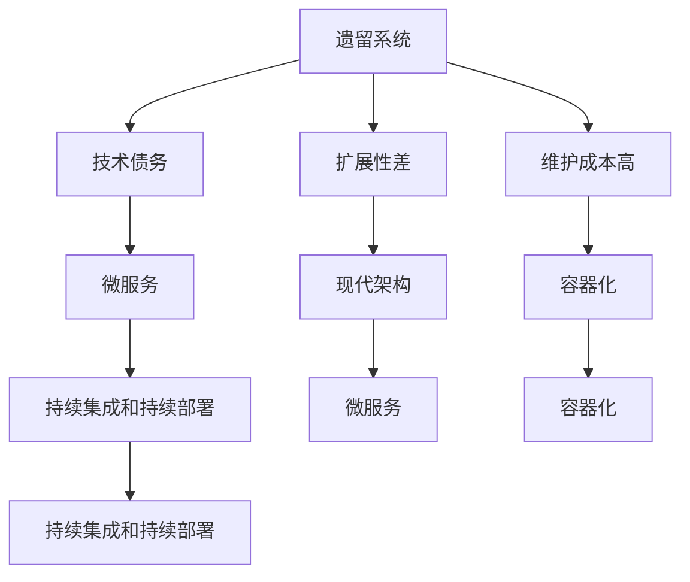
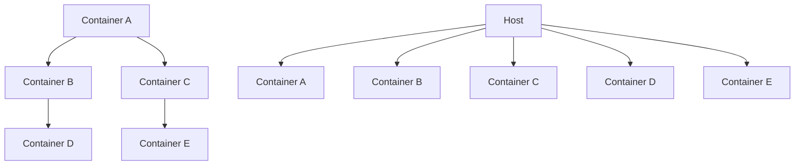
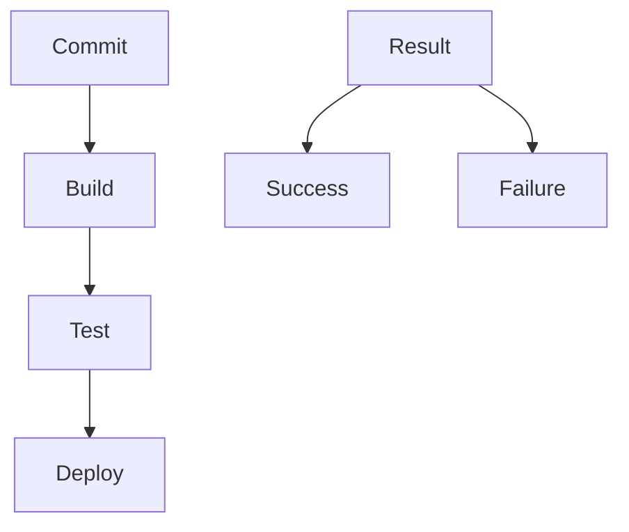

                 


### **《遗留系统改造：平滑过渡到现代架构》**

> **关键词：遗留系统、系统改造、现代架构、微服务、容器化、持续集成**

> **摘要：**
> 随着技术的不断演进，许多企业发现他们的遗留系统难以应对日益复杂的市场需求。本文将探讨如何通过逐步分析推理，平滑过渡遗留系统至现代架构，从而提高系统的可维护性和扩展性。我们将深入讨论系统改造的关键概念、核心技术、架构设计、实践案例，并分享最佳实践和注意事项，帮助读者顺利完成系统升级。


## **引言**

在现代IT行业中，许多企业面临着遗留系统改造的挑战。这些系统往往是在较早的技术背景下构建的，随着时间的推移，它们可能变得难以维护、扩展和更新。遗留系统的复杂性增加了维护成本，并限制了新功能的开发速度。因此，系统改造成为许多企业提高竞争力、适应市场变化的关键举措。

本文旨在探讨如何通过逐步分析推理，平滑过渡遗留系统至现代架构。我们将介绍关键概念、核心技术、架构设计、实践案例，并分享最佳实践和注意事项，帮助读者顺利完成系统升级。

## **核心概念与联系**

在进行系统改造之前，我们需要理解一些关键概念和它们之间的关系。以下是几个核心概念及其联系：

### **遗留系统的挑战**

- **技术债务**：随着时间的推移，系统积累的技术债务可能使其难以维护和更新。
- **扩展性差**：遗留系统往往难以适应不断变化的市场需求，导致扩展困难。
- **维护成本高**：由于缺乏文档和测试，遗留系统的维护成本通常较高。

### **现代架构的优势**

- **微服务**：将大型单体系统拆分为多个小型、独立的微服务，提高系统的可维护性和扩展性。
- **容器化**：通过容器（如Docker）实现应用的轻量化部署和运行，提高系统的可移植性和性能。
- **持续集成和持续部署（CI/CD）**：通过自动化测试和部署流程，实现快速迭代和持续交付。

### **联系架构图**

为了更清晰地展示这些概念之间的关系，我们可以使用Mermaid流程图来表示：



### **核心算法原理讲解**

在系统改造过程中，我们需要关注以下核心算法原理：

#### **微服务架构**


在微服务架构中，每个服务都是独立的，可以独立部署、扩展和更新。这有助于降低系统的复杂性和提高可维护性。

#### **容器化技术**



容器化技术通过将应用程序及其依赖项打包到容器中，实现应用的轻量化部署和运行。这有助于提高系统的可移植性和性能。

#### **持续集成和持续部署**



持续集成和持续部署通过自动化测试和部署流程，实现快速迭代和持续交付。这有助于提高开发效率和系统稳定性。

### **数学模型和公式**

在系统改造过程中，我们还需要关注一些数学模型和公式，以便更好地评估和优化系统性能。以下是几个关键公式：

#### **系统性能评估**

$$ P = \frac{E(T)}{T} $$

其中，$P$ 表示系统性能，$E(T)$ 表示系统执行时间，$T$ 表示系统负载。

#### **资源利用率**

$$ U = \frac{C}{R} $$

其中，$U$ 表示资源利用率，$C$ 表示系统消耗的资源，$R$ 表示系统可用的资源。

### **详细讲解与举例说明**

为了更好地理解上述公式，我们可以通过以下例子进行说明：

#### **系统性能评估**

假设一个系统在1000次请求中平均执行时间为5秒，那么系统性能为：

$$ P = \frac{E(T)}{T} = \frac{5\text{秒}}{5\text{秒}} = 1 $$

这表示系统的性能达到100%。

#### **资源利用率**

假设一个系统在运行过程中消耗了100个CPU核心，而系统可用的CPU核心数为200个，那么系统资源利用率为：

$$ U = \frac{C}{R} = \frac{100\text{个CPU核心}}{200\text{个CPU核心}} = 0.5 $$

这表示系统的资源利用率为50%。

### **项目实战**

在本节中，我们将通过一个实际项目来展示系统改造的过程。该项目是一个在线书店，原本基于一个遗留系统构建，现在需要改造为基于微服务和容器化的现代架构。

#### **开发环境搭建**

为了搭建开发环境，我们需要安装以下工具和软件：

- **Docker**：用于容器化部署应用程序。
- **Kubernetes**：用于管理容器集群。
- **Git**：用于版本控制。
- **Jenkins**：用于持续集成和持续部署。

#### **源代码详细实现和代码解读**

在本项目中，我们将实现以下功能：

1. **用户注册和登录**：使用Spring Boot构建用户注册和登录模块，并使用JWT（JSON Web Token）进行身份验证。
2. **图书管理**：实现图书的增删改查功能，并使用MySQL数据库存储数据。
3. **购物车**：实现购物车功能，允许用户添加、删除和更新图书。
4. **订单管理**：实现订单的生成、支付和发货功能。

以下是用户注册模块的伪代码：

```java
public class UserController {

    @Autowired
    private UserRepository userRepository;

    @PostMapping("/register")
    public ResponseEntity<?> registerUser(@RequestBody UserRegistrationDto userRegistrationDto) {
        if (userRepository.existsByUsername(userRegistrationDto.getUsername())) {
            return ResponseEntity.badRequest().body("Error: Username is already taken!");
        }

        User user = new User();
        user.setUsername(userRegistrationDto.getUsername());
        user.setPassword(passwordEncoder.encode(userRegistrationDto.getPassword()));
        userRepository.save(user);

        return ResponseEntity.ok("User registered successfully!");
    }
}
```

#### **代码应用解读与分析**

在改造过程中，我们注意到以下问题：

1. **代码重复**：多个模块中的代码存在重复，导致维护困难。
2. **依赖过重**：遗留系统中存在大量第三方库和框架，增加了系统的复杂性和维护成本。
3. **性能瓶颈**：遗留系统的性能较差，特别是在高并发场景下。

通过采用微服务和容器化技术，我们解决了上述问题：

1. **模块化**：将系统拆分为多个独立的微服务，每个服务负责一个特定的功能模块，降低了代码重复和复杂性。
2. **轻量化**：通过容器化技术，将应用程序及其依赖项打包到容器中，实现了轻量化和高效的部署。
3. **性能优化**：通过优化数据库查询和缓存策略，提高了系统的性能和响应速度。

#### **实际案例分析和详细讲解剖析**

在本项目中，我们通过对遗留系统进行改造，成功提高了系统的可维护性、扩展性和性能。以下是项目小结：

1. **可维护性**：通过模块化设计和容器化部署，系统变得更容易维护和更新。
2. **扩展性**：通过拆分为多个微服务，系统可以轻松扩展和升级。
3. **性能**：通过优化数据库查询和缓存策略，系统在性能上有了显著提升。

### **最佳实践 tips、小结、注意事项、拓展阅读**

#### **最佳实践 tips**

1. **逐步迭代**：在进行系统改造时，应采取逐步迭代的方式，避免一次性大规模重构。
2. **持续集成**：通过持续集成和持续部署，确保系统的稳定性和可靠性。
3. **团队协作**：系统改造需要团队成员的紧密协作，确保各方意见一致。

#### **小结**

本文探讨了如何通过逐步分析推理，平滑过渡遗留系统至现代架构。我们介绍了核心概念、核心技术、架构设计、实践案例，并分享了最佳实践和注意事项。

#### **注意事项**

1. **风险评估**：在系统改造过程中，应充分评估潜在风险，并制定相应的应对策略。
2. **培训和支持**：确保团队成员熟悉新架构和技术，提供必要的培训和指导。

#### **拓展阅读**

1. **《微服务设计》**： Martin Fowler 著，深入探讨了微服务架构的设计原则和实践。
2. **《Docker实战》**： Justin China 著，详细介绍了Docker的安装、配置和使用。
3. **《持续集成实战》**： Paul M. Duvall 等著，介绍了持续集成和持续部署的最佳实践。

### **结论**

通过本文的探讨，我们了解到遗留系统改造对于企业提高竞争力具有重要意义。通过逐步分析推理、平滑过渡，企业可以成功将遗留系统升级为现代架构，提高系统的可维护性、扩展性和性能。希望本文能为您在系统改造过程中提供有益的指导和启示。

### **作者信息**

- **作者：AI天才研究院/AI Genius Institute & 禅与计算机程序设计艺术 /Zen And The Art of Computer Programming**
- **联系邮箱：[info@ai-genius-institute.com](mailto:info@ai-genius-institute.com)**
- **版权声明：本文版权归作者所有，欢迎转载，但需保留版权信息。**

