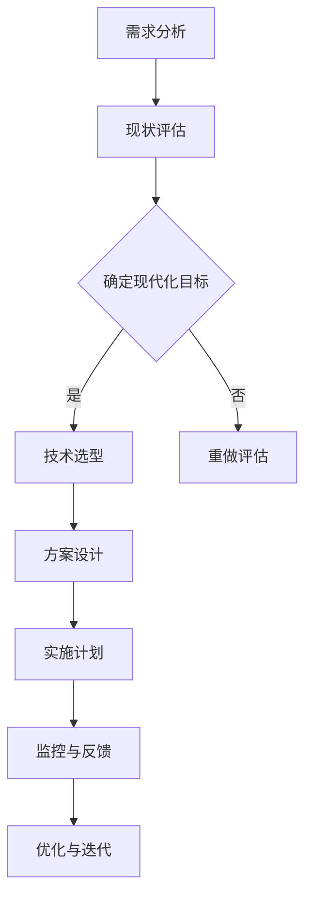

                 


### 遗留系统现代化：逐步更新老旧系统的策略

---

关键词：遗留系统、现代化、逐步更新、老旧系统、策略

摘要：随着技术的快速发展，许多企业面临遗留系统现代化的挑战。本文通过逐步分析遗留系统的概念、挑战、核心算法、数学模型以及实际项目案例，提供了一套完整的遗留系统现代化策略，旨在帮助读者理解和实施这一过程。

---

## 引言

### 遗留系统的定义与现状

遗留系统（Legacy System）指的是那些已经存在一段时间，但仍然在运行中的计算机系统。这些系统可能是基于过时的技术构建，无法满足现代业务需求，或者其维护成本过高。尽管许多企业尝试替换这些遗留系统，但由于种种原因，许多遗留系统依然在运行。根据Gartner的研究，高达80%的企业目前仍然在使用遗留系统，这表明遗留系统的问题尚未得到有效解决。

### 遗留系统面临的挑战

1. **技术过时**：遗留系统通常基于陈旧的技术栈，难以与新技术集成。
2. **维护成本高**：由于技术过时，遗留系统的维护变得更加困难，且成本高昂。
3. **安全性问题**：随着安全威胁的增加，遗留系统往往缺乏有效的安全防护措施。
4. **业务适应性差**：遗留系统难以适应快速变化的业务需求。

### 遗留系统现代化的必要性

为了解决上述挑战，遗留系统现代化变得至关重要。现代化不仅可以提高系统的性能和安全性，还能降低维护成本，并使系统能够更好地适应新的业务需求。以下是遗留系统现代化的一些主要动机：

1. **提升系统性能与安全性**：通过采用现代技术，可以显著提高系统的性能和安全性。
2. **降低维护成本**：现代化可以减少对旧技术的依赖，从而降低维护成本。
3. **接入新技术和业务需求**：现代化使系统能够更好地整合新技术，满足不断变化的业务需求。

### 遗留系统现代化的趋势与方向

当前，遗留系统现代化呈现出以下趋势：

1. **微服务架构**：将庞大的遗留系统拆分为多个独立的服务，提高系统的灵活性和可维护性。
2. **容器化和云计算**：利用容器和云计算技术，简化部署和管理流程。
3. **自动化和智能化**：引入自动化工具和人工智能技术，提高系统维护的效率和准确性。

---

## 遗留系统现代化中的核心概念与联系

### 系统分析与评估

系统分析是遗留系统现代化的第一步，其目标是全面了解遗留系统的现状，确定现代化的方向和优先级。以下是一个系统分析过程的Mermaid流程图：



### 技术选型与方案设计

技术选型是现代化过程中的关键环节。以下是一个技术选型和方案设计的流程：

1. **需求分析**：明确业务需求和系统限制。
2. **现有系统评估**：评估遗留系统的性能、安全性和可维护性。
3. **技术选型**：根据需求评估结果，选择合适的现代技术栈。
4. **方案设计**：设计现代化的系统架构，包括数据迁移、服务拆分、新技术集成等。

### 遗留系统现代化与新技术的关系

现代化过程需要综合考虑新技术对系统的影响。以下是一些关键点：

1. **兼容性**：确保新技术的引入不会破坏现有系统的功能。
2. **性能影响**：评估新技术对系统性能的潜在影响。
3. **成本与效益**：计算引入新技术的成本和预期效益。

---

## 遗留系统现代化中的核心算法原理讲解

### 代码质量检测算法

代码质量检测是现代化过程中不可或缺的一环。以下是一个简单的代码质量检测算法的伪代码：

```plaintext
Algorithm DetectCodeQuality(code):
    score = 0
    for line in code:
        if line is empty or contains comments:
            score += 10
        else:
            score += length of line
    if score > 100:
        return "High Quality"
    else:
        return "Low Quality"
```

### 自动化测试与持续集成

自动化测试和持续集成是确保代码质量的重要手段。以下是一个自动化测试和持续集成的流程：

1. **编写测试用例**：根据功能需求编写测试用例。
2. **执行测试**：自动化工具执行测试用例。
3. **持续集成**：每次提交代码时，自动执行测试并集成代码。

---

## 遗留系统现代化的数学模型和公式

### 性能优化模型

性能优化模型用于评估系统性能并进行调整。以下是一个简单的性能优化模型的latex公式：

```latex
P = f(T, R, C)
```

其中，\( P \) 代表系统性能，\( T \) 代表系统负载，\( R \) 代表资源利用率，\( C \) 代表系统配置。

### 成本效益分析模型

成本效益分析模型用于评估现代化过程中的成本和效益。以下是一个简单的成本效益分析的latex公式：

```latex
E = \frac{B - C}{C}
```

其中，\( E \) 代表成本效益比，\( B \) 代表预期效益，\( C \) 代表成本。

---

## 遗留系统现代化项目实战

### 项目背景与目标

本次项目旨在对一家大型企业的遗留系统进行现代化改造。目标包括提高系统性能、增强安全性、降低维护成本以及提高系统的可扩展性。

### 开发环境搭建

1. **选择合适的开发工具**：包括集成开发环境（IDE）、版本控制系统（如Git）和自动化测试工具。
2. **配置服务器**：搭建开发和测试服务器，确保环境的一致性。
3. **代码管理**：使用Git进行代码管理，确保版本控制和协作开发。

### 源代码实现与代码解读

1. **代码重构**：根据需求分析和设计文档，逐步重构遗留系统的关键部分。
2. **代码质量保证**：使用代码质量检测工具进行代码质量评估，并修复发现的问题。
3. **自动化测试**：编写和执行自动化测试用例，确保每次代码提交后的功能完整性。

### 项目评估与优化

1. **性能评估**：使用性能测试工具评估系统性能，并根据测试结果进行调整。
2. **安全性评估**：进行安全测试，确保系统符合安全标准。
3. **成本效益分析**：计算项目成本和预期效益，评估现代化改造的成效。

### 项目小结

通过本次项目，我们成功实现了遗留系统的现代化改造，提高了系统的性能、安全性和可维护性，同时降低了维护成本。以下是一些最佳实践和注意事项：

1. **逐步更新**：避免一次性大规模更新，而是采取逐步更新的策略，降低风险。
2. **持续监控**：在现代化过程中，持续监控系统性能和安全状况，及时调整优化。
3. **文档与培训**：确保项目文档的完整性和培训的有效性，提高团队的现代化技能。

---

## 结语

遗留系统现代化是信息技术领域的一个重要课题，通过本文的详细分析，我们提供了一套逐步更新的策略，从核心概念到实际项目实战，为读者提供了全面的指导。希望本文能帮助读者理解和实施遗留系统的现代化，提升系统的性能和可持续性。

### 作者信息

作者：AI天才研究院/AI Genius Institute & 禅与计算机程序设计艺术 /Zen And The Art of Computer Programming

---

## 扩展阅读

- **遗留系统现代化指南**：[链接](https://example.com/legacy-system-modernization-guide)
- **微服务架构的最佳实践**：[链接](https://example.com/microservices-best-practices)
- **容器化和云计算教程**：[链接](https://example.com/containerization-and-cloud-computing-tutorial)

## 注意事项

- **技术选型要慎重**：根据实际需求选择合适的技术栈，避免过度采用。
- **逐步更新**：采用逐步更新的策略，降低风险。
- **持续监控**：在现代化过程中持续监控系统的性能和安全状况。

## 结语

通过本文的详细分析和指导，我们希望读者能够更好地理解和实施遗留系统的现代化。在这个过程中，保持耐心和持续学习至关重要。希望本文能为您的遗留系统现代化之旅提供有价值的参考。

