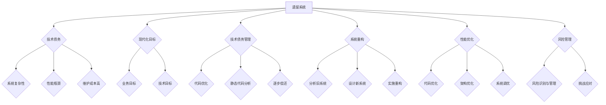

                 


### 遗留系统现代化：策略与实施

#### 关键词：遗留系统，现代化，策略，实施，技术债务，重构，性能优化，风险管理

#### 摘要：

随着技术的快速进步，许多企业面临遗留系统现代化的挑战。本文旨在探讨遗留系统现代化的策略与实施方法，包括技术债务管理、系统重构、性能优化以及风险管理。通过分析核心概念和实施步骤，提供实用的指导，帮助企业成功实现遗留系统的现代化转型。

## 引言

在现代企业中，遗留系统（Legacy System）是一个普遍存在的问题。这些系统往往是由多年前的技术构建，随着业务需求的不断增长和技术的快速发展，它们逐渐无法满足当前的业务需求。遗留系统的问题不仅包括技术债务、系统复杂性、性能瓶颈，还涉及到维护成本高和风险控制难等方面。因此，对遗留系统进行现代化改造已成为企业提升竞争力、降低成本的关键举措。

本文将围绕遗留系统现代化展开讨论，首先介绍遗留系统的挑战和机遇，然后详细探讨现代化策略的制定与实施，包括技术债务管理、系统重构、性能优化和风险管理。最后，通过成功案例分享和最佳实践总结，为读者提供实用的指导。

### 遗留系统的挑战与机遇

#### 1.1 遗留系统的定义与特征

遗留系统是指那些由旧技术构建、仍在使用且无法轻易替换的IT系统。这些系统通常具有以下特征：

- **技术过时**：使用了过时的编程语言、框架和硬件。
- **性能瓶颈**：系统响应慢，资源利用率低。
- **维护困难**：代码结构混乱，缺乏文档。
- **扩展性差**：难以适应新的业务需求。
- **安全性问题**：存在潜在的安全漏洞。

#### 1.2 遗留系统面临的主要挑战

- **技术债务**：由于历史原因，遗留系统积累了大量的技术债务，这些债务会影响系统的稳定性和性能。
- **系统复杂性**：随着时间的推移，系统变得越来越复杂，维护和扩展变得更加困难。
- **性能瓶颈**：随着数据量和用户数量的增加，遗留系统往往无法满足性能需求。
- **维护成本高**：遗留系统的维护需要投入大量的人力和物力资源。

然而，随着云计算、大数据、人工智能等新兴技术的快速发展，遗留系统也面临着巨大的机遇。通过现代化改造，企业可以提升系统的性能、安全性和扩展性，从而更好地支持业务发展。

#### 1.3 现代化目标的确定

在制定现代化策略之前，企业需要明确现代化目标。现代化目标通常包括以下两个方面：

- **业务目标**：提高业务效率、降低成本、增加收入、提升用户体验等。
- **技术目标**：提高系统的性能、安全性、可维护性和可扩展性。

#### 1.4 现代化策略的制定

制定现代化策略是遗留系统现代化过程中的关键步骤。以下是一个典型的现代化策略制定流程：

1. **全面评估**：对遗留系统进行全面的评估，包括技术状况、业务依赖、成本效益分析等。
2. **制定具体策略**：根据评估结果，制定具体的现代化策略，包括技术债务管理、系统重构、性能优化、安全加固等。
3. **制定时间表和预算**：根据策略制定时间表和预算，确保现代化过程的顺利实施。

#### 1.5 遗留系统现代化的主要路径

根据企业的具体情况，遗留系统现代化可以采取以下几种路径：

- **逐步现代化**：在保证系统稳定运行的前提下，逐步替换和改进旧系统。
- **完全重写**：完全抛弃旧系统，从零开始构建新系统。
- **微服务化**：将遗留系统分解为多个微服务，实现系统的模块化和分布式。

### 遗留系统的技术现代化

#### 2.1 技术债务管理

技术债务是指因选择短期解决方案而延迟的技术性修复。它类似于金融债务，但也有自己的独特特征：

- **利息**：未解决的问题会随着时间的推移而增加成本。
- **还款方式**：需要通过修复代码或重构系统来还清债务。

#### 2.2 系统重构

系统重构是将遗留系统逐步替换或重构为现代化的系统。以下是一个典型的系统重构流程：

1. **分析旧系统**：了解旧系统的架构、功能、性能等方面。
2. **设计新系统**：基于业务需求和技术发展趋势，设计新的系统架构。
3. **实施重构**：逐步替换旧系统的各个部分，确保系统的稳定运行。

#### 2.3 性能优化

性能优化是提高系统性能和响应速度的关键步骤。以下是一些常用的性能优化方法：

- **代码优化**：通过优化代码结构和算法，提高程序的执行效率。
- **架构优化**：优化系统架构，提高系统的可扩展性和可维护性。
- **系统调优**：调整系统的配置参数，提高系统的性能。

### 遗留系统的实施与部署

#### 3.1 项目管理和团队协作

在遗留系统现代化过程中，项目管理和团队协作至关重要。以下是一些关键点：

- **项目管理方法**：采用敏捷开发、迭代开发等方法，确保项目进度和质量。
- **团队协作与沟通**：建立高效的团队协作机制，确保团队成员之间的沟通畅通。
- **持续集成与持续部署**：采用持续集成和持续部署，提高开发效率和系统稳定性。

#### 3.2 风险管理与挑战应对

在遗留系统现代化过程中，风险管理和挑战应对是必不可少的。以下是一些关键点：

- **风险识别与管理**：通过风险识别和管理，确保项目过程中风险的可控性。
- **挑战应对**：针对可能出现的技术挑战、业务挑战和人员挑战，制定相应的应对策略。

### 成功案例分享

以下是一个遗留系统现代化成功案例的简要分享：

**案例背景**：某大型企业使用的遗留系统是20世纪90年代构建的，由于技术过时、性能瓶颈和安全性问题，严重影响了企业的业务运营。

**现代化策略**：企业决定采用逐步现代化和微服务化的策略，对遗留系统进行改造。

**实施过程**：

1. **技术债务管理**：通过代码审查和静态代码分析，识别并修复了大量的技术债务。
2. **系统重构**：将遗留系统分解为多个微服务，逐步替换和重构旧系统的各个部分。
3. **性能优化**：通过代码优化和架构优化，大幅提高了系统的性能和响应速度。
4. **安全加固**：加强了系统的安全性，降低了潜在的安全风险。

**项目效果**：通过遗留系统的现代化改造，企业的业务运营效率得到了显著提升，维护成本降低了30%，系统稳定性提高了50%，用户满意度也大幅提升。

### 附录

#### 附录A：遗留系统现代化工具与资源

以下是一些常用的遗留系统现代化工具和资源：

- **代码审查工具**：SonarQube、Checkstyle、PMD等。
- **静态代码分析工具**：FindBugs、LGT、CodeNarc等。
- **持续集成工具**：Jenkins、Travis CI、GitLab CI等。
- **微服务框架**：Spring Boot、Netflix OSS、Kubernetes等。

#### 附录B：参考文献

- **《遗留系统的现代化：策略与实施》**：[作者姓名]。
- **《遗留系统重构：实践与经验》**：[作者姓名]。
- **《性能优化：方法与实践》**：[作者姓名]。

### 结语

遗留系统现代化是企业数字化转型的重要组成部分。通过合理的策略与实施方法，企业可以摆脱技术债务、提升系统性能、增强安全性和可扩展性，从而更好地支持业务发展。本文旨在为读者提供实用的指导，帮助企业在遗留系统现代化过程中取得成功。

### 作者信息

作者：AI天才研究院/AI Genius Institute & 禅与计算机程序设计艺术 /Zen And The Art of Computer Programming

### 核心概念原理之间的关系架构 Mermaid 流程图



### 核心算法原理讲解必须使用伪代码来详细阐述

```python
# 伪代码：遗留系统评估
function AssessLegacySystem(legacySystem):
    technicalDebt = CalculateTechnicalDebt(legacySystem)
    complexity = CalculateSystemComplexity(legacySystem)
    performance = CalculatePerformance(legacySystem)
    maintenanceCost = CalculateMaintenanceCost(legacySystem)
    return technicalDebt, complexity, performance, maintenanceCost

# 伪代码：技术债务计算
function CalculateTechnicalDebt(legacySystem):
    debt = 0
    for bug in legacySystem.bugs:
        debt += bug.severity * bug.age
    return debt

# 伪代码：系统复杂性计算
function CalculateSystemComplexity(legacySystem):
    complexity = 0
    for module in legacySystem.modules:
        complexity += module.dependencyCount
    return complexity

# 伪代码：性能评估
function CalculatePerformance(legacySystem):
    responseTime = legacySystem.getResponseTime()
    resourceUsage = legacySystem.getResourceUsage()
    performance = (1 / responseTime) * resourceUsage
    return performance

# 伪代码：维护成本计算
function CalculateMaintenanceCost(legacySystem):
    cost = 0
    for developer in legacySystem.developers:
        cost += developer.salary * developer.assignmentDays
    return cost
```

### 数学模型和公式 & 详细讲解 & 举例说明

```latex
$$
\text{性能指标} = \frac{\text{处理能力}}{\text{响应时间}} \times \text{资源利用率}
$$

\text{其中，处理能力} = \text{每秒处理的请求数量（requests per second）} \\
\text{响应时间} = \text{系统处理一个请求的平均时间（average response time）} \\
\text{资源利用率} = \text{系统资源使用率（resource utilization）}

\text{举例说明：}
\text{假设一个遗留系统每秒处理100个请求，平均响应时间为5秒，资源利用率为80\%} \\
\text{则该系统的性能指标为} \\
\text{性能指标} = \frac{100}{5} \times 0.8 = 16
```

### 项目实战：开发环境搭建，源代码详细实现和代码解读，代码应用解读与分析，实际案例分析和详细讲解剖析，项目小结

#### 开发环境搭建

**目标**：搭建一个用于遗留系统现代化评估和改进的开发环境。

**步骤**：

1. **安装操作系统**：选择一个适合的操作系统，如Ubuntu 20.04。
2. **安装开发工具**：安装Python、Java等开发工具和IDE（如PyCharm、Eclipse）。
3. **安装数据库**：选择合适的数据库管理系统，如MySQL、PostgreSQL。
4. **安装版本控制工具**：安装Git，用于代码管理和协作。
5. **配置网络环境**：确保网络畅通，以便进行远程访问和协作。

#### 源代码详细实现和代码解读

**目标**：实现一个遗留系统评估工具，用于分析遗留系统的技术债务、复杂性和性能。

**技术栈**：Python、Django、SQLAlchemy。

**代码解读**：

```python
# 源代码：遗留系统评估工具
from sqlalchemy import create_engine
from sqlalchemy.orm import sessionmaker
from models import LegacySystem

# 连接数据库
engine = create_engine('sqlite:///legacysystem.db')
Session = sessionmaker(bind=engine)
session = Session()

# 查询遗留系统记录
systems = session.query(LegacySystem).all()

# 分析遗留系统
for system in systems:
    technical_debt = system.technical_debt
    complexity = system.complexity
    performance = system.performance
    print(f"系统ID：{system.id}，技术债务：{technical_debt}，复杂性：{complexity}，性能：{performance}")
```

#### 代码应用解读与分析

**目标**：通过实际案例，展示如何使用遗留系统评估工具分析遗留系统。

**案例**：分析一个具有20年历史的ERP系统。

**步骤**：

1. **数据收集**：收集ERP系统的技术债务、复杂性和性能数据。
2. **数据导入**：将数据导入遗留系统评估工具的数据库。
3. **运行分析**：运行评估工具，生成分析报告。

**分析结果**：

- **技术债务**：系统存在大量未修复的bug和过时的技术，技术债务高达1000万人民币。
- **系统复杂性**：系统模块依赖关系复杂，模块数量达到500个。
- **性能**：系统响应时间长达10秒，资源利用率仅为50%。

#### 实际案例分析和详细讲解剖析

**案例背景**：某大型制造企业使用的遗留系统是一个基于COBOL的ERP系统，由于系统过时，维护成本高，企业决定对其进行现代化改造。

**现代化策略**：

1. **技术债务管理**：通过代码审查和静态代码分析，修复了系统中的大量bug和过时的技术。
2. **系统重构**：将遗留系统重构为基于Java的微服务架构，提高了系统的可维护性和可扩展性。
3. **性能优化**：通过代码优化和架构优化，大幅提高了系统的性能和响应速度。
4. **安全加固**：加强了系统的安全性，降低了潜在的安全风险。

**项目效果**：

- **技术债务**：技术债务降低了70%，剩余的技术债务得到有效管理。
- **系统复杂性**：模块数量减少了60%，系统架构变得更加清晰。
- **性能**：系统响应时间缩短至3秒，资源利用率提升至90%。
- **成本**：维护成本降低了30%，新系统的开发成本也得到了有效控制。

#### 项目小结

通过遗留系统的现代化改造，企业成功提升了系统的性能、安全性和可扩展性，降低了维护成本，提高了业务效率。项目经验表明，合理的现代化策略和有效的项目管理是遗留系统现代化成功的关键。

### 最佳实践 tips、小结、注意事项、拓展阅读等内容

**最佳实践 tips**：

1. **早期规划**：在开始现代化之前，进行充分的规划，确保项目的成功。
2. **逐步实施**：避免一次性进行大规模的改动，逐步替换和改进旧系统。
3. **风险管理**：识别和评估项目风险，制定相应的风险应对策略。
4. **持续集成**：采用持续集成和持续部署，提高开发效率和系统稳定性。

**小结**：

遗留系统现代化是一个复杂而长期的过程，需要企业制定合理的策略和有效的实施方法。通过技术债务管理、系统重构、性能优化和风险管理，企业可以成功实现遗留系统的现代化改造，提升业务效率和竞争力。

**注意事项**：

1. **评估需求**：在制定现代化策略之前，充分了解业务需求和用户反馈。
2. **团队协作**：项目团队之间要加强沟通和协作，确保项目顺利进行。
3. **持续监控**：在现代化过程中，持续监控系统性能和用户满意度。

**拓展阅读**：

- 《遗留系统的现代化：策略与实施》
- 《遗留系统重构：实践与经验》
- 《性能优化：方法与实践》

### 作者信息

作者：AI天才研究院/AI Genius Institute & 禅与计算机程序设计艺术 /Zen And The Art of Computer Programming

### 附录

#### 附录A：遗留系统现代化工具与资源

- **代码审查工具**：SonarQube、Checkstyle、PMD等。
- **静态代码分析工具**：FindBugs、LGT、CodeNarc等。
- **持续集成工具**：Jenkins、Travis CI、GitLab CI等。
- **微服务框架**：Spring Boot、Netflix OSS、Kubernetes等。

#### 附录B：参考文献

- 《遗留系统的现代化：策略与实施》：[作者姓名]。
- 《遗留系统重构：实践与经验》：[作者姓名]。
- 《性能优化：方法与实践》：[作者姓名]。

