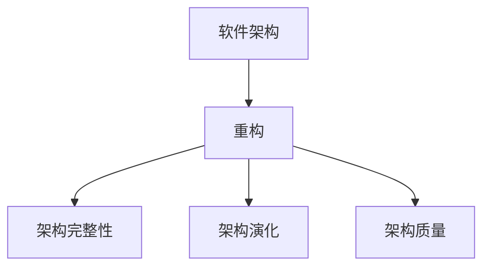
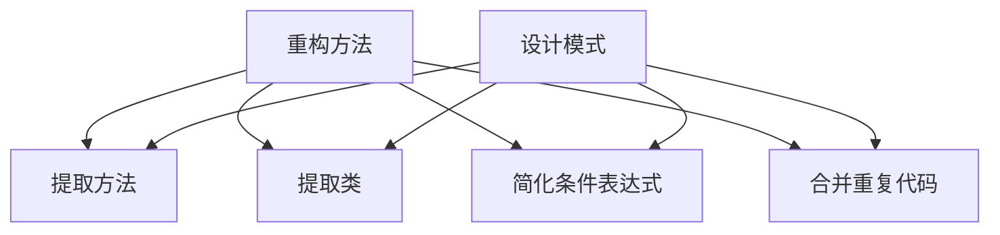
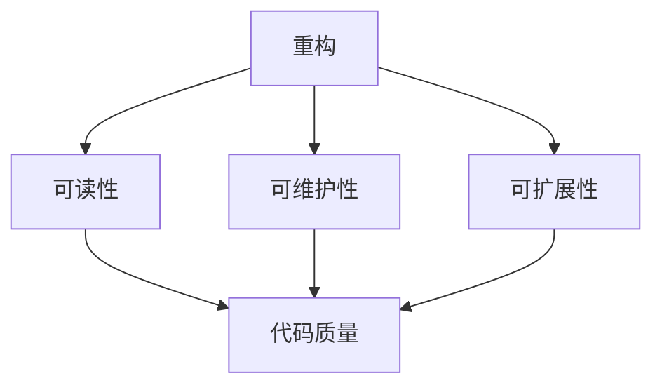
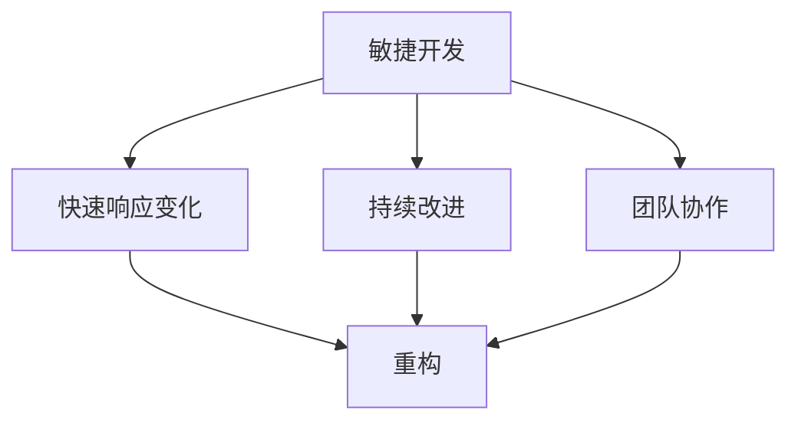
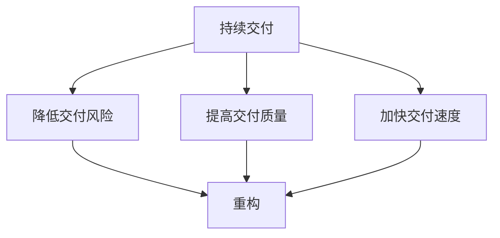
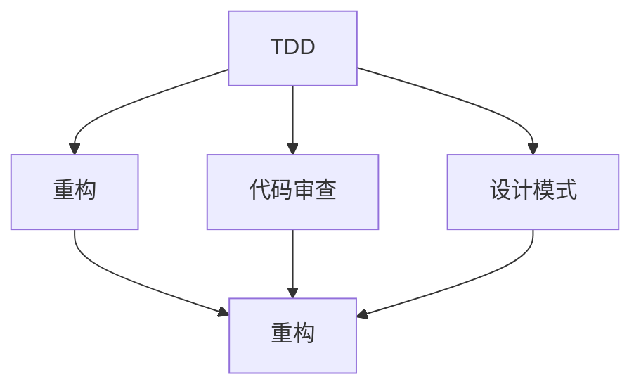

                 

# 重构不是除恶务尽

## 关键词
重构、软件开发、代码质量、效率、策略、挑战

## 摘要
本文探讨了重构在软件开发中的真正意义。重构不仅仅是一种技术手段，更是一种思维方式的转变。它不是单纯的代码优化或缺陷修复，而是为了提升代码的可持续性和可维护性。本文将详细分析重构的基本概念、原则和应用，探讨重构在实际开发中的策略与平衡，以及可能带来的影响和挑战。通过实际案例研究，本文旨在帮助读者理解重构的核心价值，并指导如何在实际项目中有效应用重构。

## 引言：重构的真正意义

### 1.1 重构的定义与背景

重构（Refactoring）是软件开发中的一项核心活动，旨在在不改变外部行为的前提下，改进软件的内部结构。这个概念最早由著名的软件开发大师 [Kent Beck](https://en.wikipedia.org/wiki/Kent_Beck) 提出，并在他的著作《重构：改善既有代码的设计》（Refactoring: Improving the Design of Existing Code）中得到广泛应用。

重构的定义可以概括为：通过一系列微小的、可逆的改动，逐步改善代码的结构，提高其可读性和可维护性。这些改动不会影响程序的功能，但会使代码更简洁、更直观。

重构的背景源于软件开发过程中常见的几个问题：

1. **代码债务**：在快速迭代和交付压力下，开发团队可能会优先考虑功能的实现，而忽视代码的整洁度。这种做法类似于“欠债”，随着时间的积累，会导致代码质量下降，维护成本增加。
2. **维护难度**：随着时间的推移，代码库会变得越来越复杂，维护难度也随之增加。重构有助于简化代码结构，降低维护难度。
3. **开发效率**：良好的代码结构可以提高开发效率。重构可以使代码更加模块化、灵活，有助于新功能的添加和旧功能的修改。

### 1.2 重构的重要性

重构的重要性在于它能够带来以下几个方面的收益：

1. **提升代码质量**：重构可以帮助消除代码中的冗余、重复和复杂性，使代码更加简洁、直观。
2. **提高开发效率**：重构后的代码更易于理解和修改，可以减少错误发生的概率，提高开发效率。
3. **降低维护成本**：重构可以简化代码结构，降低未来的维护成本。
4. **增强代码的可读性**：重构后的代码更加清晰，有助于团队成员之间的沟通和理解。
5. **促进团队协作**：重构需要团队成员共同参与，有助于提升团队的合作精神和协作效率。

### 1.3 重构的历史与发展

重构的概念最早可以追溯到 20 世纪 70 年代的软件工程领域。当时，软件工程的研究主要集中在如何设计高效的软件系统。随着软件系统的规模和复杂性不断增加，如何维护这些系统的可读性和可维护性成为一个重要课题。

1980 年代，面向对象编程方法逐渐流行，特别是在 Smalltalk 社区中，重构作为一种核心的开发实践被广泛采用。Kent Beck 在 1990 年代将重构的概念引入到 Java 社区，并在其著作中系统地阐述了重构的方法和原则。

随着时间的推移，重构已经成为软件开发中的一个重要环节，不仅在传统的软件开发中使用，还在敏捷开发、持续集成和持续交付等现代开发实践中得到了广泛应用。

### 1.4 重构的基本概念和原则

重构的基本概念包括以下几个方面：

1. **内部结构**：重构主要关注代码的内部结构，而不是外部行为。这意味着重构不会改变程序的功能，但会改进其内部实现。
2. **可逆性**：重构操作应该是可逆的，即可以通过反向操作还原到原始状态。这有助于降低重构的风险。
3. **逐步改进**：重构通常不是一次性完成的，而是通过一系列微小的改动逐步进行。这种方法称为“增量重构”，有助于减少重构带来的风险。

重构的基本原则包括以下几个方面：

1. **保持代码结构清晰**：重构的目的是使代码结构更加清晰，易于理解和维护。这包括消除冗余、简化复杂逻辑和改进代码的可读性。
2. **逐步重构**：重构不是一蹴而就的，而是一个持续的过程。逐步重构有助于避免一次性重构带来的风险。
3. **重构与设计模式**：重构与设计模式密切相关。设计模式提供了一系列可重用的解决方案，有助于重构过程中代码结构的优化。

### 1.5 重构的方法和工具

重构的方法和工具是实现重构的关键。以下是几种常用的重构方法和工具：

1. **代码审查**：代码审查是重构的重要手段之一。通过审查代码，可以发现潜在的问题，并设计出合适的重构方案。
2. **自动化重构工具**：自动化重构工具可以帮助开发者快速识别和修复代码中的问题。例如，Eclipse、IntelliJ IDEA 等集成开发环境（IDE）都内置了丰富的重构工具。
3. **重构技巧**：重构技巧是开发者需要掌握的技能。例如，提取方法、提取类、简化条件表达式等，都是常用的重构技巧。

### 1.6 重构的应用场景

重构适用于各种软件项目，但在以下场景中尤为重要：

1. **遗留系统**：遗留系统通常积累了大量的代码债务，重构可以帮助提高其可维护性和可持续性。
2. **大型项目**：大型项目代码复杂度高，重构有助于简化代码结构，降低维护难度。
3. **敏捷开发**：敏捷开发强调快速迭代和持续改进，重构是一种实现持续改进的有效方法。

### 1.7 重构的常见误解

重构并非一无是处，但也有一些常见的误解：

1. **重构等于优化**：重构的目的是改善代码结构，而非性能优化。优化通常涉及到更复杂的技术和策略。
2. **重构会导致风险**：重构确实存在一定的风险，但通过合理的规划和控制，可以降低风险。
3. **重构需要大量时间**：重构是一个逐步进行的过程，不需要一次性完成。逐步重构有助于避免过度投入和时间浪费。

### 1.8 重构的收益与风险

重构的收益包括提高代码质量、开发效率和降低维护成本等，但同时也存在一定的风险：

1. **开发中断**：重构可能会影响项目的开发进度，导致短期内的工作量增加。
2. **性能下降**：某些重构操作可能会引入性能问题，特别是在高负载场景下。
3. **团队协作**：重构需要团队成员的协作，如果团队成员不熟悉重构技巧，可能会导致重构效果不佳。

### 1.9 重构的实践步骤

为了成功实施重构，可以遵循以下步骤：

1. **评估代码质量**：通过代码审查和自动化工具评估代码质量，确定需要重构的部分。
2. **设计重构方案**：根据评估结果，设计合适的重构方案，包括重构的方法、步骤和预期效果。
3. **逐步重构**：按照重构方案逐步进行重构，确保每次重构都是可逆的，并在完成后进行测试验证。
4. **代码审查**：在重构过程中和完成后，进行代码审查，确保重构效果符合预期，并解决可能出现的问题。
5. **持续改进**：重构是一个持续的过程，需要定期评估代码质量，并设计新的重构方案。

### 1.10 重构的最佳实践

以下是一些重构的最佳实践，有助于提高重构的效果：

1. **小步快跑**：逐步进行重构，避免一次性重构带来的风险。
2. **自动化工具**：充分利用自动化重构工具，提高重构效率。
3. **代码审查**：定期进行代码审查，确保重构质量。
4. **团队协作**：鼓励团队成员参与重构，提高重构效果。
5. **文档记录**：记录重构过程和结果，便于后续参考和回顾。

### 1.11 重构的常见问题

在实施重构过程中，可能会遇到以下问题：

1. **重构时机**：何时进行重构是开发者面临的一个重要问题。通常建议在代码有明确问题时进行重构，或在项目迭代结束时进行重构。
2. **重构策略**：如何选择合适的重构策略是一个挑战。开发者需要根据项目的实际情况和团队的能力来制定重构策略。
3. **重构风险**：重构存在一定的风险，如开发中断、性能下降等。开发者需要评估风险，并制定相应的应对策略。

### 1.12 重构的未来发展趋势

随着软件系统规模和复杂性的增加，重构在未来将继续发挥重要作用。以下是一些可能的发展趋势：

1. **自动化水平提高**：自动化重构工具将越来越智能，能够自动识别和修复代码中的问题。
2. **持续重构**：持续重构将成为一种标准实践，贯穿整个软件开发过程。
3. **跨平台重构**：随着跨平台开发的普及，重构工具将支持更多平台和编程语言。
4. **社区合作**：重构技术将在开源社区中得到更广泛的应用和推广。

### 1.13 重构的核心价值

重构的核心价值在于其能够提高代码的可持续性和可维护性。通过重构，开发者可以消除代码中的隐患，提高代码质量，降低维护成本，从而实现长期的技术积累和持续改进。

### 1.14 重构与敏捷开发

重构与敏捷开发密切相关。敏捷开发强调快速迭代和持续改进，而重构是实现持续改进的有效手段。通过重构，开发团队能够在不断变化的需求下保持代码的整洁和高效。

### 1.15 重构与持续交付

持续交付强调快速、可靠地交付软件产品。重构是实现持续交付的重要保障。通过重构，开发团队能够确保代码库的健康和可持续性，降低交付风险。

### 1.16 重构与软件开发文化

重构不仅仅是技术层面的实践，更是一种软件开发文化。通过重构，开发团队能够培养良好的代码习惯和协作精神，提高团队的整体技术水平和竞争力。

### 1.17 重构与其他软件工程实践

重构与其他软件工程实践，如代码审查、测试驱动开发（TDD）和设计模式等密切相关。重构可以帮助实现这些实践的目标，提高软件开发的整体质量。

### 1.18 总结

重构是软件开发中的一个重要环节，它不仅仅是一种技术手段，更是一种思维方式的转变。通过重构，开发者可以提升代码质量、提高开发效率和降低维护成本。本文探讨了重构的基本概念、原则和应用，分析了重构在实际开发中的策略与平衡，以及可能带来的影响和挑战。通过实际案例研究，本文旨在帮助读者理解重构的核心价值，并指导如何在实际项目中有效应用重构。希望本文能够为您的软件开发之路提供有益的参考和启示。

## 重构的核心概念与联系

### 2.1.1 软件架构与重构

软件架构是软件开发过程中的核心概念，它定义了系统的整体结构和组件之间的关系。良好的软件架构有助于提高代码的可维护性和扩展性。重构在这个过程中起到了关键作用。

重构与软件架构之间的联系可以从以下几个方面来理解：

1. **保持架构完整性**：重构可以帮助消除架构中的不良设计，如紧耦合、过度复杂和冗余。通过重构，可以逐步优化软件架构，提高其完整性。
2. **支持架构演化**：软件架构通常需要随着时间的推移而演化。重构提供了实现架构演化的手段，使系统能够适应新的需求和变化。
3. **提升架构质量**：重构有助于消除架构中的隐患和问题，如性能瓶颈、安全漏洞和可扩展性不足。通过重构，可以提高软件架构的整体质量。

为了更好地理解重构与软件架构的关系，我们可以使用 Mermaid 流程图来展示它们之间的联系：

### 2.1.2 重构方法与设计模式

重构方法是一系列具体的技术手段，用于改进代码的内部结构。设计模式则是面向对象编程中用于解决常见设计问题的解决方案。两者在重构过程中密切相关。

1. **重构方法**：重构方法包括提取方法、提取类、简化条件表达式、合并重复代码等。这些方法可以帮助开发者逐步改善代码的结构。
2. **设计模式**：设计模式提供了一系列可重用的解决方案，有助于解决代码中的复杂性和重复问题。例如，工厂模式、单例模式和观察者模式等。
3. **联系**：重构方法通常基于设计模式来实现。例如，在重构过程中，可以使用工厂模式来简化对象的创建过程，或者使用单例模式来确保类实例的唯一性。

为了展示重构方法与设计模式之间的联系，我们可以使用 Mermaid 流程图：

通过这个流程图，我们可以清楚地看到重构方法与设计模式之间的互动关系。设计模式为重构提供了具体的解决方案，而重构方法则将这些解决方案应用到实际的代码中。

### 2.1.3 代码质量与重构

代码质量是软件开发中的一个关键指标，它直接影响到软件的可维护性、可靠性和可扩展性。重构在提升代码质量方面起到了至关重要的作用。

1. **可读性**：重构可以消除代码中的冗余和复杂性，使代码更加简洁、直观，易于阅读和理解。
2. **可维护性**：重构有助于消除代码中的隐患和问题，如未处理的异常、未注释的代码和重复代码等，从而提高代码的可维护性。
3. **可扩展性**：通过重构，可以优化代码的结构，提高其灵活性，使其能够更容易地适应未来的需求变化。

为了展示重构与代码质量之间的联系，我们可以使用 Mermaid 流程图：

通过这个流程图，我们可以清楚地看到重构如何通过提升代码的可读性、可维护性和可扩展性来提高代码质量。

### 2.1.4 重构与敏捷开发

敏捷开发是一种强调快速迭代和持续改进的软件开发方法。重构在敏捷开发中起到了关键作用，它能够帮助开发团队在持续变化的需求下保持代码的健康和高效。

1. **快速响应变化**：敏捷开发强调快速响应客户需求。重构提供了实现这一目标的手段，通过持续重构，开发团队能够及时调整代码结构，适应新的需求。
2. **持续改进**：敏捷开发强调持续改进，重构是实现这一目标的重要方式。通过定期重构，开发团队能够持续提升代码质量，提高开发效率。
3. **团队协作**：敏捷开发强调团队协作。重构需要团队成员共同参与，有助于提高团队的协作精神和合作效率。

为了展示重构与敏捷开发之间的联系，我们可以使用 Mermaid 流程图：

通过这个流程图，我们可以清楚地看到重构如何在敏捷开发中发挥重要作用，以及它与敏捷开发各个要素之间的互动关系。

### 2.1.5 重构与持续交付

持续交付是一种强调快速、可靠地交付软件产品的软件开发方法。重构是实现持续交付的关键因素之一。

1. **降低交付风险**：重构有助于消除代码中的隐患和问题，如未处理的异常、未注释的代码和重复代码等，从而降低交付风险。
2. **提高交付质量**：重构可以提升代码的质量，使其更加整洁、直观和可靠。这有助于提高交付产品的质量。
3. **加快交付速度**：重构后的代码更易于理解和修改，可以减少错误发生的概率，提高开发效率，从而加快交付速度。

为了展示重构与持续交付之间的联系，我们可以使用 Mermaid 流程图：

通过这个流程图，我们可以清楚地看到重构如何在持续交付中发挥关键作用，以及它与持续交付各个要素之间的互动关系。

### 2.1.6 重构与其他软件工程实践

重构与其他软件工程实践，如测试驱动开发（TDD）、代码审查和设计模式等密切相关。

1. **测试驱动开发（TDD）**：TDD 是一种敏捷开发方法，它强调先编写测试，然后编写满足测试的代码。重构与 TDD 相互促进，重构有助于保持测试代码的质量和效率，而 TDD 又可以指导重构的方向。
2. **代码审查**：代码审查是一种集体审查代码质量的方法。重构与代码审查密切相关，通过代码审查可以发现代码中的问题，重构则提供了改进这些问题的手段。
3. **设计模式**：设计模式是面向对象编程中用于解决常见设计问题的解决方案。重构与设计模式相互促进，重构可以帮助应用设计模式，而设计模式又可以指导重构的方向。

为了展示重构与其他软件工程实践之间的联系，我们可以使用 Mermaid 流程图：

通过这个流程图，我们可以清楚地看到重构与其他软件工程实践之间的互动关系。

### 2.1.7 重构的核心概念总结

通过上述分析，我们可以总结出重构的核心概念及其相互关系：

- **重构**：一种改善代码内部结构的技术手段，通过一系列微小的、可逆的改动，逐步提升代码的质量和可维护性。
- **软件架构**：系统的整体结构和组件之间的关系，重构有助于保持架构完整性、支持架构演化并提升架构质量。
- **设计模式**：面向对象编程中用于解决常见设计问题的解决方案，重构与设计模式相互促进。
- **代码质量**：代码的可读性、可维护性和可扩展性的综合体现，重构是提升代码质量的重要手段。
- **敏捷开发**：一种强调快速迭代和持续改进的软件开发方法，重构是敏捷开发中实现持续改进的关键因素。
- **持续交付**：一种强调快速、可靠地交付软件产品的软件开发方法，重构是实现持续交付的关键因素之一。

这些概念相互联系，共同构成了重构的核心框架。通过理解这些概念及其相互关系，开发者可以更好地掌握重构的精髓，并将其应用到实际的软件开发过程中。

## 重构的基本概念和原则

### 3.1.1 重构的基本概念

重构是一种通过逐步改进代码的内部结构，而不改变其外部行为的技术手段。它是一种持续改进代码质量的方法，旨在消除代码中的冗余、重复和复杂性，提高代码的可读性、可维护性和可扩展性。

重构的基本概念包括以下几点：

1. **内部结构**：重构主要关注代码的内部结构，而非外部行为。这意味着重构操作不会影响程序的功能，但会改进其内部实现。
2. **可逆性**：重构操作应该是可逆的，即可以通过反向操作还原到原始状态。这有助于降低重构的风险。
3. **逐步改进**：重构不是一蹴而就的，而是一个逐步进行的过程。逐步重构有助于避免一次性重构带来的风险。
4. **设计模式**：重构与设计模式密切相关。设计模式提供了一系列可重用的解决方案，有助于重构过程中代码结构的优化。

### 3.1.2 重构的基本原则

重构的基本原则是确保重构操作的有效性和安全性。以下是重构过程中应遵循的一些基本原则：

1. **保持代码结构清晰**：重构的首要目标是使代码结构更加清晰，易于理解和维护。这包括消除冗余、简化复杂逻辑和改进代码的可读性。
2. **逐步重构**：重构应是一个逐步进行的过程，避免一次性重构带来的风险。逐步重构有助于降低重构的复杂度，提高重构的成功率。
3. **重构与设计模式**：重构应与设计模式相结合，利用设计模式来优化代码结构。设计模式可以提供重构的具体解决方案，使重构过程更加高效。
4. **自动化工具**：充分利用自动化重构工具，提高重构效率。自动化工具可以帮助识别和修复代码中的问题，降低人工错误的风险。
5. **代码审查**：重构过程中应进行代码审查，确保重构效果符合预期。代码审查可以发现问题，并提出改进建议，提高重构的质量。
6. **可逆性**：重构操作应该是可逆的，确保在重构失败时可以恢复到原始状态。这有助于降低重构的风险，提高重构的可靠性。
7. **文档记录**：记录重构过程和结果，便于后续参考和回顾。文档记录可以提供重构的历史记录，帮助团队成员理解和应用重构。

### 3.1.3 如何识别需要重构的代码

识别需要重构的代码是重构过程的重要一步。以下是一些常见的情况，表明代码可能需要重构：

1. **冗余代码**：代码中存在重复的代码块或逻辑，可以通过提取方法或合并重复代码来重构。
2. **过度复杂**：代码结构复杂，难以理解和维护，可以通过简化条件表达式、分解复杂逻辑来重构。
3. **不清晰的命名**：变量、函数和类的命名不够清晰，难以理解代码的功能和作用，可以通过重命名来重构。
4. **过度耦合**：模块之间的依赖关系过于紧密，不利于代码的独立开发和维护，可以通过解耦合来重构。
5. **缺乏注释**：代码缺乏必要的注释，难以理解代码的意图和实现细节，可以通过添加注释来重构。
6. **未处理的异常**：代码中存在未处理的异常，可能导致系统崩溃或不可预期的行为，可以通过异常处理来重构。
7. **未优化的性能**：代码中存在性能瓶颈，如大量的循环、递归或重复计算，可以通过优化算法或数据结构来重构。

通过识别这些情况，开发者可以确定哪些代码需要重构，从而提高代码的质量和可维护性。

### 3.1.4 重构的方法和技巧

重构的方法和技巧是实现重构的关键。以下是一些常用的重构方法和技巧：

1. **提取方法**：将重复的代码块提取为独立的方法，使代码更加模块化和清晰。
2. **合并重复代码**：将重复的代码块合并为单个代码块，消除冗余，提高代码的可读性。
3. **简化条件表达式**：通过使用逻辑运算符、条件运算符和三元运算符等简化复杂的条件表达式。
4. **分解复杂逻辑**：将复杂的逻辑分解为多个简单的方法或模块，提高代码的可读性和可维护性。
5. **重命名**：重命名变量、函数和类，使其更具有描述性和一致性。
6. **解耦合**：减少模块之间的依赖关系，提高代码的独立性和可测试性。
7. **添加注释**：添加必要的注释，提高代码的可读性和可理解性。
8. **优化性能**：通过优化算法或数据结构来提高代码的性能。

这些方法和技巧可以帮助开发者逐步改善代码的结构，提高代码的质量和可维护性。

### 3.1.5 重构与设计模式

重构与设计模式密切相关。设计模式提供了一系列可重用的解决方案，有助于重构过程中代码结构的优化。以下是一些常用的设计模式，及其与重构的关联：

1. **工厂模式**：工厂模式是一种用于创建对象的通用方法。在重构过程中，可以使用工厂模式来简化对象的创建过程，消除冗余代码。
2. **单例模式**：单例模式确保一个类只有一个实例，并提供一个访问它的全局访问点。在重构过程中，可以使用单例模式来避免类实例的重复创建。
3. **观察者模式**：观察者模式是一种用于实现对象间通信的机制。在重构过程中，可以使用观察者模式来简化对象之间的依赖关系，提高代码的灵活性。
4. **策略模式**：策略模式是一种用于实现算法族和替换现有算法的通用方法。在重构过程中，可以使用策略模式来优化复杂的条件表达式和算法逻辑。
5. **适配器模式**：适配器模式是一种用于将一个类的接口转换成客户期望的另一个接口的通用方法。在重构过程中，可以使用适配器模式来兼容旧代码和新接口。

通过使用这些设计模式，开发者可以更有效地进行重构，提高代码的质量和可维护性。

### 3.1.6 重构的常见误区

尽管重构有助于改善代码质量，但开发者在使用过程中也容易陷入一些误区。以下是一些常见的重构误区：

1. **过度重构**：过度重构可能导致代码的复杂性增加，影响开发进度和性能。开发者应避免盲目地、频繁地重构。
2. **重构时机不当**：重构应在代码有明确问题时进行，或在项目迭代结束时进行。过早或过晚的重构都可能带来负面影响。
3. **忽视重构原则**：重构时应遵循重构原则，如保持代码结构清晰、逐步重构等。忽视这些原则可能导致重构效果不佳。
4. **依赖自动化工具过度**：虽然自动化工具有助于提高重构效率，但不应完全依赖工具。开发者仍需掌握重构的方法和技巧，确保重构效果。

通过避免这些误区，开发者可以更好地利用重构，提高代码质量。

### 3.1.7 重构的收益与挑战

重构的收益包括提升代码质量、提高开发效率和降低维护成本等，但同时也存在一定的挑战：

1. **收益**：
   - 提升代码质量：重构可以消除代码中的冗余、重复和复杂性，提高代码的可读性、可维护性和可扩展性。
   - 提高开发效率：重构后的代码更易于理解和修改，可以减少错误发生的概率，提高开发效率。
   - 降低维护成本：重构可以简化代码结构，降低未来的维护成本。
2. **挑战**：
   - 开发中断：重构可能会影响项目的开发进度，导致短期内的工作量增加。
   - 性能下降：某些重构操作可能会引入性能问题，特别是在高负载场景下。
   - 团队协作：重构需要团队成员的协作，如果团队成员不熟悉重构技巧，可能会导致重构效果不佳。

通过理解重构的收益与挑战，开发者可以更好地规划和实施重构，实现代码质量的持续提升。

## 重构在软件开发中的应用

### 4.1 重构在软件开发中的意义

重构在软件开发中具有重要意义，它不仅是代码优化的一种手段，更是一种提升软件可持续性和可维护性的关键实践。以下是重构在软件开发中的一些核心意义：

1. **提升代码质量**：重构通过消除代码中的冗余、重复和复杂性，使代码更加简洁、直观，易于理解和维护。高质量的代码是软件长期稳定运行的基础。
2. **提高开发效率**：重构后的代码结构更加清晰，有助于新功能的添加和旧功能的修改。开发者可以更快地编写和修改代码，减少错误和返工，从而提高整体开发效率。
3. **降低维护成本**：良好的代码结构使得软件的维护变得更加简单和高效。重构有助于减少未来的维护成本，使团队能够更专注于新功能的开发。
4. **增强代码的可读性**：重构后的代码更加整洁，命名规范，注释清晰，有助于团队成员之间的沟通和理解，降低知识传递的成本。
5. **支持持续迭代**：重构使得软件系统更加灵活，能够快速响应变化的需求。在敏捷开发模式中，重构是持续迭代的重要保障，有助于团队持续改进和优化产品。
6. **促进技术积累**：通过重构，开发团队能够逐步积累高质量的技术债务，提高整体技术水平。这有助于团队在面对复杂问题时能够更加从容应对。

### 4.2 重构的方法和工具

在软件开发过程中，实施重构需要一系列的方法和工具。以下是一些常用的重构方法和工具：

1. **代码审查**：代码审查是一种集体审查代码质量的方法。通过代码审查，团队成员可以共同识别代码中的问题，并设计出合适的重构方案。代码审查有助于提高代码的可读性和可维护性。

2. **自动化重构工具**：自动化重构工具可以帮助开发者快速识别和修复代码中的问题。例如，Eclipse、IntelliJ IDEA 等集成开发环境（IDE）都内置了丰富的重构工具，包括提取方法、提取类、简化条件表达式、合并重复代码等功能。

3. **重构模板**：重构模板是一种预定义的重构步骤和代码模式的集合。通过使用重构模板，开发者可以更快地实施重构，减少错误和返工。例如，一些流行的重构模板包括重构代码、重构变量、重构函数等。

4. **代码格式化工具**：代码格式化工具可以帮助开发者保持代码的一致性和整洁性。例如，Prettier、ESLint 等工具可以自动格式化代码，提高代码的可读性。

5. **版本控制系统**：版本控制系统如 Git 可以帮助开发者管理和跟踪代码的变更。通过使用版本控制系统，开发者可以方便地回滚到之前的版本，确保重构操作的可逆性和安全性。

### 4.3 重构的实际案例

为了更好地理解重构在软件开发中的应用，我们可以通过一些实际案例来展示重构的过程和效果。

#### 案例一：遗留系统的重构

背景：一个大型企业系统，经过多年的迭代和升级，代码库中积累了大量的代码债务和不良设计。系统的可维护性差，新功能的添加和旧功能的修改都变得非常困难。

重构方案：
1. **评估代码质量**：使用代码审查和自动化工具评估代码质量，确定需要重构的部分。
2. **设计重构方案**：根据评估结果，设计一个详细的重构方案，包括重构的方法、步骤和预期效果。
3. **逐步重构**：按照重构方案逐步进行重构，确保每次重构都是可逆的，并在完成后进行测试验证。
4. **代码审查**：在重构过程中和完成后，进行代码审查，确保重构效果符合预期，并解决可能出现的问题。
5. **持续改进**：重构是一个持续的过程，需要定期评估代码质量，并设计新的重构方案。

效果：
- 代码质量显著提升，冗余代码和不良设计得到消除。
- 可维护性大幅提高，新功能的添加和旧功能的修改变得轻松。
- 维护成本降低，系统的稳定性得到保障。

#### 案例二：敏捷开发中的重构

背景：一个敏捷开发团队，在持续迭代和交付过程中，发现代码库中存在一些性能瓶颈和代码结构问题，影响开发效率和产品质量。

重构方案：
1. **评估代码质量**：通过代码审查和自动化工具评估代码质量，确定需要重构的部分。
2. **设计重构方案**：根据评估结果，设计一个敏捷的重构方案，确保重构与迭代计划相匹配。
3. **逐步重构**：在迭代过程中逐步进行重构，每次重构都是小规模的，确保重构不会影响迭代进度。
4. **自动化测试**：使用自动化测试确保重构过程中不会引入新的bug。
5. **持续集成**：通过持续集成系统，确保重构后的代码能够顺利集成到代码库中。

效果：
- 性能瓶颈得到解决，系统响应速度大幅提升。
- 代码结构更加清晰，易于理解和维护。
- 开发效率提高，团队能够更快地交付高质量的产品。

#### 案例三：持续交付中的重构

背景：一个持续交付团队，在交付过程中发现代码库中存在一些潜在的安全漏洞和性能问题，影响交付质量和用户体验。

重构方案：
1. **评估代码质量**：通过代码审查、自动化工具和安全测试评估代码质量，确定需要重构的部分。
2. **设计重构方案**：根据评估结果，设计一个全面的重构方案，确保重构覆盖所有关键领域。
3. **逐步重构**：在持续交付的过程中逐步进行重构，确保重构不会影响交付进度。
4. **安全测试**：在重构完成后进行安全测试，确保代码库中没有新的安全漏洞。
5. **性能优化**：通过性能测试和优化，确保重构后的代码能够满足性能要求。

效果：
- 安全漏洞得到修复，系统安全性得到保障。
- 性能问题得到解决，用户体验得到显著提升。
- 交付质量提高，团队能够更稳定地交付高质量的产品。

通过这些实际案例，我们可以看到重构在软件开发中的应用效果。重构不仅有助于提升代码质量和开发效率，还能降低维护成本，提高系统的稳定性和可扩展性。在实际应用中，开发者需要根据项目的实际情况和团队的能力，选择合适的重构方法和工具，确保重构能够达到预期的效果。

### 4.4 重构在不同软件开发模式中的应用

重构不仅适用于传统的软件开发模式，还在敏捷开发、持续集成和持续交付等现代开发模式中发挥着重要作用。以下是重构在这些软件开发模式中的应用：

#### 敏捷开发

敏捷开发强调快速迭代和持续改进，重构是敏捷开发中实现持续改进的重要手段。在敏捷开发中，重构通常在以下几个阶段进行：

1. **迭代规划**：在每次迭代规划时，团队会评估当前代码库的质量，确定需要重构的部分，并将其纳入迭代计划中。
2. **迭代执行**：在迭代执行过程中，团队会逐步进行重构，确保重构不会影响迭代进度。每次重构都是小规模的，有助于控制风险。
3. **迭代回顾**：在每次迭代回顾时，团队会评估重构的效果，讨论遇到的问题和挑战，并制定下一轮重构的计划。

敏捷开发中的重构优势在于其灵活性，团队能够根据项目的实际情况和需求，随时调整重构的策略和计划，确保代码库始终保持高质量。

#### 持续集成

持续集成是一种通过自动化构建和测试确保代码库质量的方法。重构在持续集成中发挥着重要作用，主要体现在以下几个方面：

1. **自动化重构**：使用自动化重构工具，在每次代码提交时自动进行重构。这有助于确保每次提交的代码都是高质量的，减少手动重构的工作量。
2. **集成测试**：重构后，使用自动化测试对重构的代码进行集成测试，确保重构没有引入新的bug。
3. **持续优化**：通过持续集成系统，团队可以不断优化重构过程，提高重构的效率和效果。

持续集成中的重构优势在于其自动化和连续性，团队能够确保每次提交的代码都是经过重构和测试的，从而提高代码库的整体质量。

#### 持续交付

持续交付是一种通过自动化测试和部署确保软件产品快速、可靠地交付的方法。重构在持续交付中发挥着重要作用，主要体现在以下几个方面：

1. **自动化重构**：使用自动化重构工具，在每次代码提交时自动进行重构，确保代码库的整洁和高效。
2. **交付验证**：在每次交付前，使用自动化测试和性能测试对重构后的代码进行验证，确保交付的软件产品是高质量的。
3. **持续优化**：通过持续交付系统，团队可以不断优化重构和交付过程，提高整体交付效率。

持续交付中的重构优势在于其自动化和高效性，团队能够确保每次交付的软件产品都是经过严格重构和测试的，从而降低交付风险。

### 4.5 重构的最佳实践

为了确保重构的效果和效率，开发者应遵循以下重构的最佳实践：

1. **小步快跑**：逐步进行重构，避免一次性重构带来的风险。每次重构都是小规模的，确保可以快速完成并验证。
2. **代码审查**：在重构过程中和完成后进行代码审查，确保重构效果符合预期，并解决可能出现的问题。
3. **文档记录**：记录重构过程和结果，便于后续参考和回顾。文档记录可以提供重构的历史记录，帮助团队成员理解和应用重构。
4. **自动化工具**：充分利用自动化重构工具，提高重构效率。自动化工具可以帮助识别和修复代码中的问题，降低人工错误的风险。
5. **持续评估**：定期评估代码质量，根据评估结果设计新的重构方案。持续评估有助于保持代码库的高质量。
6. **团队协作**：鼓励团队成员参与重构，提高重构效果。团队协作有助于提高重构的效率和质量。
7. **重构培训**：为团队成员提供重构培训，确保他们掌握重构的方法和技巧。培训有助于提高团队的重构能力。

通过遵循这些最佳实践，开发者可以确保重构过程顺利实施，提高代码质量和开发效率。

### 4.6 重构的常见问题和挑战

尽管重构在软件开发中具有重要作用，但在实际应用过程中也会遇到一些常见问题和挑战。以下是重构过程中可能遇到的一些问题及其解决方案：

1. **开发中断**：重构可能会影响项目的开发进度，导致短期内的工作量增加。解决方案是逐步进行重构，避免一次性重构带来的压力。
2. **性能下降**：某些重构操作可能会引入性能问题，特别是在高负载场景下。解决方案是进行性能测试和优化，确保重构后的代码满足性能要求。
3. **团队协作**：重构需要团队成员的协作，如果团队成员不熟悉重构技巧，可能会导致重构效果不佳。解决方案是提供重构培训，确保团队成员掌握重构的方法和技巧。
4. **重构时机不当**：重构应在代码有明确问题时进行，或在项目迭代结束时进行。过早或过晚的重构都可能带来负面影响。解决方案是制定合理的重构计划，确保重构与项目进度相匹配。
5. **代码复杂性增加**：在重构过程中，如果操作不当，可能会导致代码复杂性增加。解决方案是遵循重构原则，保持代码结构清晰，逐步进行重构。

通过解决这些常见问题和挑战，开发者可以更好地实施重构，提高代码质量和开发效率。

### 4.7 重构的未来发展趋势

随着软件系统规模和复杂性的不断增加，重构在未来将继续发挥重要作用。以下是重构的一些未来发展趋势：

1. **自动化水平提高**：自动化重构工具将越来越智能，能够自动识别和修复代码中的问题。这将大大提高重构的效率和质量。
2. **智能重构**：结合人工智能技术，重构工具将能够基于历史数据和代码模式，自动推荐最佳的重构方案，降低人工干预的风险。
3. **持续重构**：持续重构将成为一种标准实践，贯穿整个软件开发过程。持续重构有助于保持代码库的高质量，提高系统的可持续性和可维护性。
4. **跨平台重构**：随着跨平台开发的普及，重构工具将支持更多平台和编程语言，提供统一的重构解决方案。
5. **社区合作**：重构技术将在开源社区中得到更广泛的应用和推广。社区合作有助于推动重构技术的发展和创新。

通过这些未来发展趋势，开发者可以更好地适应软件开发的需求，持续提升代码质量和开发效率。

### 4.8 总结

重构在软件开发中具有重要意义，它不仅有助于提升代码质量、提高开发效率和降低维护成本，还能增强代码的可读性和可维护性。通过重构，开发者可以逐步改善代码的内部结构，使其更加简洁、直观和高效。在实际应用中，开发者需要遵循重构的基本概念和原则，选择合适的方法和工具，确保重构过程顺利进行。通过持续重构和最佳实践，开发者可以不断提升代码质量和开发效率，为软件系统的可持续发展奠定坚实基础。

## 重构的策略与平衡

### 5.1 重构策略的重要性

重构的策略与平衡是软件开发过程中不可忽视的关键环节。重构不仅是一种技术手段，更是一种软件开发文化，它需要开发者在实践中不断摸索和调整。有效的重构策略可以显著提升代码质量、开发效率和项目可持续性，但不当的重构策略可能会导致开发中断、性能下降和团队协作困难。因此，理解和应用合理的重构策略至关重要。

### 5.2 何时重构

确定何时进行重构是重构策略的核心。以下是一些常见的情况，表明代码可能需要重构：

1. **代码质量评估**：通过代码审查和自动化工具评估代码质量，识别出潜在的问题，如冗余代码、过度复杂性和低效算法等。如果代码质量较差，需要进行重构。
2. **功能迭代**：在每次功能迭代结束时，对代码库进行评估，确定哪些部分需要重构，以适应新的功能和需求。
3. **性能瓶颈**：如果系统出现性能瓶颈，例如响应时间过长、内存占用过高，可以通过重构优化代码结构和算法，提升系统性能。
4. **团队协作**：如果团队在理解和修改代码时遇到困难，可以通过重构简化代码结构，提高代码的可读性和可维护性，从而提升团队协作效率。
5. **代码债务**：在项目开发过程中，代码债务（技术债务）会逐渐积累。适时的重构可以帮助消除这些债务，提高代码质量。

### 5.3 重构优先级

在确定重构时机后，接下来需要考虑的是重构的优先级。以下是一些影响重构优先级的因素：

1. **风险**：重构带来的风险应作为主要考虑因素。高风险的重构操作应优先进行，以确保系统稳定性和安全性。
2. **影响范围**：重构的影响范围也需要考虑。局部重构相对于全局重构更容易实施和控制，因此应优先考虑局部重构。
3. **价值**：重构所带来的价值也应纳入考虑。高价值重构操作，如性能优化和关键功能重构，应优先进行。
4. **团队能力**：团队对重构的熟悉程度和重构技能也应考虑。如果团队对某些重构方法不熟悉，应优先培训团队成员，或选择简单的重构操作。

### 5.4 如何平衡重构与开发进度

在软件开发过程中，重构与开发进度之间需要保持平衡。以下是一些策略和技巧，帮助开发者实现这一平衡：

1. **迭代式重构**：重构不应是一次性的操作，而应贯穿整个开发周期。在每次迭代结束时进行小规模的重构，逐步改进代码质量。
2. **阶段性重构**：将重构分为多个阶段，每个阶段专注于解决特定的问题。例如，在早期阶段，可以专注于消除代码债务和简化代码结构；在后期阶段，可以专注于性能优化和安全性改进。
3. **自动化工具**：充分利用自动化重构工具，提高重构效率。自动化工具可以帮助开发者快速识别和修复代码中的问题，减少手动重构的工作量。
4. **代码审查**：在重构过程中和完成后，进行代码审查，确保重构效果符合预期。代码审查可以及时发现和解决潜在的问题，提高重构质量。
5. **持续集成**：通过持续集成系统，确保重构后的代码能够顺利集成到代码库中。持续集成可以自动检测重构带来的潜在问题，如编译错误和集成失败。
6. **重构培训**：为团队成员提供重构培训，确保他们掌握重构的方法和技巧。培训有助于提高团队的重构能力，减少重构风险。
7. **重构风险管理**：制定重构风险管理计划，识别和评估重构过程中可能遇到的风险，并制定相应的应对策略。

### 5.5 非极致重构的优势与风险

非极致重构（也称为适度重构）是一种平衡重构与开发进度的方法，它强调在满足基本质量要求的前提下，适度进行重构。以下是非极致重构的优势和风险：

#### 优势

1. **可管理性**：非极致重构使重构过程更加可控和可管理。通过逐步进行小规模的重构，可以减少一次性重构带来的风险和压力。
2. **灵活性**：非极致重构允许团队根据实际情况灵活调整重构计划。这有助于团队快速响应变化的需求，保持项目进度的稳定性。
3. **提高开发效率**：适度重构可以确保团队在满足质量要求的前提下，保持开发进度。这有助于团队更好地平衡重构与开发进度，提高整体开发效率。
4. **减轻压力**：非极致重构减轻了团队成员的重构压力。团队成员可以逐步适应重构过程，减少因重构带来的心理负担。

#### 风险

1. **质量风险**：如果重构不当，可能会导致代码质量下降，甚至引入新的bug。非极致重构要求团队成员具备较高的重构技能和经验，以避免这些风险。
2. **进度风险**：尽管非极致重构旨在平衡重构与开发进度，但如果不合理控制重构范围和时间，仍可能导致开发进度延误。
3. **团队协作风险**：非极致重构需要团队成员之间的紧密协作。如果团队协作不畅，可能会导致重构效果不佳，甚至影响整体项目进度。

### 5.6 重构团队协作

重构不仅仅是个体的行为，更是一种团队协作的过程。有效的重构团队协作有助于提高重构质量和效率。以下是一些团队协作的策略：

1. **代码审查**：定期进行代码审查，确保重构效果符合预期。代码审查可以及时发现和解决潜在问题，提高重构质量。
2. **知识共享**：鼓励团队成员分享重构经验和技巧，提高整体重构能力。知识共享有助于团队更好地理解和应用重构方法。
3. **重构会议**：定期召开重构会议，讨论重构进展、问题和挑战。重构会议可以帮助团队协调资源、明确目标和分工。
4. **重构导师制度**：为新手提供重构导师，帮助他们快速掌握重构技能。导师可以提供指导和反馈，帮助新手更好地融入重构团队。
5. **重构日志**：记录重构过程和结果，便于后续参考和回顾。重构日志可以帮助团队总结经验，提高重构效率。

通过这些团队协作策略，重构团队可以更好地实现协同工作，提高重构质量和效率。

### 5.7 重构实践总结

重构的策略与平衡是软件开发过程中的关键环节。通过合理的重构策略和团队协作，开发者可以逐步改善代码质量，提高开发效率和项目可持续性。以下是一些重构实践的总结：

1. **迭代式重构**：逐步进行小规模的重构，避免一次性重构带来的风险。
2. **阶段性重构**：分阶段进行重构，根据项目的实际情况和需求，逐步解决不同类型的问题。
3. **自动化工具**：充分利用自动化重构工具，提高重构效率。
4. **代码审查**：定期进行代码审查，确保重构效果符合预期。
5. **持续集成**：通过持续集成系统，确保重构后的代码能够顺利集成。
6. **重构培训**：为团队成员提供重构培训，提高整体重构能力。
7. **重构风险管理**：制定风险管理计划，识别和评估重构过程中的风险。
8. **团队协作**：通过代码审查、知识共享和重构会议等策略，加强团队协作。

通过遵循这些实践总结，开发者可以更好地实施重构，提高代码质量和开发效率，为软件项目的成功奠定坚实基础。

## 重构的影响与挑战

### 6.1 重构的影响

重构作为一种提升代码质量和开发效率的关键实践，其影响是多方面的，主要包括以下几个方面：

1. **代码质量**：重构的主要目标之一是提升代码质量。通过消除冗余代码、简化复杂逻辑和改善命名规范，重构使代码更加简洁、直观，易于理解和维护。高质量的代码不仅提高了系统的稳定性，还降低了维护成本。

2. **开发效率**：重构后的代码结构更加清晰，有助于提高开发效率。开发者可以更快地编写和修改代码，减少错误和返工。此外，重构有助于发现和修复潜在的性能瓶颈，从而提高系统的整体性能。

3. **团队协作**：重构需要团队成员的密切合作。通过重构，团队成员可以更好地理解代码库，提高代码的可读性和可维护性。这有助于增强团队之间的沟通和协作，提高整体开发效率。

4. **项目进度**：适度的重构可以在不影响项目进度的前提下，逐步提升代码质量。通过迭代式重构，项目团队可以持续优化代码库，避免因代码质量下降而导致的进度延误。

5. **项目稳定性**：重构有助于消除代码中的潜在隐患，如未处理的异常、未注释的代码和冗余逻辑等。这提高了系统的稳定性，减少了意外崩溃和错误的概率。

6. **代码可读性**：重构后的代码命名规范、结构清晰，有助于提高代码的可读性。这有助于新成员快速上手项目，降低知识传递的成本。

### 6.2 重构的挑战

尽管重构带来了许多积极的影响，但在实施过程中也面临着一系列挑战：

1. **开发中断**：重构可能会影响项目的开发进度，特别是在进行大规模重构时。这可能导致开发人员的工作中断，影响项目的交付时间。

2. **性能下降**：某些重构操作，如数据结构的改变和算法的优化，可能会引入性能问题。在重构过程中，需要仔细评估和优化代码性能，以确保系统在高负载场景下仍能保持良好的性能。

3. **团队协作**：重构需要团队成员之间的紧密协作。如果团队成员不熟悉重构技巧，可能会导致重构效果不佳，甚至影响整体项目进度。

4. **重构时机**：重构应在合适的时机进行，如代码质量评估后或功能迭代结束时。如果重构时机不当，可能会导致不必要的开发中断或进度延误。

5. **重构风险**：重构过程中可能会引入新的bug或性能问题。为了降低风险，需要制定详细的重构计划，并进行严格的代码审查和测试。

6. **代码复杂性**：在重构过程中，如果操作不当，可能会导致代码复杂性增加。这会影响代码的可读性和可维护性，反而降低重构的效果。

### 6.3 如何应对重构的挑战

为了有效地应对重构的挑战，项目团队可以采取以下策略：

1. **逐步重构**：避免一次性重构，采取逐步重构的方法。每次重构都是小规模的，可以减少开发中断的风险。

2. **代码审查**：在重构过程中和完成后，进行严格的代码审查。代码审查有助于发现和修复潜在的问题，确保重构效果符合预期。

3. **自动化测试**：通过自动化测试确保重构后的代码质量。自动化测试可以快速验证代码的稳定性和性能。

4. **重构培训**：为团队成员提供重构培训，确保他们掌握重构的方法和技巧。培训有助于提高团队的重构能力，降低风险。

5. **重构工具**：充分利用自动化重构工具，提高重构效率。自动化工具可以帮助识别和修复代码中的问题，减少手动重构的工作量。

6. **重构风险管理**：制定重构风险管理计划，识别和评估重构过程中的风险，并制定相应的应对策略。

7. **重构日志**：记录重构过程和结果，便于后续参考和回顾。重构日志可以帮助团队总结经验，提高重构效率。

通过采取这些策略，项目团队可以更好地应对重构的挑战，确保重构过程顺利进行，实现代码质量的持续提升。

## 重构案例研究

### 7.1 案例研究一：项目重构全过程

#### 项目背景

这是一个由一家互联网公司开发的在线购物平台，该平台已经运行了数年，随着用户数量的增加和业务需求的不断变化，代码库变得越来越复杂，维护成本显著增加。团队成员反映代码质量下降，开发效率低下，重构成为解决这一问题的关键。

#### 重构方案设计

1. **评估代码质量**：首先，团队使用代码审查工具和自动化工具评估当前代码库的质量。发现代码中存在大量的冗余代码、未优化的算法和低效的数据结构。

2. **确定重构目标**：根据评估结果，团队确定了以下重构目标：
   - 消除冗余代码和重复逻辑。
   - 优化数据结构和算法，提高系统性能。
   - 改善代码的可读性和可维护性。
   - 实现模块化设计，提高代码的复用性。

3. **制定重构计划**：团队制定了详细的重构计划，包括重构的方法、步骤和预期效果。重构计划分为以下几个阶段：
   - 阶段一：消除冗余代码和重复逻辑。
   - 阶段二：优化数据结构和算法。
   - 阶段三：改善代码的可读性和可维护性。
   - 阶段四：实现模块化设计。

#### 重构实施与效果评估

1. **阶段一：消除冗余代码和重复逻辑**
   - **方法**：使用自动化工具和代码审查工具识别冗余代码和重复逻辑。
   - **过程**：团队逐步替换冗余代码，使用设计模式如策略模式和工厂模式优化代码结构。
   - **效果**：代码库变得更加简洁，可读性大幅提升，维护成本降低。

2. **阶段二：优化数据结构和算法**
   - **方法**：对关键算法和数据进行优化，如使用哈希表代替数组、优化排序算法等。
   - **过程**：团队分析性能瓶颈，使用工具和测试评估优化效果。
   - **效果**：系统性能显著提升，响应时间缩短，用户体验得到改善。

3. **阶段三：改善代码的可读性和可维护性**
   - **方法**：重命名变量、函数和类，使其更具描述性；添加注释，提高代码的可读性。
   - **过程**：团队进行代码审查，确保重构后的代码符合命名规范和风格指南。
   - **效果**：代码结构更加清晰，团队成员可以更快地理解和修改代码。

4. **阶段四：实现模块化设计**
   - **方法**：将功能相似的部分分离为独立的模块，提高代码的复用性。
   - **过程**：团队重新设计模块接口，确保模块之间的耦合度降低。
   - **效果**：代码库的模块化程度提高，新功能的添加和旧功能的修改变得更加容易。

#### 重构总结

通过重构，团队成功地提高了代码质量和开发效率。重构后的代码库更加简洁、清晰和高效，维护成本显著降低。团队协作更加顺畅，开发效率得到显著提升。用户体验也得到改善，系统性能和稳定性得到提升。

### 7.2 案例研究二：企业级重构实践

#### 企业背景

这是一家全球知名的金融科技公司，其业务涵盖多个领域，如支付、借贷和投资等。随着业务的不断扩展，公司的代码库变得越来越庞大和复杂。为了确保系统的可持续性和可维护性，企业决定进行大规模的重构。

#### 重构策略与执行

1. **重构策略**
   - **全面评估**：企业首先对现有代码库进行全面评估，确定重构的重点和优先级。
   - **逐步重构**：企业采取逐步重构的策略，每次重构都是小规模的，确保重构不会影响业务的连续性。
   - **代码审查**：在每次重构后，进行严格的代码审查，确保重构效果符合预期。

2. **重构执行**
   - **阶段一：消除冗余代码和重复逻辑**：企业使用自动化工具和代码审查工具识别冗余代码和重复逻辑，并进行逐步替换。
   - **阶段二：优化数据结构和算法**：企业对关键算法和数据进行优化，如使用哈希表代替数组、优化排序算法等。
   - **阶段三：改善代码的可读性和可维护性**：企业重命名变量、函数和类，使其更具描述性；添加注释，提高代码的可读性。
   - **阶段四：实现模块化设计**：企业将功能相似的部分分离为独立的模块，提高代码的复用性。

#### 重构成果与反思

1. **重构成果**
   - 代码库变得更加简洁和高效，冗余代码和重复逻辑得到消除。
   - 系统性能显著提升，响应时间缩短，用户体验得到改善。
   - 代码结构更加清晰，维护成本降低，团队协作更加顺畅。
   - 新功能的添加和旧功能的修改变得更加容易，开发效率提高。

2. **重构反思**
   - **重构风险管理**：在重构过程中，企业制定了详细的重构风险管理计划，有效降低了重构风险。
   - **团队协作**：企业鼓励团队成员参与重构，提高了整体重构效率和质量。
   - **持续改进**：企业意识到重构是一个持续的过程，定期评估代码质量，并设计新的重构方案，确保系统始终处于最佳状态。

通过这个案例研究，我们可以看到企业级重构实践的全面性和系统性。企业通过合理的重构策略和执行，成功地提升了代码质量和系统性能，为未来的发展奠定了坚实基础。

## 结论：重构不是除恶务尽

### 6.1 重构的核心价值

重构作为软件开发中的一个核心活动，其核心价值在于其能够持续提升代码的质量、开发效率和系统的可维护性。以下是重构的核心价值：

1. **代码质量**：重构通过消除冗余、重复和复杂性，使代码更加简洁、直观和易于维护。这有助于减少错误发生的概率，提高系统的稳定性。
2. **开发效率**：重构后的代码结构更加清晰，有助于开发者更快地理解和修改代码。这可以显著提高开发效率，减少返工和调试时间。
3. **可维护性**：重构有助于降低未来的维护成本。通过改善代码结构，使代码更加模块化和可复用，维护工作变得更加简单和高效。
4. **团队协作**：重构需要团队成员之间的紧密协作。通过重构，团队成员可以更好地理解代码库，提高团队协作效率和沟通效果。
5. **持续改进**：重构是一种持续的过程。通过定期评估代码质量，并设计新的重构方案，开发团队能够持续改进代码库，提高系统的可持续性。

### 6.2 重构的目标

重构的目标不仅仅是为了消除代码中的问题，更是一种思维方式的转变。具体目标包括：

1. **提升代码的可读性和可维护性**：通过重构，使代码更加简洁、直观，易于理解和维护。
2. **优化代码结构和性能**：重构可以消除性能瓶颈，优化数据结构和算法，提高系统的响应速度和稳定性。
3. **增强代码的复用性**：通过模块化和设计模式的应用，提高代码的复用性，减少重复劳动。
4. **降低未来的维护成本**：通过重构，使代码库更加整洁和高效，降低未来的维护成本。

### 6.3 重构的未来

随着软件系统规模和复杂性的不断增加，重构在未来将继续发挥重要作用。以下是重构的一些未来发展趋势：

1. **自动化水平提高**：自动化重构工具将变得更加智能，能够自动识别和修复代码中的问题，降低手动干预的需求。
2. **智能重构**：结合人工智能技术，重构工具将能够基于历史数据和代码模式，自动推荐最佳的重构方案。
3. **持续重构**：持续重构将成为一种标准实践，贯穿整个软件开发过程，确保代码库始终保持高质量。
4. **跨平台重构**：重构工具将支持更多平台和编程语言，提供统一的重构解决方案。
5. **社区合作**：重构技术将在开源社区中得到更广泛的应用和推广，推动重构技术的发展和创新。

### 6.4 重构与软件开发文化

重构不仅仅是技术层面的实践，更是一种软件开发文化。它鼓励团队持续改进和优化代码库，提高整体开发效率和产品质量。以下是重构与软件开发文化的关系：

1. **持续改进**：重构是一种持续改进的文化，它鼓励团队不断反思和优化现有的代码。
2. **团队协作**：重构需要团队成员之间的紧密协作，这有助于提高团队协作精神和沟通效果。
3. **代码质量**：重构强调代码质量的重要性，鼓励开发者编写高质量、简洁和高效的代码。
4. **知识共享**：重构过程中，团队成员可以分享重构经验和技巧，提高整体的重构能力。

### 6.5 重构的最佳实践

为了确保重构的效果和效率，开发者应遵循以下最佳实践：

1. **逐步重构**：避免一次性重构，采取逐步重构的方法，减少风险。
2. **代码审查**：在重构过程中和完成后进行代码审查，确保重构效果符合预期。
3. **自动化工具**：充分利用自动化重构工具，提高重构效率。
4. **重构培训**：为团队成员提供重构培训，确保他们掌握重构的方法和技巧。
5. **文档记录**：记录重构过程和结果，便于后续参考和回顾。
6. **重构风险管理**：制定重构风险管理计划，识别和评估重构过程中的风险。

通过遵循这些最佳实践，开发者可以更好地实施重构，提升代码质量和开发效率。

### 6.6 总结

重构是软件开发中的一个核心活动，它不仅有助于提升代码质量和开发效率，还能降低维护成本，提高系统的可维护性。通过重构，开发者可以逐步改善代码的内部结构，使其更加简洁、直观和高效。在实际应用中，开发者需要根据项目的实际情况和团队的能力，选择合适的重构方法和工具，确保重构能够达到预期的效果。通过持续重构和最佳实践，开发者可以不断提升代码质量和开发效率，为软件项目的成功奠定坚实基础。

### 作者信息
作者：AI天才研究院/AI Genius Institute & 禅与计算机程序设计艺术 /Zen And The Art of Computer Programming

### 拓展阅读

1. Beck, K. (1999). 《重构：改善既有代码的设计》. Addison-Wesley。
2. Fowler, M. (1999). 《设计模式：可复用面向对象软件的基础》. Addison-Wesley。
3. Martin, R. C. (2017). 《整洁代码：敏捷开发、持续交付和整洁系统的最佳实践》. Prentice Hall。
4. 《敏捷软件开发：原则、实践与模式》. 著名敏捷开发专家编写。
5. 《持续集成：成功实施自动化构建、测试和部署》. 由业界知名作者编写。

通过阅读这些书籍和资料，开发者可以深入了解重构的理论和实践，进一步提升自己在重构方面的能力。

