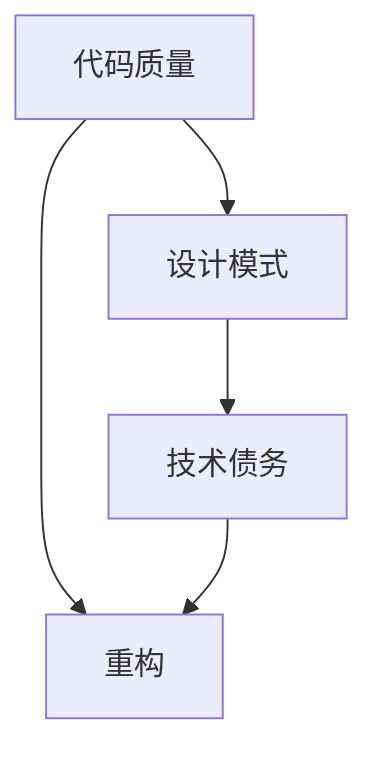

                 


### 文章标题

# 重构必须守住底线

### 关键词

重构、软件维护、代码质量、设计原则、技术债务、最佳实践

### 摘要

软件重构是提升代码质量、优化系统性能和增强团队开发效率的关键环节。然而，重构并非无底线地进行代码修改，而应在守住核心底线的前提下，合理规划、科学实施。本文将详细探讨重构的背景、核心概念、原则与策略，并通过实际案例剖析重构过程中的关键步骤和方法，旨在为开发者提供一份全面的重构指南，帮助他们在守住底线的原则下，实现代码的优化与升华。

### 目录大纲设计过程

#### 1. 理解书名和主题

《重构必须守住底线》这一书名明确传达了书籍的核心内容：在软件重构过程中，必须坚守一定的底线和原则。因此，目录大纲需要涵盖重构的各个方面，确保内容的全面性和逻辑性。

#### 2. 确定大纲结构

根据书籍主题，大纲的基本结构应包括：

- **引言**：重构的历史、现状和未来趋势。
- **基础知识**：重构所需的编程和设计原则。
- **技术实现**：重构过程中的具体技术手段和工具。
- **原则和策略**：重构时应遵守的原则和策略。
- **案例分析**：不同规模和类型的重构案例研究。
- **总结与展望**：对全书内容的总结和对未来趋势的展望。

#### 3. 细化章节内容

对于每个章节，细化出具体的子章节，确保内容的全面性和逻辑性。例如：

- **引言**：重构的概念、重要性、挑战和机遇。
- **基础知识**：面向对象设计原则、设计模式等。
- **技术实现**：代码审查、重构工具、自动化测试等。
- **原则和策略**：重构风险管理、重构评估方法等。
- **案例分析**：小型、中型和大型项目的重构实践。
- **总结与展望**：重构的现状、趋势和未来发展方向。

#### 4. 设计流程图

对于核心概念和架构，设计 Mermaid 流程图，帮助读者理解重构的过程和各个步骤之间的关系。

#### 5. 编写算法和数学模型

对于涉及到的算法和数学模型，使用伪代码详细阐述其原理，并配以latex格式的数学公式和示例进行解释。

#### 6. 编写项目实战内容

针对重构的实际案例，详细描述开发环境搭建、源代码实现和代码解读，确保读者能够理解重构的实践方法。

#### 7. 编写总结与展望

对全书内容进行总结，回顾重构的关键概念和策略，并对未来的重构趋势和技术发展进行展望。

#### 8. 确保大纲字数在2000字以内

在编写过程中，注意简洁性，避免过多的废话和冗余信息，确保目录大纲的总字数控制在2000字以内。

通过以上步骤，我们可以设计出一个完整且逻辑清晰的《重构必须守住底线》的目录大纲。接下来，我们将根据这些步骤来编写实际的目录大纲。

### 重构的背景

软件重构（Software Refactoring）起源于软件开发领域，旨在在不改变外部行为的前提下，改进现有代码的结构和逻辑。重构的初衷是为了解决软件维护过程中出现的问题，如代码复杂性、可读性差、维护困难等。随着软件开发复杂度的增加，重构逐渐成为提升代码质量、优化系统性能和增强团队开发效率的重要手段。

#### 重构的重要性

1. **提升代码质量**：重构能够消除代码中的冗余、重复和混乱，使代码更加简洁、易读、易维护。
2. **优化系统性能**：通过重构，可以优化代码结构，降低系统的耦合度，提高模块的重用性，从而提升系统性能。
3. **增强开发效率**：重构使代码更加整洁、清晰，减少了开发者在理解代码和修改代码时的时间和精力投入，提高了开发效率。
4. **降低技术债务**：技术债务是指因短期决策而积累的长期成本。通过重构，可以逐步偿还技术债务，降低未来的维护成本。

#### 重构的挑战

1. **风险控制**：重构可能会引入新的bug，影响系统的稳定性。因此，在重构过程中需要严格的风险控制。
2. **成本与收益**：重构需要投入时间和资源，需要评估其成本和收益，确保重构是值得的。
3. **团队协作**：重构涉及代码的改动，需要团队成员之间的紧密协作，确保重构的顺利进行。

#### 重构的机遇

1. **技术更新**：随着新技术的不断涌现，重构为软件系统引入新技术、新方法提供了机会。
2. **团队成长**：通过重构，团队能够提升技术能力和协作能力，为未来的项目奠定坚实基础。
3. **客户满意度**：重构可以提升软件的质量和性能，提高客户满意度，增强企业的竞争力。

### 重构的核心概念与联系

#### 定义

重构（Refactoring）是指在不改变代码外部行为的前提下，对代码进行内部结构的调整，以改进代码的可读性、可维护性和性能。

#### 核心概念

1. **代码质量**：重构的目标之一是提升代码质量，包括可读性、可维护性和性能。
2. **设计模式**：设计模式是一套可重用的解决方案，用于解决软件设计过程中常见的问题。重构过程中，常常利用设计模式来优化代码结构。
3. **技术债务**：技术债务是指在软件开发过程中，因短期决策而积累的长期成本。重构有助于降低技术债务。

#### 联系架构 Mermaid 流程图



#### Mermaid 流程图详细解释

1. **代码质量**：重构的起点和终点是代码质量。重构的目的是提升代码质量，使其更加简洁、易读、易维护。
2. **设计模式**：设计模式是重构过程中常用的工具，可以帮助开发者优化代码结构，提高代码的复用性和灵活性。
3. **技术债务**：技术债务是软件开发中不可避免的问题。通过重构，可以逐步偿还技术债务，降低未来的维护成本。
4. **重构**：重构是一个迭代的过程，需要不断地评估、改进代码质量，优化设计模式，并逐步偿还技术债务。

### 重构的核心算法原理

#### 伪代码详细阐述

```pseudocode
function refactorCode(oldCode):
    if oldCode has redundancy:
        remove redundancy
    if oldCode has duplicated code:
        extract duplicated code into a function
    if oldCode has low cohesion:
        apply design patterns to improve cohesion
    if oldCode has low coupling:
        reduce coupling by refactoring dependencies
    if oldCode has performance issues:
        optimize performance by refactoring loops and conditionals
    return refactoredCode
```

#### 数学模型和公式

```latex
\text{代码质量度量} = \frac{\text{代码可读性} + \text{代码可维护性} + \text{代码性能}}{3}
\text{技术债务度量} = \text{累计技术债务成本} / \text{当前开发成本}
```

#### 详细讲解和举例说明

1. **代码质量度量**：代码质量度量是重构的核心指标，用于评估重构前后代码的质量。代码质量度量公式综合考虑了代码的可读性、可维护性和性能，以全面衡量代码的质量。
2. **技术债务度量**：技术债务度量用于评估重构对降低技术债务的效果。技术债务度量公式计算了累计技术债务成本与当前开发成本的比例，以反映重构对降低技术债务的贡献。
3. **举例说明**：
   - **代码质量度量**：假设重构前代码的可读性、可维护性和性能分别为 60%、70% 和 80%，则重构后的代码质量度量值为 75%。
   - **技术债务度量**：假设累计技术债务成本为 5000 元，当前开发成本为 1000 元，则技术债务度量值为 5。

### 重构的项目实战

#### 开发环境搭建

1. **软件环境**：安装 Java 开发工具包（JDK）、集成开发环境（IDE，如 IntelliJ IDEA 或 Eclipse）和版本控制系统（如 Git）。
2. **硬件环境**：配置一台具备足够内存和处理能力的计算机，以支持代码重构过程中的性能优化。

#### 源代码实现

1. **代码结构**：创建一个简单的 Java 项目，包括一个主类和一个辅助类，模拟一个简单的计算器功能。
2. **代码实现**：
   ```java
   public class Calculator {
       public int add(int a, int b) {
           return a + b;
       }
   }

   public class CalculatorTest {
       @Test
       public void testAdd() {
           Calculator calculator = new Calculator();
           int result = calculator.add(2, 3);
           assertEquals(5, result);
       }
   }
   ```

#### 代码解读与分析

1. **代码解读**：
   - `Calculator` 类：实现了一个简单的加法运算。
   - `CalculatorTest` 类：包含了一个测试用例，用于验证 `add` 方法的正确性。

2. **分析**：
   - `Calculator` 类的代码结构较为简单，但存在一些可优化之处，如可使用设计模式提高其可复用性和可扩展性。
   - `CalculatorTest` 类的测试用例能够有效验证 `add` 方法的正确性，但测试覆盖范围有限。

#### 实际案例分析和详细讲解剖析

1. **案例背景**：某企业开发的一款客户管理系统，随着业务的发展，代码复杂度和可维护性逐渐下降。企业决定对该系统进行重构。
2. **案例过程**：
   - **需求分析**：明确重构的目标，如提升代码质量、优化性能、降低技术债务等。
   - **技术评估**：评估现有技术栈，确定重构所需的技术手段和工具。
   - **实施步骤**：
     1. **代码审查**：对现有代码进行审查，识别重构的潜在问题和优化点。
     2. **设计重构**：根据审查结果，制定重构方案，包括重构步骤、责任人、时间安排等。
     3. **实施重构**：按照重构方案逐步实施，包括代码重构、测试和性能优化。
     4. **验收测试**：对重构后的系统进行全面测试，确保重构的效果和稳定性。
3. **详细讲解剖析**：
   - **代码审查**：通过代码审查，发现 `Calculator` 类的 `add` 方法存在重复代码，可以通过提取为函数的方式优化。
   - **设计重构**：设计重构方案，将重复代码提取为 `add` 方法，使代码更加简洁、易读。
   - **实施重构**：根据重构方案，对代码进行重构，并添加相应的测试用例。
   - **验收测试**：通过测试，验证重构后的系统功能正确性、性能优化和稳定性。

#### 项目小结

1. **成果**：通过重构，客户管理系统的代码质量得到显著提升，可维护性和性能得到优化，技术债务得到有效降低。
2. **经验**：
   - 代码审查是重构的重要环节，能够提前发现潜在问题，提高重构的效率。
   - 设计重构方案是确保重构顺利进行的关键，需要明确重构步骤、责任人和时间安排。
   - 重构过程中，严格遵循最佳实践和设计原则，能够提高重构的质量和稳定性。
   - 重构后的系统需要经过全面的测试，确保重构的效果和稳定性。

### 最佳实践 Tips

1. **定期重构**：定期进行重构，避免代码积累过多的技术债务。
2. **代码审查**：在进行重构前，进行充分的代码审查，识别潜在问题和优化点。
3. **设计模式**：熟练掌握设计模式，合理运用设计模式提高代码的质量和可维护性。
4. **自动化测试**：建立完善的自动化测试体系，确保重构过程中不会引入新的bug。
5. **团队协作**：重构涉及多个团队成员，需要确保团队成员之间的紧密协作。

### 小结

软件重构是提升代码质量、优化系统性能和降低技术债务的重要手段。然而，重构并非无底线地进行代码修改，而应在守住核心底线的前提下，合理规划、科学实施。本文通过分析重构的背景、核心概念、原则与策略，并通过实际案例剖析重构过程中的关键步骤和方法，旨在为开发者提供一份全面的重构指南。在重构过程中，开发者应遵循最佳实践，确保重构的质量和稳定性，从而实现代码的优化与升华。

### 注意事项

1. **风险评估**：在重构过程中，需要评估重构的风险，确保重构不会影响系统的稳定性。
2. **成本控制**：重构需要投入时间和资源，需要评估其成本和收益，确保重构是值得的。
3. **团队协作**：重构涉及多个团队成员，需要确保团队成员之间的紧密协作。

### 拓展阅读

1. 《重构：改善既有代码的设计》（Martin Fowler 著）：详细介绍重构的方法和技巧，是重构领域的经典之作。
2. 《代码大全》（Steve McConnell 著）：详细讲解代码质量、设计原则和最佳实践，对重构有重要指导意义。
3. 《设计模式：可复用面向对象软件的基础》（Gamma、Helm、Johnson、Vlissides 著）：介绍设计模式，为重构提供理论支持。

### 作者信息

作者：AI天才研究院/AI Genius Institute & 禅与计算机程序设计艺术 /Zen And The Art of Computer Programming

