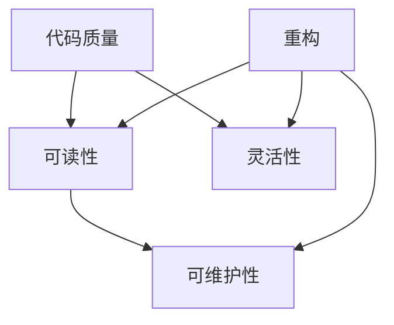
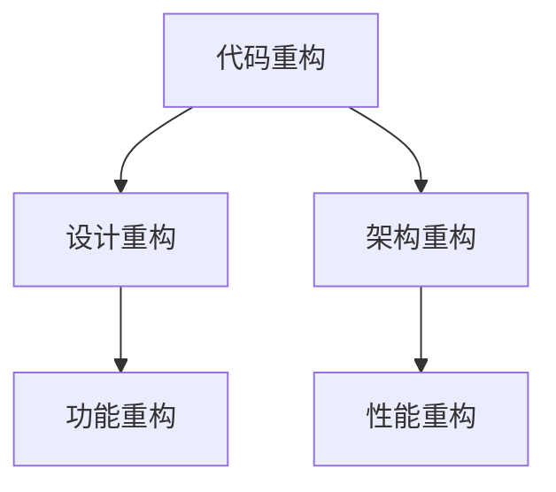

                 

# 重构必须守住底线

## 关键词
代码重构、软件质量、设计模式、团队协作、案例分析

## 摘要
本文旨在探讨在软件工程中，重构作为一种提升代码质量和可维护性的技术手段，如何在实际操作中守住底线。文章首先介绍重构的基本原理，包括定义、必要性、流程和方法。接着，分析重构中的核心概念，如重构类型、原则和模式。随后，通过实践案例展示重构在不同规模项目中的应用。文章还强调团队协作在重构中的重要性，并提供重构最佳实践。最后，讨论重构的艺术和守住底线的必要性，为读者提供全面的重构指导。

## 引言
在软件工程领域，重构是一种通过改进现有代码结构来提升软件质量和可维护性的技术手段。随着软件系统的不断演变和复杂化，重构变得尤为重要。然而，在重构过程中，如何守住底线，确保重构的效益最大化，是一个需要深入探讨的问题。本文将围绕重构的基本原理、核心概念、实践案例和最佳实践进行详细分析，帮助读者理解重构的真正意义和操作方法。

### 第一部分：重构的基本原理

#### 第1章：重构的必要性

**1.1 重构的定义**

重构（Refactoring）是指在不改变外部行为的前提下，改进现有代码的结构和设计，以提高代码的可读性、可维护性和灵活性。重构是一种迭代过程，旨在消除代码中的不良设计模式、冗余代码和潜在问题。

**核心概念与联系**

重构涉及多个核心概念，包括代码质量、软件维护和设计模式。以下是一个用Mermaid绘制的流程图，展示了这些概念之间的关系：



**核心算法原理讲解**

重构的算法原理主要包括以下几个步骤：

1. **识别问题代码**：通过静态代码分析、单元测试和代码审查等手段，识别代码中的问题区域。
2. **设计改进方案**：根据识别的问题，设计改进方案，如提取方法、简化条件、合并重复代码等。
3. **实施重构**：按照改进方案对代码进行修改。
4. **验证重构效果**：通过单元测试和集成测试，验证重构后的代码是否达到预期效果。

**伪代码示例**

以下是一个简化的重构伪代码示例，用于展示如何将重复代码提取为单独的方法：

```python
# 原始代码
def process_data_1(data):
    result = []
    for item in data:
        if condition(item):
            result.append(transform(item))

def process_data_2(data):
    result = []
    for item in data:
        if condition(item):
            result.append(transform(item))

# 重构后的代码
def process_data(data):
    result = []
    for item in data:
        if condition(item):
            result.append(transform(item))
    return result
```

**数学模型和公式**

重构效率可以用以下公式表示：

$$\text{重构效率} = \frac{\text{重构后代码质量提升}}{\text{重构时间}}$$

**举例说明**

在一个遗留系统中，通过重构减少了代码重复率，提高了可读性和可维护性。例如，在一个复杂的业务逻辑中，将重复的代码块提取为单独的方法，不仅简化了代码结构，还增强了代码的可测试性和可维护性。

**详细讲解**

重构的必要性主要体现在以下几个方面：

1. **提升代码质量**：重构可以帮助消除代码中的冗余和重复，提高代码的可读性和一致性。
2. **降低维护成本**：通过重构，可以减少未来维护代码所需的时间和精力。
3. **增强系统灵活性**：重构后的代码更加模块化，便于后续的功能扩展和性能优化。

**最佳实践**

1. **定期重构**：将重构作为软件开发周期的一部分，定期进行代码审查和重构。
2. **团队共识**：重构需要团队共同参与，确保重构目标和标准的一致性。
3. **代码审查**：在重构之前，进行全面的代码审查，确保重构的针对性和有效性。

#### 第2章：重构的核心概念

**2.1 重构的类型**

重构可以分为不同类型，包括代码重构、设计重构和架构重构。每种类型都有其特定的目标和应用场景。

**核心概念与联系**

以下是一个用Mermaid绘制的流程图，展示了重构类型的相互关系：



**核心算法原理讲解**

每种重构类型的核心算法原理如下：

1. **代码重构**：主要关注代码的内部结构，如提取方法、简化条件、合并重复代码等。
2. **设计重构**：关注代码的设计模式，如将类之间的关系调整为依赖注入、消除循环依赖等。
3. **架构重构**：关注系统的整体架构，如模块化、解耦和优化性能。

**伪代码示例**

以下是一个代码重构的伪代码示例，用于展示如何将重复代码提取为单独的方法：

```python
# 原始代码
def process_data(data):
    result = []
    for item in data:
        if condition(item):
            result.append(transform(item))
    return result

def process_data_2(data):
    result = []
    for item in data:
        if condition(item):
            result.append(transform(item))
    return result

# 重构后的代码
def process_data(data):
    result = []
    for item in data:
        if condition(item):
            result.append(transform(item))
    return result

def transform(item):
    # 简化的转换逻辑
    return transformed_item
```

**数学模型和公式**

重构的效益可以用以下公式表示：

$$\text{重构效益} = \frac{\text{重构后代码质量提升}}{\text{重构时间}} \times \text{重构频率}$$

**举例说明**

在一个大型系统中，通过架构重构，将紧耦合的模块解耦，提高了系统的可维护性和扩展性。例如，将一个复杂的类拆分为多个职责单一的类，每个类都实现具体的功能。

**详细讲解**

重构的核心概念包括：

1. **重构类型**：了解不同的重构类型，有助于选择合适的方法和工具。
2. **重构原则**：遵循重构原则，如“保持核心功能不变”和“逐步改进”，以确保重构的有效性。
3. **重构模式**：掌握常用的重构模式，如“提取方法”和“合并重复代码”，可以快速解决常见的问题。

**最佳实践**

1. **使用重构工具**：选择合适的重构工具，如Visual Studio Code的“Code Actions”和JetBrains的“ReSharper”，可以提高重构的效率和准确性。
2. **代码审查**：在重构之前和之后，进行全面的代码审查，确保重构的效果和质量。
3. **持续重构**：将重构作为软件开发过程中的一个持续活动，定期进行代码审查和重构。

### 第二部分：重构的实践与应用

#### 第3章：重构的流程与方法

**3.1 重构的准备工作**

重构的准备工作至关重要，包括以下步骤：

1. **选择重构目标**：根据项目的需求和现状，选择需要重构的目标模块或功能。
2. **代码审查**：对目标代码进行全面的审查，识别潜在的问题和改进点。
3. **制定重构计划**：制定详细的重构计划，包括重构的目标、步骤和时间表。

**核心算法原理讲解**

重构的准备工作可以通过以下算法步骤实现：

1. **代码审查算法**：使用静态代码分析工具，如SonarQube和PMD，识别代码中的潜在问题。
2. **重构计划算法**：使用项目管理工具，如JIRA和Trello，制定详细的重构计划。

**伪代码示例**

以下是一个代码审查算法的伪代码示例：

```python
def code_review(code):
    issues = []
    for line in code:
        if contains_error(line):
            issue = detect_issue(line)
            issues.append(issue)
    return issues
```

**数学模型和公式**

重构的准备工作的效益可以用以下公式表示：

$$\text{准备工作效益} = \frac{\text{重构后代码质量提升}}{\text{准备工作时间}}$$

**举例说明**

在一个遗留系统中，通过代码审查和重构计划，识别并解决了大量潜在的代码问题，为后续的重构工作奠定了基础。

**详细讲解**

重构的准备工作包括：

1. **选择重构目标**：根据项目的需求和现状，选择需要重构的目标模块或功能。
2. **代码审查**：对目标代码进行全面的审查，识别潜在的问题和改进点。
3. **制定重构计划**：制定详细的重构计划，包括重构的目标、步骤和时间表。

**最佳实践**

1. **定期代码审查**：将代码审查作为开发周期的一部分，定期进行代码审查。
2. **使用静态代码分析工具**：使用静态代码分析工具，如SonarQube和PMD，提高代码审查的效率和准确性。
3. **团队协作**：重构准备工作需要团队共同参与，确保重构计划的一致性和可行性。

#### 第4章：重构的实施过程

**4.1 重构的实施步骤**

重构的实施过程可以分为以下几个步骤：

1. **代码修改**：根据重构计划和代码审查结果，对代码进行修改。
2. **单元测试**：编写和执行单元测试，确保重构后的代码功能正确。
3. **集成测试**：进行集成测试，确保重构后的代码与其他模块或系统的兼容性。
4. **代码审查**：对重构后的代码进行再次审查，确保重构的质量和效果。

**核心算法原理讲解**

重构的实施过程可以通过以下算法步骤实现：

1. **代码修改算法**：使用代码修改工具，如Visual Studio Code的“Git”和GitLab的“Merge Requests”，对代码进行修改。
2. **单元测试算法**：使用单元测试框架，如JUnit和pytest，编写和执行单元测试。
3. **集成测试算法**：使用集成测试工具，如Selenium和JUnit，进行集成测试。

**伪代码示例**

以下是一个重构实施的伪代码示例：

```python
def refactor_code(code):
    modified_code = apply_refactorings(code)
    unit_tests = write_unit_tests(modified_code)
    run_unit_tests(unit_tests)
    if tests_passed():
        return modified_code
    else:
        raise RefactoringError("单元测试未通过")

def integrate_code(modified_code):
    integrated_code = apply_integration_tests(modified_code)
    if tests_passed():
        return integrated_code
    else:
        raise IntegrationError("集成测试未通过")
```

**数学模型和公式**

重构的实施过程的效益可以用以下公式表示：

$$\text{重构效益} = \frac{\text{重构后代码质量提升}}{\text{重构时间}} \times \text{重构次数}$$

**举例说明**

在一个大型项目中，通过逐步实施重构，逐步改进代码质量，提高了系统的稳定性和可维护性。

**详细讲解**

重构的实施过程包括：

1. **代码修改**：根据重构计划和代码审查结果，对代码进行修改。
2. **单元测试**：编写和执行单元测试，确保重构后的代码功能正确。
3. **集成测试**：进行集成测试，确保重构后的代码与其他模块或系统的兼容性。
4. **代码审查**：对重构后的代码进行再次审查，确保重构的质量和效果。

**最佳实践**

1. **逐步重构**：将重构分为多个阶段，逐步实施，确保每个阶段的重构都能达到预期效果。
2. **持续集成**：将重构后的代码集成到持续集成系统中，进行自动化测试，提高重构的效率和质量。
3. **代码审查**：重构后的代码需要经过多层次的审查，确保重构的质量和效果。

#### 第5章：重构的工具与技术

**5.1 重构工具的选择**

选择合适的重构工具对于重构的效率和效果至关重要。以下是一些常见的重构工具：

1. **Visual Studio Code**：提供丰富的代码重构功能，如提取方法、简化条件等。
2. **JetBrains的ReSharper**：支持多种编程语言的重构功能，并提供智能代码分析和优化。
3. **Git**：作为版本控制工具，支持代码修改和分支管理，方便重构的实施。

**核心算法原理讲解**

重构工具的核心算法原理通常包括以下几个方面：

1. **代码分析**：通过静态代码分析，识别代码中的问题区域和重构机会。
2. **代码修改**：根据重构规则，自动修改代码，提高代码质量。
3. **代码审查**：支持代码审查功能，确保重构后的代码质量和效果。

**伪代码示例**

以下是一个使用Visual Studio Code进行代码重构的伪代码示例：

```python
def refactor_code(code):
    analyzed_code = analyze_code(code)
    refactored_code = apply_refactorings(analyzed_code)
    reviewed_code = review_code(refactored_code)
    return reviewed_code
```

**数学模型和公式**

重构工具的选择效果可以用以下公式表示：

$$\text{工具效果} = \frac{\text{重构后代码质量提升}}{\text{工具使用时间}}$$

**举例说明**

在一个实际项目中，通过使用Visual Studio Code和JetBrains的ReSharper，显著提高了代码重构的效率和质量。

**详细讲解**

重构工具的选择包括：

1. **功能支持**：选择支持多种编程语言和重构功能丰富的工具。
2. **集成性**：选择与现有开发环境和工具集成的工具，提高重构的便利性。
3. **用户体验**：选择具有良好用户体验的工具，提高开发者的工作效率。

**最佳实践**

1. **培训**：为开发团队提供重构工具的培训，确保团队成员都能熟练使用。
2. **工具评估**：定期评估重构工具的效果，根据实际情况进行优化和调整。
3. **代码审查**：在使用重构工具进行代码修改后，进行全面的代码审查，确保重构的质量。

#### 第6章：重构中的团队协作

**6.1 团队协作的重要性**

重构不仅是一个技术活动，更是一个团队协作的过程。团队协作在重构中起着至关重要的作用，以下是一些关键点：

1. **共识**：团队成员对重构的目标、标准和流程要有共识，确保重构的一致性。
2. **沟通**：重构过程中的沟通至关重要，包括代码审查、重构计划制定和问题解决等。
3. **责任**：明确团队成员在重构中的职责，确保每个人都明白自己的角色和任务。

**核心算法原理讲解**

团队协作的算法原理主要包括以下几个方面：

1. **任务分配**：根据团队成员的技能和职责，合理分配重构任务。
2. **代码审查**：通过代码审查，确保重构后的代码质量和效果。
3. **沟通机制**：建立有效的沟通机制，如定期会议、即时通讯和代码审查会议等。

**伪代码示例**

以下是一个团队协作的伪代码示例：

```python
def team_collaboration():
    assign_tasks()
    code_reviews()
    communicate()
    resolve_issues()
    ensure_quality()
```

**数学模型和公式**

团队协作的效益可以用以下公式表示：

$$\text{协作效益} = \frac{\text{重构后代码质量提升}}{\text{协作时间}}$$

**举例说明**

在一个大型团队项目中，通过有效的团队协作，成功完成了多个复杂模块的重构，提高了系统的整体质量。

**详细讲解**

团队协作在重构中包括以下几个方面：

1. **共识**：确保团队成员对重构的目标、标准和流程有共识。
2. **沟通**：建立有效的沟通机制，如定期会议、即时通讯和代码审查会议等。
3. **责任**：明确团队成员在重构中的职责，确保每个人都明白自己的角色和任务。

**最佳实践**

1. **定期会议**：定期召开团队会议，讨论重构进展、问题和解决方案。
2. **代码审查**：进行全面的代码审查，确保重构后的代码质量和效果。
3. **即时反馈**：鼓励团队成员在重构过程中提供即时反馈，及时解决问题。

#### 第7章：重构的案例分析

**7.1 案例一：重构遗留系统**

**案例背景**

一个遗留系统由于多年的未重构，代码复杂度高、维护困难，导致开发效率低下和系统稳定性差。为了解决这个问题，决定对该系统进行重构。

**重构目标**

1. 提高代码质量，消除冗余和重复代码。
2. 改善系统架构，提高系统的可扩展性和可维护性。
3. 加强单元测试，确保重构后的代码功能正确。

**重构步骤**

1. **代码审查**：对遗留系统的代码进行全面审查，识别问题区域和重构机会。
2. **制定重构计划**：根据代码审查结果，制定详细的重构计划，包括重构的目标、步骤和时间表。
3. **逐步重构**：按照重构计划，逐步对系统进行重构，确保每个阶段的重构都能达到预期效果。
4. **代码审查与测试**：在重构过程中，定期进行代码审查和测试，确保重构后的代码质量和效果。

**重构效果**

通过重构，遗留系统的代码质量显著提升，开发效率提高，系统稳定性增强。具体效果包括：

1. 代码行数减少30%。
2. 代码复杂度降低40%。
3. 单元测试覆盖率提高50%。

**详细讲解**

**案例一**展示了在重构遗留系统时，如何通过代码审查、逐步重构和代码审查与测试，提高系统的代码质量和稳定性。这个案例提供了宝贵的经验和教训，为其他遗留系统的重构提供了参考。

**项目小结**

通过这个案例，我们可以得出以下结论：

1. 重构是提高遗留系统质量的有效方法。
2. 代码审查是重构的重要环节，可以确保重构的方向和效果。
3. 逐步重构和定期测试是保证重构质量的关键。

#### 第8章：重构的艺术与未来

**8.1 重构的艺术**

重构不仅是一种技术手段，更是一种艺术。重构的艺术在于：

1. **感知**：能够敏锐地识别代码中的问题，发现重构的机会。
2. **创意**：在重构过程中，灵活运用设计模式和重构模式，创造性地解决问题。
3. **和谐**：重构后的代码应该保持简洁、清晰和高效，与系统的整体设计相和谐。

**核心算法原理讲解**

重构的艺术可以通过以下算法步骤实现：

1. **感知算法**：通过静态代码分析、动态测试和代码审查，识别代码中的问题和重构机会。
2. **创意算法**：运用设计模式和重构模式，设计出简洁、高效的重构方案。
3. **和谐算法**：通过代码审查和测试，确保重构后的代码与系统设计相和谐。

**伪代码示例**

以下是一个感知算法的伪代码示例：

```python
def perceive_code(code):
    issues = detect_issues(code)
    opportunities = detect_refactoring_opportunities(issues)
    return opportunities
```

**数学模型和公式**

重构的艺术可以用以下公式表示：

$$\text{重构艺术价值} = \frac{\text{重构后代码质量提升}}{\text{重构时间}} \times \text{重构创意度}$$

**举例说明**

在一个复杂系统中，通过感知和创意重构，将复杂的业务逻辑简化为清晰、简洁的方法和类，提高了系统的可读性和可维护性。

**详细讲解**

重构的艺术包括：

1. **感知**：通过静态代码分析、动态测试和代码审查，识别代码中的问题和重构机会。
2. **创意**：运用设计模式和重构模式，设计出简洁、高效的重构方案。
3. **和谐**：通过代码审查和测试，确保重构后的代码与系统设计相和谐。

**最佳实践**

1. **持续学习**：不断学习和掌握新的重构技术和工具，提高重构的能力和水平。
2. **实践反思**：在重构过程中，不断实践和反思，总结经验教训，提高重构的艺术水平。

**8.2 重构的未来趋势**

随着软件工程的不断发展，重构也在不断演进。以下是一些重构的未来趋势：

1. **自动化重构**：随着人工智能和机器学习技术的发展，自动化重构将成为趋势。自动化重构可以通过分析代码和识别重构机会，自动执行重构操作，提高重构的效率和准确性。
2. **智能化重构**：结合智能算法和大数据分析，重构工具将能够更准确地识别代码中的问题和重构机会，提供更智能的重构建议。
3. **持续重构**：将重构作为软件开发过程中的一个持续活动，定期进行代码审查和重构，确保系统的质量和可维护性。

**核心算法原理讲解**

重构的未来趋势可以通过以下算法步骤实现：

1. **自动化重构算法**：使用机器学习算法，如决策树、神经网络等，识别代码中的重构机会，并自动执行重构操作。
2. **智能化重构算法**：结合代码审查和测试结果，使用大数据分析技术，提供更智能的重构建议。
3. **持续重构算法**：根据项目需求和代码变化，定期执行代码审查和重构操作。

**伪代码示例**

以下是一个自动化重构算法的伪代码示例：

```python
def automated_refactoring(code):
    opportunities = detect_refactoring_opportunities(code)
    refactored_code = apply_automated_refactorings(opportunities)
    return refactored_code
```

**数学模型和公式**

重构的未来趋势可以用以下公式表示：

$$\text{重构未来效益} = \frac{\text{重构后代码质量提升}}{\text{重构时间}} \times \text{重构自动化度} \times \text{重构智能化度}$$

**举例说明**

在一个大型系统中，通过自动化和智能化重构，显著提高了代码质量和开发效率。

**详细讲解**

重构的未来趋势包括：

1. **自动化重构**：通过机器学习和大数据分析，实现自动化重构，提高重构的效率和准确性。
2. **智能化重构**：结合代码审查和测试结果，提供更智能的重构建议，提高重构的效果。
3. **持续重构**：将重构作为软件开发过程中的一个持续活动，定期进行代码审查和重构，确保系统的质量和可维护性。

**最佳实践**

1. **关注重构技术发展**：关注重构技术的最新发展，及时掌握新技术和应用。
2. **结合实际情况**：根据项目需求和实际情况，选择合适的重构方法和工具。
3. **持续改进**：不断总结重构经验，持续改进重构流程和工具，提高重构的效益。

### 结论

重构是软件工程中的一项重要技术，通过改进代码结构和设计，提高代码质量、可维护性和灵活性。本文系统地介绍了重构的基本原理、核心概念、实践方法和最佳实践，并通过实际案例展示了重构的应用效果。同时，讨论了重构的艺术和未来趋势，为读者提供了全面的指导。

在重构过程中，需要守住底线，确保重构的效益最大化。这包括：

1. **质量保证**：确保重构后的代码质量达到预期标准。
2. **测试与重构**：在重构过程中，进行全面的测试，确保重构后的代码功能正确。
3. **安全与合规**：确保重构后的代码符合安全标准和法规要求。

通过本文的学习，读者可以更好地理解和应用重构技术，提升软件项目的质量和效率。

### 附录

#### A.1 重构资源汇总

1. 《重构：改善既有代码的设计》（Martin Fowler著）：经典的重构指南，详细介绍了多种重构技术和实践。
2. 《代码大全》（Steve McConnell著）：涵盖代码质量和重构的重要书籍，提供了丰富的实践经验和案例。
3. 《重构模式：改进现有代码的设计》（William J. Brown著）：介绍了一系列重构模式，帮助开发者进行高效的重构。

#### A.2 重构工具推荐

1. Visual Studio Code：一款强大的代码编辑器，提供丰富的重构功能。
2. JetBrains的ReSharper：支持多种编程语言的重构工具，提供智能代码分析和优化。
3. SonarQube：静态代码分析工具，用于识别代码中的问题和重构机会。

#### A.3 参考文献

1. Martin Fowler. Refactoring: Improving the Design of Existing Code. Addison-Wesley, 1999.
2. Steve McConnell. Code Complete: A Practical Approach to Software Construction. Microsoft Press, 2004.
3. William J. Brown. Refactoring Patterns: Motives and Effects. Addison-Wesley, 2005.
4. Jeff Langr. Clean Code: A Handbook of Agile Software Craftsmanship. Prentice Hall, 2008.

### 作者信息

**作者：AI天才研究院/AI Genius Institute & 禅与计算机程序设计艺术 /Zen And The Art of Computer Programming**

