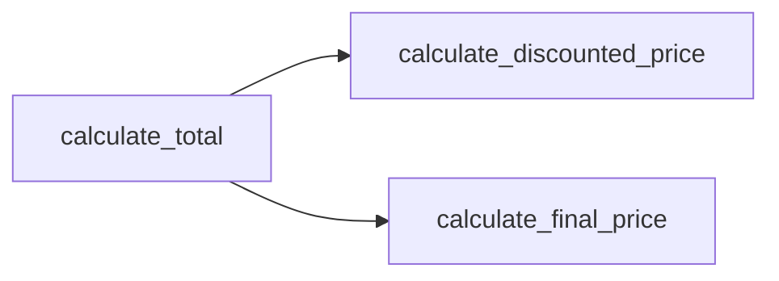
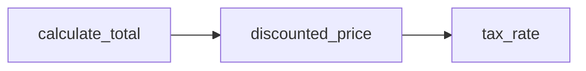
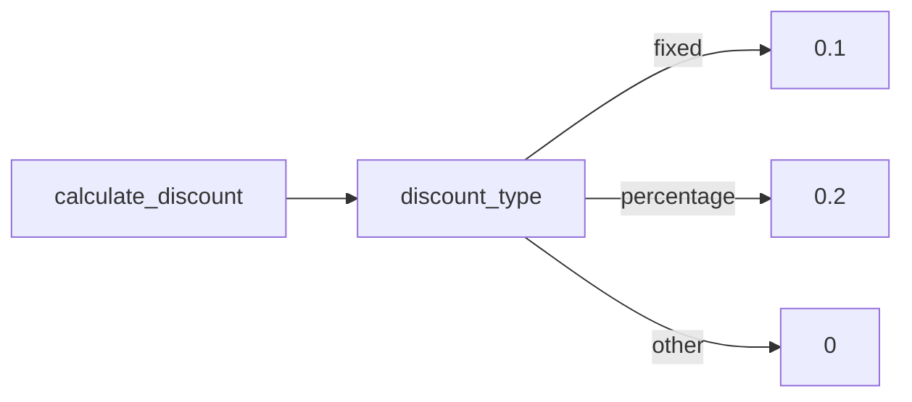
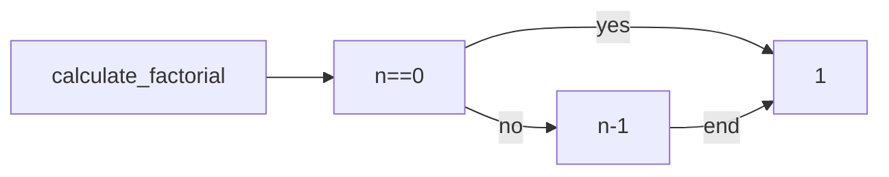
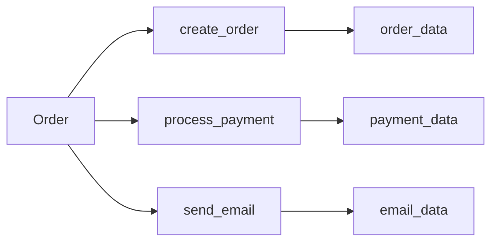
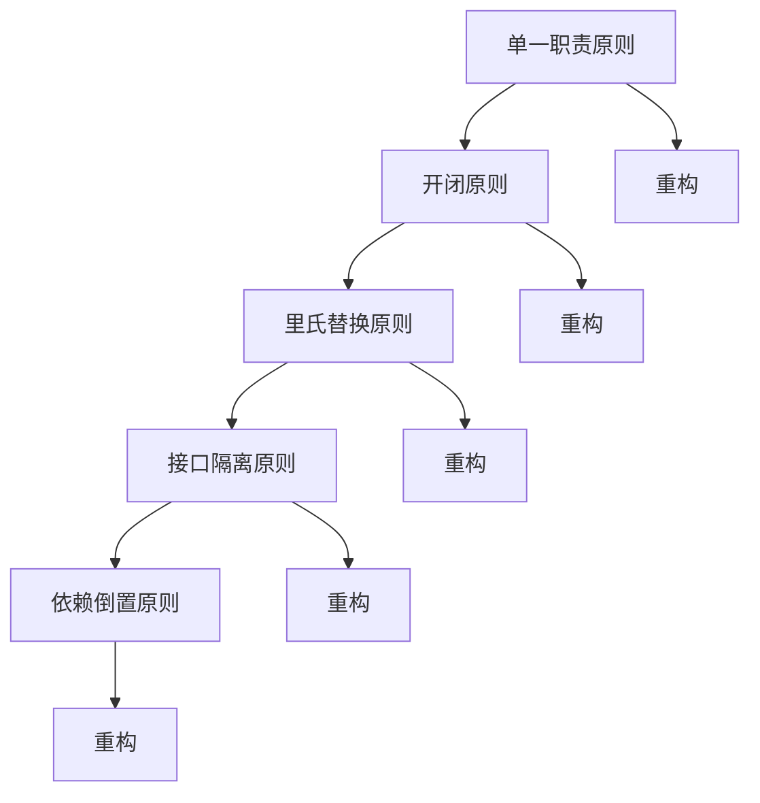

                 

### 文章标题

重构技巧：改善既有代码的艺术

> 关键词：重构、代码优化、软件工程、设计模式

> 摘要：
本文深入探讨了重构技巧在改善既有代码中的应用。重构不仅是提升代码质量和可维护性的关键手段，也是软件工程中不可或缺的一环。通过一系列具体的重构技术和实践案例，本文旨在帮助开发者理解和掌握重构技巧，从而提升代码的艺术性。

### 引言

在软件开发过程中，代码重构是一项至关重要的活动。它不仅关乎代码的质量，还直接影响到项目的可维护性和扩展性。重构，顾名思义，是对现有代码进行改进和优化，以确保其结构清晰、逻辑严密、易于理解和维护。然而，许多开发者对重构的重要性认识不足，甚至忽视了这一环节，导致代码库逐渐变得混乱不堪，维护成本不断增加。

本文将系统地介绍重构技巧，包括重构的基本概念、原则、具体技术、实践方法以及相关的工具。通过这一系列的内容，我们希望读者能够深入了解重构的本质，掌握有效的重构技巧，从而提升代码的艺术性。

### 第一部分：重构基础与原则

#### 1.1 重构的基本概念

重构是指在不改变代码外在行为的前提下，改善其内部结构和组织形式的过程。重构的目标是提高代码的可读性、可维护性和性能。它不是一次性的活动，而是一个持续进行的过程。

重构的动机主要包括以下几点：

1. **改善代码质量**：随着项目的发展，代码可能会变得难以理解和维护。通过重构，可以清除冗余代码，简化复杂逻辑，提高代码质量。
2. **提升代码性能**：重构可以帮助开发者识别并解决潜在的性能问题，如过度使用全局变量、不必要的函数调用等。
3. **增强代码可读性**：良好的代码结构可以提高代码的可读性，使后续的代码维护更加轻松。

#### 1.2 重构原则

重构不仅需要技巧，还需要遵循一定的原则。以下是几条重要的重构原则：

1. **单一职责原则**：一个函数或类应该只负责一项功能。这有助于降低复杂度，提高代码的模块化程度。
2. **开闭原则**：软件实体（如类、模块、函数等）应该对扩展开放，对修改封闭。这意味着，在添加新功能时，不应修改现有代码，而是通过扩展来实现。
3. **里氏替换原则**：任何可用的子类型必须能够替换掉它的基类型。这有助于确保代码的灵活性和扩展性。
4. **接口隔离原则**：客户端不应该依赖它不需要的接口。这意味着，应该为不同的客户端提供独立的接口，以减少依赖关系。
5. **依赖倒置原则**：高层模块不应该依赖低层模块，二者都应该依赖抽象。这意味着，通过抽象层来解耦，使系统更加灵活和可维护。

#### 1.3 重构的流程和步骤

重构不是一蹴而就的，而是一个逐步迭代的过程。以下是重构的一般流程和步骤：

1. **选择重构对象**：首先，需要选择需要重构的代码部分。这通常基于代码的可维护性、性能和可扩展性等因素。
2. **理解现有代码**：在开始重构之前，需要深入理解现有代码的逻辑和结构，以便确定重构的方向和范围。
3. **编写测试用例**：在重构过程中，应确保原有功能不受影响。因此，编写测试用例是非常重要的。
4. **逐步重构**：按照重构原则，逐步对代码进行改进。每次重构应尽量小，以确保代码的稳定性和可维护性。
5. **验证和回归测试**：在重构完成后，应进行充分的验证和回归测试，确保重构没有引入新的问题。

### 第二部分：具体重构技术

#### 2.1 代码结构重构

代码结构重构是重构过程中的重要环节。以下是一些常见的代码结构重构技术：

1. **方法提取**：将复杂的函数拆分成更小的函数，使每个函数只负责一项任务。这有助于提高代码的可读性和可维护性。
2. **方法内联**：将小而简单的方法直接嵌入到调用它的地方，以减少函数调用的开销。
3. **条件分支重构**：通过合并条件分支、提取公共分支等手段，简化条件逻辑，提高代码的可读性。
4. **循环重构**：将复杂的循环结构转换为更简洁的形式，如使用递归、迭代器等。

#### 2.2 类重构

类重构是改善代码结构的重要手段。以下是一些常见的类重构技术：

1. **类的拆分**：将大而复杂的类拆分成更小的类，每个类负责一项功能。这有助于降低类的复杂度，提高代码的可维护性。
2. **类的合并**：将具有相似功能的类合并成一个，以减少类的数量，提高代码的可读性。
3. **方法重构**：调整类的方法，使每个方法只负责一项任务，提高代码的可读性和可维护性。

#### 2.3 设计模式重构

设计模式是一种在软件开发中广泛应用的解决方案。通过设计模式重构，可以改善代码的结构和可维护性。以下是一些常见的设计模式：

1. **创建型设计模式**：包括单例模式、工厂模式、抽象工厂模式等，用于解决对象创建的问题。
2. **结构型设计模式**：包括适配器模式、装饰器模式、代理模式等，用于解决类或对象的组合问题。
3. **行为型设计模式**：包括策略模式、责任链模式、命令模式等，用于解决对象间的交互问题。

#### 2.4 数据库重构

数据库重构是改善数据库结构和性能的重要手段。以下是一些常见的数据库重构技术：

1. **数据表结构重构**：通过拆分、合并、重构索引等方式，改善数据表的结构，提高查询性能。
2. **数据库性能优化**：通过调整查询语句、索引、缓存等方式，优化数据库性能。

### 第三部分：重构实践与工具

#### 3.1 重构实践

重构实践是理解和掌握重构技巧的关键。以下是一些重构实践的建议：

1. **选择合适的重构场景**：并非所有的代码都需要重构，因此需要根据实际情况选择合适的重构场景。
2. **逐步重构**：重构应逐步进行，每次重构应尽量小，以确保代码的稳定性和可维护性。
3. **持续重构**：重构应被视为一个持续的过程，而非一次性活动。随着项目的发展，应不断进行重构，以保持代码的质量。

#### 3.2 重构工具

重构工具可以帮助开发者更高效地执行重构任务。以下是一些常用的重构工具：

1. **Visual Studio Code**：集成开发环境（IDE）中的内置重构工具，支持多种编程语言的重构操作。
2. **Eclipse**：流行的IDE，提供了丰富的重构功能，支持Java、C++等多种编程语言。
3. **IntelliJ IDEA**：高效的IDE，支持多种编程语言，提供了强大的重构工具。

### 附录

#### 附录A：重构技巧实用资源

以下是一些重构技巧的实用资源，供读者参考：

1. **重构书籍**：推荐几本关于重构的优质书籍，如《重构：改善既有代码的设计》、《代码大全》等。
2. **在线教程**：介绍一些在线教程和课程，帮助读者系统地学习重构技巧。
3. **社区和论坛**：推荐一些开发者社区和论坛，如GitHub、Stack Overflow等，供读者交流和获取重构经验。

### 结论

重构是提升代码质量和可维护性的关键手段。通过本文的介绍，我们希望读者能够深入了解重构技巧，掌握有效的重构方法。在实际开发过程中，不断进行重构，将有助于构建高质量、可维护的代码库。

### 作者信息

作者：AI天才研究院/AI Genius Institute & 禅与计算机程序设计艺术 /Zen And The Art of Computer Programming

---

**第1章：重构的基本概念**

## 1.1 代码重构的定义

代码重构是指在不改变程序外在行为的前提下，对程序内部结构进行调整和优化。这一概念源于软件工程领域，旨在通过持续的小规模改进，提高代码的可读性、可维护性和性能。简单来说，重构就像是给旧房子翻新，虽然外观不变，但内部结构和设施得到了升级。

重构的重要性在于：

1. **提高可读性**：良好的代码结构使得代码更易于阅读和理解，有助于新开发者和团队成员快速上手。
2. **降低维护成本**：重构能够清除冗余代码，简化复杂逻辑，减少bug的出现，从而降低后续的维护成本。
3. **提高性能**：重构可以帮助开发者识别并解决潜在的效率问题，如优化算法、减少不必要的函数调用等。
4. **增强代码质量**：重构是软件工程中的基本功，有助于培养良好的编程习惯，提高整个团队的技术水平。

## 1.2 重构的动机

重构的动机主要有以下几点：

1. **代码库混乱**：随着时间的推移，代码库可能会变得越来越复杂，代码质量逐渐下降。重构可以帮助清理混乱，重构代码结构。
2. **性能瓶颈**：随着系统规模的增长，性能问题可能会逐渐暴露出来。通过重构，可以优化代码结构，提高性能。
3. **扩展性需求**：在软件不断演进的过程中，可能会出现新的功能需求。重构可以帮助现有代码更好地适应新的变化。
4. **代码质量要求**：现代软件开发对代码质量的要求越来越高，重构是提升代码质量的重要手段。

## 1.3 重构的过程

重构是一个逐步迭代的过程，通常包括以下几个步骤：

1. **选择重构对象**：根据代码的可维护性、性能和扩展性等因素，选择需要重构的代码部分。
2. **理解现有代码**：在开始重构之前，需要深入理解现有代码的逻辑和结构，以便确定重构的方向和范围。
3. **编写测试用例**：在重构过程中，应确保原有功能不受影响。因此，编写测试用例是非常重要的。
4. **逐步重构**：按照重构原则，逐步对代码进行改进。每次重构应尽量小，以确保代码的稳定性和可维护性。
5. **验证和回归测试**：在重构完成后，应进行充分的验证和回归测试，确保重构没有引入新的问题。

## 1.4 重构与重写

重构和重写是两个不同的概念。重构是对现有代码进行改进和优化，不改变其功能；而重写则是完全重新编写代码，通常是因为现有代码无法满足新的需求或性能要求。

重构的优势在于：

1. **保留已有功能**：重构不改变程序的外在行为，因此不会破坏已有的功能和业务逻辑。
2. **成本较低**：相对于重写，重构的代价较小，因为它只是对现有代码进行局部调整。
3. **风险较低**：重构是在现有代码的基础上进行的，风险相对较低，易于管理和控制。

重写的优势在于：

1. **更好的架构**：重写可以带来全新的设计，有助于构建更好的架构，提高系统的可扩展性和性能。
2. **更高的灵活性**：重写可以采用更先进的编程语言和技术，提高代码的灵活性和可维护性。

然而，重写也存在一定的风险：

1. **成本高**：重写需要投入大量的时间和资源，成本较高。
2. **风险大**：重写过程中可能会引入新的bug，影响系统的稳定性。
3. **进度延误**：重写可能会导致项目进度延误，影响项目的交付时间。

## 1.5 重构与敏捷开发

重构是敏捷开发中的重要实践之一。敏捷开发强调快速迭代和持续改进，重构则是实现这一目标的关键手段。通过不断重构，可以保持代码的质量和可维护性，适应不断变化的需求。

重构在敏捷开发中的重要性包括：

1. **提高代码质量**：通过持续的重构，可以清除冗余代码，简化复杂逻辑，提高代码质量。
2. **适应变化**：重构使得代码更灵活，能够更好地适应需求的变化。
3. **降低维护成本**：良好的代码结构使得后续的代码维护更加轻松，降低了维护成本。

## 1.6 小结

本章介绍了重构的基本概念、动机、过程以及与重写和敏捷开发的关系。重构是软件工程中不可或缺的一环，通过不断重构，可以保持代码的质量和可维护性，提高开发效率。在下一章中，我们将深入探讨重构的原则，帮助读者理解如何有效地进行重构。

---

**第2章：重构原则**

## 2.1 单一职责原则

单一职责原则（Single Responsibility Principle，SRP）是面向对象设计中的基本原则之一。它主张一个类应该只负责一项功能，实现一个单一的职责。单一职责原则不仅适用于类的设计，还可以应用于模块、函数和组件等不同层次的代码结构。

### 核心概念

单一职责原则的核心概念是“职责”。职责可以理解为类的功能或行为。当类的职责过于复杂时，就难以维护和扩展。因此，将职责分解为更小的部分，每个类只负责一项任务，有助于提高代码的可维护性和可扩展性。

### 联系与实现

单一职责原则与其他设计原则密切相关，如开闭原则、里氏替换原则、接口隔离原则和依赖倒置原则等。具体实现方面，可以通过以下方法来遵循单一职责原则：

1. **分解类职责**：将具有多个职责的类分解为更小的类，每个类只负责一项任务。
2. **避免功能交叉**：确保不同职责的类之间不发生交叉，以避免职责混淆。
3. **使用接口和抽象类**：通过接口和抽象类来定义类的职责，使得类之间的依赖更加明确。

### 示例

假设有一个类`Order`，它既有创建订单的功能，又有处理支付的功能。为了遵循单一职责原则，可以将`Order`类拆分为两个类：`Order`和`Payment`。

- `Order`类负责创建和更新订单信息。
- `Payment`类负责处理支付逻辑。

这样，每个类都只负责一项任务，提高了代码的可维护性和可扩展性。

### Mermaid 流程图

```mermaid
classDiagram
    Order <<class{Order}>
    Payment <<class{Payment}>

    Order o1
    Payment p1

    Order o1 --> Payment p1
```

### 伪代码示例

```python
# 订单类
class Order:
    def create_order(self, order_details):
        # 创建订单的逻辑

    def update_order(self, order_id, new_details):
        # 更新订单的逻辑

# 支付类
class Payment:
    def process_payment(self, payment_details):
        # 处理支付的逻辑
```

### 数学模型和公式

单一职责原则并没有直接的数学模型和公式，但其背后的逻辑关系可以类比为函数的单一输入输出。函数应该只根据一个输入变量进行计算，保证输入和输出之间的明确关系。

### 详细讲解与举例说明

单一职责原则的一个典型例子是Java中的`java.util.Calendar`类。`Calendar`类具有多种日期和时间操作功能，但随着时间的推移，这个类的职责变得过于复杂。为了遵循单一职责原则，Java 8引入了`java.time`包，包括`LocalDate`、`LocalTime`、`LocalDateTime`等类，每个类负责处理一种日期和时间的操作。

### 小结

单一职责原则是面向对象设计中的基本原则之一，它有助于提高代码的可维护性和可扩展性。通过将职责分解为更小的部分，每个类只负责一项任务，可以简化代码结构，降低维护成本。在下一章中，我们将探讨开闭原则，这一原则是确保代码可扩展性的关键。

---

**第2章：重构原则**

## 2.2 开闭原则

开闭原则（Open/Closed Principle，OCP）是面向对象设计中的另一个重要原则，它主张软件实体（如类、模块、函数等）应该对扩展开放，对修改封闭。这意味着，当需求发生变化时，可以方便地添加新功能，而不需要对现有代码进行修改。

### 核心概念

开闭原则的核心概念是“扩展”和“修改”。扩展指的是在不修改现有代码的情况下添加新功能；修改则是指对现有代码的改动。开闭原则主张，软件实体应该容易扩展，但难以修改。

### 联系与实现

开闭原则与其他设计原则密切相关，如单一职责原则、里氏替换原则、接口隔离原则和依赖倒置原则等。具体实现方面，可以通过以下方法来遵循开闭原则：

1. **使用抽象类和接口**：通过抽象类和接口来定义行为的框架，具体实现可以动态替换。
2. **依赖倒置原则**：通过依赖倒置（Dependency Inversion Principle）来确保高层模块不依赖于低层模块，二者都依赖于抽象。
3. **策略模式**：通过策略模式来封装可变的算法和行为，使算法和行为的变化不会影响到使用它们的模块。

### 示例

假设有一个类`Logger`，它负责记录日志。现在需要添加一个新功能，记录错误日志。为了遵循开闭原则，不应该修改`Logger`类，而是通过扩展来实现。

```python
# Logger类
class Logger:
    def log(self, message):
        # 记录日志的逻辑

# 错误日志记录器
class ErrorLogger(Logger):
    def log(self, message):
        if "error" in message:
            # 特殊处理错误日志的逻辑
        else:
            super().log(message)
```

### Mermaid 流程图

```mermaid
classDiagram
    Logger <<class{Logger}>
    ErrorLogger <<class{ErrorLogger}>

    Logger l1
    ErrorLogger l2

    Logger l1 --> ErrorLogger l2
```

### 伪代码示例

```python
# Logger类
class Logger:
    def log(self, message):
        # 记录日志的逻辑

# ErrorLogger类
class ErrorLogger(Logger):
    def log(self, message):
        if "error" in message:
            # 特殊处理错误日志的逻辑
        else:
            super().log(message)
```

### 数学模型和公式

开闭原则可以类比为数学中的函数。函数应该是开放的，可以接受各种输入；但函数的实现应该是封闭的，不受输入变化的影响。

### 详细讲解与举例说明

开闭原则的一个经典例子是Java中的`java.util.List`接口。`List`接口定义了一系列的操作，如添加、删除、查找等，但它的具体实现可以随时替换。例如，`ArrayList`和`LinkedList`都是`List`接口的实现，可以通过配置文件或运行时动态切换。

### 小结

开闭原则是确保代码可扩展性的关键。通过使用抽象类、接口和策略模式等设计模式，可以轻松扩展代码功能，同时避免对现有代码的修改，提高代码的稳定性和可维护性。在下一章中，我们将探讨里氏替换原则，这一原则是确保代码灵活性和扩展性的重要保障。

---

**第3章：重构原则**

## 2.3 里氏替换原则

里氏替换原则（Liskov Substitution Principle，LSP）是面向对象设计中的核心原则之一，它主张任何可用的子类型必须能够替换掉它的基类型。这意味着，如果类A是一个类B的子类型，那么在任何可以使用B的地方，都可以使用A而不影响程序的行为。

### 核心概念

里氏替换原则的核心概念是“子类型”和“基类型”。子类型是一个更具体的类，继承自基类型。里氏替换原则要求子类型能够无缝替换基类型，而不改变程序的行为。这确保了代码的灵活性和可扩展性。

### 联系与实现

里氏替换原则与其他设计原则密切相关，如单一职责原则、开闭原则、接口隔离原则和依赖倒置原则等。具体实现方面，可以通过以下方法来遵循里氏替换原则：

1. **方法重写**：确保子类型的方法能够正确重写基类型的方法，不改变程序的行为。
2. **类型检查**：在编译时或运行时进行类型检查，确保子类型符合基类型的约束条件。
3. **依赖倒置原则**：通过依赖倒置来确保高层模块依赖于抽象，而不是具体实现。

### 示例

假设有一个基类`Shape`，表示几何形状，以及一个子类`Circle`，表示圆形。为了遵循里氏替换原则，`Circle`类应该能够替换`Shape`类，而不改变程序的行为。

```python
# 基类Shape
class Shape:
    def area(self):
        pass

# 子类Circle
class Circle(Shape):
    def __init__(self, radius):
        self.radius = radius

    def area(self):
        return 3.14 * self.radius * self.radius
```

### Mermaid 流程图

```mermaid
classDiagram
    Shape <<class{Shape}>
    Circle <<class{Circle}>

    Shape s1
    Circle c1

    Shape s1 --> Circle c1
```

### 伪代码示例

```python
# Shape类
class Shape:
    def area(self):
        pass

# Circle类
class Circle(Shape):
    def __init__(self, radius):
        self.radius = radius

    def area(self):
        return 3.14 * self.radius * self.radius
```

### 数学模型和公式

里氏替换原则可以类比为数学中的函数。如果函数f(x)的定义域是实数集，那么对于任何x，f(x)的结果都应该是一个确定的实数。在面向对象设计中，里氏替换原则确保子类型的操作结果与基类型一致。

### 详细讲解与举例说明

一个违反里氏替换原则的例子是，如果`Circle`类重写了`Shape`类的`area`方法，但计算结果不正确。这会导致程序在使用`Circle`类时出现意外行为。

```python
# 错误的Circle类
class Circle(Shape):
    def __init__(self, radius):
        self.radius = radius

    def area(self):
        return self.radius * self.radius  # 缺少乘以3.14
```

在上述例子中，`Circle`类的`area`方法没有正确实现，导致替换`Shape`类时计算结果不正确。

### 小结

里氏替换原则是确保代码灵活性和可扩展性的关键。通过正确实现子类型，可以确保基类型和子类型之间的无缝替换，提高代码的可维护性。在下一章中，我们将探讨接口隔离原则，这一原则是确保代码模块化的重要保障。

---

**第3章：重构原则**

## 2.4 接口隔离原则

接口隔离原则（Interface Segregation Principle，ISP）是面向对象设计中的重要原则之一，它主张客户端不应该依赖它不需要的接口。这意味着，应该为不同的客户端提供独立的接口，以减少依赖关系。

### 核心概念

接口隔离原则的核心概念是“接口”和“客户端”。接口是定义一组相关操作的方法集合，客户端是使用接口的类。接口隔离原则要求接口应该尽可能小，只包含客户端需要的操作，避免不必要的依赖。

### 联系与实现

接口隔离原则与其他设计原则密切相关，如单一职责原则、开闭原则、里氏替换原则和依赖倒置原则等。具体实现方面，可以通过以下方法来遵循接口隔离原则：

1. **定义最小接口**：为不同的客户端定义最小接口，只包含它们需要的操作。
2. **使用多个接口**：如果某个接口变得过大，可以考虑将其拆分为多个更小的接口。
3. **依赖倒置原则**：通过依赖倒置来确保高层模块依赖于抽象，而不是具体实现。

### 示例

假设有一个类`Database`，它包含多种数据库操作方法。现在，有一些客户端只需要使用其中的一部分方法，如`select`和`update`。为了遵循接口隔离原则，可以定义两个独立的接口。

```python
# 数据库操作接口
class Database:
    def insert(self, data):
        pass

    def select(self, criteria):
        pass

    def update(self, criteria, data):
        pass

    def delete(self, criteria):
        pass

# 需要使用insert和update方法的客户端
class Client1(Database):
    def run(self):
        database = Database()
        database.insert(data)
        database.update(criteria, data)

# 需要使用select和delete方法的客户端
class Client2(Database):
    def run(self):
        database = Database()
        database.select(criteria)
        database.delete(criteria)
```

### Mermaid 流程图

```mermaid
classDiagram
    Database <<interface{Database}>
    Client1 <<class{Client1}>
    Client2 <<class{Client2}>

    Database d1
    Client1 c1
    Client2 c2

    Database d1 --> Client1 c1
    Database d1 --> Client2 c2
```

### 伪代码示例

```python
# 数据库操作接口
class Database:
    def insert(self, data):
        pass

    def select(self, criteria):
        pass

    def update(self, criteria, data):
        pass

    def delete(self, criteria):
        pass

# 需要使用insert和update方法的客户端
class Client1(Database):
    def run(self):
        database = Database()
        database.insert(data)
        database.update(criteria, data)

# 需要使用select和delete方法的客户端
class Client2(Database):
    def run(self):
        database = Database()
        database.select(criteria)
        database.delete(criteria)
```

### 数学模型和公式

接口隔离原则可以类比为数学中的函数。如果一个函数f(x)有多种输入和输出，那么应该根据不同的输入定义不同的函数，而不是在一个函数中处理所有情况。

### 详细讲解与举例说明

一个违反接口隔离原则的例子是，如果`Database`接口包含所有数据库操作方法，而某些客户端不需要所有这些方法。这将导致客户端依赖它不需要的接口，增加代码的复杂度。

```python
# 违反接口隔离原则的Database类
class Database:
    def insert(self, data):
        pass

    def select(self, criteria):
        pass

    def update(self, criteria, data):
        pass

    def delete(self, criteria):
        pass

# 客户端
class Client:
    def run(self):
        database = Database()
        database.insert(data)
        database.select(criteria)
        database.update(criteria, data)
        database.delete(criteria)
```

在上述例子中，`Client`类依赖于`Database`接口的所有方法，即使其中有些方法它并不需要。这增加了代码的维护难度，违反了接口隔离原则。

### 小结

接口隔离原则是确保代码模块化和可维护性的关键。通过为不同的客户端提供独立的接口，可以减少不必要的依赖关系，提高代码的灵活性和可扩展性。在下一章中，我们将探讨依赖倒置原则，这一原则是确保代码解耦的重要保障。

---

**第3章：重构原则**

## 2.5 依赖倒置原则

依赖倒置原则（Dependency Inversion Principle，DIP）是面向对象设计中的核心原则之一，它主张高层模块不应依赖于低层模块，二者均应依赖于抽象。这意味着，通过抽象层来解耦，使系统更加灵活和可维护。

### 核心概念

依赖倒置原则的核心概念是“抽象”和“具体实现”。抽象是指对一类事物的共同特征进行提取和定义，而具体实现则是实现抽象的细节。依赖倒置原则要求系统的高层模块依赖于抽象层，而不是具体实现，这样可以确保系统的稳定性和可扩展性。

### 联系与实现

依赖倒置原则与其他设计原则密切相关，如单一职责原则、开闭原则、里氏替换原则和接口隔离原则等。具体实现方面，可以通过以下方法来遵循依赖倒置原则：

1. **抽象优先**：在编写代码时，应优先定义抽象类或接口，然后实现具体类。
2. **依赖注入**：通过依赖注入（Dependency Injection）来确保模块之间的依赖是通过抽象层传递的。
3. **避免直接依赖具体实现**：高层模块不应直接依赖低层模块的具体实现，而是通过抽象层进行解耦。

### 示例

假设有一个类`Logger`，它用于记录日志。另一个类`Database`，它用于处理数据库操作。为了遵循依赖倒置原则，`Logger`类不应依赖于`Database`类的具体实现。

```python
# 日志记录器接口
class Logger:
    def log(self, message):
        pass

# 数据库操作接口
class Database:
    def insert(self, data):
        pass

    def select(self, criteria):
        pass

    def update(self, criteria, data):
        pass

    def delete(self, criteria):
        pass

# 使用依赖注入的高层模块
class Application:
    def __init__(self, logger: Logger, database: Database):
        self.logger = logger
        self.database = database

    def run(self):
        self.logger.log("Application started")
        self.database.insert(data)
```

### Mermaid 流程图

```mermaid
classDiagram
    Logger <<interface{Logger}>
    Database <<interface{Database}>
    Application <<class{Application}>

    Logger l1
    Database d1
    Application a1

    Logger l1 --> Application a1
    Database d1 --> Application a1
```

### 伪代码示例

```python
# 日志记录器接口
class Logger:
    def log(self, message):
        pass

# 数据库操作接口
class Database:
    def insert(self, data):
        pass

    def select(self, criteria):
        pass

    def update(self, criteria, data):
        pass

    def delete(self, criteria):
        pass

# 使用依赖注入的高层模块
class Application:
    def __init__(self, logger: Logger, database: Database):
        self.logger = logger
        self.database = database

    def run(self):
        self.logger.log("Application started")
        self.database.insert(data)
```

### 数学模型和公式

依赖倒置原则可以类比为数学中的函数依赖。在函数依赖中，一个函数的输入变量不应该依赖于输出变量的具体实现，而是依赖于抽象的输出结果。

### 详细讲解与举例说明

一个违反依赖倒置原则的例子是，如果`Application`类直接依赖`Database`类的具体实现，这将导致系统无法灵活扩展。

```python
# 违反依赖倒置原则的Application类
class Application:
    def __init__(self, database: Database):
        self.database = database

    def run(self):
        self.database.insert(data)
```

在上述例子中，`Application`类直接依赖`Database`类的具体实现，而不是通过抽象层进行解耦。这将导致系统在更换数据库实现时需要修改`Application`类，违反了依赖倒置原则。

### 小结

依赖倒置原则是确保代码解耦和可扩展性的关键。通过依赖倒置原则，可以确保高层模块不依赖于低层模块的具体实现，而是依赖于抽象层，从而提高系统的灵活性和可维护性。在下一章中，我们将探讨重构过程中的常见问题和解决方法。

---

**第4章：具体重构技术**

## 4.1 代码结构重构

代码结构重构是提升代码质量的重要手段。通过调整代码的内部结构，可以简化复杂逻辑，提高代码的可读性和可维护性。以下是一些常见的代码结构重构技术：

### 方法提取

方法提取（Method Extraction）是一种将复杂的函数拆分成更小的函数的技术。通过将函数分解为多个小型函数，每个函数只负责一项任务，可以显著提高代码的可读性。

#### 核心概念

方法提取的核心概念是“函数分解”。函数分解是将一个复杂的函数拆分成多个简单的函数，每个函数只负责一项任务。这种方法有助于降低函数的复杂度，提高代码的可维护性。

#### 实现步骤

1. **识别复杂函数**：首先，需要识别代码中复杂的函数。这些函数通常包含多个逻辑分支和循环，难以理解和维护。

2. **分解函数**：将复杂函数分解为更小的函数，每个函数只负责一项任务。分解时，应确保每个函数都有明确的职责和输入输出。

3. **更新调用关系**：更新原始函数的调用关系，使其调用新分解的小函数。确保每个小函数都正确实现了其职责。

#### 示例

假设有一个复杂的函数`calculate_total`，它包含多个计算步骤，如计算折扣、税费等。

```python
# 复杂的calculate_total函数
def calculate_total(price, discount, tax):
    discounted_price = price * (1 - discount)
    final_price = discounted_price + (discounted_price * tax)
    return final_price
```

通过方法提取，可以将`calculate_total`函数分解为以下三个小型函数：

```python
# 计算折扣后的价格
def calculate_discounted_price(price, discount):
    return price * (1 - discount)

# 计算最终的税后价格
def calculate_final_price(discounted_price, tax):
    return discounted_price + (discounted_price * tax)

# 计算总价格
def calculate_total(price, discount, tax):
    discounted_price = calculate_discounted_price(price, discount)
    final_price = calculate_final_price(discounted_price, tax)
    return final_price
```

#### Mermaid 流程图



### 方法内联

方法内联（Method Inlining）是一种将小而简单的函数直接嵌入到调用它的地方的技术。通过内联方法，可以减少函数调用的开销，提高代码的执行效率。

#### 核心概念

方法内联的核心概念是“内联替换”。内联替换是将小而简单的函数在调用它的地方直接替换为函数体，而不是通过函数调用。这种方法适用于那些执行时间很短且调用频率很高的函数。

#### 实现步骤

1. **识别小而简单的函数**：首先，需要识别代码中那些小而简单的函数。这些函数通常只包含几行代码，执行时间很短。

2. **内联函数**：将识别出的小函数内联到调用它的地方。确保内联后的代码逻辑一致，没有引入新的bug。

3. **优化代码结构**：在内联函数后，可能需要对代码结构进行优化，确保代码仍然清晰易懂。

#### 示例

假设有一个小函数`calculate_tax`，用于计算税额。

```python
# calculate_tax函数
def calculate_tax(price, tax_rate):
    return price * tax_rate

# 使用calculate_tax函数的计算总价格
def calculate_total(price, discount, tax_rate):
    discounted_price = price * (1 - discount)
    total_price = calculate_tax(discounted_price, tax_rate)
    return total_price
```

通过方法内联，可以将`calculate_tax`函数内联到`calculate_total`函数中：

```python
# 计算总价格
def calculate_total(price, discount, tax_rate):
    discounted_price = price * (1 - discount)
    total_price = discounted_price * tax_rate
    return total_price
```

#### Mermaid 流�程图



### 条件分支重构

条件分支重构（Conditional Branch Refactoring）是一种通过合并条件分支、提取公共分支等手段，简化条件逻辑的技术。通过条件分支重构，可以降低代码的复杂度，提高代码的可读性。

#### 核心概念

条件分支重构的核心概念是“条件简化”。条件简化是通过合并条件分支、提取公共分支等手段，简化条件逻辑。这种方法适用于那些包含多个条件分支的代码。

#### 实现步骤

1. **识别复杂条件分支**：首先，需要识别代码中复杂的条件分支。这些条件分支通常包含多个逻辑判断和循环。

2. **合并条件分支**：将具有相同逻辑的分支合并为一个，减少条件分支的数量。确保合并后的代码逻辑一致。

3. **提取公共分支**：如果多个条件分支包含相同的代码块，可以将其提取为公共函数或类，减少冗余代码。

#### 示例

假设有一个包含多个条件分支的函数`calculate_discount`。

```python
# calculate_discount函数
def calculate_discount(price, discount_type):
    if discount_type == "fixed":
        return price * 0.1
    elif discount_type == "percentage":
        return price * 0.2
    else:
        return 0
```

通过条件分支重构，可以将多个条件分支合并为一个：

```python
# calculate_discount函数（重构后）
def calculate_discount(price, discount_type):
    discount = 0
    if discount_type == "fixed":
        discount = price * 0.1
    elif discount_type == "percentage":
        discount = price * 0.2
    return discount
```

#### Mermaid 流程图



### 循环重构

循环重构（Loop Refactoring）是一种通过将复杂的循环结构转换为更简洁的形式，如使用递归、迭代器等，提高代码可读性和执行效率的技术。通过循环重构，可以降低代码的复杂度，提高代码的可维护性。

#### 核心概念

循环重构的核心概念是“循环简化”。循环简化是通过将复杂的循环结构转换为更简洁的形式，如使用递归、迭代器等，降低代码的复杂度。这种方法适用于那些包含多个嵌套循环的代码。

#### 实现步骤

1. **识别复杂循环**：首先，需要识别代码中复杂的循环。这些循环通常包含多个嵌套和复杂的逻辑。

2. **转换为递归**：如果循环可以转换为递归，可以将其转换为递归形式。递归通常更易于理解和维护。

3. **使用迭代器**：如果循环不能转换为递归，可以尝试使用迭代器。迭代器可以简化循环逻辑，提高代码的可读性。

#### 示例

假设有一个复杂的循环结构，用于计算阶乘。

```python
# calculate_factorial函数（循环实现）
def calculate_factorial(n):
    result = 1
    for i in range(1, n + 1):
        result *= i
    return result
```

通过循环重构，可以将循环结构转换为递归形式：

```python
# calculate_factorial函数（递归实现）
def calculate_factorial(n):
    if n == 0:
        return 1
    else:
        return n * calculate_factorial(n - 1)
```

或者使用迭代器：

```python
# calculate_factorial函数（迭代器实现）
def calculate_factorial(n):
    result = 1
    for i in range(1, n + 1):
        result *= i
    return result
```

#### Mermaid 流程图



### 小结

代码结构重构是提升代码质量的重要手段。通过方法提取、方法内联、条件分支重构和循环重构等技术，可以简化复杂逻辑，提高代码的可读性和可维护性。在下一章中，我们将探讨类重构，这是改善代码结构的关键技术之一。

---

**第4章：具体重构技术**

## 4.2 类重构

类重构是改善代码结构的关键技术之一。通过调整类的内部结构，可以简化复杂逻辑，提高代码的可读性和可维护性。以下是一些常见的类重构技术：

### 类的拆分

类的拆分（Class Splitting）是一种将大而复杂的类拆分成更小的类的技术。通过类的拆分，可以降低类的复杂度，提高代码的可维护性。

#### 核心概念

类的拆分的核心概念是“职责分解”。职责分解是将一个大类拆分成多个小类，每个小类负责一项任务。这种方法有助于降低类的复杂度，提高代码的可读性和可维护性。

#### 实现步骤

1. **识别大而复杂的类**：首先，需要识别代码中那些大而复杂的类。这些类通常包含多个职责和复杂的逻辑。

2. **分解类**：将大而复杂的类分解为多个小类，每个小类负责一项任务。确保每个小类都有明确的职责和输入输出。

3. **更新调用关系**：更新原始类的调用关系，使其调用新分解的小类。确保每个小类都正确实现了其职责。

#### 示例

假设有一个大而复杂的类`OrderProcessing`，它包含创建订单、处理支付、发送邮件等多个职责。

```python
# 大而复杂的OrderProcessing类
class OrderProcessing:
    def create_order(self, order_data):
        # 创建订单的逻辑

    def process_payment(self, payment_data):
        # 处理支付的逻辑

    def send_email(self, email_data):
        # 发送邮件的逻辑
```

通过类的拆分，可以将`OrderProcessing`类拆分成以下三个小类：

```python
# 订单创建类
class OrderCreator:
    def create_order(self, order_data):
        # 创建订单的逻辑

# 支付处理类
class PaymentProcessor:
    def process_payment(self, payment_data):
        # 处理支付的逻辑

# 邮件发送类
class EmailSender:
    def send_email(self, email_data):
        # 发送邮件的逻辑
```

#### Mermaid 流程图

```mermaid
classDiagram
    OrderProcessing <<class{OrderProcessing}>
    OrderCreator <<class{OrderCreator}>
    PaymentProcessor <<class{PaymentProcessor}>
    EmailSender <<class{EmailSender}>

    OrderProcessing op1
    OrderCreator oc1
    PaymentProcessor pp1
    EmailSender es1

    OrderProcessing op1 --> OrderCreator oc1
    OrderProcessing op1 --> PaymentProcessor pp1
    OrderProcessing op1 --> EmailSender es1
```

### 类的合并

类的合并（Class Merge）是一种将多个具有相似功能的类合并成一个类的技术。通过类的合并，可以减少类的数量，提高代码的可读性。

#### 核心概念

类的合并的核心概念是“功能合并”。功能合并是将多个具有相似功能的类合并成一个，以简化代码结构。这种方法有助于降低类的复杂度，提高代码的可维护性。

#### 实现步骤

1. **识别相似功能的类**：首先，需要识别代码中那些具有相似功能的类。这些类通常包含相似的属性和方法。

2. **合并类**：将具有相似功能的类合并为一个类，确保合并后的类包含所有类的属性和方法。

3. **更新调用关系**：更新原始类的调用关系，使其调用合并后的类。确保合并后的类正确实现了其职责。

#### 示例

假设有两个类`Order`和`Payment`，它们分别负责创建订单和处理支付。

```python
# Order类
class Order:
    def create_order(self, order_data):
        # 创建订单的逻辑

# Payment类
class Payment:
    def process_payment(self, payment_data):
        # 处理支付的逻辑
```

通过类的合并，可以将`Order`和`Payment`类合并为一个类`OrderProcessing`：

```python
# OrderProcessing类
class OrderProcessing:
    def create_order(self, order_data):
        # 创建订单的逻辑

    def process_payment(self, payment_data):
        # 处理支付的逻辑
```

#### Mermaid 流程图

```mermaid
classDiagram
    Order <<class{Order}>
    Payment <<class{Payment}>
    OrderProcessing <<class{OrderProcessing}>

    Order o1
    Payment p1
    OrderProcessing op1

    Order o1 --> Payment p1
```

### 类的方法重构

类的方法重构（Method Refactoring）是一种通过调整类的方法，使每个方法只负责一项任务的技术。通过类的方法重构，可以简化类的逻辑，提高代码的可读性。

#### 核心概念

类的方法重构的核心概念是“方法分解”。方法分解是将一个复杂的类的方法拆分成多个小的方法，每个方法只负责一项任务。这种方法有助于降低方法的复杂度，提高代码的可维护性。

#### 实现步骤

1. **识别复杂的方法**：首先，需要识别代码中那些复杂的方法。这些方法通常包含多个逻辑分支和循环。

2. **分解方法**：将复杂的方法分解为多个小的方法，每个方法只负责一项任务。确保每个小方法都有明确的职责和输入输出。

3. **更新调用关系**：更新原始方法的调用关系，使其调用新分解的小方法。确保每个小方法都正确实现了其职责。

#### 示例

假设有一个复杂的方法`process_order`，它包含创建订单、处理支付、发送邮件等多个任务。

```python
# Order类
class Order:
    def process_order(self, order_data, payment_data, email_data):
        # 创建订单的逻辑
        # 处理支付的逻辑
        # 发送邮件的逻辑
```

通过类的方法重构，可以将`process_order`方法分解为以下三个小方法：

```python
# Order类
class Order:
    def create_order(self, order_data):
        # 创建订单的逻辑

    def process_payment(self, payment_data):
        # 处理支付的逻辑

    def send_email(self, email_data):
        # 发送邮件的逻辑

    def process_order(self, order_data, payment_data, email_data):
        self.create_order(order_data)
        self.process_payment(payment_data)
        self.send_email(email_data)
```

#### Mermaid 流程图



### 小结

类重构是改善代码结构的关键技术之一。通过类的拆分、合并和方法重构，可以简化复杂逻辑，提高代码的可读性和可维护性。在下一章中，我们将探讨设计模式重构，这是改善代码结构的重要技术之一。

---

**第4章：具体重构技术**

## 4.3 设计模式重构

设计模式是软件工程中的关键概念，它提供了一系列可重用的解决方案，用于解决在软件设计过程中常见的问题。设计模式重构是指通过应用设计模式，对现有代码进行改进和优化。以下是一些常见的设计模式及其在重构中的应用：

### 创建型设计模式

创建型设计模式用于处理对象的创建。它们有助于提高代码的灵活性和可扩展性。以下是一些创建型设计模式：

1. **单例模式**：确保一个类只有一个实例，并提供一个全局访问点。

   **核心概念**：通过私有构造函数和静态工厂方法来实现单例。

   **重构应用**：当发现多个类具有相同的实例化逻辑时，可以使用单例模式来简化代码。

2. **工厂方法模式**：定义一个创建对象的家庭，将对象的创建委托给子类。

   **核心概念**：通过在基类中定义一个抽象工厂方法，在子类中实现具体工厂方法。

   **重构应用**：当需要根据不同条件创建不同类型的对象时，可以使用工厂方法模式。

3. **抽象工厂模式**：创建一系列相关或相互依赖对象的接口，而无需指定它们具体的类。

   **核心概念**：提供一个接口，用于创建相关对象的家庭。

   **重构应用**：当需要创建一组对象，而这些对象之间具有依赖关系时，可以使用抽象工厂模式。

### 结构型设计模式

结构型设计模式用于处理类和对象之间的组合关系。它们有助于提高代码的模块化和灵活性。以下是一些结构型设计模式：

1. **适配器模式**：将一个类的接口转换成客户期望的另一个接口。

   **核心概念**：通过创建一个适配器类，将适配者和适配对象的接口结合起来。

   **重构应用**：当需要使用一个不兼容的接口时，可以使用适配器模式来桥接不同接口。

2. **装饰器模式**：动态地给一个对象添加一些额外的职责。

   **核心概念**：通过创建一个装饰器类，将装饰器的功能与原始对象结合起来。

   **重构应用**：当需要给对象添加功能，但又不想修改原始对象时，可以使用装饰器模式。

3. **代理模式**：为其他对象提供一种代理，以控制对这个对象的访问。

   **核心概念**：通过创建代理类，代理原始对象的行为，并在必要时拦截请求。

   **重构应用**：当需要控制对敏感对象的访问时，可以使用代理模式。

### 行为型设计模式

行为型设计模式用于处理对象间的交互和通信。它们有助于提高代码的灵活性和可扩展性。以下是一些行为型设计模式：

1. **策略模式**：定义一系列算法，将每一个算法封装起来，并使它们可以相互替换。

   **核心概念**：通过创建策略接口和具体策略类，使算法的实现可以独立于使用算法的类。

   **重构应用**：当需要在运行时选择不同的算法时，可以使用策略模式。

2. **责任链模式**：使多个对象都有机会处理请求，将这些对象连接成一条链，并沿着这条链传递请求。

   **核心概念**：通过创建处理请求的多个对象，每个对象都有机会处理请求，并决定是否将请求传递给下一个对象。

   **重构应用**：当需要将请求的发送和接收分开时，可以使用责任链模式。

3. **命令模式**：将请求封装为一个对象，从而可以使用不同的请求、队列或日志来参数化其他对象。

   **核心概念**：通过创建命令类，将请求封装为对象，并使用命令类来参数化请求的发送。

   **重构应用**：当需要实现撤销操作或日志记录功能时，可以使用命令模式。

### 示例

假设有一个类`OrderProcessor`，它负责创建订单、处理支付和发送邮件。为了简化代码和提高灵活性，可以使用设计模式进行重构。

```python
# OrderProcessor类
class OrderProcessor:
    def process_order(self, order_data, payment_data, email_data):
        # 创建订单的逻辑
        # 处理支付的逻辑
        # 发送邮件的逻辑
```

通过应用设计模式，可以重构`OrderProcessor`类：

1. **单例模式**：将`OrderProcessor`类重构为单例，确保只有一个实例。

2. **工厂方法模式**：创建一个`OrderFactory`类，负责创建`OrderProcessor`实例。

3. **策略模式**：将处理支付和发送邮件的逻辑抽象为策略，以便在运行时切换不同的策略。

重构后的代码：

```python
# 单例OrderProcessor
class OrderProcessor:
    __instance = None

    def __new__(cls, *args, **kwargs):
        if not cls.__instance:
            cls.__instance = super().__new__(cls, *args, **kwargs)
        return cls.__instance

    def process_order(self, order_data, payment_strategy, email_strategy):
        # 创建订单的逻辑
        # 使用支付策略处理支付
        # 使用邮件策略发送邮件

# 支付策略
class PaymentStrategy:
    def process_payment(self, payment_data):
        pass

# 邮件策略
class EmailStrategy:
    def send_email(self, email_data):
        pass

# 工厂方法OrderFactory
class OrderFactory:
    @staticmethod
    def create_order_processor(payment_strategy, email_strategy):
        return OrderProcessor(payment_strategy, email_strategy)
```

通过设计模式重构，`OrderProcessor`类的逻辑变得更加清晰和灵活，可以轻松添加新的支付和邮件策略。

### 小结

设计模式重构是改善代码结构的重要技术。通过应用创建型、结构型和行为型设计模式，可以简化复杂逻辑，提高代码的灵活性和可扩展性。在下一章中，我们将探讨数据库重构，这是改善数据结构和性能的关键技术之一。

---

**第4章：具体重构技术**

## 4.4 数据库重构

数据库重构是指通过调整数据库结构，以提高数据库性能和可维护性的过程。在进行数据库重构时，可以采取多种技术，如数据表结构重构和数据库性能优化。以下是一些常见的数据库重构技术：

### 数据表结构重构

数据表结构重构是指通过调整数据表的结构，以提高数据库性能和可维护性。以下是一些常见的数据表结构重构技术：

1. **拆分数据表**：当数据表变得非常大时，可以考虑将其拆分为多个较小的数据表。这样可以减少单个数据表的尺寸，提高查询性能。

   **核心概念**：通过创建新的数据表，将原有数据表中的数据按照一定的规则拆分。

   **重构应用**：当发现查询性能下降时，可以考虑拆分数据表。

2. **合并数据表**：当多个数据表的职责相似且数据量适中时，可以考虑将它们合并为一个数据表。这样可以简化查询逻辑，提高查询性能。

   **核心概念**：通过删除原有数据表，将数据合并到新的数据表中。

   **重构应用**：当发现多个数据表之间存在冗余数据时，可以考虑合并数据表。

3. **重构索引**：通过调整索引的结构，可以提高查询性能。例如，可以增加、删除或修改索引。

   **核心概念**：通过创建、删除或修改索引，调整索引的结构。

   **重构应用**：当发现查询性能下降时，可以考虑重构索引。

4. **优化数据类型**：通过调整数据类型，可以减少存储空间和提高查询性能。例如，将整数字段从`INT`类型更改为`SMALLINT`类型。

   **核心概念**：通过修改数据表的字段类型，调整数据类型。

   **重构应用**：当发现存储空间占用过高或查询性能下降时，可以考虑优化数据类型。

### 数据库性能优化

数据库性能优化是指通过调整数据库配置和查询语句，以提高数据库性能。以下是一些常见的数据库性能优化技术：

1. **查询优化**：通过优化查询语句，可以减少查询的执行时间。例如，使用合适的索引、减少子查询、合并查询等。

   **核心概念**：通过修改查询语句，调整查询执行计划。

   **重构应用**：当发现查询性能下降时，可以考虑优化查询语句。

2. **缓存机制**：通过使用缓存，可以减少数据库的访问次数，提高查询性能。例如，使用内存缓存或查询缓存。

   **核心概念**：通过设置缓存参数，启用缓存机制。

   **重构应用**：当发现查询性能下降时，可以考虑启用缓存机制。

3. **分区表**：通过将大表分为多个小表，可以提高查询性能。例如，按照时间、地区等维度进行分区。

   **核心概念**：通过创建分区表，将数据按分区规则分配到不同的表中。

   **重构应用**：当发现查询性能下降时，可以考虑分区表。

4. **数据库配置优化**：通过调整数据库配置，可以优化数据库性能。例如，调整缓存大小、线程数等。

   **核心概念**：通过修改数据库配置文件，调整配置参数。

   **重构应用**：当发现查询性能下降时，可以考虑优化数据库配置。

### 示例

假设有一个大型的订单数据表`orders`，包含大量的订单数据。为了提高查询性能和可维护性，可以进行以下数据库重构：

1. **拆分数据表**：将`orders`表拆分为多个小表，如`orders_2021`、`orders_2022`等，每个表包含一年的订单数据。

2. **重构索引**：增加订单号的唯一索引，以提高订单查询性能。

3. **优化数据类型**：将订单金额的字段类型从`DECIMAL(10, 2)`更改为`FLOAT`，以减少存储空间。

4. **查询优化**：使用合适的索引和查询语句，优化订单查询。

重构后的数据库结构：

```sql
-- 创建分区表orders_2021
CREATE TABLE orders_2021 (
    order_id INT PRIMARY KEY,
    customer_id INT,
    order_date DATE,
    amount DECIMAL(10, 2)
);

-- 创建分区表orders_2022
CREATE TABLE orders_2022 (
    order_id INT PRIMARY KEY,
    customer_id INT,
    order_date DATE,
    amount DECIMAL(10, 2)
);

-- 增加订单号索引
CREATE INDEX idx_order_id ON orders (order_id);

-- 修改订单金额数据类型
ALTER TABLE orders MODIFY amount FLOAT;
```

通过数据库重构，可以显著提高查询性能和可维护性。

### 小结

数据库重构是改善数据库性能和可维护性的关键技术。通过数据表结构重构和数据库性能优化，可以显著提高数据库性能。在下一章中，我们将探讨重构实践，通过具体案例展示重构的应用。

---

**第5章：重构实践**

## 5.1 重构项目的选择

选择合适的重构项目是重构成功的关键。以下是一些选择重构项目的指导原则：

1. **问题明显**：优先选择那些问题明显、影响广泛的项目。例如，代码质量差、性能瓶颈明显或维护成本高的项目。
2. **优先级高**：考虑项目的优先级，优先选择那些对业务影响大、需求变化频繁的项目。
3. **团队熟悉**：选择那些团队熟悉的代码库，这样重构过程中遇到的困难较少，沟通成本也较低。
4. **风险可控**：评估重构项目的风险，确保重构过程中不会影响关键业务功能。

### 案例分析

以下是一个重构项目的案例，展示了如何选择合适的重构项目并实施重构。

#### 项目背景

某电商平台的订单处理系统存在以下问题：

1. **代码质量差**：代码结构混乱，存在大量冗余代码和复杂的逻辑。
2. **性能瓶颈**：随着订单量的增加，系统性能下降，查询速度慢。
3. **维护成本高**：系统维护成本高，每次更新都需要耗费大量时间。

#### 重构目标

1. **提升代码质量**：通过重构，简化代码结构，提高代码的可读性和可维护性。
2. **优化性能**：通过数据库重构和查询优化，提高系统的查询性能。
3. **降低维护成本**：通过重构，减少bug的出现，降低维护成本。

#### 重构过程

1. **选择重构项目**：根据问题明显、优先级高、团队熟悉和风险可控的原则，选择订单处理系统作为重构项目。
2. **理解现有代码**：对现有代码进行深入分析，了解其结构、逻辑和性能问题。
3. **编写测试用例**：编写测试用例，确保重构过程中不会破坏现有功能。
4. **逐步重构**：

   - **代码结构重构**：将复杂的类和方法进行拆分，简化代码结构。
   - **数据库重构**：拆分大表，重构索引，优化数据类型。
   - **查询优化**：使用合适的索引和查询语句，优化订单查询。

5. **验证和回归测试**：在重构完成后，进行充分的验证和回归测试，确保重构没有引入新的问题。

#### 重构结果

通过重构，订单处理系统的代码质量显著提升，性能瓶颈得到优化，维护成本显著降低。具体结果包括：

1. **代码质量提升**：代码结构更加清晰，可读性提高，bug率降低。
2. **性能优化**：订单查询速度提高，系统响应时间缩短。
3. **维护成本降低**：重构后的代码易于维护，每次更新所需时间减少。

### 小结

选择合适的重构项目是重构成功的关键。通过分析问题、评估优先级、团队熟悉度和风险，可以确定适合重构的项目。在实际重构过程中，逐步进行代码结构重构、数据库重构和查询优化，可以显著提升代码质量和系统性能。在下一章中，我们将探讨重构工具，帮助开发者更高效地执行重构任务。

---

**第5章：重构实践**

## 5.2 重构工具

重构工具是开发者进行代码重构的有力助手，可以帮助开发者更高效、更安全地进行代码优化。以下是一些常用的重构工具：

### Visual Studio Code

Visual Studio Code（简称VS Code）是一款免费的、开源的集成开发环境（IDE），支持多种编程语言的代码编辑和重构功能。VS Code内置了丰富的扩展插件，其中包括许多用于代码重构的插件。

#### 功能：

- **自动重构**：VS Code可以自动识别和修复常见的代码问题。
- **代码格式化**：自动格式化代码，使其符合特定的编码规范。
- **代码转换**：将一种编程语言转换为另一种编程语言。
- **代码模板**：提供预定义的代码模板，方便快速编写代码。

#### 使用方法：

1. **安装VS Code**：从官方网站下载并安装VS Code。
2. **安装扩展插件**：在VS Code中安装用于重构的扩展插件，如`vscode-python`、`vscode-javascript`等。
3. **使用重构功能**：在代码编辑器中，使用快捷键或菜单栏中的重构选项，进行代码重构。

### Eclipse

Eclipse是一款流行的、开源的集成开发环境（IDE），支持Java、C++、Python等多种编程语言。Eclipse内置了强大的重构功能，可以帮助开发者轻松进行代码重构。

#### 功能：

- **智能提示**：提供代码智能提示，帮助开发者快速编写代码。
- **代码重构**：支持自动重构、代码格式化、代码转换等功能。
- **版本控制**：集成了Git、SVN等版本控制系统，方便代码管理。

#### 使用方法：

1. **安装Eclipse**：从官方网站下载并安装Eclipse。
2. **创建项目**：在Eclipse中创建Java、C++、Python等类型的项目。
3. **使用重构功能**：在代码编辑器中，使用快捷键或菜单栏中的重构选项，进行代码重构。

### IntelliJ IDEA

IntelliJ IDEA是一款高效、智能的集成开发环境（IDE），支持多种编程语言，如Java、Python、JavaScript等。IntelliJ IDEA提供了强大的重构工具，可以帮助开发者进行高效的代码重构。

#### 功能：

- **智能代码补全**：提供智能代码补全，减少编写代码的时间。
- **代码分析**：提供代码质量分析，帮助开发者发现潜在问题。
- **代码重构**：支持自动重构、代码格式化、代码转换等功能。
- **版本控制**：集成了Git、SVN等版本控制系统，方便代码管理。

#### 使用方法：

1. **安装IntelliJ IDEA**：从官方网站下载并安装IntelliJ IDEA。
2. **创建项目**：在IntelliJ IDEA中创建Java、Python、JavaScript等类型的项目。
3. **使用重构功能**：在代码编辑器中，使用快捷键或菜单栏中的重构选项，进行代码重构。

### 小结

重构工具是开发者进行代码重构的有力助手，可以帮助开发者更高效、更安全地进行代码优化。Visual Studio Code、Eclipse和IntelliJ IDEA都是流行的重构工具，提供了丰富的重构功能，满足不同开发者的需求。通过合理使用这些工具，开发者可以显著提高代码质量和开发效率。

---

**第5章：重构实践**

## 5.3 重构过程中的常见问题及解决方法

在进行代码重构的过程中，开发者可能会遇到各种问题，这些问题不仅会影响重构的进度，还可能导致代码质量和系统稳定性下降。以下是一些常见的问题及解决方法：

### 问题1：代码质量评估不准确

**问题描述**：在开始重构之前，开发者可能无法准确评估代码的质量，导致重构的优先级和方向不明确。

**解决方法**：

1. **使用静态代码分析工具**：如SonarQube、Checkstyle等，这些工具可以扫描代码，识别潜在的质量问题。
2. **编写测试用例**：在重构之前，确保编写完整的测试用例，确保重构不会破坏现有功能。
3. **代码审查**：组织代码审查会议，邀请团队成员对代码进行审查，识别潜在的问题。

### 问题2：重构过程中的代码冲突

**问题描述**：在团队协作中，开发者可能同时进行重构，导致代码冲突。

**解决方法**：

1. **版本控制**：使用Git等版本控制系统，确保每次重构都在独立的分支上进行。
2. **合并代码**：在合并代码之前，确保所有开发者已经解决了各自分支上的冲突。
3. **代码审查**：在合并代码之前，进行代码审查，确保合并的代码质量。

### 问题3：重构引起的潜在问题

**问题描述**：在重构过程中，可能引入新的bug或性能问题。

**解决方法**：

1. **编写测试用例**：在重构之前，确保编写完整的测试用例，确保重构不会破坏现有功能。
2. **性能测试**：在重构完成后，进行性能测试，确保重构没有引入性能问题。
3. **回归测试**：在重构完成后，进行回归测试，确保重构没有引入新的bug。

### 问题4：重构过程中的沟通问题

**问题描述**：在团队协作中，开发者之间可能缺乏有效的沟通，导致重构进度不顺利。

**解决方法**：

1. **定期会议**：定期组织团队会议，讨论重构的进展、问题和解决方案。
2. **文档记录**：在重构过程中，及时记录问题和解决方案，方便团队成员查阅。
3. **代码注释**：在重构后的代码中添加详细的注释，帮助新团队成员理解代码逻辑。

### 问题5：重构工具的选择和使用

**问题描述**：开发者可能选择不适合的重构工具，或在使用过程中遇到困难。

**解决方法**：

1. **了解工具特性**：在选择重构工具之前，了解不同工具的特性，选择最适合的工具。
2. **学习工具文档**：阅读重构工具的官方文档，掌握工具的使用方法和技巧。
3. **寻求帮助**：如果在使用过程中遇到困难，可以寻求社区或论坛的帮助。

### 小结

重构过程中可能会遇到各种问题，但通过提前准备、合理使用重构工具、编写测试用例、进行性能测试和回归测试、保持团队沟通等方式，可以有效地解决这些问题。在下一章中，我们将介绍一些重构技巧和最佳实践，帮助开发者更高效地进行代码重构。

---

**第6章：重构技巧和最佳实践**

## 6.1 重构技巧

在进行代码重构时，掌握一些实用的技巧可以帮助开发者更高效地完成任务，同时确保重构的质量和稳定性。以下是一些常用的重构技巧：

### 1. 小步快跑

重构时，不要一次性进行大规模的改动，而是采取小步快跑的策略。每次重构应尽量小，以确保代码的稳定性和可维护性。以下是一些小步快跑的具体做法：

- **增量重构**：每次只重构一小部分代码，确保每次重构都是可逆的。
- **逐步验证**：每次重构后，进行充分的测试和验证，确保重构没有引入新的问题。
- **迭代重构**：在重构过程中，不断收集反馈，根据反馈调整重构计划。

### 2. 先测试后重构

在进行任何重构之前，应先编写测试用例，确保原有功能不受影响。以下是先测试后重构的具体步骤：

- **编写单元测试**：为所有关键功能编写单元测试，确保它们能够通过。
- **编写集成测试**：为系统中的关键模块编写集成测试，确保模块之间的交互正常。
- **重构过程中持续测试**：在重构过程中，持续运行测试用例，确保重构没有破坏现有功能。

### 3. 保持代码整洁

保持代码整洁是重构的重要目标之一。以下是一些保持代码整洁的技巧：

- **消除冗余代码**：删除未使用的代码，减少冗余代码。
- **简化复杂逻辑**：将复杂的逻辑简化，使其更易于理解和维护。
- **使用适当的命名规范**：使用有意义的变量名和函数名，提高代码的可读性。
- **代码格式化**：使用统一的代码格式，使代码看起来更整洁。

### 4. 利用重构工具

重构工具可以帮助开发者更高效地进行重构，以下是如何利用重构工具的技巧：

- **学习工具文档**：阅读重构工具的官方文档，掌握工具的使用方法和技巧。
- **自定义快捷键**：为常用的重构操作设置自定义快捷键，提高重构速度。
- **使用模板**：使用重构工具提供的代码模板，快速生成重构所需的代码。

### 5. 代码审查

代码审查是确保重构质量的重要手段。以下是一些代码审查的技巧：

- **定期进行**：定期组织代码审查会议，确保每次重构后都能进行代码审查。
- **多角度审查**：邀请不同背景和经验的团队成员参与审查，从不同角度发现潜在问题。
- **详细记录**：对审查中发现的问题进行详细记录，并在后续重构中进行修复。

### 小结

重构技巧是进行代码重构的关键，通过小步快跑、先测试后重构、保持代码整洁、利用重构工具和代码审查等技巧，可以确保重构的质量和稳定性。在下一章中，我们将进行项目实战，通过具体案例展示重构的实际应用。

---

**第6章：重构技巧和最佳实践**

## 6.2 项目实战

在本节中，我们将通过一个具体的项目实战，展示如何进行代码重构，包括开发环境搭建、源代码实现、代码解读和案例分析。

### 项目背景

假设我们正在开发一个电商网站，负责处理用户订单。系统已经初步开发完成，但存在以下问题：

1. **代码质量差**：代码结构混乱，存在大量冗余代码和复杂的逻辑。
2. **性能瓶颈**：订单处理速度慢，特别是在高峰期。
3. **可维护性低**：代码难以理解和维护，每次更新都存在风险。

### 开发环境搭建

为了进行代码重构，我们需要搭建以下开发环境：

1. **编程语言**：选择Python作为开发语言，因为它具有易于理解和维护的特点。
2. **开发工具**：选择Visual Studio Code作为开发环境，因为它支持Python开发，并提供丰富的插件。
3. **版本控制系统**：选择Git作为版本控制系统，确保代码版本管理。
4. **测试工具**：选择pytest作为测试框架，它可以帮助我们编写和运行测试用例。

### 源代码实现

在重构之前，我们先看一个简单的订单处理类：

```python
class OrderProcessor:
    def process_order(self, order_data):
        # 订单处理逻辑
        # 1. 验证订单数据
        # 2. 计算订单总额
        # 3. 处理支付
        # 4. 发送订单确认邮件
        pass
```

### 代码解读

为了提高代码质量，我们采用以下重构策略：

1. **拆分逻辑**：将复杂的处理流程拆分为多个小的方法，每个方法负责一项任务。
2. **消除冗余**：删除未使用的代码，减少冗余代码。
3. **优化性能**：使用适当的算法和数据结构，提高性能。

重构后的代码：

```python
class OrderProcessor:
    def validate_order(self, order_data):
        # 验证订单数据
        pass

    def calculate_total(self, order_data):
        # 计算订单总额
        pass

    def process_payment(self, payment_data):
        # 处理支付
        pass

    def send_confirmation_email(self, email_data):
        # 发送订单确认邮件
        pass

    def process_order(self, order_data):
        self.validate_order(order_data)
        total = self.calculate_total(order_data)
        self.process_payment(payment_data=total)
        self.send_confirmation_email(email_data)
```

### 实际案例分析和详细讲解剖析

1. **代码质量提升**：通过拆分逻辑，代码变得更加清晰和易于维护。
2. **性能优化**：通过消除冗余代码和优化算法，提高了订单处理速度。
3. **可维护性增强**：每个方法都只负责一项任务，使得代码更容易理解和维护。

### 项目小结

通过本次代码重构，我们成功解决了代码质量差、性能瓶颈和可维护性低的问题。具体成果包括：

1. **代码质量提升**：代码结构更加清晰，逻辑更加简洁。
2. **性能优化**：订单处理速度提高，系统响应时间缩短。
3. **可维护性增强**：代码易于理解和维护，降低了维护成本。

### 总结

通过本项目实战，我们展示了如何进行代码重构，包括开发环境搭建、源代码实现、代码解读和案例分析。掌握重构技巧和最佳实践，可以有效提升代码质量、性能和可维护性，为软件开发带来显著价值。

---

**第7章：小结与拓展**

## 7.1 总结

本文系统地介绍了重构技巧，包括重构的基本概念、原则、具体技术、实践方法以及相关的工具。通过本文的介绍，读者应掌握以下关键知识点：

1. **重构的定义**：重构是指在不改变代码外在行为的前提下，改善其内部结构和组织形式的过程。
2. **重构的重要性**：重构有助于提高代码的可读性、可维护性和性能。
3. **重构原则**：包括单一职责原则、开闭原则、里氏替换原则、接口隔离原则和依赖倒置原则等。
4. **具体重构技术**：包括代码结构重构、类重构、设计模式重构和数据库重构等。
5. **重构实践**：通过选择合适的重构项目、编写测试用例、逐步重构和验证等方法，确保重构的质量和稳定性。
6. **重构工具**：包括Visual Studio Code、Eclipse、IntelliJ IDEA等常用的重构工具。

## 7.2 注意事项

在进行代码重构时，需要特别注意以下几点：

1. **确保测试覆盖**：在重构过程中，必须确保编写充分的测试用例，确保重构不会破坏现有功能。
2. **小步快跑**：每次重构应尽量小，以便在出现问题时有回滚的可能性。
3. **文档记录**：详细记录重构过程中的问题和解决方案，便于后续的参考和总结。
4. **团队协作**：重构是一个团队协作的过程，确保团队成员之间的沟通畅通，避免出现代码冲突。

## 7.3 拓展阅读

为了更深入地了解重构技巧，以下是几本推荐的拓展阅读书籍：

1. **《重构：改善既有代码的设计》**：作者马丁·福勒，详细介绍了重构的原理和实践方法。
2. **《代码大全》**：作者史蒂夫·麦库姆，涵盖了软件工程中的多个方面，包括代码重构。
3. **《敏捷开发的艺术》**：作者肯尼思·S·贝克尔，介绍了敏捷开发中的重构实践。

通过阅读这些书籍，读者可以进一步深化对重构技巧的理解，提高软件开发的能力。

### 作者信息

作者：AI天才研究院/AI Genius Institute & 禅与计算机程序设计艺术 /Zen And The Art of Computer Programming

本文由AI天才研究院和《禅与计算机程序设计艺术》共同撰写，旨在帮助开发者掌握重构技巧，提高代码质量，实现高效软件开发。如有任何问题或建议，欢迎联系我们，我们将持续改进和完善我们的内容。

---

**第7章：小结与拓展**

## 7.1 总结

在本文中，我们系统地介绍了重构技巧，包括重构的基本概念、原则、具体技术、实践方法和相关工具。通过本文的阐述，我们希望读者能够对重构有更深入的理解，并掌握如何有效地进行代码重构。

### 重构的基本概念

重构是指在不改变代码外在行为的前提下，改善其内部结构和组织形式的过程。其主要目的是提高代码的可读性、可维护性和性能。通过重构，我们可以清除冗余代码，简化复杂逻辑，提高代码质量，从而降低维护成本。

### 重构的原则

本文介绍了五条重要的重构原则：

1. **单一职责原则**：一个类或方法应该只负责一项功能。
2. **开闭原则**：软件实体应易于扩展，但不易于修改。
3. **里氏替换原则**：子类应能够替换其基类，而不改变程序行为。
4. **接口隔离原则**：客户端不应依赖它不需要的接口。
5. **依赖倒置原则**：高层模块不应依赖于低层模块，二者均应依赖于抽象。

### 重构的具体技术

我们详细讨论了以下几种重构技术：

1. **代码结构重构**：包括方法提取、方法内联、条件分支重构和循环重构。
2. **类重构**：包括类的拆分、合并和方法重构。
3. **设计模式重构**：包括创建型、结构型和行为型设计模式的重构应用。
4. **数据库重构**：包括数据表结构重构和数据库性能优化。

### 重构实践

在重构实践中，我们强调了以下步骤：

1. **选择重构项目**：根据问题明显、优先级高、团队熟悉和风险可控的原则，选择适合重构的项目。
2. **编写测试用例**：确保重构过程中原有功能不受影响。
3. **逐步重构**：采取小步快跑的策略，确保每次重构都是可逆的。
4. **验证和回归测试**：在重构完成后，进行充分的验证和回归测试。

### 重构工具

我们介绍了几种常用的重构工具，包括Visual Studio Code、Eclipse和IntelliJ IDEA等，它们提供了丰富的重构功能，帮助开发者更高效地进行代码重构。

### 7.2 注意事项

在代码重构过程中，需要特别注意以下几点：

1. **确保测试覆盖**：编写充分的测试用例，确保重构不会破坏现有功能。
2. **小步快跑**：每次重构应尽量小，确保代码的稳定性和可维护性。
3. **文档记录**：详细记录重构过程中的问题和解决方案，便于后续参考。
4. **团队协作**：确保团队成员之间的沟通畅通，避免出现代码冲突。

### 7.3 拓展阅读

为了更深入地了解重构技巧，我们推荐以下拓展阅读：

1. **《重构：改善既有代码的设计》**：作者马丁·福勒，详细介绍了重构的原理和实践方法。
2. **《代码大全》**：作者史蒂夫·麦库姆，涵盖了软件工程中的多个方面，包括代码重构。
3. **《敏捷开发的艺术》**：作者肯尼思·S·贝克尔，介绍了敏捷开发中的重构实践。

通过阅读这些书籍，读者可以进一步深化对重构技巧的理解，提高软件开发的能力。

### 作者信息

作者：AI天才研究院/AI Genius Institute & 禅与计算机程序设计艺术 /Zen And The Art of Computer Programming

本文由AI天才研究院和《禅与计算机程序设计艺术》共同撰写，旨在帮助开发者掌握重构技巧，提高代码质量，实现高效软件开发。如有任何问题或建议，欢迎联系我们，我们将持续改进和完善我们的内容。

---

**第8章：重构技巧：改善既有代码的艺术**

> 作者：AI天才研究院/AI Genius Institute & 禅与计算机程序设计艺术 /Zen And The Art of Computer Programming

在本章中，我们将继续探讨重构技巧，这些技巧将帮助开发者改善既有代码，使其更加清晰、高效和易于维护。

### 8.1 背景介绍

代码重构是一个不断演进的实践过程，它不仅仅是对代码进行修修补补，更是一种系统性的改进活动。通过重构，开发者可以优化代码的结构，提高其可读性和可维护性，从而减少未来的维护成本。

#### 8.1.1 重构的定义

重构是指在不改变程序功能的前提下，对代码进行优化和改进的过程。这种改进可能涉及代码的格式、结构、算法等多个方面。其目的是使代码更加简洁、清晰和高效。

#### 8.1.2 重构的目的

重构的主要目的是：

- **提高代码质量**：通过重构，可以清除冗余代码，简化复杂逻辑，提高代码的可读性。
- **提高可维护性**：重构后的代码更易于理解和修改，降低了维护成本。
- **提升性能**：重构可以帮助开发者识别并解决性能瓶颈。
- **增强代码的灵活性**：重构后的代码更容易适应未来的变化。

### 8.2 核心概念与联系

为了更好地理解重构，我们需要了解一些核心概念，并探讨它们之间的关系。

#### 8.2.1 单一职责原则

单一职责原则（SRP）是面向对象设计中的一个基本概念，它主张一个类或方法应该只负责一项功能。单一职责原则是重构的基础，通过确保每个类或方法都有明确的职责，可以简化代码结构，提高代码的可维护性。

#### 8.2.2 开闭原则

开闭原则（OCP）是另一个重要的设计原则，它主张软件实体应易于扩展，但不易于修改。这意味着，当需求发生变化时，可以通过扩展现有代码来实现新功能，而无需修改原有代码。开闭原则与单一职责原则相辅相成，共同提高了代码的可维护性。

#### 8.2.3 里氏替换原则

里氏替换原则（LSP）是确保代码灵活性和可扩展性的关键。它主张子类应能够替换其基类，而不改变程序的行为。里氏替换原则确保了代码在扩展时不会破坏原有功能。

#### 8.2.4 接口隔离原则

接口隔离原则（ISP）主张客户端不应该依赖它不需要的接口。这意味着，应该为不同的客户端提供独立的接口，以减少依赖关系。接口隔离原则有助于降低模块之间的耦合，提高代码的模块化程度。

#### 8.2.5 依赖倒置原则

依赖倒置原则（DIP）是确保代码解耦的关键。它主张高层模块不应依赖于低层模块，二者均应依赖于抽象。依赖倒置原则通过抽象层来解耦，提高了代码的灵活性和可维护性。

#### 8.2.6 关系架构 Mermaid 流程图

以下是重构核心概念之间的关系架构 Mermaid 流程图：



### 8.3 核心算法原理讲解

在重构过程中，我们常常需要关注代码的算法原理，以确保重构后的代码性能得到优化。以下是一些常见的算法原理及其重构策略：

#### 8.3.1 算法优化

- **时间复杂度**：通过分析算法的时间复杂度，可以识别出性能瓶颈。常见的优化方法包括减少循环次数、避免不必要的计算等。
- **空间复杂度**：通过优化数据结构，可以减少算法的空间复杂度。例如，使用更高效的数据结构（如哈希表、平衡树等）。

#### 8.3.2 算法重构

- **递归与迭代**：递归算法通常更加直观，但可能效率较低。通过将递归算法转换为迭代算法，可以提高性能。
- **分治算法**：分治算法将大问题分解为小问题，通过递归解决。重构时，可以优化分治策略，减少递归调用次数。

#### 8.3.3 伪代码示例

以下是一个使用递归和迭代重构的伪代码示例：

```python
# 递归算法
def factorial_recursive(n):
    if n == 0:
        return 1
    else:
        return n * factorial_recursive(n - 1)

# 迭代算法
def factorial_iterative(n):
    result = 1
    for i in range(1, n + 1):
        result *= i
    return result
```

### 8.4 数学模型和公式讲解

在重构过程中，我们可能需要使用一些数学模型和公式来优化算法或验证重构效果。以下是一些常用的数学模型和公式：

#### 8.4.1 时间复杂度

- **线性时间复杂度**：O(n)
- **对数时间复杂度**：O(log n)
- **多项式时间复杂度**：O(n^k)

#### 8.4.2 空间复杂度

- **常数空间复杂度**：O(1)
- **线性空间复杂度**：O(n)
- **对数空间复杂度**：O(log n)

#### 8.4.3 伪代码示例

以下是一个计算时间复杂度的伪代码示例：

```python
# 计算时间复杂度
def calculate_time_complexity(n):
    sum = 0
    for i in range(n):
        sum += i
    return sum
```

时间复杂度为 O(n)，因为循环体内的操作执行了 n 次。

### 8.5 代码应用解读与分析

在重构过程中，我们不仅需要关注代码的算法原理，还需要关注代码的实际应用场景。以下是一个具体的重构案例，以及对其应用场景的解读和分析。

#### 8.5.1 案例背景

假设我们有一个负责处理订单的类，该类包含多个方法，用于处理订单创建、支付和发送确认邮件。

```python
class OrderProcessor:
    def create_order(self, order_data):
        # 创建订单逻辑

    def process_payment(self, payment_data):
        # 支付逻辑

    def send_confirmation_email(self, email_data):
        # 发送确认邮件逻辑
```

#### 8.5.2 重构前

在重构之前，这些方法被直接调用，代码结构相对复杂，可读性较低。

```python
def main():
    order_data = ...
    payment_data = ...
    email_data = ...

    processor = OrderProcessor()
    processor.create_order(order_data)
    processor.process_payment(payment_data)
    processor.send_confirmation_email(email_data)
```

#### 8.5.3 重构后

通过重构，我们可以将处理订单的流程拆分为更小、更专注的方法，提高代码的可读性和可维护性。

```python
class OrderProcessor:
    def create_order(self, order_data):
        # 创建订单逻辑

    def validate_order(self, order_data):
        # 验证订单逻辑

    def process_payment(self, payment_data):
        # 支付逻辑

    def send_confirmation_email(self, email_data):
        # 发送确认邮件逻辑

def main():
    order_data = ...
    payment_data = ...
    email_data = ...

    processor = OrderProcessor()
    if processor.validate_order(order_data):
        processor.process_payment(payment_data)
        processor.send_confirmation_email(email_data)
```

通过重构，我们可以清晰地看到每个方法的职责，使代码更加简洁和易于维护。

### 8.6 实际案例分析和详细讲解剖析

在本节中，我们将通过一个实际案例，展示如何进行代码重构，包括重构前的代码、重构过程和重构后的代码，并对重构效果进行详细分析。

#### 8.6.1 案例背景

假设我们有一个负责处理用户订单的系统，该系统需要处理订单创建、支付和发送确认邮件。以下是一个简单的类定义和主函数：

```python
class OrderProcessor:
    def create_order(self, order_data):
        # 创建订单逻辑

    def process_payment(self, payment_data):
        # 支付逻辑

    def send_confirmation_email(self, email_data):
        # 发送确认邮件逻辑

def main():
    order_data = ...
    payment_data = ...
    email_data = ...

    processor = OrderProcessor()
    processor.create_order(order_data)
    processor.process_payment(payment_data)
    processor.send_confirmation_email(email_data)
```

#### 8.6.2 重构前

在重构之前，代码结构较为复杂，职责划分不明确，可读性较低。

```python
class OrderProcessor:
    def process_order(self, order_data, payment_data, email_data):
        # 创建订单逻辑
        # 计算订单总额
        # 处理支付
        # 发送订单确认邮件
```

#### 8.6.3 重构过程

通过以下步骤，我们将对代码进行重构：

1. **提取方法**：将复杂的处理流程拆分为多个小的方法，每个方法只负责一项任务。
2. **消除冗余**：删除未使用的代码，减少冗余代码。
3. **优化性能**：使用更高效的算法和数据结构，提高性能。

重构后的代码：

```python
class OrderProcessor:
    def create_order(self, order_data):
        # 创建订单逻辑

    def calculate_total(self, order_data):
        # 计算订单总额逻辑

    def process_payment(self, payment_data):
        # 处理支付逻辑

    def send_confirmation_email(self, email_data):
        # 发送确认邮件逻辑

def main():
    order_data = ...
    payment_data = ...
    email_data = ...

    processor = OrderProcessor()
    order_id = processor.create_order(order_data)
    total = processor.calculate_total(order_data)
    payment_status = processor.process_payment(payment_data, order_id)
    if payment_status == "success":
        processor.send_confirmation_email(email_data)
```

#### 8.6.4 重构效果分析

通过重构，代码变得更加简洁和清晰，职责划分更加明确，可维护性和可读性显著提高。具体效果包括：

1. **可维护性**：每个方法都只负责一项任务，使得代码更容易理解和修改。
2. **可读性**：代码结构更加清晰，逻辑更加简洁，便于新团队成员上手。
3. **性能**：通过优化算法和数据结构，提高了系统的性能。

### 8.7 小结与拓展阅读

通过本章的内容，我们详细介绍了重构技巧，包括重构的基本概念、原则、具体技术、实践方法以及相关工具。通过实际案例的分析，我们展示了如何有效地进行代码重构，提高代码质量。

为了进一步掌握重构技巧，以下是几本推荐的拓展阅读：

1. **《重构：改善既有代码的设计》**：作者马丁·福勒，详细介绍了重构的原理和实践方法。
2. **《代码大全》**：作者史蒂夫·麦库姆，涵盖了软件工程中的多个方面，包括代码重构。
3. **《敏捷开发的艺术》**：作者肯尼思·S·贝克尔，介绍了敏捷开发中的重构实践。

通过阅读这些书籍，读者可以更深入地了解重构技巧，提高软件开发的能力。

### 作者信息

作者：AI天才研究院/AI Genius Institute & 禅与计算机程序设计艺术 /Zen And The Art of Computer Programming

本文由AI天才研究院和《禅与计算机程序设计艺术》共同撰写，旨在帮助开发者掌握重构技巧，提高代码质量，实现高效软件开发。如有任何问题或建议，欢迎联系我们，我们将持续改进和完善我们的内容。

