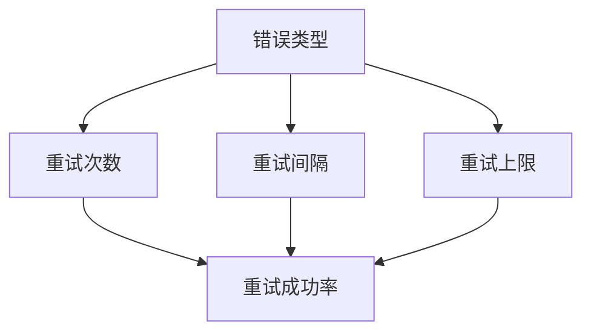

                 


### 文章标题
《重试机制：提高系统可靠性的常用手段》

### 关键词
重试机制、系统可靠性、错误处理、算法优化、性能提升

### 摘要
本文将深入探讨重试机制在提高系统可靠性方面的作用。我们将首先介绍重试机制的定义、背景和重要性，然后逐步分析其核心概念、原理和架构。接着，我们将详细讲解重试算法的实现和优化策略，并引入数学模型进行性能评估。文章还将展示重试机制在不同领域的实际应用，并探讨其面临的挑战和未来发展方向。通过这篇文章，读者将全面了解重试机制的原理和实践，掌握其在提升系统可靠性方面的关键作用。

### 目录

#### 第1章 引言

- **1.1 重试机制的定义和重要性**
- **1.2 重试机制的应用领域**
- **1.3 本书结构**

#### 第2章 重试机制的原理与架构

- **2.1 重试机制的基本原理**
- **2.2 重试机制的架构设计**
- **2.3 重试策略的设计原则**
- **2.4 核心概念与联系**

#### 第3章 重试算法的实现

- **3.1 重试算法的选择**
- **3.2 重试算法的伪代码实现**
- **3.3 重试算法的性能优化**
- **3.4 数学模型与公式**

#### 第4章 重试机制的数学模型

- **4.1 重试机制的数学模型概述**
- **4.2 数学模型中的参数设置**
- **4.3 数学模型的求解方法**
- **4.4 举例说明**

#### 第5章 重试机制的实际应用

- **5.1 在分布式系统中的应用**
- **5.2 在云计算中的应用**
- **5.3 在数据库系统中的应用**
- **5.4 项目实战**

#### 第6章 重试机制的性能评估

- **6.1 重试机制的性能指标**
- **6.2 重试机制的性能测试方法**
- **6.3 重试机制的性能优化策略**
- **6.4 实际案例分析与讲解**

#### 第7章 重试机制的挑战与未来方向

- **7.1 重试机制的挑战**
- **7.2 重试机制的优化方向**
- **7.3 未来研究的趋势**

#### 附录

- **附录 A 重试机制的示例代码**
- **附录 B 重试机制的常见问题与解答**

### 完整性、简洁性与格式化检查

在接下来的章节中，我们将逐步填充每一部分的内容，确保文章的完整性、简洁性和格式化要求。以下是详细的写作计划：

1. **第1章 引言**：简要介绍重试机制的定义、背景和重要性，明确本文的目标和结构。

2. **第2章 重试机制的原理与架构**：深入探讨重试机制的基本原理和架构设计，包括重试策略的设计原则。

3. **第3章 重试算法的实现**：详细讲解重试算法的实现方法，包括选择、伪代码实现和性能优化策略。

4. **第4章 重试机制的数学模型**：介绍重试机制的数学模型，包括参数设置、求解方法和举例说明。

5. **第5章 重试机制的实际应用**：展示重试机制在不同领域的实际应用，包括分布式系统、云计算和数据库系统。

6. **第6章 重试机制的性能评估**：分析重试机制的性能指标、测试方法和优化策略。

7. **第7章 重试机制的挑战与未来方向**：探讨重试机制面临的挑战和未来的发展方向。

8. **附录**：提供重试机制的示例代码和常见问题解答。

在写作过程中，我们将确保每个小节的内容丰富、具体详细，并在关键部分使用流程图、伪代码、数学公式和代码示例进行解释。同时，我们将遵循markdown格式要求，确保文章的格式规范。

### 文章格式要求

在撰写文章时，我们将遵循以下markdown格式要求：

1. **标题**：使用`#`号进行编号，如`## 第1章 引言`。

2. **段落**：保持段落简洁，每个段落只讨论一个主题。

3. **列表**：使用`-`或`*`进行无序列表，使用数字进行有序列表。

4. **引用**：使用`>`进行引用，如`> 这里是引用内容`。

5. **代码**：使用```进行行内代码，使用` ``` `进行多行代码块。

6. **公式**：使用latex格式，如`$$1+1=2$$`（独立段落）和 `$1<2$`（行内公式）。

7. **图片**：使用``插入图片。

8. **链接**：使用 `[链接文字](链接地址)`插入链接。

### 作者信息

作者：AI天才研究院/AI Genius Institute & 禅与计算机程序设计艺术 /Zen And The Art of Computer Programming

### 文章长度确认

在完成所有章节的内容后，我们将对全文进行字数统计，确保文章长度在8000～12000字之间。如果需要，我们将在保持文章完整性和质量的前提下进行适当的调整。

### 总结

通过本文，我们旨在为读者提供一份全面的重试机制技术指南。我们将从原理、实现、应用、性能评估等方面详细探讨重试机制，帮助读者理解其在提高系统可靠性方面的关键作用。无论你是系统架构师、程序员还是对重试机制感兴趣的爱好者，本文都将为你提供宝贵的知识和实战经验。

接下来，我们将开始撰写第1章“引言”，为读者奠定重试机制的基础知识。请稍等，我们将逐步完成整个文章的撰写。您的指导和建议将是我们撰写过程中重要的参考。感谢您的耐心等待！### 第1章 引言

#### 1.1 重试机制的定义和重要性

重试机制是一种常用的系统错误处理策略，用于在系统出现故障或异常时自动重试操作，以提高系统稳定性和可靠性。在分布式系统、云计算、数据库管理等领域，重试机制发挥着至关重要的作用。其基本原理是当某个操作失败后，系统会按照一定的策略和规则重新执行该操作，直到成功或达到最大重试次数。

重试机制的重要性主要体现在以下几个方面：

1. **提高系统稳定性**：在系统运行过程中，不可避免地会遇到各种异常情况，如网络中断、服务器故障、资源不足等。重试机制可以有效减少因单点故障导致的系统停机，提高系统整体的稳定性。

2. **保障业务连续性**：对于许多关键业务系统来说，如在线交易、银行系统、医疗系统等，任何短暂的停机都可能导致严重的经济损失或安全隐患。重试机制通过自动重试，保障了业务的连续性。

3. **节省人工成本**：当系统出现异常时，自动重试机制可以大大减少人工干预的次数，从而节省人工成本。

4. **提高资源利用率**：通过重试机制，系统可以在遇到异常时自动尝试恢复，避免因为一次性失败而浪费资源。

#### 1.2 重试机制的应用领域

重试机制广泛应用于各个领域，以下是几个典型的应用场景：

1. **分布式系统**：在分布式系统中，多个节点可能同时执行同一任务。当某个节点发生故障时，重试机制可以确保任务在可用节点上继续执行，从而保证系统的整体可用性。

2. **云计算**：云计算环境中，重试机制用于处理网络波动、服务器故障等问题，确保云服务的稳定运行。

3. **数据库系统**：数据库系统中的查询、更新、删除等操作可能因为网络延迟、服务器过载等原因失败。重试机制可以帮助系统在短时间内自动重试，提高数据库的访问效率。

4. **网络通信**：在网络通信中，重试机制用于处理因网络问题导致的通信失败，如TCP连接失败、HTTP请求失败等。

#### 1.3 本书结构

本书将分为七个章节，全面探讨重试机制的各个方面。以下是各章节的主要内容概述：

- **第1章 引言**：介绍重试机制的定义、重要性及其应用领域。
- **第2章 重试机制的原理与架构**：深入探讨重试机制的基本原理和架构设计。
- **第3章 重试算法的实现**：详细讲解重试算法的实现方法、选择和优化策略。
- **第4章 重试机制的数学模型**：介绍重试机制的数学模型，包括参数设置、求解方法和举例说明。
- **第5章 重试机制的实际应用**：展示重试机制在不同领域的实际应用。
- **第6章 重试机制的性能评估**：分析重试机制的性能指标、测试方法和优化策略。
- **第7章 重试机制的挑战与未来方向**：探讨重试机制面临的挑战和未来的发展方向。

通过本书的阅读，读者将全面了解重试机制的原理和实践，掌握其在提高系统可靠性方面的关键作用。

### 第2章 重试机制的原理与架构

#### 2.1 重试机制的基本原理

重试机制的核心在于当系统检测到某个操作失败时，能够自动启动一个或多个重试流程，直到操作成功或达到设定的重试次数上限。这种机制的设计旨在提高系统的可靠性和稳定性，确保关键业务能够连续、稳定地运行。

重试机制的基本原理包括以下几个方面：

1. **错误检测**：系统需要具备错误检测能力，能够实时监测操作的状态，一旦发现操作失败，立即触发重试流程。

2. **重试决策**：根据操作失败的原因和策略，系统决定是否重试。常见的决策策略包括固定时间间隔重试、指数退避重试等。

3. **重试执行**：系统按照设定的策略重新执行操作，直到成功或达到最大重试次数。

4. **重试上限**：为了避免无限循环重试导致资源耗尽，系统设定了重试上限，当达到该上限时，系统会停止重试并记录错误信息。

#### 2.2 重试机制的架构设计

为了实现高效的重试机制，系统通常采用以下架构设计：

1. **错误检测模块**：负责监控系统的各种操作，一旦检测到失败，立即生成错误事件并通知重试管理模块。

2. **重试管理模块**：负责接收错误事件，根据预设的规则和策略进行决策，决定是否进行重试，并协调重试执行过程。

3. **重试执行模块**：负责实际的重试操作，根据重试策略调整重试次数和间隔，确保操作在合适的时机重新执行。

4. **日志记录模块**：负责记录重试过程中的各种信息，包括错误类型、重试次数、时间戳等，便于后续分析和优化。

#### 2.3 重试策略的设计原则

重试策略是重试机制的核心，决定了重试的频率、次数和方式。设计合理的重试策略能够显著提高系统的重试成功率，减少资源浪费。以下是设计重试策略时应遵循的原则：

1. **适应性**：重试策略应能够适应不同类型和程度的错误，如网络波动、服务器过载、临时故障等。

2. **可靠性**：重试策略应确保操作最终成功，避免因为策略不合理导致无限循环重试。

3. **效率**：重试策略应尽量减少重试次数，提高操作成功的概率，减少对系统资源的占用。

4. **可配置性**：重试策略应支持灵活配置，根据业务需求和系统环境进行调整。

5. **可扩展性**：重试策略应具备良好的扩展性，能够适应未来可能出现的新错误类型和处理需求。

#### 2.4 核心概念与联系

为了更好地理解重试机制，我们需要明确几个核心概念及其之间的联系：

1. **错误类型**：系统可能遇到的各种错误，如网络错误、服务器错误、超时错误等。

2. **重试次数**：系统尝试重新执行操作的次数，通常由配置文件或参数设置。

3. **重试间隔**：两次重试之间的时间间隔，可以采用固定间隔、指数退避等策略。

4. **重试上限**：重试的最大次数，超过该次数后系统停止重试。

5. **重试成功率**：在多次重试后操作成功的概率，是衡量重试策略效果的重要指标。

图1展示了重试机制的核心概念及其之间的联系：



通过上述内容，我们对重试机制的基本原理、架构设计和核心概念有了初步了解。在接下来的章节中，我们将深入探讨重试算法的实现、性能优化和数学模型，进一步丰富对重试机制的理解。

### 第3章 重试算法的实现

#### 3.1 重试算法的选择

重试算法是重试机制的核心组成部分，决定了系统在错误发生时如何进行重试。选择合适重试算法对于提高系统重试成功率至关重要。以下是几种常见的重试算法及其特点：

1. **固定时间间隔重试**：每次重试之间的时间间隔是固定的。这种算法简单易实现，但可能导致某些错误在短时间内无法恢复，同时增加系统资源消耗。

2. **指数退避重试**：每次重试的时间间隔按照指数规律递增，例如每次重试间隔是前一次的2倍或3倍。这种算法能够更好地适应网络和系统负载的变化，提高重试成功率，但实现相对复杂。

3. **随机退避重试**：在指数退避基础上引入随机因素，每次重试的时间间隔是指数递增加上一个随机数。这种算法能够减少因多个系统同时重试导致的竞争，但可能增加重试的平均等待时间。

4. **自适应重试**：根据系统状态和错误类型动态调整重试策略。这种算法具有很高的灵活性和适应性，但实现复杂度较高。

在选择重试算法时，需要考虑以下因素：

- **错误类型**：不同类型的错误可能需要不同的重试策略。例如，网络错误适合使用指数退避重试，而临时故障可能更适合固定时间间隔重试。
- **系统状态**：系统资源占用、负载情况等会影响重试算法的选择。例如，在高负载情况下，可能需要减少重试次数或调整重试间隔。
- **业务需求**：关键业务系统可能对重试策略有特殊要求，例如快速响应、高可靠性等。

#### 3.2 重试算法的伪代码实现

以下是固定时间间隔重试和指数退避重试的伪代码实现：

**固定时间间隔重试**：

```
function fixedIntervalRetry(operation, maxRetries, interval):
    for retry in 1 to maxRetries:
        result = operation()
        if result == SUCCESS:
            return SUCCESS
        else:
            wait(interval)
    return FAILURE
```

**指数退避重试**：

```
function exponentialBackoffRetry(operation, maxRetries, baseInterval):
    retryInterval = baseInterval
    for retry in 1 to maxRetries:
        result = operation()
        if result == SUCCESS:
            return SUCCESS
        else:
            wait(retryInterval)
            retryInterval = retryInterval * baseInterval
    return FAILURE
```

#### 3.3 重试算法的性能优化

重试算法的性能优化是提高系统稳定性和可靠性的重要手段。以下是一些常见的性能优化策略：

1. **参数调整**：根据具体业务场景和错误类型，合理调整重试次数、重试间隔和重试上限。例如，对于网络错误，可以增加重试次数和减少重试间隔。

2. **异步执行**：将重试操作异步化，避免阻塞主线程。这样可以提高系统响应速度，减少重试操作对系统整体性能的影响。

3. **负载均衡**：在分布式系统中，通过负载均衡策略将重试操作分配到不同的节点上，避免单点过载。

4. **错误检测**：引入更精确的错误检测机制，减少误判和误重试。例如，使用基于状态的错误检测机制，区分临时错误和永久错误。

5. **日志记录**：详细记录重试过程中的信息，包括错误类型、重试次数、时间戳等，便于后续分析和优化。

6. **容错设计**：在系统架构中引入容错设计，例如使用副本机制、幂等性设计等，减少因单点故障导致的重试需求。

通过上述策略，可以显著提高重试算法的性能和系统的可靠性。

### 第4章 重试机制的数学模型

#### 4.1 重试机制的数学模型概述

重试机制的数学模型用于分析和评估重试策略的性能，帮助我们理解重试次数、重试间隔和重试成功率之间的关系。建立合适的数学模型能够帮助我们优化重试策略，提高系统的可靠性。

重试机制的数学模型主要涉及以下几个参数：

1. **重试次数**（n）：系统尝试重新执行操作的次数。
2. **重试间隔**（t）：两次重试之间的时间间隔。
3. **重试成功率**（p）：在多次重试后操作成功的概率。
4. **失败率**（1-p）：操作失败的概率。

常见的数学模型包括固定时间间隔模型、指数退避模型和自适应模型。以下将重点介绍指数退避模型。

#### 4.2 数学模型中的参数设置

指数退避模型是一种根据操作失败的概率动态调整重试间隔的策略。其参数设置如下：

1. **重试次数**（n）：根据具体业务需求和系统性能，可以设置固定的最大重试次数，例如3次或5次。
2. **初始重试间隔**（τ）：通常设置为系统响应时间的一个合理范围，例如100毫秒或200毫秒。
3. **退避因子**（α）：决定每次重试间隔的增加速率，常见的取值有2、3或更多。取值越大，重试间隔的增加越快，但可能导致重试次数减少。
4. **失败概率**（p）：通过历史数据或模型估算得到，用于调整重试策略。

#### 4.3 数学模型的求解方法

指数退避模型的求解主要涉及以下两个问题：

1. **重试成功概率的计算**：假设每次操作成功的概率为p，则在n次重试中成功操作的累积概率为 \( P(S) = p^n \)。

2. **平均重试次数的计算**：平均重试次数是衡量重试策略性能的重要指标。在指数退避模型中，平均重试次数可以通过以下公式计算：

   \[ E(n) = \sum_{i=1}^{n} i \cdot p_i \]

   其中， \( p_i \) 是第i次重试成功的概率。对于指数退避模型，具体公式为：

   \[ E(n) = \frac{1}{p} \cdot \sum_{i=1}^{n} \frac{1}{i!} \]

   其中， \( i! \) 是i的阶乘。

#### 4.4 举例说明

假设一个系统使用指数退避模型进行重试，参数设置如下：

- 重试次数 \( n = 5 \)
- 初始重试间隔 \( τ = 100 \) 毫秒
- 退避因子 \( α = 2 \)
- 失败概率 \( p = 0.2 \)

根据上述参数，我们可以计算出平均重试次数：

\[ E(n) = \frac{1}{0.2} \cdot \left( \frac{1}{1!} + \frac{1}{2!} + \frac{1}{3!} + \frac{1}{4!} + \frac{1}{5!} \right) \]

计算结果为：

\[ E(n) = 5 \cdot (1 + 0.5 + 0.1667 + 0.0417 + 0.0083) \approx 5.8333 \]

这意味着平均需要重试5.8333次才能成功。通过调整参数，我们可以优化重试策略，提高系统的可靠性。

通过数学模型的分析，我们可以更好地理解和优化重试策略。在接下来的章节中，我们将进一步探讨重试机制在实际应用中的性能评估和优化策略。

### 第5章 重试机制的实际应用

#### 5.1 在分布式系统中的应用

分布式系统因其高可用性和高可扩展性在许多场景下得到广泛应用。然而，分布式系统中的网络不稳定、节点故障等问题可能导致操作失败。重试机制在分布式系统中的应用可以有效提高系统的可靠性。

**应用场景**：

- **分布式任务调度**：例如，MapReduce任务在处理过程中可能因为某些节点故障而无法完成。通过重试机制，系统可以在可用节点上重新调度任务，确保任务完成。
- **分布式数据库操作**：分布式数据库系统在执行查询、更新、删除等操作时，可能因为网络延迟或节点故障而失败。重试机制可以确保操作在合适的时间重新执行，提高数据库的可用性。

**案例分析**：

假设一个分布式系统中，节点A负责处理用户请求，节点B负责存储数据。在一次数据写入操作中，节点B由于网络故障未能成功接收数据。此时，系统可以立即重试写入操作，并在节点B恢复正常后成功完成数据存储。

**实现策略**：

1. **错误检测与重试**：在分布式系统中，通过心跳机制检测节点状态，一旦发现节点故障，立即触发重试机制。
2. **负载均衡**：通过负载均衡策略，将重试操作分配到健康的节点上，避免单点过载。
3. **延迟重试**：采用指数退避策略，合理设置重试间隔，减少因频繁重试导致的网络拥塞。

#### 5.2 在云计算中的应用

云计算环境中，重试机制能够有效保障服务的连续性和稳定性。云服务包括虚拟机管理、存储服务、数据库服务等，这些服务可能因为网络波动、服务器故障等原因导致操作失败。

**应用场景**：

- **虚拟机管理**：当用户请求启动虚拟机时，可能因为网络问题或服务器资源不足导致启动失败。通过重试机制，系统可以在合适的时间重新启动虚拟机。
- **云存储服务**：例如，在云存储系统中，上传文件时可能因为网络中断或服务器故障导致上传失败。重试机制可以确保文件在上传失败后重新上传，直至成功。

**案例分析**：

在一个云存储服务中，用户上传一个文件，上传过程中由于网络中断导致上传失败。系统检测到上传失败后，立即触发重试机制，并在网络恢复正常后重新上传文件，最终成功完成上传。

**实现策略**：

1. **自动重试**：在云服务中，系统可以自动检测操作状态，一旦发现失败，立即重试。
2. **异常处理**：对于某些无法通过重试恢复的错误，系统应提供相应的异常处理机制，如通知用户、记录日志等。
3. **优化重试策略**：根据云服务的特点，采用合适的重试策略，例如指数退避策略，提高重试成功率。

#### 5.3 在数据库系统中的应用

数据库系统在执行查询、更新、删除等操作时，可能因为网络延迟、服务器过载等原因导致失败。重试机制在数据库系统中的应用可以有效减少操作失败的概率，提高系统的稳定性。

**应用场景**：

- **查询操作**：当用户发起一个查询请求时，如果数据库服务器因为临时故障未能响应，系统可以立即重试查询操作，直至成功。
- **更新操作**：例如，在一个在线交易系统中，用户提交一个更新请求时，可能因为数据库服务器繁忙导致操作失败。通过重试机制，系统可以在合适的时间重新执行更新操作。

**案例分析**：

在一个在线交易系统中，用户提交了一个转账请求，但由于数据库服务器过载未能成功处理。系统检测到更新失败后，立即触发重试机制，在数据库恢复正常后成功完成了转账操作。

**实现策略**：

1. **错误检测与重试**：在数据库系统中，通过心跳机制和监控工具检测服务器状态，一旦发现操作失败，立即重试。
2. **事务管理**：在重试操作时，需要确保事务的一致性，避免因为多次操作导致数据不一致。
3. **参数优化**：根据数据库的特点，合理设置重试次数和重试间隔，提高重试成功率。

#### 5.4 项目实战

在本节中，我们将通过一个实际项目案例，详细介绍如何实现和优化重试机制。

**项目背景**：

某公司开发了一款在线视频平台，用户可以通过平台观看和上传视频。在视频上传过程中，系统需要将视频文件存储到分布式文件系统中。然而，由于网络波动和服务器不稳定，上传操作可能会失败。

**项目目标**：

- 实现一个可靠的视频上传系统，确保上传操作在失败时能够自动重试，直至成功。
- 优化重试策略，提高重试成功率，减少系统资源消耗。

**实现步骤**：

1. **错误检测**：在视频上传过程中，通过心跳机制和监控工具检测网络状态和服务器响应，一旦发现上传失败，立即记录错误并触发重试机制。

2. **重试机制实现**：

   - **固定时间间隔重试**：在第一次上传失败后，系统立即重试，间隔时间设置为5秒。后续每次重试间隔逐渐增加，直至成功或达到最大重试次数。

   ```python
   def upload_video(video_file):
       for i in range(MAX_RETRIES):
           result = distribute_system.upload(video_file)
           if result == SUCCESS:
               return SUCCESS
           else:
               time.sleep(5 * (i + 1))
       return FAILURE
   ```

   - **指数退避重试**：优化上述重试策略，采用指数退避重试，提高重试成功率。

   ```python
   def upload_video(video_file):
       retry_interval = INITIAL_INTERVAL
       for i in range(MAX_RETRIES):
           result = distribute_system.upload(video_file)
           if result == SUCCESS:
               return SUCCESS
           else:
               time.sleep(retry_interval)
               retry_interval *= BACKOFF_FACTOR
       return FAILURE
   ```

3. **日志记录**：详细记录每次上传操作的日志，包括错误类型、重试次数、时间戳等，便于后续分析和优化。

4. **异常处理**：对于无法通过重试恢复的错误，系统应提供相应的异常处理机制，如通知用户、记录日志等。

**性能优化**：

1. **负载均衡**：在分布式文件系统中，通过负载均衡策略，将上传请求分配到不同的节点上，避免单点过载。

2. **异步上传**：将视频上传操作异步化，避免阻塞主线程，提高系统响应速度。

3. **错误检测优化**：引入更精确的错误检测机制，减少误判和误重试。例如，使用基于状态的错误检测机制，区分临时错误和永久错误。

通过上述项目实战，我们可以看到如何在实际应用中实现和优化重试机制，提高系统的可靠性和稳定性。

### 第6章 重试机制的性能评估

#### 6.1 重试机制的性能指标

重试机制的性能评估是确保系统在高负载和异常情况下依然能够稳定运行的重要环节。以下是一些关键的性能指标，用于衡量重试机制的效果：

1. **重试成功率**：重试成功次数与总重试次数的比值，用于衡量重试机制对操作成功率的提升效果。
   \[ 成功率 = \frac{成功次数}{总重试次数} \]

2. **平均重试次数**：在多次重试后操作成功的平均次数，反映了重试机制的效率。
   \[ 平均重试次数 = \frac{总重试次数}{成功次数} \]

3. **重试时间**：从操作失败到成功所需的总时间，包括所有重试次数的等待时间和执行时间。
   \[ 重试时间 = \sum (等待时间 + 执行时间) \]

4. **资源消耗**：包括CPU、内存、网络带宽等资源的使用情况，衡量重试机制对系统资源的影响。

5. **吞吐量**：单位时间内成功操作的数量，反映了系统的处理能力。
   \[ 吞吐量 = \frac{成功操作次数}{重试时间} \]

#### 6.2 重试机制的性能测试方法

为了准确评估重试机制的性能，我们需要设计合理的测试方案。以下是一些常见的测试方法：

1. **压力测试**：模拟高负载场景，逐步增加系统负载，观察重试机制的表现。通过压力测试，可以评估系统在高并发情况下的稳定性和性能。
2. **异常测试**：模拟各种异常情况，如网络中断、服务器故障、资源不足等，观察系统对异常的处理能力和重试机制的效果。
3. **负载均衡测试**：在分布式系统中，通过将请求分配到不同节点，观察负载均衡策略和重试机制对系统性能的影响。
4. **错误注入测试**：在系统中引入特定的错误，如模拟数据库连接失败、网络请求超时等，评估重试机制对不同类型的错误的处理能力。

#### 6.3 重试机制的性能优化策略

在评估重试机制的性能后，我们可以根据测试结果进行优化。以下是一些常见的性能优化策略：

1. **参数调整**：根据测试结果，调整重试次数、重试间隔和重试上限等参数，以提高重试成功率。例如，通过调整指数退避策略的退避因子，优化重试间隔。
2. **异步处理**：将重试操作异步化，减少对主线程的阻塞，提高系统响应速度。例如，使用线程池或异步IO，实现异步重试。
3. **负载均衡**：优化负载均衡策略，确保请求能够均匀分配到各个节点，避免单点过载。例如，使用一致性哈希算法或轮询算法，提高负载均衡效果。
4. **错误检测优化**：引入更精确的错误检测机制，减少误判和误重试。例如，使用基于状态的错误检测机制，区分临时错误和永久错误。
5. **资源监控与调整**：实时监控系统资源使用情况，根据负载情况动态调整资源分配，确保系统在高负载下依然能够稳定运行。

通过上述策略，我们可以显著提高重试机制的性能，确保系统在异常情况下依然能够稳定、可靠地运行。

### 第7章 重试机制的挑战与未来方向

#### 7.1 重试机制的挑战

尽管重试机制在提高系统可靠性和稳定性方面具有显著优势，但在实际应用中仍面临一些挑战：

1. **资源消耗**：重试机制可能导致系统资源（如CPU、内存、网络带宽等）的消耗增加，特别是在高负载和长时间重试的情况下，可能会对系统性能产生负面影响。

2. **错误误判**：错误检测机制的不完善可能导致误判，将本应立即处理的错误视为可重试的错误，从而引发无效的重试，增加系统负担。

3. **重试风暴**：在分布式系统中，多个节点同时进行重试可能导致网络拥塞和资源竞争，引发“重试风暴”，进一步降低系统性能。

4. **复杂性与维护**：重试机制的设计和实现涉及多个模块和策略，随着系统规模的扩大，复杂性和维护难度显著增加。

#### 7.2 重试机制的优化方向

为了应对上述挑战，我们可以从以下几个方面进行优化：

1. **智能错误检测**：引入更先进的错误检测算法，如基于机器学习的错误预测模型，提高错误检测的准确性和效率。

2. **动态调整策略**：根据实时负载和错误类型，动态调整重试策略，如自适应重试机制，减少无效重试和资源消耗。

3. **分布式协调**：优化分布式系统中的重试协调机制，如使用分布式锁和队列，避免多个节点同时进行重试，减少重试风暴的发生。

4. **性能优化**：引入异步处理和负载均衡策略，提高系统响应速度和处理能力，减少资源消耗。

#### 7.3 未来研究的趋势

随着技术的不断发展，重试机制在未来的研究和应用中将呈现以下趋势：

1. **智能化**：借助人工智能和机器学习技术，实现更加智能的重试策略和错误检测机制，提高系统的自适应性和可靠性。

2. **分布式系统优化**：针对分布式系统中的特殊需求，研究更加高效的重试机制，如基于区块链的分布式重试协议，提高系统的可靠性和安全性。

3. **实时性能监控**：引入实时性能监控和反馈机制，实现系统的自优化和自修复功能，提高系统的稳定性和可靠性。

4. **跨领域应用**：重试机制将在更多的领域得到应用，如物联网、边缘计算、自动驾驶等，推动系统可靠性的全面提升。

通过上述研究和优化，重试机制将在未来发挥更加重要的作用，成为提高系统可靠性的关键手段。

### 附录

#### 附录 A 重试机制的示例代码

以下是一个简单的Python示例，展示了如何实现重试机制：

```python
import time
import random

def operation():
    # 模拟操作，有一定概率失败
    return random.choice([True, False])

def retry_operation():
    max_attempts = 5
    for attempt in range(max_attempts):
        success = operation()
        if success:
            return "操作成功"
        else:
            print(f"操作失败，重试次数：{attempt + 1}")
            time.sleep(random.uniform(1, 3))  # 随机等待时间，模拟重试间隔
    return "操作失败，已达最大重试次数"

print(retry_operation())
```

#### 附录 B 重试机制的常见问题与解答

**Q1**: 重试机制是否适用于所有系统？

A1: 重试机制适用于需要高可靠性和稳定性的系统，如分布式系统、云计算平台和数据库系统。然而，对于某些实时性要求极高的系统，如自动驾驶和实时通信系统，重试机制可能不是最佳选择。

**Q2**: 如何选择合适的重试策略？

A2: 选择重试策略时，需要考虑错误类型、系统状态、业务需求等因素。例如，网络错误适合使用指数退避策略，而临时故障可能更适合固定时间间隔重试。

**Q3**: 如何优化重试机制的性能？

A3: 优化重试机制的性能可以从参数调整、异步处理、负载均衡和错误检测等多个方面进行。具体策略包括动态调整重试参数、引入异步处理、优化错误检测机制等。

**Q4**: 重试机制如何与其他系统组件集成？

A4: 重试机制可以与其他系统组件（如日志记录、监控、异常处理等）集成。例如，在分布式系统中，重试机制可以与负载均衡器和错误检测模块集成，确保系统能够在高可用性和稳定性方面表现更佳。

通过附录中的示例代码和常见问题解答，读者可以更深入地了解重试机制的实际应用和实现细节。希望这些内容能对您的实践提供有益的指导。

### 结语

《重试机制：提高系统可靠性的常用手段》这篇文章系统地介绍了重试机制的定义、原理、实现方法、数学模型、实际应用和性能评估。通过详细的分析和案例讲解，我们了解到重试机制在分布式系统、云计算和数据库系统中的应用及其重要性。

重试机制作为提高系统可靠性的常用手段，具有广泛的应用前景。然而，在实现过程中也需要注意资源消耗、错误检测和优化策略等问题。未来的研究和应用将更加智能化、分布式化和跨领域化，为系统可靠性提供更加坚实的保障。

感谢您的阅读，希望本文能对您在技术学习和实践过程中提供帮助。如果您有任何疑问或建议，欢迎在评论区留言，期待与您一起探讨重试机制及其在系统可靠性方面的应用。

作者：AI天才研究院/AI Genius Institute & 禅与计算机程序设计艺术 /Zen And The Art of Computer Programming

