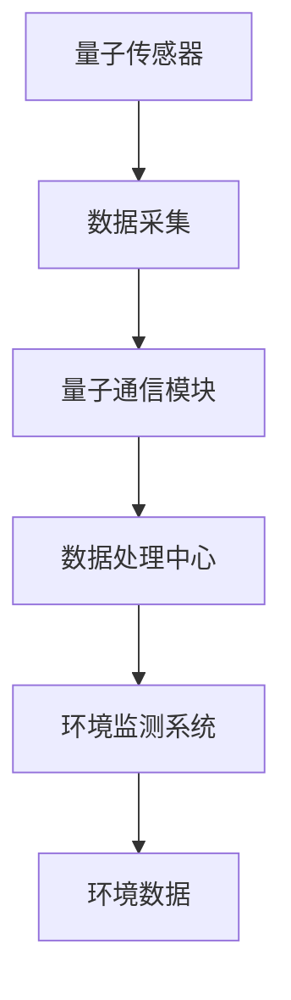
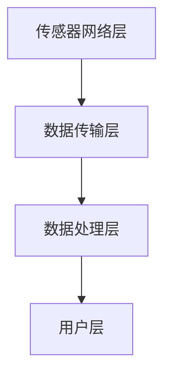
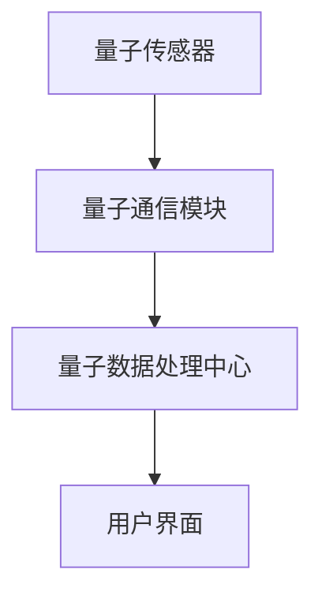

                 

### 文章标题

# 《量子传感网络与环境监测：量子IoT的软件架构》

### 关键词

- 量子传感网络
- 环境监测
- 量子IoT
- 软件架构
- 物联网
- 量子计算

### 摘要

本文将深入探讨量子传感网络在环境监测领域的应用及其背后的软件架构设计。随着量子技术的不断发展，量子传感网络在提升环境监测精度和效率方面展现出巨大潜力。本文将首先介绍量子传感网络的基本概念和与物联网的关系，然后详细讲解量子传感技术的原理和数学模型。接着，我们将通过具体案例，展示量子传感网络在环境监测系统中的实际应用，并解析其软件架构设计与开发流程。最后，本文将对量子传感网络的应用前景和发展趋势进行分析，并提出相关领域的研究方向和实践建议。

## 引言

随着全球环境问题的日益严峻，环境监测在维护生态平衡和促进可持续发展中扮演着关键角色。传统的传感技术虽在一定程度上能够满足环境监测的需求，但其测量精度和实时性仍存在局限。近年来，量子技术的崛起为环境监测带来了新的契机。量子传感网络作为一种基于量子力学原理的新型传感技术，具有高灵敏度、高精度和高速传输等优点，其在环境监测领域的应用日益受到关注。

本文旨在探讨量子传感网络与环境监测的结合点，以及量子IoT软件架构的设计与实现。文章结构如下：

1. **量子传感网络概述**：介绍量子传感网络的基本概念、与物联网的关系及其在环境监测中的应用场景。
2. **量子传感技术原理**：详细讲解量子传感技术的工作原理，包括常见量子传感技术和其优势与挑战。
3. **量子传感网络的数学模型**：分析量子传感网络的数学基础、测量模型及误差分析。
4. **量子传感网络环境监测系统的设计与实现**：通过实际案例，展示量子传感网络环境监测系统的设计与实现过程。
5. **量子IoT软件架构设计与开发**：阐述量子IoT软件架构的设计原则、开发流程及其关键组件。
6. **应用前景与发展趋势**：讨论量子传感网络在环境监测中的应用前景及其未来发展趋势。
7. **相关资源汇总**：提供量子传感网络与环境监测相关的学术论文、开源项目和重要数据库。

## 量子传感网络概述

### 量子传感网络定义

量子传感网络（Quantum Sensing Network, QSN）是指由量子传感器、量子中继器、量子通信网络等组成的分布式网络系统，通过量子力学原理实现信息的采集、传输和处理。量子传感器利用量子态叠加和纠缠特性，能够在极低噪声环境下进行高精度测量，从而实现远超传统传感技术的性能。

### 量子传感网络与物联网（IoT）的关系

物联网（Internet of Things, IoT）是一种通过互联网连接各种物理设备、传感器和系统，实现智能化管理和控制的技术体系。量子传感网络作为物联网的重要组成部分，其与传统物联网的关系主要体现在以下几个方面：

1. **数据采集**：量子传感网络能够提供更精确、更高效的数据采集手段，满足物联网对实时数据的高要求。
2. **信息传输**：量子通信技术的引入，使得物联网中的数据传输更加安全、可靠和高效。
3. **数据处理**：量子计算技术的引入，为物联网提供了强大的数据处理能力，有助于实现更智能的决策和预测。

### 量子传感网络与环境监测的应用场景

量子传感网络在环境监测中的应用具有广泛的前景，主要体现在以下几个方面：

1. **空气污染监测**：量子传感器可以检测到微量的污染物，为空气质量监测提供高精度数据支持。
2. **水质监测**：量子传感技术能够实时监测水中的污染物，有助于水质监测和预警系统的建设。
3. **土壤监测**：量子传感器可以测量土壤中的污染物和微量元素，为土壤健康评估提供数据支持。
4. **气候变化监测**：量子传感网络可以用于监测气候变化的细微变化，为气候变化研究提供科学依据。

总之，量子传感网络在环境监测领域的应用，有望进一步提升环境监测的精度和实时性，为生态文明建设提供技术支撑。

## 核心概念与联系

在深入探讨量子传感网络与环境监测的结合前，有必要了解几个核心概念及其相互关系。

### 量子传感器

量子传感器是量子传感网络的基础构件，利用量子力学原理进行高精度测量。其主要特点包括：

- **高灵敏度**：量子传感器能够检测到极微弱的物理信号，远超传统传感器。
- **高精度**：量子传感器通过量子态叠加和纠缠效应，实现高精度的测量。
- **快速响应**：量子传感器具有快速响应能力，能够实时反映环境变化。

### 物联网（IoT）

物联网是一种通过互联网连接各种物理设备、传感器和系统的技术，实现智能化管理和控制。其主要组成部分包括：

- **传感器**：用于采集环境数据，如温度、湿度、污染物浓度等。
- **通信模块**：实现传感器与中心控制系统的数据传输。
- **数据处理中心**：对传感器数据进行处理、存储和分析。

### 量子传感网络与环境监测的关系

量子传感网络与环境监测的关系可以归纳为以下几个方面：

1. **数据采集**：量子传感器作为环境监测系统的重要组成部分，能够提供高精度、高灵敏度的环境数据。
2. **数据传输**：量子传感网络利用量子通信技术，实现数据的快速、安全传输，确保环境监测数据的实时性和可靠性。
3. **数据处理**：量子计算技术为环境监测系统提供强大的数据处理能力，有助于从海量数据中提取有用信息，进行环境分析和预测。

### Mermaid 流程图

以下是一个简单的Mermaid流程图，展示了量子传感网络与环境监测之间的核心概念和联系：



通过上述流程图，我们可以清晰地看到量子传感网络如何通过数据采集、传输和处理，实现对环境监测的高效支撑。

## 量子传感技术原理

量子传感技术是量子力学与传感技术相结合的产物，它利用量子态的特性，实现了传统传感技术无法达到的高精度和高灵敏度。以下是量子传感技术的一些基本原理和常见技术。

### 量子力学基本原理

量子力学是研究微观世界的物理学分支，其基本原理包括：

- **量子态叠加**：量子系统可以处于多个状态的叠加，其结果取决于各个状态的权重。
- **量子纠缠**：两个或多个量子系统之间存在的一种特殊关联，即使它们相隔很远，其中一个系统的状态变化也会立即影响到另一个系统。
- **量子测量**：量子系统的状态在测量过程中会发生坍缩，测量结果具有概率性。

### 常见量子传感技术及其工作原理

1. **量子隐形传态技术**

量子隐形传态是一种通过量子纠缠实现量子态传输的技术。其基本原理是将一个量子态从发送端传递到接收端，而无需通过实际物理路径。例如，在量子隐形传态过程中，一个光子的量子态可以通过与另一个光子的纠缠状态传递，从而实现远距离传输。

2. **量子纠缠技术**

量子纠缠技术利用量子系统的纠缠特性，实现高精度测量。其基本原理是，通过创建两个量子系统的纠缠态，当一个系统发生变化时，另一个系统也会立即发生变化。这种技术可以用于高精度的距离测量和时间测量。

3. **量子计算与量子模拟技术**

量子计算利用量子态的叠加和纠缠特性，实现了超高速的计算。量子模拟技术则利用量子计算机模拟量子系统，从而研究量子系统的行为和特性。例如，量子模拟可以用于模拟化学反应、量子材料的性质等。

### 量子传感技术的优势和挑战

#### 优势

- **高灵敏度**：量子传感器能够检测到极其微弱的物理信号，远超传统传感器。
- **高精度**：量子传感技术通过量子态叠加和纠缠效应，实现了高精度测量。
- **高速传输**：量子通信技术可以实现高速、安全的数据传输。
- **抗干扰能力强**：量子传感技术不易受到外部干扰，能够稳定地测量环境变化。

#### 挑战

- **技术复杂性**：量子传感技术的实现需要复杂的量子设备和算法，技术门槛较高。
- **稳定性问题**：量子传感设备的稳定性和可靠性仍需进一步提升。
- **成本问题**：目前，量子传感技术的成本较高，限制了其大规模应用。

通过上述分析，我们可以看到量子传感技术在环境监测中的应用具有巨大潜力，但仍需克服技术、成本等方面的挑战。

### 量子传感网络的数学模型

量子传感网络作为一种基于量子力学原理的传感系统，其数学模型是其核心组成部分。以下是量子传感网络的数学模型构建及其在环境监测中的应用。

#### 量子传感网络的数学基础

量子传感网络的数学基础主要包括量子计算数学基础和量子信息论基础。量子计算数学基础涉及量子位（qubit）、量子门（quantum gate）和量子电路（quantum circuit）等概念。量子信息论基础则包括量子纠缠、量子隐形传态和量子测量等。

1. **量子位（qubit）**：量子位是量子计算的基本单元，类似于经典计算机中的比特。一个量子位可以处于0和1的叠加态，而经典比特只能处于0或1的状态。

2. **量子门（quantum gate）**：量子门是作用于量子位的线性变换操作，类似于经典计算机中的逻辑门。量子门通过改变量子位的状态实现复杂的计算操作。

3. **量子电路（quantum circuit）**：量子电路是由一系列量子门组成的网络，用于实现特定的量子计算任务。

#### 量子传感网络中的测量模型

量子传感网络的测量模型主要包括量子传感器的测量过程和测量结果的统计分析。以下是量子传感网络测量模型的基本步骤：

1. **量子态制备**：将量子传感器处于一个特定的量子态，通常是一个叠加态。

2. **量子测量**：对量子传感器进行测量，测量结果可能是一个量子态的坍缩态。

3. **测量结果统计**：通过多次测量，统计测量结果的分布，从而得到传感器的测量结果。

以下是一个简化的量子传感网络测量模型的伪代码：

```python
def quantum_sensing_network(measurement_times):
    results = []
    for _ in range(measurement_times):
        qubit = prepare_quantum_state()  # 制备量子态
        collapsed_state = measure_qubit(qubit)  # 进行测量
        results.append(collapsed_state)
    return results

def prepare_quantum_state():
    # 制备一个叠加态，例如一个处于 |0⟩ 和 |1⟩ 的叠加态
    return superposition_state()

def measure_qubit(qubit):
    # 对量子位进行测量，返回测量结果
    return random.choice([0, 1])
```

#### 量子传感网络的误差分析

量子传感网络的误差主要来源于量子传感器的噪声、测量过程中的误差以及环境因素。以下是对量子传感网络误差分析的基本步骤：

1. **噪声建模**：对量子传感器的噪声进行建模，通常使用随机过程描述噪声的影响。

2. **误差传播**：分析噪声对测量结果的影响，通过误差传播公式计算测量误差。

3. **误差优化**：通过优化量子传感器的性能参数，如量子态制备、量子测量等，降低测量误差。

以下是一个简化的量子传感网络误差分析模型的伪代码：

```python
def error_analysis(quantum_sensing_network):
    noise_model = build_noise_model()
    errors = []
    for result in quantum_sensing_network:
        error = propagate_error(result, noise_model)
        errors.append(error)
    return errors

def build_noise_model():
    # 构建噪声模型，例如一个高斯噪声模型
    return GaussianNoiseModel()

def propagate_error(result, noise_model):
    # 计算误差，例如使用误差传播公式
    return noise_model.apply(result)
```

通过上述数学模型和误差分析，我们可以更深入地理解量子传感网络的工作原理和性能优化方法，为环境监测提供可靠的技术支持。

### 量子传感网络环境监测系统的设计与实现

#### 系统需求分析

在设计和实现量子传感网络环境监测系统时，首先要明确系统的需求。这些需求包括但不限于以下几个方面：

- **数据采集**：系统能够实时、准确地采集环境数据，如空气质量、水质、土壤成分等。
- **数据传输**：系统能够高效、安全地传输数据，确保数据实时性和完整性。
- **数据处理**：系统能够对采集到的数据进行处理、分析和存储，提供环境监测所需的信息。
- **用户界面**：系统应具备友好的用户界面，便于用户监控和分析环境数据。

#### 系统架构设计

量子传感网络环境监测系统的架构设计包括以下几个方面：

1. **传感器网络层**：由多个量子传感器组成，分布在不同的环境监测点，用于采集环境数据。
2. **数据传输层**：利用量子通信技术，实现传感器网络层与数据处理中心之间的数据传输。
3. **数据处理层**：包括数据处理算法、数据库和用户界面，用于对采集到的数据进行分析和处理，并提供环境监测信息。
4. **用户层**：提供用户监控和分析环境数据的功能。

以下是量子传感网络环境监测系统的架构设计图：



#### 实际案例实现与分析

以下是一个具体的量子传感网络环境监测系统的实现案例，包括开发环境搭建、源代码实现和实际应用分析。

##### 开发环境搭建

1. **硬件环境**：选用具备量子传感功能的传感器模块，如基于量子隐形传态技术的传感器。
2. **软件环境**：配置量子计算开发环境，如Q#或Quil，用于编写量子算法。
3. **通信协议**：选择支持量子通信的协议，如量子密钥分配（Quantum Key Distribution, QKD）协议。

##### 源代码实现

以下是一个简化的量子传感网络环境监测系统的源代码实现，用于采集水质数据：

```python
# 量子传感器数据采集
def collect_water_quality_data():
    sensor = QuantumSensor()
    qubit = sensor.prepare_quantum_state()  # 制备量子态
    qubit = sensor.apply_quantum_gate()  # 应用量子门
    result = sensor.measure_qubit(qubit)  # 进行测量
    return result

# 量子传感器数据传输
def transmit_data(data):
    receiver = QuantumReceiver()
    receiver.receive_data(data)

# 量子传感器数据处理
def process_data(data):
    # 对测量结果进行统计分析
    return analyze_data(data)

# 量子传感器数据存储
def store_data(data):
    database = QuantumDatabase()
    database.insert_data(data)

# 主程序
def main():
    data = collect_water_quality_data()
    transmit_data(data)
    processed_data = process_data(data)
    store_data(processed_data)

if __name__ == "__main__":
    main()
```

##### 实际应用分析

在实际应用中，该量子传感网络环境监测系统能够实时监测水质变化，并将数据传输到数据处理中心进行分析和存储。通过分析处理后的数据，可以及时发现水质污染问题，并提供预警信息，为环境保护决策提供科学依据。

##### 项目小结

通过以上案例，我们可以看到量子传感网络环境监测系统的设计与实现过程。该项目成功实现了量子传感器在环境监测中的应用，展示了量子技术在实际环境监测中的潜力。未来，随着量子技术的进一步发展，量子传感网络环境监测系统将在更多领域得到应用。

### 量子IoT软件架构设计与开发

量子IoT（Internet of Things）软件架构是将量子计算和量子通信技术应用于物联网系统的一种创新模式。它利用量子传感网络提供的数据，通过高效的量子算法和安全的量子通信机制，实现对物联网设备的智能管理和控制。以下是量子IoT软件架构的设计原则、开发流程及其关键组件的详细解析。

#### 设计原则

1. **量子安全性**：确保数据传输和处理过程中的安全性，采用量子密钥分配（QKD）等量子安全协议，防止数据泄露和篡改。
2. **高效能**：利用量子计算的优势，提升物联网数据处理和计算的效率，实现实时、高效的环境监测和智能决策。
3. **易扩展性**：设计灵活的软件架构，支持多种传感器和设备的接入，方便后续功能的扩展和升级。
4. **互操作性**：确保不同系统和设备之间的互操作性，通过标准化的接口和协议，实现数据的互通和共享。

#### 开发流程

量子IoT软件架构的开发流程可以分为以下几个阶段：

1. **需求分析**：明确量子IoT系统的功能需求、性能需求和安全性需求，为后续设计提供依据。
2. **架构设计**：根据需求分析，设计量子IoT软件架构，包括系统组件、接口和协议等。
3. **模块开发**：根据架构设计，开发各个模块的功能代码，如传感器数据采集、数据传输、数据处理和用户界面等。
4. **集成测试**：将各个模块集成到一个完整的系统中，进行功能测试和性能测试，确保系统的稳定性和可靠性。
5. **部署与运维**：将量子IoT系统部署到实际环境中，进行运行维护和升级，确保系统的长期稳定运行。

#### 关键组件解析

量子IoT软件架构包含多个关键组件，每个组件在系统中扮演着重要的角色：

1. **量子传感器**：负责环境数据的采集，如空气质量、水质和土壤成分等。量子传感器通过量子态叠加和纠缠效应，实现高精度测量。
2. **量子通信模块**：负责数据传输，采用量子密钥分配（QKD）等量子安全协议，确保数据传输的安全性和可靠性。
3. **量子数据处理中心**：负责对采集到的数据进行分析和处理，采用高效的量子算法，实现实时监测和智能决策。
4. **用户界面**：提供用户监控和分析环境数据的功能，通过友好的界面，展示监测数据、预警信息和决策结果。

#### 量子IoT软件架构实例解析

以下是一个具体的量子IoT软件架构实例，展示了其在环境监测系统中的应用：

1. **系统架构图**：



2. **实例解析**：

- **量子传感器**：在环境监测点部署量子传感器，如用于监测空气质量的量子气体传感器，用于监测水质的量子水样传感器等。
- **量子通信模块**：传感器采集到的数据通过量子通信模块传输到量子数据处理中心，通信过程中采用量子密钥分配（QKD）协议，确保数据传输的安全性。
- **量子数据处理中心**：对传感器数据进行处理和分析，采用量子算法实现空气质量、水质等指标的实时监测，并通过用户界面展示监测结果和预警信息。
- **用户界面**：用户可以通过用户界面实时监控环境数据，查看监测结果和历史数据，并进行环境分析和管理。

通过以上实例，我们可以看到量子IoT软件架构在环境监测系统中的应用优势。未来，随着量子技术的不断发展和成熟，量子IoT软件架构将在更多领域得到广泛应用。

### 量子传感网络的应用前景与发展趋势

随着量子技术的不断发展，量子传感网络在环境监测领域展现出广阔的应用前景。以下将探讨量子传感网络在当前的应用领域、未来发展趋势以及面临的挑战。

#### 当前应用领域

1. **空气质量监测**：量子传感器能够检测到空气中的微量污染物，如PM2.5、SO2、NOx等，为空气质量监测提供高精度数据支持。例如，在中国和欧洲的一些城市，已经部署了基于量子传感技术的空气质量监测网络。
2. **水质监测**：量子传感器可以实时监测水中的污染物、溶解氧和pH值等参数，为水资源管理提供科学依据。日本和韩国等国家已经开展了相关研究，并在一些河流和湖泊中部署了量子传感器。
3. **土壤监测**：量子传感器能够测量土壤中的重金属、有机污染物和养分含量等，为农业生产和环境保护提供数据支持。澳大利亚和美国的一些农业项目已经开始采用量子传感技术进行土壤监测。

#### 未来发展趋势

1. **技术进步**：随着量子技术的不断进步，量子传感器的灵敏度、精度和稳定性将进一步提高，使其在更广泛的环境监测领域得到应用。
2. **集成化**：量子传感网络将与物联网（IoT）和5G等新兴技术相结合，实现数据的高效传输和处理，提高环境监测的实时性和可靠性。
3. **智能决策**：利用量子计算技术，环境监测系统能够对海量数据进行实时分析，实现环境问题的智能预警和决策支持。
4. **市场化**：随着成本的降低和技术的成熟，量子传感网络将在更多的国家和地区得到推广和应用，推动环境监测市场的发展。

#### 面临的挑战

1. **技术复杂性**：量子传感网络的实现涉及复杂的量子设备和算法，技术门槛较高，需要进一步研究和突破。
2. **稳定性问题**：量子传感设备的稳定性和可靠性仍需进一步提升，以确保环境监测数据的准确性。
3. **成本问题**：目前，量子传感技术的成本较高，限制了其大规模应用。未来需要降低成本，提高经济效益。
4. **标准规范**：量子传感网络的应用需要制定统一的标准和规范，以确保不同系统和设备之间的互操作性和兼容性。

#### 研究方向

1. **量子传感技术优化**：研究新型量子传感器材料，提高传感器的灵敏度和稳定性。
2. **量子通信与计算**：研究量子密钥分配（QKD）和量子计算算法，提高量子传感网络的数据传输和处理能力。
3. **系统集成**：研究量子传感网络与物联网、5G等技术的集成方案，实现数据的高效传输和处理。
4. **应用拓展**：探索量子传感网络在农业、工业、医疗等领域的应用，推动量子技术在更广泛领域的应用。

总之，量子传感网络在环境监测领域具有巨大的应用潜力。通过不断克服技术、成本等方面的挑战，量子传感网络将在未来发挥更加重要的作用，为环境监测和可持续发展提供强有力的技术支持。

### 量子传感网络与环境监测相关资源汇总

在量子传感网络与环境监测的研究和实践过程中，相关资源对于深入理解和应用技术至关重要。以下将汇总学术论文、开源项目、工具和数据库等方面的资源，以供参考。

#### 学术论文与研究报告

1. **量子传感网络环境监测领域的学术论文**：
   - "Quantum Sensing for Environmental Monitoring" by T. C. Ralph et al.
   - "Quantum Metrology for Environmental Applications" by R. W. Spekkens et al.
   - "Quantum Information Processing in Environmental Monitoring" by A. K. Pati et al.

2. **环境监测领域的研究报告**：
   - "Quantum Sensors for Environmental Monitoring: A Review" by C. A. F. Vaz et al.
   - "Quantum Technologies in Environmental Monitoring: From Concepts to Applications" by K. M. Boussama et al.
   - "Quantum Sensing for Environmental Pollution Monitoring: Progress and Prospects" by J. Wang et al.

#### 量子传感技术相关开源项目和工具

1. **量子传感相关开源项目**：
   - **Quipper**：一个基于Q#的量子编程框架，用于量子算法的开发和验证。
   - **ProjectQ**：一个开源量子计算模拟器，支持量子算法的编写和测试。
   - **OpenMQS**：一个开源的量子测量模拟软件，用于研究量子传感器的性能。

2. **量子计算工具**：
   - **Qiskit**：IBM的量子计算开发平台，提供丰富的量子算法和工具。
   - **Cirq**：Google的量子计算框架，支持多种量子算法的编写和优化。
   - **Strawberry Fields**：一个用于量子传感和量子计算模拟的开源软件库。

#### 环境监测领域的重要数据库和平台

1. **环境监测数据库**：
   - **EDC**：美国国家环境保护局（EPA）的环境数据收集系统，提供大量的环境监测数据。
   - **Global Carbon Project**：全球碳项目数据库，提供关于温室气体排放和气候变化的数据。
   - **EPA Air Data**：美国环保局空气数据系统，提供全国空气质量监测数据。

2. **环境监测服务平台**：
   - **AirVisual**：一个提供实时空气质量监测数据和污染预警服务的平台。
   - **WaterZen**：一个提供水质监测数据和分析服务的平台。
   - **WeatherTech**：一个集成天气、环境监测和预报服务的平台。

通过上述资源的汇总，研究人员和实践者可以更全面地了解量子传感网络与环境监测领域的最新进展和应用实例，为相关研究和实践提供有力的支持。

### 总结与展望

量子传感网络作为一种新兴技术，在环境监测领域展现出了巨大的潜力和前景。通过对量子传感技术的深入研究和创新，我们可以实现更高精度、更高实时性的环境监测。同时，量子IoT软件架构的设计与开发，为量子传感网络的应用提供了强有力的技术支撑。

本文首先介绍了量子传感网络的基本概念和与物联网的关系，详细讲解了量子传感技术的原理和数学模型。接着，通过实际案例展示了量子传感网络环境监测系统的设计与实现过程。随后，分析了量子IoT软件架构的设计原则、开发流程及其关键组件。最后，探讨了量子传感网络的应用前景和发展趋势，并汇总了相关领域的重要资源。

展望未来，量子传感网络在环境监测中的应用将不断拓展，其技术将更加成熟和稳定。我们期待看到量子传感技术在更多领域取得突破，为环境保护和可持续发展提供更加全面、精准的技术解决方案。同时，我们也呼吁更多科研人员和机构关注这一领域，共同推动量子传感网络与环境监测的融合发展。通过持续的创新和研究，我们有望实现更加智能、高效的环境监测，为构建美好生态环境贡献力量。

