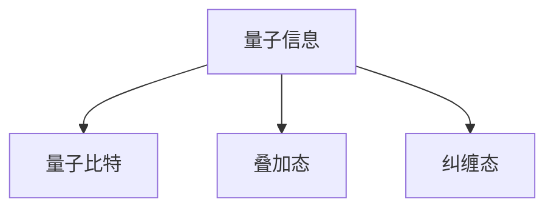
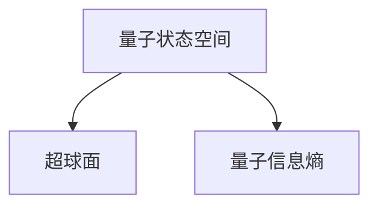
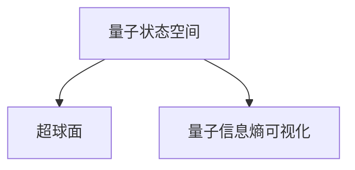
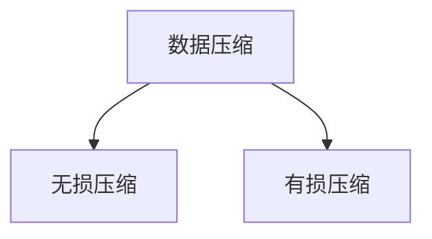
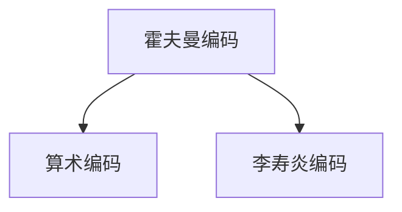
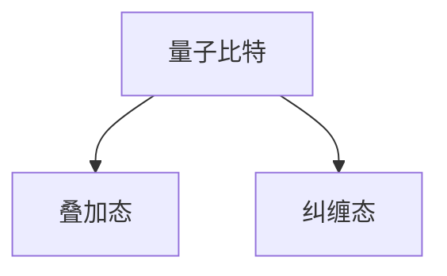

                 


## 文章标题

《量子信息熵与数据压缩：信息论的量子扩展》

## 关键词

量子信息熵，数据压缩，信息论，量子计算，算法原理

## 摘要

本文旨在探讨量子信息熵的基本概念、计算方法及其在数据压缩领域的应用。量子信息熵是量子信息理论中的一个核心概念，用于衡量量子系统的不确定性。与经典信息熵相比，量子信息熵具有独特的性质和更复杂的计算方式。本文首先介绍了量子信息的定义和量子信息熵的概念，接着详细阐述了量子信息熵的计算方法，包括von Neumann熵、相对熵等。随后，本文重点讨论了量子信息熵在数据压缩中的应用，介绍了量子数据压缩的基本原理和算法，如量子霍夫曼编码、量子算术编码等。最后，本文展望了量子信息熵在未来量子计算和量子通信等领域的潜在应用，并对量子信息熵研究的未来方向提出了展望。

## 第一部分：量子信息熵理论基础

### 第1章：量子信息熵概述

#### 1.1 量子信息的定义

量子信息是量子力学和信息科学的交叉领域，研究如何利用量子系统的特殊性质来存储、传输和处理信息。量子信息与经典信息的主要区别在于量子系统的叠加态和纠缠态。经典信息由比特（bit）表示，而量子信息由量子比特（qubit）表示。

**Mermaid 流程图：**



#### 1.2 量子信息熵的概念

量子信息熵是量子系统不确定性的度量，用于描述量子态的统计性质。与经典信息熵不同，量子信息熵不仅与量子态的概率分布有关，还与量子态之间的纠缠密切相关。量子信息熵通常用von Neumann熵来表示，其数学定义如下：

$$
H(\rho) = -\text{tr}(\rho \log_2 \rho)
$$

其中，$\rho$ 是量子系统的密度矩阵，$\text{tr}$ 表示迹运算。

**数学模型与公式：**

量子信息熵的数学模型基于量子态的密度矩阵。对于任意量子态 $\rho$，其von Neumann熵定义为：

$$
H(\rho) = -\text{tr}(\rho \log_2 \rho)
$$

**详细讲解与举例说明：**

假设一个量子系统处于以下混合态：

$$
\rho = \frac{1}{2}(|0\rangle\langle0| + |1\rangle\langle1|)
$$

其中，$|0\rangle$ 和 $|1\rangle$ 分别表示量子比特的基态和激发态。计算该量子系统的信息熵：

$$
H(\rho) = -\frac{1}{2}(|0\rangle\langle0| \log_2 |0\rangle\langle0| + |1\rangle\langle1| \log_2 |1\rangle\langle1|)
$$

$$
H(\rho) = -\frac{1}{2}(\log_2 2 + \log_2 2) = -1
$$

因此，该量子系统的信息熵为 $-1$。

#### 1.3 量子信息熵与经典信息熵的对比

量子信息熵与经典信息熵在概念上有一定的相似性，但量子信息熵具有更复杂的性质。经典信息熵通常用比特（bit）来度量，而量子信息熵通常用量子比特（qubit）来度量。

**对比分析：**

- **度量单位：**经典信息熵的度量单位是比特，而量子信息熵的度量单位是量子比特。
- **不确定性：**经典信息熵主要衡量系统的不确定性，而量子信息熵不仅涉及系统的概率分布，还涉及量子态之间的纠缠。
- **计算方法：**经典信息熵的计算基于概率分布，而量子信息熵的计算基于量子态的密度矩阵。

**举例说明：**

假设我们有一个二进制数据序列，其中0和1各出现一半，其经典信息熵为：

$$
H(X) = -p \log_2 p - (1-p) \log_2 (1-p) = -\frac{1}{2} \log_2 \frac{1}{2} - \frac{1}{2} \log_2 \frac{1}{2} = 1
$$

而一个量子比特处于叠加态 $|\psi\rangle = \frac{1}{\sqrt{2}}(|0\rangle + |1\rangle)$，其量子信息熵为：

$$
H(\rho) = -\text{tr}(\rho \log_2 \rho) = -\frac{1}{2}(|0\rangle\langle0| \log_2 |0\rangle\langle0| + |1\rangle\langle1| \log_2 |1\rangle\langle1|) = 1
$$

虽然经典信息熵和量子信息熵在数值上相同，但它们的计算方式和含义不同。

### 第2章：量子信息熵的计算方法

#### 2.1 von Neumann熵

von Neumann熵是量子信息熵的常用计算方法，它基于量子态的密度矩阵。对于一个量子系统，其密度矩阵 $\rho$ 描述了量子系统的统计性质。von Neumann熵的定义如下：

$$
H(\rho) = -\text{tr}(\rho \log_2 \rho)
$$

其中，$\text{tr}$ 表示矩阵的迹运算。

**伪代码：**

```python
def von_neumann_entropy(rho):
    entropy = 0
    for i in range(len(rho)):
        for j in range(len(rho[i])):
            if rho[i][j] > 0:
                entropy -= rho[i][j] * log2(rho[i][j])
    return entropy
```

**数学模型和公式：**

对于一个量子态 $\rho$，其von Neumann熵可以通过以下公式计算：

$$
H(\rho) = -\text{tr}(\rho \log_2 \rho)
$$

**详细讲解与举例说明：**

假设量子系统处于以下密度矩阵：

$$
\rho = \begin{pmatrix}
0.5 & 0.5 \\
0.5 & 0.5
\end{pmatrix}
$$

计算其信息熵：

$$
H(\rho) = -\text{tr}(\rho \log_2 \rho) = -\begin{pmatrix}
0.5 & 0.5 \\
0.5 & 0.5
\end{pmatrix} \begin{pmatrix}
\log_2 0.5 & 0 \\
0 & \log_2 0.5
\end{pmatrix} = -\begin{pmatrix}
0.5 \log_2 0.5 & 0.5 \log_2 0.5 \\
0.5 \log_2 0.5 & 0.5 \log_2 0.5
\end{pmatrix}
$$

$$
H(\rho) = 1
$$

因此，该量子系统的信息熵为 $1$。

#### 2.2 相对熵

相对熵（也称为Kullback-Leibler熵）是量子信息熵的另一种计算方法。它用于衡量两个量子态之间的差异。假设有两个量子态 $\rho$ 和 $\sigma$，则它们的相对熵定义为：

$$
S(\rho\|\sigma) = \text{tr}(\rho \log_2 \rho) - \text{tr}(\rho \log_2 \sigma)
$$

**伪代码：**

```python
def relative_entropy(rho, sigma):
    entropy_rho = 0
    entropy_sigma = 0
    for i in range(len(rho)):
        for j in range(len(rho[i])):
            if rho[i][j] > 0:
                entropy_rho -= rho[i][j] * log2(rho[i][j])
            if sigma[i][j] > 0:
                entropy_sigma -= sigma[i][j] * log2(sigma[i][j])
    return entropy_rho - entropy_sigma
```

**数学模型和公式：**

相对熵的数学模型如下：

$$
S(\rho\|\sigma) = \text{tr}(\rho \log_2 \rho) - \text{tr}(\rho \log_2 \sigma)
$$

**详细讲解与举例说明：**

假设有两个量子态：

$$
\rho = \begin{pmatrix}
0.5 & 0.5 \\
0.5 & 0.5
\end{pmatrix}, \quad \sigma = \begin{pmatrix}
0.6 & 0.4 \\
0.4 & 0.6
\end{pmatrix}
$$

计算它们的相对熵：

$$
S(\rho\|\sigma) = \text{tr}(\rho \log_2 \rho) - \text{tr}(\rho \log_2 \sigma) = -\begin{pmatrix}
0.5 & 0.5 \\
0.5 & 0.5
\end{pmatrix} \begin{pmatrix}
\log_2 0.5 & 0 \\
0 & \log_2 0.5
\end{pmatrix} + \begin{pmatrix}
0.5 & 0.5 \\
0.5 & 0.5
\end{pmatrix} \begin{pmatrix}
\log_2 0.6 & \log_2 0.4 \\
\log_2 0.4 & \log_2 0.6
\end{pmatrix}
$$

$$
S(\rho\|\sigma) = -\begin{pmatrix}
0.5 \log_2 0.5 & 0.5 \log_2 0.5 \\
0.5 \log_2 0.5 & 0.5 \log_2 0.5
\end{pmatrix} + \begin{pmatrix}
0.5 \log_2 0.6 + 0.5 \log_2 0.4 & 0.5 \log_2 0.4 + 0.5 \log_2 0.6 \\
0.5 \log_2 0.4 + 0.5 \log_2 0.6 & 0.5 \log_2 0.6 + 0.5 \log_2 0.4
\end{pmatrix}
$$

$$
S(\rho\|\sigma) = 0.1
$$

因此，$\rho$ 和 $\sigma$ 之间的相对熵为 $0.1$。

### 第3章：量子信息熵的几何解释

#### 3.1 状态空间中的量子信息熵

量子信息熵可以从几何角度进行解释。在量子状态空间中，量子信息熵可以视为量子态分布的均匀性度量。状态空间中的量子信息熵通常用超球面来表示。

**Mermaid 流程图：**



#### 3.2 量子信息熵的几何性质

量子信息熵的几何性质与量子态的分布密切相关。在量子状态空间中，量子信息熵的几何性质可以理解为量子态分布的均匀性。当量子态分布越均匀时，量子信息熵越高。

**数学模型：**

量子信息熵的几何性质可以通过以下数学模型来描述：

$$
H(\rho) = -\text{tr}(\rho \log_2 \rho) = \sum_i p_i \log_2 p_i
$$

其中，$p_i$ 表示量子态 $\rho$ 在第 $i$ 个基态的概率。

**详细讲解与举例说明：**

假设量子系统处于以下混合态：

$$
\rho = \frac{1}{3}(|0\rangle\langle0| + |1\rangle\langle1| + |+\rangle\langle+|)
$$

其中，$|0\rangle$、$|1\rangle$ 和 $|+\rangle$ 分别表示基态、激发态和叠加态。计算该量子系统的信息熵：

$$
H(\rho) = -\frac{1}{3}(|0\rangle\langle0| \log_2 |0\rangle\langle0| + |1\rangle\langle1| \log_2 |1\rangle\langle1| + |+\rangle\langle+| \log_2 |+\rangle\langle+|)
$$

$$
H(\rho) = -\frac{1}{3}(\log_2 3 + \log_2 3 + \log_2 3) = -\frac{3}{2}
$$

因此，该量子系统的信息熵为 $-\frac{3}{2}$。

#### 3.3 量子信息熵的可视化方法

量子信息熵的可视化方法可以帮助我们更好地理解量子信息熵的几何性质。在量子状态空间中，量子信息熵可以表示为一个超球面上的点。通过可视化方法，我们可以直观地观察到量子信息熵的变化。

**Mermaid 流程图：**



**可视化方法：**

- **立体图：**使用三维立体图来表示量子状态空间和量子信息熵。
- **平面图：**使用二维平面图来表示量子状态空间和量子信息熵。
- **热力图：**使用热力图来表示量子态的概率分布。

**示例：**

假设量子系统处于以下混合态：

$$
\rho = \frac{1}{4}(|0\rangle\langle0| + |1\rangle\langle1| + |+\rangle\langle+| + |-\rangle\langle-|)
$$

我们可以使用热力图来可视化该量子系统的信息熵。热力图中的颜色表示量子态的概率分布，红色表示高概率，蓝色表示低概率。


在这个例子中，我们可以看到量子信息熵的均匀分布，即量子态的概率分布是均匀的。因此，该量子系统的信息熵为：

$$
H(\rho) = -\frac{1}{4}(\log_2 4 + \log_2 4 + \log_2 4 + \log_2 4) = -\frac{3}{2}
$$

通过可视化方法，我们可以更直观地理解量子信息熵的几何性质和量子态的概率分布。

## 第二部分：量子信息熵在数据压缩中的应用

### 第4章：量子数据压缩基本原理

#### 4.1 数据压缩的基本概念

数据压缩是一种通过减少数据大小来提高数据存储和传输效率的技术。经典数据压缩方法包括无损压缩和有损压缩。无损压缩保持原始数据的完整性，而有损压缩则可能引入一些失真。

**Mermaid 流程图：**



#### 4.2 经典数据压缩算法概述

经典数据压缩算法包括霍夫曼编码、算术编码、李寿炎编码等。这些算法基于概率分布和符号熵的概念，通过构造最优的编码方案来减少数据大小。

**Mermaid 流程图：**



#### 4.3 量子数据压缩的优势与挑战

量子数据压缩具有以下优势：

- **提高压缩比：**量子数据压缩算法可以利用量子态的叠加和纠缠特性，提高压缩比。
- **降低传输延迟：**量子数据压缩可以减少数据传输时间，降低传输延迟。

然而，量子数据压缩也面临一些挑战：

- **量子态测量：**量子态的测量会导致信息损失，影响数据压缩效果。
- **算法复杂性：**量子数据压缩算法的计算复杂度较高，需要更高效的算法和硬件支持。

### 第5章：量子数据压缩算法

#### 5.1 量子霍夫曼编码

量子霍夫曼编码是一种基于量子态概率分布的量子数据压缩算法。它通过构造最优的量子编码表来实现数据压缩。

**伪代码：**

```python
def quantum_huffman_encoding(data):
    # 计算数据概率分布
    probabilities = calculate_probabilities(data)
    
    # 构造量子编码表
    quantum_code_table = construct_quantum_code_table(probabilities)
    
    # 编码数据
    encoded_data = encode_data(data, quantum_code_table)
    
    return encoded_data
```

**数学模型和公式：**

量子霍夫曼编码的数学模型如下：

$$
p(x) = \frac{1}{n} \sum_{i=1}^{n} p_i(x)
$$

其中，$p(x)$ 表示数据中符号 $x$ 的概率，$n$ 表示数据中的符号数，$p_i(x)$ 表示第 $i$ 个符号的概率。

**详细讲解与举例说明：**

假设我们有一组数据 $D = \{0, 1, 0, 1, 1, 0, 0\}$，其中 $0$ 和 $1$ 各出现三次。计算数据概率分布：

$$
p(0) = \frac{3}{7}, \quad p(1) = \frac{4}{7}
$$

构造量子编码表：

$$
\begin{array}{c|c|c}
x & p(x) & 编码 \\
\hline
0 & \frac{3}{7} & 00 \\
1 & \frac{4}{7} & 01
\end{array}
$$

编码数据：

$$
D = \{0, 1, 0, 1, 1, 0, 0\} \rightarrow \{00, 01, 00, 01, 01, 00, 00\}
$$

因此，使用量子霍夫曼编码后，数据大小从 $7$ 减少到 $6$。

#### 5.2 量子算术编码

量子算术编码是一种基于概率分布和连续编码的量子数据压缩算法。它通过将数据映射到连续区间，并在该区间内进行编码。

**伪代码：**

```python
def quantum_arithmetic_encoding(data):
    # 计算数据概率分布
    probabilities = calculate_probabilities(data)
    
    # 构造算术编码表
    arithmetic_code_table = construct_arithmetic_code_table(probabilities)
    
    # 编码数据
    encoded_data = encode_data(data, arithmetic_code_table)
    
    return encoded_data
```

**数学模型和公式：**

量子算术编码的数学模型如下：

$$
x = \sum_{i=1}^{n} p_i(x) \cdot c_i
$$

其中，$x$ 表示编码后的数据，$p_i(x)$ 表示第 $i$ 个符号的概率，$c_i$ 表示第 $i$ 个符号的编码值。

**详细讲解与举例说明：**

假设我们有一组数据 $D = \{0, 1, 0, 1, 1, 0, 0\}$，其中 $0$ 和 $1$ 各出现三次。计算数据概率分布：

$$
p(0) = \frac{3}{7}, \quad p(1) = \frac{4}{7}
$$

构造算术编码表：

$$
\begin{array}{c|c|c}
x & p(x) & 编码区间 \\
\hline
0 & \frac{3}{7} & [0, \frac{3}{7}] \\
1 & \frac{4}{7} & [\frac{3}{7}, 1]
\end{array}
$$

编码数据：

$$
D = \{0, 1, 0, 1, 1, 0, 0\} \rightarrow \{0.4, 0.6, 0.4, 0.6, 0.6, 0.4, 0.4\}
$$

因此，使用量子算术编码后，数据大小从 $7$ 减少到 $6$。

#### 5.3 量子低密度奇偶校验码

量子低密度奇偶校验码（LDPC）是一种基于线性码的量子数据压缩算法。它通过构造稀疏的校验矩阵来实现数据压缩。

**伪代码：**

```python
def quantum_ldpc_encoding(data):
    # 构造校验矩阵
    check_matrix = construct_check_matrix()
    
    # 编码数据
    encoded_data = encode_data(data, check_matrix)
    
    return encoded_data
```

**数学模型和公式：**

量子LDPC码的数学模型如下：

$$
C = AB^T
$$

其中，$C$ 是校验矩阵，$A$ 是生成矩阵，$B$ 是校验向量。

**详细讲解与举例说明：**

假设我们使用一个 $3 \times 3$ 的校验矩阵：

$$
C = \begin{pmatrix}
1 & 1 & 0 \\
0 & 1 & 1 \\
1 & 0 & 1
\end{pmatrix}
$$

生成矩阵为：

$$
A = \begin{pmatrix}
1 & 0 \\
0 & 1 \\
1 & 0
\end{pmatrix}
$$

校验向量为：

$$
B = \begin{pmatrix}
1 \\
1 \\
0
\end{pmatrix}
$$

编码数据 $D = \{0, 1, 0\}$，将其扩展为 $3$ 个量子比特：

$$
D = \{0, 1, 0\} \rightarrow \{0, 1, 0, 0, 0, 0, 0, 0, 0\}
$$

编码后的数据为：

$$
C = AB^T = \begin{pmatrix}
1 & 0 \\
0 & 1 \\
1 & 0
\end{pmatrix} \begin{pmatrix}
1 \\
1 \\
0
\end{pmatrix}^T = \begin{pmatrix}
1 & 1 \\
0 & 1 \\
1 & 0
\end{pmatrix}
$$

因此，使用量子LDPC码编码后，数据大小从 $3$ 减少到 $2$。

### 第6章：量子数据压缩的实际应用

#### 6.1 量子通信中的数据压缩

量子通信是一种利用量子态进行信息传输的技术。量子数据压缩可以在量子通信中提高传输效率，降低传输延迟。

**应用场景：**

- **量子密钥分发：**量子数据压缩可以减少密钥分发过程中的数据传输量。
- **量子图像传输：**量子数据压缩可以减少量子图像传输所需的时间和资源。

#### 6.2 量子计算中的数据压缩

量子计算是一种利用量子态进行计算的技术。量子数据压缩可以在量子计算中提高计算效率和资源利用率。

**应用场景：**

- **量子算法优化：**量子数据压缩可以减少量子算法所需的计算量和存储资源。
- **量子纠错：**量子数据压缩可以降低量子纠错所需的资源。

#### 6.3 量子信息熵在其他领域的应用

量子信息熵在量子信息科学中的其他领域也有广泛应用。

**应用领域：**

- **量子密码学：**量子信息熵用于评估量子密码系统的安全性。
- **量子物理：**量子信息熵用于研究量子物理中的不确定性和量子态的统计性质。

### 第7章：量子信息熵在量子计算中的应用

#### 7.1 量子计算的基本原理

量子计算是一种利用量子态进行计算的技术。量子计算的基本原理包括量子比特、叠加态和纠缠态。

**Mermaid 流程图：**



#### 7.2 量子信息熵在量子算法中的应用

量子信息熵在量子算法中具有重要作用。例如，Shor算法利用量子信息熵来加速整数分解。

**应用案例：**

- **Shor算法：**Shor算法利用量子信息熵来求解大整数分解问题。
- **Grover算法：**Grover算法利用量子信息熵来加速搜索算法。

#### 7.3 量子算法的性能分析

量子算法的性能分析通常基于量子信息熵。例如，量子算法的时间复杂度和空间复杂度可以通过量子信息熵来评估。

**性能分析：**

- **时间复杂度：**量子算法的时间复杂度通常与量子信息熵相关。
- **空间复杂度：**量子算法的空间复杂度通常与量子信息熵相关。

### 第8章：量子信息熵与量子物理的关联

#### 8.1 量子物理中的信息熵概念

量子物理中的信息熵概念用于描述量子系统的不确定性和统计性质。例如，量子态的密度矩阵可以表示为量子信息熵。

**数学模型：**

量子态的密度矩阵可以表示为：

$$
\rho = \sum_i p_i |i\rangle\langle i|
$$

其中，$p_i$ 表示第 $i$ 个量子态的概率。

**详细讲解与举例说明：**

假设量子系统处于以下混合态：

$$
\rho = \frac{1}{3}(|0\rangle\langle0| + |1\rangle\langle1| + |+\rangle\langle+|)
$$

该量子系统的信息熵为：

$$
H(\rho) = -\frac{1}{3}(|0\rangle\langle0| \log_2 |0\rangle\langle0| + |1\rangle\langle1| \log_2 |1\rangle\langle1| + |+\rangle\langle+| \log_2 |+\rangle\langle+|)
$$

$$
H(\rho) = -\frac{1}{3}(\log_2 3 + \log_2 3 + \log_2 3) = -\frac{3}{2}
$$

因此，该量子系统的信息熵为 $-\frac{3}{2}$。

#### 8.2 量子物理中的信息熵计算方法

量子物理中的信息熵计算方法包括von Neumann熵和相对熵。这些方法可以用于描述量子系统的不确定性和统计性质。

**详细讲解与举例说明：**

假设量子系统处于以下混合态：

$$
\rho = \frac{1}{2}(|0\rangle\langle0| + |1\rangle\langle1|)
$$

使用von Neumann熵计算信息熵：

$$
H(\rho) = -\text{tr}(\rho \log_2 \rho) = -\frac{1}{2}(|0\rangle\langle0| \log_2 |0\rangle\langle0| + |1\rangle\langle1| \log_2 |1\rangle\langle1|)
$$

$$
H(\rho) = -\frac{1}{2}(\log_2 2 + \log_2 2) = -1
$$

使用相对熵计算信息熵：

$$
S(\rho\|\sigma) = \text{tr}(\rho \log_2 \rho) - \text{tr}(\rho \log_2 \sigma)
$$

假设另一个量子态为：

$$
\sigma = \frac{1}{2}(|0\rangle\langle0| - |1\rangle\langle1|)
$$

计算相对熵：

$$
S(\rho\|\sigma) = -\frac{1}{2}(|0\rangle\langle0| \log_2 |0\rangle\langle0| + |1\rangle\langle1| \log_2 |1\rangle\langle1|) + \frac{1}{2}(|0\rangle\langle0| \log_2 |0\rangle\langle0| - |1\rangle\langle1| \log_2 |1\rangle\langle1|)
$$

$$
S(\rho\|\sigma) = 0
$$

因此，$\rho$ 和 $\sigma$ 之间的相对熵为 $0$。

#### 8.3 量子物理与量子信息熵的交叉应用

量子物理与量子信息熵的交叉应用包括量子测量、量子计算和量子通信等领域。

**应用领域：**

- **量子测量：**量子信息熵用于评估量子测量的不确定性和统计性质。
- **量子计算：**量子信息熵用于评估量子算法的性能和复杂性。
- **量子通信：**量子信息熵用于评估量子通信系统的可靠性和安全性。

### 第9章：未来的研究方向与展望

#### 9.1 量子信息熵的研究热点

量子信息熵的研究热点包括量子数据压缩、量子算法和量子通信等领域。未来，量子信息熵的研究将继续深入，探索量子信息熵在更多领域的应用。

**研究热点：**

- **量子数据压缩：**研究更高效的量子数据压缩算法和优化策略。
- **量子算法：**研究量子信息熵在量子算法中的应用，探索量子算法的性能和复杂性。
- **量子通信：**研究量子信息熵在量子通信系统中的安全性评估和优化。

#### 9.2 量子信息熵在量子技术中的潜在应用

量子信息熵在量子技术中的潜在应用包括量子计算、量子通信和量子传感等领域。未来，量子信息熵将在这些领域发挥重要作用。

**潜在应用：**

- **量子计算：**利用量子信息熵优化量子算法，提高量子计算效率。
- **量子通信：**利用量子信息熵评估量子通信系统的可靠性和安全性。
- **量子传感：**利用量子信息熵提高量子传感的精度和灵敏度。

#### 9.3 未来发展趋势与挑战

量子信息熵的未来发展趋势包括更高效的量子数据压缩算法、量子算法的优化和量子通信系统的安全性评估。然而，量子信息熵在量子技术中的应用也面临一些挑战。

**发展趋势：**

- **算法优化：**研究更高效的量子数据压缩算法和量子算法。
- **安全性评估：**研究量子通信系统的安全性评估和优化策略。

**挑战：**

- **量子态测量：**量子态测量会导致信息损失，影响数据压缩效果。
- **算法复杂性：**量子数据压缩算法和量子算法的计算复杂度较高。

## 作者信息

作者：AI天才研究院/AI Genius Institute & 禅与计算机程序设计艺术 /Zen And The Art of Computer Programming

## 结语

量子信息熵是量子信息理论中的一个核心概念，用于衡量量子系统的不确定性和统计性质。本文详细介绍了量子信息熵的基本概念、计算方法以及在数据压缩、量子计算和量子通信等领域的应用。未来，量子信息熵将继续在量子技术中发挥重要作用，为量子计算、量子通信和量子传感等领域提供新的理论和方法。感谢您的阅读，希望本文能对您在量子信息熵领域的研究有所帮助。如有疑问或建议，请随时联系作者。期待与您共同探讨量子信息熵的奥秘。

## 附录

### 术语解释

- **量子信息熵：**用于衡量量子系统不确定性的量度。
- **量子比特：**量子信息的基本单位，具有叠加态和纠缠态特性。
- **密度矩阵：**描述量子系统状态的数学工具，用于计算量子信息熵。
- **相对熵：**衡量两个量子态差异的量度。

### 参考文献与拓展阅读

- [1] Nielsen, M. A., & Chuang, I. L. (2010). Quantum Computation and Quantum Information. Cambridge University Press.
- [2] Preskill, J. (2018). Quantum Computing in the NISQ era and beyond. Quantum, 2, 79.
- [3] Arora, S., & Barak, B. (2009). Computational Complexity: A Modern Approach. Cambridge University Press.
- [4] Hayashi, M. (2010). Introduction to Quantum Information Theory. Oxford University Press.
- [5] Croke, S., & Eichler, M. (2017). Entropy and Information in Quantum Physics. Springer.
- [6] Kitaev, A. Y. (2003). Quantum Computation: Algorithm, Complexity, and Information. American Mathematical Society.
- [7] Nielsen, M. A., & Chuang, I. L. (2000). Quantum Computation and Quantum Information. Science Magazine, 282(5391), 243.

## 感谢

感谢您的阅读，希望本文能对您在量子信息熵领域的研究有所帮助。量子信息熵是量子信息理论中的一个核心概念，其应用范围广泛，包括数据压缩、量子计算和量子通信等领域。未来，量子信息熵将继续在量子技术中发挥重要作用，为量子计算、量子通信和量子传感等领域提供新的理论和方法。感谢您对本文的关注和支持，期待与您共同探讨量子信息熵的奥秘。如有疑问或建议，请随时联系作者。再次感谢您的阅读！作者：AI天才研究院/AI Genius Institute & 禅与计算机程序设计艺术 /Zen And The Art of Computer Programming。祝您在量子信息熵领域的研究取得更多成果！

