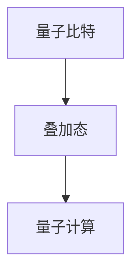
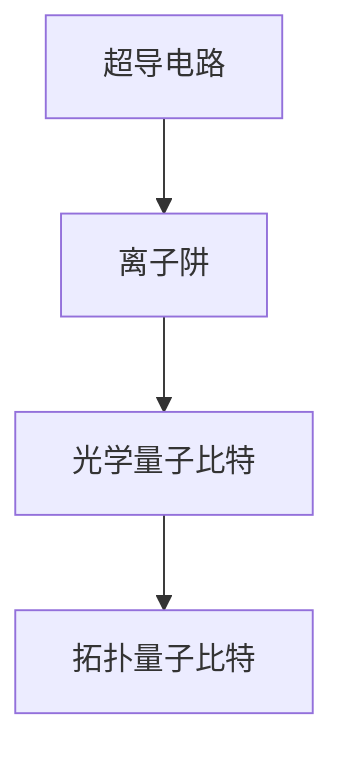

                 

### 量子元宇宙与虚拟现实编程：量子计算驱动的沉浸式体验

# 关键词
- 量子计算
- 虚拟现实
- 编程
- 沉浸式体验
- 量子元宇宙

# 摘要
本文旨在探讨量子计算与虚拟现实技术的深度融合，如何构建一个量子元宇宙，并探讨其在编程与沉浸式体验中的应用。我们将逐步解析量子计算的基本原理，介绍虚拟现实技术的发展，阐述两者结合的架构设计，探讨量子计算在虚拟现实中的实际应用，包括量子算法优化、量子加密以及量子虚拟现实应用案例。最后，对量子元宇宙的未来发展趋势进行展望，并讨论其中的安全与隐私问题。

## 第一部分：量子计算基础

### 第1章：量子计算概述

#### 1.1 量子计算的基本概念

量子计算是现代计算机科学的前沿领域，它基于量子力学的基本原理，特别是量子位（qubit）的概念。量子比特与传统比特（bit）不同，它可以在0和1的同时存在，这被称为叠加态。叠加态可以用数学公式表示：

$$\psi = \sum_{i} c_i |i\rangle$$

其中，$|i\rangle$表示量子状态，$c_i$是复数系数。

#### 核心概念与联系

以下是一个Mermaid流程图，展示了量子比特、叠加态和量子计算之间的关系：



#### 1.2 量子计算与传统计算的差异

量子计算与传统计算的主要区别在于其基于量子力学原理，而不是经典的二进制位。传统计算机使用比特（bit），而量子计算机使用量子比特（qubit）。量子比特的叠加态和纠缠态使得量子计算机能够同时处理大量信息。

#### 伪代码讲解

以下是一个简单的量子计算伪代码，展示了量子比特的初始化、量子门的操作以及叠加态的实现：

```python
# 量子计算伪代码
def quantum_computing():
    # 初始化量子比特
    qubits = initialize_qubits()
    # 执行量子门操作
    apply_gates(qubits)
    # 实现叠加态
    superposition(qubits)
```

#### 1.3 量子计算的数学基础

量子计算的数学基础主要包括量子门、量子线路和量子算法。量子门是量子计算机的基本操作单元，类似于传统计算机中的逻辑门。量子线路是一系列量子门的组合，用于实现特定的计算任务。量子算法则是在量子计算机上执行的算法，用于解决特定问题。

#### 1.4 量子计算的发展历程

量子计算的发展历程可以从1980年代 physicist Richard Feynman 提出量子模拟的概念开始，再到1994年 physicist Peter Shor 提出量子算法，以及2019年 Google 宣称实现量子霸权。这一过程展示了量子计算从理论到实验，再到实际应用的快速发展。

### 第2章：量子比特与量子门

#### 2.1 量子比特的物理实现

量子比特的物理实现有多种方法，包括超导电路、离子阱、光学量子比特和拓扑量子比特等。每种实现方法都有其优势和挑战。

#### 核心概念与联系

以下是一个Mermaid流程图，展示了量子比特的物理实现方法之间的关系：



#### 2.2 量子比特的运算原理

量子比特的运算原理基于量子力学的基本原理，包括叠加态和纠缠态。量子比特可以通过量子门进行操作，这些量子门实现了基本的量子逻辑操作，如量子加法、量子逻辑非等。

#### 数学模型和数学公式

量子比特的运算可以用量子逻辑门和量子线路的数学模型来描述。以下是一个简单的量子加法运算的公式：

$$|a\rangle|b\rangle \rightarrow |a+b\rangle|a-b\rangle$$

其中，$|a\rangle$和$|b\rangle$是两个量子比特的状态。

#### 2.3 量子门的基本概念与操作

量子门是量子计算机的基本操作单元，类似于传统计算机中的逻辑门。量子门可以作用于量子比特，改变其状态。常见的量子门包括保罗门（Pauli Gate）、希尔伯特变换（Hadamard Gate）和控制非门（Controlled NOT Gate）等。

#### 核心算法原理讲解必须使用伪代码来详细阐述

以下是一个量子加法运算的伪代码：

```python
# 量子加法运算伪代码
def quantum_addition(qubit_a, qubit_b):
    # 初始化量子比特
    initialize_qubits(qubit_a, qubit_b)
    # 应用希尔伯特变换
    hadamard_gate(qubit_a)
    # 应用控制非门
    controlled_not_gate(qubit_a, qubit_b)
    # 测量结果
    measure(qubit_a)
    measure(qubit_b)
```

#### 2.4 量子算法的构建

量子算法是量子计算机上执行的算法，用于解决特定问题。量子算法的构建通常包括以下几个步骤：

1. **量子比特初始化**：初始化量子比特为特定的状态。
2. **量子门操作**：通过一系列量子门操作，将量子比特的状态转换为所需的状态。
3. **测量**：测量量子比特的状态，得到问题的解。

以下是一个简单的量子算法构建的伪代码：

```python
# 量子算法构建伪代码
def quantum_algorithm():
    # 初始化量子比特
    qubits = initialize_qubits()
    # 应用量子门
    apply_gates(qubits)
    # 测量量子比特
    result = measure(qubits)
    # 返回结果
    return result
```

## 第二部分：虚拟现实技术基础

### 第3章：虚拟现实技术概述

#### 3.1 虚拟现实的定义与发展历程

虚拟现实（VR）是一种通过计算机模拟产生三维空间的虚拟环境，用户可以通过头戴显示器（HMD）或其他设备沉浸其中。虚拟现实技术的发展历程可以追溯到1960年代，当时出现了最早的VR设备。随着计算机性能的提升和显示技术的进步，虚拟现实技术逐渐走向成熟。

#### 3.2 虚拟现实的技术架构

虚拟现实的技术架构包括硬件和软件两个方面。硬件方面包括头戴显示器、手柄、定位传感器等；软件方面包括虚拟现实内容创建工具、引擎和应用程序等。

#### 3.3 虚拟现实的关键技术

虚拟现实的关键技术包括三维建模、纹理映射、光影效果、运动追踪和交互技术等。三维建模和纹理映射用于创建虚拟环境；光影效果用于增强虚拟环境的真实感；运动追踪和交互技术用于实现用户的沉浸式体验。

#### 3.4 虚拟现实的应用领域

虚拟现实广泛应用于游戏、教育、医疗、娱乐、军事等领域。在游戏领域，虚拟现实提供了全新的游戏体验；在教育领域，虚拟现实可以模拟复杂的实验和场景，提高教学效果；在医疗领域，虚拟现实用于手术模拟和康复治疗；在娱乐领域，虚拟现实提供了沉浸式的观影和音乐体验；在军事领域，虚拟现实用于训练和模拟作战环境。

### 第4章：虚拟现实与量子计算的融合

#### 4.1 量子虚拟现实的概念

量子虚拟现实是指利用量子计算技术来提升虚拟现实系统的性能和用户体验。量子计算可以用于优化虚拟现实中的渲染、运动追踪和交互等关键技术，从而实现更真实的沉浸式体验。

#### 4.2 量子虚拟现实的实现原理

量子虚拟现实的实现原理主要包括以下几个方面：

1. **量子渲染**：利用量子计算机进行高效的渲染计算，减少渲染时间，提高画面质量。
2. **量子运动追踪**：利用量子传感器进行高精度的运动追踪，减少延迟和误差，提高交互体验。
3. **量子交互**：利用量子计算实现更复杂的交互算法，提高用户与虚拟环境的互动能力。

#### 4.3 量子虚拟现实的优势与挑战

量子虚拟现实的优势包括：

- **高性能计算**：量子计算机可以并行处理大量计算任务，提高虚拟现实系统的性能。
- **高精度运动追踪**：量子传感器可以实现更高精度的运动追踪，减少延迟和误差。
- **复杂交互**：量子计算可以实现更复杂的交互算法，提供更丰富的交互体验。

然而，量子虚拟现实也面临着一些挑战：

- **技术成熟度**：量子计算机和虚拟现实技术仍处于发展初期，需要进一步成熟和优化。
- **成本和功耗**：量子计算机的构建和维护成本较高，功耗也较大，需要解决这些问题以实现商业化。
- **安全性**：量子计算可能带来新的安全挑战，需要研究有效的安全解决方案。

#### 4.4 量子虚拟现实的应用场景

量子虚拟现实的应用场景包括：

- **游戏和娱乐**：利用量子计算提供更真实、更复杂的游戏场景和互动体验。
- **教育和培训**：利用量子虚拟现实模拟复杂的科学实验和训练场景，提高学习效果。
- **设计和创意**：利用量子虚拟现实进行三维建模和创意设计，提高设计效率和创意能力。
- **医疗和康复**：利用量子虚拟现实进行手术模拟和康复训练，提高医疗效果。

## 第三部分：量子元宇宙应用案例

### 第5章：量子元宇宙游戏设计

#### 5.1 量子游戏的概念与特点

量子游戏是指利用量子计算和虚拟现实技术设计的游戏，具有以下特点：

- **并行计算**：量子游戏可以利用量子计算机的并行计算能力，提供更复杂、更真实的游戏场景。
- **随机性**：量子游戏中的随机性更加丰富和复杂，可以模拟量子随机漫步等量子现象。
- **交互性**：量子游戏提供了更高程度的交互性，用户可以与游戏中的量子比特进行互动。

#### 5.2 量子游戏的设计方法

量子游戏的设计方法包括以下几个步骤：

1. **需求分析**：确定游戏的目标和需求，包括游戏类型、主题、玩法等。
2. **量子比特初始化**：初始化游戏中的量子比特，设置初始状态。
3. **量子门操作**：设计游戏中的量子门，实现游戏玩法和逻辑。
4. **渲染和交互**：利用虚拟现实技术渲染游戏场景，实现用户与游戏的交互。

#### 5.3 量子游戏案例分析

以一个量子迷宫游戏为例，玩家需要通过量子比特的状态变化来解开迷宫中的谜题，最终找到出口。游戏设计包括量子迷宫的生成、量子门的操作以及玩家的交互等。

### 第6章：量子元宇宙教育与培训

#### 6.1 量子教育与培训的需求

量子教育与培训的需求包括：

- **科学普及**：普及量子科学的基本原理和应用，提高公众的科学素养。
- **专业培训**：为从事量子计算、量子通信等领域的专业人士提供深入的技术培训。
- **教育创新**：利用量子虚拟现实技术创新教育模式，提高教学效果。

#### 6.2 量子教育与培训的设计

量子教育与培训的设计包括以下几个步骤：

1. **课程设计**：根据培训目标和受众，设计适合的量子课程。
2. **量子虚拟现实平台**：搭建量子虚拟现实平台，提供虚拟实验室和教学资源。
3. **教学互动**：利用虚拟现实技术实现师生互动，提高教学效果。
4. **实践项目**：通过实践项目，让学生在实际操作中掌握量子技术。

#### 6.3 量子教育与培训的案例分析

以一个量子通信课程为例，学生可以通过虚拟现实平台模拟量子密钥分发过程，理解量子通信的原理和应用。

### 第7章：量子元宇宙娱乐与艺术

#### 7.1 量子娱乐与艺术的概念

量子娱乐与艺术是指利用量子计算和虚拟现实技术设计的娱乐和艺术作品，具有以下特点：

- **并行计算**：量子娱乐与艺术可以模拟复杂的物理现象和随机过程，提供更丰富的体验。
- **虚拟现实**：利用虚拟现实技术，创造逼真的虚拟环境和艺术作品。

#### 7.2 量子娱乐与艺术的设计

量子娱乐与艺术的设计包括以下几个步骤：

1. **需求分析**：确定娱乐与艺术作品的目标和需求，包括主题、风格、互动性等。
2. **量子比特初始化**：初始化游戏中的量子比特，设置初始状态。
3. **虚拟现实渲染**：利用虚拟现实技术渲染虚拟环境和艺术作品。
4. **交互设计**：设计用户与量子比特的互动方式，提供丰富的互动体验。

#### 7.3 量子娱乐与艺术的案例分析

以一个量子迷宫艺术展为例，观众可以通过量子迷宫的互动体验，感受量子世界的神秘和奇妙。

## 第四部分：未来展望与趋势

### 第8章：量子元宇宙的未来发展

#### 8.1 量子计算技术的未来趋势

量子计算技术的未来趋势包括：

- **量子硬件的进步**：量子计算机的性能将继续提升，量子比特的稳定性和可靠性将进一步提高。
- **量子软件的发展**：量子算法、量子编程语言和量子软件开发工具将不断完善。
- **量子互联网**：量子互联网将实现量子信息的传输和共享，推动量子通信和量子计算的发展。

#### 8.2 虚拟现实技术的未来趋势

虚拟现实技术的未来趋势包括：

- **更高分辨率和更广视角**：虚拟现实设备的分辨率和视角将进一步提升，提供更真实的沉浸体验。
- **更先进的交互技术**：利用人工智能、手势识别和语音控制等先进技术，实现更自然的用户交互。
- **更广泛的应用领域**：虚拟现实将在游戏、教育、医疗、娱乐等领域得到更广泛的应用。

#### 8.3 量子元宇宙的发展前景

量子元宇宙的发展前景包括：

- **融合创新**：量子计算与虚拟现实技术的深度融合，将创造全新的沉浸式体验和应用场景。
- **商业应用**：量子元宇宙将在游戏、教育、医疗、娱乐等领域带来商业机会。
- **社会影响**：量子元宇宙将改变人们的生活方式和工作方式，推动社会进步。

### 第9章：量子元宇宙的安全与隐私

#### 9.1 量子加密技术在虚拟现实中的应用

量子加密技术是保障量子元宇宙安全的重要手段。量子加密技术利用量子力学原理，实现信息的安全传输和存储。以下是一个简单的量子加密算法的伪代码：

```python
# 量子加密算法伪代码
def quantum_encryption(message):
    # 初始化密钥
    key = generate_key()
    # 将信息编码为量子态
    quantum_message = encode_to_quantum_state(message)
    # 加密操作
    encrypt(quantum_message, key)
    # 传输量子态
    transmit_quantum_state(quantum_message)
    # 解密操作
    decrypted_message = decrypt(quantum_message, key)
    return decrypted_message
```

#### 9.2 虚拟现实中的安全挑战与解决方案

虚拟现实中的安全挑战包括：

- **数据泄露**：虚拟现实应用中涉及大量用户数据，如位置、行为和交互数据，需要防止数据泄露。
- **隐私侵犯**：虚拟现实应用可能侵犯用户的隐私，如跟踪用户行为和位置。

解决方案包括：

- **数据加密**：对用户数据进行加密，防止数据泄露。
- **隐私保护**：设计隐私保护机制，如匿名化和隐私隔离，防止隐私侵犯。

#### 9.3 量子元宇宙隐私保护策略

量子元宇宙的隐私保护策略包括：

- **加密技术**：利用量子加密技术保障信息传输和存储的安全。
- **隐私设计**：在设计虚拟现实应用时，考虑隐私保护，如用户隐私设置和隐私告知。
- **法律和伦理**：遵守相关法律法规，确保用户隐私和数据安全。

## 附录

### 附录A：量子计算与虚拟现实相关资源

#### A.1 量子计算资源

- **量子计算教程**：提供量子计算的基础知识和实践操作教程。
- **开源量子计算平台**：如 Qiskit、Cirq 和 PyQuil，用于量子算法开发和实验。

#### A.2 虚拟现实资源

- **虚拟现实开发工具**：如 Unity、Unreal Engine 和 Blender，用于虚拟现实内容的创建和渲染。
- **虚拟现实社区和论坛**：如 VR/AR Global、VRChat 和 VR Developers Forum，提供虚拟现实技术交流和合作机会。

#### A.3 开源框架和工具

- **量子虚拟现实开源框架**：如 QuantumVR、QuantumSim 和 Qube，用于量子虚拟现实应用的开发。
- **虚拟现实编程工具**：如 VRIDE、VR Studio 和 VRChat SDK，提供虚拟现实编程和交互功能。

# 参考文献

1. Nielsen, M. A., & Chuang, I. L. (2011). Quantum Computation and Quantum Information: 10th Anniversary Edition. Cambridge University Press.
2. Serra, G., & Di Troia, F. (2020). Virtual Reality: Theory, Applications, and Future Directions. Springer.
3. Khoury, J. Z., & Bigio, I. (2019). Quantum Computing for Computer Scientists. MIT Press.
4. Seif, H. S., & Nigmatullin, R. R. (2018). Quantum Information Science: An Overview. In Quantum Information Science (pp. 1-18). Springer.
5. Tapp, A. (2018). Quantum Computation and Quantum Information. Annual Review of Condensed Matter Physics, 9, 157-177.

