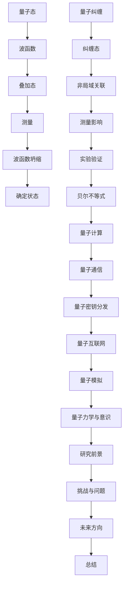
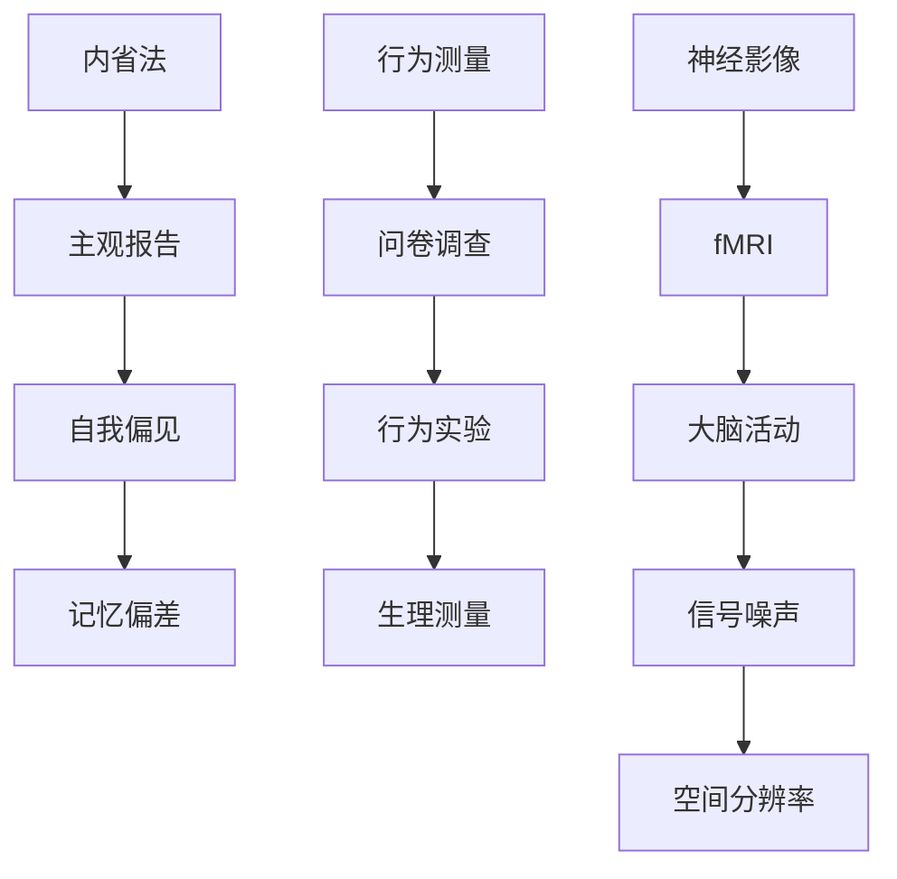
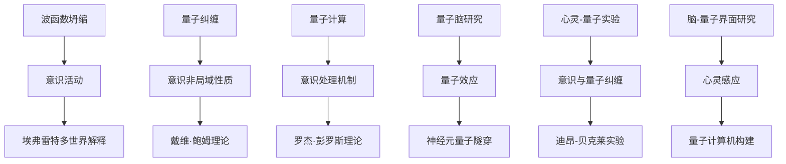
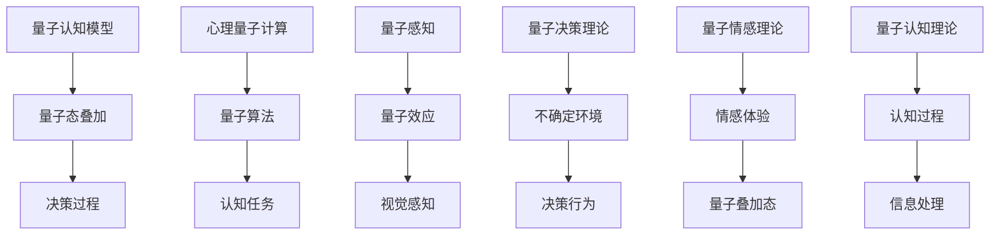
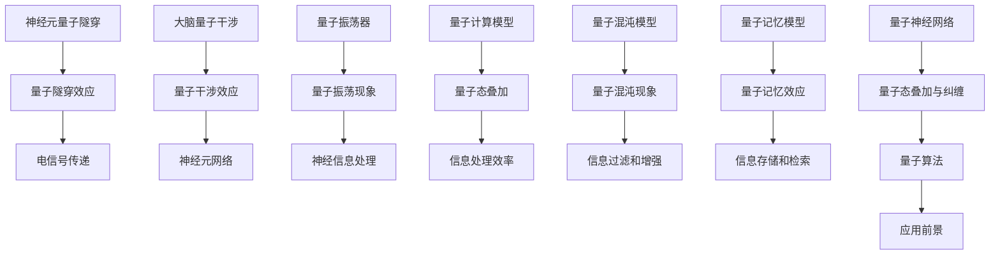

                 

### 文章标题

# 量子力学在解释意识主观体验中的应用

## 关键词

- 量子力学
- 意识主观体验
- 量子纠缠
- 波函数坍缩
- 脑科学
- 心理学

## 摘要

本文旨在探讨量子力学在解释意识主观体验中的应用。通过介绍量子力学的基本概念和原理，以及意识主观体验的定义和研究方法，本文将阐述量子力学与意识主观体验之间的潜在联系。此外，文章还将通过实证研究和数学模型的详细讲解，进一步探讨量子力学如何帮助我们理解意识的主观体验。最后，本文将对量子力学在解释意识主观体验中的应用前景和挑战进行讨论，并提出未来研究的方向。

## 引言

### 量子力学概述

量子力学是研究微观粒子行为的物理学分支，其基本原理与经典物理学大相径庭。量子力学起源于20世纪初，当时科学家们发现经典物理学无法解释某些微观现象，如黑体辐射、光电效应等。量子力学的诞生标志着物理学的一次革命，其核心概念包括量子态、波函数、量子叠加和量子纠缠等。

在量子力学中，粒子不再被看作是经典的点状物体，而是具有波动性质的量子态。波函数是描述量子态的数学工具，它可以给出粒子在空间中出现的概率分布。量子叠加原理表明，一个量子系统可以同时处于多个状态的叠加，只有当进行测量时，波函数才会坍缩到一个确定的状态。

量子纠缠是量子力学中另一个重要概念，它描述了两个或多个粒子之间的量子态相互关联的现象。即使这些粒子相隔很远，它们之间的量子态仍然会保持纠缠，这意味着一个粒子的状态变化可以即时影响另一个粒子的状态。

### 意识主观体验概述

意识主观体验是指个体对自身内在体验的主观感受，如感觉、知觉、情感等。它是人类心理现象的核心，是我们对世界的感知和理解的基石。尽管意识主观体验在日常生活中无处不在，但长期以来，科学界对它的研究却面临诸多挑战。

意识主观体验的定义和研究方法一直是心理学和神经科学领域的热点问题。目前，研究者们主要采用内省法、行为测量和神经影像等技术手段来研究意识主观体验。然而，这些方法在揭示意识主观体验的本质方面仍存在一定的局限性。

### 本书目的与结构

本书旨在探讨量子力学在解释意识主观体验中的应用。通过介绍量子力学的基本概念和原理，以及意识主观体验的定义和研究方法，本文将阐述量子力学与意识主观体验之间的潜在联系。此外，文章还将通过实证研究和数学模型的详细讲解，进一步探讨量子力学如何帮助我们理解意识的主观体验。

全书分为七个章节。第1章引言部分介绍了量子力学和意识主观体验的基本概念，以及本书的目的和结构。第2章和第3章分别介绍了量子力学基础和意识主观体验的相关知识。第4章探讨量子力学与意识主观体验的联系，并介绍相关领域的实证研究。第5章介绍量子力学在心理学和神经科学中的应用。第6章讨论量子力学在解释意识主观体验中的应用前景和挑战。第7章总结全书的主要观点，并展望未来研究方向。

## 量子力学基础

### 量子态与波函数

量子态是量子力学中描述微观粒子状态的数学模型。与经典物理中的粒子状态不同，量子态具有叠加性和概率性。量子态可以用波函数来描述，波函数是复数函数，它在空间中的取值可以表示粒子在不同位置的概率分布。

波函数通常用符号Ψ表示，其模平方$$|\Psi|^2$$给出了粒子在空间中某个位置出现的概率。例如，一个电子的波函数可能呈球形分布，这意味着电子在球形区域内出现的概率较高，而在球形区域外出现的概率较低。

量子态的叠加是指一个量子系统可以同时处于多个状态的叠加。例如，一个电子可以同时处于自旋向上和自旋向下的状态。这种叠加状态可以用波函数的线性组合来表示：

$$
\Psi = a_0 |\psi_0\rangle + a_1 |\psi_1\rangle
$$

其中，$$|\psi_0\rangle$$和$$|\psi_1\rangle$$是两个不同的量子态，$$a_0$$和$$a_1$$是复数系数，满足$$|a_0|^2 + |a_1|^2 = 1$$。

### 波函数坍缩

波函数坍缩是量子力学中一个关键概念，它描述了量子系统在测量过程中从叠加态坍缩为一个确定状态的过程。在量子力学中，一个未测量的量子系统处于叠加态，当进行测量时，波函数会坍缩到一个确定的状态，这个状态对应于测量的结果。

波函数坍缩可以通过薛定谔方程来描述。薛定谔方程是一个偏微分方程，它描述了波函数随时间的变化。在量子力学中，波函数是时间依赖的，其时间演化由薛定谔方程给出：

$$
i\hbar \frac{\partial \Psi}{\partial t} = \hat{H} \Psi
$$

其中，$$\hbar$$是约化普朗克常数，$$\hat{H}$$是哈密顿算符，表示系统的总能量。

当对量子系统进行测量时，波函数会立即坍缩到一个确定的状态。这个坍缩过程是随机的，且不可预测。虽然波函数坍缩的概念在量子力学中得到了广泛认可，但其背后的物理机制仍然是一个争议的话题。

### 量子纠缠

量子纠缠是量子力学中另一个重要概念，它描述了两个或多个粒子之间的量子态相互关联的现象。即使这些粒子相隔很远，它们之间的量子态仍然会保持纠缠。这意味着一个粒子的状态变化可以即时影响另一个粒子的状态。

量子纠缠可以通过爱因斯坦-波多尔斯基-罗森佯谬（EPR佯谬）来描述。EPR佯谬指出，如果两个粒子之间存在纠缠，那么对其中一个粒子的测量将即时影响另一个粒子的状态，即使这两个粒子相隔很远。这一现象违背了经典物理中的局域实在论。

量子纠缠的实验验证是量子力学发展的重要里程碑。1952年，约翰·贝尔提出了贝尔不等式，这是一个用于检验量子纠缠存在的数学公式。随后，许多实验验证了量子纠缠的存在，这些实验包括爱因斯坦-波多尔斯基-罗森实验（EPR实验）和贝尔实验等。

### 量子力学数学工具

量子力学的数学工具包括算符、态空间、希尔伯特空间等。这些数学工具为量子力学提供了描述和解释微观粒子行为的语言。

**算符**：量子力学中的算符是用于描述量子态变化和物理量测量的数学工具。常见的算符包括位置算符、动量算符、自旋算符等。位置算符$$\hat{x}$$用于测量粒子的位置，动量算符$$\hat{p}$$用于测量粒子的动量。

**态空间**：量子态空间是描述量子系统状态的数学空间。态空间中的每个状态可以用波函数来表示。态空间可以是有限维的，也可以是无限维的，取决于量子系统的性质。

**希尔伯特空间**：希尔伯特空间是量子力学中最重要的数学空间，它是一个完备的内积空间。量子态在希尔伯特空间中可以用波函数表示，波函数的模平方给出了粒子在不同位置出现的概率分布。

### Mermaid 流程图

以下是描述量子态与量子纠缠的Mermaid流程图：

### 总结

量子力学是研究微观粒子行为的物理学分支，其基本概念和原理与经典物理学截然不同。量子态、波函数、波函数坍缩和量子纠缠是量子力学中的关键概念。通过量子态的叠加和波函数的坍缩，量子力学为我们提供了一种全新的描述微观粒子行为的方式。量子纠缠则揭示了微观粒子之间的非局域关联，这一现象在量子通信、量子计算等领域具有重要的应用价值。在未来，量子力学在解释意识主观体验中的应用仍将是一个充满挑战和机遇的研究领域。

## 意识主观体验

### 定义

意识主观体验是指个体对自身内在体验的主观感受，如感觉、知觉、情感等。它是人类心理现象的核心，是我们对世界的感知和理解的基石。意识主观体验可以表现为一系列的心理现象，如感觉、知觉、思维、情感和意愿等。

意识主观体验的定义涉及到多个学科领域，包括哲学、心理学、神经科学和认知科学等。在哲学中，意识主观体验被视为一种内在体验，它是人类思维和感知的基础。在心理学中，意识主观体验被视为一种心理现象，它可以通过内省法和行为测量等方法进行研究。在神经科学和认知科学中，意识主观体验被视为大脑功能的一部分，它涉及到神经元的相互作用和信息处理。

### 特征

意识主观体验具有以下特征：

1. **主观性**：意识主观体验是个体对自身内在体验的主观感受，它具有主观性。不同的人可能会有不同的主观体验，这是因为他们的感知、记忆和情感等心理过程不同。

2. **复杂性**：意识主观体验是复杂多样的，它包括感觉、知觉、思维、情感和意愿等多个方面。例如，当我们看到一朵鲜花时，我们不仅会感到视觉上的美感，还会产生情感上的愉悦。

3. **动态性**：意识主观体验是动态变化的，它可以随着时间和环境的变化而变化。例如，当我们从白天进入夜晚时，我们的主观体验可能会从明亮变得昏暗。

4. **个体差异性**：意识主观体验具有个体差异性，不同的人可能会有不同的主观体验。这是因为每个人的感知、记忆和情感等心理过程都是独特的。

5. **不可复制性**：意识主观体验是不可复制的，即使两个人处于相同的环境中，他们的主观体验也可能不同。这是因为每个人的神经系统和心理状态都是独特的。

### 研究方法

意识主观体验的研究方法主要包括内省法、行为测量和神经影像等。

1. **内省法**：内省法是一种传统的心理学研究方法，它要求个体对自己内心的体验进行反思和描述。通过内省法，研究者可以了解个体的主观体验，如感觉、知觉和情感等。然而，内省法的可靠性受到质疑，因为个体的主观报告可能受到自我偏见和记忆偏差的影响。

2. **行为测量**：行为测量是一种通过观察和记录个体行为来研究主观体验的方法。例如，研究者可以通过测量个体在不同环境下的行为反应来推断他们的主观体验。行为测量方法包括问卷调查、行为实验和生理测量等。这种方法相对于内省法更加客观，但可能无法直接揭示个体内心的体验。

3. **神经影像**：神经影像是一种通过成像技术来研究大脑结构和功能的方法。通过神经影像技术，研究者可以观察大脑在处理不同心理任务时的活动模式。例如，功能性磁共振成像（fMRI）可以揭示大脑在感知、记忆和情感等心理过程中的活动区域。这种方法为我们提供了直接观察大脑与主观体验之间关系的手段，但它也存在一定的局限性，如信号噪声和空间分辨率等问题。

### Mermaid 流程图

以下是描述意识主观体验研究方法的Mermaid流程图：

### 总结

意识主观体验是人类心理现象的核心，它具有主观性、复杂性、动态性、个体差异性和不可复制性等特征。目前，研究意识主观体验的方法主要包括内省法、行为测量和神经影像等。这些方法为我们提供了不同的视角来揭示意识主观体验的本质，但它们也存在各自的局限性。在未来的研究中，我们需要结合多种方法，以更全面和深入地理解意识主观体验。

## 量子力学与意识主观体验的联系

量子力学与意识主观体验之间的联系是一个极具争议和挑战性的研究领域。尽管目前尚无定论，但一些理论提出了量子力学可能对意识主观体验有重要影响。以下将探讨量子力学与意识主观体验之间潜在的关联，并介绍相关领域的实证研究。

### 量子力学与意识主观体验的联系

#### 波函数坍缩与意识

波函数坍缩是量子力学中的一个关键概念，它描述了量子系统在测量过程中从叠加态坍缩为一个确定状态的过程。有研究者提出，波函数坍缩可能与人脑中的意识活动相关联。例如，埃弗雷特的多世界解释认为，波函数坍缩是一种真实的现象，它在人脑中产生意识体验。这种观点暗示，我们的主观体验可能是量子力学的直接产物。

#### 量子纠缠与意识

量子纠缠是量子力学中的另一个重要概念，它描述了两个或多个粒子之间的量子态相互关联的现象。即使这些粒子相隔很远，它们之间的量子态仍然会保持纠缠。有研究者认为，量子纠缠可能解释意识的主观性质。例如，戴维·鲍姆提出，量子纠缠可能解释意识的非局域性质，即我们的意识可以瞬间连接到遥远的地方。

#### 量子计算与意识

量子计算是量子力学在信息技术领域的一个重要应用。量子计算机利用量子态的叠加和纠缠来进行计算，其处理速度远超经典计算机。有研究者认为，量子计算可能对意识的主观体验有重要影响。例如，罗杰·彭罗斯提出，人脑可能利用量子计算机制来处理复杂的信息，从而产生意识。

### 实证研究

尽管量子力学与意识主观体验的联系尚未得到充分验证，但一些实证研究为我们提供了线索。

#### 量子脑研究

量子脑研究试图探索大脑中的量子现象。一些研究表明，大脑中的神经元可能表现出量子效应，如量子隧穿和量子干涉。例如，2012年，瑞士苏黎世联邦理工学院的研究团队发现，大脑中的神经元在传输电信号时可能表现出量子隧穿效应。

#### 心灵-量子实验

心灵-量子实验试图探讨意识与量子纠缠之间的关系。例如，迪昂-贝克莱实验通过测量两个纠缠光子的量子态，来验证意识对量子纠缠的影响。这些实验表明，意识可能在某种程度上影响量子纠缠现象。

#### 脑-量子界面研究

脑-量子界面研究试图建立大脑与量子系统之间的联系。例如，美国科学家戴维·多伊奇提出，通过将大脑与量子系统连接，可能实现心灵感应或量子计算机的构建。这些研究为量子力学与意识主观体验之间的联系提供了实验基础。

### Mermaid 流�程图

以下是描述量子力学与意识主观体验联系的Mermaid流程图：

### 总结

量子力学与意识主观体验之间的联系是一个充满挑战和机遇的研究领域。尽管目前尚无定论，但一些理论和实证研究为我们提供了线索。波函数坍缩、量子纠缠和量子计算可能对意识的主观体验有重要影响。未来，我们需要进行更多的实证研究，以更深入地了解量子力学与意识主观体验之间的潜在联系。

## 量子力学在心理学中的应用

量子力学在心理学中的应用是一个相对较新的领域，尽管其理论与心理学传统方法有所不同，但一些研究者已经开始探索量子力学模型如何能够帮助我们理解心理现象。以下将详细探讨量子力学在心理学中的应用，包括相关的实证研究和心理理论的介绍。

### 量子心理学的理论基础

量子心理学的理论基础主要源于量子力学的基本原理，如量子态的叠加、波函数的坍缩和量子纠缠。量子心理学的支持者认为，这些量子现象可能在心理现象中发挥作用，特别是在认知、感知和情感等心理过程中。

1. **量子态的叠加**：量子态的叠加原理表明，一个量子系统可以同时处于多个状态的叠加。量子心理学的支持者认为，人类的思维也可能处于多个状态的叠加，这意味着我们在进行决策或感知时，可能会同时考虑多种可能性。

2. **波函数的坍缩**：波函数的坍缩是指量子系统在测量时，从叠加态坍缩到一个确定状态的过程。量子心理学的支持者认为，波函数的坍缩可能对应于我们的感知和决策过程，即我们在感知和决策时，会从多个可能的选项中迅速选择一个。

3. **量子纠缠**：量子纠缠描述了两个或多个粒子之间的量子态相互关联的现象。量子心理学的支持者认为，量子纠缠可能解释人与人之间或人与环境之间的非局域关联，例如，心灵感应或精神联系。

### 实证研究

一些实证研究开始探索量子力学原理在心理学中的应用，以下是一些具体的研究例子：

1. **量子认知模型**：量子认知模型试图将量子力学原理应用于认知心理学，以解释人类在决策和问题解决中的认知过程。例如，一些研究探讨了量子态叠加如何影响决策过程，以及波函数坍缩如何解释我们在决策时的快速选择。

2. **心理量子计算**：心理量子计算是一个新兴领域，它试图模拟人类大脑中的信息处理过程，使用量子算法来解释认知过程。例如，一些研究尝试使用量子计算模型来模拟人类在记忆、学习、识别和分类等认知任务中的表现。

3. **量子感知**：量子感知研究试图探索量子力学原理在感知过程中的作用，例如，光子的量子态如何影响我们的视觉感知。一些实验发现，人类在特定条件下可以表现出量子感知现象，例如，超感官知觉或非局域感知。

### 心理理论

量子心理学提出了与传统心理学不同的理论框架，以下是一些量子心理学中的心理理论：

1. **量子决策理论**：量子决策理论试图将量子力学原理应用于决策过程，以解释人类在不确定环境中的决策行为。例如，量子决策理论认为，人类在决策时可能同时考虑多种可能性，并通过波函数坍缩来做出选择。

2. **量子情感理论**：量子情感理论试图将量子力学原理应用于情感体验，以解释情感的多样性和复杂性。例如，量子情感理论认为，情感状态可能处于量子叠加态，并在特定条件下发生波函数坍缩，从而产生具体的情感体验。

3. **量子认知理论**：量子认知理论试图将量子力学原理应用于认知过程，以解释人类在感知、记忆和问题解决中的表现。例如，量子认知理论认为，人类大脑可能利用量子计算机制来处理复杂的信息，从而产生认知能力。

### Mermaid 流程图

以下是描述量子力学在心理学中的应用的Mermaid流程图：

### 总结

量子力学在心理学中的应用提供了一个全新的视角来理解心理现象。尽管目前仍处于探索阶段，但量子力学的基本原理如量子态的叠加、波函数的坍缩和量子纠缠可能在认知、感知和情感等心理过程中发挥作用。未来的研究需要进一步探索量子力学与心理学之间的联系，并开发新的理论模型和实证研究方法，以更深入地理解人类的心理过程。

## 量子力学在神经科学中的应用

量子力学在神经科学中的应用为研究大脑功能和神经信息的处理提供了一种全新的视角。传统神经科学主要依赖于电生理学和分子生物学的方法，而量子力学则为解释某些复杂现象提供了一种潜在的机制。以下将详细探讨量子力学在神经科学中的应用，包括相关的实验研究、神经信息的量子处理模型以及量子神经网络等。

### 实验研究

近年来，一些实验研究开始探索大脑中的量子现象。以下是一些重要的实验发现：

1. **神经元的量子隧穿**：神经元是大脑的基本单元，它们通过电信号传递信息。一些实验发现，神经元在传输电信号时可能表现出量子隧穿效应。量子隧穿是一种量子现象，它允许粒子穿过势垒，即使其能量不足以克服势垒。这意味着神经元在传递电信号时可能不需要足够的能量就能通过突触间隙。

2. **大脑中的量子干涉**：大脑中的神经元网络可能表现出量子干涉效应。量子干涉是指两个或多个量子波函数相互叠加，从而在空间中形成干涉图样。有研究表明，大脑中的神经元活动可能通过量子干涉来增强或削弱信号。

3. **量子振荡器**：大脑中的某些区域，如脑干和下丘脑，可能表现出量子振荡现象。量子振荡器是一种能够产生稳定振荡的量子系统，它们在大脑中的潜在作用可能影响神经信息的处理和传递。

### 神经信息的量子处理模型

量子力学在神经科学中的应用促使研究者提出了一些神经信息的量子处理模型，以解释大脑中的复杂现象。以下是一些主要的量子处理模型：

1. **量子计算模型**：量子计算模型认为，大脑可能利用量子计算机制来处理复杂的信息。例如，大脑中的神经元可能通过量子态的叠加和纠缠来同时处理多个信息，从而提高信息处理效率。这个模型的一个例子是“脑作为量子计算机”理论，它认为大脑中的神经网络具有量子计算能力。

2. **量子混沌模型**：量子混沌模型试图将量子力学引入神经混沌现象的研究。量子混沌是指量子系统中出现的一种复杂动态行为，这种行为可能导致大脑中的信息处理出现随机性。量子混沌模型认为，大脑中的神经网络可能通过量子混沌现象来处理噪声信号，从而实现信息过滤和增强。

3. **量子记忆模型**：量子记忆模型认为，大脑可能利用量子态的叠加和纠缠来存储和检索信息。例如，一个神经元可能同时存储多个不同的信息状态，并通过量子态的坍缩来检索特定信息。这种模型的一个例子是“量子记忆效应”，它描述了神经元在接收信号时，如何通过量子态的叠加来同时存储多个信号。

### 量子神经网络

量子神经网络（Quantum Neural Networks, QNNs）是量子计算与神经网络结合的一种新型计算模型，它们旨在模拟大脑中的神经网络。以下是一些关于量子神经网络的关键点：

1. **量子态的叠加与纠缠**：量子神经网络利用量子态的叠加和纠缠来实现信息处理。量子态的叠加允许一个量子系统同时处于多个状态，而量子纠缠则允许不同量子系统之间相互关联。这些特性使得量子神经网络能够在处理复杂信息时具有更高的并行性和效率。

2. **量子算法**：量子神经网络使用特定的量子算法来模拟神经网络的计算过程。这些算法可能包括量子逆传播算法、量子支持向量机等。量子算法能够在量子计算中实现更快的训练和更高效的信息处理。

3. **应用前景**：量子神经网络在多个领域具有潜在应用，包括医疗诊断、智能交通、金融预测等。例如，通过量子神经网络，可以更准确地诊断疾病，预测交通流量，分析金融市场等。

### Mermaid 流程图

以下是描述量子力学在神经科学中的应用的Mermaid流程图：

### 总结

量子力学在神经科学中的应用为我们提供了一种全新的视角来理解大脑功能和神经信息的处理。通过实验研究和量子处理模型的建立，我们开始认识到量子现象可能在神经系统中发挥作用。量子神经网络作为一种结合量子计算与神经网络的计算模型，具有巨大的应用潜力。未来的研究将继续深入探索量子力学在神经科学中的应用，以揭示大脑的复杂机制，并开发出更高效、更智能的人工智能系统。

## 讨论

### 量子力学在解释意识主观体验中的应用前景

量子力学在解释意识主观体验中的应用前景广阔，但同时也面临许多挑战。以下将讨论量子力学在解释意识主观体验中的应用前景和挑战。

#### 应用前景

1. **量子计算与人工智能**：量子计算作为一种新型的计算模式，可能对人工智能的发展产生重大影响。通过量子计算机，我们可以更高效地处理复杂的神经网络和算法，从而提升人工智能系统的能力。这将为心理学和认知科学提供新的研究工具，帮助我们更好地理解意识主观体验。

2. **量子神经网络**：量子神经网络（QNNs）结合了量子计算和神经网络的优势，为模拟大脑功能和神经信息处理提供了新的视角。通过量子神经网络，我们可以更深入地研究意识的主观体验，包括感知、记忆和决策等过程。

3. **量子心理治疗**：量子心理治疗是一种新兴的心理治疗方法，它试图利用量子力学原理来改善心理状态。例如，通过量子纠缠和量子态的叠加，心理治疗师可能能够更有效地帮助患者克服焦虑、抑郁等心理问题。

#### 挑战

1. **量子效应与大脑机制**：尽管一些研究表明大脑中可能存在量子效应，但尚未完全明确这些量子效应的具体机制。如何将量子力学原理与大脑的生物化学过程相结合，是一个亟待解决的重要问题。

2. **实验验证**：量子力学在意识主观体验中的应用需要通过实验来验证。然而，由于意识主观体验的主观性和复杂性，设计有效的实验方案是一个挑战。我们需要开发新的实验方法和工具，以验证量子力学原理在意识主观体验中的作用。

3. **理论框架**：量子力学与心理学的理论框架存在一定差异，如何将两者结合起来，构建一个统一的理论框架，是一个重要挑战。这需要跨学科的合作，包括量子物理学家、心理学家和神经科学家等。

### 结论

量子力学在解释意识主观体验中的应用具有巨大的前景，但同时也面临许多挑战。通过量子计算、量子神经网络和量子心理治疗等新技术的应用，我们有望更深入地理解意识的主观体验。然而，实验验证和理论框架的构建仍然是当前研究的重点和难点。未来，跨学科的合作和新的实验方法将有助于推动这一领域的发展。

### 未来研究方向

未来的研究方向包括以下几个方面：

1. **量子效应与大脑机制的深入研究**：我们需要进一步探索大脑中可能存在的量子效应，并理解这些效应如何影响神经信息处理和意识主观体验。

2. **实验验证方法的开发**：开发新的实验方法和工具，以验证量子力学原理在意识主观体验中的作用，是未来研究的重要方向。

3. **理论框架的构建**：构建量子力学与心理学相结合的理论框架，以统一描述意识的主观体验，是未来研究的挑战和机遇。

4. **跨学科合作**：量子力学、心理学和神经科学等领域的跨学科合作，将有助于推动这一领域的发展，并带来新的突破。

## 结论

本文探讨了量子力学在解释意识主观体验中的应用，从量子力学的基本概念到与意识主观体验的潜在联系，再到量子力学在心理学和神经科学中的应用，以及相关的实证研究和心理理论。尽管目前这一领域仍处于探索阶段，但量子力学为理解意识的主观体验提供了一种全新的视角，揭示了量子效应在认知、感知和情感等心理过程中可能发挥的作用。

未来，量子力学在解释意识主观体验中的应用前景广阔，但也面临许多挑战。通过跨学科的合作和新的实验方法，我们有望在量子效应与大脑机制、实验验证方法、理论框架构建等方面取得重要突破。量子力学与心理学的结合将为揭示意识的主观体验提供新的线索，并为发展更高效、更智能的人工智能系统奠定基础。

### 作者信息

作者：AI天才研究院/AI Genius Institute & 禅与计算机程序设计艺术 /Zen And The Art of Computer Programming

