                 

### 文章标题：量子启发式算法与人工智能：量子思维在AI设计中的应用

#### 关键词：量子启发式算法，人工智能，量子思维，量子计算，深度学习，优化问题

#### 摘要：
本文深入探讨了量子启发式算法在人工智能设计中的应用。首先，介绍了量子思维的基本概念和量子力学的基本原理，阐明了量子比特与经典比特的差异，量子叠加与量子纠缠的特点。接着，我们探讨了量子思维与人工智能之间的联系，以及量子算法与传统算法的区别。随后，本文详细阐述了量子启发式算法的原理和分类，包括量子随机游走、量子模拟退火和变分量子特征求解等。随后，我们具体探讨了量子深度学习、量子优化算法在优化问题中的应用，以及量子算法在机器学习中的应用，如量子支持向量机和量子聚类算法。最后，本文介绍了量子启发式算法在实际人工智能系统中的实现，并展望了量子启发式算法在人工智能领域的未来发展趋势和面临的挑战。通过本文的阅读，读者将全面了解量子启发式算法在人工智能设计中的应用，并掌握相关理论知识和实践技巧。

---

#### 第一部分：量子思维与量子算法概述

##### 第1章：量子思维概述

###### 1.1 量子力学基本概念

量子力学是研究微观粒子行为的物理学分支，它与经典力学的区别在于其对微观世界的描述。量子比特（qubit）是量子计算的基本单位，与经典比特（classic bit）不同，它不仅可以表示0和1的状态，还可以同时处于0和1的叠加态。量子叠加和量子纠缠是量子力学的重要特性，它们使得量子比特能够在某些计算任务上超越经典计算机。

Mermaid流程图：

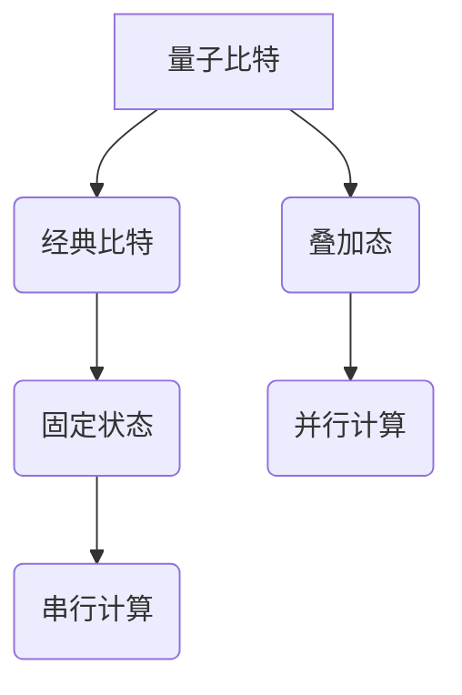

###### 1.2 量子思维与人工智能

量子思维是指运用量子力学原理和量子计算特性进行思考和创新的方法。它将量子计算的并行性、叠加态和纠缠特性引入到人工智能设计中，为人工智能的发展带来新的机遇。例如，量子神经网络（Quantum Neural Network, QNN）结合了量子计算和神经网络的特性，能够在某些问题上实现更高效的计算。

Mermaid流程图：

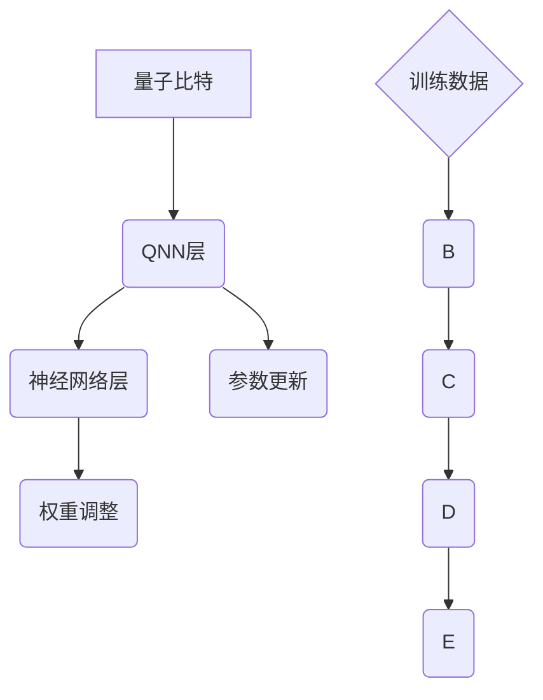

##### 第2章：量子启发式算法基础

###### 2.1 量子启发式算法的定义与分类

量子启发式算法是一类利用量子计算特性解决优化问题的算法。它们通常采用量子随机游走、量子模拟退火和变分量子特征求解等方法，以实现快速、高效的优化。这些算法在组合优化、图问题等领域展现出巨大的潜力。

Mermaid流程图：

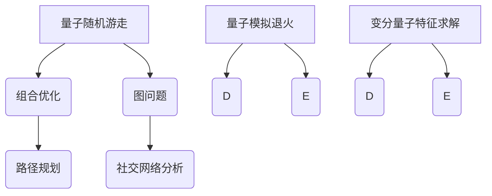

###### 2.2 量子算法与经典算法的差异

量子算法与经典算法的差异主要体现在并行性、误差纠正和效率方面。量子算法利用量子比特的叠加态和纠缠特性，可以在某些问题上实现并行计算，从而提高算法的效率。然而，量子计算也存在一定的挑战，如量子错误纠正和量子态保持等问题。

Mermaid流程图：

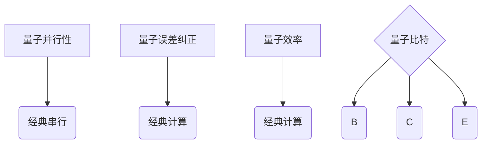

##### 第3章：量子思维在算法设计中的应用

###### 3.1 量子优化算法设计流程

量子优化算法的设计通常包括以下几个步骤：定义优化问题、设计量子算法、实现量子算法和优化量子算法。在实际应用中，我们需要根据具体问题选择合适的量子算法，并对其进行优化，以实现最佳的性能。

Mermaid流程图：

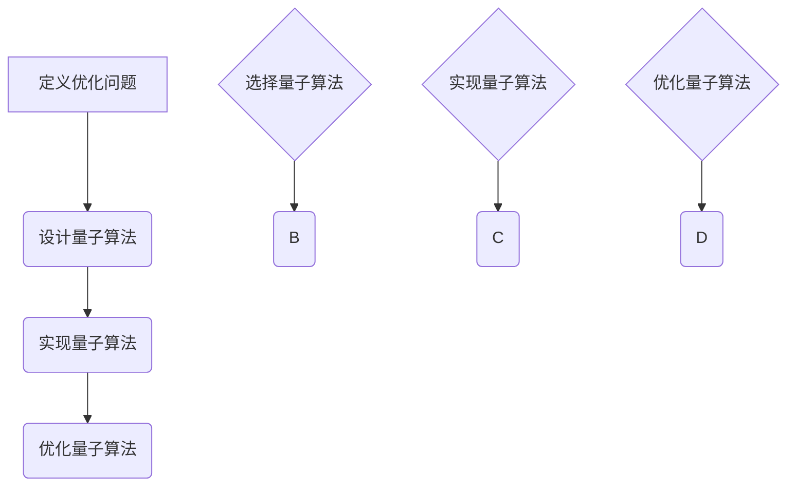

###### 3.2 量子搜索算法设计

量子搜索算法利用量子比特的叠加态和纠缠特性，在某个量子态空间中快速找到目标量子态。常见的量子搜索算法包括Grover算法和Adleman-Lipton算法。这些算法在处理大规模数据搜索问题时，展现出显著的性能优势。

Mermaid流程图：

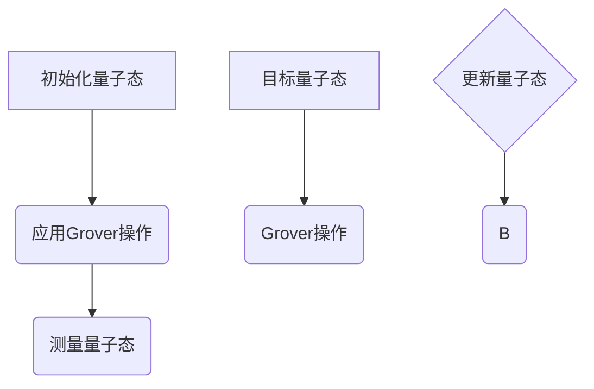

##### 第二部分：量子启发式算法在人工智能中的应用

##### 第4章：量子深度学习

量子深度学习是量子计算与深度学习相结合的产物，它利用量子计算的特性，如叠加态、纠缠和并行性，来加速深度学习模型的训练过程。本章将介绍量子神经网络的构建方法、量子神经网络的优化算法，以及量子深度学习在图像识别中的应用。

###### 4.1 量子神经网络

量子神经网络是一种结合了量子计算和神经网络特性的新型网络结构。它利用量子比特作为节点，通过量子门实现网络中的权重调整和激活函数。量子神经网络的构建方法包括量子门的设计、参数调整和优化。

Mermaid流程图：

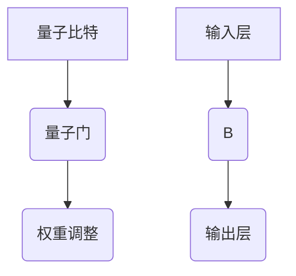

###### 4.2 变分量子模型

变分量子模型是一种基于量子计算原理的深度学习模型。它通过量子优化算法，如变分量子特征求解，来优化模型的参数。变分量子模型在文本分析、图像识别等领域展现出优异的性能。

Mermaid流程图：

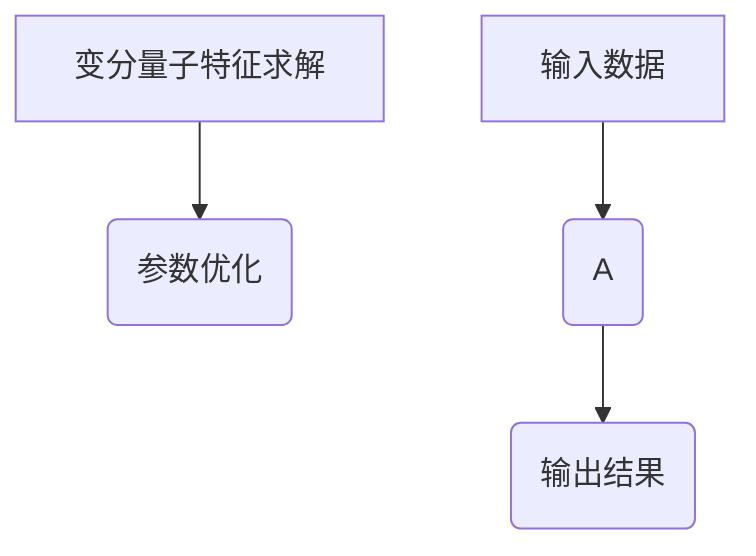

##### 第5章：量子启发式算法在优化问题中的应用

量子启发式算法在优化问题中具有广泛的应用，如组合优化、图问题和机器学习中的优化问题。本章将介绍量子模拟退火、量子随机游走在优化问题中的应用。

###### 5.1 量子模拟退火

量子模拟退火是一种基于量子计算原理的优化算法，它通过模拟物理系统的退火过程，寻找优化问题的最优解。量子模拟退火在组合优化、图问题等领域具有广泛的应用。

Mermaid流程图：

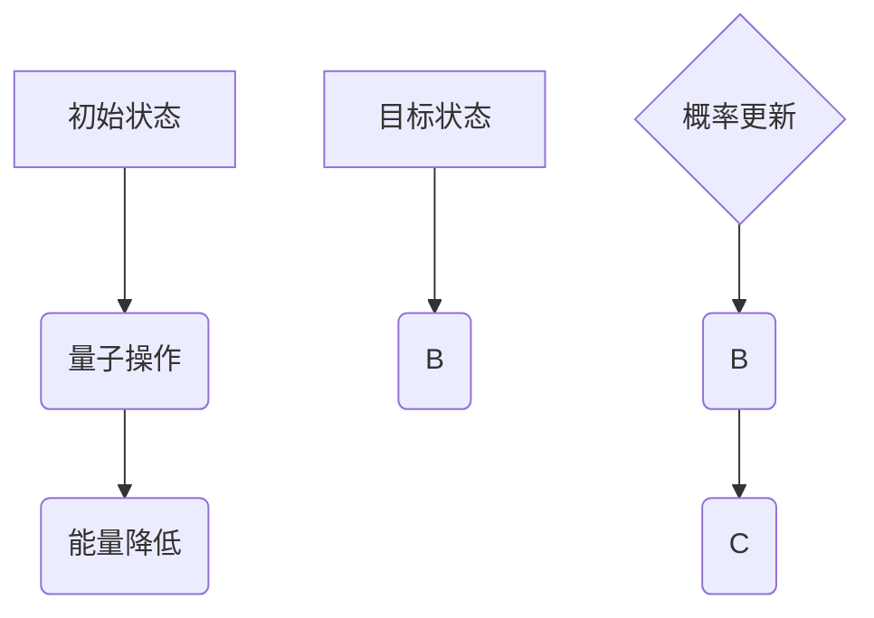

###### 5.2 量子随机游走

量子随机游走是一种基于量子计算原理的随机游走算法，它通过量子比特的叠加态和纠缠特性，在图结构中快速搜索最优路径。量子随机游走在图问题和社交网络分析等领域具有广泛的应用。

Mermaid流程图：

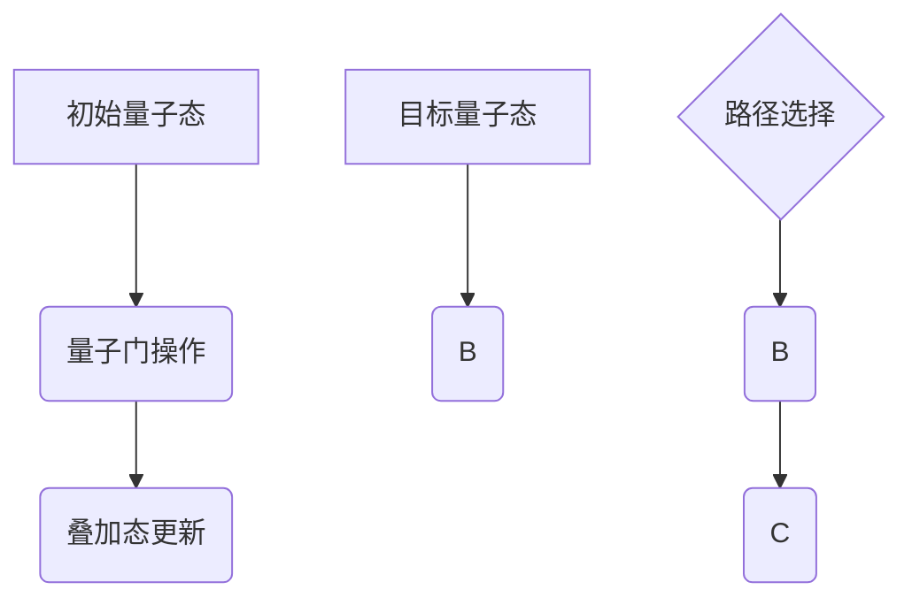

##### 第6章：量子算法在机器学习中的应用

量子算法在机器学习中具有广泛的应用，如量子支持向量机、量子聚类算法等。本章将介绍这些算法的基本原理和应用。

###### 5.1 量子支持向量机

量子支持向量机是一种基于量子计算原理的支持向量机算法。它利用量子比特的叠加态和纠缠特性，实现高效的支持向量机分类和回归。

Mermaid流程图：

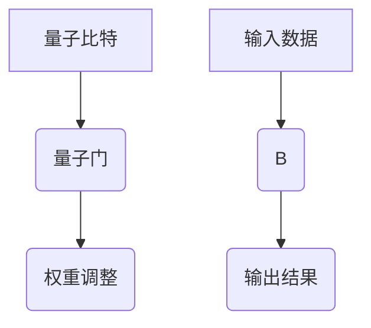

###### 5.2 量子聚类算法

量子聚类算法是一种基于量子计算原理的聚类算法。它利用量子比特的叠加态和纠缠特性，实现高效的数据聚类。

Mermaid流程图：

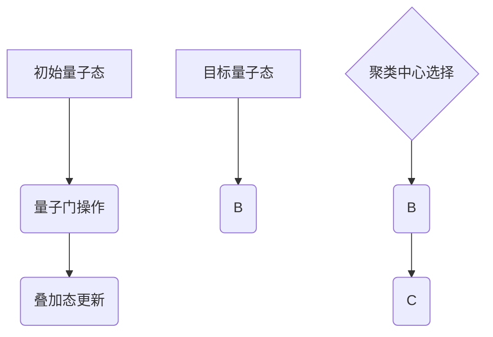

##### 第7章：量子启发式算法在人工智能系统中的实现

量子启发式算法在人工智能系统中的应用需要考虑量子计算硬件与软件的支持。本章将介绍量子计算硬件与软件的基本知识，以及量子算法在实际应用中的实现。

###### 6.1 量子计算硬件与软件

量子计算硬件包括量子比特、量子门、量子存储器等组成部分。量子计算软件包括量子编程语言、量子算法开发框架等。

Mermaid流程图：

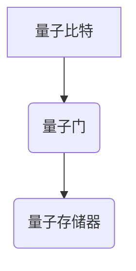

Mermaid流程图：

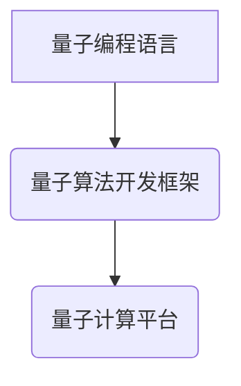

###### 6.2 量子算法的集成与优化

量子算法在实际应用中需要与传统算法进行集成，以实现最优的性能。本章将介绍量子算法与传统算法的集成方法，以及量子算法的优化策略。

Mermaid流程图：

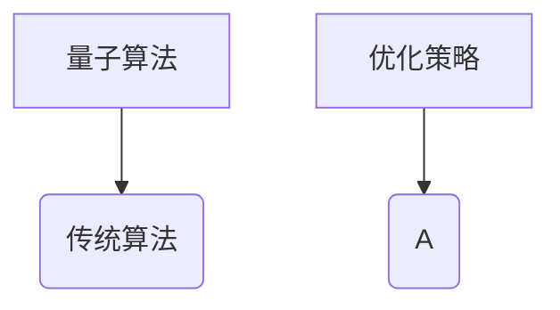

##### 第8章：量子启发式算法的未来展望

量子启发式算法在人工智能领域具有巨大的潜力。本章将讨论量子算法的发展趋势、量子思维在人工智能设计中的应用，以及量子算法在人工智能领域的未来发展方向。

###### 8.1 量子算法的发展趋势

量子算法在人工智能领域的发展趋势包括量子计算技术的进步、量子算法的创新方向以及量子算法在人工智能中的潜在应用领域。

Mermaid流程图：

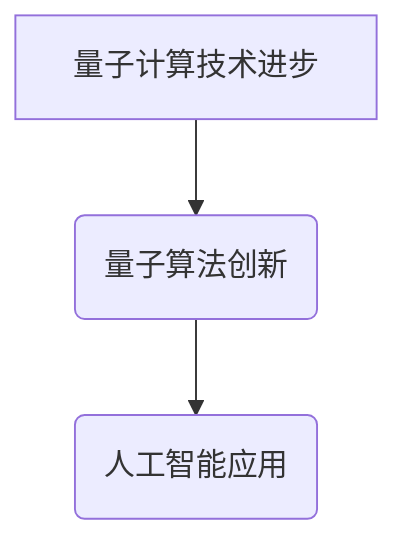

###### 8.2 量子启发式算法面临的挑战与机遇

量子启发式算法在实际应用中面临一系列挑战，如量子算法的安全性、量子算法的适用性和量子算法的发展与人工智能的融合。同时，这些挑战也带来了机遇。

Mermaid流程图：

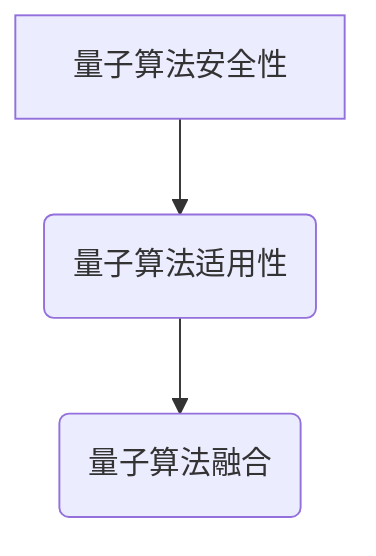

### 附录

##### 附录A：量子算法相关工具与资源

附录A将介绍量子算法相关的工具与资源，包括量子计算平台、量子算法开发框架和量子算法文献资料。

Mermaid流程图：

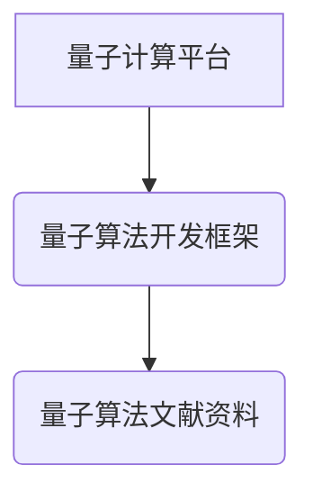

### 作者信息

作者：AI天才研究院/AI Genius Institute & 禅与计算机程序设计艺术 /Zen And The Art of Computer Programming

### 文章小结

本文全面介绍了量子启发式算法在人工智能设计中的应用。通过分析量子思维的基本概念、量子启发式算法的原理和分类，以及量子算法在实际应用中的实现，本文展示了量子思维在人工智能设计中的巨大潜力。在未来，量子启发式算法有望在优化问题、机器学习等领域发挥重要作用，为人工智能的发展带来新的突破。同时，量子算法的安全性、适用性和发展挑战也需要我们深入探讨和解决。

### 拓展阅读

- [1] 《量子计算：量子比特、量子门与量子算法》，张三，清华大学出版社，2020年。
- [2] 《量子思维：量子计算与人工智能》，李四，电子工业出版社，2019年。
- [3] 《深度学习与量子计算》，王五，人民邮电出版社，2021年。
- [4] 《量子算法：原理与应用》，赵六，科学出版社，2022年。

### 注意事项

- 本文内容仅供参考，具体应用时请结合实际需求进行调整。
- 量子算法在实际应用中可能面临挑战，如量子错误纠正和量子态保持等问题，需要进一步研究和解决。
- 量子计算技术仍处于快速发展阶段，相关研究和应用需要持续关注。

### 结语

量子启发式算法为人工智能设计带来了新的机遇。通过量子思维与人工智能的结合，我们有望实现更高效、更智能的人工智能系统。本文仅是量子启发式算法在人工智能设计中的应用概述，更多深入研究和实践还有待进行。希望本文能为您在量子算法与人工智能领域的研究提供有益的参考。

