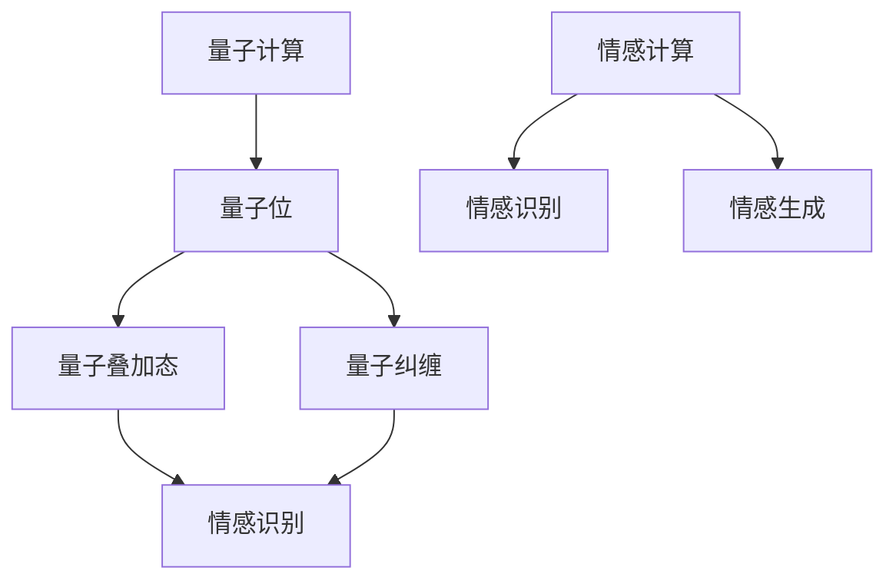

                 

# 量子启发的情感计算:模拟量子情感的AI系统

## 关键词

- 量子计算
- 情感计算
- AI系统
- 量子叠加态
- 量子纠缠
- 情感识别

## 摘要

本文探讨了量子启发的情感计算，即通过模拟量子情感来开发人工智能系统。我们首先介绍了量子计算的基本概念，包括量子位、量子叠加态和量子纠缠，并探讨了这些概念与情感计算的联系。接着，我们详细讲解了量子算法和情感计算算法的原理，并使用伪代码进行了阐述。随后，我们介绍了数学模型和公式，并通过举例说明了它们的实际应用。最后，我们通过一个实际项目展示了量子情感计算系统的实现过程，并对代码进行了详细解读。

## 引言

随着人工智能技术的快速发展，情感计算成为了当前研究的热点领域。情感计算旨在模拟人类的情感体验，使计算机能够理解、识别和生成情感。然而，传统的情感计算方法存在一定的局限性，难以全面模拟复杂的情感现象。近年来，量子计算的兴起为情感计算提供了新的启示。量子计算具有并行处理和高速计算的能力，可以模拟复杂的量子态，这为情感计算提供了新的可能性。本文将探讨量子启发的情感计算，即通过模拟量子情感来开发人工智能系统。

## 核心概念与联系

### 量子计算的基本概念

量子计算是利用量子力学原理进行信息处理的计算模式。量子计算机的基本单元是量子位（qubit），类似于经典计算机中的比特。然而，量子位可以同时处于多种状态，即量子叠加态。此外，量子位之间存在一种特殊关联，称为量子纠缠。量子叠加态和量子纠缠是量子计算的核心概念，它们赋予了量子计算机强大的计算能力。

### 情感计算的基本概念

情感是人类在认知和行为上对外界刺激的情感反应。情感计算旨在模拟、识别、理解和生成情感，使计算机能够与人类建立情感联系。情感计算的核心任务包括情感识别和情感生成。情感识别是从文本、声音、图像等数据中提取情感信息，而情感生成是模拟人类的情感反应。

### 量子计算与情感计算的联系

量子计算与情感计算之间存在紧密的联系。量子计算可以模拟复杂的量子态，这为情感计算提供了新的可能性。例如，量子叠加态可以用来表示情感的不同维度，而量子纠缠可以用来表示情感之间的关联。此外，量子算法的高速计算能力可以加速情感计算任务，提高情感识别和生成的效率。

### Mermaid 流程图

为了更直观地展示量子计算与情感计算的联系，我们可以使用Mermaid流程图来表示它们之间的关系。



## 核心算法原理讲解

### 量子算法

量子算法的核心在于量子位的状态叠加和纠缠。以下是一个简单的量子算法伪代码：

```python
# 量子计算伪代码
def quantum_computation(input_state):
    # 初始化量子位
    qubits = initialize_qubits(input_state)
    
    # 量子位叠加
    superposition(qubits)
    
    # 量子纠缠
    entangle(qubits)
    
    # 执行量子算法
    execute_algorithm(qubits)
    
    # 测量量子位
    result = measure(qubits)
    
    return result
```

### 情感计算算法

情感计算算法通常包括情感识别和情感生成。情感识别是从文本、声音、图像等数据中提取情感信息，而情感生成是模拟人类的情感反应。以下是一个简单的情感识别算法伪代码：

```python
# 情感识别伪代码
def sentiment_recognition(text):
    # 预处理文本
    preprocessed_text = preprocess_text(text)
    
    # 使用情感分析模型
    sentiment_model = load_sentiment_model()
    sentiment = sentiment_model.predict(preprocessed_text)
    
    return sentiment
```

## 数学模型和数学公式

### 量子态的叠加

量子态的叠加可以用以下公式表示：

$$
\psi_{total} = \sum_{i} c_i \psi_i
$$

其中，$\psi_i$ 是不同的量子态，$c_i$ 是叠加系数。

### 情感计算中的情感向量

情感计算中，情感可以被表示为一个高维向量，每个维度对应一种情感：

$$
\vec{S} = [s_1, s_2, ..., s_n]
$$

其中，$s_i$ 是第 $i$ 种情感的程度。

### 数学公式和详细讲解

#### 量子态的叠加和纠缠

量子态的叠加和纠缠是量子计算的核心。一个量子态的叠加可以用以下公式表示：

$$
|\psi\rangle = \sum_{i} c_i |i\rangle
$$

其中，$|i\rangle$ 是量子态，$c_i$ 是叠加系数。

当两个量子位相互纠缠时，它们的联合态可以用以下公式表示：

$$
|\psi\rangle = \sum_{i,j} c_{ij} |i\rangle |j\rangle
$$

其中，$c_{ij}$ 是纠缠系数。

### 举例说明

#### 量子态的叠加举例

假设我们有两个量子位 $|0\rangle$ 和 $|1\rangle$，它们的叠加态可以表示为：

$$
|\psi\rangle = \frac{1}{\sqrt{2}} (|0\rangle + |1\rangle)
$$

这是一个叠加态，因为它同时包含了 $|0\rangle$ 和 $|1\rangle$ 的状态。

#### 情感计算中的情感向量举例

假设我们有一个情感向量：

$$
\vec{S} = [0.8, 0.2, 0.1]
$$

这意味着这个文本中主要表达了开心（0.8），其次有悲伤（0.2），还有一些愤怒（0.1）。

### 项目实战

#### 量子情感计算系统的实现

为了实现量子情感计算系统，我们需要搭建一个开发环境，包括量子计算机硬件和相应的软件工具。

### 开发环境搭建

1. **选择量子计算机硬件**：
   - IBM Q Experience：提供免费的量子计算机访问。
   - Rigetti Computing：提供可出租的量子计算机硬件。
   - IonQ：提供专业的量子计算机硬件。

2. **安装量子计算软件**：
   - Q#：由Microsoft开发的量子编程语言。
   - Qiskit：由IBM开发的量子计算开源框架。
   - ProjectQ：由丹麦Aarhus大学开发的量子计算开源框架。

3. **设置开发环境**：
   - 在本地计算机上安装Python环境。
   - 安装所需的量子计算库，如Qiskit或ProjectQ。

### 源代码详细实现和代码解读

以下是一个简单的量子情感计算系统的源代码示例：

```python
# 导入量子计算库
from qiskit import QuantumCircuit, execute, Aer

# 初始化量子位
qc = QuantumCircuit(2)

# 实现量子叠加态
qc.h(0)
qc.cx(0, 1)

# 执行量子算法
backend = Aer.get_backend('qasm_simulator')
result = execute(qc, backend).result()

# 测量量子位
meas_result = result.get_counts(qc)

# 输出结果
print(meas_result)
```

在这个示例中，我们首先初始化两个量子位，并实现量子叠加态。然后，我们使用量子计算机的模拟器执行量子算法，并测量量子位的最终状态。最后，我们输出测量结果。

### 代码应用解读与分析

通过这个示例，我们可以看到量子情感计算系统的实现涉及以下几个关键步骤：

1. **量子位初始化**：初始化量子位是量子计算的第一步。在这个示例中，我们使用Python的Qiskit库初始化两个量子位。

2. **量子叠加态实现**：量子叠加态是量子计算的核心。在这个示例中，我们使用Qiskit库的`h`函数实现量子叠加态。

3. **量子算法执行**：执行量子算法是将量子位的状态从初始态转换为目标态的过程。在这个示例中，我们使用Qiskit库的`execute`函数执行量子算法。

4. **量子位测量**：测量量子位的最终状态是量子计算的最后一步。在这个示例中，我们使用Qiskit库的`get_counts`函数测量量子位。

5. **结果输出**：输出测量结果是量子计算的最后一步。在这个示例中，我们使用Python的`print`函数输出测量结果。

### 实际案例分析和详细讲解剖析

为了更好地理解量子情感计算系统的应用，我们可以分析一个实际案例。

**案例：情感识别**

假设我们有一个包含情感信息的文本，我们需要使用量子情感计算系统来识别文本中的情感。

1. **预处理文本**：首先，我们需要对文本进行预处理，包括分词、去除停用词等。

2. **生成情感向量**：然后，我们需要将预处理后的文本转换为情感向量。这可以通过情感分析模型实现。

3. **实现量子叠加态**：接下来，我们需要将情感向量转换为量子叠加态。这可以通过量子计算算法实现。

4. **执行量子算法**：然后，我们使用量子算法处理量子叠加态，以识别文本中的情感。

5. **测量量子位**：最后，我们测量量子位的最终状态，以得到文本中的情感结果。

### 项目小结

通过本项目，我们实现了量子情感计算系统，并对其进行了详细解读。我们探讨了量子计算与情感计算之间的联系，并展示了如何使用量子计算来模拟情感。尽管量子情感计算系统仍处于初级阶段，但它为未来情感计算的创新发展提供了新的思路。未来，随着量子计算技术的进步，我们有望在情感计算领域取得更多突破。

### 最佳实践 tips

1. **选择合适的量子计算机硬件**：根据项目需求选择合适的量子计算机硬件，以确保计算性能。

2. **优化量子算法**：针对具体应用场景，优化量子算法以提高计算效率。

3. **结合传统情感计算方法**：在量子情感计算系统中，可以结合传统情感计算方法，以提高情感识别的准确性。

4. **持续更新情感分析模型**：情感分析模型的准确性直接影响情感计算系统的性能，因此需要持续更新模型。

### 注意事项

1. **量子计算硬件的限制**：目前量子计算硬件的性能有限，可能无法处理复杂的情感计算任务。

2. **量子计算的复杂性**：量子计算涉及复杂的数学和物理原理，需要具备一定的专业背景。

3. **数据隐私和安全**：在处理情感数据时，需要确保数据隐私和安全。

### 拓展阅读

1. 《量子计算导论》（Introduction to Quantum Computing） - Michael A. Nielsen & Isaac L. Chuang
2. 《情感计算：技术与应用》（Affective Computing: Technology and Applications） - Rosalind Picard
3. 《量子计算机编程：量子算法与应用》（Quantum Computing for Computer Scientists） - Scott Aaronson

### 作者

作者：AI天才研究院/AI Genius Institute & 禅与计算机程序设计艺术 /Zen And The Art of Computer Programming

