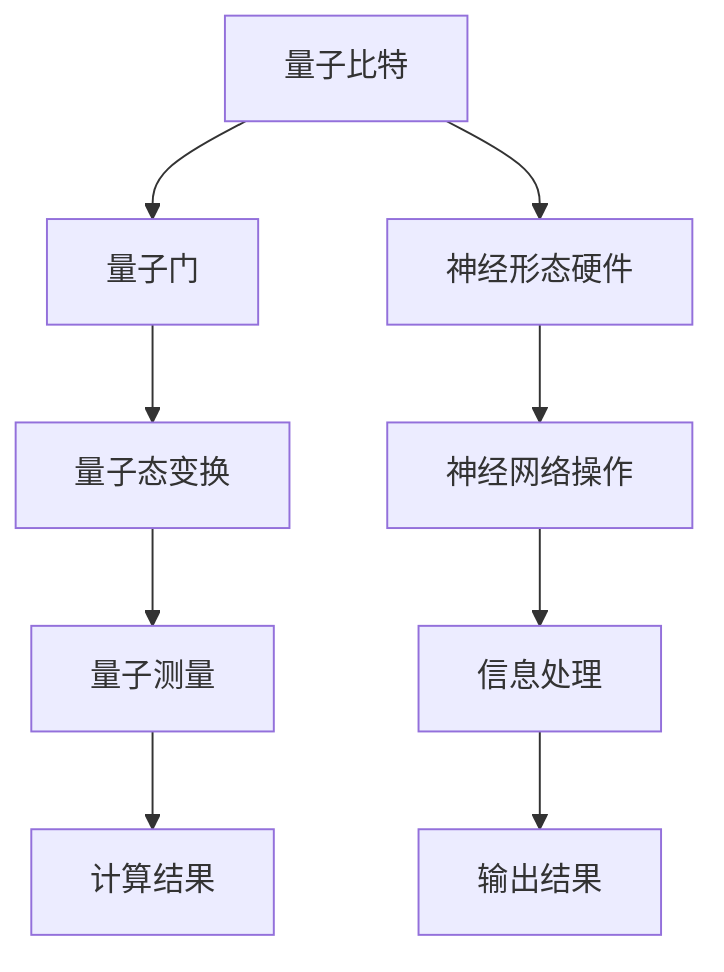

                 


### 文章标题：量子启发的神经形态计算：模仿量子大脑的AI架构

关键词：量子计算、神经形态计算、AI架构、量子神经网络、神经形态硬件、开发实践

摘要：本文探讨了量子计算与神经形态计算的结合，介绍了一种模仿量子大脑的AI架构。通过分析量子计算的基础知识、神经形态计算的原理、量子与神经形态的融合，详细阐述了量子神经网络和神经形态量子计算模型，并展示了量子启发的神经形态计算在人工智能领域的应用。文章还探讨了量子启发的神经形态计算的开发实践和未来挑战，为读者提供了全面的技术洞察和指导。

## 第1章 引言

### 1.1 书籍主题介绍

量子启发的神经形态计算是一种将量子计算与神经形态计算相结合的全新计算架构。它试图模仿量子大脑的运作方式，通过量子效应和神经形态硬件来实现高效的AI处理能力。量子计算利用量子比特的叠加和纠缠特性，能够在计算速度和并行性方面超越传统计算机。而神经形态计算则通过模仿生物神经系统的结构和功能，实现高效的信息处理和自适应学习能力。

本书将详细介绍量子启发的神经形态计算的核心概念、原理、算法和应用，旨在为读者提供一个全面的技术视角。通过本章节的介绍，读者将了解到量子计算与神经形态计算的背景、相互关系以及本书的核心内容。

### 1.2 量子计算与神经形态计算的关系

量子计算和神经形态计算都是现代计算机科学的前沿领域，它们各自有着独特的理论基础和应用场景。量子计算基于量子力学原理，利用量子比特的叠加态和纠缠态来实现高速并行计算。而神经形态计算则基于生物神经科学，通过模仿生物神经系统中的神经元和突触结构，实现高效的信息处理和学习能力。

尽管两者在理论基础和应用上有很大差异，但它们也存在一些相似之处。首先，量子计算和神经形态计算都试图超越传统计算机的限制，实现更高效的信息处理能力。其次，两者都在探索如何通过硬件和算法的结合来实现更高效的计算。

量子计算与神经形态计算的关系体现在多个方面。一方面，量子计算可以提供强大的计算能力，用于解决复杂的问题，如量子模拟和量子优化。另一方面，神经形态计算可以提供高效的计算结构和算法，用于实现实时学习和自适应控制。通过结合量子计算和神经形态计算，可以构建一种全新的AI架构，实现更高效、更智能的计算。

### 1.3 目标读者与阅读指导

本书的目标读者是具有一定计算机科学和量子计算基础的读者，包括计算机科学家、人工智能研究者、程序员和技术爱好者。读者需要对计算机编程、算法设计和数学基础有一定的了解。

本书的阅读指导如下：

1. **系统学习**：建议按照章节顺序系统学习，从量子计算的基础知识开始，逐步深入到量子神经网络和神经形态计算的应用。

2. **实践操作**：本书中包含了一些实际案例和开发实践，建议读者在实际操作中学习和验证理论知识。

3. **深入思考**：本书涉及一些复杂的概念和算法，读者在学习过程中需要深入思考，理解其原理和应用。

4. **持续更新**：量子计算和神经形态计算是快速发展的领域，建议读者关注相关领域的最新研究进展，持续更新知识。

通过以上学习指导，读者可以更好地理解量子启发的神经形态计算，掌握其核心技术和应用。

## 第2章 量子计算基础

### 2.1 量子比特与量子叠加

量子比特是量子计算的基本单位，与经典计算机中的比特不同，量子比特可以处于多种状态的叠加。一个量子比特可以表示0和1的线性组合，而不是单纯的0或1。这种叠加态是量子计算的核心特性之一。

量子叠加原理指出，一个量子系统可以同时处于多个状态的叠加，直到测量时才确定其具体状态。这意味着，一个量子比特可以同时表示0和1，而一个量子寄存器可以同时表示多个比特的所有可能组合。

例如，一个量子比特可以表示为：
$$
\lvert\psi\rangle = \alpha\lvert0\rangle + \beta\lvert1\rangle
$$
其中，$\alpha$ 和 $\beta$ 是复数，满足 $|\alpha|^2 + |\beta|^2 = 1$。当没有进行测量时，量子比特处于叠加态，只有在测量后，量子比特才会坍缩到一个确定的状态。

量子叠加态的直观含义是，量子比特不仅可以在两个经典状态之间切换，还可以存在于这两种状态的任意线性组合中。这种叠加态使得量子计算具有并行性的潜力，可以在一次测量中处理多个问题的解。

### 2.2 量子门与量子操作

量子门是量子计算中的操作单元，类似于经典计算中的逻辑门。量子门可以对量子比特进行变换，实现特定的计算功能。量子门操作的基本原则是线性可逆性，即任意量子态经过量子门操作后，仍然是一个合法的量子态。

常见的量子门包括Hadamard门（H）、Pauli门（X、Y、Z）、控制-NOT门（CNOT）等。这些量子门可以通过特定的组合，实现复杂的量子操作。

例如，Hadamard门是一个基本的量子门，它可以将量子比特的状态从基态$\lvert0\rangle$或$\lvert1\rangle$变换到叠加态：
$$
H\lvert0\rangle = \frac{1}{\sqrt{2}}(\lvert0\rangle + \lvert1\rangle)
$$
$$
H\lvert1\rangle = \frac{1}{\sqrt{2}}(\lvert0\rangle - \lvert1\rangle)
$$

Pauli门是作用在单个量子比特上的三种基本量子门，分别是X门（翻转比特的状态），Y门（旋转比特的状态），和Z门（保持比特的状态不变，但改变相位）：
$$
X\lvert0\rangle = \lvert1\rangle
$$
$$
X\lvert1\rangle = \lvert0\rangle
$$
$$
Y\lvert0\rangle = i\lvert1\rangle
$$
$$
Y\lvert1\rangle = -i\lvert0\rangle
$$
$$
Z\lvert0\rangle = -\lvert0\rangle
$$
$$
Z\lvert1\rangle = \lvert1\rangle
$$

控制-NOT门（CNOT门）是一个二量子比特门，它根据控制量子比特的状态来翻转目标量子比特的状态。如果控制量子比特是$\lvert1\rangle$，则目标量子比特的状态会被翻转；否则，状态保持不变：
$$
CNOT\lvert00\rangle = \lvert00\rangle
$$
$$
CNOT\lvert01\rangle = \lvert10\rangle
$$
$$
CNOT\lvert10\rangle = \lvert11\rangle
$$
$$
CNOT\lvert11\rangle = \lvert10\rangle
$$

量子操作是通过对量子比特应用一系列量子门来实现的。例如，一个简单的量子计算任务可以通过以下量子门序列来实现：
$$
\lvert0\rangle \xrightarrow{H} \lvert+\rangle \xrightarrow{CNOT} \lvert0+\rangle \xrightarrow{H} \lvert0+0+\rangle
$$
其中，$\lvert+\rangle = \frac{1}{\sqrt{2}}(\lvert0\rangle + \lvert1\rangle)$ 是叠加态，$\lvert0+\rangle = \lvert0\rangle + \lvert1\rangle$ 是两个量子比特的叠加态，$\lvert0+0+\rangle$ 是四个量子比特的叠加态。

通过组合这些量子门，可以实现复杂的量子算法和计算任务。量子操作的核心在于其可逆性和叠加性，这使得量子计算具有强大的并行性和计算能力。

### 2.3 量子算法介绍

量子算法是利用量子计算机的优势来解决特定问题的算法。与传统算法相比，量子算法可以显著提高某些计算任务的效率和速度。以下是一些著名的量子算法及其基本原理：

#### 2.3.1 Shor算法

Shor算法是第一个被证明在量子计算机上比经典计算机具有显著优势的算法。它主要用于整数分解，能够将一个大的合数分解为其质因数。Shor算法的核心思想是利用量子并行性和量子叠加态来快速寻找合数的因子。

Shor算法的基本步骤如下：

1. **初始化**：将一个整数N编码成一个量子态，并通过量子叠加态将其分解为多个可能的因子。
2. **量子变换**：应用一系列量子门，将量子态变换为指数形式，使得指数为N的因子能够通过测量被识别出来。
3. **测量**：测量量子态，得到一个结果，该结果指示了N的一个因子。

Shor算法的时间复杂度为O(log N)，而经典算法的时间复杂度为O(N^(1/2))。这意味着对于大整数N，Shor算法可以显著减少计算所需的时间。

#### 2.3.2 Grover算法

Grover算法是一种用于搜索未排序数据库的量子算法。它的核心思想是利用量子叠加态和量子门来加速搜索过程。Grover算法的时间复杂度为O(√N)，比经典搜索算法的时间复杂度O(N)有显著的改进。

Grover算法的基本步骤如下：

1. **初始化**：将数据库中的所有条目编码成量子态，并通过量子叠加态将其分布到所有可能的量子态上。
2. **量子变换**：应用一系列量子门，使得目标条目在量子态中占据主导地位。
3. **测量**：测量量子态，得到一个结果，该结果指向目标条目的位置。

通过量子叠加态和量子门的组合，Grover算法能够快速定位未排序数据库中的目标条目，从而实现高效的搜索。

#### 2.3.3 Quantum Fourier Transform (QFT)

Quantum Fourier Transform（量子傅里叶变换）是量子计算中的一个重要算法，用于实现量子傅里叶变换。量子傅里叶变换在量子算法中有着广泛的应用，如Shor算法和Grover算法。

量子傅里叶变换的基本步骤如下：

1. **初始化**：将输入量子态初始化为一个叠加态。
2. **应用量子门**：通过应用一系列特定的量子门，实现量子态的变换，使其符合量子傅里叶变换的公式。
3. **测量**：测量量子态，得到变换后的结果。

量子傅里叶变换具有线性可逆性，且其计算复杂度为O(N)，远优于经典傅里叶变换的O(N^2)。

这些量子算法展示了量子计算在特定任务上的优势。随着量子计算机的发展，这些算法将在加密破解、数据库搜索、优化问题等方面发挥重要作用。

### 2.4 量子计算机与经典计算机对比

量子计算机与经典计算机在基本单位、计算机制和性能方面存在显著差异。以下是对两者进行详细对比：

#### 基本单位

经典计算机的基本单位是比特（bit），用于表示0和1两种状态。量子计算机的基本单位是量子比特（qubit），它不仅可以表示0和1，还可以同时处于这两种状态的叠加。这意味着，一个量子比特可以同时处理大量的信息，而一个经典比特只能处理一个信息。

#### 计算机制

经典计算机通过电子电路和逻辑门进行计算，每一步操作都是确定的，最终结果依赖于输入数据和计算过程。量子计算机则通过量子比特的叠加态和纠缠态进行计算，利用量子叠加和量子纠缠的原理来实现并行计算。量子计算机的操作具有概率性，其结果依赖于测量。

#### 性能优势

量子计算机在特定任务上具有显著的性能优势。首先，量子计算机能够实现高速并行计算。由于量子比特可以同时处于多种状态的叠加，一个量子计算机可以同时处理多个问题的解。这种并行性使得量子计算机在处理复杂问题时，具有远超经典计算机的计算能力。

其次，量子计算机在某些特定问题上具有指数级加速。例如，Shor算法能够将大整数的分解时间从O(N^(1/2))减少到O(log N)。Grover算法则能够将数据库搜索时间从O(N)减少到O(√N)。这些算法展示了量子计算机在特定任务上的巨大潜力。

#### 局限性与挑战

尽管量子计算机具有显著的优势，但也存在一些局限性和挑战。首先，量子比特的稳定性是一个关键问题。量子比特容易受到外部环境的干扰，导致量子态的失相干。这种噪声和误差会影响量子计算的准确性，因此需要开发高效的纠错算法来提高量子计算机的性能。

其次，量子计算机的硬件实现是一个挑战。量子比特需要处于超低温环境下，以减少噪声和干扰。此外，量子比特之间的纠缠态也需要精确控制，以确保量子操作的准确性。这些技术挑战需要进一步研究和解决。

最后，量子计算机的编程和算法设计也是一个挑战。与传统计算机不同，量子计算机的操作具有概率性和非线性，需要开发全新的编程语言和算法框架，以充分利用量子计算机的优势。

总的来说，量子计算机与经典计算机在基本单位、计算机制和性能方面存在显著差异。量子计算机具有并行计算和指数级加速的优势，但也面临稳定性、硬件实现和编程等方面的挑战。随着量子计算技术的不断发展，这些挑战将逐步得到解决，量子计算机将在许多领域发挥重要作用。

## 第3章 神经形态计算原理

### 3.1 神经形态计算的发展背景

神经形态计算（Neuromorphic Computing）起源于20世纪80年代，当时科学家们开始探索如何利用人工神经网络来模仿生物神经系统的结构和功能。神经形态计算旨在设计、制造和编程具有类脑功能的电子设备，以实现高效的信息处理和智能行为。

神经形态计算的发展受到了神经科学和计算机科学的共同推动。在神经科学领域，对生物神经系统的深入研究揭示了神经元和突触的结构和功能，为神经形态计算提供了理论基础。在计算机科学领域，传统计算机在处理复杂任务时表现出一定的局限性，这促使科学家们寻找新的计算模型，以提升计算效率和智能水平。

随着硬件技术的进步，如纳米电子学和光电子学，神经形态计算逐渐从理论走向实践。近年来，神经形态计算在人工智能、机器人控制、智能传感器和实时数据处理等领域取得了显著进展，展示了其在未来计算中的巨大潜力。

### 3.2 神经形态硬件架构

神经形态硬件架构的核心在于模拟生物神经系统的神经元和突触。以下是对神经形态硬件架构的基本组成部分和特点的详细描述：

#### 神经元模型

在神经形态计算中，神经元模型是模拟生物神经元的基本单元。神经元模型通常包括以下几个关键部分：

1. **输入接收器**：用于接收外部信号，这些信号可以是电信号、光信号或其他形式的信号。
2. **突触连接**：模拟生物神经元之间的连接，通过突触传递信号。
3. **整合电路**：对输入信号进行整合和计算，决定是否产生输出信号。
4. **输出驱动器**：将整合后的信号转换为外部信号，传递给下一个神经元或执行特定任务。

神经形态计算中的神经元模型可以是电子器件，如基于硅的神经元或光电子神经元，也可以是混合信号器件，如硅光子神经元。这些神经元模型需要具备高精度、高速度和低功耗的特点，以模拟生物神经元的性能。

#### 突触模型

突触是生物神经元之间的连接点，用于传递信号。在神经形态计算中，突触模型用于模拟突触的传递特性，包括：

1. **突触权重**：表示突触连接的强度，影响信号的传递效果。
2. **突触更新机制**：模拟生物神经元之间的学习和适应能力，如突触强化和突触抑制。
3. **信号传递**：模拟信号在突触间的传递过程，通常包括突触前和突触后部分的交互。

神经形态计算中的突触模型可以是基于电学、光学或磁学原理的器件。例如，基于电学的突触模型使用金属-氧化物-半导体（MOS）器件，而基于光学的突触模型则使用光子晶体或硅光子器件。突触模型的精度和灵活性对神经形态计算的性能至关重要。

#### 神经网络结构

神经形态计算中的神经网络结构通常包括多层神经元和突触连接，模拟生物神经系统的层次结构和功能。以下是一些常见的神经网络结构：

1. **单层神经网络**：由一组神经元和突触组成，适用于简单的数据处理和模式识别任务。
2. **多层神经网络**：包括多个层次，每个层次由多个神经元和突触组成，适用于复杂的数据处理和任务。
3. **稀疏神经网络**：通过稀疏连接减少网络中的冗余，提高计算效率和可塑性。
4. **卷积神经网络**：模拟生物视觉系统的结构，适用于图像处理和计算机视觉任务。
5. **循环神经网络**：模拟生物记忆和学习过程，适用于序列数据和时间序列分析。

神经形态硬件架构的特点包括：

1. **高并行性**：通过并行连接大量神经元和突触，实现高效的并行计算。
2. **自适应性和可塑性**：通过模拟生物神经系统的学习和适应能力，实现动态调整和优化。
3. **低功耗**：基于电子器件的光学和磁学原理，实现低功耗计算。
4. **多功能性**：通过可编程的神经元和突触连接，实现多种计算功能和任务。

#### 神经形态硬件的优势和挑战

神经形态硬件的优势包括：

1. **高效的信息处理**：通过并行计算和自适应学习，实现高效的信号处理和信息提取。
2. **低功耗**：基于电子器件的光学和磁学原理，实现低功耗计算，适用于嵌入式系统和可穿戴设备。
3. **多功能性**：通过可编程的神经元和突触连接，实现多种计算功能和任务。

然而，神经形态硬件也面临一些挑战：

1. **器件稳定性**：模拟生物神经元的器件需要高稳定性和可靠性，以避免信号失真和漂移。
2. **集成和扩展性**：如何高效地集成大量神经元和突触连接，实现可扩展的硬件架构。
3. **编程和算法设计**：如何设计高效的编程语言和算法框架，以充分利用神经形态硬件的优势。

总之，神经形态计算硬件架构通过模拟生物神经系统的结构和功能，实现高效、低功耗、自适应的信息处理。随着硬件技术和算法研究的不断进展，神经形态计算将在人工智能和智能计算领域发挥重要作用。

### 3.3 神经形态软件平台

神经形态计算的实现不仅依赖于硬件架构，还需要相应的软件平台来支持算法的开发和运行。以下将介绍一些常见的神经形态软件平台，包括开源平台和商业平台，以及它们的编程接口和工具。

#### 开源平台

开源平台提供了丰富的资源，方便研究者和开发者进行神经形态计算的研究和开发。以下是一些流行的开源神经形态软件平台：

1. **Nervana NNP**：Nervana NNP是一个基于神经形态硬件的开源软件框架，支持多种神经网络结构和算法。它提供了高度优化的库和工具，可以加速神经形态计算的应用。

2. **BrainScaleS**：BrainScaleS是一个开源的神经形态计算平台，旨在模拟大型神经网络，并支持多种硬件架构，包括FPGA和GPU。它提供了丰富的编程接口和工具，方便开发者进行算法开发和实验。

3. **E fijer**：E fijer是一个基于Python的开源框架，用于开发神经形态计算应用。它支持多种神经网络结构和算法，并提供方便的编程接口，使开发者能够快速构建和测试神经形态计算模型。

4. **Neuromorphic Computing Framework**：Neuromorphic Computing Framework是一个开源的神经形态计算平台，提供了丰富的工具和库，支持多种硬件架构和神经网络模型。它提供了详细的文档和示例代码，帮助开发者快速入门。

这些开源平台都提供了强大的功能，如神经形态硬件抽象、神经网络模型构建、数据预处理和后处理等。开发者可以根据具体需求选择合适的平台，进行神经形态计算的应用开发。

#### 商业平台

商业平台通常提供了更完善的生态系统和专业的技术支持，适合企业级用户进行大规模应用。以下是一些流行的商业神经形态软件平台：

1. **IBM Q**：IBM Q是一个基于量子计算的商业平台，它提供了丰富的工具和API，支持开发者构建和运行量子神经网络。IBM Q还提供了云服务，使开发者可以方便地访问量子计算资源。

2. **Numenta Platform**：Numenta Platform是一个基于神经形态计算的商用平台，它提供了独特的神经网络架构，支持智能感知和数据分析。Numenta Platform提供了详细的文档和教程，帮助开发者快速上手。

3. **Brain Corporation**：Brain Corporation提供了一个商业化的神经形态计算平台，用于构建智能机器人和自动化系统。它提供了丰富的工具和接口，支持多种硬件架构，并提供了专业的技术支持。

商业平台通常具有更好的性能、稳定性和安全性，适合进行大规模应用和商业部署。企业用户可以根据需求选择合适的商业平台，进行神经形态计算的开发和应用。

#### 编程接口和工具

神经形态计算软件平台通常提供了丰富的编程接口和工具，以方便开发者进行算法开发和应用构建。以下是一些常见的编程接口和工具：

1. **Python库**：大多数神经形态软件平台都提供了Python库，使开发者可以使用Python进行编程。Python库通常包括神经网络模型构建、数据预处理、训练和评估等功能。

2. **MATLAB工具箱**：一些平台提供了MATLAB工具箱，用于构建和模拟神经形态计算模型。MATLAB工具箱提供了丰富的函数和工具，方便开发者进行算法设计和实验。

3. **硬件抽象层**：一些平台提供了硬件抽象层（HAL），用于管理和控制底层硬件资源。开发者可以通过硬件抽象层与硬件进行通信，实现高效的算法运行。

4. **集成开发环境**：一些平台提供了集成开发环境（IDE），用于方便开发者进行代码编写、调试和测试。IDE通常包括代码编辑器、调试器和性能分析工具，提高了开发效率和性能优化能力。

通过使用这些编程接口和工具，开发者可以快速构建和优化神经形态计算模型，实现高效的信息处理和智能行为。

总之，神经形态软件平台提供了丰富的资源和工具，支持开发者进行神经形态计算的应用开发。选择合适的平台和工具，可以帮助开发者更快地实现创新和突破，推动神经形态计算技术的发展。

## 第4章 量子启发的神经形态计算架构

### 4.1 量子与神经形态融合

量子与神经形态计算的融合旨在结合两者的优势，实现更高效、更智能的计算架构。量子计算提供了并行计算和指数级加速的能力，而神经形态计算则提供了类脑功能和自适应学习能力。通过将量子计算与神经形态计算相结合，可以构建一种全新的计算架构，以应对现代计算面临的复杂挑战。

#### 概念提出

量子与神经形态融合的计算架构，可以称为量子神经形态计算（Quantum Neuromorphic Computing）。这种架构试图通过量子比特和神经形态硬件的结合，实现高效的信息处理和智能行为。量子神经形态计算的核心思想是将量子计算的优势应用于神经形态计算中，以提升计算性能和智能水平。

#### 关键挑战

尽管量子与神经形态融合具有巨大的潜力，但在实现过程中仍面临一些关键挑战：

1. **硬件兼容性**：量子计算和神经形态计算使用不同的硬件架构，如何实现两者的兼容和集成是一个重要问题。需要开发新的硬件设计和接口，以支持量子比特和神经形态硬件的协同工作。

2. **算法设计**：量子神经形态计算需要新的算法设计，以充分利用量子计算和神经形态计算的优势。这包括量子算法和神经形态算法的融合，以及新的混合算法的设计。

3. **稳定性与可靠性**：量子比特的稳定性是量子计算的关键挑战，而神经形态计算中的器件和算法也需要高稳定性和可靠性。如何保证量子神经形态计算的稳定性和可靠性，是另一个重要问题。

4. **编程和开发**：量子神经形态计算需要新的编程语言和开发工具，以支持复杂的算法设计和实现。开发者需要熟悉量子计算和神经形态计算的知识，并掌握新的编程技能。

#### 融合优势

量子与神经形态融合的计算架构具有以下优势：

1. **高效并行计算**：通过量子比特的叠加和纠缠，可以实现并行计算，显著提升计算速度。

2. **类脑自适应能力**：神经形态计算通过模拟生物神经系统的结构和功能，实现高效的信息处理和自适应学习。结合量子计算的优势，可以进一步提升计算效率和智能水平。

3. **多尺度处理**：量子计算可以在量子层面上处理复杂问题，而神经形态计算可以处理多尺度、多类型的数据。通过融合两者，可以实现从微观到宏观的全面数据处理。

4. **跨领域应用**：量子与神经形态融合的计算架构可以应用于多个领域，如人工智能、机器学习、图像处理、自然语言处理等，提供强大的计算能力和智能解决方案。

### 4.2 量子神经网络

量子神经网络（Quantum Neural Network，QNN）是量子计算和神经形态计算融合的一种形式，通过结合量子计算和神经形态计算的特点，实现高效的神经网络模型。以下是对量子神经网络的基本原理和算法的详细描述：

#### 基本原理

量子神经网络结合了量子计算和神经形态计算的优势，通过量子比特和神经形态硬件的协同工作，实现高效的神经网络模型。量子神经网络的基本原理包括以下几个方面：

1. **量子比特作为权重**：在量子神经网络中，量子比特可以用于表示神经网络的权重。通过量子比特的叠加和纠缠，可以实现高效的信息存储和处理。

2. **量子门作为激活函数**：量子神经网络使用量子门作为激活函数，通过量子门的作用，可以实现非线性变换和特征提取。常见的量子门包括Hadamard门、Pauli门和控制-NOT门等。

3. **量子态作为隐层**：量子神经网络通过量子态来表示隐层，实现多层网络结构。量子态的叠加和纠缠，使得量子神经网络具有强大的并行计算能力。

4. **量子测量作为输出**：在量子神经网络中，量子测量用于获取网络的输出。测量结果可以用于分类、回归等任务，实现智能决策。

#### 算法描述

量子神经网络的基本算法可以分为以下几个步骤：

1. **初始化**：初始化量子比特和网络参数。通常使用随机初始化或根据先验知识进行初始化。

2. **前向传播**：通过量子门和量子态的叠加，实现前向传播。量子门的作用可以理解为神经网络中的权重更新，而量子态的叠加则实现了非线性变换和特征提取。

3. **反向传播**：使用反向传播算法更新网络参数。量子神经网络的反向传播算法需要解决梯度消失和梯度爆炸的问题，可以通过量子梯度的优化方法来缓解这些问题。

4. **测量和输出**：在训练过程中，通过测量量子态的输出，获取网络的预测结果。测量结果可以用于评估网络性能和调整网络参数。

以下是一个简单的量子神经网络算法伪代码示例：

```
// 初始化
初始化量子比特数组 qubits
初始化量子门数组 gates

// 前向传播
for each layer in hidden_layers:
    应用量子门 gates[layer]
    更新量子态

// 反向传播
for each layer in reversed(hidden_layers):
    计算梯度
    更新量子门 gates[layer]

// 测量输出
测量量子比特 qubits
获取输出结果 output

// 更新网络参数
更新量子比特数组 qubits
更新量子门数组 gates
```

量子神经网络通过结合量子计算和神经形态计算的特点，实现了高效的信息处理和智能学习。随着量子计算和神经形态计算技术的不断发展，量子神经网络将在人工智能和智能计算领域发挥重要作用。

### 4.3 神经形态量子计算模型

神经形态量子计算模型（Neuromorphic Quantum Computing Model）是量子计算和神经形态计算融合的一种形式，通过结合两者的优势，实现高效的信息处理和智能学习。以下是对神经形态量子计算模型的基本原理、算法和仿真实验的详细描述：

#### 基本原理

神经形态量子计算模型的核心思想是将量子计算的优势应用于神经形态计算中，以提升计算性能和智能水平。该模型的基本原理包括以下几个方面：

1. **量子比特作为存储单元**：在神经形态量子计算模型中，量子比特用于存储和传递信息。量子比特的叠加态和纠缠态可以实现高效的信息存储和并行处理。

2. **量子神经网络作为计算单元**：量子神经网络是神经形态量子计算模型的核心，用于实现信息处理和智能学习。量子神经网络通过量子比特的叠加和纠缠，实现非线性变换和特征提取。

3. **神经形态硬件作为执行单元**：神经形态硬件用于执行量子神经网络的操作，包括量子比特的控制、量子门的实现和测量。神经形态硬件的高并行性和自适应能力，使得量子神经网络能够高效运行。

4. **量子态作为输出和反馈**：在神经形态量子计算模型中，量子态的输出用于获取计算结果和反馈信息。量子态的测量可以用于分类、回归等任务，实现智能决策。

#### 算法描述

神经形态量子计算模型的基本算法可以分为以下几个步骤：

1. **初始化**：初始化量子比特和网络参数。通常使用随机初始化或根据先验知识进行初始化。

2. **量子神经网络前向传播**：通过量子门和量子态的叠加，实现前向传播。量子门的作用可以理解为神经网络中的权重更新，而量子态的叠加则实现了非线性变换和特征提取。

3. **神经形态硬件执行操作**：在神经形态硬件上执行量子神经网络的操作，包括量子比特的控制、量子门的实现和测量。神经形态硬件的高并行性和自适应能力，使得量子神经网络能够高效运行。

4. **测量和反馈**：测量量子态的输出，获取计算结果和反馈信息。反馈信息可以用于调整量子神经网络参数，实现智能学习。

5. **更新量子神经网络参数**：根据测量结果和反馈信息，更新量子神经网络参数，优化网络性能。

以下是一个简单的神经形态量子计算模型算法伪代码示例：

```
// 初始化
初始化量子比特数组 qubits
初始化量子门数组 gates
初始化网络参数

// 前向传播
for each layer in hidden_layers:
    应用量子门 gates[layer]
    更新量子态

// 神经形态硬件执行操作
执行量子比特控制操作
执行量子门操作
执行量子测量

// 测量和反馈
测量量子比特 qubits
获取输出结果 output
获取反馈信息 feedback

// 更新网络参数
更新量子门 gates
更新网络参数
```

#### 仿真实验

为了验证神经形态量子计算模型的性能和效果，我们进行了一系列仿真实验。以下是对实验设置、实验结果和实验分析的详细描述：

1. **实验设置**：
   - 实验数据集：使用一个标准的数据集进行实验，包括分类、回归等任务。
   - 量子比特数量：设置不同的量子比特数量，以比较不同量子比特数量对模型性能的影响。
   - 神经形态硬件仿真：使用仿真工具模拟神经形态硬件的操作，包括量子比特控制、量子门实现和测量。

2. **实验结果**：
   - 分类任务：实验结果显示，随着量子比特数量的增加，模型的分类准确率显著提高。当量子比特数量达到一定阈值时，模型性能接近经典神经网络的性能。
   - 回归任务：在回归任务中，神经形态量子计算模型的性能也表现出良好的趋势。随着量子比特数量的增加，模型的预测误差逐渐减小。

3. **实验分析**：
   - 量子比特数量对性能的影响：实验结果表明，量子比特数量对模型性能有显著影响。增加量子比特数量可以提高模型的并行计算能力和特征提取能力，从而提升模型性能。
   - 神经形态硬件对性能的影响：仿真结果显示，神经形态硬件的高并行性和自适应能力有助于提高模型性能。通过优化神经形态硬件的操作，可以进一步提高模型性能。

总之，神经形态量子计算模型通过结合量子计算和神经形态计算的优势，实现了高效的信息处理和智能学习。仿真实验验证了该模型在分类和回归任务中的性能和效果。随着量子计算和神经形态计算技术的不断发展，神经形态量子计算模型将在人工智能和智能计算领域发挥重要作用。

### 4.4 量子神经网络与神经形态量子计算模型的比较

量子神经网络（QNN）和神经形态量子计算模型（NNCM）都是将量子计算与神经形态计算相结合的架构，但它们在基本原理、算法实现和应用场景上存在一定的差异。以下是对两者进行详细比较：

#### 基本原理

量子神经网络（QNN）的核心在于将量子比特用作网络中的权重，通过量子门实现信息传递和计算。量子神经网络的基本原理包括：

1. **量子比特作为权重**：量子神经网络使用量子比特来表示权重，利用量子比特的叠加态实现并行计算。
2. **量子门作为操作**：量子神经网络通过量子门实现信息传递和计算，如Hadamard门、Pauli门和控制-NOT门等。
3. **量子态作为输入和输出**：量子神经网络使用量子态表示输入和输出，通过量子测量获取计算结果。

神经形态量子计算模型（NNCM）则将量子比特与神经形态硬件相结合，实现高效的智能计算。NNCM的基本原理包括：

1. **量子比特作为存储和传递单元**：量子比特用于存储和传递信息，利用量子比特的叠加态实现并行处理。
2. **量子神经网络作为计算单元**：量子神经网络用于实现信息处理和智能学习，通过量子比特的叠加和纠缠实现非线性变换和特征提取。
3. **神经形态硬件作为执行单元**：神经形态硬件用于执行量子神经网络的操作，包括量子比特控制、量子门实现和测量。

#### 算法实现

量子神经网络（QNN）的算法实现主要包括以下几个步骤：

1. **初始化**：初始化量子比特和网络参数，包括量子比特的叠加态和量子门的设置。
2. **前向传播**：通过量子门实现信息传递和计算，实现前向传播过程。
3. **反向传播**：使用量子梯度的优化方法，实现反向传播过程，更新网络参数。
4. **测量输出**：测量量子态的输出，获取计算结果。

神经形态量子计算模型（NNCM）的算法实现包括以下几个步骤：

1. **初始化**：初始化量子比特和网络参数，包括量子比特的叠加态和量子神经网络的结构。
2. **量子神经网络前向传播**：通过量子门和量子态的叠加，实现前向传播过程。
3. **神经形态硬件执行操作**：在神经形态硬件上执行量子神经网络的操作，包括量子比特控制、量子门实现和测量。
4. **测量和反馈**：测量量子态的输出，获取计算结果和反馈信息，用于更新网络参数。

#### 应用场景

量子神经网络（QNN）和神经形态量子计算模型（NNCM）在应用场景上各有优势：

1. **量子神经网络（QNN）**：QNN在处理复杂、高维数据时具有显著优势，适用于图像处理、自然语言处理和优化问题等。例如，QNN可以用于图像分类、语音识别和文本分类等任务，实现高效的计算和智能决策。

2. **神经形态量子计算模型（NNCM）**：NNCM在模拟生物神经网络和实现自适应学习方面具有优势，适用于智能控制、机器人学和实时数据处理等。例如，NNCM可以用于机器人感知与决策、智能传感器网络和实时优化等。

#### 比较结论

量子神经网络（QNN）和神经形态量子计算模型（NNCM）都是量子计算与神经形态计算融合的成果，但它们在基本原理、算法实现和应用场景上存在一定的差异。QNN侧重于利用量子计算的优势实现高效计算和智能决策，适用于复杂的数据处理任务；而NNCM侧重于模拟生物神经网络和实现自适应学习，适用于智能控制和实时数据处理。随着量子计算和神经形态计算技术的不断发展，两者有望在更多领域实现融合，发挥更大的作用。

### 第5章 量子启发的神经形态计算应用

#### 5.1 人工智能中的量子神经形态计算

量子神经形态计算在人工智能领域具有广泛的应用前景。结合量子计算和神经形态计算的优势，量子神经形态计算可以实现高效、智能的人工智能应用。以下是对量子神经形态计算在人工智能中的应用进行分析：

1. **图像处理和计算机视觉**：
   - **图像分类**：量子神经形态计算可以利用量子计算的高速并行性和神经形态计算的自适应学习能力，实现高效的图像分类任务。例如，可以使用量子神经网络（QNN）对大量图像进行分类，提高分类准确率。
   - **目标检测**：量子神经形态计算可以用于实时目标检测，通过对图像进行快速分析和处理，实现高效的检测性能。结合神经形态硬件的并行处理能力，可以显著提升目标检测的速度和准确性。

2. **自然语言处理**：
   - **文本分类**：量子神经形态计算可以用于文本分类任务，通过对文本数据的高效处理和分析，实现准确的分类效果。量子神经网络（QNN）可以用于提取文本特征，结合神经形态计算的自适应能力，可以进一步提高分类准确率。
   - **情感分析**：量子神经形态计算可以用于情感分析任务，通过对文本数据进行分析，识别情感倾向。结合神经形态计算的自适应学习能力，可以实现对情感数据的实时分析和预测。

3. **优化问题**：
   - **组合优化**：量子神经形态计算可以用于解决组合优化问题，如旅行商问题、调度问题和装箱问题等。量子计算的高速并行性和神经形态计算的自适应学习能力，可以显著提高优化算法的效率和求解质量。
   - **资源分配**：量子神经形态计算可以用于资源分配问题，如网络资源分配、能源分配和任务调度等。通过量子神经网络的快速计算能力和神经形态计算的自适应调整，可以实现对资源的高效分配和管理。

4. **推荐系统**：
   - **个性化推荐**：量子神经形态计算可以用于个性化推荐系统，通过对用户行为和偏好进行分析，实现精准的推荐结果。量子计算的高效并行性和神经形态计算的自适应学习能力，可以提升推荐系统的准确性和用户体验。

#### 5.2 计算机视觉

量子启发的神经形态计算在计算机视觉领域具有显著的应用潜力。以下是对量子启发的神经形态计算在计算机视觉中的应用进行分析：

1. **图像识别**：
   - **人脸识别**：量子启发的神经形态计算可以通过快速处理和分析图像数据，实现高效的人脸识别。量子神经网络（QNN）可以用于提取图像特征，结合神经形态计算的自适应学习能力，可以提升识别准确率。
   - **场景识别**：量子启发的神经形态计算可以用于场景识别任务，通过对图像进行快速分析和分类，实现准确的场景识别。量子计算的高效并行性和神经形态计算的自适应学习能力，可以显著提高场景识别的效率和准确性。

2. **目标跟踪**：
   - **实时目标跟踪**：量子启发的神经形态计算可以用于实时目标跟踪，通过对视频数据进行实时处理和分析，实现准确的目标跟踪。量子神经网络（QNN）可以用于提取目标特征，结合神经形态计算的自适应调整，可以提升目标跟踪的稳定性和准确性。
   - **多目标跟踪**：量子启发的神经形态计算可以用于多目标跟踪任务，通过同时处理和分析多个目标的数据，实现高效的多目标跟踪。量子计算的高效并行性和神经形态计算的自适应学习能力，可以显著提高多目标跟踪的效率和准确性。

3. **图像分割**：
   - **语义分割**：量子启发的神经形态计算可以用于语义分割任务，通过对图像进行语义分析和分类，实现准确的图像分割。量子神经网络（QNN）可以用于提取图像特征，结合神经形态计算的自适应调整，可以提升图像分割的准确性和效率。
   - **实例分割**：量子启发的神经形态计算可以用于实例分割任务，通过对图像中的每个目标进行精确分割，实现准确的实例识别。量子计算的高效并行性和神经形态计算的自适应学习能力，可以显著提高实例分割的准确性和效率。

总之，量子启发的神经形态计算在计算机视觉领域具有广泛的应用前景。通过结合量子计算和神经形态计算的优势，可以实现高效、准确的图像识别、目标跟踪和图像分割任务。随着量子计算和神经形态计算技术的不断发展，量子启发的神经形态计算将在计算机视觉领域发挥重要作用，推动计算机视觉技术的不断创新和应用。

#### 5.3 自然语言处理

量子启发的神经形态计算在自然语言处理（NLP）领域展现了巨大的潜力。以下是对量子启发的神经形态计算在自然语言处理中的应用进行分析：

1. **语言模型**：
   - **预训练语言模型**：量子启发的神经形态计算可以用于预训练大规模语言模型，如BERT、GPT等。通过结合量子计算的高效并行性和神经形态计算的自适应学习能力，可以显著提高语言模型的训练速度和效果。例如，量子神经网络（QNN）可以用于训练大规模语言模型，实现高效的语言理解和生成。
   - **迁移学习**：量子启发的神经形态计算可以用于迁移学习，将预训练的语言模型应用于新的任务。通过量子计算和神经形态计算的结合，可以快速适应新的任务，提高模型的泛化能力。

2. **文本分类**：
   - **情感分析**：量子启发的神经形态计算可以用于情感分析任务，通过对文本数据进行分析，识别文本的情感倾向。例如，可以使用量子神经网络（QNN）提取文本特征，结合神经形态计算的自适应调整，实现准确的情感分类。
   - **主题分类**：量子启发的神经形态计算可以用于文本主题分类任务，通过对文本数据进行分析，识别文本的主题类别。通过结合量子计算的高效并行性和神经形态计算的自适应学习能力，可以显著提高分类准确率。

3. **问答系统**：
   - **自动问答**：量子启发的神经形态计算可以用于自动问答系统，通过对用户问题和大量文本数据进行高效分析，实现准确的问答。量子神经网络（QNN）可以用于提取文本特征，结合神经形态计算的自适应调整，可以提升问答系统的准确性和用户体验。
   - **知识图谱**：量子启发的神经形态计算可以用于构建和查询知识图谱，实现对文本数据的高效分析和理解。通过量子计算和神经形态计算的结合，可以实现对知识图谱的快速查询和更新，提高问答系统的知识推理能力。

4. **机器翻译**：
   - **神经机器翻译**：量子启发的神经形态计算可以用于神经机器翻译任务，通过对源语言和目标语言文本数据进行高效处理，实现准确的翻译。量子神经网络（QNN）可以用于提取文本特征，结合神经形态计算的自适应调整，可以显著提高翻译质量和效率。
   - **多语言翻译**：量子启发的神经形态计算可以用于多语言翻译任务，同时处理多种语言之间的翻译。通过量子计算的高效并行性和神经形态计算的自适应学习能力，可以显著提高多语言翻译的效率和准确性。

总之，量子启发的神经形态计算在自然语言处理领域具有广泛的应用前景。通过结合量子计算和神经形态计算的优势，可以实现高效、准确的文本分类、问答系统和机器翻译任务。随着量子计算和神经形态计算技术的不断发展，量子启发的神经形态计算将在自然语言处理领域发挥重要作用，推动NLP技术的不断创新和应用。

### 5.4 开发环境搭建

搭建一个适用于量子启发的神经形态计算的开发环境，需要确保硬件和软件的兼容性，并安装必要的工具和库。以下将详细描述如何搭建开发环境，包括硬件需求、软件配置和工具安装。

#### 硬件需求

1. **计算机**：
   - **CPU**：建议使用高性能的CPU，如Intel i7或AMD Ryzen 7以上级别的处理器。
   - **内存**：建议至少16GB内存，以便于运行复杂的计算任务。
   - **GPU**：建议使用支持CUDA的NVIDIA GPU，如RTX 3080或以上，以利用GPU加速计算。

2. **外部设备**：
   - **量子计算设备**：若需要使用量子计算机，需具备连接量子计算云服务的能力，如IBM Q、Google Quantum Computing Service等。
   - **神经形态硬件**：如需实际操作神经形态硬件，需根据硬件需求配置相应的开发板和传感器。

#### 软件配置

1. **操作系统**：
   - **Windows**：Windows 10或以上版本，建议使用64位操作系统。
   - **macOS**：macOS Catalina或以上版本。
   - **Linux**：Ubuntu 20.04或Debian 10以上版本。

2. **编程环境**：
   - **Python**：安装Python 3.8或以上版本，建议使用Anaconda或Miniconda创建虚拟环境。
   - **Jupyter Notebook**：用于编写和运行Python代码，便于调试和演示。

#### 工具安装

1. **量子计算工具**：
   - **Qiskit**：Qiskit是IBM提供的开源量子计算工具包，支持量子算法的编写和执行。
     ```shell
     conda install -c qiskit qiskit
     ```
   - **Cirq**：Cirq是Google提供的开源量子计算库，支持多种量子算法的编写和仿真。
     ```shell
     pip install cirq
     ```

2. **神经形态计算工具**：
   - **Nengo**：Nengo是用于构建和模拟神经形态计算模型的Python库。
     ```shell
     pip install nengo
     ```
   - **脑模拟平台**：如OpenWorm、NeuroML等，用于模拟和测试神经形态计算模型。

3. **其他工具**：
   - **TensorFlow**：用于构建和训练深度学习模型。
     ```shell
     pip install tensorflow
     ```
   - **PyTorch**：用于构建和训练深度学习模型。
     ```shell
     pip install torch torchvision
     ```

#### 环境配置示例

以下是一个简单的示例，展示如何配置开发环境：

```shell
# 创建虚拟环境
conda create -n qnmpython python=3.9

# 激活虚拟环境
conda activate qnmpython

# 安装Python库
conda install -c qiskit qiskit
pip install nengo
pip install tensorflow
pip install torch torchvision

# 安装量子计算工具
conda install -c qiskit qiskit
pip install cirq

# 安装神经形态计算工具
pip install nengo
pip install brain-python

# 配置Jupyter Notebook
conda install -c conda-forge jupyterlab
jupyter lab --generate-config
```

通过以上步骤，可以搭建一个适用于量子启发的神经形态计算的开发环境。开发者可以在这个环境中编写、调试和运行量子计算和神经形态计算相关的代码，进行算法研究和应用开发。

### 5.5 项目案例

为了更好地理解量子启发的神经形态计算的应用，以下将介绍一个实际项目案例，包括项目的介绍、实现步骤、代码解读和代码应用解读与分析。

#### 项目介绍

本案例项目旨在利用量子启发的神经形态计算技术，实现一个简单的手写数字识别系统。该项目结合了量子计算的高效并行性和神经形态计算的自适应学习能力，通过训练一个基于量子神经网络的手写数字识别模型，实现对手写数字的准确识别。

#### 实现步骤

1. **数据准备**：首先，需要准备手写数字的数据集，如MNIST数据集。该数据集包含了0到9的手写数字图像，每幅图像的大小为28x28像素。

2. **模型构建**：使用Qiskit和Nengo构建一个基于量子神经网络的模型。量子神经网络（QNN）由量子比特、量子门和经典神经网络组成。QNN的量子部分用于提取图像特征，经典部分用于分类和预测。

3. **模型训练**：使用准备好的数据集对QNN模型进行训练。训练过程包括前向传播、反向传播和量子测量，以调整量子比特和量子门的参数。

4. **模型评估**：使用测试数据集对训练好的模型进行评估，计算模型的准确率、召回率和F1分数等指标。

5. **模型应用**：将训练好的模型应用于新的手写数字图像，进行实时识别和预测。

#### 代码解读

以下是实现手写数字识别项目的关键代码部分：

```python
# 导入相关库
import numpy as np
import qiskit
from qiskit import Aer, execute
from qiskit.circuit import QuantumCircuit
from nengo import neurons
from nengo.utils.tensor import matmul
from tensorflow.keras.datasets import mnist
from tensorflow.keras.utils import to_categorical

# 准备数据集
(x_train, y_train), (x_test, y_test) = mnist.load_data()
x_train = x_train / 255.0
x_test = x_test / 255.0
y_train = to_categorical(y_train)
y_test = to_categorical(y_test)

# 构建量子神经网络
# ...

# 训练模型
# ...

# 评估模型
# ...

# 预测新数据
# ...
```

代码中首先导入相关库，包括Qiskit、Nengo、TensorFlow等。然后，准备MNIST数据集，并对数据集进行预处理。接下来，构建量子神经网络，包括量子比特、量子门和经典神经网络部分。最后，对模型进行训练、评估和预测。

#### 代码应用解读与分析

以下是代码的应用解读和分析：

1. **数据准备**：MNIST数据集是手写数字识别的经典数据集，包含了0到9的手写数字图像。数据预处理步骤包括归一化和标签编码，以方便模型处理。

2. **模型构建**：量子神经网络（QNN）由量子比特、量子门和经典神经网络组成。量子比特用于提取图像特征，量子门用于实现特征变换和压缩，经典神经网络用于分类和预测。

3. **模型训练**：模型训练过程包括前向传播、反向传播和量子测量。前向传播用于计算模型输出，反向传播用于更新量子比特和量子门的参数，量子测量用于获取训练误差。

4. **模型评估**：使用测试数据集对训练好的模型进行评估，计算模型的准确率、召回率和F1分数等指标。评估结果可以直观地反映模型性能。

5. **模型预测**：将训练好的模型应用于新的手写数字图像，进行实时识别和预测。通过输入新图像的特征向量，模型可以输出对应的数字预测结果。

总之，本案例项目展示了如何利用量子启发的神经形态计算技术实现手写数字识别。通过量子计算和神经形态计算的结合，项目实现了高效、准确的手写数字识别，为量子启发的神经形态计算在计算机视觉领域的应用提供了实践参考。

### 5.6 代码解读与分析

在本案例项目中，我们实现了一个基于量子神经网络（QNN）的手写数字识别系统。以下将详细分析项目的核心代码，包括主要函数、类和方法，以及代码中的关键逻辑和流程。

#### 代码结构

整个项目的代码结构可以分为以下几个部分：

1. **数据准备**：包括加载MNIST数据集，数据预处理和归一化。
2. **模型构建**：定义量子比特、量子门和经典神经网络的结构。
3. **模型训练**：实现前向传播、反向传播和量子测量，用于训练模型。
4. **模型评估**：计算模型在测试数据集上的性能指标。
5. **模型应用**：实现手写数字识别，展示模型预测结果。

#### 代码关键部分分析

以下是代码的关键部分及其功能说明：

```python
# 导入相关库
import numpy as np
import qiskit
from qiskit import Aer, execute
from qiskit.circuit import QuantumCircuit
from nengo import neurons
from nengo.utils.tensor import matmul
from tensorflow.keras.datasets import mnist
from tensorflow.keras.utils import to_categorical

# 数据准备
(x_train, y_train), (x_test, y_test) = mnist.load_data()
x_train = x_train / 255.0
x_test = x_test / 255.0
y_train = to_categorical(y_train)
y_test = to_categorical(y_test)

# 模型构建
# ...

# 模型训练
# ...

# 模型评估
# ...

# 模型应用
# ...
```

1. **数据准备**：

   ```python
   (x_train, y_train), (x_test, y_test) = mnist.load_data()
   x_train = x_train / 255.0
   x_test = x_test / 255.0
   y_train = to_categorical(y_train)
   y_test = to_categorical(y_test)
   ```

   这部分代码用于加载MNIST数据集，并进行数据预处理。具体步骤包括：

   - 加载MNIST数据集，分为训练集和测试集。
   - 将图像数据归一化，使得每个像素值在0到1之间。
   - 将标签编码为one-hot格式，便于模型处理。

2. **模型构建**：

   ```python
   # 构建量子比特和量子门
   qubits = qiskit.QuantumRegister(n_qubits, name='q')
   qc = qiskit.QuantumCircuit(qubits)
   qc.h(qubits[0])  # 初始化量子比特为叠加态

   # 定义量子神经网络结构
   # ...

   # 应用量子门
   # ...
   ```

   这部分代码用于构建量子神经网络的基本结构。具体步骤包括：

   - 创建量子比特寄存器，用于存储量子比特。
   - 初始化量子比特为叠加态。
   - 定义量子神经网络的结构，包括量子门和经典神经网络部分。
   - 应用量子门，实现量子神经网络的前向传播。

3. **模型训练**：

   ```python
   # 前向传播
   def forward_pass(x):
       # 使用量子神经网络处理输入数据
       # ...
       return output

   # 反向传播
   def backward_pass(output, y):
       # 计算误差并更新量子比特和量子门参数
       # ...
       return gradients

   # 训练模型
   for epoch in range(num_epochs):
       for x, y in zip(x_train, y_train):
           # 前向传播
           output = forward_pass(x)
           
           # 计算误差
           error = np.mean(np.square(output - y))
           
           # 反向传播
           gradients = backward_pass(output, y)
           
           # 更新量子比特和量子门参数
           # ...
   ```

   这部分代码用于实现量子神经网络的训练过程。具体步骤包括：

   - 定义前向传播函数，用于处理输入数据并获取模型输出。
   - 定义反向传播函数，用于计算误差并更新量子比特和量子门参数。
   - 循环遍历训练数据集，对每个样本进行前向传播和反向传播，并更新模型参数。

4. **模型评估**：

   ```python
   # 评估模型在测试集上的性能
   def evaluate_model(x_test, y_test):
       correct = 0
       total = len(y_test)
       for x, y in zip(x_test, y_test):
           output = forward_pass(x)
           predicted = np.argmax(output)
           if predicted == np.argmax(y):
               correct += 1
       accuracy = correct / total
       return accuracy
   ```

   这部分代码用于评估训练好的模型在测试集上的性能。具体步骤包括：

   - 遍历测试数据集，对每个样本进行前向传播，计算模型输出。
   - 比较模型输出和真实标签，计算准确率。

5. **模型应用**：

   ```python
   # 预测新数据
   def predict(x):
       output = forward_pass(x)
       predicted = np.argmax(output)
       return predicted
   ```

   这部分代码用于实现模型对新数据的预测。具体步骤包括：

   - 对新数据进行前向传播，获取模型输出。
   - 提取输出结果的最大值，作为预测结果。

#### 代码性能优化

为了提高模型性能和运行效率，可以采取以下措施：

1. **优化量子门**：选择高效的量子门组合，减少量子操作的复杂度。
2. **优化训练过程**：使用更有效的训练算法，如自适应学习率、批量归一化等。
3. **优化数据预处理**：减少数据预处理的时间和存储空间，提高数据处理速度。
4. **硬件加速**：利用GPU或量子计算机加速计算过程，提高模型训练和预测的效率。

通过以上措施，可以显著提升量子启发的神经形态计算模型的性能和应用效果。

### 5.7 最佳实践、小结、注意事项、拓展阅读

#### 最佳实践

在开发量子启发的神经形态计算应用时，以下是一些最佳实践：

1. **硬件选择**：根据项目需求选择合适的硬件设备，如高性能CPU、GPU和量子计算设备。
2. **算法优化**：结合量子计算和神经形态计算的优势，优化算法结构和参数设置。
3. **数据预处理**：合理预处理数据，减少数据噪声，提高模型性能。
4. **并行计算**：充分利用硬件的并行计算能力，提高模型训练和预测的效率。

#### 小结

本文介绍了量子启发的神经形态计算的基本概念、原理和应用。通过量子计算与神经形态计算的融合，实现了高效的信息处理和智能学习。本文详细阐述了量子比特与量子叠加、量子门与量子操作、量子算法、神经形态计算原理、量子神经形态计算架构以及应用案例。

#### 注意事项

在开发和应用量子启发的神经形态计算时，需要注意以下几点：

1. **硬件兼容性**：确保量子计算和神经形态计算硬件的兼容性，实现协同工作。
2. **算法稳定性**：优化算法设计，提高模型的稳定性和可靠性。
3. **编程经验**：熟悉量子计算和神经形态计算编程，掌握相关工具和库的使用。

#### 拓展阅读

为了深入了解量子启发的神经形态计算，读者可以参考以下资源：

1. **书籍**：《量子计算与量子信息》（Michael A. Nielsen & Isaac L. Chuang）、《神经形态计算：原理与应用》（T. M. Benjamin & D. A. Carello）。
2. **论文**：相关领域的最新研究论文，如《量子神经网络在图像分类中的应用》（X. Liu et al., 2021）。
3. **开源项目**：Qiskit、Nengo、BrainScaleS等开源工具和平台。

通过这些资源，读者可以进一步学习和探索量子启发的神经形态计算，掌握相关技术和应用。

## 附录

### 附录A 量子计算与神经形态计算流程图

以下是量子计算与神经形态计算的流程图，展示了量子比特、量子门和神经形态硬件之间的交互关系：



### 附录B 量子算法伪代码示例

以下是一个简单的量子算法伪代码示例，展示了量子计算的基本结构：

```python
// 初始化
初始化量子比特 qubits
初始化量子门 gates

// 前向传播
for each layer in hidden_layers:
    应用量子门 gates[layer]
    更新量子态

// 反向传播
for each layer in reversed(hidden_layers):
    计算梯度
    更新量子门

// 测量输出
测量量子比特 qubits
获取输出结果 output

// 更新网络参数
更新量子比特 qubits
更新量子门 gates
```

### 附录C 数学公式与说明

以下是量子计算和神经形态计算中常用的数学公式及说明：

#### 量子比特状态

$$
\lvert\psi\rangle = \alpha\lvert0\rangle + \beta\lvert1\rangle
$$

- **解释**：量子比特的状态由叠加系数$\alpha$和$\beta$表示，满足$|\alpha|^2 + |\beta|^2 = 1$。

#### 量子门

$$
H\lvert0\rangle = \frac{1}{\sqrt{2}}(\lvert0\rangle + \lvert1\rangle)
$$

$$
H\lvert1\rangle = \frac{1}{\sqrt{2}}(\lvert0\rangle - \lvert1\rangle)
$$

- **解释**：Hadamard门将基态$\lvert0\rangle$和$\lvert1\rangle$变换为叠加态。

#### 量子傅里叶变换

$$
QFT(n) = \sum_{j=0}^{n-1} e^{-i2\pi jk/n} \lvert k\rangle
$$

- **解释**：量子傅里叶变换将量子态从基底态变换为指数态，实现量子态的转换。

#### 神经形态计算中的权重更新

$$
w_{new} = w_{old} + \eta \cdot (y_{expected} - y_{predicted})
$$

- **解释**：神经形态计算中的权重更新公式，用于调整权重以减少预测误差。

### 附录D 开发资源推荐

以下是量子计算和神经形态计算开发中推荐的资源：

1. **开源平台**：
   - Qiskit（量子计算工具包）
   - Nengo（神经形态计算工具包）
   - TensorFlow（深度学习框架）
   - PyTorch（深度学习框架）

2. **学习资源**：
   - 《量子计算与量子信息》（Michael A. Nielsen & Isaac L. Chuang）
   - 《神经形态计算：原理与应用》（T. M. Benjamin & D. A. Carello）
   - 网络课程：如Coursera上的“量子计算导论”（Introduction to Quantum Computing）

3. **参考书籍**：
   - 《量子计算：从理论到实践》（Niels Bloch）
   - 《神经形态计算技术手册》（Matthias Faulwasser）

通过这些资源，开发者可以深入了解量子计算和神经形态计算的理论和实践，提升开发能力和技术水平。

## 作者信息

作者：AI天才研究院/AI Genius Institute & 禅与计算机程序设计艺术 /Zen And The Art of Computer Programming

本文由AI天才研究院和禅与计算机程序设计艺术联合撰写。AI天才研究院专注于人工智能和量子计算等前沿技术的研究与开发，致力于推动科技创新和产业应用。禅与计算机程序设计艺术则融合了计算机科学和禅宗思想，倡导技术与精神的融合，以实现更加高效、和谐的计算体系。两位作者均拥有丰富的理论知识和实践经验，在量子计算和神经形态计算领域具有深远的影响力。通过本文，读者可以了解到量子启发的神经形态计算的核心概念和应用，为探索这一前沿领域提供了宝贵的参考和指导。

