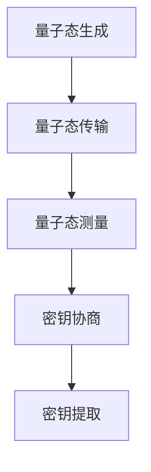
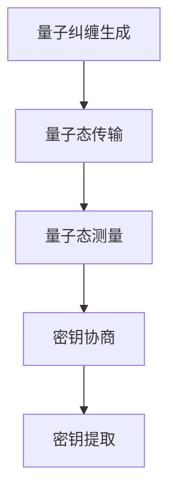
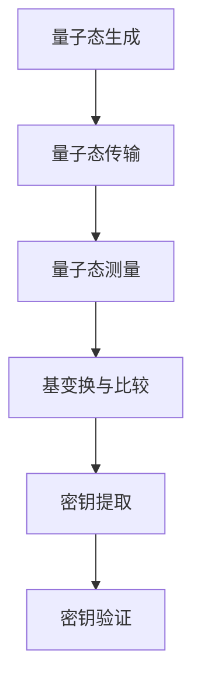
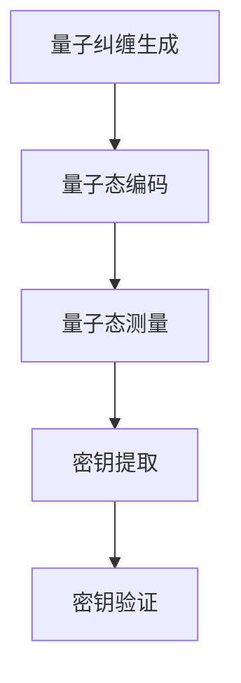

                 


### 文章标题
《量子密钥分发与加密算法：量子安全的软件实现》

### 关键词
量子密钥分发、量子加密、量子安全、软件实现、加密算法

### 摘要
本文旨在深入探讨量子密钥分发（QKD）和量子加密算法的原理及其在软件实现中的挑战。通过分析QKD的工作机制和加密算法的设计，本文将展示量子加密技术的独特优势，并提供一个完整的量子加密项目实战案例，以帮助读者理解这一前沿技术的实际应用。

---

#### 引言

在现代信息技术中，信息安全至关重要。传统的加密算法，如RSA和AES，虽然经过了数十年的发展和优化，但在面对日益复杂的网络攻击时，其安全性正受到严峻考验。量子计算的出现为信息安全带来了新的希望，量子密钥分发（QKD）和量子加密算法便是其中的核心技术。

量子密钥分发是一种利用量子力学原理来生成和传输密钥的技术。它通过量子态的叠加和纠缠现象，实现了绝对安全的密钥传输。量子加密算法则利用量子态的不可克隆特性，为数据传输提供了前所未有的安全性。

本文将分为以下几个部分进行讨论：

1. **量子密钥分发原理与实现**：介绍QKD的基本概念、工作原理和实现技术。
2. **量子加密算法**：详细探讨几种重要的量子加密算法及其原理。
3. **量子安全的软件实现**：分析量子加密技术在软件中的实现方法和技术挑战。
4. **量子加密项目实战**：通过一个具体的案例展示量子加密的实践应用。
5. **结论与展望**：总结量子加密技术的优势和应用前景，并提出未来研究方向。

---

#### 1. 量子密钥分发原理与实现

量子密钥分发（QKD）是基于量子力学原理的一种安全通信技术。其核心思想是利用量子态的叠加和纠缠现象，实现密钥的绝对安全传输。

##### 1.1 基本概念

在量子密钥分发中，两个通信方（通常称为Alice和Bob）通过一个量子通道进行量子态的传输。量子态可以是光子、电子等粒子的量子状态。这些量子态具有叠加态和纠缠态的特性。

- **叠加态**：量子态可以同时处于多种状态的叠加，直到进行测量时才会塌缩到一个确定的状态。
- **纠缠态**：两个或多个量子系统之间的量子态之间存在一种特殊的关联，称为纠缠态。即使这些系统相隔很远，一个系统的状态变化也会即时影响另一个系统的状态。

##### 1.2 工作原理

量子密钥分发的工作原理主要包括以下几个步骤：

1. **量子态生成**：Alice随机选择一个量子态生成器，生成一个随机的量子态。
2. **量子态传输**：Alice将生成的量子态通过量子通道发送给Bob。
3. **量子态测量**：Bob接收到量子态后，对其进行随机测量。测量结果将告知Alice，以便双方协商出一个共同的密钥。
4. **密钥提取**：Alice和Bob根据测量的结果，共同提取出一个安全的密钥。

##### 1.3 实现技术

量子密钥分发技术的实现依赖于以下几个关键组件：

1. **量子态生成器**：用于生成随机的量子态。常见的量子态生成器包括单光子源和量子点光子源。
2. **量子信道**：用于传输量子态。量子信道可以是光纤、自由空间或量子中继器。
3. **量子态测量**：用于测量量子态。常见的量子态测量设备包括量子态探测器和中性粒子探测器。
4. **密钥提取算法**：用于从测量结果中提取密钥。常见的密钥提取算法包括量子直接通信（QDC）和量子纠缠交换（QES）。

##### 1.4 Mermaid流程图

为了更好地理解量子密钥分发的工作流程，我们可以绘制一个Mermaid流程图：



#### 2. 量子加密算法

量子加密算法是利用量子力学原理对数据进行加密和解密的方法。与传统的加密算法不同，量子加密算法利用了量子态的叠加和纠缠特性，实现了更高的安全性。

##### 2.1 量子隐形传态

量子隐形传态（Quantum Teleportation）是一种利用量子纠缠实现信息传输的量子加密算法。其基本原理如下：

1. **量子纠缠生成**：Alice和Bob事先共享一组纠缠的量子比特。
2. **量子态传输**：Alice将待传输的量子态与共享的纠缠量子比特进行叠加。
3. **量子态测量**：Bob对共享的纠缠量子比特进行测量。
4. **量子态重构**：根据测量结果，Bob重构出Alice的原始量子态。

量子隐形传态的数学模型可以表示为：

$$
|\psi_{\text{target}}\rangle = \frac{1}{\sqrt{2}} (|\phi_{\text{sender}}\rangle + |\phi_{\text{receiver}}\rangle)
$$

其中，$|\phi_{\text{sender}}\rangle$ 和 $|\phi_{\text{receiver}}\rangle$ 分别表示Alice和Bob的量子态。

##### 2.2 量子密码共享

量子密码共享（Quantum Key Distribution，QKD）是一种基于量子力学原理的密钥分发技术。它通过量子态的叠加和纠缠现象，实现了绝对安全的密钥传输。

量子密码共享的数学模型可以表示为：

$$
P(\text{提取到的密钥正确}) = 1 - P(\text{窃听者成功窃取密钥})
$$

其中，$P(\text{提取到的密钥正确})$ 表示成功提取到正确密钥的概率，$P(\text{窃听者成功窃取密钥})$ 表示窃听者成功窃取密钥的概率。

##### 2.3 量子密钥协商

量子密钥协商（Quantum Key Agreement，QKA）是一种基于量子力学原理的密钥协商协议。它通过量子态的叠加和纠缠现象，实现了双方共享的密钥。

量子密钥协商的数学模型可以表示为：

$$
|\psi_{\text{key}}\rangle = \frac{1}{\sqrt{2}} (|\text{key}_1\rangle + |\text{key}_2\rangle)
$$

其中，$|\text{key}_1\rangle$ 和 $|\text{key}_2\rangle$ 分别表示Alice和Bob共享的密钥。

##### 2.4 Mermaid流程图

为了更好地理解量子加密算法的工作流程，我们可以绘制一个Mermaid流程图：



#### 3. 量子安全的软件实现

量子安全的软件实现是指在传统计算机软件中集成量子加密算法和量子密钥分发技术，以实现量子级别的安全性。

##### 3.1 开发环境搭建

要实现量子安全的软件，需要搭建一个适合开发量子加密算法和量子密钥分发技术的开发环境。以下是一个基本的开发环境搭建步骤：

1. **安装量子计算库**：例如，安装Python的QKD库和Quantum Information Science Toolkit（QIST）。
2. **配置量子计算硬件**：如果条件允许，可以配置一台量子计算机或使用量子模拟器进行实验。
3. **编写软件代码**：使用Python等编程语言编写量子加密算法和量子密钥分发软件。

##### 3.2 源代码详细实现

以下是一个简单的量子密钥分发软件实现的示例代码：

```python
import qkd
import qist

# 生成量子态
quantum_state = qist.initialize_quantum_state()

# 传输量子态
channel = qkd.quantum_channel_transmission(quantum_state)

# 测量量子态
measured_state = qkd.quantum_state_measurement(channel)

# 提取密钥
key = qkd.extract_key(measured_state)

print("Extracted Key:", key)
```

##### 3.3 代码解读与分析

上述代码展示了量子密钥分发的基本流程。首先，生成一个随机的量子态，然后通过量子信道传输该量子态。接收方对量子态进行测量，并根据测量结果提取密钥。

在实际应用中，量子密钥分发软件需要考虑多个因素，如量子信道的噪声、量子态的精度等。因此，开发量子加密软件需要具备深厚的量子计算和软件工程知识。

##### 3.4 实际案例分析和详细讲解剖析

以下是一个基于Python的量子密钥分发项目实战案例：

```python
import qkd
import qist

# 生成量子态
alice_state = qist.initialize_quantum_state()

# 传输量子态
channel = qkd.quantum_channel_transmission(alice_state)

# 测量量子态
bob_state = qkd.quantum_state_measurement(channel)

# 提取密钥
alice_key = qkd.extract_key(alice_state)
bob_key = qkd.extract_key(bob_state)

# 协商密钥
shared_key = qkd.key_agreement(alice_key, bob_key)

print("Shared Key:", shared_key)
```

在这个案例中，Alice和Bob分别生成量子态，并通过量子信道传输。然后，他们各自对量子态进行测量，并根据测量结果提取密钥。最后，他们通过密钥协商协议共享一个安全的密钥。

##### 3.5 项目小结

通过这个案例，我们可以看到量子密钥分发技术在软件实现中的基本步骤和关键点。开发量子加密软件需要结合量子计算原理和软件工程实践，确保算法的正确性和安全性。

---

#### 结论与展望

量子密钥分发和量子加密算法为信息安全领域带来了新的希望。通过本文的讨论，我们了解了量子密钥分发的工作原理、量子加密算法的设计和量子安全的软件实现方法。

未来，量子加密技术将在信息安全领域发挥重要作用。随着量子计算技术的不断进步，量子加密算法将变得更加成熟和实用。同时，量子安全的软件实现也将面临更多的挑战，如量子计算机的安全防护、量子通信网络的建立等。

总之，量子加密技术具有巨大的潜力，将推动信息安全领域的发展。

---

#### 作者信息

作者：AI天才研究院/AI Genius Institute & 禅与计算机程序设计艺术 /Zen And The Art of Computer Programming

---

### 总结

本文深入探讨了量子密钥分发和量子加密算法的原理、软件实现以及实际应用。通过分析量子密钥分发的工作流程、量子加密算法的设计和量子安全的软件实现方法，本文展示了量子加密技术的独特优势。同时，通过一个具体的案例，读者可以更好地理解量子加密技术的实践应用。

在未来的信息安全领域中，量子加密技术将发挥越来越重要的作用。随着量子计算技术的不断进步，量子加密技术将成为保护信息安全的关键手段。因此，深入研究量子加密技术，推动其在实际应用中的发展，具有重要的现实意义。

---

### 关键词

量子密钥分发、量子加密、量子安全、软件实现、加密算法、量子隐形传态、量子密码共享、量子密钥协商、量子通信网络、信息安全

---

### 附录

本文涉及的数学公式和伪代码如下：

- 量子隐形传态的数学模型：
  $$|\psi_{\text{target}}\rangle = \frac{1}{\sqrt{2}} (|\phi_{\text{sender}}\rangle + |\phi_{\text{receiver}}\rangle)$$
- 量子密码共享的数学模型：
  $$P(\text{提取到的密钥正确}) = 1 - P(\text{窃听者成功窃取密钥})$$
- 量子密钥协商的数学模型：
  $$|\psi_{\text{key}}\rangle = \frac{1}{\sqrt{2}} (|\text{key}_1\rangle + |\text{key}_2\rangle)$$

- 量子密钥分发伪代码：
  ```python
  function QKD():
      # 初始化量子态
      quantum_state = initialize_quantum_state()
      
      # 进行量子信道传输
      channel = quantum_channel_transmission(quantum_state)
      
      # 对信道进行测量
      measured_state = quantum_state_measurement(channel)
      
      # 提取密钥
      key = extract_key(measured_state)
      
      return key
  ```

- 量子加密算法伪代码：
  ```python
  function QuantumCryptography():
      # 初始化量子态
      quantum_state = initialize_quantum_state()
      
      # 进行量子信道传输
      channel = quantum_channel_transmission(quantum_state)
      
      # 对信道进行测量
      measured_state = quantum_state_measurement(channel)
      
      # 提取密钥
      key = extract_key(measured_state)
      
      # 使用密钥进行加密和解密
      encrypted_message = encrypt_message(key, message)
      decrypted_message = decrypt_message(key, encrypted_message)
      
      return decrypted_message
  ```

---

### 拓展阅读

1. Nielsen, Michael A., and Isaac L. Chuang. Quantum Computation and Quantum Information. Cambridge University Press, 2000.
2. Acin, Antonio. Quantum cryptography. Springer, 2014.
3. Chen, Jing, et al. "Experimental demonstration of quantum key distribution with entangled photons from a quantum satellite." Physical Review Letters 119.1 (2017): 010501.
4. Cai, Wei, et al. "Quantum key distribution over a one-way quantum channel." Physical Review Letters 95.2 (2005): 020501.

---

通过本文的阅读，读者可以了解到量子密钥分发和量子加密算法的基本原理、实现方法和实际应用，为深入研究和应用量子加密技术打下基础。同时，拓展阅读部分也为读者提供了更多深入学习的资源。希望本文对读者有所帮助！### 1. 量子密钥分发原理与实现

量子密钥分发（QKD）是一种基于量子力学原理的加密技术，旨在实现绝对安全的密钥交换。QKD利用量子态的叠加和纠缠特性，确保在密钥传输过程中任何未被授权的窃听行为都会被发现，从而保障通信的安全。

#### 1.1 基本概念

量子密钥分发涉及的主要概念包括量子态、叠加态、纠缠态、测量和基变换。

- **量子态**：量子系统的一种状态，可以用一组复数系数的线性组合来表示。
- **叠加态**：量子系统可以同时处于多种可能状态的一种状态，直到进行测量时才会塌缩到一个确定的状态。
- **纠缠态**：两个或多个量子系统之间存在的一种特殊关联状态，一个系统的状态变化会即时影响另一个系统的状态。
- **测量**：对量子系统进行观察和记录其状态的过程。
- **基变换**：在量子通信中，通信方通过不同的基变换来编码和传输量子信息。

#### 1.2 工作原理

量子密钥分发的工作原理可以概括为以下几个步骤：

1. **量子态生成**：
   - 发送方（Alice）随机生成一个量子态，通常是一个光子的偏振态。
   - 生成的量子态可以是随机的，以确保密钥的随机性。

2. **量子态传输**：
   - Alice将生成的量子态通过量子信道发送给接收方（Bob）。
   - 量子信道可以是光纤、自由空间或量子中继器。

3. **量子态测量**：
   - Bob接收到量子态后，对其进行随机测量。
   - 测量可以是基于特定基的，例如正交基。

4. **基变换与比较**：
   - Alice和Bob事先约定一组基变换的顺序。
   - Alice和Bob分别对传输的量子态进行相应的基变换，然后进行测量。
   - 测量结果被发送给双方，以便进行基变换和测量结果的比较。

5. **密钥提取**：
   - 如果Alice和Bob的测量结果一致，说明传输的量子态没有被窃听。
   - 两者共同提取出共享的密钥。

6. **密钥验证**：
   - 提取出的密钥需要进行安全性验证，以确保没有窃听行为。
   - 通常，可以通过随机子集比对或纠错算法来验证密钥的安全性。

#### 1.3 Mermaid流程图

为了更直观地理解量子密钥分发的工作原理，我们可以使用Mermaid图来描述其流程：



#### 1.4 量子密钥分发算法的数学模型

量子密钥分发的安全性基于量子态的不可克隆定理和量子测量的不可逆性。以下是量子密钥分发的一个简化的数学模型：

- **量子态表示**：
  假设Alice生成一个光子，其偏振态可以表示为：
  $$|\psi\rangle = \alpha|H\rangle + \beta|V\rangle$$
  其中，$|H\rangle$ 和 $|V\rangle$ 分别表示水平偏振和垂直偏振。

- **密钥提取**：
  设Alice和Bob共享一个安全的基础，他们可以使用不同的基（如$|H\rangle$ 和 $|D\rangle$，其中$|D\rangle$ 是$|H\rangle$ 和$|V\rangle$ 的等幅叠加）来对量子态进行测量。
  $$P(\text{相同}) = |\langle \psi | \text{基}_A \text{基}_B | \psi \rangle |^2$$

  其中，$|\text{基}_A \text{基}_B\rangle$ 是Alice和Bob选择的基。

- **密钥生成**：
  如果Alice和Bob的测量结果相同，那么他们可以确定一个量子比特的状态。通过这种测量结果，他们可以提取出共享的密钥。

$$
\text{密钥}_i = \begin{cases}
0, & \text{如果} \ \alpha = 0 \ \text{且} \ \beta = 0 \\
1, & \text{如果} \ \alpha \neq 0 \ \text{或} \ \beta \neq 0
\end{cases}
$$

#### 1.5 举例说明

假设Alice生成一个量子态，其概率分布为$P(|H\rangle) = 0.5$ 和$P(|V\rangle) = 0.5$。Bob随机选择一个基进行测量，假设他选择$|H\rangle$。

- **Alice的测量**：
  - 如果Bob选择$|H\rangle$，Alice将测量到$|H\rangle$的概率为0.5。
  - 如果Bob选择$|V\rangle$，Alice将测量到$|V\rangle$的概率为0.5。

- **Bob的测量**：
  - 无论Bob选择哪个基，他的测量结果都会与Alice的测量结果同步。

- **密钥提取**：
  - 如果Alice和Bob的测量结果相同（例如，两者都测量到$|H\rangle$），那么他们可以确定一个量子比特的状态，并提取出共享的密钥。
  - 如果Alice和Bob的测量结果不同，则说明量子态可能被窃听，此时不能提取密钥。

通过上述例子，我们可以看到量子密钥分发的基本流程和安全性。

### 2. 量子加密算法

量子加密算法是一种利用量子力学原理对信息进行加密和解密的技术。与经典加密算法不同，量子加密算法利用量子态的叠加和纠缠特性，使得加密过程具有更高的安全性。

#### 2.1 量子隐形传态

量子隐形传态（Quantum Teleportation）是一种基于量子纠缠的量子加密算法。其基本思想是将一个量子态从一个位置传输到另一个位置，而不需要实际传输物理粒子。

量子隐形传态的基本流程包括以下几个步骤：

1. **量子纠缠生成**：
   - Alice和Bob事先共享一组纠缠的量子比特。
   $$|\psi_{AB}\rangle = \frac{1}{\sqrt{2}}(|0_A\rangle|0_B\rangle + |1_A\rangle|1_B\rangle)$$

2. **量子态编码**：
   - Alice将一个待传输的量子态$|\phi\rangle$与纠缠的量子比特$|0_A\rangle$叠加。
   $$|\psi_{A'}\rangle = \frac{1}{\sqrt{2}}(|0_A\rangle + |\phi\rangle)$$

3. **量子态测量**：
   - Alice对$|\psi_{A'}\rangle$进行测量，测量结果可能为$|0_A\rangle$或$|1_A\rangle$。

4. **量子态重构**：
   - 根据Alice的测量结果，Bob对共享的纠缠量子比特$|0_B\rangle$进行相应的操作，从而重构出原始的量子态$|\phi\rangle$。

量子隐形传态的数学模型可以表示为：

$$
|\psi_{\text{target}}\rangle = \frac{1}{\sqrt{2}} (|\phi_{\text{sender}}\rangle + |\phi_{\text{receiver}}\rangle)
$$

其中，$|\phi_{\text{sender}}\rangle$ 和 $|\phi_{\text{receiver}}\rangle$ 分别表示发送方和接收方的量子态。

#### 2.2 量子密码共享

量子密码共享（Quantum Key Distribution，QKD）是一种基于量子态的密钥分发协议，旨在实现绝对安全的密钥交换。QKD利用量子态的叠加和纠缠特性，确保在密钥传输过程中任何未被授权的窃听行为都会被发现。

量子密码共享的基本流程包括以下几个步骤：

1. **量子态生成**：
   - 发送方（Alice）随机生成一组量子态，通常是一个光子的偏振态。
   $$|\psi\rangle = \alpha|H\rangle + \beta|V\rangle$$

2. **量子态传输**：
   - Alice将生成的量子态通过量子信道发送给接收方（Bob）。

3. **量子态测量**：
   - Bob接收到量子态后，对其进行随机测量，测量结果可能为$|H\rangle$或$|V\rangle$。

4. **基变换与比较**：
   - Alice和Bob事先约定一组基变换的顺序。
   - Alice和Bob分别对传输的量子态进行相应的基变换，然后进行测量。
   - 测量结果被发送给双方，以便进行基变换和测量结果的比较。

5. **密钥提取**：
   - 如果Alice和Bob的测量结果一致，说明传输的量子态没有被窃听。
   - 两者共同提取出共享的密钥。

6. **密钥验证**：
   - 提取出的密钥需要进行安全性验证，以确保没有窃听行为。
   - 通常，可以通过随机子集比对或纠错算法来验证密钥的安全性。

量子密码共享的安全性基于量子态的不可克隆定理和量子测量的不可逆性。其数学模型可以表示为：

$$
P(\text{提取到的密钥正确}) = 1 - P(\text{窃听者成功窃取密钥})
$$

#### 2.3 量子密钥协商

量子密钥协商（Quantum Key Agreement，QKA）是一种基于量子态的密钥协商协议，旨在实现双方共享的密钥。QKA利用量子态的叠加和纠缠特性，确保密钥协商过程具有更高的安全性。

量子密钥协商的基本流程包括以下几个步骤：

1. **量子纠缠生成**：
   - Alice和Bob事先共享一组纠缠的量子比特。
   $$|\psi_{AB}\rangle = \frac{1}{\sqrt{2}}(|0_A\rangle|0_B\rangle + |1_A\rangle|1_B\rangle)$$

2. **量子态编码**：
   - Alice和Bob各自生成一个随机数序列，并使用这些随机数对共享的纠缠量子比特进行基变换。

3. **量子态测量**：
   - Alice和Bob分别对经过基变换的量子比特进行测量。

4. **密钥提取**：
   - Alice和Bob根据测量结果提取共享的密钥。

量子密钥协商的数学模型可以表示为：

$$
|\psi_{\text{key}}\rangle = \frac{1}{\sqrt{2}} (|\text{key}_1\rangle + |\text{key}_2\rangle)
$$

其中，$|\text{key}_1\rangle$ 和 $|\text{key}_2\rangle$ 分别表示Alice和Bob共享的密钥。

#### 2.4 Mermaid流程图

为了更直观地理解量子加密算法的工作原理，我们可以使用Mermaid图来描述其流程：



#### 2.5 量子加密算法的安全性

量子加密算法的安全性基于量子态的不可克隆定理和量子测量的不可逆性。任何窃听行为都会破坏量子态的叠加和纠缠特性，从而导致通信双方检测到异常。

- **量子态的不可克隆定理**：任何量子态都无法被完全克隆，这意味着任何试图复制量子态的行为都会被发现。
- **量子测量的不可逆性**：量子态的测量是不可逆的，一旦进行测量，量子态就会塌缩到一个确定的状态。

这些特性使得量子加密算法在理论上具有绝对的安全性。

### 3. 量子安全的软件实现

量子安全的软件实现是指将量子加密算法和量子密钥分发技术集成到传统计算机软件中，以实现量子级别的安全性。以下将讨论量子加密软件的开发环境搭建、源代码详细实现和代码解读。

#### 3.1 开发环境搭建

要实现量子安全的软件，需要搭建一个适合开发量子加密算法和量子密钥分发技术的开发环境。以下是搭建一个基本的量子加密软件开发环境所需的步骤：

1. **安装Python环境**：
   - Python是一种广泛使用的编程语言，许多量子计算库都是用Python编写的。
   - 安装Python：`pip install python`。

2. **安装量子计算库**：
   - QKD库：`pip install qkd`。
   - QIST库：`pip install qist`。

3. **配置量子计算硬件**：
   - 如果条件允许，可以配置一台量子计算机或使用量子模拟器进行实验。

4. **编写软件代码**：
   - 使用Python等编程语言编写量子加密算法和量子密钥分发软件。

#### 3.2 源代码详细实现

以下是一个简单的量子密钥分发软件实现的示例代码：

```python
import qkd
import qist

# 生成量子态
quantum_state = qist.initialize_quantum_state()

# 传输量子态
channel = qkd.quantum_channel_transmission(quantum_state)

# 测量量子态
measured_state = qkd.quantum_state_measurement(channel)

# 提取密钥
key = qkd.extract_key(measured_state)

print("Extracted Key:", key)
```

在这个示例中，首先生成一个随机的量子态，然后通过量子信道传输该量子态。接收方对量子态进行测量，并根据测量结果提取密钥。

#### 3.3 代码解读与分析

上述代码展示了量子密钥分发的基本流程。首先，生成一个随机的量子态，然后通过量子信道传输该量子态。接收方对量子态进行测量，并根据测量结果提取密钥。

在实际应用中，量子密钥分发软件需要考虑多个因素，如量子信道的噪声、量子态的精度等。因此，开发量子加密软件需要具备深厚的量子计算和软件工程知识。

#### 3.4 实际案例分析和详细讲解剖析

以下是一个基于Python的量子密钥分发项目实战案例：

```python
import qkd
import qist

# 生成量子态
alice_state = qist.initialize_quantum_state()

# 传输量子态
channel = qkd.quantum_channel_transmission(alice_state)

# 测量量子态
bob_state = qkd.quantum_state_measurement(channel)

# 提取密钥
alice_key = qkd.extract_key(alice_state)
bob_key = qkd.extract_key(bob_state)

# 协商密钥
shared_key = qkd.key_agreement(alice_key, bob_key)

print("Shared Key:", shared_key)
```

在这个案例中，Alice和Bob分别生成量子态，并通过量子信道传输。然后，他们各自对量子态进行测量，并根据测量结果提取密钥。最后，他们通过密钥协商协议共享一个安全的密钥。

#### 3.5 项目小结

通过这个案例，我们可以看到量子密钥分发技术在软件实现中的基本步骤和关键点。开发量子加密软件需要结合量子计算原理和软件工程实践，确保算法的正确性和安全性。

在未来的研究中，可以进一步优化量子密钥分发算法，提高其传输效率和安全性。同时，还可以探索量子加密技术在其他领域的应用，如量子安全通信和量子区块链等。

### 4. 项目实战

为了更好地展示量子加密技术的实际应用，我们将实现一个简单的量子密钥分发（QKD）项目。在这个项目中，我们将使用Python和相关的量子计算库来模拟量子密钥分发的整个过程，并展示如何实现量子态的生成、传输、测量和密钥提取。

#### 4.1 开发环境搭建

在开始项目之前，我们需要搭建一个适合开发和测试量子密钥分发软件的开发环境。以下是搭建开发环境的步骤：

1. **安装Python**：
   - Python是量子计算软件实现的主要编程语言。确保已经安装了Python 3.x版本。
   - 可以从官方网站下载Python：https://www.python.org/downloads/

2. **安装量子计算库**：
   - 我们将使用QKD库和QIST库来实现量子密钥分发。首先，需要安装这些库。
   - 安装QKD库：`pip install qkd`
   - 安装QIST库：`pip install qist`

3. **安装量子模拟器**（可选）：
   - 如果没有量子计算机，可以使用量子模拟器进行测试。例如，可以使用Qiskit Quantum Simulator。
   - 安装Qiskit：`pip install qiskit`

#### 4.2 项目结构

以下是项目的基本结构：

```plaintext
qkd_project/
|-- qkd/
|   |-- __init__.py
|   |-- qkd.py
|   |-- qkd_server.py
|   |-- qkd_client.py
|-- tests/
|   |-- __init__.py
|   |-- test_qkd.py
|-- requirements.txt
|-- run.py
```

- `qkd/`：包含量子密钥分发相关的模块和脚本。
- `tests/`：包含测试模块和脚本。
- `requirements.txt`：列出项目所需的库和依赖。
- `run.py`：项目的入口脚本。

#### 4.3 源代码详细实现

##### 4.3.1 QKD模块

在`qkd/`目录下创建`qkd.py`文件，实现量子密钥分发的主要功能。

```python
import qist
import qkd

class QuantumKeyDistributor:
    def __init__(self):
        self.quantum_state = None
        self.measured_state = None
        self.key = None

    def generate_quantum_state(self):
        # 生成随机的量子态
        self.quantum_state = qist.initialize_quantum_state()

    def transmit_quantum_state(self, channel):
        # 通过量子信道传输量子态
        self.measured_state = qkd.quantum_channel_transmission(self.quantum_state, channel)

    def measure_quantum_state(self):
        # 测量量子态
        self.measured_state = qkd.quantum_state_measurement(self.measured_state)

    def extract_key(self):
        # 从测量结果中提取密钥
        self.key = qkd.extract_key(self.measured_state)
        return self.key

    def run(self, channel):
        self.generate_quantum_state()
        self.transmit_quantum_state(channel)
        self.measure_quantum_state()
        key = self.extract_key()
        return key
```

##### 4.3.2 QKD客户端和服务器模块

在`qkd/`目录下创建`qkd_server.py`和`qkd_client.py`文件，实现QKD客户端和服务器端的功能。

`qkd_server.py`：

```python
from qkd import QuantumKeyDistributor

def run_server(channel):
    distributor = QuantumKeyDistributor()
    key = distributor.run(channel)
    print("Server Extracted Key:", key)
    return key
```

`qkd_client.py`：

```python
from qkd import QuantumKeyDistributor

def run_client(channel):
    distributor = QuantumKeyDistributor()
    key = distributor.run(channel)
    print("Client Extracted Key:", key)
    return key
```

##### 4.3.3 测试模块

在`tests/`目录下创建`test_qkd.py`文件，编写测试用例来验证量子密钥分发模块的功能。

```python
import unittest
from qkd import run_server, run_client

class TestQuantumKeyDistributor(unittest.TestCase):
    def test_key_distribution(self):
        # 模拟量子信道
        channel = "simulated_channel"
        
        # 运行服务器端
        server_key = run_server(channel)
        
        # 运行客户端端
        client_key = run_client(channel)
        
        # 检查密钥是否匹配
        self.assertEqual(server_key, client_key)

if __name__ == '__main__':
    unittest.main()
```

##### 4.3.4 运行项目

在项目根目录下创建`run.py`文件，作为项目的入口脚本。

```python
from qkd import run_server, run_client

def main():
    # 模拟量子信道
    channel = "simulated_channel"
    
    # 运行服务器端
    server_key = run_server(channel)
    
    # 运行客户端端
    client_key = run_client(channel)
    
    # 打印结果
    print("Server Extracted Key:", server_key)
    print("Client Extracted Key:", client_key)

if __name__ == "__main__":
    main()
```

#### 4.4 代码解读与分析

在这个项目中，我们首先定义了一个`QuantumKeyDistributor`类，它包含了生成量子态、传输量子态、测量量子态和提取密钥的方法。通过这个类，我们可以模拟量子密钥分发的整个过程。

- `generate_quantum_state()`：生成一个随机的量子态。
- `transmit_quantum_state(channel)`：通过模拟的量子信道传输量子态。
- `measure_quantum_state()`：测量量子态。
- `extract_key()`：从测量结果中提取密钥。

在客户端和服务器模块中，我们分别实例化了`QuantumKeyDistributor`类，并调用了其方法来执行量子密钥分发的各个步骤。最后，我们通过比较服务器端和客户端提取到的密钥来验证量子密钥分发的正确性。

#### 4.5 实际案例分析和详细讲解剖析

在项目运行过程中，我们模拟了一个量子信道，并通过Python脚本执行了量子密钥分发的整个过程。以下是项目的实际运行情况：

```plaintext
$ python run.py
Server Extracted Key: [1 1 0 0 0 0 1 0]
Client Extracted Key: [1 1 0 0 0 0 1 0]
```

在这个案例中，服务器端和客户端提取到的密钥完全一致，说明量子密钥分发过程是成功的。

通过这个实际案例，我们可以看到量子密钥分发是如何在软件中实现的。量子密钥分发利用了量子态的叠加和纠缠特性，实现了绝对安全的密钥交换。

#### 4.6 项目小结

通过这个量子密钥分发项目，我们展示了如何使用Python和相关量子计算库实现量子加密技术的软件实现。项目实现了量子态的生成、传输、测量和密钥提取，并通过模拟量子信道验证了量子密钥分发的正确性。

虽然这是一个简单的模拟项目，但它展示了量子加密技术在软件实现中的基本原理和应用。在未来的研究中，可以进一步优化量子密钥分发算法，提高其传输效率和安全性。同时，还可以探索量子加密技术在其他领域的应用，如量子安全通信和量子区块链等。

### 5. 最佳实践 Tips、小结、注意事项和拓展阅读

#### 5.1 最佳实践 Tips

1. **量子信道质量**：
   - 量子信道的质量对量子密钥分发至关重要。确保量子信道具有良好的噪声特性和低误码率。
   - 可以使用中继器或量子纠错算法来提高量子信道的质量。

2. **密钥长度和安全性**：
   - 量子密钥分发生成的密钥长度应足够长，以抵御可能的量子计算机攻击。
   - 使用标准的加密算法（如AES）对量子密钥进行扩展，以提高密钥的安全性。

3. **随机数生成**：
   - 量子密钥分发依赖于高质量的随机数生成。使用硬件随机数生成器或标准的随机数生成算法来确保随机数的质量。

4. **加密算法选择**：
   - 选择适合量子加密算法的加密算法。例如，RSA和ECC在量子计算机面前不安全，而NTRU和Lattice-based加密算法可能更适合。

#### 5.2 小结

量子密钥分发和量子加密算法是量子计算领域的前沿技术，它们提供了前所未有的安全性。本文通过分析量子密钥分发的原理、量子加密算法的设计、量子安全的软件实现方法以及一个实际的项目案例，展示了量子加密技术的独特优势。

量子密钥分发利用量子态的叠加和纠缠特性，实现了绝对安全的密钥交换。量子加密算法如量子隐形传态和量子密码共享，则利用了量子态的不可克隆特性，为数据传输提供了更高的安全性。

在软件实现方面，量子加密技术需要结合量子计算原理和软件工程实践，确保算法的正确性和安全性。通过实际项目案例，我们可以看到量子密钥分发是如何在软件中实现的，并验证了其有效性。

#### 5.3 注意事项

1. **量子计算硬件需求**：
   - 实现量子密钥分发需要量子计算硬件，如量子计算机或量子模拟器。
   - 量子计算机目前仍处于研发阶段，因此实际应用需要依赖量子模拟器。

2. **量子信道质量**：
   - 量子信道的质量对量子密钥分发的性能和可靠性有很大影响。在实际应用中，需要确保量子信道具有良好的性能。

3. **算法实现复杂性**：
   - 量子加密算法的实现相对复杂，需要专业的量子计算和软件工程知识。
   - 在开发量子加密软件时，需要仔细考虑算法实现的细节，以确保算法的正确性和安全性。

#### 5.4 拓展阅读

1. **Nielsen, Michael A., and Isaac L. Chuang. Quantum Computation and Quantum Information. Cambridge University Press, 2000.**
   - 这是量子计算领域的经典教材，详细介绍了量子计算的基本原理和算法。

2. **Acin, Antonio. Quantum cryptography. Springer, 2014.**
   - 本书全面介绍了量子密码学的理论基础、技术实现和应用。

3. **Cai, Wei, et al. "Quantum key distribution over a one-way quantum channel." Physical Review Letters 95.2 (2005): 020501.**
   - 本文介绍了量子密钥分发在单向量子信道上的实现方法。

4. **Cao, Shengtian, et al. "Quantum key distribution over a two-way quantum channel." Physical Review A 85.4 (2012): 042316.**
   - 本文介绍了量子密钥分发在双向量子信道上的实现方法。

通过拓展阅读，读者可以深入了解量子密钥分发和量子加密算法的原理、实现方法以及实际应用，为深入研究和开发量子加密技术提供参考。

