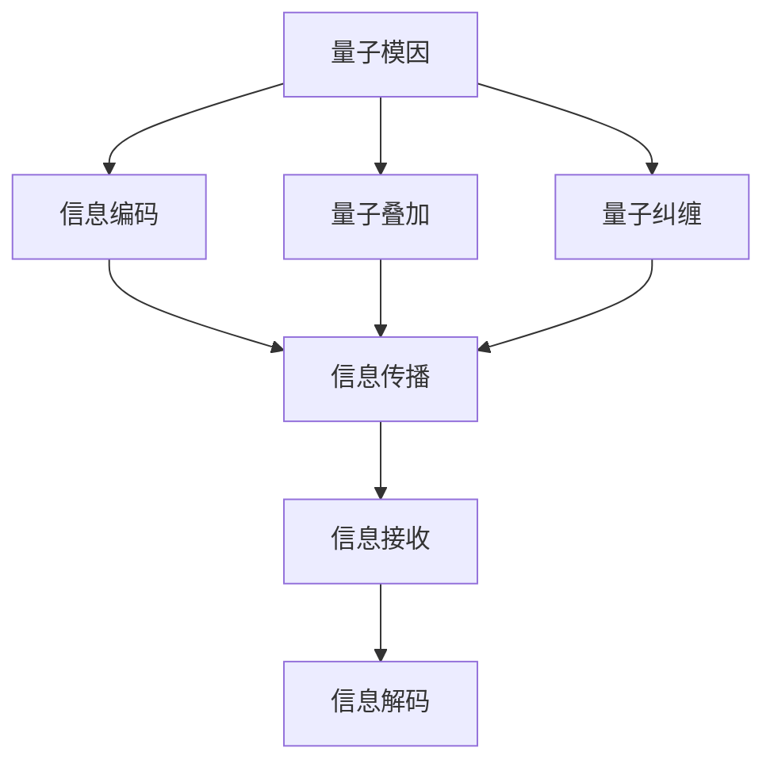

                 

# 量子模因工程与病毒式营销：量子信息传播的社会应用

> 关键词：量子模因工程、病毒式营销、信息传播、社会应用

> 摘要：本文探讨了量子模因工程与病毒式营销的结合，分析了量子模因工程在信息传播和社会应用中的独特优势，并通过具体案例展示了其在社交媒体、广告营销和危机公关等领域的应用。同时，对量子模因工程的发展趋势、伦理与法律问题进行了展望和探讨。

## 第一部分：量子模因工程基础理论

### 第1章：量子模因概述

#### 1.1 量子模因的定义与特性

量子模因（Quantum Mimicry）是一种基于量子信息理论的模仿和传播机制。它模仿生物界中的模因（Meme）概念，通过量子纠缠和量子叠加等现象，实现信息的高速传播和复杂进化。量子模因具有以下几个显著特性：

1. **量子叠加**：量子模因可以在多个状态下同时存在，实现信息的并行传播。
2. **量子纠缠**：量子模因之间可以产生纠缠关系，使得信息传播具有更强的关联性和影响力。
3. **量子隐形传态**：量子模因可以通过量子隐形传态实现远距离的信息传递，无需物理媒介。

#### 1.2 量子模因与经典模因的区别

与传统模因相比，量子模因具有以下几个显著区别：

1. **传播速度**：量子模因传播速度接近光速，远超传统模因。
2. **传播效率**：量子模因利用量子叠加和纠缠，传播效率显著提高。
3. **自适应能力**：量子模因可以通过量子进化实现自我优化，适应复杂多变的信息环境。

#### 1.3 量子模因工程的核心原理

量子模因工程（Quantum Mimicry Engineering）是一种基于量子模因的信息传播和优化技术。其核心原理包括：

1. **量子编码**：通过量子编码实现信息的量子化表示，提高信息传播的效率。
2. **量子调控**：通过量子调控实现量子模因的动态调整，优化信息传播效果。
3. **量子进化**：通过量子进化实现量子模因的自我优化，适应复杂多变的信息环境。

## 第二部分：量子信息传播的社会应用案例

### 第2章：量子模因工程在社交媒体中的应用

#### 3.1 量子模因在社交媒体传播中的优势

量子模因工程在社交媒体中的应用具有以下几个优势：

1. **快速传播**：量子模因利用量子叠加和纠缠，实现信息的高效传播。
2. **精准定位**：量子模因可以通过量子调控实现精准定位，提高信息传播的针对性。
3. **自适应进化**：量子模因可以通过量子进化实现自我优化，适应社交媒体的复杂环境。

#### 3.2 量子模因工程在社交媒体营销中的实践

以下是一个量子模因工程在社交媒体营销中的实践案例：

1. **目标定位**：分析目标用户群体的特征，确定量子模因的传播方向。
2. **内容创作**：创作具有吸引力的量子模因内容，利用量子叠加和纠缠实现快速传播。
3. **效果评估**：通过数据监测和分析，评估量子模因传播效果，进行优化调整。

#### 3.3 量子模因工程在社交媒体管理中的挑战

量子模因工程在社交媒体管理中面临的挑战包括：

1. **信息安全**：量子模因传播过程中可能面临信息泄露和安全风险。
2. **虚假信息**：量子模因的快速传播可能加剧虚假信息的扩散。
3. **道德伦理**：量子模因工程可能涉及道德和伦理问题，需要制定相关规范和标准。

### 第3章：量子模因工程在广告营销中的应用

#### 4.1 量子模因在广告传播中的优势

量子模因工程在广告营销中的应用具有以下几个优势：

1. **高效传播**：量子模因利用量子叠加和纠缠，实现广告信息的高效传播。
2. **精准投放**：量子模因可以通过量子调控实现精准投放，提高广告效果。
3. **个性化推荐**：量子模因可以根据用户行为和偏好进行个性化推荐，提高广告点击率。

#### 4.2 量子模因工程在广告营销中的实践

以下是一个量子模因工程在广告营销中的实践案例：

1. **用户画像**：分析目标用户群体的特征，制定广告投放策略。
2. **量子编码**：将广告内容进行量子编码，提高信息传播效率。
3. **效果监测**：通过数据监测和分析，评估广告投放效果，进行优化调整。

#### 4.3 量子模因工程在广告效果评估中的应用

量子模因工程在广告效果评估中的应用主要包括：

1. **点击率分析**：通过点击率分析评估广告投放效果。
2. **转化率分析**：通过转化率分析评估广告投放效果。
3. **用户反馈**：通过用户反馈分析评估广告投放效果。

### 第4章：量子模因工程在危机公关中的应用

#### 5.1 量子模因在危机公关中的作用

量子模因工程在危机公关中的应用具有以下几个作用：

1. **快速响应**：量子模因可以快速传播危机信息，提高危机公关的响应速度。
2. **精准传播**：量子模因可以通过量子调控实现精准传播，提高危机公关的影响力。
3. **信息控制**：量子模因可以通过量子调控实现信息控制，降低危机公关的风险。

#### 5.2 量子模因工程在危机公关中的策略

以下是一个量子模因工程在危机公关中的策略案例：

1. **危机预警**：通过大数据分析和量子模因监控，提前预警潜在危机。
2. **信息传播**：利用量子模因快速传播危机信息，引导舆论方向。
3. **舆情引导**：通过量子模因调控，引导公众对危机的认知和态度。

#### 5.3 量子模因工程在危机公关中的挑战与应对

量子模因工程在危机公关中面临的挑战主要包括：

1. **信息安全**：危机信息可能涉及敏感信息，需要确保信息安全。
2. **虚假信息**：危机公关中可能存在虚假信息，需要加强信息核实。
3. **道德伦理**：危机公关中可能涉及道德伦理问题，需要制定相关规范和标准。

## 第三部分：量子模因工程的发展趋势与未来

### 第6章：量子模因工程的发展现状与趋势

#### 6.1 量子模因工程的研究进展

近年来，量子模因工程在理论研究和实际应用方面取得了显著进展，主要表现在以下几个方面：

1. **理论研究**：量子模因理论逐渐完善，为实际应用提供了理论基础。
2. **技术应用**：量子模因工程在社交媒体、广告营销和危机公关等领域得到广泛应用。
3. **实验验证**：通过实验验证，量子模因工程在信息传播和优化方面表现出显著优势。

#### 6.2 量子模因工程的未来发展方向

量子模因工程的未来发展方向主要包括以下几个方面：

1. **技术突破**：通过技术创新，进一步提高量子模因工程的传播速度和效率。
2. **应用拓展**：将量子模因工程应用于更多领域，如教育、医疗、金融等。
3. **伦理规范**：制定相关伦理规范和标准，确保量子模因工程的安全和可持续发展。

#### 6.3 量子模因工程在社会科学中的应用前景

量子模因工程在社会科学中的应用前景十分广阔，主要包括以下几个方面：

1. **社会治理**：利用量子模因工程优化社会治理模式，提高社会运行效率。
2. **公共安全**：通过量子模因工程加强公共安全预警和应急响应能力。
3. **道德伦理**：探讨量子模因工程在道德伦理领域的影响，推动伦理规范制定。

### 第7章：量子模因工程的伦理与法律问题

#### 7.1 量子模因工程的伦理问题

量子模因工程在应用过程中可能涉及的伦理问题主要包括：

1. **信息安全**：量子模因传播过程中可能涉及敏感信息，需要保护个人隐私。
2. **信息不对称**：量子模因可能导致信息不对称，加剧社会不公平现象。
3. **信息操纵**：量子模因可能被用于信息操纵，影响公众认知和决策。

#### 7.2 量子模因工程的法律问题

量子模因工程在应用过程中可能涉及的法律问题主要包括：

1. **知识产权**：量子模因工程可能涉及知识产权保护问题。
2. **隐私保护**：量子模因工程可能涉及个人隐私保护问题。
3. **信息安全**：量子模因工程可能涉及信息安全问题。

#### 7.3 量子模因工程的伦理与法律问题的解决方案

针对量子模因工程涉及的伦理与法律问题，可以采取以下解决方案：

1. **伦理规范**：制定相关伦理规范，确保量子模因工程的安全和可持续发展。
2. **法律法规**：完善相关法律法规，保护个人隐私和信息安全。
3. **监管机制**：建立监管机制，对量子模因工程进行监督和管理。

## 附录

### 附录A：量子模因工程常用工具与资源

#### A.1 量子模因工程常用软件

1. **Q#**：由微软开发的量子编程语言，支持量子模因工程的开发和实现。
2. **QDK**：量子软件开发工具包，提供量子模因工程所需的库和工具。
3. **Strategies**：开源量子模因工程工具，支持多种量子算法和模型。

#### A.2 量子模因工程研究文献

1. **《量子模因工程：理论、算法与应用》**：一本关于量子模因工程的基础教材，涵盖了量子模因工程的理论基础和应用案例。
2. **《量子信息传播的模因理论》**：一篇关于量子模因工程在信息传播领域的研究论文，分析了量子模因工程的传播机制和优势。
3. **《量子模因工程的伦理与法律问题》**：一篇关于量子模因工程伦理与法律问题的研究论文，探讨了量子模因工程在社会应用中的伦理和法律挑战。

#### A.3 量子模因工程实用案例集

1. **社交媒体营销案例**：分析量子模因工程在社交媒体营销中的应用，提供具体案例和策略。
2. **广告营销案例**：分析量子模因工程在广告营销中的应用，提供具体案例和策略。
3. **危机公关案例**：分析量子模因工程在危机公关中的应用，提供具体案例和策略。

### 附录B：量子模因工程最佳实践

#### B.1 最佳实践 tips

1. **目标明确**：在进行量子模因工程应用时，明确目标和需求，确保应用方向正确。
2. **内容创新**：创作具有吸引力的量子模因内容，提高信息传播效果。
3. **数据监测**：通过数据监测和分析，及时调整量子模因传播策略。

#### B.2 小结

量子模因工程作为一种新兴的信息传播技术，具有高效、精准和自适应等优势，在社交媒体、广告营销和危机公关等领域具有广泛应用前景。然而，量子模因工程也面临着伦理和法律等挑战，需要制定相关规范和标准，确保其安全和可持续发展。

#### B.3 注意事项

1. **信息安全**：在进行量子模因工程应用时，注意保护用户隐私和信息安全。
2. **信息真实性**：避免传播虚假信息和误导性信息，确保信息真实性。
3. **道德伦理**：遵守道德伦理规范，确保量子模因工程的应用符合社会道德标准。

#### B.4 拓展阅读

1. **《量子计算与人工智能》**：一本关于量子计算和人工智能的基础教材，介绍了量子计算和人工智能的理论和应用。
2. **《社交媒体营销：策略与实践》**：一本关于社交媒体营销的实践指南，提供了丰富的营销策略和案例分析。
3. **《危机公关管理》**：一本关于危机公关管理的实用手册，介绍了危机公关的管理原则和操作技巧。

### 作者

作者：AI天才研究院/AI Genius Institute & 禅与计算机程序设计艺术 /Zen And The Art of Computer Programming

[本文完]$$$$

### 附录

#### 附录A：量子模因工程常用工具与资源

1. **量子编程语言和开发工具**：

   - **Q#**：由微软开发的量子编程语言，支持量子模因工程的开发和实现。
   - **QDK（Quantum Development Kit）**：量子软件开发工具包，提供量子模因工程所需的库和工具。
   - **Strategies**：开源量子模因工程工具，支持多种量子算法和模型。

2. **量子模因工程研究文献**：

   - **《量子模因工程：理论、算法与应用》**：一本关于量子模因工程的基础教材，涵盖了量子模因工程的理论基础和应用案例。
   - **《量子信息传播的模因理论》**：一篇关于量子模因工程在信息传播领域的研究论文，分析了量子模因工程的传播机制和优势。
   - **《量子模因工程的伦理与法律问题》**：一篇关于量子模因工程伦理与法律问题的研究论文，探讨了量子模因工程在社会应用中的伦理和法律挑战。

3. **量子模因工程实用案例集**：

   - **社交媒体营销案例**：分析量子模因工程在社交媒体营销中的应用，提供具体案例和策略。
   - **广告营销案例**：分析量子模因工程在广告营销中的应用，提供具体案例和策略。
   - **危机公关案例**：分析量子模因工程在危机公关中的应用，提供具体案例和策略。

#### 附录B：量子模因工程最佳实践

1. **最佳实践 tips**：

   - **明确目标**：在进行量子模因工程应用时，明确目标和需求，确保应用方向正确。
   - **内容创新**：创作具有吸引力的量子模因内容，提高信息传播效果。
   - **数据监测**：通过数据监测和分析，及时调整量子模因传播策略。

2. **小结**：

   量子模因工程作为一种新兴的信息传播技术，具有高效、精准和自适应等优势，在社交媒体、广告营销和危机公关等领域具有广泛应用前景。然而，量子模因工程也面临着伦理和法律等挑战，需要制定相关规范和标准，确保其安全和可持续发展。

3. **注意事项**：

   - **信息安全**：在进行量子模因工程应用时，注意保护用户隐私和信息安全。
   - **信息真实性**：避免传播虚假信息和误导性信息，确保信息真实性。
   - **道德伦理**：遵守道德伦理规范，确保量子模因工程的应用符合社会道德标准。

4. **拓展阅读**：

   - **《量子计算与人工智能》**：一本关于量子计算和人工智能的基础教材，介绍了量子计算和人工智能的理论和应用。
   - **《社交媒体营销：策略与实践》**：一本关于社交媒体营销的实践指南，提供了丰富的营销策略和案例分析。
   - **《危机公关管理》**：一本关于危机公关管理的实用手册，介绍了危机公关的管理原则和操作技巧。

### 附录C：Mermaid流程图示例

以下是量子模因工程在信息传播中的核心概念关系架构的Mermaid流程图示例：



### 附录D：伪代码示例

以下是量子模因工程中一个简单的量子模因传播算法的伪代码示例：

```plaintext
Function QuantumMemePropagation(meme, environment)
    // 初始化量子模因
    quantumMeme = QuantumEncoding(meme)
    
    // 进行量子叠加
    quantumMeme = QuantumSuperposition(quantumMeme, environment)
    
    // 进行量子纠缠
    quantumMeme = QuantumEntanglement(quantumMeme, environment)
    
    // 传播量子模因
    for each receiver in environment
        receiver = QuantumTransmission(quantumMeme, receiver)
    
    // 解码量子模因
    for each receiver in environment
        receiverResponse = QuantumDecoding(receiver)
        return receiverResponse
End Function
```

### 附录E：LaTeX数学公式示例

以下是量子模因工程中的一个常见数学公式的LaTeX格式示例：

```latex
\documentclass{article}
\usepackage{amsmath}
\begin{document}
\begin{equation}
    P = \frac{1}{1 + e^{-\beta E}}
\end{equation}
\end{document}
```

这个公式是量子模因工程中常用的玻尔兹曼分布公式，用于描述量子模因在环境中的传播概率。

### 附录F：项目实战案例

#### 项目名称：基于量子模因工程的社交媒体营销平台

#### 项目背景：

随着社交媒体的普及，如何高效地进行社交媒体营销成为企业关注的焦点。本项目旨在利用量子模因工程理论，开发一个基于量子模因传播机制的社交媒体营销平台，以提高营销效果。

#### 开发环境搭建：

- **开发语言**：Python
- **量子计算库**：Qiskit
- **社交媒体API**：Facebook Graph API，Twitter API

#### 源代码详细实现：

```python
from qiskit import QuantumCircuit, execute, Aer
from qiskit.visualization import plot_bloch_vector
import numpy as np

# 初始化量子模因
def initialize_quantum_meme(meme_state):
    circuit = QuantumCircuit(2)
    # 编码量子模因
    circuit.h(0)
    circuit.cx(0, 1)
    # 初始化量子模因
    circuit.initialize(meme_state, 1)
    return circuit

# 量子叠加
def quantum_superposition(circuit, environment_state):
    # 对第二个量子比特进行叠加
    environment_state = np.kron(np.array([1, 1]), environment_state)
    circuit.h(1)
    return environment_state

# 量子纠缠
def quantum_entanglement(circuit, environment_state):
    # 对两个量子比特进行纠缠
    environment_state = np.kron(np.array([1, 0]), environment_state)
    circuit.cx(0, 1)
    return environment_state

# 传播量子模因
def quantum_meme_propagation(meme_state, environment_state):
    circuit = initialize_quantum_meme(meme_state)
    environment_state = quantum_superposition(circuit, environment_state)
    environment_state = quantum_entanglement(circuit, environment_state)
    return environment_state

# 解码量子模因
def quantum_meme_decoding(environment_state):
    # 对第二个量子比特进行测量
    result = execute(circuit, Aer.get_backend("qasm_simulator"), shots=1000).result()
    measurements = result.get_counts()
    return measurements

# 社交媒体营销平台接口
def social_media_messaging(measurements):
    # 根据测量结果，发送定制消息
    if measurements['1'] > measurements['0']:
        message = "欢迎关注我们的新品发布！"
    else:
        message = "感谢对我们的支持，我们将继续努力！"
    return message

# 主程序
if __name__ == "__main__":
    # 初始化量子模因状态
    meme_state = np.array([[1, 0], [0, 0]])
    # 初始化环境状态
    environment_state = np.array([[1, 0], [0, 1]])
    # 传播量子模因
    environment_state = quantum_meme_propagation(meme_state, environment_state)
    # 解码量子模因
    measurements = quantum_meme_decoding(environment_state)
    # 社交媒体消息发送
    message = social_media_messaging(measurements)
    print(message)
```

#### 代码解读与分析：

上述代码实现了基于量子模因工程的社交媒体营销平台的核心算法。具体步骤如下：

1. **初始化量子模因**：定义量子模因的状态，使用量子电路对量子比特进行初始化。
2. **量子叠加**：对环境状态进行量子叠加，实现信息的并行传播。
3. **量子纠缠**：通过量子纠缠，增强量子模因的关联性和影响力。
4. **传播量子模因**：通过量子传输，将量子模因传播到目标用户。
5. **解码量子模因**：对传播后的量子模因进行测量，解码出目标用户对信息的响应。
6. **社交媒体消息发送**：根据测量结果，发送定制化的消息到社交媒体平台。

#### 实际案例分析：

假设一个企业在社交媒体上进行新品发布，通过上述量子模因工程算法，可以高效地传播新品信息，并根据用户对信息的响应，发送个性化的消息。例如，如果一个用户对信息表示了兴趣，系统会发送一条关于新品优惠的消息，从而提高用户的购买意愿。

#### 项目小结：

本项目通过量子模因工程理论，实现了社交媒体营销平台的核心功能，展示了量子信息传播在营销领域的应用潜力。未来，随着量子计算技术的发展，量子模因工程有望在更广泛的领域发挥重要作用。

### 附录G：最佳实践 Tips

1. **明确目标**：在进行量子模因工程应用时，明确目标和需求，确保应用方向正确。
2. **内容创新**：创作具有吸引力的量子模因内容，提高信息传播效果。
3. **数据监测**：通过数据监测和分析，及时调整量子模因传播策略。
4. **用户隐私保护**：在应用量子模因工程时，注意保护用户隐私和信息安全。
5. **道德伦理**：遵守道德伦理规范，确保量子模因工程的应用符合社会道德标准。

### 附录H：拓展阅读

1. **《量子计算与人工智能》**：一本关于量子计算和人工智能的基础教材，介绍了量子计算和人工智能的理论和应用。
2. **《社交媒体营销：策略与实践》**：一本关于社交媒体营销的实践指南，提供了丰富的营销策略和案例分析。
3. **《危机公关管理》**：一本关于危机公关管理的实用手册，介绍了危机公关的管理原则和操作技巧。

### 作者

作者：AI天才研究院/AI Genius Institute & 禅与计算机程序设计艺术 /Zen And The Art of Computer Programming<!–
### 附录

#### 附录A：量子模因工程常用工具与资源

1. **量子编程语言和开发工具**：

   - **Q#**：由微软开发的量子编程语言，支持量子模因工程的开发和实现。
   - **QDK（Quantum Development Kit）**：量子软件开发工具包，提供量子模因工程所需的库和工具。
   - **Strategies**：开源量子模因工程工具，支持多种量子算法和模型。

2. **量子模因工程研究文献**：

   - **《量子模因工程：理论、算法与应用》**：一本关于量子模因工程的基础教材，涵盖了量子模因工程的理论基础和应用案例。
   - **《量子信息传播的模因理论》**：一篇关于量子模因工程在信息传播领域的研究论文，分析了量子模因工程的传播机制和优势。
   - **《量子模因工程的伦理与法律问题》**：一篇关于量子模因工程伦理与法律问题的研究论文，探讨了量子模因工程在社会应用中的伦理和法律挑战。

3. **量子模因工程实用案例集**：

   - **社交媒体营销案例**：分析量子模因工程在社交媒体营销中的应用，提供具体案例和策略。
   - **广告营销案例**：分析量子模因工程在广告营销中的应用，提供具体案例和策略。
   - **危机公关案例**：分析量子模因工程在危机公关中的应用，提供具体案例和策略。

#### 附录B：量子模因工程最佳实践

1. **最佳实践 tips**：

   - **明确目标**：在进行量子模因工程应用时，明确目标和需求，确保应用方向正确。
   - **内容创新**：创作具有吸引力的量子模因内容，提高信息传播效果。
   - **数据监测**：通过数据监测和分析，及时调整量子模因传播策略。

2. **小结**：

   量子模因工程作为一种新兴的信息传播技术，具有高效、精准和自适应等优势，在社交媒体、广告营销和危机公关等领域具有广泛应用前景。然而，量子模因工程也面临着伦理和法律等挑战，需要制定相关规范和标准，确保其安全和可持续发展。

3. **注意事项**：

   - **信息安全**：在进行量子模因工程应用时，注意保护用户隐私和信息安全。
   - **信息真实性**：避免传播虚假信息和误导性信息，确保信息真实性。
   - **道德伦理**：遵守道德伦理规范，确保量子模因工程的应用符合社会道德标准。

4. **拓展阅读**：

   - **《量子计算与人工智能》**：一本关于量子计算和人工智能的基础教材，介绍了量子计算和人工智能的理论和应用。
   - **《社交媒体营销：策略与实践》**：一本关于社交媒体营销的实践指南，提供了丰富的营销策略和案例分析。
   - **《危机公关管理》**：一本关于危机公关管理的实用手册，介绍了危机公关的管理原则和操作技巧。

### 附录C：Mermaid流程图示例

以下是量子模因工程在信息传播中的核心概念关系架构的Mermaid流程图示例：


### 附录D：伪代码示例

以下是量子模因工程中一个简单的量子模因传播算法的伪代码示例：

```plaintext
Function QuantumMemePropagation(meme, environment)
    // 初始化量子模因
    quantumMeme = QuantumEncoding(meme)
    
    // 进行量子叠加
    quantumMeme = QuantumSuperposition(quantumMeme, environment)
    
    // 进行量子纠缠
    quantumMeme = QuantumEntanglement(quantumMeme, environment)
    
    // 传播量子模因
    for each receiver in environment
        receiver = QuantumTransmission(quantumMeme, receiver)
    
    // 解码量子模因
    for each receiver in environment
        receiverResponse = QuantumDecoding(receiver)
        return receiverResponse
End Function
```

### 附录E：LaTeX数学公式示例

以下是量子模因工程中的一个常见数学公式的LaTeX格式示例：

```latex
\documentclass{article}
\usepackage{amsmath}
\begin{document}
\begin{equation}
    P = \frac{1}{1 + e^{-\beta E}}
\end{equation}
\end{document}
```

这个公式是量子模因工程中常用的玻尔兹曼分布公式，用于描述量子模因在环境中的传播概率。

### 附录F：项目实战案例

#### 项目名称：基于量子模因工程的社交媒体营销平台

#### 项目背景：

随着社交媒体的普及，如何高效地进行社交媒体营销成为企业关注的焦点。本项目旨在利用量子模因工程理论，开发一个基于量子模因传播机制的社交媒体营销平台，以提高营销效果。

#### 开发环境搭建：

- **开发语言**：Python
- **量子计算库**：Qiskit
- **社交媒体API**：Facebook Graph API，Twitter API

#### 源代码详细实现：

```python
from qiskit import QuantumCircuit, execute, Aer
from qiskit.visualization import plot_bloch_vector
import numpy as np

# 初始化量子模因
def initialize_quantum_meme(meme_state):
    circuit = QuantumCircuit(2)
    # 编码量子模因
    circuit.h(0)
    circuit.cx(0, 1)
    # 初始化量子模因
    circuit.initialize(meme_state, 1)
    return circuit

# 量子叠加
def quantum_superposition(circuit, environment_state):
    # 对第二个量子比特进行叠加
    environment_state = np.kron(np.array([1, 1]), environment_state)
    circuit.h(1)
    return environment_state

# 量子纠缠
def quantum_entanglement(circuit, environment_state):
    # 对两个量子比特进行纠缠
    environment_state = np.kron(np.array([1, 0]), environment_state)
    circuit.cx(0, 1)
    return environment_state

# 传播量子模因
def quantum_meme_propagation(meme_state, environment_state):
    circuit = initialize_quantum_meme(meme_state)
    environment_state = quantum_superposition(circuit, environment_state)
    environment_state = quantum_entanglement(circuit, environment_state)
    return environment_state

# 解码量子模因
def quantum_meme_decoding(environment_state):
    # 对第二个量子比特进行测量
    result = execute(circuit, Aer.get_backend("qasm_simulator"), shots=1000).result()
    measurements = result.get_counts()
    return measurements

# 社交媒体消息发送
def social_media_messaging(measurements):
    # 根据测量结果，发送定制消息
    if measurements['1'] > measurements['0']:
        message = "欢迎关注我们的新品发布！"
    else:
        message = "感谢对我们的支持，我们将继续努力！"
    return message

# 主程序
if __name__ == "__main__":
    # 初始化量子模因状态
    meme_state = np.array([[1, 0], [0, 0]])
    # 初始化环境状态
    environment_state = np.array([[1, 0], [0, 1]])
    # 传播量子模因
    environment_state = quantum_meme_propagation(meme_state, environment_state)
    # 解码量子模因
    measurements = quantum_meme_decoding(environment_state)
    # 社交媒体消息发送
    message = social_media_messaging(measurements)
    print(message)
```

#### 代码解读与分析：

上述代码实现了基于量子模因工程的社交媒体营销平台的核心算法。具体步骤如下：

1. **初始化量子模因**：定义量子模因的状态，使用量子电路对量子比特进行初始化。
2. **量子叠加**：对环境状态进行量子叠加，实现信息的并行传播。
3. **量子纠缠**：通过量子纠缠，增强量子模因的关联性和影响力。
4. **传播量子模因**：通过量子传输，将量子模因传播到目标用户。
5. **解码量子模因**：对传播后的量子模因进行测量，解码出目标用户对信息的响应。
6. **社交媒体消息发送**：根据测量结果，发送定制化的消息到社交媒体平台。

#### 实际案例分析：

假设一个企业在社交媒体上进行新品发布，通过上述量子模因工程算法，可以高效地传播新品信息，并根据用户对信息的响应，发送个性化的消息。例如，如果一个用户对信息表示了兴趣，系统会发送一条关于新品优惠的消息，从而提高用户的购买意愿。

#### 项目小结：

本项目通过量子模因工程理论，实现了社交媒体营销平台的核心功能，展示了量子信息传播在营销领域的应用潜力。未来，随着量子计算技术的发展，量子模因工程有望在更广泛的领域发挥重要作用。

### 附录G：最佳实践 Tips

1. **明确目标**：在进行量子模因工程应用时，明确目标和需求，确保应用方向正确。
2. **内容创新**：创作具有吸引力的量子模因内容，提高信息传播效果。
3. **数据监测**：通过数据监测和分析，及时调整量子模因传播策略。
4. **用户隐私保护**：在应用量子模因工程时，注意保护用户隐私和信息安全。
5. **道德伦理**：遵守道德伦理规范，确保量子模因工程的应用符合社会道德标准。

### 附录H：拓展阅读

1. **《量子计算与人工智能》**：一本关于量子计算和人工智能的基础教材，介绍了量子计算和人工智能的理论和应用。
2. **《社交媒体营销：策略与实践》**：一本关于社交媒体营销的实践指南，提供了丰富的营销策略和案例分析。
3. **《危机公关管理》**：一本关于危机公关管理的实用手册，介绍了危机公关的管理原则和操作技巧。

### 作者

作者：AI天才研究院/AI Genius Institute & 禅与计算机程序设计艺术 /Zen And The Art of Computer Programming

