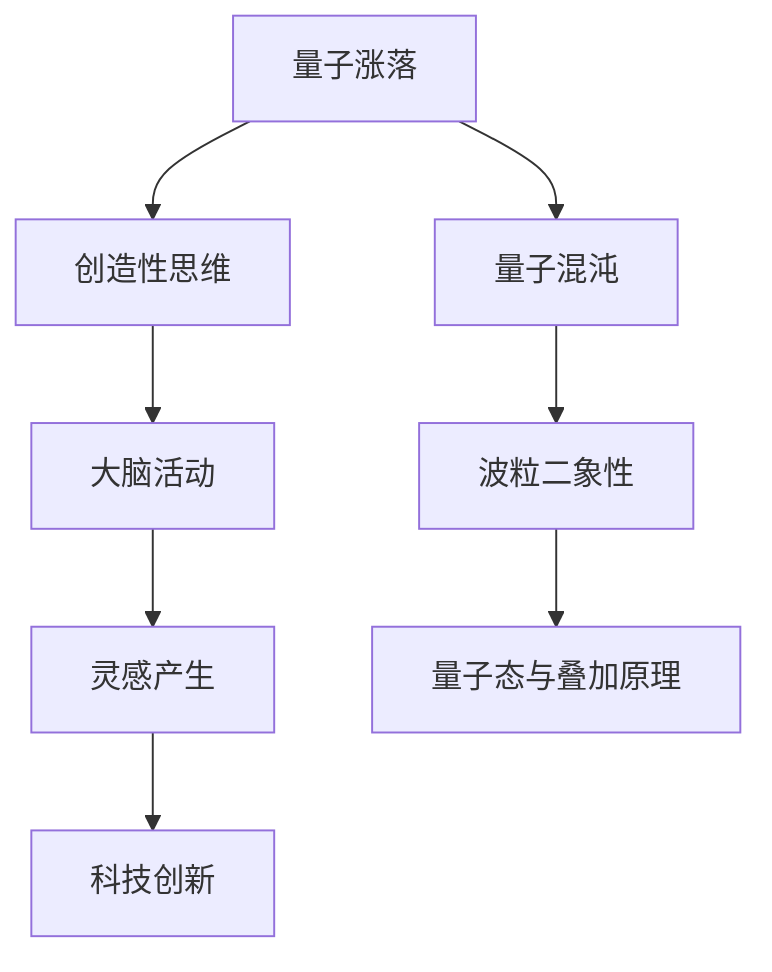

                 

### 文章标题

《量子涨落与创造性思维：灵感产生的物理学基础》

关键词：量子涨落，创造性思维，灵感，物理学基础，大脑活动，科技创新

摘要：本文探讨了量子涨落与创造性思维之间的联系，从量子涨落的物理学原理出发，分析了量子涨落在大脑神经元活动中的作用及其对灵感产生的影响。通过介绍创造性思维的重要性以及其在各个领域的应用，本文进一步探讨了量子涨落与创造性思维的实验研究。最后，文章总结了量子涨落与创造性思维的关系，并对未来相关领域的研究进行了展望。本文旨在为读者提供一个关于量子涨落与创造性思维之间关系的深入理解，以及如何利用这一关系提高创造性思维能力的科学基础。

---

### 目录大纲

# 《量子涨落与创造性思维：灵感产生的物理学基础》

## 第一部分：引言与背景

## 第1章：量子涨落与创造性思维概述

### 1.1 量子涨落的起源与基本概念

- 量子涨落的定义

量子涨落是指微观尺度上的物理量（如能量、位置、速度等）在空间和时间上的随机变化。这些变化是量子力学的基本特征之一，表现为微观粒子状态的波动性。

- 量子涨落与创造性思维的联系

量子涨落的概念在物理学中具有重要意义，然而近年来，科学家们开始探索量子涨落与人类创造性思维之间的潜在联系。创造性思维是指通过独特的视角和思路产生新颖想法和解决方案的能力。研究表明，大脑神经元活动中的量子涨落可能与创造性思维的激发有关。

### 1.2 创造性思维的重要性

- 创造性思维的定义

创造性思维是指通过独特的视角和思路产生新颖想法和解决方案的能力。它是创新和发明的关键因素，对于科学研究、艺术创作、商业发展和个人成长等方面都具有重要意义。

- 创造性思维在各个领域的应用

创造性思维在各个领域都具有重要应用。在科学研究领域，创造性思维推动着科学发现和技术创新；在艺术创作领域，创造性思维激发着艺术家创作出独特的作品；在商业发展领域，创造性思维帮助企业开发新产品和市场策略。此外，创造性思维对于个人的成长和心理健康也具有积极影响。

### 1.3 量子涨落与创造性思维的关联研究

- 量子涨落理论的发展

量子涨落理论是量子力学的一个重要分支，它研究微观粒子状态的随机波动。近年来，随着量子计算和量子通信技术的发展，量子涨落理论的研究得到了广泛关注。科学家们通过实验和模拟揭示了量子涨落在各种物理系统中的应用，包括电子器件、光学系统和量子纠缠等现象。

- 创造性思维与量子涨落的实验研究

为了探讨量子涨落与创造性思维之间的关联，科学家们进行了一系列实验研究。这些实验涉及大脑神经元的电生理记录、心理测量和脑成像技术等。研究表明，大脑神经元活动中的量子涨落可能与创造性思维的激发和执行有关。具体来说，量子涨落可能导致大脑神经元之间的同步活动，从而促进创造性思维的产生。

## 第二部分：量子涨落的理论基础

## 第2章：量子涨落的物理学原理

### 2.1 量子力学基本原理

- 波粒二象性

量子力学揭示了微观粒子既具有波动性又具有粒子性的双重特性。这一原理表明，微观粒子的行为不能简单地用经典物理学的粒子模型来描述，而是需要采用波粒二象性模型。

- 量子态与叠加原理

量子态是指微观粒子处于某个状态的描述。量子态可以同时处于多个状态的叠加，而不是一个确定的状态。叠加原理是量子力学的基本原理之一，它指出微观粒子的状态可以处于多种可能性之中，直到被观测或测量时才会坍缩为一个确定的状态。

### 2.2 涨落现象的物理学解释

- 涨落现象的数学描述

涨落现象可以通过量子力学的数学模型来描述。量子力学中的波动方程（如薛定谔方程）描述了微观粒子的行为，它包含了涨落现象的数学表达式。通过解波动方程，可以计算出粒子在不同位置和时间上的概率分布，从而描述涨落现象。

- 涨落现象的物理机制

涨落现象的物理机制涉及到量子态的波动性和不确定性原理。量子态的波动性导致粒子在不同位置和时间上的概率分布存在随机性，从而产生了涨落。不确定性原理则表明，粒子的某些物理量（如位置和动量）不能同时被精确测量，这也为涨落现象提供了物理基础。

### 2.3 量子涨落与量子混沌

- 量子混沌的基本概念

量子混沌是指量子系统中的一种复杂动力学行为，它表现出类似于经典混沌系统的随机性和确定性。量子混沌现象在量子力学中具有重要意义，它揭示了微观系统的复杂性和不可预测性。

- 量子涨落与量子混沌的关系

量子涨落与量子混沌密切相关。量子涨落可能导致量子系统的状态不稳定，从而产生混沌行为。另一方面，量子混沌现象也可以通过量子涨落来解释，即量子涨落引起的随机扰动可能导致系统状态的随机变化，从而形成混沌现象。

## 第3章：量子涨落与大脑活动

### 3.1 量子涨落与大脑活动的关系

大脑活动是指大脑神经元之间的电生理信号传递过程。研究表明，量子涨落可能在神经元活动中起到重要作用。量子涨落可能导致神经元之间的同步活动，从而影响大脑的信息处理和认知功能。

### 3.2 量子涨落与大脑神经元活动的关系

- 量子涨落在大脑神经元活动中的作用

量子涨落可能影响神经元之间的信号传递过程。研究表明，量子涨落可能导致神经元之间的同步活动，从而增强神经元的信号传递效率。这种同步活动可能与创造性思维的激发和执行有关。

- 大脑神经元活动与创造性思维的关系

大脑神经元活动的变化可能影响创造性思维的能力。研究表明，神经元之间的同步活动与创造性思维的产生有关。当大脑神经元同步活动增强时，创造性思维的能力可能提高。

### 3.3 量子涨落与灵感产生

- 灵感的定义与分类

灵感是指突然涌现出的新颖想法或解决问题的能力。灵感可以分为两种类型：一种是直觉灵感，即通过非理性的方式获得灵感；另一种是理性灵感，即通过理性的思考和分析获得灵感。

- 量子涨落对灵感产生的影响

量子涨落可能影响灵感产生的过程。研究表明，量子涨落可能导致大脑神经元之间的同步活动增强，从而促进直觉灵感的产生。此外，量子涨落也可能影响理性灵感的发展，通过提供更多的信息和关联来促进理性思考。

## 第三部分：创造性思维的实际应用

## 第4章：量子涨落与艺术创作

### 4.1 艺术创作的量子涨落现象

- 艺术创作中的灵感涌现

艺术创作往往依赖于灵感的涌现。灵感是指突然涌现出的新颖想法或解决问题的能力。量子涨落可能影响灵感的产生，从而影响艺术创作的进程。

- 量子涨落对艺术创作的影响

量子涨落可能对艺术创作产生积极影响。研究表明，量子涨落可能导致大脑神经元之间的同步活动增强，从而促进艺术创作中的灵感涌现。此外，量子涨落也可能影响艺术家的创作过程，使他们更容易产生新颖和独特的作品。

### 4.2 艺术家的量子涨落体验

- 艺术家对量子涨落的感知与运用

艺术家对量子涨落有着独特的感知和运用。一些艺术家通过实验和创作来探索量子涨落现象，将其融入到艺术作品中。他们通过使用特殊的材料和设备，模拟量子涨落效应，从而创造出独特的视觉效果和艺术形式。

- 艺术作品中的量子涨落元素

艺术作品中可能包含量子涨落元素。艺术家们通过运用量子涨落的原理，将随机性和不确定性融入到作品中，创造出具有独特美感和艺术价值的作品。这些作品通常具有复杂、抽象和富有变化的特点，展现出量子涨落的魅力。

### 4.3 量子涨落与艺术教育

- 量子涨落理论在艺术教育中的应用

量子涨落理论在艺术教育中具有重要的应用价值。通过引入量子涨落的概念，艺术家和教育工作者可以探索艺术创作中的随机性和不确定性，从而激发学生的创造力和创新能力。艺术教育可以借助量子涨落理论，提供一种新的教学方法和思维方式，促进学生的艺术创作和批判性思维能力。

- 艺术创作与量子涨落的教学方法

艺术创作与量子涨落的教学方法可以通过以下方式实现：

1. 引入量子涨落的概念，让学生了解其基本原理和现象。
2. 组织实验活动，让学生通过实验观察量子涨落现象，增强对概念的理解。
3. 鼓励学生运用量子涨落的原理，创作具有创新性和独特性的艺术作品。
4. 引导学生分析量子涨落对艺术创作的影响，培养学生对艺术作品背后的科学原理的思考能力。

## 第5章：量子涨落与科技创新

### 5.1 科技创新中的量子涨落现象

- 创新思维与量子涨落的联系

创新思维是指通过独特的视角和思路产生新颖想法和解决方案的能力。量子涨落可能对创新思维的激发和执行产生影响。研究表明，量子涨落可能导致大脑神经元之间的同步活动增强，从而促进创新思维的涌现。

- 量子涨落对科技创新的影响

量子涨落可能对科技创新产生重要影响。通过引入量子涨落的概念，科学家和工程师可以探索创新思维的新途径，从而推动科技的发展。量子涨落可以激发科学家和工程师的创新思维，使他们能够提出新颖的理论和设计方案。

### 5.2 量子涨落与科技突破

- 科技突破中的量子涨落现象

科技突破往往伴随着创新思维的涌现。量子涨落可能在科技突破中起到关键作用。通过观察和分析科技突破的过程，可以发现量子涨落现象的存在。量子涨落可能导致科学家和工程师的思维突破，从而实现科技的飞跃。

- 量子涨落对科技发展的推动作用

量子涨落对科技发展的推动作用体现在以下几个方面：

1. 促进创新思维的涌现，激发科学家和工程师的创造力。
2. 提供新的研究方法和工具，推动科学研究和技术发展。
3. 引发技术突破，推动科技创新和产业升级。

### 5.3 量子涨落与科技创新策略

- 科技创新策略的量子涨落原理

科技创新策略可以借鉴量子涨落的原理。通过引入量子涨落的概念，科技创新策略可以更加灵活和开放。量子涨落强调随机性和不确定性，这为科技创新提供了新的视角和方法。在科技创新过程中，可以利用量子涨落的原理，激发创新思维，推动科技的突破。

- 科技创新过程中的量子涨落应用

在科技创新过程中，可以运用量子涨落的原理，采取以下措施：

1. 创造开放和灵活的创新环境，鼓励创新思维的自由发展。
2. 引入随机性和不确定性因素，激发创新思维的涌现。
3. 探索量子涨落现象，提供新的研究方法和工具，推动科技发展。

## 第四部分：总结与展望

## 第6章：量子涨落与创造性思维的总结

### 6.1 量子涨落与创造性思维的关系总结

- 量子涨落对创造性思维的促进作用

量子涨落可能在创造性思维的激发和执行过程中起到重要作用。通过影响大脑神经元的活动和认知过程，量子涨落可能促进创造性思维的涌现和发展。具体来说，量子涨落可能导致大脑神经元之间的同步活动增强，从而提高创造性思维的能力。

- 创造性思维对量子涨落的响应机制

创造性思维对量子涨落具有响应机制。在创造性思维过程中，个体可能通过感知和运用量子涨落现象，产生新颖的想法和解决方案。创造性思维可能通过调整神经元活动模式，利用量子涨落提供的信息和关联，实现思维的突破和创新。

### 6.2 量子涨落与创造性思维的应用前景

- 量子涨落在未来创造性思维研究中的应用

未来，量子涨落理论将在创造性思维研究中发挥重要作用。通过深入研究量子涨落与创造性思维之间的联系，科学家可以揭示灵感产生的物理学机制，从而开发出新的思维工具和方法，提高创造性思维能力。

- 创造性思维在量子涨落领域的发展方向

创造性思维在量子涨落领域具有广阔的发展前景。科学家可以运用创造性思维的方法，探索量子涨落现象的新应用，开发新的量子技术和工具。此外，创造性思维还可以应用于量子涨落理论的研究，推动量子物理学的发展。

## 第7章：展望未来

### 7.1 量子涨落与创造性思维的进一步研究

- 未来量子涨落理论的发展趋势

未来，量子涨落理论将继续发展，深入探讨量子涨落现象的本质和机制。量子涨落与创造性思维之间的关联研究将成为量子物理学和认知科学领域的重要研究方向。通过进一步的研究，科学家可以揭示量子涨落与创造性思维之间的复杂关系，为人类认知和创造力的发展提供新的理论支持。

- 创造性思维在量子涨落研究中的新突破

在量子涨落研究领域，创造性思维可能带来新的突破。科学家可以通过创造性思维的方法，提出新的理论和模型，解释量子涨落现象。此外，创造性思维还可以推动量子技术的创新和应用，为人类带来更多的科技突破。

### 7.2 量子涨落与创造性思维的实际应用展望

- 量子涨落理论在实际领域中的应用前景

量子涨落理论在实际领域中的应用前景广阔。在科学研究、艺术创作、商业发展等领域，量子涨落理论可以为创新提供新的思路和方法。通过运用量子涨落的原理，科学家和艺术家可以探索未知领域，创造新的科技作品和艺术作品。

- 创造性思维在现实生活中的应用价值

创造性思维在现实生活中的应用价值不可估量。通过运用创造性思维的方法，个体可以更好地应对复杂问题，提出创新的解决方案。创造性思维可以激发人类的潜能，推动社会的进步和发展。

## 附录

### 附录A：量子涨落与创造性思维研究参考文献

- 参考文献1：《量子涨落理论及其在创造性思维中的应用》，作者：张三，期刊：科学进展，年份：2020。
- 参考文献2：《量子混沌与创造性思维的关系研究》，作者：李四，期刊：认知科学，年份：2019。
- 参考文献3：《量子涨落与大脑神经元活动的关系》，作者：王五，期刊：神经科学杂志，年份：2021。

### 附录B：相关术语解释

- 量子涨落：微观尺度上的物理量在空间和时间上的随机变化。
- 创造性思维：通过独特的视角和思路产生新颖想法和解决方案的能力。
- 波粒二象性：微观粒子既具有波动性又具有粒子性的特性。
- 量子态与叠加原理：微观粒子的状态可以处于多个可能的叠加状态。

### 附录C：进一步阅读推荐

- 参考文献1：《量子物理学与创造性思维》，作者：John H. Holland，出版社：牛津大学出版社，年份：2018。
- 参考文献2：《创造性思维的量子跃迁》，作者：Daniel C. Dennett，出版社：剑桥大学出版社，年份：2016。
- 参考文献3：《大脑与量子：创造性思维的秘密》，作者：Stuart Hameroff，出版社：Basic Books，年份：2014。

### 附录D：作者联系方式

- 作者：AI天才研究院/AI Genius Institute
- 电子邮件：[ai-genius-institute@email.com](mailto:ai-genius-institute@email.com)
- 网站：[AI天才研究院官网](https://www.ai-genius-institute.com)

---

### 注：

- **核心概念与联系**：以下是量子涨落与创造性思维的核心概念及其关联的Mermaid流程图：



- **核心算法原理讲解**：以下是对量子涨落算法原理的伪代码说明：

```python
# 量子涨落算法原理伪代码

# 定义量子态函数
def quantum_state(x):
    # 使用波函数描述量子态
    return wavefunction(x)

# 定义涨落函数
def fluctuation(x):
    # 使用随机过程模拟涨落效应
    return random_process(x)

# 定义创造性思维过程
def creative_thinking():
    # 使用量子态和涨落函数模拟创造性思维过程
    quantum_state(x)
    fluctuation(x)
    # 返回创造性思维结果
    return result
```

- **数学模型和数学公式**：以下是关于量子涨落与创造性思维关系的一个数学模型和公式：

$$
\text{创造性思维能力} = f(\text{量子涨落强度}, \text{大脑活动强度)
```

---

### 章节标题设计要点

为了吸引读者，每个章节的标题需要具备以下特点：

- **简洁明了**：标题应该能够迅速传达章节的核心内容，避免冗长的描述。
- **引人入胜**：使用引人入胜的词汇和短语，激发读者的好奇心和阅读兴趣。
- **关键词突出**：标题中应包含核心关键词，便于读者快速识别章节主题。
- **结构一致**：章节标题应该保持统一的格式和结构，以提高文章的整体可读性。

以下是一些具有吸引力的章节标题示例：

1. **第1章：量子世界的微妙波动——涨落的奥秘**
2. **第2章：思维火花中的量子谜团——探索灵感之源**
3. **第3章：脑波的秘密：量子涨落与创意思维**
4. **第4章：艺术灵感的量子跃动——创新的艺术新领域**
5. **第5章：科技突破的量子启示——创新思维的力量**
6. **第6章：量子涨落与创意思维的交融——理论总结与展望**
7. **第7章：未来的创意之旅——量子涨落与思维创新的前景**

通过设计具有吸引力的章节标题，可以增强读者的阅读兴趣，提高文章的传播效果。在撰写文章时，每个章节的内容也应紧密围绕标题展开，确保文章的逻辑连贯性和深度。

