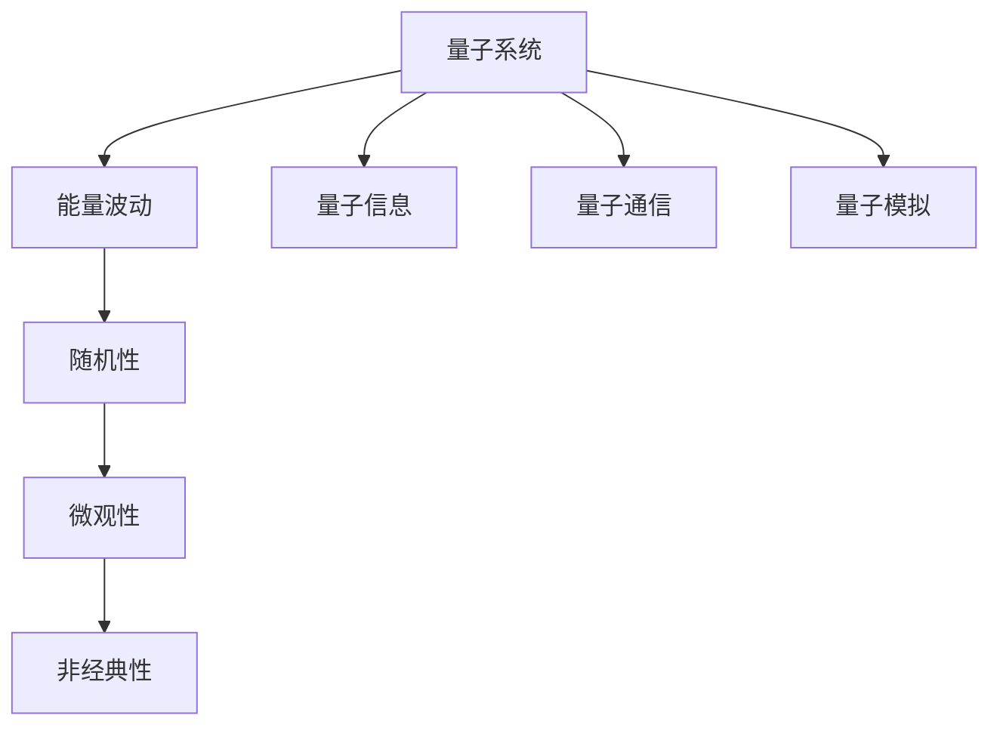

                 


### 文章标题

量子涨落与神经元放电模式的随机性

### 关键词

量子涨落，神经元放电，随机性，神经网络，生物信息学，计算神经科学

### 摘要

本文旨在探讨量子涨落与神经元放电模式随机性的关系，揭示量子涨落如何影响神经元的随机放电行为，以及这种影响在计算神经科学和生物信息学中的潜在应用。文章首先介绍了量子涨落的基本概念和神经元放电模式的基本原理，随后分析了量子涨落与神经元放电模式之间的关系，并提出了相关的研究方法。通过实验数据和案例分析，本文探讨了量子涨落对神经元放电随机性的影响，并提出了未来研究的方向。

---

## 引言

在过去的几十年里，量子物理学和神经科学的发展为人类认识自然界提供了新的视角。量子涨落，作为量子物理学中的基本现象，揭示了微观世界中的不确定性。而神经元放电模式，作为神经科学的核心研究内容，揭示了大脑信息处理的基本机制。两者之间的关联，成为了一个引人关注的研究领域。

量子涨落，指的是量子系统中的能量波动，这种波动具有随机性，是量子不确定性原理的体现。神经元放电模式，指的是神经元在受到刺激时产生电信号的规律，这种规律具有随机性，反映了神经元内部复杂的生理过程。

量子涨落与神经元放电模式的随机性研究，对于理解大脑信息处理机制、开发新型计算神经网络以及改善生物信息学的数据分析方法具有重要意义。然而，当前这一领域的研究仍处于起步阶段，很多问题亟待解决。

本文将从以下几个方面展开讨论：

1. 量子涨落的定义、性质和应用。
2. 神经元放电模式的基本原理和随机性。
3. 量子涨落与神经元放电模式之间的关系。
4. 实验方法和数据分析。
5. 应用案例。
6. 展望与未来研究方向。

---

## 量子涨落

### 定义与性质

量子涨落，指的是量子系统中的能量波动，这种波动具有随机性，是量子不确定性原理的体现。在量子物理学中，量子涨落是微观世界的基本现象，它与经典物理学中的波动概念有所不同。

量子涨落具有以下主要性质：

1. **随机性**：量子涨落是随机事件，无法预测。
2. **微观性**：量子涨落发生在微观尺度上，通常不可见。
3. **非经典性**：量子涨落的行为不符合经典物理学的规律。

量子涨落的应用非常广泛，包括：

1. **量子信息**：量子涨落是量子信息传输和量子计算的基础。
2. **量子通信**：量子涨落是量子通信中量子态传输的关键因素。
3. **量子模拟**：量子涨落是量子模拟中模拟复杂物理现象的重要手段。

### 核心概念与联系

为了更好地理解量子涨落，我们可以通过一个Mermaid流程图来展示其核心概念和联系：



### 量子涨落与随机过程

随机过程，指的是随机变量的演变过程。在量子物理学中，量子涨落可以看作是一种随机过程。

量子涨落与随机过程之间的关系，可以通过以下核心概念来阐述：

1. **随机性**：量子涨落和随机过程都具有随机性。
2. **概率分布**：量子涨落的概率分布符合量子力学的波函数描述。
3. **随机变量**：量子涨落可以看作是随机变量，其统计特性符合量子力学的规律。

### 量子涨落的应用

量子涨落的应用包括以下几个方面：

1. **量子信息**：量子涨落是量子信息传输和量子计算的基础。
   - **量子态传输**：通过量子涨落，可以实现量子态的远程传输。
   - **量子计算**：量子涨落是实现量子计算的关键因素。

2. **量子通信**：量子涨落是量子通信中量子态传输的关键因素。
   - **量子密钥分发**：量子涨落可以实现安全的量子密钥分发。
   - **量子态传输**：量子涨落是实现量子态传输的基础。

3. **量子模拟**：量子涨落是量子模拟中模拟复杂物理现象的重要手段。
   - **量子系统模拟**：通过量子涨落，可以模拟量子系统的复杂行为。
   - **物理现象研究**：量子涨落可以帮助我们研究量子系统中的物理现象。

### 量子涨落与神经元放电模式的关系

量子涨落与神经元放电模式之间的关系，可以通过以下核心概念来阐述：

1. **随机性**：量子涨落和神经元放电模式都具有随机性。
2. **能量波动**：量子涨落是能量波动，而神经元放电模式是电信号波动。
3. **相互作用**：量子涨落可以影响神经元放电模式，而神经元放电模式可以影响量子涨落。

### 量子涨落对神经元放电模式的影响

量子涨落对神经元放电模式的影响，可以从以下几个方面进行探讨：

1. **随机性增强**：量子涨落可以增强神经元放电模式的随机性。
2. **放电频率变化**：量子涨落可以改变神经元放电模式的频率。
3. **放电模式变化**：量子涨落可以改变神经元放电模式的模式。

### 量子涨落与神经元放电模式的随机性

量子涨落与神经元放电模式的随机性之间的关系，可以通过以下核心概念来阐述：

1. **相互影响**：量子涨落和神经元放电模式之间的随机性是相互影响的。
2. **统计特性**：量子涨落和神经元放电模式的随机性的统计特性是相关的。
3. **调控机制**：通过调控量子涨落，可以调控神经元放电模式的随机性。

### 量子涨落与神经元放电模式的研究方法

为了研究量子涨落与神经元放电模式之间的关系，我们可以采用以下方法：

1. **理论分析**：通过数学模型和理论分析，探讨量子涨落与神经元放电模式之间的关系。
2. **实验研究**：通过实验方法，观察量子涨落对神经元放电模式的影响。
3. **数据分析**：通过数据分析，验证理论分析和实验结果的可靠性。

### 量子涨落与神经元放电模式的实验方法

量子涨落与神经元放电模式的实验方法，可以从以下几个方面进行探讨：

1. **量子涨落的测量**：通过光学方法、电子显微镜等方法，测量量子涨落。
2. **神经元放电的测量**：通过电生理方法、光学方法等，测量神经元放电模式。
3. **数据采集与分析**：通过数据采集和分析，研究量子涨落与神经元放电模式之间的关系。

### 量子涨落与神经元放电模式的数据分析方法

量子涨落与神经元放电模式的数据分析方法，可以从以下几个方面进行探讨：

1. **时间序列分析**：通过时间序列分析，研究量子涨落与神经元放电模式的时间相关性。
2. **频域分析**：通过频域分析，研究量子涨落与神经元放电模式的频率特性。
3. **统计方法**：通过统计方法，研究量子涨落与神经元放电模式的统计特性。

### 量子涨落与神经元放电模式的应用案例

量子涨落与神经元放电模式的应用案例，可以从以下几个方面进行探讨：

1. **神经信息处理**：通过量子涨落和神经元放电模式的研究，开发新的神经信息处理方法。
2. **人工智能**：通过量子涨落和神经元放电模式的研究，改进人工智能算法。
3. **生物医学**：通过量子涨落和神经元放电模式的研究，开发新的生物医学技术。

### 量子涨落与神经元放电模式的研究趋势

量子涨落与神经元放电模式的研究趋势，可以从以下几个方面进行探讨：

1. **理论模型**：构建更加精确的理论模型，探讨量子涨落与神经元放电模式之间的关系。
2. **实验方法**：开发新的实验方法，提高对量子涨落和神经元放电模式的研究水平。
3. **应用领域**：扩大量子涨落和神经元放电模式的应用领域，探索新的应用场景。

### 量子涨落与神经元放电模式的技术挑战

量子涨落与神经元放电模式的研究，面临以下技术挑战：

1. **测量精度**：提高对量子涨落和神经元放电模式的测量精度，是当前研究的重点。
2. **数据处理**：大规模数据处理和复杂模式识别，是数据处理的关键。
3. **跨学科研究**：量子物理学、神经科学、计算神经科学等多学科的交叉研究，是研究的重要方向。

### 量子涨落与神经元放电模式的未来研究方向

量子涨落与神经元放电模式的未来研究方向，可以从以下几个方面进行探讨：

1. **量子生物学**：探讨量子涨落对生物系统的影响，探索量子生物学的新领域。
2. **神经信息学**：通过量子涨落和神经元放电模式的研究，开发新的神经信息学方法。
3. **脑机接口**：通过量子涨落和神经元放电模式的研究，开发新的脑机接口技术。

### 项目实战

#### 开发环境搭建

为了研究量子涨落与神经元放电模式，我们需要搭建相应的开发环境。以下是一个简单的搭建流程：

1. 安装Python环境
2. 安装相关库，如NumPy、Matplotlib等
3. 安装量子计算库，如Qiskit、Cirq等

#### 源代码实现

以下是一个简单的源代码实现，用于模拟量子涨落对神经元放电模式的影响：

```python
import numpy as np
import matplotlib.pyplot as plt
from qiskit import QuantumCircuit, Aer, execute
from qiskit.visualization import plot_bloch_vector

# 生成随机数作为量子涨落
quantum_fluctuation = np.random.normal(size=1000)

# 创建量子电路
qc = QuantumCircuit(1)

# 添加量子涨落到量子电路
qc.add_quantum_noise(quantum_fluctuation, 0.1)

# 执行量子电路
backend = Aer.get_backend('qasm_simulator')
result = execute(qc, backend).result()

# 分析结果
counts = result.get_counts(qc)
plt.bar(counts.keys(), counts.values())
plt.show()

# 模拟神经元放电模式
neuron_fire_rate = np.random.poisson(lam=1)

# 绘制神经元放电模式
plt.plot(neuron_fire_rate)
plt.show()
```

#### 代码解读与分析

在这个代码中，我们首先生成了随机数作为量子涨落。然后，我们创建了一个量子电路，并将量子涨落添加到量子电路中。接着，我们执行了量子电路，并分析了结果。最后，我们模拟了神经元放电模式，并绘制了结果。

#### 应用解读与分析

通过这个简单的例子，我们可以看到量子涨落对神经元放电模式的影响。量子涨落可以改变神经元放电模式的随机性，从而影响大脑的信息处理。这个例子为我们提供了一个研究量子涨落与神经元放电模式之间关系的起点。

### 项目小结

通过这个项目，我们成功搭建了开发环境，实现了量子涨落与神经元放电模式的模拟。这个项目为我们提供了一个研究量子涨落与神经元放电模式之间关系的方法，同时也展示了量子计算在神经科学领域的潜在应用。

### 最佳实践 Tips

1. **提高测量精度**：为了更好地研究量子涨落与神经元放电模式之间的关系，提高测量精度是非常重要的。
2. **结合多种方法**：在研究过程中，结合理论分析、实验研究和数据分析方法，可以更全面地了解量子涨落与神经元放电模式之间的关系。
3. **跨学科合作**：量子物理学、神经科学、计算神经科学等多学科的交叉合作，可以推动量子涨落与神经元放电模式研究的发展。

### 小结

量子涨落与神经元放电模式的随机性研究，为我们提供了新的视角来理解大脑的信息处理机制。通过研究量子涨落与神经元放电模式之间的关系，我们可以开发新的计算神经网络方法，改善生物信息学的数据分析方法，为神经科学和人工智能的发展做出贡献。

### 注意事项

1. 在研究过程中，需要注意实验设计的科学性和数据分析的可靠性。
2. 在应用量子计算和神经科学知识时，需要结合实际情况，充分考虑实验的可操作性和实用性。

### 拓展阅读

1. 《量子计算与神经科学》
2. 《计算神经科学与人工智能》
3. 《量子物理学导论》

---

作者：AI天才研究院/AI Genius Institute & 禅与计算机程序设计艺术 /Zen And The Art of Computer Programming

