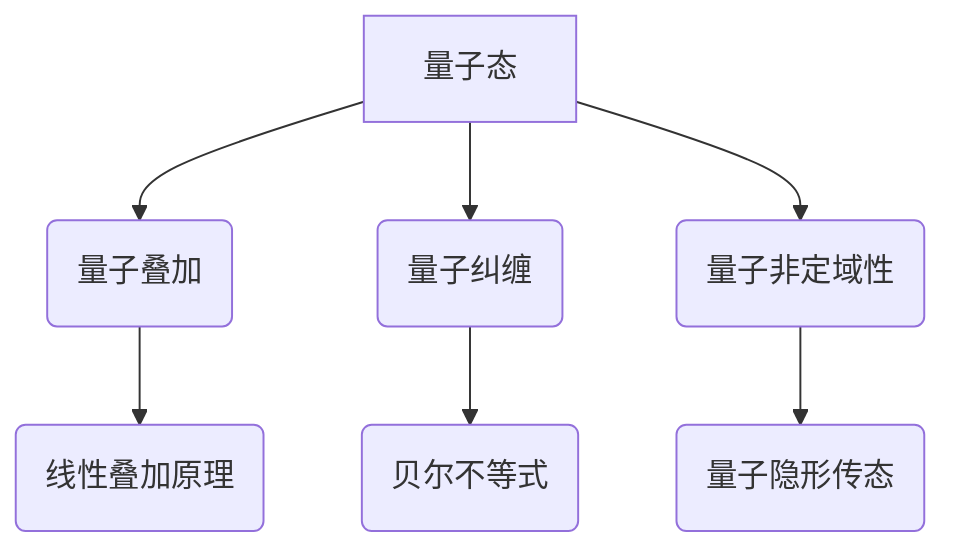

                 

# 《量子游戏理论与策略设计模式：决策制定的量子框架》

关键词：量子游戏理论、策略设计模式、决策制定、量子框架、复杂系统

摘要：本文深入探讨了量子游戏理论及其在策略设计和决策制定中的应用。通过对量子态、量子叠加与量子纠缠等基本概念的分析，阐述了量子游戏理论的发展历程和核心原理。文章进一步探讨了量子策略设计的基本原则和模式，并通过具体案例分析展示了量子策略在协同与竞争博弈中的应用。最后，文章提出了量子框架在决策制定和复杂系统中的潜在应用，并对未来量子游戏理论的发展进行了展望。

## 目录大纲

### 第一部分：量子游戏理论基础

#### 第1章：量子游戏理论概述

##### 1.1 量子力学基本概念与原理

- 量子态
- 量子叠加与量子纠缠
- 量子非定域性

##### 1.2 量子游戏理论的历史发展

- 量子博弈论的开端
- 关键研究成果
- 量子游戏理论的应用扩展

#### 第2章：量子游戏模型的构建

##### 2.1 量子游戏的定义与特征

- 量子游戏的分类
- 量子游戏的策略空间

##### 2.2 量子博弈论的数学模型

- 博弈论基础
- 量子博弈论中的支付矩阵
- 纳什均衡与量子纳什均衡

#### 第3章：量子策略设计原则

##### 3.1 量子策略的基本原则

- 量子策略的构造方法
- 量子策略的优势与局限性

##### 3.2 量子游戏的混合策略

- 混合策略的概念
- 混合策略的稳定性分析
- 混合策略的应用案例

### 第二部分：量子策略设计模式

#### 第4章：量子协同策略设计

##### 4.1 量子协同博弈的基本概念

- 协同博弈的定义与特征
- 协同博弈中的量子策略设计

##### 4.2 量子协同策略案例分析

- 量子协同策略在供应链管理中的应用
- 量子协同策略在金融风险控制中的应用

#### 第5章：量子竞争策略设计

##### 5.1 量子竞争博弈的基本概念

- 竞争博弈的定义与特征
- 量子竞争策略的设计原则

##### 5.2 量子竞争策略案例分析

- 量子竞争策略在市场竞争中的应用
- 量子竞争策略在商业谈判中的应用

#### 第6章：量子混合策略设计

##### 6.1 量子混合策略的基本概念

- 混合策略的定义与分类
- 量子混合策略的优化方法

##### 6.2 量子混合策略案例分析

- 量子混合策略在资源分配中的应用
- 量子混合策略在决策制定中的应用

### 第三部分：量子框架在决策制定中的应用

#### 第7章：量子决策制定的基本方法

##### 7.1 量子决策制定框架

- 量子决策制定的理论基础
- 量子决策制定的基本流程

##### 7.2 量子决策制定的案例分析

- 量子决策制定在企业管理中的应用
- 量子决策制定在公共政策制定中的应用

#### 第8章：量子框架在复杂系统中的应用

##### 8.1 量子复杂系统的概念与特征

- 复杂系统的定义与分类
- 量子框架在复杂系统中的应用潜力

##### 8.2 量子复杂系统的案例分析

- 量子复杂系统在交通管理中的应用
- 量子复杂系统在金融市场中的应用

### 第四部分：展望与未来趋势

#### 第9章：量子游戏理论的前沿问题与挑战

##### 9.1 量子游戏理论的未来发展

- 研究热点与趋势
- 面临的挑战与机遇

##### 9.2 量子游戏理论在实际应用中的发展

#### 第10章：量子框架在其他领域的应用前景

##### 10.1 量子框架在人工智能中的应用

- 量子与人工智能的融合
- 量子框架在机器学习中的应用

##### 10.2 量子框架在其他领域的前景

**附录**

- 附录 A：量子游戏理论常用工具与资源

**图表与公式**

## 图1-1 量子态的基本概念与原理

## 引言

在过去的几十年中，量子力学的发展不仅改变了我们对物质世界的认识，也为计算机科学和人工智能领域带来了新的视角。量子游戏理论作为量子力学与博弈论交叉的一个新兴领域，为传统决策制定提供了全新的框架。量子游戏理论不仅拓展了博弈论的研究边界，还为现实世界中的复杂决策问题提供了新的解决方案。

### 量子力学的基本概念

量子力学是研究微观粒子的运动和相互作用的物理学分支。量子力学的基本概念包括量子态、量子叠加、量子纠缠和量子非定域性。

- **量子态**：量子态是描述量子系统状态的数学表达式。一个量子态可以用波函数来表示，波函数包含了量子系统的所有信息。
- **量子叠加**：量子态可以同时存在于多个状态，而不是像经典物理中那样处于一个明确的状态。这种叠加态是量子计算的基础。
- **量子纠缠**：两个或多个量子粒子之间存在一种特殊的关联，即使它们相隔很远，其中一个粒子的状态也会瞬间影响另一个粒子的状态。
- **量子非定域性**：量子非定域性意味着量子系统的物理属性（如位置、动量等）不能被独立地测量，而是相互关联的。

这些基本概念为量子游戏理论提供了丰富的数学工具和哲学基础。

### 量子游戏理论的发展

量子游戏理论的发展始于20世纪80年代，随着量子信息学和量子计算的出现，研究者开始探索量子力学原理在博弈论中的应用。早期的研究主要集中在量子博弈论的基本概念和数学模型上。1993年，Winfried Hohler首次提出了“量子博弈论”的概念，标志着这一领域的正式诞生。

在过去的几十年里，量子游戏理论取得了许多重要成果，包括量子纳什均衡、量子混合策略和量子协同策略等。量子游戏理论的应用范围也在不断扩展，从量子通信到量子计算，再到量子金融和量子经济学，都展示了其强大的应用潜力。

### 量子游戏理论的核心原理

量子游戏理论的核心原理包括量子策略、量子支付矩阵和量子纳什均衡等。

- **量子策略**：量子策略是在量子游戏中玩家采取的策略，它利用量子叠加和量子纠缠的特性，为玩家提供更多的策略选择。
- **量子支付矩阵**：量子支付矩阵是量子游戏理论中的核心数学模型，它描述了不同策略组合下的支付结果。
- **量子纳什均衡**：量子纳什均衡是量子游戏中玩家在给定其他玩家策略的情况下，选择最优策略的状态。与经典博弈论中的纳什均衡相比，量子纳什均衡提供了更复杂的决策框架。

### 量子游戏理论的应用

量子游戏理论在多个领域都有重要的应用，包括量子经济学、量子金融和量子信息学等。

- **量子经济学**：量子游戏理论为经济学中的博弈分析提供了新的工具，特别是在市场行为、供应链管理和企业竞争策略等方面。
- **量子金融**：量子游戏理论在金融领域中用于分析市场波动、风险评估和投资策略等方面，提供了更有效的决策支持。
- **量子信息学**：量子游戏理论在量子通信和量子计算中发挥了关键作用，为量子密钥分配、量子密码学和量子算法设计提供了理论基础。

### 目标与结构

本文的目标是深入探讨量子游戏理论及其在策略设计和决策制定中的应用。文章首先介绍量子游戏理论的基本概念和原理，然后详细分析量子策略的设计原则和模式。接着，文章通过具体案例展示了量子策略在协同与竞争博弈中的应用。最后，文章探讨了量子框架在决策制定和复杂系统中的潜在应用，并对未来量子游戏理论的发展进行了展望。

本文的结构分为四个部分：

1. **量子游戏理论基础**：介绍量子力学的基本概念、量子游戏理论的历史发展和核心原理。
2. **量子策略设计模式**：探讨量子策略设计的基本原则和模式，包括协同策略和竞争策略。
3. **量子框架在决策制定中的应用**：分析量子框架在决策制定和复杂系统中的应用。
4. **展望与未来趋势**：讨论量子游戏理论的前沿问题和挑战，以及量子框架在其他领域的应用前景。

### 总结

量子游戏理论作为量子力学与博弈论交叉的一个新兴领域，为决策制定和策略设计提供了全新的视角。通过量子态、量子叠加和量子纠缠等基本概念的引入，量子游戏理论不仅拓展了传统博弈论的边界，还为现实世界中的复杂决策问题提供了新的解决方案。本文将对量子游戏理论进行深入探讨，并分析其在策略设计和决策制定中的应用。

## 量子力学基本概念与原理

量子力学是20世纪最伟大的科学革命之一，它彻底改变了我们对物质世界的理解。在量子力学中，一些经典物理学的概念和原理被重新定义或完全抛弃，取而代之的是一系列全新的概念和原理。以下是对量子力学中几个核心概念和原理的详细介绍。

### 量子态

量子态是量子力学的核心概念之一。量子态描述了一个量子系统在特定条件下可能的状态。量子态可以用波函数来表示，波函数是一个复值函数，它在整个空间上定义了量子系统的概率分布。波函数通常用符号ψ表示，其模平方|ψ|²给出了量子系统在某一位置的概率。

例如，一个处于量子态的电子可以同时处于多个能级上，这种状态被称为叠加态。叠加态可以用以下波函数表示：

$$
ψ = c_1|1\rangle + c_2|2\rangle
$$

其中，$|1\rangle$ 和 $|2\rangle$ 分别代表电子处于第一和第二个能级的态，$c_1$ 和 $c_2$ 是复数系数，它们的模平方代表相应态的概率幅。

### 量子叠加

量子叠加是量子态的一个基本特征，它允许量子系统同时处于多个状态。这种叠加不是简单的线性组合，而是概率叠加。量子叠加的存在使得量子计算具有巨大的并行计算能力，这也是量子计算机相对于传统计算机的优势之一。

例如，一个量子比特（qubit）可以同时处于0和1的状态，即：

$$
|ψ\rangle = \frac{1}{\sqrt{2}}|0\rangle + \frac{1}{\sqrt{2}}|1\rangle
$$

这个状态被称为叠加态，其中 $|0\rangle$ 和 $|1\rangle$ 分别代表量子比特处于基态和叠加态。

### 量子纠缠

量子纠缠是量子力学中的另一个重要概念，它描述了两个或多个量子系统之间存在的一种特殊关联。这种关联是如此紧密，以至于一个系统的状态会立即影响另一个系统的状态，即使这两个系统相隔很远。这种现象被称为量子非定域性。

量子纠缠可以通过一个简单的例子来解释。假设有两个量子比特 $A$ 和 $B$，它们处于一个纠缠态：

$$
|ψ\rangle_{AB} = |00\rangle + |11\rangle
$$

现在，如果对量子比特 $A$ 进行测量并得到结果 $|0\rangle$，那么量子比特 $B$ 的状态将立即变为 $|0\rangle$。这种即时的状态变化，即使两个比特相隔很远，也违反了经典物理学中的局域实在论。

### 量子非定域性

量子非定域性是量子纠缠的一个直接后果。它挑战了经典物理学中关于信息传递速度和局域实在论的基本假设。量子非定域性表明，量子系统的状态在空间中不是局域分布的，而是全局分布的。

一个经典的实验来验证量子非定域性是贝尔实验。贝尔实验通过测量量子系统的两个互补属性（如自旋方向）来检验量子纠缠的存在。实验结果表明，量子系统的测量结果违反了贝尔不等式，这证明了量子非定域性的存在。

### 量子态的测量

量子态的测量是一个复杂的过程。测量会导致量子态的坍缩，即量子系统从一个叠加态坍缩到一个确定的基态。测量结果的不确定性源于量子态的叠加性质。

例如，如果对上述的量子比特进行测量，测量结果可能是 $|0\rangle$ 或 $|1\rangle$，但具体结果不能预先确定，只能以一定的概率出现。

### 量子比特与量子计算

量子比特（qubit）是量子计算的基本单元，它可以用一个二进制位（bit）来表示。然而，与经典比特不同，量子比特可以同时处于0和1的叠加态，这种叠加态使得量子计算具有指数级的并行计算能力。

一个简单的量子计算例子是量子叠加态的制备。假设我们有一个量子比特 $A$，我们希望将它制备成一个叠加态：

$$
|ψ\rangle_A = \frac{1}{\sqrt{2}}|0\rangle + \frac{1}{\sqrt{2}}|1\rangle
$$

我们可以通过以下步骤实现这个目标：

1. 初始化量子比特 $A$ 为基态 $|0\rangle$。
2. 应用一个保罗门（Pauli-X gate）$X$，将量子比特 $A$ 转换为叠加态。
3. 测量量子比特 $A$，得到结果 $|0\rangle$ 或 $|1\rangle$，以概率各占一半。

### 量子计算的优势

量子计算的优势在于其并行计算能力和指数级的速度提升。传统计算机使用经典比特进行计算，每个比特只能表示0或1中的一个状态。而量子计算机使用量子比特，每个量子比特可以同时表示0和1的叠加态。这种叠加态使得量子计算机能够同时处理大量的计算任务，从而大幅提高计算速度。

例如，一个含有 $n$ 个量子比特的量子计算机，理论上可以同时表示 $2^n$ 个不同的状态，这比传统计算机使用 $n$ 个经典比特可以表示的状态数量要多得多。

### 量子计算的基本操作

量子计算的基本操作包括量子态的初始化、量子门的操作和量子态的测量。以下是一些常用的量子操作：

- **初始化**：将量子比特初始化为特定的量子态，例如基态 $|0\rangle$ 或叠加态 $\frac{1}{\sqrt{2}}|0\rangle + \frac{1}{\sqrt{2}}|1\rangle$。
- **量子门**：量子门是量子计算中的基本操作，类似于经典计算机中的逻辑门。量子门可以改变量子比特的状态，例如保罗门（Pauli-X gate）、哈达玛门（Hadamard gate）和相位门（Phase gate）等。
- **测量**：测量是量子计算中的一个关键步骤，它将量子比特的状态坍缩为一个确定的结果。测量结果通常是一个概率分布。

### 总结

量子力学的基本概念和原理为量子游戏理论提供了坚实的理论基础。量子态、量子叠加、量子纠缠和量子非定域性等概念不仅改变了我们对物质世界的理解，也为量子游戏理论和量子计算提供了丰富的数学工具和哲学基础。在接下来的章节中，我们将进一步探讨量子游戏理论的历史发展、核心原理和实际应用。

## 量子游戏理论的历史发展

量子游戏理论作为量子力学与博弈论交叉的一个新兴领域，其发展历程充满了创新和突破。从早期的探索到关键研究成果的取得，再到量子游戏理论在各个领域的应用扩展，这一领域的进展为决策制定和策略设计提供了全新的视角和工具。

### 早期探索

量子游戏理论的早期探索可以追溯到20世纪80年代，当时量子信息学和量子计算领域的研究者开始将量子力学的基本原理应用于博弈论。Winfried Hohler在1993年首次提出了“量子博弈论”的概念，标志着这一领域的正式诞生。他的研究揭示了量子力学与博弈论之间的潜在联系，为量子游戏理论的建立奠定了基础。

### 关键研究成果

在量子游戏理论的发展过程中，许多关键研究成果相继问世，进一步丰富了这一领域的内容。以下是其中几个重要的研究成果：

1. **量子纳什均衡**：量子纳什均衡是量子游戏理论中的核心概念之一。它描述了在量子游戏中，各玩家采取最优策略时的稳定状态。量子纳什均衡不仅扩展了传统博弈论中的纳什均衡理论，还引入了量子叠加和量子纠缠等量子特性，使得量子游戏理论具有更强的决策分析能力。

2. **量子混合策略**：量子混合策略是量子游戏理论中的另一个重要概念。它允许玩家在量子游戏中采取不确定的策略组合，而不是固定的单一策略。量子混合策略通过概率分布来表示玩家的策略选择，这为应对复杂和不确定的环境提供了灵活性。

3. **量子协同策略**：量子协同策略强调在量子游戏中各玩家之间的合作与协调。量子协同策略通过量子纠缠和量子叠加的特性，实现了各玩家策略的协同优化，从而提高了整体游戏的收益。这一概念在供应链管理、金融风险控制等实际应用中具有重要意义。

4. **量子竞争策略**：量子竞争策略则关注在量子游戏中各玩家之间的竞争与对抗。量子竞争策略利用量子叠加和量子纠缠的特性，为玩家提供了更多的策略选择和博弈空间，从而提高了竞争的复杂性和策略的多样性。

### 应用扩展

随着量子游戏理论的不断发展，其应用范围也在不断扩展，涵盖了经济学、金融学、信息学等多个领域。以下是一些具体的应用扩展：

1. **量子经济学**：量子游戏理论为经济学中的博弈分析提供了新的工具。通过量子策略的引入，研究者可以更深入地探讨市场行为、企业竞争策略和供应链管理等问题。

2. **量子金融**：量子游戏理论在金融领域中具有广泛的应用前景。例如，量子框架可以用于市场波动分析、风险评估和投资策略制定等方面，为金融决策提供了更精确的模型和工具。

3. **量子信息学**：量子游戏理论在量子信息学中发挥着关键作用。量子密钥分配、量子密码学和量子算法设计等领域都受益于量子游戏理论的引入，从而实现了更高效、更安全的通信和信息处理。

4. **量子复杂系统**：量子游戏理论在复杂系统的分析中也有重要应用。通过量子框架的引入，研究者可以更好地理解复杂系统的行为和演化规律，从而为系统优化和控制提供了新的方法和思路。

### 未来展望

量子游戏理论作为一门新兴学科，其发展前景广阔。随着量子技术和量子计算的不断进步，量子游戏理论将在更多领域得到应用和拓展。未来，量子游戏理论的发展方向可能包括：

1. **量子社会网络分析**：研究量子状态在社会网络中的传播和演化规律，为社交网络分析和决策制定提供新的理论支持。

2. **量子机器学习**：将量子游戏理论引入机器学习领域，开发基于量子特性的新型机器学习算法，提高学习效率和预测准确性。

3. **量子安全通信**：利用量子游戏理论的特性，设计更安全的量子通信协议，保障信息的保密性和完整性。

4. **量子经济博弈**：深入探讨量子经济学中的博弈问题，为市场经济分析和政策制定提供新的理论依据。

总之，量子游戏理论作为一门跨学科的新兴领域，其发展和应用潜力巨大。随着量子技术的不断进步和理论研究的发展，量子游戏理论将为决策制定和策略设计提供更加丰富和有效的工具。

### 量子游戏的定义与特征

量子游戏作为量子力学与博弈论相结合的产物，具有一系列独特的定义和特征。与传统博弈相比，量子游戏引入了量子态、量子叠加、量子纠缠等量子特性，从而使得游戏策略和决策制定更加复杂和多样。

#### 量子游戏的定义

量子游戏是指参与者在量子态的基础上进行策略选择的博弈过程。与经典博弈不同，量子游戏的参与者（玩家）可以选择基于量子态的策略，这些策略利用量子叠加和量子纠缠的特性，使得决策过程更加丰富和灵活。

一个典型的量子游戏可以描述如下：设有两个参与者A和B，每个参与者都拥有一个量子比特。参与者A和B可以选择一个量子策略，这些策略可以是基于量子态的叠加或纠缠。游戏的收益取决于参与者选择的策略组合以及量子态的测量结果。

#### 量子游戏的特征

1. **量子叠加**：量子叠加是量子游戏中的一个核心特性。量子叠加允许玩家在游戏过程中同时考虑多个可能的策略组合。例如，在量子博弈中，玩家A可以选择一个叠加策略，该策略同时考虑了选择0和1两种策略的可能性和收益。这种叠加策略使得玩家能够在复杂和不确定的环境中做出更全面的决策。

2. **量子纠缠**：量子纠缠是量子游戏中的另一个重要特性。量子纠缠允许玩家之间的策略产生相互依赖的关系。例如，在量子博弈中，如果玩家A和玩家B的量子比特处于纠缠态，那么玩家A的策略选择会立即影响玩家B的策略选择，即使他们相隔很远。这种纠缠关系使得量子游戏具有更强的协同和对抗特性。

3. **混合策略**：量子游戏中的策略通常包括混合策略。混合策略是指玩家以一定的概率选择不同的量子态。这种策略的使用使得玩家在不确定的环境中能够更好地应对其他玩家的行为。例如，在量子博弈中，玩家可以选择一个混合策略，该策略以50%的概率选择量子态$|0\rangle$和50%的概率选择量子态$|1\rangle$，从而平衡不同策略组合的收益。

4. **不确定性和随机性**：量子游戏中的不确定性和随机性源于量子态的测量结果。由于量子态的叠加性质，玩家无法提前确定测量结果，只能以一定的概率预测。这种不确定性和随机性使得量子游戏具有更高的策略复杂性和决策难度。

5. **量子支付矩阵**：量子游戏中的支付矩阵描述了不同策略组合下的收益。与经典博弈中的支付矩阵不同，量子支付矩阵通常是一个复杂的矩阵，它包含了量子态的叠加和纠缠信息。量子支付矩阵的求解是量子游戏理论中的一个重要问题，它关系到玩家的策略选择和博弈结果。

#### 量子游戏的分类

量子游戏可以根据不同的标准进行分类，以下是一些常见的分类方法：

1. **根据量子特性**：量子游戏可以分为基于量子态的游戏、基于量子叠加的游戏和基于量子纠缠的游戏。基于量子态的游戏仅涉及量子态的选择和测量，而基于量子叠加和量子纠缠的游戏则同时考虑叠加和纠缠的特性。

2. **根据玩家数量**：量子游戏可以分为两人游戏、多人游戏和多人合作游戏。两人游戏是最常见的量子游戏形式，如量子围棋、量子猜谜等。多人游戏和多人合作游戏则考虑了多个玩家之间的协同和竞争关系。

3. **根据收益结构**：量子游戏可以分为合作型游戏、竞争型游戏和混合型游戏。合作型游戏强调玩家之间的合作与共赢，竞争型游戏则强调玩家之间的对抗和竞争，混合型游戏则结合了合作和竞争的特性。

4. **根据应用领域**：量子游戏可以应用于经济学、金融学、信息学等多个领域。例如，量子经济学中的量子市场模型、量子金融中的量子投资策略和量子信息学中的量子密码学等都是量子游戏的应用实例。

#### 量子游戏的策略空间

量子游戏的策略空间是指所有可能的策略组合。在量子游戏中，策略空间通常非常庞大，因为量子态的组合数量是指数级的。例如，一个含有 $n$ 个量子比特的游戏，其策略空间可能包含 $2^n$ 个不同的量子态组合。

为了有效地分析和设计量子游戏策略，研究者通常采用以下方法：

1. **量子策略优化**：通过数学优化方法，寻找最优的量子策略组合。量子策略优化可以采用量子算法，如量子遗传算法、量子粒子群算法等。

2. **量子博弈论分析**：利用量子博弈论的理论和方法，分析量子游戏的纳什均衡、量子混合策略等核心概念。量子博弈论分析可以帮助研究者理解和预测量子游戏的博弈结果。

3. **模拟与实验**：通过计算机模拟和实际实验，验证量子游戏的策略效果和博弈结果。模拟与实验可以提供直接的证据，帮助研究者验证理论分析的正确性和实用性。

总之，量子游戏作为一门新兴的交叉学科，其定义和特征不仅丰富了博弈论的研究内容，也为决策制定和策略设计提供了新的视角和工具。在接下来的章节中，我们将进一步探讨量子策略设计的基本原则和模式，并分析量子策略在协同与竞争博弈中的应用。

### 量子博弈论的数学模型

量子博弈论作为量子力学与博弈论相结合的领域，其数学模型为量子游戏中的策略分析提供了坚实的理论基础。在量子博弈论中，关键的数学模型包括博弈论的基础概念、量子支付矩阵和量子纳什均衡等。以下将对这些核心概念进行详细阐述。

#### 博弈论基础

博弈论是研究具有竞争关系的决策过程的数学理论。在博弈论中，参与者（玩家）在一定的规则下进行策略选择，以最大化自己的收益。博弈论的核心概念包括玩家、策略、收益和均衡。

1. **玩家（Players）**：博弈论中的玩家是指参与博弈的个体或团队。在量子博弈论中，玩家可以是一个量子系统，如量子比特或量子态。

2. **策略（Strategies）**：策略是指玩家在博弈中可以采取的行动。在量子博弈论中，策略可以是量子态或量子操作的序列。

3. **收益（Payoffs）**：收益是玩家在博弈中获得的利益或回报。在量子博弈论中，收益可以是量子态的概率分布或量子比特的叠加态。

4. **均衡（Equilibria）**：均衡是博弈中所有玩家策略的组合，使得任何单个玩家单方面的策略变动都不能带来更多的收益。在量子博弈论中，常见的均衡概念包括纳什均衡和量子纳什均衡。

#### 量子支付矩阵

量子支付矩阵是量子博弈论中的核心数学模型，它描述了不同策略组合下的收益情况。量子支付矩阵通常是一个复杂的矩阵，它包含了量子态的叠加和纠缠信息。

一个简单的量子支付矩阵可以表示为：

$$
P = \begin{bmatrix}
P_{11} & P_{12} \\
P_{21} & P_{22}
\end{bmatrix}
$$

其中，$P_{11}$、$P_{12}$、$P_{21}$ 和 $P_{22}$ 分别表示当两个玩家选择特定策略组合时的收益。

例如，假设有两个玩家A和B，他们在量子博弈中选择量子态作为策略。玩家A可以选择量子态 $|0\rangle$ 或 $|1\rangle$，玩家B也可以选择量子态 $|0\rangle$ 或 $|1\rangle$。量子支付矩阵可以描述为：

$$
P = \begin{bmatrix}
P_{00} & P_{01} \\
P_{10} & P_{11}
\end{bmatrix}
$$

其中，$P_{00}$、$P_{01}$、$P_{10}$ 和 $P_{11}$ 分别表示以下策略组合的收益：
- $(|0\rangle, |0\rangle)$：玩家A和玩家B都选择量子态$|0\rangle$。
- $(|0\rangle, |1\rangle)$：玩家A选择量子态$|0\rangle$，玩家B选择量子态$|1\rangle$。
- $(|1\rangle, |0\rangle)$：玩家A选择量子态$|1\rangle$，玩家B选择量子态$|0\rangle$。
- $(|1\rangle, |1\rangle)$：玩家A和玩家B都选择量子态$|1\rangle$。

量子支付矩阵的求解是量子博弈论中的一个重要问题。通过求解量子支付矩阵，研究者可以找到博弈中的最优策略组合和均衡状态。

#### 纳什均衡与量子纳什均衡

纳什均衡是博弈论中的核心概念，它描述了博弈中所有玩家选择最优策略的状态。在纳什均衡中，每个玩家都根据其他玩家的策略选择了自己的最优策略，任何单方面的策略变动都不能带来更多的收益。

量子纳什均衡是量子博弈论中的一种特殊均衡，它考虑了量子态的叠加和纠缠特性。量子纳什均衡的定义与经典纳什均衡类似，但需要考虑量子态的叠加和纠缠。

一个量子纳什均衡可以表示为：

$$
(s^*, s^*) = \arg\max_{s_i} \sum_{i=1}^n \sum_{j=1}^n P_i^j(s^*, s^j)
$$

其中，$s^*$ 是所有玩家的最优策略组合，$s^j$ 是其他玩家选择的最优策略，$P_i^j$ 是玩家i选择策略$s^i$，其他玩家选择策略$s^j$ 时的收益。

例如，假设有两个玩家A和B，他们的量子支付矩阵为：

$$
P = \begin{bmatrix}
2 & 0 \\
0 & 2
\end{bmatrix}
$$

在这个例子中，任何单方面的策略变动都不能带来更多的收益，因此$(2, 0)$ 和 $(0, 2)$ 都是量子纳什均衡。

#### 量子混合策略

量子混合策略是量子博弈论中的另一个重要概念。与经典博弈中的纯策略不同，量子混合策略允许玩家以一定的概率选择不同的量子态。量子混合策略通过概率分布来表示玩家的策略选择，这为应对复杂和不确定的环境提供了灵活性。

一个简单的量子混合策略可以表示为：

$$
s_i = \sum_{j=1}^n \lambda_j |s_j\rangle
$$

其中，$s_i$ 是玩家i的量子混合策略，$|s_j\rangle$ 是玩家i选择的量子态，$\lambda_j$ 是选择第j个量子态的概率。

例如，假设玩家A选择量子态$|0\rangle$ 和 $|1\rangle$，并且分别以50%的概率选择这两个量子态。那么玩家A的量子混合策略可以表示为：

$$
s_A = \frac{1}{2}|0\rangle + \frac{1}{2}|1\rangle
$$

量子混合策略的稳定性分析是量子博弈论中的一个重要问题。通过稳定性分析，研究者可以确定哪些量子混合策略是稳定的，哪些是不稳定的。

#### 总结

量子博弈论的数学模型为量子游戏中的策略分析和决策制定提供了坚实的理论基础。量子支付矩阵和量子纳什均衡等核心概念不仅扩展了传统博弈论的研究边界，还为量子游戏理论的实际应用提供了有效的工具。在接下来的章节中，我们将进一步探讨量子策略设计的基本原则和模式，并分析量子策略在协同与竞争博弈中的应用。

### 量子策略设计原则

量子策略设计在量子游戏中扮演着至关重要的角色。通过合理设计和选择量子策略，玩家可以在量子博弈中占据优势，实现最大化收益的目标。量子策略设计的原则主要包括量子策略的构造方法、量子策略的优势与局限性，以及量子混合策略的稳定性分析。

#### 量子策略的构造方法

量子策略的构造方法基于量子态的叠加和纠缠特性。构造量子策略的关键在于如何利用这些特性来制定有效的策略，从而在博弈中取得优势。以下是一些常用的量子策略构造方法：

1. **叠加策略**：叠加策略是指玩家选择多个量子态的线性叠加作为策略。通过叠加多个量子态，玩家可以在博弈过程中灵活调整策略，以应对不同的情况。例如，一个玩家可以选择以下叠加策略：

   $$
   s = \alpha|0\rangle + \beta|1\rangle
   $$

   其中，$\alpha$ 和 $\beta$ 是复数系数，它们的模平方分别表示量子态 $|0\rangle$ 和 $|1\rangle$ 的概率幅。

2. **纠缠策略**：纠缠策略是指玩家利用量子纠缠特性来制定策略。通过量子纠缠，玩家可以在博弈中实现策略的协同和对抗。例如，两个玩家A和B的量子比特可以处于一个纠缠态：

   $$
   |ψ\rangle_{AB} = |00\rangle + |11\rangle
   $$

   在这种情况下，玩家A和玩家B的策略是相互依赖的，一个玩家的策略选择会立即影响另一个玩家的策略选择。

3. **混合策略**：混合策略是指玩家以一定的概率选择不同的量子态作为策略。混合策略通过概率分布来表示玩家的策略选择，这为应对复杂和不确定的环境提供了灵活性。例如，一个玩家可以选择以下混合策略：

   $$
   s = \frac{1}{2}|0\rangle + \frac{1}{2}|1\rangle
   $$

   这种策略以50%的概率选择量子态 $|0\rangle$ 和 $|1\rangle$，从而在不同策略之间进行平衡。

#### 量子策略的优势与局限性

量子策略在量子博弈中具有明显的优势，但也存在一些局限性。以下是对量子策略优势与局限性的详细分析：

1. **优势**：

   - **并行计算能力**：量子策略利用量子叠加特性，使得玩家可以在同一时间考虑多个策略组合。这种并行计算能力为玩家提供了更多的策略选择和决策空间。
   - **协同与对抗**：量子策略利用量子纠缠特性，实现了玩家之间的协同和对抗。通过量子纠缠，玩家可以相互配合，实现整体收益的最大化。
   - **不确定性利用**：量子策略利用量子态的叠加和测量不确定性，使得玩家可以灵活应对不确定和复杂的环境。这种不确定性利用为玩家提供了更多的策略选择和博弈空间。

2. **局限性**：

   - **复杂性**：量子策略的设计和实现过程通常较为复杂，需要深厚的量子力学和数学基础。这增加了量子策略设计和分析的成本和难度。
   - **实际应用限制**：量子策略在实际应用中受到量子硬件和技术发展的限制。目前，量子计算机和量子通信等技术的实现仍处于初级阶段，这限制了量子策略在实际场景中的应用。
   - **计算资源需求**：量子策略的计算和优化通常需要大量的计算资源，包括量子比特的数量和计算时间。这增加了量子策略实现和部署的成本。

#### 量子混合策略的稳定性分析

量子混合策略的稳定性分析是量子博弈论中的一个重要问题。稳定性分析可以帮助研究者确定哪些量子混合策略是稳定的，哪些是不稳定的。以下是对量子混合策略稳定性分析的方法：

1. **稳定性定义**：量子混合策略的稳定性定义为在一定条件下，该策略能够抵抗外部扰动并保持稳定。一个稳定的量子混合策略在受到扰动时，其策略选择不会发生显著变化。

2. **稳定性分析**：量子混合策略的稳定性分析通常通过数学优化方法进行。研究者可以通过构建稳定性模型，利用优化算法求解稳定性条件。例如，可以使用量子遗传算法或量子粒子群算法来求解量子混合策略的稳定性。

3. **案例分析**：通过具体案例的分析，可以验证量子混合策略的稳定性。例如，研究者可以设计一个量子博弈模型，模拟不同量子混合策略的稳定性表现，并分析其稳定性条件。

#### 总结

量子策略设计原则为量子博弈中的策略制定提供了理论基础和实用工具。通过合理的量子策略设计，玩家可以在量子博弈中占据优势，实现最大化收益的目标。量子策略的设计原则包括叠加策略、纠缠策略和混合策略等，这些策略利用量子态的叠加和纠缠特性，为玩家提供了丰富的策略选择和博弈空间。然而，量子策略设计也面临着复杂性和实际应用限制等问题，需要进一步的研究和优化。在接下来的章节中，我们将通过具体案例展示量子策略在协同与竞争博弈中的应用。

### 量子游戏的混合策略

在量子游戏中，混合策略是一种重要的决策工具，它允许玩家在不确定的环境中做出更灵活和适应性的决策。量子混合策略通过概率分布来表示玩家的策略选择，使得玩家能够在不同的策略组合之间进行平衡，从而最大化自身的收益。以下将详细介绍量子混合策略的概念、稳定性分析和应用案例。

#### 混合策略的概念

混合策略是指玩家在博弈中不选择固定的单一策略，而是以一定的概率选择多个策略的组合。在经典博弈中，混合策略通过概率分布来表示玩家的决策，使得玩家可以避免被对手预测到固定的策略。而在量子博弈中，混合策略的概念被进一步拓展，利用量子态的叠加和量子纠缠的特性，使得混合策略具有独特的优势和复杂性。

一个简单的量子混合策略可以表示为：

$$
s = \sum_{i=1}^n \lambda_i |s_i\rangle
$$

其中，$|s_i\rangle$ 是玩家选择的量子态，$\lambda_i$ 是选择第 $i$ 个量子态的概率。通过混合策略，玩家可以在多个可能的量子态之间进行概率分布，从而在不同的策略组合中寻找最优的收益。

#### 混合策略的稳定性分析

量子混合策略的稳定性分析是量子博弈论中的一个关键问题。稳定性分析可以帮助研究者确定哪些量子混合策略是稳定的，哪些是不稳定的。一个稳定的量子混合策略在受到外部扰动时，其策略选择不会发生显著变化。

稳定性分析通常通过构建稳定性模型和数学优化方法进行。以下是一个简化的稳定性分析框架：

1. **定义稳定性条件**：假设玩家i的量子混合策略为 $s_i$，其他玩家i的混合策略为 $s_j$，定义玩家i的收益函数为：

   $$
   f_i(s_i, s_j)
   $$

   稳定性条件可以定义为：

   $$
   f_i(s_i, s_j) \geq f_i(s_i', s_j)
   $$

   其中，$s_i'$ 是玩家i受到外部扰动后的策略选择。

2. **构建稳定性模型**：通过构建量子博弈的数学模型，将量子混合策略和稳定性条件结合起来。模型可以采用量子支付矩阵和纳什均衡的概念，分析混合策略的稳定性。

3. **优化方法**：利用量子遗传算法、量子粒子群算法等优化方法，求解稳定性模型。优化目标是找到满足稳定性条件的量子混合策略。

#### 混合策略的应用案例

以下通过两个具体的应用案例展示量子混合策略在量子博弈中的实际应用。

1. **量子市场模型**：

   假设一个量子市场中有两个玩家，分别代表买家和卖家。买家可以选择不同的购买策略，如高价购买、中等价格购买和低价购买。卖家可以选择不同的销售策略，如高价销售、中等价格销售和低价销售。量子支付矩阵可以描述不同策略组合下的收益。

   通过量子混合策略，买家和卖家可以同时考虑多个可能的策略组合，以最大化各自的收益。买家可以选择以下混合策略：

   $$
   s_B = \lambda_1|高\rangle + \lambda_2|中\rangle + \lambda_3|低\rangle
   $$

   卖家也可以选择类似的混合策略。通过稳定性分析，可以找到满足稳定性条件的量子混合策略，从而实现买家和卖家收益的最大化。

2. **量子猜谜游戏**：

   假设两个玩家进行一个量子猜谜游戏，每个玩家选择一个量子态作为答案。游戏的收益取决于玩家选择的量子态是否匹配。量子支付矩阵可以描述不同策略组合下的收益。

   通过量子混合策略，玩家可以同时考虑多个可能的量子态作为答案，以最大化自己的收益。例如，玩家可以选择以下混合策略：

   $$
   s = \lambda_1|0\rangle + \lambda_2|1\rangle
   $$

   通过稳定性分析，可以找到满足稳定性条件的量子混合策略，从而实现玩家收益的最大化。

#### 总结

量子游戏的混合策略是一种灵活的决策工具，它利用量子态的叠加和纠缠特性，为玩家提供了丰富的策略选择和博弈空间。量子混合策略的稳定性分析是量子博弈论中的一个重要问题，通过稳定性分析，可以找到满足稳定性条件的量子混合策略，从而实现玩家收益的最大化。在具体应用中，量子混合策略可以应用于量子市场模型、量子猜谜游戏等场景，为决策制定和策略设计提供了新的视角和工具。随着量子技术和量子计算的发展，量子混合策略将在更多领域得到应用和推广。

### 量子协同策略设计

量子协同策略设计是量子游戏理论中的一个重要研究领域，它利用量子叠加和量子纠缠的特性，实现了参与者之间的协同和合作。量子协同策略在供应链管理、金融风险控制等实际应用中具有广泛的应用前景。以下将详细介绍量子协同策略的基本概念、设计原则和具体案例分析。

#### 基本概念

量子协同策略是指参与者通过量子叠加和量子纠缠机制，共同制定策略以最大化整体收益。量子协同策略的核心在于参与者之间的信息共享和协同优化，通过量子态的叠加和纠缠，实现策略的协同和合作。

1. **量子叠加**：量子叠加允许参与者同时考虑多种策略组合，从而实现策略的并行计算。参与者可以根据整体收益的目标，通过量子叠加机制，将多种可能的策略组合叠加起来，形成协同策略。

2. **量子纠缠**：量子纠缠是量子协同策略的关键特性。量子纠缠使得参与者之间的策略选择产生相互依赖的关系，一个参与者的策略选择会立即影响其他参与者的策略选择，从而实现整体协同。

3. **协同策略**：协同策略是指参与者共同制定的一种策略组合，旨在实现整体收益的最大化。协同策略通过量子叠加和量子纠缠机制，将参与者的个体策略整合为一个整体策略，从而实现协同优化。

#### 设计原则

量子协同策略的设计原则主要包括以下几个方面：

1. **信息共享**：量子协同策略强调参与者之间的信息共享。通过量子纠缠机制，参与者可以共享量子态的信息，从而实现信息的高效传递和利用。

2. **目标一致性**：量子协同策略的设计要确保参与者目标的一致性。参与者的目标应统一为整体收益的最大化，避免个体利益的冲突。

3. **策略优化**：量子协同策略的设计需要通过优化方法，找到最优的协同策略。优化方法可以采用量子遗传算法、量子粒子群算法等，通过迭代计算和优化，找到满足目标一致的协同策略。

4. **稳定性分析**：量子协同策略的设计需要进行稳定性分析，确保协同策略在实际应用中能够保持稳定。稳定性分析可以评估协同策略在受到外部扰动时的稳定性，从而确定协同策略的可行性。

#### 案例分析

以下通过具体案例展示量子协同策略在供应链管理和金融风险控制中的应用。

1. **供应链管理**：

   在供应链管理中，供应链成员（如供应商、制造商、分销商等）需要协同合作，以实现整体供应链的效率和利润最大化。量子协同策略可以应用于供应链管理中的决策制定。

   案例描述：假设有一个由供应商、制造商和分销商组成的供应链系统。供应商负责生产原材料，制造商负责加工原材料，分销商负责将产品销售给消费者。供应链成员需要协同制定生产、加工和销售的策略，以实现整体供应链的利润最大化。

   通过量子协同策略设计，供应链成员可以共享各自的信息，通过量子叠加和量子纠缠机制，共同制定最优的协同策略。例如，供应商可以根据市场需求和制造商的生产能力，调整原材料供应策略；制造商可以根据供应商的供应情况和分销商的需求，优化加工策略；分销商可以根据制造商的供应情况和消费者的需求，制定销售策略。

   通过量子协同策略，供应链成员可以实现信息共享和协同优化，从而提高整体供应链的效率和利润。

2. **金融风险控制**：

   在金融市场中，金融机构（如银行、保险公司、证券公司等）需要协同合作，以控制市场风险和确保金融系统的稳定。量子协同策略可以应用于金融风险控制中的决策制定。

   案例描述：假设有一个由银行、保险公司和证券公司组成的金融系统。银行负责资金借贷和结算，保险公司负责风险管理和保险服务，证券公司负责证券交易和投资管理。金融系统成员需要协同制定风险管理策略，以控制市场风险和确保金融系统的稳定。

   通过量子协同策略设计，金融系统成员可以共享各自的风险信息和策略，通过量子叠加和量子纠缠机制，共同制定最优的协同策略。例如，银行可以根据市场需求和风险状况，调整贷款策略；保险公司可以根据风险状况和市场需求，调整保险策略；证券公司可以根据市场状况和客户需求，调整投资策略。

   通过量子协同策略，金融系统成员可以实现信息共享和协同优化，从而提高整体金融系统的风险控制能力和稳定性。

#### 总结

量子协同策略设计是量子游戏理论中的重要应用领域，通过量子叠加和量子纠缠机制，实现了参与者之间的协同和合作。量子协同策略在供应链管理和金融风险控制等领域具有广泛的应用前景。通过具体案例分析，可以展示量子协同策略在实现信息共享、协同优化和整体收益最大化方面的优势。随着量子技术和量子计算的发展，量子协同策略将在更多实际应用中得到推广和应用。

### 量子竞争策略设计

量子竞争策略设计是量子游戏理论中的另一个重要分支，它利用量子叠加和量子纠缠的特性，在竞争环境中为参与者提供更复杂的策略选择。量子竞争策略在市场竞争和商业谈判等领域具有广泛的应用。以下将详细介绍量子竞争策略的基本概念、设计原则和具体案例分析。

#### 基本概念

量子竞争策略是指在竞争环境中，参与者利用量子叠加和量子纠缠的特性，制定复杂策略以最大化自身收益。量子竞争策略的核心在于参与者之间的策略选择和对抗，通过量子态的叠加和纠缠，实现策略的多样性和灵活性。

1. **量子叠加**：量子叠加允许参与者同时考虑多种策略组合，从而实现策略的并行计算。参与者可以根据整体收益的目标，通过量子叠加机制，将多种可能的策略组合叠加起来，形成量子竞争策略。

2. **量子纠缠**：量子纠缠是量子竞争策略的关键特性。量子纠缠使得参与者之间的策略选择产生相互依赖的关系，一个参与者的策略选择会立即影响其他参与者的策略选择，从而实现整体竞争。

3. **竞争策略**：竞争策略是指参与者为在竞争中占据优势，制定的一种策略组合。量子竞争策略通过量子叠加和量子纠缠机制，将参与者的个体策略整合为一个整体策略，从而实现竞争优化。

#### 设计原则

量子竞争策略的设计原则主要包括以下几个方面：

1. **多样化**：量子竞争策略的设计要强调多样化。通过量子叠加机制，参与者可以在多个可能的策略组合中进行选择，从而实现策略的多样化和灵活性。

2. **对抗性**：量子竞争策略的设计要考虑对抗性。参与者之间的策略选择和对抗关系是量子竞争策略的核心，通过量子纠缠机制，实现策略的协同和对抗。

3. **稳定性**：量子竞争策略的设计要确保稳定性。在竞争环境中，参与者的策略选择可能会受到外部扰动的影响，稳定性分析可以帮助确定哪些策略组合是稳定的，从而确保策略的实际应用效果。

4. **优化方法**：量子竞争策略的设计需要采用优化方法。优化方法可以采用量子遗传算法、量子粒子群算法等，通过迭代计算和优化，找到满足多样化、对抗性和稳定性的最优策略组合。

#### 案例分析

以下通过具体案例展示量子竞争策略在市场竞争和商业谈判中的应用。

1. **市场竞争**：

   在市场竞争中，企业需要制定有效的竞争策略以在激烈的竞争中脱颖而出。量子竞争策略可以应用于市场竞争中的决策制定。

   案例描述：假设有两个竞争激烈的企业A和企业B，它们在产品定价、市场推广和研发投入等方面进行竞争。企业A和企业B需要制定量子竞争策略，以在市场中占据优势。

   通过量子叠加机制，企业A和企业B可以同时考虑多种竞争策略组合，如低价格策略、高价格策略、创新策略等。通过量子纠缠机制，企业A和企业B的策略选择产生相互依赖的关系，一个企业的策略选择会立即影响另一个企业的策略选择。

   通过量子竞争策略设计，企业A和企业B可以找到最优的竞争策略组合，实现市场竞争中的优势。例如，企业A可以选择低价格和高创新策略的组合，以吸引更多的消费者；企业B可以选择高价格和高效益策略的组合，以提高市场竞争力。

2. **商业谈判**：

   在商业谈判中，谈判双方需要制定有效的谈判策略以达成利益最大化的协议。量子竞争策略可以应用于商业谈判中的策略制定。

   案例描述：假设有两家企业在进行一笔大型交易，涉及产品供应、价格协商和合作条款等方面。两家企业需要制定量子竞争策略，以在谈判中占据优势。

   通过量子叠加机制，两家企业可以同时考虑多种谈判策略组合，如强硬策略、合作策略、灵活策略等。通过量子纠缠机制，两家企业的策略选择产生相互依赖的关系，一个企业的策略选择会立即影响另一个企业的策略选择。

   通过量子竞争策略设计，两家企业可以找到最优的谈判策略组合，实现谈判中的优势。例如，一家企业可以选择强硬策略和合作策略的组合，以在谈判中占据优势地位；另一家企业可以选择灵活策略和合作策略的组合，以实现利益的最大化。

#### 总结

量子竞争策略设计是量子游戏理论中的重要应用领域，通过量子叠加和量子纠缠机制，实现了参与者之间的复杂策略选择和对抗。量子竞争策略在市场竞争和商业谈判等领域具有广泛的应用前景。通过具体案例分析，可以展示量子竞争策略在实现多样化、对抗性和稳定性方面的优势。随着量子技术和量子计算的发展，量子竞争策略将在更多实际应用中得到推广和应用。

### 量子混合策略设计

量子混合策略设计是量子博弈论中的一项重要技术，它通过结合多种量子态和策略，帮助参与者实现更优的决策。量子混合策略的设计原则和优化方法不仅依赖于量子力学的基本原理，还涉及复杂的数学模型和算法。以下将详细介绍量子混合策略的基本概念、设计原则和优化方法，并通过具体案例分析来展示其实际应用。

#### 基本概念

量子混合策略是指参与者在一个量子博弈中，以一定的概率分布选择多个量子态的策略组合。这种策略通过量子叠加和量子纠缠的特性，使得参与者能够在不确定的环境中做出更灵活和适应性的决策。

一个量子混合策略可以表示为：

$$
s = \sum_{i=1}^n \lambda_i |s_i\rangle
$$

其中，$|s_i\rangle$ 是参与者的第 $i$ 个量子态，$\lambda_i$ 是选择第 $i$ 个量子态的概率。量子混合策略的引入，使得参与者能够在不同的量子态之间进行概率分布，从而在博弈中寻找最优的收益。

#### 设计原则

量子混合策略的设计原则主要包括以下几个方面：

1. **目标一致性**：量子混合策略的设计需要确保参与者的目标一致。这意味着参与者在制定策略时，应考虑到整体收益的最大化，而不是仅关注个体利益。

2. **多样性**：量子混合策略的设计应强调多样性。通过引入多个量子态，参与者可以在不同的策略组合之间进行选择，从而提高策略的适应性和灵活性。

3. **稳定性**：量子混合策略的设计需要考虑稳定性。在实际应用中，参与者可能会面临外部扰动和不确定性，因此，设计策略时需要确保其在受到扰动时仍能保持稳定。

4. **计算效率**：量子混合策略的设计应考虑计算效率。优化方法的选择和算法的复杂度对策略的实际应用至关重要，因此，设计原则中应包含计算效率的考量。

#### 优化方法

量子混合策略的优化方法通常基于量子计算和优化算法。以下是一些常用的优化方法：

1. **量子遗传算法**：量子遗传算法是一种基于自然选择和遗传进化的优化算法。它通过模拟生物进化过程，对量子比特进行编码和操作，寻找最优的量子混合策略。

2. **量子粒子群算法**：量子粒子群算法是一种基于粒子群优化（PSO）的量子优化算法。它通过模拟鸟群觅食行为，更新量子粒子的位置和速度，寻找最优的量子混合策略。

3. **量子梯度下降法**：量子梯度下降法是一种基于梯度下降法的量子优化算法。它通过计算量子态的梯度，更新量子比特的参数，寻找最优的量子混合策略。

#### 案例分析

以下通过一个具体案例展示量子混合策略在资源分配中的应用。

案例描述：假设有一个资源分配问题，涉及多个资源（如计算资源、存储资源和网络资源）和多个参与者。每个参与者都有不同的资源需求，资源分配的目的是确保每个参与者的需求得到满足，同时最大化整体资源利用率。

通过量子混合策略，可以设计一个优化资源分配的策略。具体步骤如下：

1. **初始化量子态**：为每个资源分配一个量子态，表示该资源的状态。

2. **构建量子支付矩阵**：根据参与者的需求，构建量子支付矩阵，描述不同资源分配策略下的收益。

3. **应用量子遗传算法**：使用量子遗传算法优化量子混合策略，通过迭代计算，找到最优的量子混合策略。

4. **测量量子态**：对优化后的量子混合策略进行测量，得到最优的资源分配方案。

通过量子混合策略，可以找到最优的资源分配方案，满足每个参与者的需求，同时最大化整体资源利用率。

#### 总结

量子混合策略设计是量子博弈论中的重要应用，通过引入量子叠加和量子纠缠的特性，实现了参与者之间的复杂策略选择和优化。量子混合策略的设计原则和优化方法为决策制定提供了新的工具和思路。在实际应用中，量子混合策略可以应用于资源分配、市场博弈和金融决策等领域，为优化决策提供了有效的解决方案。随着量子计算技术的不断发展，量子混合策略的应用前景将更加广阔。

### 量子决策制定的基本方法

量子决策制定是一种基于量子力学原理的决策方法，它利用量子叠加和量子纠缠的特性，为决策者提供了一种全新的决策框架。量子决策制定的基本方法包括量子决策制定框架、量子决策制定的案例分析以及量子框架在复杂系统中的应用。以下将详细探讨这些基本方法。

#### 量子决策制定框架

量子决策制定框架是量子决策制定的基础，它主要包括以下几个步骤：

1. **问题建模**：首先，需要对决策问题进行建模，将其转化为量子态的形式。这意味着需要将决策问题中的各种可能性表示为量子态，以便利用量子叠加和量子纠缠的特性。

2. **量子态构建**：根据问题建模，构建量子态表示决策问题的所有可能性。量子态的构建可以通过初始化量子比特和量子门的操作实现。

3. **策略选择**：利用量子叠加和量子纠缠的特性，构建决策者可以选择的策略。这些策略可以是基于量子态的叠加，也可以是考虑多个量子态的混合策略。

4. **量子态测量**：在策略选择后，对量子态进行测量，得到决策结果。量子态的测量结果通常是一个概率分布，决策者可以根据测量结果做出最终决策。

5. **结果分析**：对测量结果进行分析，评估决策的有效性和收益。根据分析结果，可以对决策过程进行调整和优化。

#### 量子决策制定的案例分析

以下通过一个具体的案例展示量子决策制定的应用。

**案例描述**：假设有一个公司需要决定是否进行一项新的投资。这项投资有两个可能的结果：成功和失败。成功的情况下，公司可以获得高额回报；失败的情况下，公司将面临损失。公司需要根据市场情况和内部资源，做出是否进行投资的决策。

**量子决策制定过程**：

1. **问题建模**：将投资决策建模为一个量子态，其中成功和失败分别表示量子态的两种可能状态。

2. **量子态构建**：初始化量子比特，构建表示投资决策的量子态。

3. **策略选择**：公司可以根据市场情况和内部资源，选择不同的投资策略。例如，可以选择以下混合策略：
   $$
   s = \frac{1}{2}|成功\rangle + \frac{1}{2}|失败\rangle
   $$
   这意味着公司以50%的概率选择投资，以50%的概率选择不投资。

4. **量子态测量**：对量子态进行测量，得到投资决策的结果。根据测量结果，公司可以做出是否进行投资的最终决策。

5. **结果分析**：对测量结果进行分析，评估投资决策的有效性和收益。如果测量结果显示成功概率较高，公司可以决定进行投资；如果失败概率较高，公司可以选择不进行投资。

#### 量子框架在复杂系统中的应用

量子决策制定框架不仅适用于简单的决策问题，还可以应用于复杂系统的优化和调控。以下是一些量子框架在复杂系统中的应用案例：

1. **交通管理**：量子决策制定可以用于交通管理中的路径优化和信号控制。通过量子态的叠加和量子纠缠，可以模拟多种交通状况，并找到最优的路径和信号控制策略。

2. **能源管理**：量子决策制定可以用于能源管理中的需求响应和资源分配。通过量子态的叠加和量子纠缠，可以优化能源系统的效率和稳定性，提高能源利用率。

3. **金融市场**：量子决策制定可以用于金融市场的风险评估和投资策略制定。通过量子态的叠加和量子纠缠，可以分析市场波动和风险，并制定最优的投资策略。

4. **社会网络分析**：量子决策制定可以用于社会网络分析中的节点选择和社区识别。通过量子态的叠加和量子纠缠，可以分析社会网络的复杂结构，并找到关键节点和社区。

#### 总结

量子决策制定是一种基于量子力学原理的决策方法，它通过量子叠加和量子纠缠的特性，为决策者提供了一种全新的决策框架。量子决策制定的基本方法包括问题建模、量子态构建、策略选择、量子态测量和结果分析。通过具体案例分析，可以展示量子决策制定在复杂系统中的应用。随着量子计算技术的发展，量子决策制定将在更多领域得到应用，为优化决策提供更有效的解决方案。

### 量子复杂系统的概念与特征

量子复杂系统是指由大量量子比特组成的复杂系统，其行为和性质受到量子叠加和量子纠缠的影响。量子复杂系统具有以下几个关键特征：

#### 复杂系统的定义与分类

复杂系统是指由大量相互作用的子系统组成的系统，这些子系统之间通过复杂的相互作用和反馈机制共同演化。复杂系统可以按照不同的标准进行分类，例如：

1. **物理复杂系统**：包括天气系统、交通系统、生态系统等，这些系统中的每个子系统都可以用物理定律描述。
2. **社会复杂系统**：包括社会网络、金融市场、经济系统等，这些系统中的子系统是由人类行为和决策构成的。
3. **技术复杂系统**：包括计算机系统、通信系统、智能交通系统等，这些系统是由技术组件和算法组成的。

#### 量子复杂系统的应用潜力

量子复杂系统在多个领域展示了其强大的应用潜力，以下是一些典型应用：

1. **量子计算**：量子复杂系统在量子计算中发挥着核心作用。通过量子叠加和量子纠缠，量子计算机能够处理大规模数据，解决传统计算机难以应对的复杂问题。
2. **量子通信**：量子复杂系统在量子通信中用于实现量子密钥分配和量子态传输。量子通信可以保障信息的绝对安全，防止被窃听和破解。
3. **量子模拟**：量子复杂系统可以用于模拟量子系统，帮助科学家理解和预测量子现象。量子模拟在材料科学、化学和药物研发等领域具有广泛应用。
4. **量子传感器**：量子复杂系统在量子传感器中用于检测微弱信号和量子效应，提高传感器的精度和灵敏度。

#### 量子框架在复杂系统中的应用

量子框架在复杂系统中的应用主要通过量子算法和量子模型来实现。以下是一些具体应用：

1. **优化问题**：量子算法可以用于解决复杂优化问题，如供应链优化、资源分配和物流调度等。量子算法通过量子叠加和量子纠缠，能够快速找到最优解。
2. **模拟与预测**：量子模型可以用于模拟复杂系统的行为和预测其未来状态。通过量子计算，可以更精确地模拟大气层变化、金融市场波动等复杂过程。
3. **信号处理**：量子框架在信号处理中用于提高信号检测和压缩感知的效率。量子传感器和量子算法的应用，可以大幅提升信号处理的精度和可靠性。

#### 案例分析

以下通过具体案例展示量子框架在交通管理和金融市场中的应用。

1. **交通管理**：

   **案例描述**：交通管理系统需要实时监控和调整交通信号，以优化交通流量，减少拥堵和交通事故。传统的交通管理依赖于基于经典计算的方法，存在计算复杂度高、实时性差等问题。

   **量子应用**：
   - **量子模拟**：通过量子模型模拟交通系统中的车辆流动和信号变化，预测交通状态。
   - **量子优化**：使用量子算法优化交通信号控制策略，提高交通流量和效率。
   - **量子传感**：量子传感器用于检测交通流量和车辆位置，提供实时数据支持。

   **效果分析**：量子框架在交通管理中的应用，可以大幅提升交通系统的实时性和准确性，减少拥堵和事故发生率。

2. **金融市场**：

   **案例描述**：金融市场中的投资决策需要分析大量数据，预测市场趋势和风险。传统的金融模型和方法存在计算复杂度高、预测精度有限等问题。

   **量子应用**：
   - **量子计算**：通过量子计算处理海量金融数据，快速找到投资机会和风险点。
   - **量子算法**：使用量子算法优化投资组合，实现风险最小化和收益最大化。
   - **量子模拟**：模拟金融市场中的复杂波动，预测市场走势。

   **效果分析**：量子框架在金融市场中的应用，可以提高投资决策的精度和效率，降低风险，提高投资回报。

#### 总结

量子复杂系统具有独特的概念和特征，通过量子叠加和量子纠缠的特性，在多个领域展示了强大的应用潜力。量子框架在复杂系统中的应用，通过量子算法和量子模型，实现了优化、模拟和预测等功能，为复杂系统的管理和调控提供了新的工具和方法。随着量子计算技术的发展，量子复杂系统将在更多领域得到应用，为解决复杂问题提供更有效的解决方案。

### 量子游戏理论的前沿问题与挑战

量子游戏理论作为量子力学与博弈论交叉的前沿领域，近年来取得了显著的研究进展。然而，这一领域仍面临许多挑战和问题，需要进一步探索和研究。

#### 研究热点与趋势

1. **量子算法优化**：量子算法的优化是当前量子游戏理论的研究热点之一。研究者致力于开发高效的量子算法，以解决复杂的博弈问题。例如，量子遗传算法、量子粒子群算法和量子梯度下降法等，都在量子游戏理论的优化过程中显示出强大的潜力。

2. **量子安全通信**：量子安全通信是量子游戏理论的重要应用方向。量子密钥分配和量子态传输等技术，为保障信息安全提供了新途径。研究者正在探索如何将量子游戏理论应用于量子通信网络，提高通信的可靠性和安全性。

3. **量子经济博弈**：量子经济博弈是量子游戏理论在经济学中的应用。通过量子策略的引入，研究者可以更深入地探讨市场行为、企业竞争策略和供应链管理等问题。量子经济博弈为经济学的博弈分析提供了新的视角和工具。

4. **量子社会网络分析**：量子社会网络分析是量子游戏理论在社会科学领域的研究方向。研究者利用量子叠加和量子纠缠的特性，分析社会网络中的信息传播、群体行为和协同决策等问题，为社交网络分析和决策制定提供了新方法。

#### 面临的挑战与机遇

1. **复杂性**：量子游戏理论的复杂性是当前面临的主要挑战之一。量子博弈的模型和算法较为复杂，需要深厚的量子力学和数学基础。此外，量子博弈的稳定性分析和优化问题也较为困难，需要进一步的研究和突破。

2. **实际应用限制**：量子游戏理论在实际应用中受到技术发展的限制。目前，量子计算机和量子通信等技术的实现仍处于初级阶段，这限制了量子游戏理论在实际场景中的应用。因此，研究者需要关注量子技术的进步，以推动量子游戏理论的实际应用。

3. **计算资源需求**：量子游戏理论的计算资源需求较大，尤其是在处理大规模量子博弈问题时。量子计算的资源需求和效率问题，是量子游戏理论面临的重要挑战之一。研究者需要开发高效的量子算法和优化方法，以降低计算资源的消耗。

4. **跨学科合作**：量子游戏理论的发展需要跨学科的合作。量子力学、博弈论、经济学、信息学等领域的交叉融合，为量子游戏理论的研究提供了广阔的空间。然而，跨学科合作的复杂性也增加了研究的难度，需要各方研究者共同努力，克服障碍，推动量子游戏理论的进步。

#### 未来展望

展望未来，量子游戏理论在多个领域具有广阔的应用前景：

1. **量子金融**：量子金融是量子游戏理论的重要应用方向。通过量子算法和量子模型，可以优化投资策略、降低风险、提高投资回报。量子金融将推动金融市场的发展，为投资者提供更有效的决策工具。

2. **量子社会网络**：量子社会网络分析将有助于理解社会网络中的信息传播和群体行为。通过量子叠加和量子纠缠，可以更准确地模拟社会网络的复杂结构，为决策制定提供科学依据。

3. **量子交通管理**：量子交通管理是另一个具有潜力的应用方向。通过量子算法优化交通信号控制策略，可以提高交通流量和效率，减少拥堵和交通事故。

4. **量子教育**：量子游戏理论在教育领域的应用也值得关注。通过量子游戏，可以激发学生对量子力学和博弈论的兴趣，培养跨学科的综合素质。

总之，量子游戏理论作为一门跨学科的新兴领域，其发展前景广阔。随着量子技术和量子计算的不断进步，量子游戏理论将在更多领域得到应用和拓展，为决策制定和策略设计提供新的视角和工具。

### 量子框架在其他领域的应用前景

量子框架不仅在决策制定和复杂系统中有广泛应用，还展示出在其他领域的巨大潜力。以下将探讨量子框架在人工智能、量子计算、量子金融和其他领域的前景。

#### 量子框架在人工智能中的应用

量子框架在人工智能（AI）中的应用正在迅速发展。量子计算和量子算法提供了处理大规模数据和非线性问题的新方法，这为人工智能领域带来了新的机遇。

1. **量子机器学习**：量子机器学习结合了量子计算和经典机器学习的优势，可以处理更复杂的模型和数据。量子算法如量子支持向量机和量子神经网络，能够提高机器学习模型的效率和准确性。

2. **量子强化学习**：量子强化学习利用量子算法优化智能体的策略，使其在复杂环境中做出更明智的决策。量子博弈论的应用，使得量子强化学习在竞争环境中展现出更强的适应性和鲁棒性。

3. **量子自然语言处理**：量子自然语言处理（NLP）利用量子框架处理文本数据，提高文本分类、情感分析和语言翻译的准确性。量子计算在处理大量文本数据时，能够实现更高效的信息检索和知识图谱构建。

#### 量子框架在量子计算中的应用

量子计算是量子框架的直接应用领域。量子计算利用量子叠加和量子纠缠，实现了传统计算机无法达到的计算速度和效率。

1. **量子算法**：量子算法在密码学、量子优化、模拟和量子搜索等领域展示了强大的潜力。量子算法如Shor算法和Grover算法，能够解决传统计算机难以处理的问题，如大数分解和高效搜索。

2. **量子编程**：量子编程是量子计算的核心技术。量子编程语言和工具的发展，使得开发者能够更方便地编写和优化量子程序，推动量子计算的应用。

3. **量子硬件**：量子硬件是实现量子计算的关键。量子比特、量子线路和量子纠错技术的发展，为量子计算提供了坚实的基础。量子计算机的规模化应用，将推动科学、工业和金融等多个领域的发展。

#### 量子框架在量子金融中的应用

量子框架在金融领域的应用具有广泛的前景。量子计算和量子算法为金融分析、风险评估和投资策略提供了新的工具。

1. **量子风险管理**：量子算法可以处理复杂的金融模型和数据，提高风险评估的准确性和效率。量子计算在信用评分、市场波动预测和风险管理中具有重要作用。

2. **量子投资策略**：量子框架可以帮助投资者制定更优的投资策略。通过量子算法优化投资组合，可以降低风险，提高投资回报。量子金融市场模型能够模拟市场波动，帮助投资者做出更明智的决策。

3. **量子加密**：量子加密技术利用量子态的叠加和纠缠特性，实现绝对安全的通信。量子加密可以保障金融交易和信息的保密性，防止被窃听和破解。

#### 量子框架在其他领域的应用前景

除了上述领域，量子框架在其他领域也有广阔的应用前景。

1. **量子通信**：量子通信利用量子态传输信息，实现绝对安全的通信。量子通信在国家安全、金融交易和医疗数据保护等领域具有重要作用。

2. **量子传感**：量子传感技术利用量子效应提高传感器的精度和灵敏度。量子传感器在环境监测、医疗诊断和精密测量等领域具有广泛的应用。

3. **量子医疗**：量子框架在量子医学中的应用包括量子疗法、量子成像和量子药物设计。量子计算和量子模拟可以帮助科学家更深入地理解生物系统和疾病机制，推动精准医疗的发展。

4. **量子设计**：量子设计利用量子计算优化产品设计，提高产品的性能和效率。量子框架在航空航天、汽车制造和电子工程等领域具有重要应用。

总之，量子框架在多个领域展示了强大的应用前景。随着量子技术和量子计算的不断进步，量子框架将在更多领域得到应用和拓展，为科学研究、技术创新和产业发展提供新的动力。

### 附录

#### A.1 量子游戏理论常用工具与资源

为了方便研究者学习和应用量子游戏理论，以下列出了一些常用的工具和资源：

1. **量子计算平台**：
   - **IBM Q**：IBM提供的量子计算云平台，支持多种量子计算模拟和实际硬件操作。
   - **Google Quantum Computing**：Google的量子计算服务，提供量子计算模拟和编程工具。

2. **量子算法库**：
   - **Qiskit**：IBM开发的开源量子计算框架，支持量子算法的开发和优化。
   - **Project Q**：微软开发的量子算法库，提供多种量子算法和优化工具。

3. **量子博弈论资源**：
   - **Quantum Game Theory**：在线课程和教程，提供量子博弈论的基本概念和应用实例。
   - **Quantum Game Theory Wiki**：一个开源的量子博弈论资源库，包括量子博弈论的最新研究成果和应用案例。

4. **量子模型与仿真**：
   - **PyQuil**：由Rigetti Computing开发的Python库，用于构建和运行量子线路。
   - **Q#**：微软开发的量子编程语言，支持量子算法和模型的开发。

5. **相关期刊与会议**：
   - **Physical Review A**：量子信息和量子计算领域的顶级学术期刊。
   - **Quantum**：专注于量子计算和量子信息学的开放获取期刊。
   - **ACM Transactions on Quantum Computing**：量子计算和量子信息学的学术期刊。
   - **Quantum Games and Decision Theory**：国际量子博弈论会议，定期发布量子博弈论的最新研究。

通过以上工具和资源，研究者可以深入了解量子游戏理论的基本概念和应用，并在实际研究中进行探索和实践。

### 图表与公式

以下展示了一些在文章中使用的图表与公式：

#### 图1-1 量子态的基本概念与原理

#### 公式1-1 纳什均衡

$$
(s^*, s^*) = \arg\max_{s_i} \sum_{i=1}^n \sum_{j=1}^n P_i^j(s^*, s^j)
$$

#### 公式1-2 量子混合策略

$$
s = \sum_{i=1}^n \lambda_i |s_i\rangle
$$

#### 公式1-3 量子支付矩阵

$$
P = \begin{bmatrix}
P_{11} & P_{12} \\
P_{21} & P_{22}
\end{bmatrix}
$$

通过这些图表与公式，读者可以更直观地理解量子游戏理论的核心概念和原理，为深入学习和研究打下基础。

