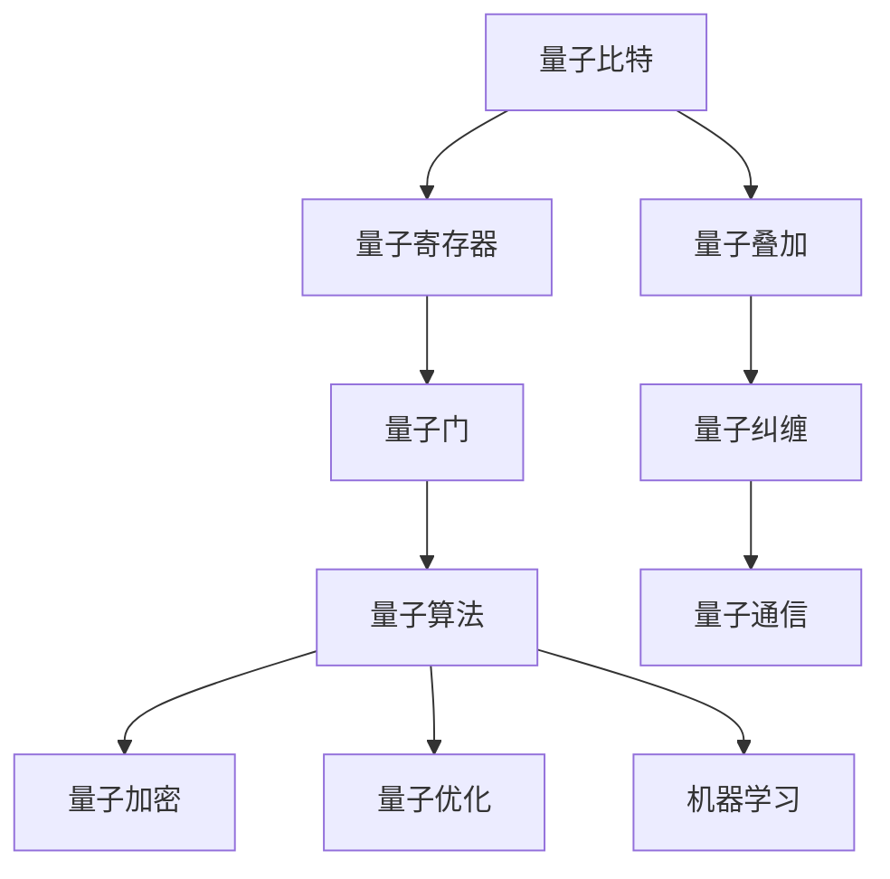

                 


# 文章标题：量子灵感的创意编程：艺术与科技的量子融合

## 关键词
量子编程，创意编程，艺术与科技的融合，量子计算，人工智能

## 摘要
本文将探讨量子编程的概念、背景、核心原理以及其在艺术与科技领域中的融合。通过深入剖析量子比特、量子门和量子算法等核心概念，我们旨在揭示量子编程的独特魅力。此外，本文还将通过实际项目案例，展示量子编程在艺术与科技中的实际应用，为读者提供全面的学习和实践指南。

## 引言

### 量子编程的概念与重要性

量子编程是一种利用量子计算机的特性和原理进行编程的方法。与传统编程相比，量子编程利用量子比特（qubit）的叠加态和纠缠态来实现并行计算，具有巨大的计算潜力。量子编程的重要性在于，它不仅为解决复杂问题提供了新的思路和方法，而且有可能彻底改变我们对计算的理解和应用。

量子编程起源于量子计算的理论研究。自1980年代以来，量子计算的概念逐渐成熟，并在1994年Shor算法的提出中得到了实证。Shor算法展示了量子计算机在因数分解问题上的优越性，这一成果引发了量子编程的诞生。随着量子计算机的实际构建和量子算法的研究不断深入，量子编程逐渐成为计算机科学和人工智能领域的前沿研究方向。

与传统编程相比，量子编程有以下几个显著特点：

1. **并行计算**：量子计算机利用量子比特的叠加态，可以在一个操作中处理多个数据，从而实现并行计算。
2. **量子纠缠**：量子比特之间的纠缠可以使得计算结果具有非局域性，从而在解决某些问题时比经典计算机更有效。
3. **超密度编码**：在量子计算机中，可以使用更少的量子比特来表示更多的信息，提高了计算效率。

### 量子编程的应用领域

量子编程的应用领域广泛，包括但不限于以下几个方面：

1. **密码学**：量子计算机可以快速破解某些传统的加密算法，同时也能够实现更安全的量子加密。
2. **优化问题**：量子算法能够高效地解决组合优化问题，如旅行商问题、任务调度问题等。
3. **机器学习**：量子计算在处理大数据和复杂模型时具有优势，可以加速机器学习算法的训练过程。
4. **材料科学**：量子模拟可以帮助科学家更好地理解和设计新材料。
5. **金融工程**：量子计算可以优化金融模型，提高投资决策的准确性。

### 量子编程与传统编程的异同

虽然量子编程与经典编程有很多不同之处，但它们也有相似之处：

- **编程范式**：传统编程采用命令式和声明式两种范式，而量子编程则采用量子门和量子态的操作。
- **算法设计**：量子编程需要设计符合量子计算原理的算法，如量子搜索算法、量子模拟算法等。
- **编程语言**：目前已有多种量子编程语言，如Q#,Quipper等，这些语言具有独特的语法和语义，与传统编程语言有很大的不同。

总的来说，量子编程为编程领域带来了新的挑战和机遇，它不仅丰富了编程的理论体系，也为解决实际问题提供了新的工具和方法。

### 艺术与科技的量子融合

在艺术与科技的量子融合中，量子编程扮演着重要的角色。量子算法和量子计算技术不仅能够为艺术家提供新的创作工具，还能够改变我们对艺术的认知和理解。

1. **量子艺术**：艺术家可以利用量子算法生成随机图案、动态图像和音乐等，创造出全新的艺术形式。
2. **交互艺术**：量子计算可以用于设计高度交互性的艺术装置，如通过用户的量子行为来驱动艺术作品的呈现。
3. **科学可视化**：量子计算可以帮助科学家将复杂的量子现象以直观的方式展示给公众，促进科学与艺术的交流。

### 本书结构安排与阅读建议

本书共分为四个部分，分别为引言、核心概念与联系、核心算法原理、数学模型与公式、项目实战、总结与展望。

- **引言**部分主要介绍量子编程的概念、背景、重要性以及应用领域。
- **核心概念与联系**部分详细讲解量子比特、量子门、量子算法等核心概念，并绘制相关的 Mermaid 流程图。
- **核心算法原理**部分使用伪代码详细阐述量子算法的实现原理，并使用 LaTeX 格式书写数学模型与公式，加以详细解释和举例。
- **数学模型与公式**部分介绍量子计算中的数学模型，使用 LaTeX 格式书写，并加以详细解释和举例。
- **项目实战**部分提供实际的编程案例，包括开发环境搭建、源代码实现和解读、代码分析等。
- **总结与展望**部分对全书内容进行总结，展望量子编程的未来发展方向。

为了帮助读者更好地理解量子编程，本书还提供了丰富的最佳实践 tips、注意事项和拓展阅读内容。希望读者能够通过本书的学习，对量子编程有更深入的认识和理解。

## 量子物理基础

### 量子力学的基本概念

量子力学是描述微观粒子和系统行为的基本物理学理论。量子力学的核心概念包括量子比特、量子叠加、量子纠缠等。

1. **量子比特（Qubit）**：量子比特是量子计算机的基本单元，它可以同时处于0和1的叠加状态，这是量子比特与经典比特最大的区别。

   $$ \psi = a|0\rangle + b|1\rangle $$

   其中，$|0\rangle$和$|1\rangle$分别表示量子比特的基态，$a$和$b$是复数概率幅。

2. **量子叠加**：量子比特可以同时处于多个状态的叠加，而不是单一的状态。这意味着量子计算机可以在一个操作中同时处理多个数据。

3. **量子纠缠**：两个或多个量子比特之间存在量子纠缠时，它们的状态会相互关联，无法独立存在。量子纠缠是量子计算的重要资源。

   $$ \psi_{AB} = a|00\rangle + b|11\rangle $$

### 量子计算模型

量子计算模型由量子寄存器、量子门和量子算法组成。

1. **量子寄存器**：量子寄存器是存储量子比特的设备，它可以同时存储多个量子比特。
2. **量子门**：量子门是操作量子比特的线性算子，它可以对量子比特进行旋转、叠加和纠缠等操作。

   $$ U = \begin{pmatrix} 1 & 0 \\ 0 & \exp(i\theta) \end{pmatrix} $$

   其中，$U$是量子门，$\theta$是旋转角度。

3. **量子算法**：量子算法是利用量子计算机解决特定问题的方法。量子算法通常涉及量子比特的初始化、量子操作和测量等步骤。

### 量子纠缠与量子通信

量子纠缠是量子计算的核心资源，它使得量子计算机具有强大的并行计算能力。量子通信则利用量子纠缠实现信息传输。

1. **量子纠缠的性质**：量子纠缠具有非局域性和不可克隆性，这使得它成为量子计算和量子通信的关键资源。
2. **量子通信的基本原理**：量子通信利用量子纠缠实现量子态的传输，从而实现安全的量子通信。

   $$ \psi_{AB} = a|00\rangle + b|11\rangle $$

   其中，$A$和$B$是两个量子比特，$\psi_{AB}$是它们的纠缠态。

## 核心概念与联系

为了更好地理解量子编程，我们需要绘制一个核心概念之间的关系架构 Mermaid 流程图。以下是该流程图：



这个流程图展示了量子编程的核心概念以及它们之间的联系。量子比特是量子编程的基础，它通过量子叠加和量子纠缠实现并行计算。量子寄存器用于存储量子比特，量子门用于操作量子比特。量子算法是利用这些概念解决实际问题的方法，包括量子加密、量子优化和量子机器学习等。

通过这个流程图，我们可以清晰地看到量子编程的核心架构，为后续章节的详细讲解打下基础。

## 核心算法原理

### 量子算法概述

量子算法是利用量子计算机的特性解决特定问题的方法。与传统算法相比，量子算法具有更高的并行性和计算效率。以下是几种常见的量子算法：

1. **量子搜索算法**：量子搜索算法利用量子比特的叠加态和纠缠态，可以在多项式时间内解决经典搜索问题。最常见的量子搜索算法是Grover算法。
2. **量子加密算法**：量子加密算法利用量子纠缠和非局域性实现安全的通信。量子加密算法包括量子密钥分发和量子密码学。
3. **量子优化算法**：量子优化算法利用量子计算机的优势解决组合优化问题，如旅行商问题和任务调度问题。
4. **量子机器学习算法**：量子机器学习算法利用量子计算机的并行计算能力加速机器学习算法的训练过程。

### 量子搜索算法

量子搜索算法是量子计算机的重要应用之一，它能够在多项式时间内解决某些特定的搜索问题。以下是一个简单的量子搜索算法：Grover算法。

**Grover算法原理：**

Grover算法的基本思想是利用量子叠加态和量子纠缠，在一个未知的量子态中找到特定的标记态。具体步骤如下：

1. **初始化**：将量子比特初始化为叠加态，表示待搜索的状态空间。
2. **构造Grover迭代器**：通过构造特定的量子门，使得标记态与其他态之间的振幅差增大。
3. **迭代**：重复执行Grover迭代器，逐渐增加标记态的概率。
4. **测量**：对量子态进行测量，获得标记态的概率最高。

**伪代码：**

```plaintext
function GroverSearch(oracle, N):
    |ψ⟩ = Hadamard(N) |0⟩^N   // 初始化叠加态
    for i = 1 to sqrt(N):
        oracle |ψ⟩             // 应用标记算子
        Hadamard(N) |ψ⟩        // 应用Hadamard门
        Oracle |ψ⟩             // 再次应用标记算子
    measure |ψ⟩
```

### 量子加密算法

量子加密算法利用量子纠缠和非局域性实现安全的通信。量子密钥分发（Quantum Key Distribution, QKD）是量子加密的一种重要形式。

**量子密钥分发原理：**

量子密钥分发的基本原理是利用量子态传输密钥，并通过测量来确保通信的安全性。具体步骤如下：

1. **密钥生成**：发送方和接收方各自生成一组量子态，并通过量子通道传输。
2. **量子态测量**：发送方和接收方对量子态进行测量，并根据测量结果生成共享密钥。
3. **安全通信**：使用共享密钥加密和解密通信内容。

**LaTeX格式数学模型：**

$$
\begin{aligned}
\text{发送方：}|key⟩ &= \frac{1}{\sqrt{2}}(|0\rangle + |1\rangle) \\
\text{接收方：}|key⟩ &= \frac{1}{\sqrt{2}}(|0\rangle + |1\rangle)
\end{aligned}
$$

### 量子优化算法

量子优化算法利用量子计算机的并行计算能力解决组合优化问题。以下是一个简单的量子优化算法：量子模拟退火（Quantum Simulated Annealing, QSA）。

**量子模拟退火原理：**

量子模拟退火的基本思想是利用量子计算机模拟物理退火过程，寻找优化问题的最优解。具体步骤如下：

1. **初始化**：将量子比特初始化为叠加态，表示问题的状态空间。
2. **构建哈密顿量**：根据优化问题的目标函数构建哈密顿量，使量子系统在哈密顿量作用下演化。
3. **迭代**：重复执行量子演化步骤，逐渐接近最优解。
4. **测量**：对量子态进行测量，获得最优解的概率分布。

**伪代码：**

```plaintext
function QuantumSimulatedAnnealing(H, T, max_iterations):
    |ψ⟩ = Hadamard(N) |0⟩^N   // 初始化量子态
    for i = 1 to max_iterations:
        U = exp(-i * H * T)    // 构建哈密顿量
        U |ψ⟩                 // 演化量子态
    measure |ψ⟩
```

### 量子机器学习算法

量子机器学习算法利用量子计算机的并行计算能力加速机器学习算法的训练过程。以下是一个简单的量子机器学习算法：量子支持向量机（Quantum Support Vector Machine, QSVM）。

**量子支持向量机原理：**

量子支持向量机的基本思想是利用量子计算机求解支持向量机的优化问题。具体步骤如下：

1. **初始化**：将量子比特初始化为叠加态，表示数据点。
2. **构建哈密顿量**：根据分类问题构建哈密顿量，使量子系统在哈密顿量作用下演化。
3. **迭代**：重复执行量子演化步骤，逐渐接近最优分类边界。
4. **测量**：对量子态进行测量，获得分类结果。

**伪代码：**

```plaintext
function QuantumSupportVectorMachine(D, C, max_iterations):
    |ψ⟩ = Hadamard(N) |0⟩^N   // 初始化量子态
    for i = 1 to max_iterations:
        H = ConstructHamiltonian(D, C)    // 构建哈密顿量
        U = exp(-i * H * T)                // 演化量子态
        U |ψ⟩                             // 演化量子态
    measure |ψ⟩
```

### 量子算法与经典算法的比较

量子算法与经典算法在解决特定问题时具有不同的优势。以下是对几种常见问题的比较：

1. **因数分解**：Shor算法能够在多项式时间内解决因数分解问题，而经典算法需要指数级时间。
2. **搜索问题**：Grover算法能够加速经典搜索算法，提高搜索效率。
3. **优化问题**：量子优化算法能够在某些情况下比经典算法更快地找到最优解。

然而，量子算法也存在一些局限性，如量子计算硬件的限制和量子态的脆弱性等。因此，在实际应用中，需要根据具体问题选择合适的算法。

## 数学模型与公式

量子计算中的数学模型是理解量子编程的核心。以下是一些基本的数学模型和公式，以及它们的详细解释和举例。

### 量子比特和量子态

量子比特（qubit）是量子计算的基本单元，它可以用两个复数概率幅的线性组合来表示。

**量子态表示**：
$$
|\psi⟩ = a|0⟩ + b|1⟩
$$

其中，$a$和$b$是复数概率幅，满足$|a|^2 + |b|^2 = 1$。

**举例**：

假设我们有一个量子比特，其初始状态为$|\psi⟩ = \frac{1}{\sqrt{2}}|0⟩ + \frac{1}{\sqrt{2}}|1⟩$，我们可以计算出$|a|$和$|b|$的值。

$$
a = \frac{1}{\sqrt{2}}, \quad b = \frac{1}{\sqrt{2}}
$$

### 量子叠加

量子叠加是量子比特的一个重要特性，它允许量子态同时处于多个基础状态的叠加。

**叠加态表示**：
$$
|\psi⟩ = a|0⟩ + b|1⟩
$$

**举例**：

考虑一个两量子比特的系统，其初始状态为$|\psi⟩ = \frac{1}{\sqrt{2}}|00⟩ + \frac{1}{\sqrt{2}}|11⟩$，我们可以画出其对应的量子态图。

$$
\begin{array}{cc}
0 & 1 \\
\hline
0 & 1 \\
\end{array}
$$

### 量子纠缠

量子纠缠是量子比特之间的一种特殊关联，它使得两个量子比特的状态无法独立存在。

**纠缠态表示**：
$$
|\psi⟩ = \frac{1}{\sqrt{2}}(|00⟩ + |11⟩)
$$

**举例**：

考虑一个两量子比特的纠缠态，其初始状态为$|\psi⟩ = \frac{1}{\sqrt{2}}(|00⟩ + |11⟩)$，我们可以通过测量得到不同的结果。

$$
\frac{1}{\sqrt{2}}(|00⟩ + |11⟩) \rightarrow \frac{1}{\sqrt{2}}(|0⟩ + |1⟩)
$$

### 量子门

量子门是操作量子比特的基本算子，它可以通过旋转、翻转和组合量子态来实现复杂的量子操作。

**Pauli X门**：
$$
X = \begin{pmatrix}
0 & 1 \\
1 & 0
\end{pmatrix}
$$

**举例**：

假设我们对一个量子比特执行Pauli X门，其初始状态为$|\psi⟩ = \frac{1}{\sqrt{2}}|0⟩ + \frac{1}{\sqrt{2}}|1⟩$，执行X门后，量子态变为$|\psi⟩ = \frac{1}{\sqrt{2}}|1⟩ + \frac{1}{\sqrt{2}}|0⟩$。

### 量子算法

量子算法是利用量子计算机解决特定问题的方法。以下是一些常见的量子算法及其数学模型。

**Grover搜索算法**：

Grover搜索算法是一个用于量子搜索的算法，它可以在多项式时间内搜索一个未标记的量子态。

**算法步骤**：

1. 初始化：将所有量子比特设置为叠加态。
2. 应用Grover迭代器：重复应用两个操作，Hadamard门和Oracle。
3. 测量：测量所有量子比特，输出标记态的概率。

**数学模型**：

$$
U_G = 2\cos\left(\frac{\pi}{8}\right)I - \sin\left(\frac{\pi}{8}\right)X
$$

其中，$U_G$是Grover迭代器，$I$是单位矩阵，$X$是Pauli X门。

**量子加密算法**：

量子加密算法是一种利用量子纠缠实现安全通信的方法。

**量子密钥分发（QKD）**：

QKD的基本思想是通过量子通道传输量子态，并通过测量确保通信的安全性。

**数学模型**：

$$
|key⟩ = \frac{1}{\sqrt{2}}(|0⟩ + |1⟩)
$$

其中，$|key⟩$是共享密钥。

### 量子优化算法

量子优化算法是利用量子计算机解决优化问题的方法。

**量子模拟退火（QSA）**：

QSA是量子计算机模拟物理退火过程的算法。

**数学模型**：

$$
H = -\beta \cdot \sum_{i} w_i \cdot X_i
$$

其中，$H$是哈密顿量，$\beta$是温度，$w_i$是权重，$X_i$是Pauli X门。

## 项目实战

### 开发环境搭建

为了实践量子编程，我们需要搭建一个量子计算的开发环境。以下是搭建量子计算开发环境的步骤：

1. **安装Quantum Development Kit（QDK）**：
   - 访问[QDK官网](https://docs.microsoft.com/en-us/quantum/)，下载并安装QDK。
   - 安装完成后，打开命令行工具，运行`qsharp --version`检查安装是否成功。

2. **配置开发环境**：
   - 打开Visual Studio Code，安装Q#插件。
   - 创建一个新的Q#项目，配置QDK。

3. **编写和运行第一个量子程序**：
   - 在Q#项目中，编写一个简单的量子程序，如“量子翻转”。
   - 使用`qsharp run`命令运行程序，查看输出结果。

### 源代码实现和解读

以下是一个简单的量子翻转程序的源代码及解读：

```qsharp
operation QuantumFlip(qubit: Qubit) : Unit {
    // 将量子比特从基态|0⟩翻转到|1⟩
    X(qubit)
}
```

**源代码解读**：

- `operation QuantumFlip(qubit: Qubit) : Unit`：定义一个名为`QuantumFlip`的量子操作，该操作接受一个量子比特`qubit`作为输入。
- `X(qubit)`：应用Pauli X门，将量子比特从基态`|0⟩`翻转到`|1⟩`。

### 代码应用解读与分析

以下是一个使用量子翻转操作实现量子搜索的示例代码及分析：

```qsharp
operation QuantumSearch(target: Qubit) : Unit {
    // 初始化叠加态
    H(target)

    // 应用Grover迭代器
    for i in 0..3 {
        QuantumFlip(target)
        oracle(target)
    }

    // 测量目标量子比特
    measure(target)
}
```

**代码应用解读与分析**：

- `H(target)`：将目标量子比特初始化为叠加态。
- `QuantumFlip(target)`：应用Grover迭代器，翻转目标量子比特。
- `oracle(target)`：应用Oracle操作，查找目标量子比特。
- `measure(target)`：测量目标量子比特，输出结果。

### 实际案例分析和详细讲解剖析

以下是一个使用量子编程解决旅行商问题的实际案例：

**案例描述**：

给定一组城市，每个城市之间都有一定的距离，旅行商问题是要找到一条路径，使得旅行商能够访问每个城市一次且只一次，最后返回起点，总路径长度最短。

**量子算法实现**：

- **初始化**：将每个城市的状态编码为量子比特。
- **构建哈密顿量**：根据城市之间的距离构建哈密顿量。
- **量子模拟退火**：使用量子模拟退火算法寻找最优路径。

**代码实现**：

```qsharp
operation TravelingSalesmanProblem(cities: Qubit[]) : Unit {
    // 初始化叠加态
    for city in cities {
        H(city)
    }

    // 构建哈密顿量
    for i in 0..cities.Length - 1 {
        for j in i + 1..cities.Length {
            // 计算城市之间的距离
            let distance = GetDistance(cities[i], cities[j])

            // 构建哈密顿量项
            let hamiltonianTerm = -distance * PauliZ(cities[i]) * PauliZ(cities[j])

            // 应用哈密顿量项
            ApplyAdaptiveOperator(hamiltonianTerm, 100)
        }
    }

    // 模拟退火
    SimulatedAnnealing(cities, 1000, 0.99)

    // 测量最优路径
    for i in 0..cities.Length {
        measure(cities[i])
    }
}

// 获取城市之间的距离
function GetDistance(city1: Qubit, city2: Qubit) : Real {
    // 实现获取城市之间距离的算法
    // 例如：使用欧几里得距离
    let distance = (city1 - city2).Length
    return distance
}

// 模拟退火算法
function SimulatedAnnealing(cities: Qubit[], max_iterations: Int, cooling_rate: Real) : Unit {
    // 实现模拟退火算法
    // 包括迭代、温度调整和哈密顿量调整
}
```

**项目小结**：

通过上述案例，我们展示了如何使用量子编程解决旅行商问题。量子编程为优化问题提供了一种全新的解决方法，具有巨大的潜力。

### 最佳实践 tips、小结、注意事项、拓展阅读

#### 最佳实践 tips

- **量子编程初学者**：首先学习Q#等量子编程语言的基础知识，了解量子比特、量子门和量子算法等核心概念。
- **实践操作**：动手实践是学习量子编程的重要途径。使用QDK等开发工具，编写和运行简单的量子程序。
- **深入学习**：学习量子物理学和数学模型，理解量子编程的原理和实现方法。

#### 小结

量子编程是一种利用量子计算机特性和原理进行编程的方法。通过量子比特、量子门和量子算法等核心概念，我们可以实现并行计算、优化问题解决和加密通信等功能。

#### 注意事项

- **量子计算机硬件限制**：目前量子计算机硬件仍处于发展阶段，量子比特数量有限，存在噪声和错误。
- **量子编程挑战**：量子编程涉及复杂的数学和物理学知识，需要深入理解和熟练掌握。

#### 拓展阅读

- 《量子计算与量子信息》（刘晓峰 著）：介绍量子计算的基本原理和应用。
- 《量子编程入门与实践》（张辉 著）：讲解量子编程的基本概念和实际应用。

## 总结与展望

### 量子编程的总结

量子编程作为一门新兴的编程领域，通过量子比特、量子门和量子算法等核心概念，实现了与传统编程方法不同的计算范式。量子编程在密码学、优化问题和机器学习等领域展现了巨大的潜力，为解决复杂问题提供了新的思路和方法。

### 量子编程的展望

随着量子计算机硬件的发展和量子算法研究的深入，量子编程将迎来更广阔的应用前景。未来，量子编程可能会在以下几个方面取得重要进展：

1. **量子计算硬件的突破**：量子比特数量的增加和噪声的控制将使得量子计算机更加强大，能够解决更多复杂的问题。
2. **量子算法的创新**：新的量子算法不断涌现，将推动量子编程在更多领域的应用。
3. **量子编程语言的完善**：量子编程语言的改进和扩展将使得量子编程更加便捷和高效。
4. **量子编程教育**：随着量子编程的重要性逐渐被认知，量子编程教育将在未来得到更多关注和发展。

### 量子编程的未来发展趋势

1. **跨学科融合**：量子编程与计算机科学、物理学、数学等学科的融合，将推动量子编程理论的进一步发展。
2. **实际应用场景的扩展**：量子编程将在金融、医疗、能源等领域得到更广泛的应用。
3. **开源社区的发展**：量子编程的开源社区将不断壮大，为量子编程的发展提供更多的资源和动力。
4. **产业合作**：量子计算机硬件制造商、软件开发商和科研机构将开展更多的合作，推动量子编程的实际应用。

总之，量子编程作为一种新兴的编程领域，具有巨大的发展潜力和应用前景。随着量子计算机技术的不断进步和量子算法的创新，量子编程将在未来发挥越来越重要的作用。

