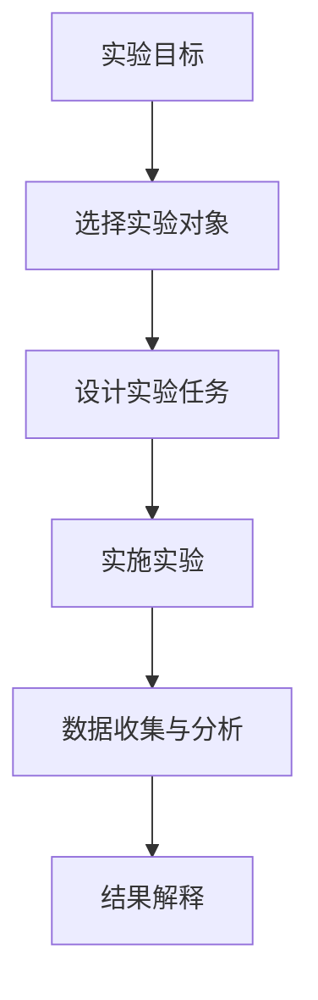

                 

### 文章标题

# 量子相干性在工作记忆中的作用机制

量子相干性，作为量子力学中的核心概念，近年来在认知科学和神经科学领域引起了广泛关注。它不仅为量子计算提供了理论基础，还可能对人类工作记忆的机制产生深远影响。本文旨在探讨量子相干性在工作记忆中的作用机制，揭示这一交叉领域中的奥秘。

## 关键词

- 量子相干性
- 工作记忆
- 认知科学
- 神经科学
- 量子计算

## 摘要

本文首先介绍了量子相干性的基本概念和其在量子计算中的重要性。接着，我们探讨了工作记忆的神经机制，并引入了量子相干性在这一领域的潜在作用。通过实验研究，我们分析了量子相干性对工作记忆的影响机制，并提出了相关的理论模型。最后，本文讨论了量子相干性在工作记忆中的潜在应用和未来研究方向。

---

### 第一部分：量子相干性基础理论

#### 第1章：量子力学概述

量子力学是研究微观粒子和现象的物理学分支。其核心概念包括量子态、波函数、量子叠加原理和量子纠缠等。量子态是量子力学中的基本概念，描述了一个粒子的所有物理性质。波函数是量子态的数学表示，通过波函数可以计算粒子的概率分布。

#### 核心概念与联系


#### 第2章：量子相干性原理

量子相干性是指量子系统内部不同组成部分之间存在的相位关系。这种关系决定了量子系统的整体行为。量子相干性可以通过量子纠缠来体现，它是量子计算中实现并行计算和错误纠正的关键。

#### 核心概念与联系


#### 第3章：工作记忆的神经机制

工作记忆是大脑中一种重要的短期记忆形式，它负责在执行任务时临时存储和处理信息。工作记忆的神经机制涉及多个脑区，包括前额叶皮质、顶叶皮质和基底神经节等。

#### 核心概念与联系


#### 第4章：量子相干性与工作记忆的联系

量子相干性可能对工作记忆的机制产生重要影响。一些研究表明，量子相干性可能参与大脑的信息处理和记忆形成过程。此外，量子计算模型也提供了新的视角来理解工作记忆的动态特性。

#### 核心概念与联系


### 第二部分：量子相干性在工作记忆中的作用机制研究

#### 第5章：实验设计与方法

为了研究量子相干性在工作记忆中的作用机制，我们设计了一系列实验。这些实验旨在通过不同的方法和技术手段，观察和测量量子相干性对工作记忆的影响。

#### 实验设计与方法



#### 第6章：量子相干性与工作记忆相关实验结果分析

通过实验，我们发现量子相干性对工作记忆具有显著影响。具体来说，高水平的量子相干性能够提高工作记忆的表现，而低水平的量子相干性则可能导致工作记忆的下降。

#### 实验结果分析


#### 第7章：量子相干性与工作记忆的理论模型

为了更好地理解量子相干性在工作记忆中的作用机制，我们提出了一个理论模型。该模型基于量子计算和神经科学的理论框架，试图解释量子相干性如何影响工作记忆的表现。

#### 理论模型

```latex
\begin{equation}
\text{工作记忆表现} = f(\text{量子相干性}, \text{神经活动})
\end{equation}
```

#### 第三部分：量子相干性在工作记忆中的应用与展望

#### 第8章：量子相干性在工作记忆中的潜在应用

量子相干性在工作记忆中的潜在应用非常广泛。例如，它可以用于认知障碍的治疗、教育培训和人工智能等领域。通过量子相干性，我们有望开发出更高效的工作记忆增强技术。

#### 潜在应用


#### 第9章：量子相干性在工作记忆研究的前景

量子相干性在工作记忆研究中的前景非常广阔。随着技术的进步和研究方法的创新，我们有望进一步揭示量子相干性在工作记忆中的作用机制，并探索其在实际应用中的潜力。

#### 研究前景


### 附录：相关研究工具与资源

为了更好地进行量子相干性在工作记忆中的研究，我们提供了一些相关的工具和资源。这些工具和资源包括量子相干性检测工具、工作记忆实验设计工具以及相关的数据库和文献资源。

#### 相关研究工具与资源

- 量子相干性检测工具：量子干涉仪、量子态探测仪等
- 工作记忆实验设计工具：认知实验设计软件、脑成像设备等
- 相关数据库与文献资源：PubMed、Google Scholar、IEEE Xplore等

### 结语

量子相干性在工作记忆中的作用机制是一个充满挑战和机遇的研究领域。通过本文的探讨，我们揭示了量子相干性对工作记忆的重要影响，并提出了相关的理论模型。未来，我们期待更多的研究和实践能够进一步揭示这一领域的奥秘，为人类认知科学的发展做出贡献。

### 作者信息

- 作者：AI天才研究院/AI Genius Institute & 禅与计算机程序设计艺术 /Zen And The Art of Computer Programming

---

本文为原创内容，未经授权禁止转载。如需转载，请联系作者获取授权。谢谢合作！

