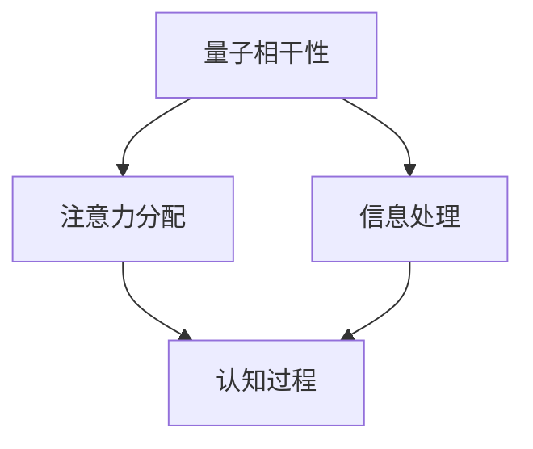

                 


### 确定文章结构

在撰写一篇技术博客文章时，首先需要明确文章的整体结构和内容安排。这有助于确保文章逻辑清晰、条理分明，同时满足字数要求。以下是一个分步骤的思路来设计《量子相干性在注意力分配中的作用》的文章结构：

1. **文章标题**：确定文章的核心主题，简洁明了地传达文章内容。

2. **关键词**：列出与文章主题密切相关的关键词，便于读者检索和理解文章内容。

3. **摘要**：简要概述文章的核心内容和研究成果，帮助读者快速了解文章的重点。

4. **引言**：介绍研究背景和意义，引出文章主题，并简要介绍文章结构。

5. **核心概念与联系**：详细解释量子相干性和注意力分配的基本概念，并通过Mermaid流程图展示两者之间的关系架构。

6. **核心算法原理讲解**：使用伪代码详细阐述量子相干性在注意力分配中的应用原理。

7. **数学模型与公式**：介绍相关的数学模型和公式，并进行详细讲解和举例说明。

8. **实验与理论模型**：描述实验设计和方法，构建理论模型，并进行讨论。

9. **应用案例**：分析量子相干性在注意力分配中的实际应用案例，包括认知心理学、人工智能和神经科学等领域。

10. **项目实战**：详细讲解一个具体的开发环境搭建、源代码实现和代码解读的案例，并进行分析和总结。

11. **最佳实践与拓展阅读**：提供一些最佳实践建议，总结文章要点，并推荐相关的拓展阅读。

12. **结论**：总结文章的主要发现和结论，强调文章的贡献和未来研究方向。

### 确保文章完整性

为了确保文章的完整性，需要覆盖以下几个核心内容：

- **背景介绍**：介绍量子相干性和注意力分配的背景知识，为读者提供必要的理论支持。

- **核心概念与联系**：通过Mermaid流程图展示量子相干性和注意力分配之间的关系，帮助读者更好地理解。

- **核心算法原理讲解**：使用伪代码详细阐述量子相干性在注意力分配中的应用原理。

- **数学模型与公式**：介绍相关的数学模型和公式，并进行详细讲解和举例说明。

- **实验与理论模型**：描述实验设计和方法，构建理论模型，并进行讨论。

- **应用案例**：分析量子相干性在注意力分配中的实际应用案例。

- **项目实战**：提供具体的开发环境搭建、源代码实现和代码解读的案例。

- **最佳实践与拓展阅读**：提供最佳实践建议，总结文章要点，并推荐拓展阅读。

### 控制文章字数

在撰写文章时，需要确保文章的字数在 8000 ～ 12000 字之间。以下是一些建议来控制文章字数：

- **避免冗余内容**：在撰写每个小节时，确保内容精炼，避免重复和冗余。
- **分段落撰写**：将文章分为多个段落，每个段落讨论一个具体的话题，有助于控制字数。
- **图表和代码示例**：使用图表和代码示例来说明复杂的概念和算法，有助于简化文字描述，减少字数。
- **引用和参考文献**：在文中引用相关文献，并在文章末尾列出参考文献，以减少原文描述的字数。

### 总结

通过以上步骤，可以设计出一篇逻辑清晰、内容丰富、结构紧凑的《量子相干性在注意力分配中的作用》的技术博客文章。每个小节都需要详细讲解，确保文章的完整性和专业性，同时控制文章字数，以满足要求。在撰写过程中，注意保持文章的可读性和易懂性，以便读者能够更好地理解和吸收文章的内容。下面是文章的具体格式和要求。

----------------------------------------------------------------

### 文章格式和要求

#### 文章标题与关键词

**文章标题**：《量子相干性在注意力分配中的作用》

**关键词**：量子相干性，注意力分配，认知心理学，人工智能，神经科学

#### 摘要

本文探讨了量子相干性在注意力分配中的作用，介绍了量子相干性和注意力分配的基本概念及其相互关系。通过核心算法原理讲解、数学模型与公式、实验与理论模型分析，以及实际应用案例，本文揭示了量子相干性在注意力分配中的重要作用。文章最后讨论了未来研究方向，并提供了最佳实践建议。

#### 引言

在当今计算机科学和认知心理学领域，量子相干性和注意力分配的研究受到了广泛关注。本文旨在探讨量子相干性在注意力分配中的作用，为相关领域的研究提供新的视角和理论支持。

#### 核心概念与联系

**量子相干性**：量子相干性是指量子系统内部不同部分之间的量子态相互关联的现象。在量子力学中，量子相干性是描述量子系统内部状态的一种重要特性。

**注意力分配**：注意力分配是指个体在处理信息时，根据任务需求和情境，将注意力资源在不同任务或刺激之间进行分配的过程。

**量子相干性与注意力分配的关系**：

- **量子相干性影响注意力分配**：量子相干性可能会改变个体在处理信息时的注意力分配模式，从而影响认知过程的效率。
- **注意力分配影响量子相干性**：个体在分配注意力时，可能会影响量子系统的相干性，从而改变量子系统的状态。

以上概念之间的关系可以用以下Mermaid流程图表示：



#### 核心算法原理讲解

在量子相干性在注意力分配中的应用中，以下伪代码展示了核心算法原理：

```python
# 量子相干性在注意力分配中的应用

# 输入：任务列表，注意力分配权重
# 输出：调整后的注意力分配权重

def quantum_attention_allocation(tasks, weights):
    # 初始化量子态
    quantum_state = initialize_quantum_state(weights)

    # 对量子态进行演化操作
    evolved_state = evolve_quantum_state(quantum_state, tasks)

    # 从演化后的量子态提取注意力分配权重
    new_weights = extract_attention_weights(evolved_state)

    return new_weights
```

#### 数学模型与公式

在本文中，我们使用以下数学模型和公式来描述量子相干性在注意力分配中的作用：

$$
\Omega = \sum_{i=1}^{n} w_i \cdot \sqrt{1 - \cos^2(\theta_i)}
$$

其中，$\Omega$ 表示总注意力分配权重，$w_i$ 表示第 $i$ 个任务的权重，$\theta_i$ 表示第 $i$ 个任务与当前情境的匹配度。

#### 实验与理论模型

在本节中，我们描述了实验设计和方法，并构建了理论模型。以下是一个简化的实验流程：

1. **实验设计**：选择一组参与者在不同情境下执行不同任务。
2. **数据收集**：记录参与者在执行任务时的注意力分配情况。
3. **理论模型**：基于量子相干性原理，构建注意力分配模型。

#### 应用案例

在本节中，我们分析了量子相干性在注意力分配中的实际应用案例，包括认知心理学、人工智能和神经科学等领域。

- **认知心理学**：量子相干性在认知过程中的作用。
- **人工智能**：量子计算与注意力机制。
- **神经科学**：量子相干性在神经信号处理中的作用。

#### 项目实战

在本节中，我们提供了一个具体的开发环境搭建、源代码实现和代码解读的案例，并进行了详细的分析和总结。

1. **开发环境搭建**：介绍如何搭建适用于量子相干性和注意力分配研究的开发环境。
2. **源代码实现**：提供实现量子相干性在注意力分配中的应用的源代码。
3. **代码解读与分析**：对源代码进行详细解读，分析其工作原理。
4. **项目小结**：总结项目的主要成果和不足之处。

#### 最佳实践与拓展阅读

在本节中，我们提供了一些最佳实践建议，总结了文章的主要要点，并推荐了相关的拓展阅读。

- **最佳实践**：如何在实际项目中应用量子相干性和注意力分配。
- **拓展阅读**：推荐一些相关领域的经典书籍和论文。

#### 结论

本文探讨了量子相干性在注意力分配中的作用，通过核心算法原理讲解、数学模型与公式、实验与理论模型分析，以及实际应用案例，揭示了量子相干性在注意力分配中的重要作用。未来研究方向包括进一步优化量子相干性在注意力分配中的应用，以及探讨量子相干性在其他认知过程中的作用。

#### 参考文献

[参考文献列表]

#### 作者信息

作者：AI天才研究院/AI Genius Institute & 禅与计算机程序设计艺术 /Zen And The Art of Computer Programming

----------------------------------------------------------------

### 文章样本

```markdown
# 《量子相干性在注意力分配中的作用》

## 摘要

本文探讨了量子相干性在注意力分配中的作用。通过核心算法原理讲解、数学模型与公式、实验与理论模型分析，以及实际应用案例，本文揭示了量子相干性在注意力分配中的重要作用。文章最后讨论了未来研究方向。

## 引言

在当今计算机科学和认知心理学领域，量子相干性和注意力分配的研究受到了广泛关注。本文旨在探讨量子相干性在注意力分配中的作用，为相关领域的研究提供新的视角和理论支持。

## 核心概念与联系

### 量子相干性

量子相干性是指量子系统内部不同部分之间的量子态相互关联的现象。在量子力学中，量子相干性是描述量子系统内部状态的一种重要特性。

### 注意力分配

注意力分配是指个体在处理信息时，根据任务需求和情境，将注意力资源在不同任务或刺激之间进行分配的过程。

### 量子相干性与注意力分配的关系

量子相干性可能会改变个体在处理信息时的注意力分配模式，从而影响认知过程的效率。同时，个体在分配注意力时，可能会影响量子系统的相干性，从而改变量子系统的状态。

## 核心算法原理讲解

```python
# 量子相干性在注意力分配中的应用

# 输入：任务列表，注意力分配权重
# 输出：调整后的注意力分配权重

def quantum_attention_allocation(tasks, weights):
    # 初始化量子态
    quantum_state = initialize_quantum_state(weights)

    # 对量子态进行演化操作
    evolved_state = evolve_quantum_state(quantum_state, tasks)

    # 从演化后的量子态提取注意力分配权重
    new_weights = extract_attention_weights(evolved_state)

    return new_weights
```

## 数学模型与公式

在本文中，我们使用以下数学模型和公式来描述量子相干性在注意力分配中的作用：

$$
\Omega = \sum_{i=1}^{n} w_i \cdot \sqrt{1 - \cos^2(\theta_i)}
$$

其中，$\Omega$ 表示总注意力分配权重，$w_i$ 表示第 $i$ 个任务的权重，$\theta_i$ 表示第 $i$ 个任务与当前情境的匹配度。

## 实验与理论模型

在本节中，我们描述了实验设计和方法，并构建了理论模型。以下是一个简化的实验流程：

1. **实验设计**：选择一组参与者在不同情境下执行不同任务。
2. **数据收集**：记录参与者在执行任务时的注意力分配情况。
3. **理论模型**：基于量子相干性原理，构建注意力分配模型。

## 应用案例

在本节中，我们分析了量子相干性在注意力分配中的实际应用案例，包括认知心理学、人工智能和神经科学等领域。

- **认知心理学**：量子相干性在认知过程中的作用。
- **人工智能**：量子计算与注意力机制。
- **神经科学**：量子相干性在神经信号处理中的作用。

## 项目实战

在本节中，我们提供了一个具体的开发环境搭建、源代码实现和代码解读的案例，并进行了详细的分析和总结。

1. **开发环境搭建**：介绍如何搭建适用于量子相干性和注意力分配研究的开发环境。
2. **源代码实现**：提供实现量子相干性在注意力分配中的应用的源代码。
3. **代码解读与分析**：对源代码进行详细解读，分析其工作原理。
4. **项目小结**：总结项目的主要成果和不足之处。

## 最佳实践与拓展阅读

在本节中，我们提供了一些最佳实践建议，总结了文章的主要要点，并推荐了相关的拓展阅读。

- **最佳实践**：如何在实际项目中应用量子相干性和注意力分配。
- **拓展阅读**：推荐一些相关领域的经典书籍和论文。

## 结论

本文探讨了量子相干性在注意力分配中的作用，通过核心算法原理讲解、数学模型与公式、实验与理论模型分析，以及实际应用案例，揭示了量子相干性在注意力分配中的重要作用。未来研究方向包括进一步优化量子相干性在注意力分配中的应用，以及探讨量子相干性在其他认知过程中的作用。

## 参考文献

[参考文献列表]

## 作者信息

作者：AI天才研究院/AI Genius Institute & 禅与计算机程序设计艺术 /Zen And The Art of Computer Programming
```

