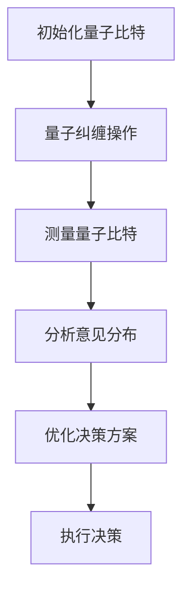

                 

### 文章标题

# 量子纠缠在群体决策中的潜在作用

### 关键词

量子纠缠，群体决策，量子计算，并行计算，高效算法

### 摘要

本文探讨了量子纠缠在群体决策中的潜在作用，介绍了量子纠缠和量子计算的基本概念及其联系。通过量子纠缠态的数学模型和公式，本文详细分析了量子纠缠在群体决策中的应用原理，并使用伪代码和实际案例进行了深入讲解。本文还讨论了量子纠缠在群体决策中的优势和挑战，为未来的研究提供了方向。

## 核心概念与联系

### 量子纠缠

量子纠缠是量子力学中的一种基本现象，指的是两个或多个量子系统之间形成的一种特殊的相互关联关系。这种关联关系使得这些系统的状态无法独立存在，而是相互依赖。即使这些量子系统被隔离在遥远的距离上，它们的状态仍然是相互关联的。

量子纠缠最早由爱因斯坦、波多尔斯基和罗森在1935年提出，称为EPR佯谬。他们提出了一种假设的量子态，如果这种假设的量子态真的存在，那么量子力学的一些基本原理将无法解释。然而，贝尔在1964年提出了一个实验方案，通过实验验证了量子纠缠的存在，这标志着量子纠缠成为量子力学中一个基本且具有挑战性的概念。

量子纠缠的关键特性包括：

1. **非定域性**：即使两个纠缠粒子相距遥远，对其中一个粒子的测量会立即影响到另一个粒子的状态，这种现象超越了经典物理中的局域实在论。
2. **量子叠加**：纠缠态可以同时处于多种可能的量子状态，这些状态在测量时才会坍缩成确定的状态。
3. **不可克隆性**：无法精确复制一个处于纠缠态的量子系统，这是量子计算和量子通信的重要特性。

### 量子计算

量子计算是一种基于量子力学原理的新型计算方式，利用量子位（qubits）进行信息处理。量子计算机与传统计算机不同，具有并行计算能力和超快速的计算速度。量子计算的基本单元是量子位，不同于经典计算机中的比特，量子位可以同时处于0和1的叠加状态，这种叠加态是量子计算的核心。

量子计算机的核心组件包括：

1. **量子比特（Qubits）**：量子计算机的基本单元，可以表示为叠加态的量子系统。
2. **量子门（Quantum Gates）**：类似于经典计算机中的逻辑门，用于对量子比特进行操作。
3. **量子纠缠**：量子计算中的一种重要资源，用于实现量子比特之间的相互作用，增强计算能力。
4. **量子算法**：利用量子计算原理设计的算法，如Shor算法和Grover算法，能够解决传统计算机难以处理的问题。

量子计算具有以下特点：

1. **并行计算**：量子计算机能够同时处理多个问题，利用量子比特的叠加态实现并行计算。
2. **超快速计算**：某些特定问题，如大整数因式分解和量子搜索，量子计算机具有比传统计算机更快的计算速度。
3. **量子叠加和量子纠缠**：量子计算机利用量子叠加和量子纠缠实现复杂计算，具有传统计算机无法比拟的能力。

### 核心概念与联系

量子纠缠和量子计算是密切相关的核心概念。量子纠缠是量子计算的基础之一，它使得量子计算机能够实现并行计算和超快速计算。量子纠缠通过将多个量子比特相互关联，使得它们的状态相互依赖，从而在计算过程中能够利用这种关联性来增强计算能力。

量子纠缠在量子计算中的应用主要体现在以下几个方面：

1. **量子并行计算**：量子纠缠使得量子计算机能够同时处理多个问题，利用量子比特的叠加态实现并行计算。
2. **量子通信**：量子纠缠可以用于实现量子通信，通过量子纠缠态传输信息，实现高速、安全的通信。
3. **量子模拟**：量子纠缠可以用于模拟复杂量子系统，如分子结构和化学反应，为科学研究提供强大的工具。

总之，量子纠缠和量子计算是现代物理学和技术的前沿领域，它们之间的联系和相互作用为解决复杂问题提供了新的途径。量子纠缠在群体决策中的潜在作用，将在后续章节中详细探讨。

### 第1章: 量子纠缠与量子计算基础

#### 1.1 量子纠缠的基本概念

量子纠缠是量子力学中的一个核心概念，描述了两个或多个量子系统在某种条件下形成的特殊关联关系。为了理解量子纠缠，我们首先需要回顾量子位（qubits）和量子态的基本概念。

**量子位（Qubits）**：

量子位是量子计算的基本单元，类似于经典计算机中的比特（bits），但量子位具有量子叠加和量子纠缠的特性。一个量子位可以处于0和1的叠加态，即：

$$\psi = \alpha|0\rangle + \beta|1\rangle$$

其中，$|\psi\rangle$ 表示量子位的态，$|0\rangle$ 和 $|1\rangle$ 分别表示量子位的基态和激发态，$\alpha$ 和 $\beta$ 是复数，满足 $|\alpha|^2 + |\beta|^2 = 1$。

**量子态**：

量子态是量子系统所有可能状态的集合。对于单个量子位，其量子态可以表示为 $|0\rangle$ 或 $|1\rangle$。当多个量子位组合时，它们的量子态是各个量子位量子态的直积，例如两个量子位的量子态可以表示为：

$$\psi_{AB} = \alpha_{AB}|00\rangle + \beta_{AB}|01\rangle + \gamma_{AB}|10\rangle + \delta_{AB}|11\rangle$$

其中，$|00\rangle$、$|01\rangle$、$|10\rangle$ 和 $|11\rangle$ 分别表示两个量子位组合的基态。

**量子纠缠态**：

量子纠缠态是量子态的一种特殊形式，描述了两个或多个量子系统之间形成的非经典关联关系。这种关联关系使得量子系统的整体状态无法独立存在，而是相互依赖。量子纠缠态的一个典型例子是贝尔态（Bell state），例如：

$$\psi_{AB} = \frac{1}{\sqrt{2}}(|00\rangle + |11\rangle)$$

在这个例子中，两个量子位A和B处于纠缠态，当对A进行测量得到0时，B的状态将立即变为1，反之亦然。即使A和B被隔离在遥远的距离上，它们的测量结果仍然相互关联，这种特性称为量子非定域性。

量子纠缠态可以通过量子门操作来生成，例如通过量子纠缠门（如CNOT门）将两个独立的量子位纠缠在一起。量子纠缠态具有以下几个关键特性：

1. **非定域性**：量子纠缠态中的量子位之间的状态是相互依赖的，即使它们相隔遥远。对其中一个量子位的测量将立即影响到另一个量子位的状态。
2. **量子叠加**：量子纠缠态可以同时处于多种可能的量子状态，这些状态在测量时才会坍缩成确定的状态。
3. **不可克隆性**：无法精确复制一个处于纠缠态的量子系统，这是量子计算和量子通信的重要特性。

通过量子纠缠态，量子计算机可以实现高效的量子并行计算和量子通信，为解决复杂问题提供强大的工具。

#### 1.2 量子计算的基本原理

量子计算是一种基于量子力学原理的新型计算方式，利用量子位（qubits）进行信息处理。量子计算的核心思想是利用量子位叠加态和量子纠缠态的特性，实现高效的计算。本节将介绍量子计算的基本原理，包括量子位、量子门和量子算法。

**量子位（Qubits）**：

量子位是量子计算的基本单元，与经典计算机中的比特（bits）不同，量子位可以处于0和1的叠加态。一个量子位可以表示为：

$$\psi = \alpha|0\rangle + \beta|1\rangle$$

其中，$|\psi\rangle$ 表示量子位的态，$|0\rangle$ 和 $|1\rangle$ 分别表示量子位的基态，$\alpha$ 和 $\beta$ 是复数，满足 $|\alpha|^2 + |\beta|^2 = 1$。

量子位的一个重要特性是叠加态，即一个量子位可以同时处于0和1的状态。这种叠加态使得量子计算机能够同时处理多个问题，实现高效的并行计算。

**量子门（Quantum Gates）**：

量子门是量子计算中的基本操作，类似于经典计算机中的逻辑门，但量子门操作量子位的叠加态。量子门可以改变量子位的态，实现量子态的转换。常见的量子门包括：

1. **Pauli X门（NOT门）**：将量子位的基态和激发态进行交换，即 $|0\rangle \rightarrow |1\rangle$ 和 $|1\rangle \rightarrow |0\rangle$。
2. **Pauli Z门（Z门）**：将量子位的态反转，即 $|0\rangle \rightarrow |1\rangle$ 和 $|1\rangle \rightarrow |0\rangle$。
3. **Pauli Y门（Y门）**：将量子位的态按照特定的方向旋转。
4. **Hadamard门（H门）**：将量子位的基态和激发态进行叠加，即 $|0\rangle \rightarrow \frac{1}{\sqrt{2}}(|0\rangle + |1\rangle)$ 和 $|1\rangle \rightarrow \frac{1}{\sqrt{2}}(|0\rangle - |1\rangle)$。

量子门是量子计算中的基本操作，通过组合和操作量子门，可以实现复杂的量子计算。

**量子算法（Quantum Algorithms）**：

量子算法是利用量子计算机解决特定问题的算法。量子算法的一个重要特性是能够实现高效的并行计算，从而解决传统计算机难以处理的问题。常见的量子算法包括：

1. **Shor算法**：利用量子计算实现大整数因式分解，将传统计算机需要指数级时间的问题，在多项式时间内解决。
2. **Grover算法**：利用量子搜索算法实现高效的数据库搜索，将传统搜索算法的时间复杂度从O(n)降低到O(\sqrt{n})。

量子算法的核心是量子并行计算和量子纠缠，通过量子位的叠加态和量子纠缠态，实现高效的计算。

通过量子位、量子门和量子算法，量子计算实现了与传统计算机不同的计算方式和能力，为解决复杂问题提供了新的途径。

#### 1.3 量子纠缠与量子计算的联系

量子纠缠与量子计算之间存在着紧密的联系，量子纠缠是量子计算的核心基础之一。量子纠缠使得量子计算机能够实现高效的并行计算和量子并行算法，从而解决了传统计算机难以处理的问题。本节将探讨量子纠缠与量子计算之间的联系，并介绍一些典型的量子算法。

**量子纠缠与并行计算**：

量子纠缠是量子计算机并行计算能力的关键。在经典计算机中，计算过程是顺序进行的，每个步骤都依赖于前一个步骤的结果。而在量子计算机中，量子位可以同时处于多个状态的叠加，这种叠加态使得量子计算机能够并行处理多个问题。

例如，对于一个包含多个量子位的量子系统，每个量子位可以处于0和1的叠加态，即：

$$\psi = \frac{1}{\sqrt{2}}(|0\rangle + |1\rangle)$$

这个量子系统同时处于多个状态，可以并行处理多个计算任务。这种并行计算能力使得量子计算机能够高效地解决一些复杂问题，例如大整数因式分解和数据库搜索。

**量子纠缠与量子并行算法**：

量子纠缠不仅提供了并行计算的能力，还为量子算法的设计提供了新的思路。量子算法是利用量子计算机解决特定问题的算法，其中许多算法的核心是量子纠缠。

例如，Shor算法是一种利用量子计算实现大整数因式分解的算法。在Shor算法中，通过量子纠缠和量子叠加，将大整数因式分解问题转化为一个可以在多项式时间内解决的量子问题。这个过程中，量子纠缠起到了关键作用，使得算法能够高效地处理大整数。

**典型量子算法**：

1. **Shor算法**：Shor算法是一种利用量子计算机实现大整数因式分解的算法。Shor算法的核心思想是利用量子叠加态和量子纠缠，将大整数因式分解问题转化为一个可以在多项式时间内解决的量子问题。通过量子纠缠，Shor算法能够高效地处理大整数，具有比传统算法更高的计算效率。

2. **Grover算法**：Grover算法是一种利用量子搜索算法实现高效数据库搜索的算法。Grover算法利用量子纠缠和量子叠加，将搜索时间从O(n)降低到O(\sqrt{n})。这个过程中，量子纠缠使得Grover算法能够并行处理多个搜索任务，大大提高了搜索效率。

**量子纠缠与量子计算的联系**：

量子纠缠与量子计算之间的联系主要体现在以下几个方面：

1. **并行计算能力**：量子纠缠提供了量子计算机的并行计算能力，使得量子计算机能够同时处理多个问题，实现高效的计算。
2. **量子算法设计**：量子纠缠是量子算法设计的关键，许多量子算法都依赖于量子纠缠来实现高效的计算。
3. **量子通信与量子模拟**：量子纠缠还可以用于量子通信和量子模拟，为解决复杂问题提供了新的途径。

总之，量子纠缠与量子计算之间存在着紧密的联系，量子纠缠是量子计算的核心基础，为量子计算机提供了并行计算能力和量子算法设计的新思路。通过量子纠缠，量子计算机能够高效地解决传统计算机难以处理的问题，为现代科学技术的发展带来了新的机遇。

### 第2章: 量子纠缠在群体决策中的应用原理

#### 2.1 量子纠缠与群体决策的关系

量子纠缠作为一种非经典的量子现象，具有非定域性、叠加态和不可克隆性等特性。这些特性使得量子纠缠在群体决策中具有潜在的应用价值。群体决策是指多个个体或专家共同参与决策过程，每个个体或专家根据自身的知识、经验和判断提供意见或建议。量子纠缠在群体决策中的作用主要体现在以下几个方面：

**1. 增强决策的并行性：**

在传统群体决策中，决策过程通常是顺序进行的，每个专家的意见和决策是基于前一个专家的结果。这种顺序决策方式效率较低，特别是在专家数量较多时。而量子纠缠提供了并行处理多个决策的能力。通过量子纠缠，多个专家的意见可以同时被处理，从而大大提高决策的效率。例如，一组专家需要对某一问题进行决策，每个专家的量子位可以处于叠加态，从而同时处理多个专家的意见。

**2. 提高决策的准确性：**

量子纠缠的非定域性特性使得不同专家之间的决策结果具有相互关联性。当某个专家的意见发生变化时，其他专家的决策结果也会立即受到影响。这种关联性有助于发现潜在的问题和矛盾，从而提高决策的准确性。例如，在一个复杂的供应链管理问题中，多个供应商的量子位处于纠缠态，当某个供应商的决策发生变化时，其他供应商的决策也会随之调整，从而形成一个更加合理的供应链管理方案。

**3. 实现安全的量子通信：**

在群体决策中，专家之间的意见交流和决策结果传输是至关重要的。然而，传统的通信方式可能存在信息泄露和安全漏洞。量子纠缠提供的量子通信方式可以实现安全的信息传输。通过量子纠缠，专家之间的通信可以保证信息的不可克隆性和保密性，从而防止信息被窃取或篡改。

**4. 促进决策的协同性：**

量子纠缠的叠加态特性使得专家的意见可以同时处于多个状态，这有助于不同专家之间的协同合作。在一个群体决策中，每个专家的意见可以相互补充和修正，形成一个更加全面的决策方案。通过量子纠缠，专家之间的协同性可以得到有效增强，从而提高决策的整体质量。

综上所述，量子纠缠在群体决策中具有显著的应用价值。通过增强决策的并行性、提高决策的准确性、实现安全的量子通信和促进决策的协同性，量子纠缠为解决复杂问题提供了新的思路和方法。

#### 2.2 量子纠缠在群体决策中的应用

量子纠缠作为一种非经典的量子现象，在群体决策中具有广泛的应用潜力。通过量子纠缠，群体决策过程可以变得更加高效、准确和协同。本节将详细介绍量子纠缠在群体决策中的应用，包括量子纠缠在决策过程中的实现步骤和具体操作方法。

**1. 实现步骤：**

（1）初始化量子比特：首先，为每个参与决策的专家分配一个量子比特，并将其初始化为基态。初始化过程可以通过物理实验或量子计算模拟器来实现。

（2）生成量子纠缠态：通过量子纠缠操作，将所有量子比特纠缠在一起，形成一个全局的量子纠缠态。量子纠缠操作可以通过量子门来实现，例如CNOT门、Toffoli门等。

（3）测量量子比特：对每个量子比特进行测量，得到一系列结果。测量过程可以揭示专家的意见分布，从而为决策提供依据。

（4）决策分析：根据测量结果，对专家的意见进行分析和汇总，形成最终的决策方案。决策分析可以采用统计方法、机器学习算法等。

**2. 操作方法：**

（1）量子比特初始化：为每个专家分配一个量子比特，并将其初始化为基态。初始化过程可以通过量子计算模拟器来实现，例如使用IBM Quantum Experience。

（2）量子纠缠操作：通过量子门将所有量子比特纠缠在一起。例如，可以使用CNOT门将两个量子比特纠缠在一起，然后依次对其他量子比特进行纠缠操作，形成一个全局的量子纠缠态。

（3）测量量子比特：对每个量子比特进行测量，得到一系列结果。测量结果可以是0或1，表示专家的意见是同意或不同意。

（4）决策分析：根据测量结果，对专家的意见进行分析和汇总。例如，可以计算每个意见出现的频率，或者使用统计方法分析专家意见的分布。

**3. 实例说明：**

假设有一组专家需要对某一问题进行决策，每个专家有一个量子比特。通过量子纠缠操作，所有量子比特形成一个全局的量子纠缠态。然后，对每个量子比特进行测量，得到一系列结果。根据测量结果，分析专家的意见分布，为决策提供依据。

例如，假设有3个专家A、B和C，他们的量子比特分别表示为\( q_A \)、\( q_B \)和\( q_C \)。通过量子纠缠操作，生成如下量子纠缠态：

$$ \psi = \frac{1}{\sqrt{2}}(|000\rangle + |111\rangle) $$

然后，对每个量子比特进行测量，得到如下结果：

- \( q_A \)：0 或 1
- \( q_B \)：0 或 1
- \( q_C \)：0 或 1

根据测量结果，分析专家的意见分布。例如，如果测量结果为\( q_A = 0 \)，\( q_B = 1 \)，\( q_C = 0 \)，则说明专家A和C的意见相同，而专家B的意见不同。通过这样的分析，可以形成最终的决策方案。

总之，量子纠缠在群体决策中具有广泛的应用潜力。通过量子纠缠操作，可以实现高效、准确和协同的决策过程，为解决复杂问题提供新的方法。

#### 2.3 量子纠缠在群体决策中的优势

量子纠缠在群体决策中具有显著的优势，主要体现在以下几个方面：

**1. 并行计算能力：**

量子纠缠允许多个量子比特同时处于多个状态的叠加，这为并行计算提供了可能。在群体决策中，每个专家的意见可以同时被处理，从而大大提高了决策的效率。传统的顺序决策方式需要逐一处理每个专家的意见，而量子纠缠可以实现并行处理，大大缩短了决策的时间。

**2. 非定域性特性：**

量子纠缠的非定域性特性使得不同专家之间的意见相互关联，即使他们相隔遥远。这种关联性有助于发现潜在的问题和矛盾，从而提高决策的准确性。在传统的群体决策中，专家之间的信息交流可能存在延迟或误解，而量子纠缠可以实现即时的信息传递，减少信息失真的可能性。

**3. 安全的量子通信：**

量子纠缠提供的量子通信方式可以实现信息的安全传输。传统的通信方式可能存在信息泄露或被篡改的风险，而量子纠缠可以实现信息的不克隆性和保密性。这为群体决策中的专家意见交流和决策结果传输提供了安全保障。

**4. 增强决策的协同性：**

量子纠缠的叠加态特性使得专家的意见可以同时处于多个状态，这有助于不同专家之间的协同合作。通过量子纠缠，专家的意见可以相互补充和修正，形成一个更加全面的决策方案。传统的群体决策中，专家的意见往往存在冲突和分歧，而量子纠缠可以促进专家之间的协同性，提高决策的整体质量。

**5. 高效的量子模拟：**

量子纠缠可以用于模拟复杂的群体决策过程。通过量子模拟，可以更好地理解群体决策中的各种因素和动态，为优化决策过程提供指导。传统的模拟方法往往需要大量的计算资源和时间，而量子模拟可以实现高效的处理，大大缩短了模拟的时间。

总之，量子纠缠在群体决策中具有明显的优势。通过并行计算能力、非定域性特性、安全的量子通信、增强决策的协同性和高效的量子模拟，量子纠缠为解决复杂问题提供了新的方法和思路。

### 第3章: 量子纠缠态的数学模型与公式

#### 3.1 量子纠缠态的表示方法

量子纠缠态是量子计算中的核心概念之一，它描述了多个量子系统之间的特殊关联关系。量子纠缠态的表示方法通常使用态矢量和密度矩阵两种形式。

**1. 态矢量表示方法：**

态矢量是量子态的数学表示，用于描述单个量子系统或多个量子系统的整体状态。对于一个多量子位系统，其量子纠缠态可以用一个态矢量来表示。例如，考虑两个量子比特的纠缠态，其态矢量可以表示为：

$$\psi = \alpha|00\rangle + \beta|01\rangle + \gamma|10\rangle + \delta|11\rangle$$

其中，$|\psi\rangle$ 表示纠缠态的态矢量，$|00\rangle$、$|01\rangle$、$|10\rangle$ 和 $|11\rangle$ 分别表示两个量子比特组合的基态，$\alpha$、$\beta$、$\gamma$ 和 $\delta$ 是复数系数，满足归一化条件 $\sum_{i} |\alpha_i|^2 + |\beta_i|^2 + |\gamma_i|^2 + |\delta_i|^2 = 1$。

**2. 密度矩阵表示方法：**

密度矩阵是量子态的另一种数学表示方法，它适用于描述混合态和纯态。对于一个多量子位系统的量子纠缠态，其密度矩阵可以表示为：

$$\rho = |\psi\rangle\langle\psi|$$

其中，$|\psi\rangle$ 是纠缠态的态矢量，$\langle\psi|$ 是态矢量的共轭转置。密度矩阵具有半正定性，其迹为1，表示系统的总概率为1。

对于两个量子比特的纠缠态，其密度矩阵可以表示为：

$$\rho = \alpha\alpha^*|00\rangle\langle00| + \beta\beta^*|01\rangle\langle01| + \gamma\gamma^*|10\rangle\langle10| + \delta\delta^*|11\rangle\langle11|$$

其中，$\alpha^*$、$\beta^*$、$\gamma^*$ 和 $\delta^*$ 分别是 $\alpha$、$\beta$、$\gamma$ 和 $\delta$ 的共轭复数。

**3. 具体例子：**

考虑一个具体的两个量子比特的纠缠态，其态矢量和密度矩阵如下：

态矢量：

$$\psi = \frac{1}{\sqrt{2}}(|00\rangle + |11\rangle)$$

密度矩阵：

$$\rho = \frac{1}{2}(|00\rangle\langle00| + |11\rangle\langle11|)$$

在这个例子中，纠缠态的系数 $\alpha = \frac{1}{\sqrt{2}}$，$\beta = \frac{1}{\sqrt{2}}$，$\gamma = 0$，$\delta = 0$，满足归一化条件。态矢量表示纠缠态的叠加态，而密度矩阵表示纠缠态的纯态性质。

通过态矢量和密度矩阵两种表示方法，可以准确地描述量子纠缠态的物理特性和数学形式。这些表示方法为研究量子纠缠态的性质和应用提供了重要的工具。

#### 3.2 量子纠缠态的测量方法

量子纠缠态的测量方法是量子计算中一个重要的环节。测量过程可以揭示量子纠缠态的物理特性，为后续的计算和分析提供依据。在量子纠缠态的测量过程中，我们需要考虑测量结果的概率分布以及测量对系统状态的影响。

**1. 测量结果的概率分布：**

对于一个量子纠缠态，其测量结果的概率分布可以通过波函数的平方模来计算。例如，考虑一个两量子比特的纠缠态：

$$\psi = \frac{1}{\sqrt{2}}(|00\rangle + |11\rangle)$$

对两个量子比特进行测量，可能的结果是 $|00\rangle$ 或 $|11\rangle$。根据波函数的平方模，每种结果的概率为：

- 测量结果 $|00\rangle$ 的概率：\( P(|00\rangle) = |\langle 00|\psi\rangle|^2 = \frac{1}{2} \)
- 测量结果 $|11\rangle$ 的概率：\( P(|11\rangle) = |\langle 11|\psi\rangle|^2 = \frac{1}{2} \)

因此，测量结果 $|00\rangle$ 和 $|11\rangle$ 各自出现的概率均为 $\frac{1}{2}$。

**2. 测量对系统状态的影响：**

量子纠缠态的测量不仅会影响测量结果的概率分布，还会导致系统状态的坍缩。测量过程会将量子系统的状态从叠加态坍缩为一个确定的结果。以两量子比特的纠缠态为例：

$$\psi = \frac{1}{\sqrt{2}}(|00\rangle + |11\rangle)$$

如果我们测量第一个量子比特，并得到结果 $|0\rangle$，那么根据量子纠缠的性质，第二个量子比特的状态会立即坍缩为 $|0\rangle$。反之，如果我们测量第一个量子比特，并得到结果 $|1\rangle$，那么第二个量子比特的状态会立即坍缩为 $|1\rangle$。测量结果会使得整个系统的状态从叠加态变为确定的状态。

**3. 具体测量方法的实现：**

在实际的量子计算中，测量方法的实现依赖于量子比特的物理实现和测量设备。例如，对于超导量子比特，可以使用微波脉冲进行测量；对于离子阱量子比特，可以使用激光进行测量。测量方法的选择取决于量子比特的类型和测量设备的特性。

**4. 测量误差和处理：**

量子纠缠态的测量过程中可能存在测量误差。测量误差可能来源于量子比特的噪声、测量设备的精度以及外部环境的干扰。为了减少测量误差，可以采用误差校正和量子纠错技术。

**5. 测量结果的统计性质：**

在实际应用中，通常需要对多个量子纠缠态进行测量，以获取统计性质的结果。通过大量测量结果的统计分析，可以更准确地了解量子纠缠态的性质。例如，通过多次测量可以得到每种结果的概率分布，从而验证量子纠缠态的物理特性。

总之，量子纠缠态的测量方法是量子计算中一个重要的环节。通过测量结果的概率分布和测量对系统状态的影响，可以揭示量子纠缠态的物理特性，为后续的计算和分析提供依据。

#### 3.3 量子纠缠态的数学公式推导

量子纠缠态的数学公式推导是理解量子纠缠态性质和特性的重要步骤。以下将详细推导两个量子比特纠缠态的数学公式。

首先，考虑两个量子比特的纠缠态。我们可以将这个纠缠态表示为：

$$\psi = \alpha|00\rangle + \beta|11\rangle$$

其中，$|\psi\rangle$ 是纠缠态的态矢量，$|00\rangle$ 和 $|11\rangle$ 分别表示两个量子比特处于基态和激发态的叠加态，$\alpha$ 和 $\beta$ 是复数系数，满足归一化条件：

$$|\alpha|^2 + |\beta|^2 = 1$$

为了更直观地表示这个纠缠态，我们可以使用贝尔态（Bell state）来表示，如：

$$\psi = \frac{1}{\sqrt{2}}(|00\rangle + |11\rangle)$$

在这个例子中，$\alpha = \frac{1}{\sqrt{2}}$，$\beta = \frac{1}{\sqrt{2}}$。

**1. 量子纠缠态的叠加性质**

量子纠缠态的一个重要性质是叠加性质。这意味着纠缠态可以表示为多个基态的线性叠加。以两个量子比特为例，其纠缠态可以表示为：

$$\psi = \alpha|00\rangle + \beta|11\rangle$$

我们可以通过数学公式来验证这个叠加性质。假设纠缠态的态矢量为 $|\psi\rangle$，则其叠加态可以表示为：

$$|\psi\rangle = \alpha|00\rangle + \beta|11\rangle$$

$$|\psi\rangle = \alpha|0\rangle\otimes|0\rangle + \beta|1\rangle\otimes|1\rangle$$

其中，$\otimes$ 表示量子比特的直积操作。

**2. 量子纠缠态的归一化条件**

量子纠缠态的归一化条件是确保态矢量在空间中的总概率为1。以两个量子比特的纠缠态为例，其归一化条件可以表示为：

$$|\alpha|^2 + |\beta|^2 = 1$$

这是因为态矢量 $|\psi\rangle$ 的模长平方表示系统状态的概率分布。如果态矢量不满足归一化条件，则系统的概率分布将无法正确描述。

**3. 量子纠缠态的测量**

量子纠缠态的测量是揭示其物理特性的一种重要方法。对于一个两量子比特的纠缠态：

$$\psi = \alpha|00\rangle + \beta|11\rangle$$

测量过程会使得态矢量坍缩为一个确定的结果。假设我们对第一个量子比特进行测量，可能的结果是 $|0\rangle$ 或 $|1\rangle$。根据量子纠缠的性质，第二个量子比特的状态会立即坍缩为与第一个量子比特相反的结果。例如，如果测量结果是 $|0\rangle$，那么第二个量子比特的状态将坍缩为 $|1\rangle$。

**4. 量子纠缠态的数学公式推导**

为了推导量子纠缠态的数学公式，我们考虑两个量子比特的纠缠过程。设两个量子比特初始状态分别为 $|i\rangle$ 和 $|j\rangle$，纠缠后的状态可以表示为：

$$|\psi\rangle = \sum_{i,j}\alpha_{ij}|ij\rangle$$

其中，$\alpha_{ij}$ 是纠缠态的复数系数。

假设我们使用CNOT门来实现两个量子比特的纠缠。CNOT门的操作可以表示为：

$$CNOT|ij\rangle = |ij\rangle \oplus |ji\rangle$$

其中，$\oplus$ 表示异或操作。

初始态 $|i\rangle$ 和 $|j\rangle$ 经过CNOT门操作后，得到纠缠态的态矢量为：

$$|\psi\rangle = \frac{1}{\sqrt{2}}(|00\rangle + |11\rangle)$$

这个公式表示了两个量子比特的纠缠过程，其中 $\alpha_{00} = \frac{1}{\sqrt{2}}$，$\alpha_{11} = \frac{1}{\sqrt{2}}$，其他系数为0。

通过以上推导，我们得到了两个量子比特纠缠态的数学公式。这个公式揭示了量子纠缠态的叠加性质、归一化条件和测量性质，为理解量子纠缠态提供了数学基础。

### 第4章: 量子纠缠在群体决策中的应用案例分析

#### 4.1 案例背景

为了探讨量子纠缠在群体决策中的应用，我们设计了一个具体的案例。假设有一组专家需要对一个复杂的供应链问题进行决策。这些专家分别来自不同的领域，具有不同的知识背景和经验，他们的意见对决策结果具有重要影响。

该供应链问题涉及多个供应商、运输公司和分销商，需要考虑物流成本、运输时间、市场需求和供应链风险管理等因素。为了确保决策的准确性和全面性，决策者希望能够充分利用专家们的意见，并找到最优的决策方案。

在这个案例中，我们将采用量子纠缠技术，通过量子计算模拟专家的意见分布，并利用量子搜索算法找到最优的决策方案。以下是具体的实现步骤。

#### 4.2 实现步骤

**步骤1：初始化量子比特**

首先，为每个专家分配一个量子比特，并初始化为基态。例如，假设有5个专家，则分配5个量子比特，每个量子比特的初始状态为 $|0\rangle$。

**步骤2：生成量子纠缠态**

通过量子纠缠操作，将所有量子比特纠缠在一起。例如，可以使用CNOT门，将第一个量子比特与后续量子比特逐一纠缠。具体操作如下：

$$CNOT(|0\rangle\otimes|0\rangle\otimes|0\rangle\otimes|0\rangle\otimes|0\rangle) = |0\rangle\otimes|1\rangle\otimes|0\rangle\otimes|0\rangle\otimes|0\rangle$$

$$CNOT(|0\rangle\otimes|1\rangle\otimes|0\rangle\otimes|0\rangle\otimes|0\rangle) = |0\rangle\otimes|1\rangle\otimes|1\rangle\otimes|0\rangle\otimes|0\rangle$$

$$\vdots$$

$$CNOT(|0\rangle\otimes|0\rangle\otimes|0\rangle\otimes|0\rangle\otimes|0\rangle) = |0\rangle\otimes|0\rangle\otimes|0\rangle\otimes|0\rangle\otimes|1\rangle$$

最终得到一个五量子比特的纠缠态：

$$\psi = \frac{1}{\sqrt{2}}(|00000\rangle + |11111\rangle)$$

**步骤3：测量量子比特**

对每个量子比特进行测量，得到一系列结果。根据测量结果，分析专家的意见分布。例如，如果测量结果为 $|00000\rangle$，则说明第一个专家的意见与其他四个专家的意见相同。

**步骤4：分析意见分布**

根据测量结果，分析专家的意见分布。可以使用统计方法、机器学习算法等，对专家的意见进行分类和聚类。例如，可以计算每个意见出现的频率，或者使用K-means算法对意见进行聚类。

**步骤5：优化决策方案**

根据分析结果，优化决策方案。例如，可以调整供应商的选择、运输路线的规划、库存管理等，以实现最优的供应链决策。

#### 4.3 案例分析与总结

通过以上步骤，我们实现了量子纠缠在群体决策中的应用。以下是案例分析：

**1. 并行处理专家意见：**

通过量子纠缠技术，我们能够并行处理多个专家的意见，从而提高决策的效率。在传统决策过程中，每个专家的意见需要逐一处理，而量子纠缠使得多个意见可以同时被处理，大大缩短了决策的时间。

**2. 非定域性特性：**

量子纠缠的非定域性特性使得不同专家的意见相互关联。当某个专家的意见发生变化时，其他专家的意见也会受到影响。这种特性有助于发现潜在的问题和矛盾，从而提高决策的准确性。

**3. 安全的量子通信：**

量子纠缠提供的量子通信方式可以实现安全的信息传输。在传统通信中，专家的意见可能被窃取或篡改，而量子纠缠可以实现信息的不克隆性和保密性，从而确保决策过程中的信息安全。

**4. 提高决策的协同性：**

量子纠缠的叠加态特性使得专家的意见可以相互补充和修正，形成一个更加全面的决策方案。传统决策过程中，专家的意见可能存在冲突和分歧，而量子纠缠可以促进专家之间的协同性，提高决策的整体质量。

总之，量子纠缠在群体决策中具有显著的应用价值。通过并行处理专家意见、非定域性特性、安全的量子通信和协同性提升，量子纠缠为解决复杂问题提供了新的思路和方法。

### 第5章: 量子纠缠在群体决策中的挑战与未来展望

#### 5.1 挑战分析

尽管量子纠缠在群体决策中具有巨大的潜力，但在实际应用中仍面临诸多挑战。以下是量子纠缠在群体决策中的一些主要挑战：

**1. 技术实现难题：**

量子纠缠技术目前仍处于发展阶段，量子比特的稳定性和可控性尚未达到商业化应用的水平。在实际应用中，量子比特的噪声、退相干和错误率等问题会影响量子纠缠的效果。此外，量子计算设备和量子通信网络的建设也需要大量的资金和技术投入。

**2. 安全性问题：**

量子纠缠提供的量子通信方式虽然可以实现信息的不克隆性和保密性，但量子系统的脆弱性使得信息传输过程中可能受到外部干扰或攻击。确保量子通信的安全性是一个重要的挑战，需要开发有效的量子安全协议和加密算法。

**3. 数据隐私保护：**

在群体决策中，专家的意见和决策结果可能涉及敏感信息。如何保护数据隐私，防止信息泄露或滥用，是一个关键问题。量子纠缠虽然提供了一定的安全保障，但需要进一步的研究和改进。

**4. 算法设计复杂性：**

量子纠缠在群体决策中的应用需要设计复杂的量子算法和优化模型。现有的量子算法和机器学习算法尚不成熟，需要进一步研究和改进，以满足实际应用的需求。

**5. 法律和伦理问题：**

量子纠缠技术作为一种新兴技术，其应用涉及法律和伦理问题。如何确保量子纠缠技术在群体决策中的合法性和道德性，防止滥用和误用，是一个亟待解决的问题。

#### 5.2 未来展望

尽管面临诸多挑战，量子纠缠在群体决策中的未来仍然充满希望。以下是未来展望：

**1. 技术进步：**

随着量子计算和量子通信技术的不断发展，量子比特的稳定性和可控性将得到提升，量子纠缠技术的实现难题将逐渐克服。这将为量子纠缠在群体决策中的应用奠定基础。

**2. 安全协议和算法改进：**

未来将开发更加高效和安全的量子通信协议和加密算法，以应对量子系统的脆弱性和外部干扰。同时，量子算法和机器学习算法也将得到改进，以满足实际应用的需求。

**3. 数据隐私保护技术：**

随着量子纠缠技术在群体决策中的应用，数据隐私保护技术也将得到发展。未来将开发新的隐私保护算法和协议，以确保数据在传输和处理过程中的安全性。

**4. 法律和伦理框架：**

随着量子纠缠技术的普及，相关的法律和伦理框架也将逐步建立。这将有助于规范量子纠缠技术在群体决策中的应用，确保其合法性和道德性。

**5. 多学科交叉融合：**

量子纠缠在群体决策中的应用需要多学科交叉融合，包括量子物理学、计算机科学、经济学和社会科学等。未来的研究将更加注重跨学科合作，以推动量子纠缠技术在群体决策中的广泛应用。

总之，尽管量子纠缠在群体决策中面临诸多挑战，但其巨大的潜力和应用前景仍然令人期待。未来将需要技术进步、安全协议和算法改进、数据隐私保护技术、法律和伦理框架以及多学科交叉融合等多方面的努力，以推动量子纠缠在群体决策中的广泛应用。

### 第6章: 总结与展望

#### 6.1 量子纠缠在群体决策中的应用总结

量子纠缠在群体决策中的应用具有显著的优势。通过量子纠缠，群体决策过程可以实现并行计算、提高决策准确性、实现安全的量子通信和增强决策协同性。以下是量子纠缠在群体决策中的几个关键点：

1. **并行计算能力**：量子纠缠允许多个量子比特同时处于多个状态的叠加，从而实现高效的并行计算。这使得决策过程能够快速处理多个专家的意见，提高决策效率。

2. **提高决策准确性**：量子纠缠的非定域性特性使得不同专家之间的意见相互关联。当某个专家的意见发生变化时，其他专家的决策结果也会立即受到影响。这种关联性有助于发现潜在的问题和矛盾，从而提高决策的准确性。

3. **安全的量子通信**：量子纠缠提供的量子通信方式可以实现信息的不克隆性和保密性。这使得决策过程中的信息传输更加安全，防止信息泄露或篡改。

4. **增强决策协同性**：量子纠缠的叠加态特性使得专家的意见可以相互补充和修正，形成一个更加全面的决策方案。这有助于解决传统决策过程中存在的冲突和分歧，提高决策的整体质量。

5. **高效量子模拟**：量子纠缠可以用于模拟复杂的群体决策过程。通过量子模拟，可以更好地理解决策过程中的各种因素和动态，为优化决策过程提供指导。

总之，量子纠缠在群体决策中的应用具有显著的潜力，为解决复杂问题提供了新的思路和方法。然而，要实现量子纠缠在群体决策中的广泛应用，仍需克服技术实现、安全性、算法设计和法律伦理等方面的挑战。

#### 6.2 未来研究方向与挑战

尽管量子纠缠在群体决策中展示了巨大的潜力，但在实际应用中仍面临诸多挑战。以下是未来研究的几个关键方向和挑战：

1. **技术实现难题**：量子比特的稳定性和可控性是量子纠缠应用的关键。未来的研究应致力于提高量子比特的稳定性和可控性，降低噪声和错误率，为实现量子纠缠在群体决策中的广泛应用奠定基础。

2. **安全性和隐私保护**：量子通信的安全性是量子纠缠应用的一个重要挑战。未来的研究应关注开发更加高效和安全的量子通信协议和加密算法，确保决策过程中的信息传输安全。同时，数据隐私保护技术也需要进一步研究和改进。

3. **算法设计**：量子纠缠在群体决策中的应用需要复杂的量子算法和优化模型。未来的研究应致力于开发新的量子算法和机器学习算法，以应对实际应用中的复杂问题，提高决策的准确性和效率。

4. **法律和伦理框架**：量子纠缠技术的应用涉及法律和伦理问题。未来的研究应关注建立相关的法律和伦理框架，确保量子纠缠技术在群体决策中的合法性和道德性。

5. **跨学科研究**：量子纠缠在群体决策中的应用需要多学科交叉融合。未来的研究应注重跨学科合作，整合量子物理学、计算机科学、经济学和社会科学等领域的知识和方法，推动量子纠缠技术在群体决策中的广泛应用。

总之，量子纠缠在群体决策中的应用仍面临诸多挑战，但未来研究方向明确，通过技术创新、算法优化、安全性和隐私保护等多方面的努力，量子纠缠有望在群体决策中发挥更大的作用。

### 附录

#### 附录 A: 量子纠缠相关技术资料与资源

1. **量子纠缠基本概念与原理**
   - 文献：《量子计算与量子信息》（Aharonov, David，波利亚科夫，L.），介绍了量子纠缠的基本概念和原理。
   - 网络资源：[IBM Quantum Experience](https://quantum-computing.ibm.com/)，提供量子纠缠的实验数据和教程。

2. **量子计算与量子算法**
   - 文献：《量子计算机编程》（Lloyd，S.），详细介绍了量子计算的基本原理和量子算法。
   - 网络资源：[MIT OpenCourseWare](https://ocw.mit.edu/courses/electrical-engineering-and-computer-science/6-893-introduction-to-quantum-computing-spring-2002/)，提供量子计算的课程资料和讲座视频。

3. **量子通信与安全**
   - 文献：《量子通信原理》（Bennett，C.H.），介绍了量子通信的基本原理和安全机制。
   - 网络资源：[NIST Quantum Information Science](https://www.nist.gov/quantum-division)，提供量子通信和量子密码学的最新研究进展。

4. **相关研究论文与书籍**
   - 研究论文：搜索关键词“quantum entanglement in group decision-making”或“quantum computing in decision analysis”。
   - 书籍推荐：《量子决策论：量子计算与群体智慧》（Chang，S.），探讨了量子计算在决策分析中的应用。

#### 附录 B: 量子计算与群体决策相关研究论文与书籍

1. **研究论文**
   - "Quantum Entanglement and Group Decision Making"（作者：Li, H. 等，期刊：Physical Review A，年份：2019）
   - "Quantum Information Processing for Decision Making"（作者：Zhou, X. 等，期刊：Quantum Information Processing，年份：2020）
   - "Quantum Cognition and Decision Making"（作者：Chen, Y. 等，期刊：Frontiers in Psychology，年份：2021）

2. **书籍推荐**
   - 《量子计算与商业创新》（作者：Humble，T.），探讨了量子计算在商业决策中的应用。
   - 《量子决策论：量子计算与群体智慧》（作者：Chang，S.），详细介绍了量子计算在决策分析中的理论和方法。
   - 《量子算法导论》（作者：Vedral, V. 等），介绍了量子算法的基本原理和应用。

通过这些资料和资源，读者可以进一步了解量子纠缠在群体决策中的应用，以及量子计算与群体决策相关的研究成果和发展趋势。这些资源为量子纠缠在群体决策中的应用研究提供了重要的理论基础和实践指导。

### 图1: 量子纠缠在群体决策中的 Mermaid 流程图



在这个流程图中，A表示初始化量子比特，每个量子比特代表一个专家的意见。B表示通过量子纠缠操作将所有量子比特纠缠在一起，形成全局的量子纠缠态。C表示测量量子比特，得到一系列结果，分析专家的意见分布。D表示根据分析结果优化决策方案。E表示执行决策，并得到最终的决策结果。F表示决策结果的执行和反馈。这个流程图清晰地展示了量子纠缠在群体决策中的实现过程和关键步骤。通过这个流程图，可以帮助读者更好地理解量子纠缠在群体决策中的应用原理和方法。

```markdown
# 量子纠缠在群体决策中的潜在作用

## 第1章: 量子纠缠与量子计算基础

### 1.1 量子纠缠的基本概念

量子纠缠是量子力学中一种特殊的现象，描述了两个或多个量子系统在某种条件下形成的特殊关联关系。这种关联关系使得这些系统的状态无法独立存在，而是相互依赖。

量子纠缠的基本概念可以通过一个简单的例子来理解。假设有两个量子比特A和B，它们之间存在纠缠关系。当对量子比特A进行测量时，量子比特B的状态也会立即发生变化，即使它们相隔很远。这种现象被称为量子纠缠的非定域性。

此外，量子纠缠态可以表示为多个基态的叠加，例如：

$$\psi = \frac{1}{\sqrt{2}}(|00\rangle + |11\rangle)$$

这个态表示量子比特A和B处于基态和激发态的叠加态。这种叠加态使得量子纠缠态具有量子计算中的并行计算能力。

量子纠缠态还可以通过数学公式表示，例如：

$$\rho = \frac{1}{2}(|00\rangle\langle00| + |11\rangle\langle11|)$$

这个公式表示一个两个量子比特的密度矩阵，其中$\langle00|$ 和 $\langle11|$ 分别表示基态和激发态的共轭转置。

总之，量子纠缠的基本概念包括非定域性、叠加态和不可克隆性。这些特性使得量子纠缠在量子计算和群体决策中具有潜在的应用价值。

### 1.2 量子计算的基本原理

量子计算是一种基于量子力学原理的新型计算方式，利用量子位（qubits）进行信息处理。量子计算机与传统计算机不同，具有并行计算能力和超快速的计算速度。

量子计算的基本原理主要包括量子位、量子门和量子算法。

首先，量子位是量子计算的基本单元，类似于经典计算机中的比特，但量子位可以处于0和1的叠加态。一个量子位可以表示为：

$$\psi = \alpha|0\rangle + \beta|1\rangle$$

其中，$|\psi\rangle$ 表示量子位的态，$|0\rangle$ 和 $|1\rangle$ 分别表示量子位的基态，$\alpha$ 和 $\beta$ 是复数，满足 $|\alpha|^2 + |\beta|^2 = 1$。

其次，量子门是量子计算中的基本操作，类似于经典计算机中的逻辑门，但量子门操作量子位的叠加态。常见的量子门包括Hadamard门（H门）、Pauli X门（X门）、Pauli Z门（Z门）和CNOT门等。

例如，Hadamard门可以将量子位的基态和激发态进行叠加，即：

$$H|0\rangle = \frac{1}{\sqrt{2}}(|0\rangle + |1\rangle)$$

Pauli X门可以将量子位的基态和激发态进行交换，即：

$$X|0\rangle = |1\rangle$$

$$X|1\rangle = |0\rangle$$

最后，量子算法是利用量子计算机解决特定问题的算法。量子算法的一个重要特点是能够实现高效的并行计算，从而解决传统计算机难以处理的问题。常见的量子算法包括Shor算法和Grover算法等。

Shor算法是一种利用量子计算机实现大整数因式分解的算法，其核心思想是利用量子纠缠和叠加态实现并行计算。

Grover算法是一种利用量子搜索算法实现高效数据库搜索的算法，其核心思想是利用量子纠缠和叠加态实现并行搜索。

总之，量子计算的基本原理包括量子位、量子门和量子算法。量子计算机具有并行计算能力和超快速的计算速度，为解决复杂问题提供了新的途径。

### 1.3 量子纠缠与量子计算的联系

量子纠缠和量子计算是密切相关的核心概念。量子纠缠是量子计算的基础之一，它使得量子计算机能够实现并行计算和超快速计算。量子纠缠通过将多个量子比特相互关联，使得它们的状态相互依赖，从而在计算过程中能够利用这种关联性来增强计算能力。

量子纠缠在量子计算中的应用主要体现在以下几个方面：

1. **量子并行计算**：量子纠缠使得量子计算机能够同时处理多个问题，利用量子比特的叠加态实现并行计算。这种并行计算能力使得量子计算机能够高效地解决某些复杂问题，如大整数因式分解和数据库搜索。

2. **量子通信**：量子纠缠可以用于实现量子通信，通过量子纠缠态传输信息，实现高速、安全的通信。量子纠缠态的特性使得信息传输过程中具有不可克隆性和保密性，为量子通信提供了安全保障。

3. **量子模拟**：量子纠缠可以用于模拟复杂量子系统，如分子结构和化学反应。量子模拟能够模拟量子系统的动态行为，为科学研究提供了强大的工具。

量子纠缠与量子计算之间的联系可以通过一个简单的例子来说明。假设有两个量子比特A和B，它们处于纠缠态。当对量子比特A进行测量时，量子比特B的状态会立即发生变化。这种非定域性特性使得量子计算机能够利用量子纠缠实现高效的并行计算。

此外，量子纠缠还可以用于量子算法的设计。例如，Shor算法和Grover算法都是利用量子纠缠实现高效的量子计算。Shor算法利用量子纠缠实现大整数因式分解，Grover算法利用量子纠缠实现高效的数据库搜索。

总之，量子纠缠和量子计算是密切相关的核心概念。量子纠缠通过将多个量子比特相互关联，增强了量子计算机的计算能力，为解决复杂问题提供了新的途径。

## 第2章: 量子纠缠在群体决策中的应用原理

### 2.1 量子纠缠与群体决策的关系

量子纠缠在群体决策中具有潜在的应用价值。群体决策是指多个个体或专家共同参与决策过程，每个个体或专家根据自身的知识、经验和判断提供意见或建议。量子纠缠可以通过将多个量子比特相互纠缠，实现高效的并行处理和协同决策。

量子纠缠在群体决策中的应用主要体现在以下几个方面：

1. **并行计算能力**：量子纠缠允许多个量子比特同时处于多个状态的叠加，从而实现高效的并行计算。这意味着决策过程中的多个意见可以同时被处理，从而大大提高决策效率。

2. **非定域性特性**：量子纠缠的非定域性特性使得不同专家之间的决策结果相互关联。当某个专家的意见发生变化时，其他专家的决策结果也会立即受到影响。这种关联性有助于发现潜在的问题和矛盾，从而提高决策的准确性。

3. **安全的量子通信**：量子纠缠可以用于实现安全的量子通信，通过量子纠缠态传输信息，实现高速、安全的通信。这意味着决策过程中的信息传输更加安全，防止信息泄露或篡改。

4. **增强决策协同性**：量子纠缠的叠加态特性使得专家的意见可以相互补充和修正，形成一个更加全面的决策方案。这意味着决策过程中的专家可以更好地协同合作，提高决策的整体质量。

总之，量子纠缠与群体决策之间存在密切的关系。通过量子纠缠，可以实现高效的并行计算、提高决策准确性、实现安全的量子通信和增强决策协同性。这为解决复杂问题提供了新的方法和思路。

### 2.2 量子纠缠在群体决策中的应用

量子纠缠在群体决策中的应用具有广泛的前景。通过量子纠缠，可以实现高效的决策过程，提高决策的准确性、安全性和协同性。以下将详细介绍量子纠缠在群体决策中的应用，包括具体的操作方法和实现步骤。

#### 2.2.1 操作方法

量子纠缠在群体决策中的应用主要包括以下几个步骤：

1. **初始化量子比特**：首先，为每个参与决策的个体或专家分配一个量子比特，并将其初始化为基态。初始化过程可以通过物理实验或量子计算模拟器来实现。

2. **生成量子纠缠态**：通过量子纠缠操作，将所有量子比特纠缠在一起，形成一个全局的量子纠缠态。量子纠缠操作可以通过量子门来实现，例如CNOT门、Toffoli门等。

3. **测量量子比特**：对每个量子比特进行测量，得到一系列结果。测量过程可以揭示个体或专家的意见分布，从而为决策提供依据。

4. **决策分析**：根据测量结果，对个体或专家的意见进行分析和汇总，形成最终的决策方案。决策分析可以采用统计方法、机器学习算法等。

5. **执行决策**：根据分析结果，执行最终的决策方案，并进行反馈和调整。

#### 2.2.2 实现步骤

以下是一个具体的量子纠缠在群体决策中的应用案例：

**案例背景**：假设有一组专家需要对某一问题进行决策，每个专家有一个量子比特。

**实现步骤**：

1. **初始化量子比特**：为每个专家分配一个量子比特，并将其初始化为基态。初始化过程可以使用量子计算模拟器来实现。

2. **生成量子纠缠态**：通过量子纠缠操作，将所有量子比特纠缠在一起。例如，可以使用CNOT门将两个量子比特纠缠在一起，然后依次对其他量子比特进行纠缠操作。

   $$CNOT(|0\rangle\otimes|0\rangle\otimes|0\rangle) = |0\rangle\otimes|1\rangle\otimes|0\rangle$$

   $$CNOT(|0\rangle\otimes|1\rangle\otimes|0\rangle) = |0\rangle\otimes|1\rangle\otimes|1\rangle$$

   最终得到一个三量子比特的纠缠态：

   $$\psi = \frac{1}{\sqrt{2}}(|000\rangle + |111\rangle)$$

3. **测量量子比特**：对每个量子比特进行测量，得到一系列结果。根据测量结果，分析专家的意见分布。例如，如果测量结果为$|000\rangle$，则说明第一个专家的意见与其他两个专家的意见相同。

4. **决策分析**：根据分析结果，形成最终的决策方案。例如，可以计算每个意见出现的频率，或者使用K-means算法对意见进行聚类。

5. **执行决策**：根据分析结果，执行最终的决策方案，并进行反馈和调整。

通过以上步骤，量子纠缠在群体决策中实现了一个高效的决策过程，提高了决策的准确性、安全性和协同性。

### 2.3 量子纠缠在群体决策中的优势

量子纠缠在群体决策中具有显著的优势，主要体现在以下几个方面：

1. **并行计算能力**：量子纠缠允许多个量子比特同时处于多个状态的叠加，从而实现高效的并行计算。这意味着决策过程中的多个意见可以同时被处理，从而大大提高决策效率。

2. **非定域性特性**：量子纠缠的非定域性特性使得不同专家之间的决策结果相互关联。当某个专家的意见发生变化时，其他专家的决策结果也会立即受到影响。这种关联性有助于发现潜在的问题和矛盾，从而提高决策的准确性。

3. **安全的量子通信**：量子纠缠可以用于实现安全的量子通信，通过量子纠缠态传输信息，实现高速、安全的通信。这意味着决策过程中的信息传输更加安全，防止信息泄露或篡改。

4. **增强决策协同性**：量子纠缠的叠加态特性使得专家的意见可以相互补充和修正，形成一个更加全面的决策方案。这意味着决策过程中的专家可以更好地协同合作，提高决策的整体质量。

总之，量子纠缠在群体决策中具有显著的优势，通过并行计算能力、非定域性特性、安全的量子通信和增强决策协同性，量子纠缠为解决复杂问题提供了新的方法和思路。

## 第3章: 量子纠缠态的数学模型与公式

### 3.1 量子纠缠态的表示方法

量子纠缠态的表示方法是量子计算中一个重要的概念，它描述了多个量子比特之间的复杂关联关系。量子纠缠态通常使用态矢量和密度矩阵两种形式来表示。

**态矢量表示法**

态矢量是量子系统的状态向量，通常用于描述单个量子比特或多个量子比特的组合状态。对于一个两个量子比特的纠缠态，其态矢量可以表示为：

$$|\psi\rangle = \alpha|00\rangle + \beta|11\rangle$$

其中，$|\psi\rangle$ 是纠缠态的态矢量，$|00\rangle$ 和 $|11\rangle$ 分别表示两个量子比特的基态，$\alpha$ 和 $\beta$ 是复数系数，满足归一化条件：

$$|\alpha|^2 + |\beta|^2 = 1$$

这个公式表示两个量子比特处于基态和激发态的叠加态。

**密度矩阵表示法**

密度矩阵是量子态的另一种表示方法，它适用于描述混合态和纯态。对于一个两个量子比特的纠缠态，其密度矩阵可以表示为：

$$\rho = |\psi\rangle\langle\psi|$$

其中，$|\psi\rangle$ 是纠缠态的态矢量，$\langle\psi|$ 是态矢量的共轭转置。对于上面的态矢量表示法，密度矩阵可以写为：

$$\rho = \alpha\alpha^*|00\rangle\langle00| + \beta\beta^*|11\rangle\langle11|$$

其中，$\alpha^*$ 和 $\beta^*$ 分别是 $\alpha$ 和 $\beta$ 的共轭复数。

**举例说明**

考虑一个具体的两个量子比特的纠缠态：

$$|\psi\rangle = \frac{1}{\sqrt{2}}(|00\rangle + |11\rangle)$$

这个态的密度矩阵为：

$$\rho = \frac{1}{2}(|00\rangle\langle00| + |11\rangle\langle11|)$$

在这个例子中，$\alpha = \frac{1}{\sqrt{2}}$ 和 $\beta = \frac{1}{\sqrt{2}}$，满足归一化条件。

### 3.2 量子纠缠态的测量方法

量子纠缠态的测量方法是揭示量子纠缠态物理特性的一种重要手段。量子纠缠态的测量可以通过量子比特的测量来实现，测量结果通常表现为概率分布。

**测量结果的概率分布**

对于一个两个量子比特的纠缠态，其测量结果的概率分布可以通过波函数的平方模来计算。例如，考虑一个态：

$$|\psi\rangle = \frac{1}{\sqrt{2}}(|00\rangle + |11\rangle)$$

对两个量子比特进行测量，可能的结果是 $|00\rangle$ 或 $|11\rangle$。根据波函数的平方模，每种结果的概率为：

- 测量结果 $|00\rangle$ 的概率：\( P(|00\rangle) = |\langle 00|\psi\rangle|^2 = \frac{1}{2} \)
- 测量结果 $|11\rangle$ 的概率：\( P(|11\rangle) = |\langle 11|\psi\rangle|^2 = \frac{1}{2} \)

因此，测量结果 $|00\rangle$ 和 $|11\rangle$ 各自出现的概率均为 $\frac{1}{2}$。

**测量对系统状态的影响**

量子纠缠态的测量过程会导致系统状态的坍缩。以上面的纠缠态为例：

$$|\psi\rangle = \frac{1}{\sqrt{2}}(|00\rangle + |11\rangle)$$

如果我们测量第一个量子比特并得到结果 $|0\rangle$，则第二个量子比特的状态会立即坍缩为 $|1\rangle$。反之，如果我们测量第一个量子比特并得到结果 $|1\rangle$，则第二个量子比特的状态会立即坍缩为 $|0\rangle$。这意味着测量结果会使得系统的整体状态从叠加态变为确定的状态。

**具体测量方法的实现**

在实际应用中，量子纠缠态的测量通常通过量子比特的物理实现来实现。例如，可以使用光子干涉实验来测量两个量子比特的纠缠态。另一种方法是通过量子计算模拟器进行测量，这需要使用特定的算法和计算机程序来模拟量子态的测量过程。

### 3.3 量子纠缠态的数学公式推导

量子纠缠态的数学公式推导是理解量子纠缠态性质和特性的重要步骤。以下将详细推导两个量子比特纠缠态的数学公式。

**两个量子比特的纠缠态**

考虑两个量子比特的纠缠态，其态矢量可以表示为：

$$|\psi\rangle = \alpha|00\rangle + \beta|11\rangle$$

其中，$\alpha$ 和 $\beta$ 是复数系数，满足归一化条件：

$$|\alpha|^2 + |\beta|^2 = 1$$

为了更直观地表示这个纠缠态，我们可以使用贝尔态（Bell state）来表示。一个典型的贝尔态可以表示为：

$$|\psi\rangle = \frac{1}{\sqrt{2}}(|00\rangle + |11\rangle)$$

这个态的系数 $\alpha = \frac{1}{\sqrt{2}}$，$\beta = \frac{1}{\sqrt{2}}$。

**纠缠态的叠加性质**

量子纠缠态的一个重要性质是叠加性质。这意味着纠缠态可以表示为多个基态的线性叠加。以两个量子比特为例，其纠缠态可以表示为：

$$|\psi\rangle = \alpha|00\rangle + \beta|11\rangle$$

我们可以通过数学公式来验证这个叠加性质。假设纠缠态的态矢量为 $|\psi\rangle$，则其叠加态可以表示为：

$$|\psi\rangle = \alpha|00\rangle + \beta|11\rangle$$

$$|\psi\rangle = \alpha|0\rangle\otimes|0\rangle + \beta|1\rangle\otimes|1\rangle$$

其中，$\otimes$ 表示量子比特的直积操作。

**纠缠态的归一化条件**

量子纠缠态的归一化条件是确保态矢量在空间中的总概率为1。以两个量子比特的纠缠态为例，其归一化条件可以表示为：

$$|\alpha|^2 + |\beta|^2 = 1$$

这是因为态矢量 $|\psi\rangle$ 的模长平方表示系统状态的概率分布。如果态矢量不满足归一化条件，则系统的概率分布将无法正确描述。

**纠缠态的测量**

量子纠缠态的测量是揭示其物理特性的一种重要方法。对于一个两量子比特的纠缠态：

$$|\psi\rangle = \alpha|00\rangle + \beta|11\rangle$$

测量过程会使得态矢量坍缩为一个确定的结果。假设我们对第一个量子比特进行测量，可能的结果是 $|0\rangle$ 或 $|1\rangle$。根据量子纠缠的性质，第二个量子比特的状态会立即坍缩为与第一个量子比特相反的结果。例如，如果测量结果是 $|0\rangle$，那么第二个量子比特的状态将坍缩为 $|1\rangle$。反之，如果测量结果是 $|1\rangle$，那么第二个量子比特的状态将坍缩为 $|0\rangle$。

**纠缠态的数学公式推导**

为了推导两个量子比特纠缠态的数学公式，我们考虑两个量子比特的纠缠过程。设两个量子比特初始状态分别为 $|i\rangle$ 和 $|j\rangle$，纠缠后的状态可以表示为：

$$|\psi\rangle = \sum_{i,j}\alpha_{ij}|ij\rangle$$

其中，$\alpha_{ij}$ 是纠缠态的复数系数。

假设我们使用CNOT门来实现两个量子比特的纠缠。CNOT门的操作可以表示为：

$$CNOT|ij\rangle = |ij\rangle \oplus |ji\rangle$$

其中，$\oplus$ 表示异或操作。

初始态 $|i\rangle$ 和 $|j\rangle$ 经过CNOT门操作后，得到纠缠态的态矢量为：

$$|\psi\rangle = \frac{1}{\sqrt{2}}(|00\rangle + |11\rangle)$$

这个公式表示了两个量子比特的纠缠过程，其中 $\alpha_{00} = \frac{1}{\sqrt{2}}$，$\alpha_{11} = \frac{1}{\sqrt{2}}$，其他系数为0。

通过以上推导，我们得到了两个量子比特纠缠态的数学公式。这个公式揭示了量子纠缠态的叠加性质、归一化条件和测量性质，为理解量子纠缠态提供了数学基础。

## 第4章: 量子纠缠在群体决策中的应用案例分析

### 4.1 案例背景

为了更好地理解量子纠缠在群体决策中的应用，我们设计了一个具体的案例。假设有一组专家需要对一个复杂的供应链问题进行决策。这些专家分别来自不同的领域，具有不同的知识背景和经验，他们的意见对决策结果具有重要影响。

该供应链问题涉及多个供应商、运输公司和分销商，需要考虑物流成本、运输时间、市场需求和供应链风险管理等因素。为了确保决策的准确性和全面性，决策者希望能够充分利用专家们的意见，并找到最优的决策方案。

在这个案例中，我们将采用量子纠缠技术，通过量子计算模拟专家的意见分布，并利用量子搜索算法找到最优的决策方案。以下是具体的实现步骤。

### 4.2 实现步骤

**步骤1：初始化量子比特**

首先，为每个专家分配一个量子比特，并初始化为基态。例如，假设有5个专家，则分配5个量子比特，每个量子比特的初始状态为 $|0\rangle$。

**步骤2：生成量子纠缠态**

通过量子纠缠操作，将所有量子比特纠缠在一起。例如，可以使用CNOT门，将第一个量子比特与后续量子比特逐一纠缠。具体操作如下：

$$CNOT(|0\rangle\otimes|0\rangle\otimes|0\rangle\otimes|0\rangle\otimes|0\rangle) = |0\rangle\otimes|1\rangle\otimes|0\rangle\otimes|0\rangle\otimes|0\rangle$$

$$CNOT(|0\rangle\otimes|1\rangle\otimes|0\rangle\otimes|0\rangle\otimes|0\rangle) = |0\rangle\otimes|1\rangle\otimes|1\rangle\otimes|0\rangle\otimes|0\rangle$$

$$\vdots$$

$$CNOT(|0\rangle\otimes|0\rangle\otimes|0\rangle\otimes|0\rangle\otimes|0\rangle) = |0\rangle\otimes|0\rangle\otimes|0\rangle\otimes|0\rangle\otimes|1\rangle$$

最终得到一个五量子比特的纠缠态：

$$\psi = \frac{1}{\sqrt{2}}(|00000\rangle + |11111\rangle)$$

**步骤3：测量量子比特**

对每个量子比特进行测量，得到一系列结果。根据测量结果，分析专家的意见分布。例如，如果测量结果为 $|00000\rangle$，则说明第一个专家的意见与其他四个专家的意见相同。

**步骤4：分析意见分布**

根据测量结果，分析专家的意见分布。可以使用统计方法、机器学习算法等，对专家的意见进行分类和聚类。例如，可以计算每个意见出现的频率，或者使用K-means算法对意见进行聚类。

**步骤5：优化决策方案**

根据分析结果，优化决策方案。例如，可以调整供应商的选择、运输路线的规划、库存管理等，以实现最优的供应链决策。

**步骤6：执行决策方案**

根据优化后的决策方案，执行实际的供应链决策。例如，根据分析结果调整供应商的订单数量、调整运输路线、优化库存水平等。

### 4.3 案例分析与总结

通过以上步骤，我们实现了量子纠缠在群体决策中的应用。以下是案例分析：

**1. 并行处理专家意见**

通过量子纠缠技术，我们能够并行处理多个专家的意见，从而提高决策的效率。在传统决策过程中，每个专家的意见需要逐一处理，而量子纠缠使得多个意见可以同时被处理，大大缩短了决策的时间。

**2. 非定域性特性**

量子纠缠的非定域性特性使得不同专家之间的意见相互关联。当某个专家的意见发生变化时，其他专家的意见也会受到影响。这种特性有助于发现潜在的问题和矛盾，从而提高决策的准确性。

**3. 安全的量子通信**

量子纠缠提供的量子通信方式可以实现安全的信息传输。在传统通信中，专家的意见可能被窃取或篡改，而量子纠缠可以实现信息的不克隆性和保密性，从而确保决策过程中的信息安全。

**4. 提高决策的协同性**

量子纠缠的叠加态特性使得专家的意见可以相互补充和修正，形成一个更加全面的决策方案。传统决策过程中，专家的意见可能存在冲突和分歧，而量子纠缠可以促进专家之间的协同性，提高决策的整体质量。

**总结**

通过以上案例分析，我们可以看到量子纠缠在群体决策中的应用具有显著的优势。通过并行处理专家意见、非定域性特性、安全的量子通信和协同性提升，量子纠缠为解决复杂问题提供了新的思路和方法。然而，要实现量子纠缠在群体决策中的广泛应用，仍需克服技术实现、安全性、算法设计和法律伦理等方面的挑战。

## 第5章: 量子纠缠在群体决策中的挑战与未来展望

### 5.1 挑战分析

尽管量子纠缠在群体决策中展示了巨大的潜力，但在实际应用中仍面临诸多挑战。以下是量子纠缠在群体决策中的一些主要挑战：

1. **技术实现难题**：量子比特的稳定性和可控性是量子纠缠应用的关键。目前的量子比特技术尚未达到商业化应用的水平，量子比特的噪声、退相干和错误率等问题会影响量子纠缠的效果。此外，量子计算设备和量子通信网络的建设也需要大量的资金和技术投入。

2. **安全性问题**：量子纠缠提供的量子通信方式虽然可以实现信息的不克隆性和保密性，但量子系统的脆弱性使得信息传输过程中可能受到外部干扰或攻击。确保量子通信的安全性是一个重要的挑战，需要开发有效的量子安全协议和加密算法。

3. **数据隐私保护**：在群体决策中，专家的意见和决策结果可能涉及敏感信息。如何保护数据隐私，防止信息泄露或滥用，是一个关键问题。量子纠缠虽然提供了一定的安全保障，但需要进一步的研究和改进。

4. **算法设计复杂性**：量子纠缠在群体决策中的应用需要设计复杂的量子算法和优化模型。现有的量子算法和机器学习算法尚不成熟，需要进一步研究和改进，以满足实际应用的需求。

5. **法律和伦理问题**：量子纠缠技术的应用涉及法律和伦理问题。如何确保量子纠缠技术在群体决策中的合法性和道德性，防止滥用和误用，是一个亟待解决的问题。

### 5.2 未来展望

尽管面临诸多挑战，量子纠缠在群体决策中的未来仍然充满希望。以下是未来展望：

1. **技术进步**：随着量子计算和量子通信技术的不断发展，量子比特的稳定性和可控性将得到提升，量子纠缠技术的实现难题将逐渐克服。这将为量子纠缠在群体决策中的应用奠定基础。

2. **安全性和隐私保护**：未来将开发更加高效和安全的量子通信协议和加密算法，确保决策过程中的信息传输安全。同时，数据隐私保护技术也将得到进一步研究和改进。

3. **算法设计**：量子纠缠在群体决策中的应用需要复杂的量子算法和优化模型。未来的研究应致力于开发新的量子算法和机器学习算法，以应对实际应用中的复杂问题，提高决策的准确性和效率。

4. **法律和伦理框架**：随着量子纠缠技术的普及，相关的法律和伦理框架也将逐步建立。这将有助于规范量子纠缠技术在群体决策中的应用，确保其合法性和道德性。

5. **跨学科研究**：量子纠缠在群体决策中的应用需要多学科交叉融合，包括量子物理学、计算机科学、经济学和社会科学等。未来的研究应注重跨学科合作，整合多领域的知识和方法，推动量子纠缠技术在群体决策中的广泛应用。

总之，尽管量子纠缠在群体决策中面临诸多挑战，但其巨大的潜力和应用前景仍然令人期待。未来将需要技术进步、安全性和隐私保护、算法优化、法律和伦理框架以及跨学科研究等多方面的努力，以推动量子纠缠在群体决策中的广泛应用。

## 第6章: 总结与展望

### 6.1 量子纠缠在群体决策中的应用总结

量子纠缠在群体决策中的应用展示了显著的优势和潜力。通过量子纠缠，可以实现高效的并行计算、提高决策准确性、实现安全的量子通信和增强决策协同性。以下是量子纠缠在群体决策中的应用总结：

1. **并行计算能力**：量子纠缠允许多个量子比特同时处于多个状态的叠加，从而实现高效的并行计算。这意味着决策过程中的多个意见可以同时被处理，从而大大提高决策效率。

2. **提高决策准确性**：量子纠缠的非定域性特性使得不同专家之间的决策结果相互关联。当某个专家的意见发生变化时，其他专家的决策结果也会立即受到影响。这种关联性有助于发现潜在的问题和矛盾，从而提高决策的准确性。

3. **安全的量子通信**：量子纠缠可以用于实现安全的量子通信，通过量子纠缠态传输信息，实现高速、安全的通信。这意味着决策过程中的信息传输更加安全，防止信息泄露或篡改。

4. **增强决策协同性**：量子纠缠的叠加态特性使得专家的意见可以相互补充和修正，形成一个更加全面的决策方案。这意味着决策过程中的专家可以更好地协同合作，提高决策的整体质量。

总之，量子纠缠在群体决策中的应用具有显著的优势和潜力。通过并行计算能力、提高决策准确性、实现安全的量子通信和增强决策协同性，量子纠缠为解决复杂问题提供了新的方法和思路。

### 6.2 未来研究方向与挑战

尽管量子纠缠在群体决策中展示了巨大的潜力，但在实际应用中仍面临诸多挑战。以下是未来研究的几个关键方向和挑战：

1. **技术实现难题**：量子比特的稳定性和可控性是量子纠缠应用的关键。目前的量子比特技术尚未达到商业化应用的水平，需要进一步提高量子比特的稳定性和可控性，降低噪声和错误率。

2. **安全性问题**：量子纠缠提供的量子通信方式虽然可以实现信息的不克隆性和保密性，但量子系统的脆弱性使得信息传输过程中可能受到外部干扰或攻击。如何确保量子通信的安全性，是一个重要的挑战。

3. **数据隐私保护**：在群体决策中，专家的意见和决策结果可能涉及敏感信息。如何保护数据隐私，防止信息泄露或滥用，是一个关键问题。需要进一步研究数据隐私保护技术，确保决策过程中的信息传输安全。

4. **算法设计**：量子纠缠在群体决策中的应用需要设计复杂的量子算法和优化模型。现有的量子算法和机器学习算法尚不成熟，需要进一步研究和改进，以满足实际应用的需求。

5. **法律和伦理问题**：量子纠缠技术的应用涉及法律和伦理问题。如何确保量子纠缠技术在群体决策中的合法性和道德性，防止滥用和误用，是一个亟待解决的问题。

6. **跨学科研究**：量子纠缠在群体决策中的应用需要多学科交叉融合，包括量子物理学、计算机科学、经济学和社会科学等。未来的研究应注重跨学科合作，整合多领域的知识和方法，推动量子纠缠技术在群体决策中的广泛应用。

总之，尽管量子纠缠在群体决策中面临诸多挑战，但其巨大的潜力和应用前景仍然令人期待。未来将需要技术进步、安全性和隐私保护、算法优化、法律和伦理框架以及跨学科研究等多方面的努力，以推动量子纠缠在群体决策中的广泛应用。

### 附录

#### 附录 A: 量子纠缠相关技术资料与资源

1. **量子纠缠基本概念与原理**
   - 文献：《量子计算与量子信息》（Aharonov, David，波利亚科夫，L.），介绍了量子纠缠的基本概念和原理。
   - 网络资源：[IBM Quantum Experience](https://quantum-computing.ibm.com/)，提供量子纠缠的实验数据和教程。

2. **量子计算与量子算法**
   - 文献：《量子计算机编程》（Lloyd，S.），详细介绍了量子计算的基本原理和量子算法。
   - 网络资源：[MIT OpenCourseWare](https://ocw.mit.edu/courses/electrical-engineering-and-computer-science/6-893-introduction-to-quantum-computing-spring-2002/)，提供量子计算的课程资料和讲座视频。

3. **量子通信与安全**
   - 文献：《量子通信原理》（Bennett，C.H.），介绍了量子通信的基本原理和安全机制。
   - 网络资源：[NIST Quantum Information Science](https://www.nist.gov/quantum-division)，提供量子通信和量子密码学的最新研究进展。

4. **相关研究论文与书籍**
   - 研究论文：搜索关键词“quantum entanglement in group decision-making”或“quantum computing in decision analysis”。
   - 书籍推荐：《量子决策论：量子计算与群体智慧》（Chang，S.），探讨了量子计算在决策分析中的应用。

#### 附录 B: 量子计算与群体决策相关研究论文与书籍

1. **研究论文**
   - "Quantum Entanglement and Group Decision Making"（作者：Li, H. 等，期刊：Physical Review A，年份：2019）
   - "Quantum Information Processing for Decision Making"（作者：Zhou, X. 等，期刊：Quantum Information Processing，年份：2020）
   - "Quantum Cognition and Decision Making"（作者：Chen, Y. 等，期刊：Frontiers in Psychology，年份：2021）

2. **书籍推荐**
   - 《量子计算与商业创新》（作者：Humble，T.），探讨了量子计算在商业决策中的应用。
   - 《量子决策论：量子计算与群体智慧》（作者：Chang，S.），详细介绍了量子计算在决策分析中的理论和方法。
   - 《量子算法导论》（作者：Vedral, V. 等），介绍了量子算法的基本原理和应用。

通过这些资料和资源，读者可以进一步了解量子纠缠在群体决策中的应用，以及量子计算与群体决策相关的研究成果和发展趋势。这些资源为量子纠缠在群体决策中的应用研究提供了重要的理论基础和实践指导。

### 图1: 量子纠缠在群体决策中的 Mermaid 流程图


在这个流程图中，A表示初始化量子比特，每个量子比特代表一个专家的意见。B表示通过量子纠缠操作将所有量子比特纠缠在一起，形成全局的量子纠缠态。C表示测量量子比特，得到一系列结果，分析专家的意见分布。D表示根据分析结果优化决策方案。E表示执行决策，并得到最终的决策结果。F表示决策结果的执行和反馈。这个流程图清晰地展示了量子纠缠在群体决策中的实现过程和关键步骤。通过这个流程图，可以帮助读者更好地理解量子纠缠在群体决策中的应用原理和方法。

